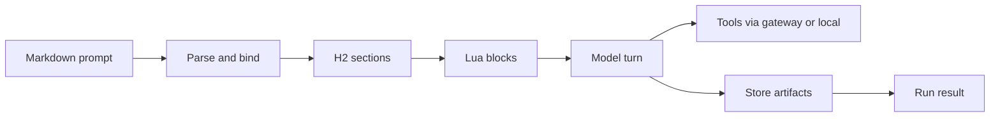

[](https://github.com/cppalliance/promptforge/actions/workflows/ci.yml)
[](LICENSE)

# PromptForge

A runtime that executes AI prompt pipelines defined in a single markdown file. The markdown is the program, the model is the CPU.


## Downloads

Get the Workshop, the desktop app for writing and running prompts:

- **Windows**: [PromptForge-setup.exe](https://github.com/cppalliance/promptforge/releases/download/workshop-latest/PromptForge-setup.exe)
- **macOS (Apple Silicon)**: [PromptForge-arm64.dmg](https://github.com/cppalliance/promptforge/releases/download/workshop-latest/PromptForge-arm64.dmg)
- **macOS (Intel)**: [PromptForge-x64.dmg](https://github.com/cppalliance/promptforge/releases/download/workshop-latest/PromptForge-x64.dmg)
- **Linux**: [PromptForge.AppImage](https://github.com/cppalliance/promptforge/releases/download/workshop-latest/PromptForge.AppImage) or [PromptForge.deb](https://github.com/cppalliance/promptforge/releases/download/workshop-latest/PromptForge.deb)

These links always point at the latest tested release. Running a headless gateway instead? Grab a [nightly build](https://github.com/cppalliance/promptforge/releases/tag/nightly) or build from source below. Embedding the engine in your own program? The [guide](https://cppalliance.github.io/promptforge/) covers every audience.

## What you get

The Workshop is the desktop application. It edits prompts as visible stacks of blocks, runs them against your gateway, and records every run, edit, and decision in an append-only event log. The app updates itself from the release channel.

The gateway is the one process that holds your credentials. It serves an OpenAI-compatible API, routes chat completions to frontier APIs or to local models on your own hardware, and keeps vendor keys off every other process. One configuration file defines the model catalog, the concurrency pools, and the search tool. When STT is enabled, the gateway binds and serves first, then loads speech once through its queued boot command; later configuration changes to speech take effect on restart. Operational status reports generic configured, ready, and GPU facts, while the model catalog advertises only active speech models.

The two ship as separate programs that talk over HTTP: `promptforge-gateway` (the server) and `promptforge-workshop` (the desktop window, which hosts its own server in-process). The installer offers three independent components: **Gateway**, **Workshop**, and **STT** (speech-to-text; a configuration gate, since the runtime and models download on demand). A Gateway-only install is the headless server; a Workshop-only install is a client that attaches to a gateway over the network. With both installed, launching the Workshop attaches to the running gateway or starts one, and closing the window leaves the gateway - and its loaded models - running in the system tray. The tray menu carries **Workshop** (reopens the window), **Settings** (opens the configuration UI in your browser), and **Quit**; the window's own quit command (Quit PromptForge and Gateway) stops both at once.

The prompt language is the programming surface. A prompt is a markdown document: YAML frontmatter for metadata, embedded Lua for logic, prose blocks for model instructions. The engine executes it with deterministic control flow, isolated sections, and fan-out concurrency set in configuration. The same language is available as a Rust library, so your own programs can run prompts in-process.


## Quick example

````markdown
---
name: greet
description: Greet the named input using a Lua-computed value
promptforge: 0
---

# Greet

```lua
models.default("writer", "A model suited for careful analysis, coding, and general assistance")
```

## Main

```lua
var.greeting = "Hello, " .. args .. "!"
```

Repeat exactly, with no extra words: {{ var.greeting }}

```lua
return models.infer(prose)
```
````

Lua sets up the turn. The prose before a Lua block is that block's lazy `prose` value, and the block passes it to the model explicitly. The response is the run's result.


## Build from source

Every build needs Rust and Node.js 22. The two web UIs are bundled with esbuild during the Cargo build, so run `npm ci` once in each `ui/` folder after cloning:

```bash
git clone git@github.com:cppalliance/promptforge.git
cd promptforge
npm ci --prefix crates/workshop-server/ui
npm ci --prefix crates/gateway-config-ui/ui
```

`cargo build` builds only the gateway, the default workspace member. `cargo workshop` is the normal one-command Workshop build: it builds the gateway first, stages Tauri's target-suffixed temporary sidecar, builds the desktop app in the same profile and target, and removes the staged copy. Use `cargo workshop --release` for release binaries or `cargo workshop --target <triple>` for an explicit target. Ctrl+C terminates the active build subprocess, removes staging when staging has begun, and exits with failure. Platform notes:

- **Ubuntu 22.04**: `sudo apt install build-essential pkg-config cmake clang libclang-dev`; the desktop app also needs `libwebkit2gtk-4.1-dev libssl-dev librsvg2-dev`.
- **macOS**: `xcode-select --install` and `brew install cmake node`, then `cargo workshop`.
- **Windows**: install Visual Studio with the "Desktop development with C++" workload and Node.js 22, then `cargo workshop`.

`cargo build -p workshop` is a low-level package build. It requires a real gateway executable to have already been staged at `crates/workshop/binaries/promptforge-gateway-<target-triple>` and does not clean that staging afterward. Bundling with `cargo tauri build` has the same staging requirement; the release workflows under `.github/workflows/` show the exact packaging commands per platform.

The first build downloads the tool picker's embedding model (~130MB from Hugging Face, pinned and checksummed). Later builds reuse the cache.


## How it works

Parse a promptforge markdown file, bind the tools and models it needs, then execute each H2 section in order. Section Lua prepares state; the section's prose is available to its Lua as the lazy `prose` value, which the author passes to `models.infer` or a `models.loop` message list (with tool dispatch when tools are in scope); results land in the store or become the run output.



## Documentation

- [PromptForge Guide](https://cppalliance.github.io/promptforge/) - four documentation sets: the Workshop, the gateway, the prompt language, and agent programs

Build the guide locally with `mdbook build guide`.


## Contributing

Build, format, and test before you open a PR. CI runs `cargo fmt --check`, `clippy -D warnings`, and `cargo test --workspace`.

To enable automatic local pre-commit and pre-push validation hooks:

```bash
git config core.hooksPath .githooks
```


## License

Distributed under the [Boost Software License 1.0](LICENSE).
