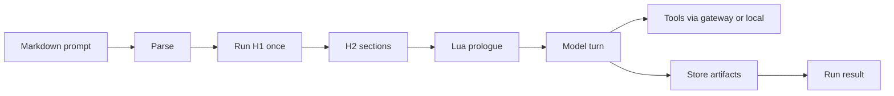

[](LICENSE)
[](https://www.rust-lang.org/)

# PromptForge

A runtime that executes analysis pipelines defined in a single markdown file. The markdown is the program. The model is the CPU. Live H1 Lua resolves tools and models, the store carries artifacts between sections, and a credential-holding gateway keeps vendor keys off the prompt process.


## What you get

- 📄 **Markdown prompts** - frontmatter, one H1, H2 sections that run top to bottom
- 🔧 **Lua control** - resolve tools and models live, compute values, write the store, fan out work
- 🌐 **Tools that ship** - local `web_fetch`, gateway-backed `web_search`, semantic capability resolution
- 🔌 **Inference gateway** - OpenAI-shaped chat, bearer auth, catalog at `GET /v1/models`
- 🛰️ **MCP server** - run prompts from an agentic harness over streamable HTTP or stdio


## Quick example

````markdown
---
name: greet
description: Greet the named input using a Lua-computed value
promptforge: 1
---

# Greet

```lua
models.always("writer", "A model suited for careful analysis, coding, and general assistance")
```

## Main

```lua
var.greeting = "Hello, " .. args .. "!"
```

Repeat exactly, with no extra words: {{ var.greeting }}
````

Prose goes to the model. Lua sets up the turn. The response is the run's result.


## Getting started

**Prerequisites:** Rust 1.89+, a gateway profile (`gateway.toml`), and a model credential (or a local `llama-server` profile).

```bash
git clone git@github.com:cppalliance/promptforge.git
cd promptforge
cargo build
```

The first build downloads the tool picker's embedding model (~130MB from Hugging Face, pinned and checksummed). Later builds reuse the cache.

Two processes: the gateway holds the vendor credential; the client points at it.

```bash
export ANTHROPIC_API_KEY=sk-ant-...
export PROMPTFORGE_GATEWAY_KEY=dev-secret
cargo run -p promptforge-gateway -- serve gateway.toml &

export PROMPTFORGE_GATEWAY_URL=http://127.0.0.1:8081/v1
cargo run -p promptforge-cli -- run prompts/hello.md
```

Interactive prompt work against an already-running gateway:

```bash
cargo run -p promptforge-dev -- prompts/greet.md "world" --watch
```


## How it works

Parse a promptforge markdown file, run H1 once with live tool and model resolution, then execute each H2 section in order. Section Lua prepares state; prose becomes a model turn (with a tool loop when tools are in scope); results land in the store or become the run output.




## Project layout

| Crate | Role |
| --- | --- |
| `promptforge-core` | Parser, section execution, Lua, store, gateway client |
| `promptforge-cli` | `promptforge run` binary |
| `promptforge-gateway` | Inference gateway and model catalog |
| `promptforge-mcp-server` | MCP server for agentic harnesses |
| `promptforge-webfetch` | In-process `web_fetch` tool |
| `promptforge-tool-picker` | Semantic tool capability resolution |
| `promptforge-dev` | Interactive prompt development (unpublished) |
| `promptforge-core-tests` | Offline tests and opt-in real-model scenarios (unpublished) |

## Documentation

- [User Guide](user-guide.md) - progressive tutorial for writing prompts
- [DEVELOPMENT.md](DEVELOPMENT.md) - gateway config, store API, architecture, dev workflow
- [design-core.md](crates/promptforge-core/design-core.md) - core design notes


## Contributing

Build, format, and test before you open a PR. See [DEVELOPMENT.md](DEVELOPMENT.md) for gateway profiles, the prompt-dev loop, and crate boundaries. CI runs `cargo fmt --check`, `clippy -D warnings`, and `cargo test --workspace`.


## License

Distributed under the [Boost Software License 1.0](LICENSE).
