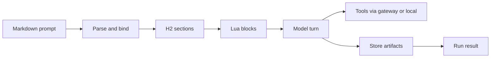

[](https://github.com/cppalliance/promptforge/actions/workflows/ci.yml)
[](https://crates.io/crates/promptforge-cli)
[](LICENSE)
[](https://www.rust-lang.org/)

# PromptForge

A runtime that executes AI prompt pipelines defined in a single markdown file. The markdown is the program, the model is the CPU. YAML frontmatter for metadata, embedded Lua for logic, prose blocks for model instructions, and a credential-holding gateway that keeps vendor keys off the prompt process. Write a prompt, run it, get a result.


## What you get

- 📄 **Markdown prompts** - frontmatter, one H1, H2 sections that run top to bottom
- 🔧 **Lua control** - bind tools and models, compute values, write the store, fan out work
- 🌐 **Tools that ship** - local `web_fetch`, gateway-backed `web_search`, semantic capability binding
- 🔌 **Inference gateway** - OpenAI-shaped chat, bearer auth, catalog at `GET /v1/models`


## Quick example

````markdown
---
name: greet
description: Greet the named input using a Lua-computed value
promptforge: 1
---

# Greet

```lua
models.default("writer", "A model suited for careful analysis, coding, and general assistance")
```

## Main

```lua
var.greeting = "Hello, " .. args .. "!"
```

Repeat exactly, with no extra words: {{ var.greeting }}
````

Prose goes to the model. Lua sets up the turn. The response is the run's result.


## Quick start

```bash
cargo install promptforge-cli gateway
gateway serve gateway.toml --profile main &
promptforge run prompts/hello.md
```

Two processes: the gateway holds the vendor credential; the client points at it.

```bash
export ANTHROPIC_API_KEY=sk-ant-...
export PROMPTFORGE_GATEWAY_API_KEY=dev-secret
cargo run -p gateway -- serve gateway.toml --profile main &

export PROMPTFORGE_GATEWAY_URL=http://127.0.0.1:8081/v1
cargo run -p promptforge-cli -- run prompts/hello.md
```

## Build from source

Every build needs Rust 1.89 or later and Node.js 22. The two web UIs are bundled with esbuild during the Cargo build, so run `npm ci` once in each `ui/` folder after cloning:

```bash
git clone git@github.com:cppalliance/promptforge.git
cd promptforge
npm ci --prefix crates/workshop-server/ui
npm ci --prefix crates/gateway-config-ui/ui
```

`cargo build` builds the gateway, the default workspace member. `cargo build -p workshop` builds the desktop app. See the [gateway README](crates/gateway/README.md) for the feature details.

### Ubuntu 22.04

```bash
sudo apt install build-essential pkg-config cmake clang libclang-dev
# only for the desktop app (workshop):
sudo apt install libwebkit2gtk-4.1-dev libxdo-dev libssl-dev libayatana-appindicator3-dev librsvg2-dev
```

```bash
cargo build
cargo build -p workshop --no-default-features
```

### macOS

```bash
xcode-select --install
brew install cmake node
```

```bash
cargo build
cargo build -p workshop --no-default-features
```

### Windows

Install Visual Studio with the "Desktop development with C++" workload and Node.js 22. PromptForge downloads its pinned CUDA-enabled whisper.cpp runtime on first use, so building the workshop needs neither CMake nor the CUDA toolkit.

```bash
cargo build
cargo build -p workshop
```

The first build downloads the tool picker's embedding model (~130MB from Hugging Face, pinned and checksummed). Later builds reuse the cache.


## How it works

Parse a promptforge markdown file, bind the tools and models it needs, then execute each H2 section in order. Section Lua prepares state; prose becomes a model turn (with a tool loop when tools are in scope); results land in the store or become the run output.




## Crates

| Crate | Description | crates.io |
| --- | --- | --- |
| [promptforge](crates/promptforge) | Integrator facade: `pipeline::run` for document prompts, `agent::run` for agent programs | not published |
| [promptforge-core](crates/promptforge-core) | Parser, executor, Lua runtime, store, gateway client | [](https://crates.io/crates/promptforge-core) |
| [promptforge-core-support](crates/promptforge-core-support) | Shared host-support primitives: untrusted guards, cooperative cancellation, run observation | [](https://crates.io/crates/promptforge-core-support) |
| [promptforge-cli](crates/promptforge-cli) | `promptforge run` command-line binary | [](https://crates.io/crates/promptforge-cli) |
| [gateway](crates/gateway) | Inference gateway with model catalog and credential isolation | [](https://crates.io/crates/gateway) |
| [build-llama-cuda](crates/build-llama-cuda) | Command-line builder of the CUDA `llama-server` release zip; runs on the GitHub build machine | not published |
| [promptforge-model-client](crates/promptforge-model-client) | Gateway model client: OpenAI-shaped completions transport, wire types, model catalog and binding vocabulary | [](https://crates.io/crates/promptforge-model-client) |
| [gateway-local](crates/gateway-local) | Gateway-owned local inference: GGUF provisioning, artifact store, managed `llama-server` lifecycle | [](https://crates.io/crates/gateway-local) |
| [gateway-protocol](crates/gateway-protocol) | OpenAI wire protocol and upstream abstraction for the gateway | [](https://crates.io/crates/gateway-protocol) |
| [gateway-routing](crates/gateway-routing) | Routing vocabulary for the gateway: `Model`/`Endpoint` table entries and dominion admission queues | [](https://crates.io/crates/gateway-routing) |
| [promptforge-lua](crates/promptforge-lua) | Sandboxed Lua runtime: the section VM, coroutine protocol, and host surface | [](https://crates.io/crates/promptforge-lua) |
| [promptforge-parser](crates/promptforge-parser) | Prompt document parser: frontmatter, section tree, exact `lua` fence splitting, `ParseError` vocabulary | [](https://crates.io/crates/promptforge-parser) |
| [shared-progress](crates/shared-progress) | Progress vocabulary: operation-scoped weighted trees, process hub, coalesced events, remote import | not published |
| [gateway-stt](crates/gateway-stt) | Gateway-owned STT runtime: artifact provisioning, engine lifecycle, `/stt`, and OpenAI transcription | not published |
| [promptforge-store](crates/promptforge-store) | Run-scoped virtual filesystem: `Store` backend contract, `MemStore`/`FileStore` backends, shared `StoreRef` handle | [](https://crates.io/crates/promptforge-store) |
| [promptforge-tool-picker](crates/promptforge-tool-picker) | Semantic tool resolution via sentence embeddings | [](https://crates.io/crates/promptforge-tool-picker) |
| [promptforge-tools](crates/promptforge-tools) | Runtime-agnostic tool contract: `Tool`, `ToolCatalog`, `ToolId` | [](https://crates.io/crates/promptforge-tools) |
| [promptforge-webfetch](crates/promptforge-webfetch) | SSRF-safe web fetch tool for model-supplied URLs | [](https://crates.io/crates/promptforge-webfetch) |
| [promptforge-web-search](crates/promptforge-web-search) | Web search tool proxying through the gateway with credential isolation | [](https://crates.io/crates/promptforge-web-search) |
| [gateway-web-search](crates/gateway-web-search) | Gateway-side web-search service: Brave provider client, request validation, result post-processing | [](https://crates.io/crates/gateway-web-search) |
| [gateway-whisper-ffi](crates/gateway-whisper-ffi) | Runtime-loaded safe wrapper over PromptForge's pinned whisper.cpp C API | not published |
| [gateway-transcribe](crates/gateway-transcribe) | Whisper transcription engine: inference workers, segmentation, silence gating | not published |
| [promptforge-agent](crates/promptforge-agent) | Promptforge library agent-program executor: `run_agent` drives `.lua` agent programs over the promptforge substrate | not published |
| [workshop-server](crates/workshop-server) | Workshop HTTP server: agent sessions, model catalog passthrough, workspace API, and UI assets | not published |
| [workshop](crates/workshop) | Workshop desktop app (Tauri): boots the gateway and opens the window | not published |

## Documentation

- [PromptForge User Guide](https://cppalliance.github.io/promptforge/) - full documentation
- [User Guide](guide/promptforge-user-guide.md) - progressive tutorial for writing prompts
- [design-core.md](design/design-core.md) - core design notes

Build the guide locally with `mdbook build guide`.


## Minimum Rust Version

Rust 1.89 or later.

## Contributing

Build, format, and test before you open a PR. CI runs `cargo fmt --check`, `clippy -D warnings`, and `cargo test --workspace`.


## License

Distributed under the [Boost Software License 1.0](LICENSE).
