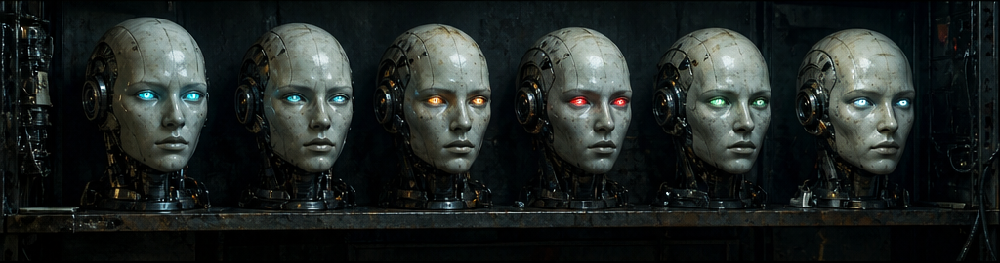

# PromptForge

PromptForge runs AI prompt pipelines defined in a single Markdown file. The Markdown is the program, and the model is the CPU.

Workshop is the desktop app for writing prompts, running them against local or remote models, and reviewing every run it records. Installers for Windows, macOS, and Linux are on the [latest release](https://github.com/cppalliance/promptforge/releases/tag/workshop-latest).

The gateway is the one process that holds model credentials. It routes each model request to a cloud provider or to a model running on the user's own machine, so no other process ever sees a vendor key.

A prompt combines frontmatter, Lua code, and prose sections. The Engine runs it as a deterministic state machine, and the Harness performs every model call, tool call, and file access the Engine asks for. Workshop is one Host, and any other program can be a Host by running prompts through the same Harness.

The [documentation](https://cppalliance.org/promptforge/) covers the prompt language, Workshop, the gateway, and the library references.

Pull requests are welcome, and every change must pass the formatting, lint, and test checks that CI runs.

PromptForge is distributed under the [Boost Software License](LICENSE).
