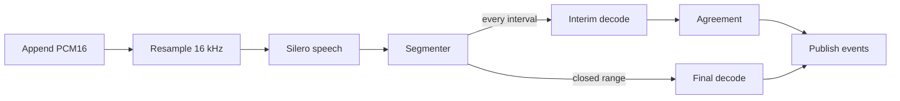

# Speech-to-text

This directory holds the gateway's speech-to-text subsystem, which turns recorded speech into text for gateway clients. The subsystem is private to the gateway family, and the rest of the family reaches it only through the transcription service.

## Crates

| Directory | Package | Owns |
|---|---|---|
| `api/` | `gateway-stt` | The batch endpoint, the realtime WebSocket session, audio buffering and resampling, segmentation, each take's transcript state, and publication |
| `engine/` | `gateway-stt-engine` | Backend-neutral decoder and detector contracts, the worker threads, and the decode policy |
| `backend-whisper/` | `gateway-stt-backend-whisper` | Whisper decoders, the Silero detector, per-role decode profiles, prompts, and the interim guard |
| `whisper-ffi/` | `gateway-whisper-ffi` | The runtime-loaded whisper.cpp C ABI, and the only `unsafe` code in the subsystem |

`api` depends on `engine` and `backend-whisper`, and `backend-whisper` depends on `engine` and `whisper-ffi`. `engine` depends on no whisper crate, so its worker and queue logic runs under Miri.

## One take

1. The client appends 24 kHz PCM16 as Base64 to `AudioBuffer` (`api/src/audio.rs`). `Resampler24To16` low-pass filters it to 16 kHz with a polyphase FIR. Each `n` input samples yield exactly `ceil(2n / 3)` output samples, and the audio runs 1 ms behind its timeline.
2. `Segmenter` (`api/src/segment.rs`) classifies every 32 ms chunk with the take's `SpeechDetector`, which is Silero in production (`backend-whisper/src/silero.rs`). The endpoint rules (`api/src/segment/endpoint.rs`) close a segment after 2 s of silence, or after 0.2 s when the latest accepted interim text ends a sentence or the speech run was shorter than 1 s. Continuous speech is cut into forced strides of 10.016 s, at the longest late pause when there is one, and each forced window overlaps its predecessor by 8 s.
3. Every interval tick, 500 ms by default, the session decodes the window that ends at the speech tail with the interim model, and skips a window that holds no new speech. `WholeWindowState` (`api/src/take/window.rs`) folds each hypothesis into agreed and tentative text.
4. Closed ranges go to the take's `FinalPipeline` (`api/src/take/finalization.rs`) and are decoded with the final model, conditioned on the take's decoded history. `TakeState` (`api/src/take/state.rs`) applies the outcomes in audio order.
5. The session publishes hypothesis snapshots or standard deltas (`api/src/realtime/session/route.rs`), and a commit produces the completed transcript.

## Transcript states

A hypothesis snapshot shows `finalized + agreed + tentative`. These states feed it:

| State | Lives in | Meaning and invariant |
|---|---|---|
| Finalized text | `FinalizedState.text`, `api/src/take/state.rs` | The settled transcript through `samples`. It only grows, by final outcomes in audio order or by accepted interim text that stands in for a range the final pass skipped. |
| Decoded text | `FinalizedState.decoded_text` | The finalized text that final decodes produced, without the accepted interim text. It is the history the next final decode is conditioned on, because whisper copies its prompt's style and interim text often lacks punctuation. |
| Agreed text | `Agreement`, `api/src/take/window/evidence.rs` | A word is agreed once it holds at the same position in at least 2 hypotheses whose audio ends are at least 0.5 s apart. Agreed text never shrinks: a hypothesis that disputes it replaces only the tentative text after it. A last word that ends in punctuation waits for a later hypothesis to continue past it. |
| Tentative text | `InterimSnapshot.tentative`, `api/src/take/interim.rs` | The rest of the active hypothesis after its agreed text. It can change on every tick. |
| Accepted hypotheses | `WholeWindowState.pending`, `api/src/take/window.rs` | Earlier hypotheses the window accepted and still renders, shown agreed, ahead of the active one. At most 2048 are retained. |
| Pending forced text | `FinalizedState.pending_forced` | A forced window's final text, shown but not yet authoritative. When the successor window arrives, the pending text before the overlap becomes finalized and the successor becomes pending. Pending text never enters a final decode's prompt. |
| Anchored suffix | `FinalizedState.anchored`, `api/src/take/live_prefix.rs` | Up to 5 displayed words after a natural final's last word, kept live when the 2 displayed tokens before them equal the final's last tokens, and dropped when they only repeat the final. It lives until the next final outcome and seeds the next window's agreement once (`seeded_through`). |
| Held closed ranges | `TakeState.held`, `api/src/take/finalization/retry.rs` | Closed ranges that wait in audio order, with their PCM resident, for a final queue slot. When new audio would exceed the retained PCM cap, the oldest one is released and its accepted interim text becomes final. |

## Interim and final passes

| | Interim | Final |
|---|---|---|
| Recommended model | `base.en` | `small.en` |
| Runs | Every interval tick | When a segment closes or a stride is forced, and at commit |
| Profile (`backend-whisper/src/profile.rs`) | One segment, no temperature fallback, an encoder context fit to the window, 4 tokens per window second, token timestamps | Whisper's defaults with multiple segments |
| Prompt (`backend-whisper/src/prompt.rs`) | The glossary alone | The glossary and the decoded history |
| Guard (`backend-whisper/src/guard.rs`) | Drops a pass that is likely silent and low in confidence, and collapses 4 or more copies of a word or phrase | None |

The glossary lists the `[stt] vocabulary` first, then the comma-separated terms of the client's prompt - a Realtime session's transcription prompt or a batch request's `prompt` field (`api/src/guidance.rs`). A glossary trimmed to fit the prompt budget drops the client's trailing terms first.

Both passes decode English only (`backend-whisper/src/model.rs`), and the batch endpoint rejects any other `language`.

## Workers and backpressure

- `SttEngine` (`engine/src/engine.rs`) runs one OS thread per role, `stt-interim` and an optional `stt-final` (`engine/src/worker.rs`).
- Each worker's queue holds 8 jobs. A full queue fails the request with `TranscribeError::Overloaded` instead of blocking, and the session skips that interim tick and sends the same window again later.
- Each take keeps up to 4 closed segments in its final pipeline. Further closed ranges wait in the held queue.
- Dropping a request's reply skips its decode, and a request's cancellation flag aborts whisper during a pass. Shutdown closes the queue and joins the thread.
- A take retains at most 30 s of PCM (`api/src/take/pcm.rs`), and the budget counts allocated capacity once. An append reserves only the buffer's growth, or its own capacity when it becomes the buffer, and spare capacity the buffer already holds is not charged again. A rejected append reports the retained and requested durations against the 30 s limit.

## Testing

- Replay: `api/tests/it/replay.rs` replays the scripted and natively captured takes in `api/tests/fixtures/replay/` against golden snapshots, `metrics.json`, and the thresholds in `baseline.json`. `PROMPTFORGE_REPLAY_UPDATE=1` rewrites the snapshots and metrics, and adds baseline sections only for new fixtures. A native fixture is never edited by hand; a new capture gets a new name.
- Metrics: UPWR counts displayed words that a later update revises, per completed word. UPSR is the share of updates that revise anything. Partial latency and commit lag are regression proxies, not measured recognition latency: a word's audio end is estimated by spreading a final's words evenly, and a word counts only once it shows correctly at its position.
- Hour simulation: `realtime_forced_windows::hour` runs one take through an hour of fixture audio whose levels encode time, and checks every decoded window bit for bit against the production resampler's output.
- Native tests are `#[ignore]`d. They read `PROMPTFORGE_WHISPER_LIBRARY`, `PROMPTFORGE_WHISPER_MODEL`, the optional `PROMPTFORGE_WHISPER_FINAL_MODEL`, `PROMPTFORGE_WHISPER_AUDIO` with its `<stem>-lines.json` beside it, `PROMPTFORGE_SILERO_MODEL`, `PROMPTFORGE_NOISE_CLIPS`, and, on the gateway path, `PROMPTFORGE_WHISPER_BACKEND`. Run them one at a time, with `--run-ignored only --test-threads 1` under nextest or `-- --ignored --test-threads=1` under `cargo test`.
- Long speech: `realtime_long_speech` (`api/tests/it/long_speech.rs`) streams six LibriSpeech test-clean clips (CC BY 4.0) through a production Realtime session as 100 ms appends, each followed by a 100 ms sleep on the wall clock, and fails when a completed transcript lacks five or more consecutive reference words. It shares its session setup with the replay capture (`api/tests/it/native_session.rs`). `PROMPTFORGE_LONG_SPEECH_CLIPS` names the directory that holds `clips.json` and the 16 kHz mono WAV files it lists, and the test returns at once when it is unset. Run it with `PROMPTFORGE_WHISPER_MODEL` at `ggml-base.en.bin` for captions and `PROMPTFORGE_WHISPER_FINAL_MODEL` at `ggml-small.en.bin` for finals. The clips are `260-123288-0015`, `8224-274381-0005`, `4077-13751-0018`, `5105-28233-0007`, `2300-131720-0028` and `3575-170457-0046`, packed as release asset `stt-long-speech-1.zip` on `cppalliance/promptforge` with SHA256 `C8BB0618630D5FA76026F2B6CEC5EC3A0227DC12F710FB0BF01D12FDF1ED3FC7`.
- CI: `.github/workflows/stt-miri.yml` runs the `miri_` tests of `gateway-stt-engine` and `gateway-stt` under Miri. On the self-hosted CUDA runner it runs the native tests with `tiny.en` and `jfk.wav`: `native_whisper`, `native_silero` without its noise test, `native_interim_timing`, `native_warm_up`, the prompt budget tests, and the ignored tests of `gateway-whisper-ffi` and `gateway-stt`. CI does not load the recommended `base.en` and `small.en` pair, so it checks behavior, not accuracy.
