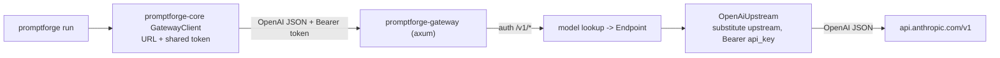

# PromptForge Gateway v0 (walking skeleton)

## Goal

Add the `promptforge-gateway` vertebra to the skeleton and **move the LLM credential out of the executor into the gateway**. This is breadth-first: stand the crate up, establish the seam, defer everything hard.

The vertical slice: `promptforge run prompts/hello.md` -> core's `GatewayClient` (holds only the gateway URL + a shared token) -> `promptforge-gateway` (holds `ANTHROPIC_API_KEY`, maps the model name, forwards) -> Anthropic's OpenAI-compatible endpoint -> reply prints. Same output as today, but the executor no longer knows any vendor.

## Two decisions (veto at confirmation)

- **Same workspace.** New crate `crates/promptforge-gateway` (binary + thin lib target), not a separate repo. Rationale: the end-to-end test drives the gateway with core's real client in one `cargo test`, and it matches the design's "binary crate with a thin library target."
- **Rewire now.** Core stops reading `ANTHROPIC_API_KEY` and points at the gateway. Consequence: `promptforge run` now requires the gateway running. If you'd rather stand the crate up but keep core direct-to-Anthropic this round, say so and I'll split it.

## Scope

In: axum server, `gateway.toml` parse with `${VAR}` interpolation + `Secret`, exact model lookup (404 on miss), one `openai` passthrough `Upstream`, bearer auth on `/v1/*`, `POST /v1/chat/completions`, `GET /health`, response `model` rewritten to the caller's name, core rewired to `GatewayClient`.

Out (deferred, one-line note in the crate doc so each is a decision not an omission): admission control / permits, endpoint pinning, model packs, hot reload, the Anthropic protocol shim (v0's single endpoint IS Anthropic's OpenAI-compatible endpoint, so `openai` passthrough suffices), streaming, `/metrics` `/status`, and the three OS service installers.

## Architecture



## New crate: `crates/promptforge-gateway`

Binary `promptforge-gateway` plus a lib target (types are `promptforge_gateway::Type`). Modules:

- `config.rs` - `Config`, `ServerConfig`, `EndpointConfig`, `ModelConfig`, `Secret`. Parse `gateway.toml` via the `toml` crate. `${VAR}` expanded from the process env at load (`$$` escapes a literal `$`); an unresolved var fails the load. `Config::validate` rejects: duplicate endpoint/model names, a model naming an undefined endpoint, an empty endpoint list, an unknown model on load. `Secret(String)` with no `Serialize`, `Debug`/`Display` both print `redacted`, one `expose()` accessor.
- `wire.rs` - gateway-owned request/response structs (NOT shared with core; JSON is the contract). Minimal viable set:
  ```rust
  #[derive(Deserialize, Serialize)]
  pub struct ChatRequest {
      pub model: String,
      pub messages: Vec<Value>,
      #[serde(flatten)] pub rest: Map<String, Value>, // passthrough
  }
  #[derive(Deserialize, Serialize)]
  pub struct ChatResponse {
      pub model: String,                 // rewritten to caller's name
      pub choices: Vec<Value>,
      #[serde(flatten)] pub rest: Map<String, Value>,
  }
  ```
  Using `Value` for `messages`/`choices` in v0 keeps the passthrough total; typed messages/tools arrive with the tool-call tranche.
- `upstream.rs` - `trait Upstream { async fn send(&self, req: ChatRequest, model: &Model) -> Result<ChatResponse, GatewayError>; }` and `OpenAiUpstream { base_url, key: Secret, http: reqwest::Client }` that substitutes `model.upstream` into the body, POSTs to `{base_url}/chat/completions` with `Bearer`, and restores the caller's `model` on the way back. Trait object so tests inject a stub.
- `routing.rs` - `Routing { models: HashMap<String, Arc<Model>> }`, `Model { name, upstream, endpoint: Arc<Endpoint> }`, `Endpoint { upstream: Arc<dyn Upstream> }`. `routing.model(name) -> Result<_, UnknownModel>`. (Single endpoint per model in v0; fewest-in-flight selection is deferred with admission control.)
- `error.rs` - `GatewayError` subset -> HTTP status + OpenAI error envelope `{error:{message,type,code}}`: `Unauthorized`(401), `UnknownModel`(404), `MalformedRequest`(400), `UpstreamTransport`(502), `UpstreamStatus`(passthrough class). Enough shape that the fuller table drops in later.
- `lib.rs` - `build_router(state) -> axum::Router` with `POST /v1/chat/completions`, `GET /health`; a bearer-auth layer on `/v1/*` comparing against `server.token`. `AppState { routing: Arc<Routing>, token: Secret }`.
- `main.rs` - positional config path (`promptforge-gateway serve <gateway.toml>`), build a multi-thread tokio runtime inside `main` (no `#[tokio::main]`, matching the design's rationale for the future service handler), `axum::serve`. Basic `tracing_subscriber` to stdout for v0.

Handlers: `/health` -> `200 {"status":"serving"}` (no auth). `/v1/chat/completions` -> auth, parse body, `routing.model(&req.model)?`, `endpoint.upstream.send(...)`, return JSON.

## Modify `crates/promptforge-core`

- [crates/promptforge-core/src/client.rs](crates/promptforge-core/src/client.rs): the client now targets the gateway. `PROMPTFORGE_BASE_URL` (e.g. `http://127.0.0.1:8081/v1`) and `PROMPTFORGE_TOKEN` (the shared bearer). Drop `ANTHROPIC_API_KEY` and the Anthropic default URL from core. Keep `PROMPTFORGE_MODEL` (default `claude-sonnet-4-6`, must match a `[[model]]` name). Rename `Client` -> `GatewayClient` to make the seam legible; update `execute.rs`, `main.rs`, `lib.rs` re-exports.
- Everything else in core is unchanged; the request/response structs stay core's own (deliberate duplication).

## Config files (repo root)

`gateway.toml` (dev):
```toml
[server]
bind = "127.0.0.1:8081"
token = "${PROMPTFORGE_TOKEN}"

[[endpoint]]
name = "anthropic"
protocol = "openai"                       # Anthropic's OpenAI-compatible endpoint
base_url = "https://api.anthropic.com/v1"
api_key = "${ANTHROPIC_API_KEY}"

[[model]]
name = "claude-sonnet-4-6"
upstream = "claude-sonnet-4-6"
endpoints = ["anthropic"]
```

## Workspace deps to add

`axum = "0.8"`, `toml = "0.8"`, `tracing`, `tracing-subscriber`. Reuse workspace `serde`, `serde_json`, `reqwest`, `tokio`, `thiserror`. Add the crate to `[workspace] members`.

## Tests

- `config`: `${VAR}` interpolation incl. `$$` and unresolved-var-fails-load; `validate` rejects duplicate names, undefined endpoint, empty endpoint list; `Secret` redacts through `Debug`/`Display`.
- `routing`: model hit; unknown model -> `UnknownModel`.
- `handler` (via `tower::ServiceExt::oneshot`, stubbed `Upstream`): missing/wrong bearer -> 401; unknown model -> 404; happy path returns the stub's `ChatResponse` with `model` rewritten to the requested name; `/health` -> 200 without auth.
- `end-to-end with the real client` (the design's honesty test, in miniature): start the gateway on an ephemeral port with an endpoint pointed at a tiny in-test fake backend (axum returning a canned completion), drive it with core's `GatewayClient`, assert the reply. Full fake-backend fidelity (SSE, Anthropic translation, admission) is deferred.
- Manual: `promptforge-gateway serve gateway.toml` in one shell, `promptforge run prompts/hello.md` in another, prints "Hello, world!".

## Housekeeping

- Update [STATUS.md](STATUS.md): gateway v0 exists and holds the key; core talks through it; how to run both processes; deferred-list recorded under decisions.
- Update [README.md](README.md): new crate in the workspace list; two-process run instructions.
- Retire the finished tranche 1 plan: move `C:\Users\Vinnie\.cursor\plans\promptforge_executor_tranche_1_08fd6c2c.plan.md` to `cabinet/_trash/` (per cabinet rules, never delete). State on execution: "Moving promptforge_executor_tranche_1_08fd6c2c.plan.md to _trash/. It can be recovered from there."
- Commit.

## Verification

`cargo build`, `cargo clippy --all-targets` clean, `cargo test` green, and the manual two-process run prints the greeting.