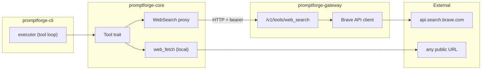

# Brave Web Search and Web Fetch Tools

## What We Are Building

Two built-in tools for promptforge - `web_search` (Brave API, credential held by gateway) and `web_fetch` (local HTTP fetch + HTML-to-markdown) - plus the executor loop that lets a model call tools and receive results.

## High-Level Components (dependency order)

1. **Gateway tools config + route** - no dependency on other new work; the gateway already has config parsing and axum routes, this adds one optional section and one endpoint
2. **Core Tool trait** - depends on nothing new; defines the interface
3. **Core tool implementations** (WebFetch, WebSearch proxy) - depend on the trait
4. **Core client extension** (tool schemas in request, tool_calls in response) - depends on the trait for schema generation
5. **Core executor loop** - depends on client extension + trait
6. **Frontmatter + CLI wiring** - depends on everything above
7. **Documentation** - depends on everything being done

## Architecture



- **Gateway** owns the Brave API key, exposes `POST /v1/tools/web_search`, does NOT depend on core
- **Core** owns the `Tool` trait, both tool implementations, and the executor loop

## Key Design Decisions

- Gateway does not depend on `promptforge-core` (credential proxy only)
- `web_fetch` runs locally (no credential needed), `web_search` proxies through gateway
- No feature gates - one binary, unconditional
- Tool-call loop caps at 10 iterations to prevent runaway
- `readabilityrs` for content extraction (93.8% Mozilla test suite, built-in markdown output); `htmd` as fallback for non-article pages

## Rust Conventions (from how-to-write-rust)

- **Module layout**: `src/tools.rs` parent file + `src/tools/` directory for children (not `mod.rs`)
- **Async trait**: use `async fn` in traits directly (edition 2024, Rust 1.85+) - no `#[async_trait]` macro needed. However, if dyn dispatch is required (which it is for `&[&dyn Tool]`), we need `async_trait` or a boxed future return. Use `async_trait` since dyn compatibility requires it.
- **Errors**: `thiserror` derive, `#[non_exhaustive]`, `Display` as lowercase noun phrase, no trailing period
- **Visibility**: `pub(crate)` default; bare `pub` only for the real public API
- **Docs**: `///` on every public item, `# Errors` on fallible fns, `# Examples` where useful
- **No unwrap**: use `expect` with invariant message or return `Result`
- **Testing**: unit tests in `#[cfg(test)] mod tests` in same file; integration tests at `tests/it/main.rs`
- **Parameters**: take `&str` not `String`, `&[T]` not `Vec<T>`; return owned
- **Naming**: `UpperCamelCase` for types, `snake_case` for functions/modules
- **Lints**: workspace lints already set; new code must satisfy them

## Steps

Each step is one commit with its code, test, and docs.

### Step 1: Gateway tools config

Add optional `[tools.web_search]` section to gateway config.

File: `crates/promptforge-gateway/src/config.rs`

```toml
[tools.web_search]
provider = "brave"
api_key = "${BRAVE_API_KEY}"
```

- New structs (adjacent to existing config types):
  - `ToolsConfig` with `#[serde(default)]` on the field in `Config`
  - `WebSearchConfig { provider: SearchProvider, api_key: Secret }`
  - `SearchProvider` enum (`Brave` only for now), `#[non_exhaustive]`
- `Config` gains `pub tools: Option<ToolsConfig>`, the field defaults to `None`
- Gateway starts fine without it (tools unavailable)
- Doc comments on all new public items
- Unit test in same file: parse config with and without the section, verify `Secret` redacts

### Step 2: Gateway web_search route

File: `crates/promptforge-gateway/src/tools.rs`

- `POST /v1/tools/web_search` - bearer-authed, reuse `check_auth` from `lib.rs`
- Request body struct: `WebSearchRequest { query: String, count: Option<u8> }` (count defaults to 10)
- Response body struct: `WebSearchResponse { results: Vec<SearchResult> }` where `SearchResult { title, url, description, age: Option<String> }`
- Handler: if `state.tools_config` is `None`, return 404 with `"web_search not configured"`
- Brave client: one async fn, ~40 lines, calls `GET https://api.search.brave.com/res/v1/web/search?q=...&count=...` with `X-Subscription-Token`
- Strips Brave response to just `web.results` fields: title, url, description, age
- New error variant in gateway error enum for tool failures
- Register route in `build_router`
- Integration test at `tests/it/main.rs` (or existing test file): mock HTTP server returning canned Brave JSON, verify response shape

### Step 3: Core Tool trait

File: `crates/promptforge-core/src/tools.rs` (parent module file)

```rust
/// A tool the executor can dispatch during a model's tool-call loop.
#[async_trait::async_trait]
pub trait Tool: Send + Sync {
    /// The tool's wire name, matching the prompt frontmatter.
    fn name(&self) -> &str;

    /// A one-sentence description for the model's system prompt.
    fn description(&self) -> &str;

    /// The JSON Schema for the tool's parameters.
    fn parameters_schema(&self) -> serde_json::Value;

    /// Execute the tool with the given arguments.
    ///
    /// # Errors
    /// Returns [`Error`] if the tool call fails (network, parse, etc.).
    async fn call(&self, args: serde_json::Value) -> Result<String>;
}
```

- Module declarations: `pub mod web_fetch;` and `pub mod web_search;`
- Re-export trait and implementations from `src/tools.rs`
- Add `pub mod tools;` to `src/lib.rs`
- `async_trait` needed because `&[&dyn Tool]` requires dyn-compatible methods
- Compile-time test: construct a `Vec<Box<dyn Tool>>` to verify dyn compatibility

### Step 4: Core WebFetch

File: `crates/promptforge-core/src/tools/web_fetch.rs`

- `pub struct WebFetch` - zero-sized, implements `Tool`
- `name()` returns `"web_fetch"`
- `parameters_schema()`: `{ "type": "object", "properties": { "url": { "type": "string" } }, "required": ["url"] }`
- `call()` flow:
  1. Extract `url` from args, validate it is a proper URL
  2. `reqwest::get(url).await` with a timeout (30s)
  3. Check response status, return error on non-2xx
  4. Get response text
  5. Run through `readabilityrs::Readability::new(html, Some(url), None)` then `.parse()`
  6. If article content < 100 chars, fall back to `htmd::convert(&html)`
  7. Return markdown string
- New `Error` variant: `Tool { name: String, detail: String }` (or similar)
- Doc comments with `# Errors` listing network failure, non-2xx, extraction failure
- Unit test: canned HTML with article content, verify markdown output; canned non-article HTML, verify htmd fallback fires

New workspace deps in root `Cargo.toml`: `readabilityrs = "0.1"`, `htmd = "0.5"`
New deps in `promptforge-core/Cargo.toml`: `readabilityrs.workspace = true`, `htmd.workspace = true`, `async-trait.workspace = true`

### Step 5: Core WebSearch proxy

File: `crates/promptforge-core/src/tools/web_search.rs`

- `pub struct WebSearch { base_url: String, token: String }`
- Constructor: `pub fn new(base_url: &str, token: impl Into<String>) -> Self`
- `name()` returns `"web_search"`
- `parameters_schema()`: `{ "type": "object", "properties": { "query": { "type": "string" }, "count": { "type": "integer" } }, "required": ["query"] }`
- `call()`: POST to `{base_url}/tools/web_search` with bearer auth, forward args as request body, return response body as JSON string
- Doc comments with `# Errors`
- Unit test: mock HTTP server, verify request shape and response passthrough

### Step 6: Client tool support

File: `crates/promptforge-core/src/client.rs`

- New types (all with `#[derive(Debug, Clone, serde::Serialize)]` or `Deserialize` as appropriate):
  - `ToolSchema { name: String, description: String, parameters: Value }` - the OpenAI function-calling shape
  - `ToolCall { id: String, name: String, arguments: Value }` - what the model returns
  - `CompletionResult` enum: `Text(String)` | `ToolCalls(Vec<ToolCall>)`, `#[non_exhaustive]`
- `GatewayClient::complete` signature change: `pub async fn complete(&self, messages: &[Message], tools: Option<&[ToolSchema]>) -> Result<CompletionResult>`
- When `tools` is `Some`, include `"tools"` array in request body (OpenAI function-calling format)
- Response parsing: check for `tool_calls` array in choice message; if present return `ToolCalls`, else return `Text`
- `Message` gains a `tool` constructor: `pub fn tool(tool_call_id: impl Into<String>, content: impl Into<String>) -> Message`
- Backward compatible: passing `None` for tools behaves exactly as before
- Doc comments with `# Errors` on the method
- Unit test: parse canned response JSON with `tool_calls` field, verify `CompletionResult::ToolCalls` variant

### Step 7: Executor tool-call loop

File: `crates/promptforge-core/src/execute.rs`

- `pub async fn run` gains `tools: &[&dyn Tool]`
- Build `ToolSchema` vec from provided tools, pass to `client.complete()`
- After `client.complete()` returns `ToolCalls`:
  1. For each `ToolCall`, find matching tool by name (return error if unknown)
  2. Call `tool.call(arguments)` 
  3. Append `Message::tool(call.id, result)` to message history
  4. Re-send to model
- Loop until `CompletionResult::Text` or 10 iterations
- New `Error` variant: `ToolLoopExhausted` (hit iteration cap)
- New `Error` variant: `UnknownTool(String)` (model called a tool not in the list)
- Existing tests remain passing (pass empty `&[]` for tools)
- New test: mock tool returning fixed value + mock client returning one tool call then text, verify loop executes correctly

### Step 8: Frontmatter + CLI wiring

Files: `crates/promptforge-core/src/parser.rs`, `crates/promptforge-cli/src/main.rs`

- Parser: add `#[serde(default)] pub tools: Vec<String>` to `Frontmatter`
- CLI: 
  - Always instantiate `WebFetch`
  - Instantiate `WebSearch::new(base_url, token)` when `PROMPTFORGE_BASE_URL` and `PROMPTFORGE_TOKEN` are set
  - Filter tool list by frontmatter's `tools` field
  - Pass filtered `&[&dyn Tool]` to `execute::run`
- Graceful: if a prompt requests `web_search` but no gateway is configured, return a clear error before execution
- Unit test in parser: verify `tools` field parses from YAML
- Integration test: prompt with `tools: [web_fetch]`, mock HTTP returning canned HTML, verify markdown extraction in output

### Step 9: README documentation

File: `README.md`

- New "Tools" section after "Prompt language":
  - What tools are and how they integrate with the model
  - `web_search` - searches the web via Brave (credential in gateway)
  - `web_fetch` - fetches a URL, extracts article content as markdown (runs locally)
- Gateway config subsection: full `[tools.web_search]` block with all keys documented
- Prompt frontmatter subsection: the `tools:` field with example
- Tool-call flow: one paragraph explaining the dispatch loop
- Complete example prompt using `web_search` and `web_fetch`

## Review Checks (project-specific)

In addition to the standard code-review checks, each commit must:

1. Not introduce any dependency between `promptforge-gateway` and `promptforge-core`
2. Pass `cargo fmt --all --check` and `cargo clippy --all-targets --all-features -- -D warnings`
3. Preserve the existing test suite (no regressions)
4. Use `Secret` type for any new credential handling
5. Keep all new public items documented (`missing_docs = "warn"` is on)
6. Use `thiserror` for new error variants; `Display` as lowercase noun phrase, no period
7. No `unwrap` in library code; use `expect` with invariant or propagate with `?`
8. Unit tests in `#[cfg(test)] mod tests` in the file under test
9. Take `&str` not `String` for parameters; return owned types
10. `#[non_exhaustive]` on any new public enum
