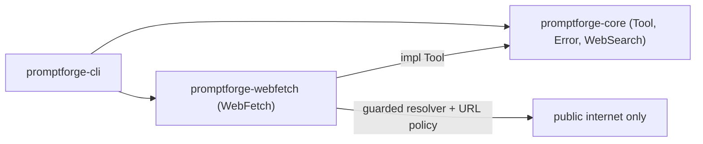

# Webfetch crate: extraction and hardening

Built per [tools-public/how-to/how-to-vibe.md](tools-public/how-to/how-to-vibe.md): plan in levels of resolution, one testable commit per step, each step written in one subagent, reviewed in a second, fixed in a third, findings routed through `vibe-review.md`, git kept in the main context.

Guiding constraint from the author: every commit makes progress on its own. Each capability is defined, wired into `web_fetch`, and tested end-to-end in the same commit, and carries its own final error handling. No commit builds unused scaffolding that a later commit exists to realize.

To generate the design document: spawn one subagent whose entire prompt is - read this plan at `c:\Users\Vinnie\.cursor\plans\webfetch_crate_extraction_cf3b8853.plan.md`, grep for `<design-doc>`, and follow the block inside it. It writes `design-webfetch.md` (prose only, no code) into the crate directory.

## House rules (load first)

Rule 3: before writing code, the code subagent loads [tools-public/how-to/how-to-write-rust.md](tools-public/how-to/how-to-write-rust.md) and follows it. The workspace lints in [promptforge/Cargo.toml](promptforge/Cargo.toml) already enforce: `unsafe` forbidden, `missing_docs` warn, clippy `all = deny` + `pedantic = warn`, `unwrap_used = deny` (tests may unwrap via `clippy.toml`). Every public item carries docs and an `# Errors` section where it returns `Result`.

## Level 1: what we are building

A standalone Rust crate, `promptforge-webfetch`, providing the `web_fetch` tool: given a model-chosen URL, it fetches the page over HTTP and returns readable text, while refusing any request that could reach a private or internal address or abuse resources. It replaces the unguarded in-core `web_fetch`. Alongside the code, a prose-only `design-webfetch.md` records the decisions and the why. `web_search` is untouched and stays in core: it proxies through the gateway and never takes a model-chosen URL, so it has no SSRF surface.

## The tool contract (model-facing)

`web_fetch` takes one required and two optional inputs, with defaults so the simple call stays `{ url }`:

- `url` (required): the page to fetch.
- `raw` (optional, default false): skip article extraction and render the whole page. For pages that are mostly a table or list, where extraction would discard the content. The tool also falls back to whole-page rendering automatically when extraction comes back near-empty; `raw` is the manual override for a page with a little prose above a large table, where the automatic fallback would not fire.
- `max_chars` (optional, default from config): cap the returned text for this call.

It returns the readable text preceded by a short provenance header the model reads: the final URL after redirects (so a citation names where the bytes came from, not where the model aimed), whether the text was truncated, and how it was produced (article extraction, whole-page rendering, or decoded plain). Rationale: the model steers extraction and size when it needs to, pays nothing when it does not, and always sees whether it is holding a complete document. Every knob has a sensible default, so the whole surface is optional.

## Level 2: high-level components, in dependency order

1. `promptforge-core` (exists) owns the `Tool` trait and `Error`/`Result`. Fixed first because the new crate implements `Tool` and returns core's `Result`; nothing compiles until the trait is importable. Core also sheds `readabilityrs`/`htmd`, which move to the fetch crate.
2. `promptforge-webfetch` (new) depends on core. The only package carrying HTTP, HTML extraction, and the SSRF policy. Bright line: removing it leaves every other crate compiling, and no other crate mentions `reqwest`, `readabilityrs`, `htmd`, `url`, or `ipnet`.
3. `promptforge-cli` (exists) depends on both; [promptforge/crates/promptforge-cli/src/tools.rs](promptforge/crates/promptforge-cli/src/tools.rs) `select_tools` constructs `WebFetch` from the new crate instead of core.

## Level 3: pieces inside promptforge-webfetch

Each capability is defined and wired into `web_fetch` in one commit, so the tool's observable behavior moves forward at every step.

- Config: `FetchConfig` with defaults (timeouts, pool idle, caps, allow_http, ports, ip-literals, deny_extra, allow_exact, user_agent, max_redirects, default max_chars). Introduced with the first policy and read by everything after.
- Errors: `FetchError` is introduced whole in the first policy commit, with its terminal-versus-retryable split, its model-facing rendering (which omits internal detail) versus its full `Display` for logs, and its `From` into core `Error`/`ToolError`. Every later commit adds only the variants its own failure mode needs. There is no separate errors commit.
- URL policy, address policy and guarded resolver, size caps, content-type routing with charset, and client hardening: each defined and wired into the fetch path in its own step, and each adding its slice of the model-facing contract (final URL, then truncated and max_chars, then raw and extraction mode).

## Blocked address ranges (data the plan owns)

The address policy denies these ranges. The plan carries the list directly because `design-search.md` is being retired.

IPv4:
- `0.0.0.0/8` this network and the unspecified address
- `10.0.0.0/8` RFC1918 private
- `100.64.0.0/10` CGNAT
- `127.0.0.0/8` loopback (the whole block)
- `169.254.0.0/16` link-local, includes cloud metadata `169.254.169.254`
- `172.16.0.0/12` RFC1918 private
- `192.0.0.0/24` IETF protocol assignments
- `192.0.2.0/24` TEST-NET-1
- `192.88.99.0/24` 6to4 relay anycast
- `192.168.0.0/16` RFC1918 private
- `198.18.0.0/15` benchmarking
- `198.51.100.0/24` TEST-NET-2
- `203.0.113.0/24` TEST-NET-3
- `224.0.0.0/4` multicast
- `240.0.0.0/4` reserved
- `255.255.255.255/32` broadcast

IPv6:
- `::/128` unspecified
- `::1/128` loopback
- `::ffff:0:0/96` IPv4-mapped (loopback and RFC1918 in a v6 hat)
- `64:ff9b::/96` and `64:ff9b:1::/48` NAT64
- `100::/64` discard-only
- `2001:db8::/32` documentation
- `2002::/16` 6to4
- `fc00::/7` unique local
- `fe80::/10` link-local
- `ff00::/8` multicast

`deny_extra` adds deployment CIDRs. `allow_exact` is host plus exact address, never a range, defaults empty, and is the only supported way to reach an internal host.

## Known limits and tensions (the design records these)

- Query strings are not sanitized. A model that read a poisoned page can place run data in a query string to a genuinely public host; the URL policy cannot stop this, because the destination is public and the payload is indistinguishable from an ordinary query. The control that works is a caller control: do not give a section that reads untrusted text the tools to exfiltrate it.
- Everything `web_fetch` returns is untrusted third-party text by contract. Keeping such a section away from private data and shell-like tools is the caller's job, enforced by per-section tool scoping, not by this crate.
- Connection-pool reuse leaves a small DNS-rebinding window: `reqwest` may reuse a kept-alive socket to a host resolved moments ago without re-resolving. A short pool idle timeout bounds it.
- The per-run deadline is not enforced here (the `Tool` trait carries no call context), so a fetch can outlive the run's remaining budget. The per-call timeouts bound it in absolute terms.

## Level 4: the steps (one commit each; complete, wired, tested)

Each step's intent is one line a reviewer can test the diff against. Each step from 2 on changes `web_fetch`'s observable behavior and adds any error variants it needs.

1. **scaffold.** Intent: web_fetch lives in `promptforge-webfetch` and behaves exactly as before. Create the crate; move [promptforge/crates/promptforge-core/src/tools/web_fetch.rs](promptforge/crates/promptforge-core/src/tools/web_fetch.rs) verbatim; add the workspace member and `[workspace.dependencies]` entry; move `readabilityrs`/`htmd` off core onto the new crate; drop the `web_fetch` module and its re-export from [promptforge/crates/promptforge-core/src/tools.rs](promptforge/crates/promptforge-core/src/tools.rs); point CLI `select_tools` at the new crate. Test: the moved `extract_markdown` tests pass and the workspace suite stays green.
2. **url-policy.** Intent: web_fetch rejects a URL with a bad scheme, userinfo, disallowed port, or IP literal before any network access. Add `FetchConfig` with defaults; add `FetchError` whole; add `check_url` over a parsed `url::Url` and call it at the top of `web_fetch.call`. Test through `web_fetch`: `user:pass@host`, a non-443 port, `http://` under default, and IP literals `0177.0.0.1`, `2130706433`, `[::1]`, `127.1` are each refused with the right error, and an ordinary allowed URL still fetches.
3. **address-resolver.** Intent: web_fetch only ever connects to allowed public addresses, at connect time, across redirects, and reports the final URL. Add `ipnet`, the CIDR table above, `addr_allowed`, and `deny_extra`/`allow_exact`; add a resolver over `reqwest`'s DNS trait that filters answers through `addr_allowed`; build the client with that resolver and a custom redirect policy re-running `check_url` and the address check per hop up to `max_redirects`; the return names the final URL after redirects (the first provenance field); add the address and redirect `FetchError` variants. Test on a loopback axum server with an `allow_exact` entry: public-then-loopback succeeds then fails; a multi-answer stub yields only the public address; a redirect to `127.0.0.1` and an `https` to `http` downgrade are refused; the address unit table covers just-inside and just-outside each range, an IPv4-mapped loopback, a NAT64 address, and `169.254.169.254`.
4. **size-caps.** Intent: web_fetch refuses oversized structured responses, truncates flat text counting decompressed bytes, and honors a per-call `max_chars`. Add a `Content-Length` precheck, a streamed `max_bytes` cap with mid-stream abort, the `max_chars` input overriding the config default, and a `truncated` flag in the return; enable reqwest `gzip`/`brotli`/`stream`; add the size `FetchError` variant. Test: oversized HTML refused, a gzip bomb refused on the decompressed count, flat text truncated with the flag, a `max_chars` call cut to length, and a body one byte under the cap accepted.
5. **content-type.** Intent: web_fetch handles each content type per the routing rule, honors `raw`, refuses an absent type, and decodes declared charsets. Add `mime`-based routing (html to readability+htmd; other text, json, xml to decoded plain; pdf and other binary refused with an actionable message; absent refused), the `raw` input (default false) forcing whole-page rendering, the extraction mode in the return, and `encoding_rs` charset handling; add the content-type `FetchError` variants. Test: HTML extracted, `raw` forces whole-page on a table page, JSON returned verbatim, PDF refused, absent-type refused, a Latin-1 page decoded.
6. **client-hardening.** Intent: web_fetch applies both timeouts and a bounded pool idle, and sends no cookie or credential on any hop. Add `connect_timeout`, total `timeout`, and `pool_idle_timeout` from config, set the user agent, and ensure no cookie store and no `Authorization` header; add the timeout `FetchError` variant. Test: a slow server yields a timeout; the test server confirms the request carries no cookie or credential; and neither survives a redirect.
7. **doc.** Intent: the crate carries the generated prose design doc and no stale search doc remains referenced. Generate `design-webfetch.md` here by dispatching one subagent whose entire prompt is the To-generate line above: read this plan, grep `<design-doc>`, and follow that block. It reads this plan's design sections - the tool contract, the blocked-CIDR set, the known limits, and the rationale threaded through the steps - and writes prose only, no code, into `crates/promptforge-webfetch/design-webfetch.md`. Then move [promptforge-design/design/design-search.md](promptforge-design/design/design-search.md) to `cabinet/_trash/` (per workspace rule, never delete) and update inbound cross-references in `design.md`, `design-mcp.md`, `design-core.md`, and `design-gateway.md`. This commit changes no behavior; say so in the message and skip the parent-commit test.

## Before executing: one gap pass

Read the step list once. Data flow runs scaffold -> config and errors and URL policy -> address policy, resolver, and final-URL -> size caps and max_chars -> content-type, raw, and extraction mode -> client hardening -> doc. Each step consumes only what an earlier step produced and ends with a visible behavior change in `web_fetch` plus its own tests, so no commit waits on a later one to realize its value. One pass, not a gate.

## The build cycle (per step, in subagents)

- A code subagent receives this plan by path and the step number, loads how-to-write-rust.md, and implements only that step.
- The main context commits; git output is bounded.
- A review subagent reads the diff, applies the generic `<code-review>` checks in how-to-vibe.md plus the `<webfetch-review>` checks below, and overwrites `vibe-review.md` with any failures (file:line, the problem in one sentence, the one fix).
- A fixer subagent reads `vibe-review.md` and edits.
- The main context re-runs the build and tests and amends the commit.

Findings travel through `vibe-review.md`, never the main context. Subagents only edit, review, and fix; git stays in the main context. Look outward (rule 1) if a step resists more than ten attempts.

## Project-specific review checks

<webfetch-review>
Read the diff for the commit named by the step. Apply each check as a yes-or-no question. Append to vibe-review.md, for each failure, the file and line, the problem in one sentence, and the single change that fixes it. These are in addition to the general code-review checks.

1. Does the resolver filter blocked addresses, returning only the allowed ones, rather than rejecting when the first answer is blocked? Reject-on-first lets a multi-answer host through.
2. Is the address check applied at resolve time, which is connect time, not only on the URL string? A URL-string-only check is defeated by a name that resolves inward and by DNS rebinding.
3. Is the streamed byte cap counted on decompressed bytes, so a gzip bomb hits the same cap?
4. Does the fetch client carry no cookie store and no credential or Authorization header on any request, including after a redirect?
5. Is an absent Content-Type refused rather than sniffed, and is a PDF or other binary refused with a message that names the type and suggests a next move?
6. Does every redirect hop re-run the URL and address policy: scheme downgrade to http, a disallowed port, and an internal address?
7. Are structured formats (html, json, xml) all-or-nothing on the size cap while flat text truncates with a flag?
8. Does the model-facing error text omit the resolved internal address and range while the log text keeps them?
9. Does this commit change web_fetch's observable behavior on its own, rather than adding code a later commit must wire up to matter?
</webfetch-review>

## Non-goals

- No change to `web_search` or the gateway.
- No prompts.toml `[extensions]` wiring; `FetchConfig` defaults only.
- No per-run deadline enforcement; the `Tool` trait carries no call context, so this is deferred.
- No other design docs touched beyond the cross-reference updates.

## Verification

Per commit: `cargo fmt --check`, `cargo clippy --all-targets -- -D warnings`, `cargo test --workspace`, and `cargo doc` all green. Fetch tests run against a local axum server on loopback with an `allow_exact` entry for the test host.

<design-doc>
OUTPUT A DESIGN DOCUMENT, NOT CODE. Write one markdown file, design-{slug}.md,
that explains the design of what this plan describes.

NO CODE. NO FUNCTION SIGNATURES. NO STRUCT, SCHEMA, OR CONFIG LISTINGS. NO
ALGORITHM WALKTHROUGHS. The one exception: a specific fragment that is
load-bearing to the design AND cannot be said in prose - then include that
fragment alone, not the surrounding machinery.

FOR EVERY DESIGN ELEMENT, STATE THREE THINGS: what is observed (by the user or
by an external consumer), how it is structured, and WHY - the motivation, the
rationale, the principle. For a costly-to-reverse element, "why" must include
what reversing it later would cost.

DESIGN-ELEMENT TEST - include something only if changing it would change ANY of:
  (a) ANYTHING THE USER SEES, READS, WRITES, TYPES, OR NAMES. For a library the
      user is the caller, so this is the PUBLIC API - its operations and their
      contracts (ownership, lifetime, thread-safety, error and complexity
      guarantees). It also includes every config file or frontmatter the user
      edits, and - critically - the NAMES of everything the user sees. A name
      is a design decision: `goto` is a good one, `clear_and_transfer_control`
      is a bad one. Naming is design.
  (b) the shape or structure of the system.
  (c) something costly or hard to reverse that the user never sees - the ABI,
      an on-disk or persisted format that outlives a version, a high-reach
      convention that touches everything, or a cross-cutting quality trade-off
      (security, failure modes, data lifecycle, performance).
If it is none of these - merely how you implement the design behind those
surfaces, such as a private helper type, an internal algorithm choice, a
dependency version pin, or a serialization used only between your own
components - it is implementation. Leave it out.

A public interface is design; a private type is implementation - the same
struct is on opposite sides of the line depending on whether the user sees it.
Describe an interface's shape and contract in prose; show an actual signature
only when the exact signature is itself the load-bearing decision.

COMPRESS BEFORE WRITING - only if the design carries far more ditchable detail
than load-bearing decisions (roughly 10 to 1 or worse). If it is already lean,
skip this. Run the pass in order, cheapest cut first, and stop once the ratio
is healthy:
  1. Drop anything that resolved no real fork - a default, not a decision.
  2. Move anything decidable later at little or no extra cost to a "decide by
     use" list, or drop it. A cheaply-deferrable element is not a headline one.
  3. Replace an enumeration with the rule that generates it.
  4. Merge consequences into the decision that forces them, and sibling
     elements into their shared pattern.
  5. Name a known pattern instead of re-deriving it.
  6. Rank what remains and keep about 10 to 15 headline elements; demote the
     rest to one line.
  7. Delete anything whose removal would still let a competent builder build
     the right thing.

STRUCTURE - three fixed sections, then whatever the design earns:
  - A title stating what building this produces.
  - An executive summary that stands alone; a reader acts on it without the body.
  - A numbered list of the 10 to 15 key design choices, each a short paragraph.
Then, for a reader who stops early:
  - Write headings that state the point, not the topic ("Labels compute at
    boot, off the critical path", not "Labels").
  - Keep rationale in prose; do not bulletize an argument. Enumerate only
    parallel items (decisions, constraints, options).
  - State the evidence before the value word: never "fast" before the number.
  - Where a choice resolved a real fork, name the alternative and why it lost.
  - Order by importance; put a dependency first only where the reader needs it
    to follow what comes next, so cutting from the bottom never removes the core.
  - Add no YAML frontmatter. Close with one italic line naming the date and the
    model. Name no tool, rulebook, or source document for the document's own
    rules or structure.

CHECK BEFORE FINISHING, and fix any no: no code beyond a load-bearing fragment;
every element states what, how, and why; headings state points; no argument is
bulletized; the compression ratio is healthy; no source document is named. If
the plan carries no key design choices, write no document and return the reason.
</design-doc>
