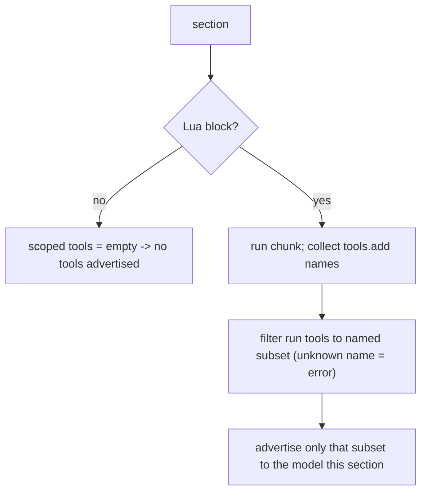

# Per-section tool scoping

Built per [tools-public/how-to/how-to-vibe.md](tools-public/how-to/how-to-vibe.md): levels of resolution, subagent write/review/fix through `vibe-review.md`, git in the main context. The Rust conventions from [tools-public/how-to/how-to-write-rust.md](tools-public/how-to/how-to-write-rust.md) are folded into the step. This is one self-contained commit: the runtime change and the prompt update ship together so the repo is never left broken.

## House rules (load first)

Before coding, the code subagent loads [tools-public/how-to/how-to-write-rust.md](tools-public/how-to/how-to-write-rust.md). Workspace lints already deny clippy-all and unwrap-in-non-test; document public items with `# Errors`; tests land in the same commit.

## Level 1: what we are building

Today [execute.rs](promptforge/crates/promptforge-core/src/execute.rs) builds the tool-schema list once (line 63) and advertises every frontmatter tool to the model in every section. We are making it opt-in per section: a section's Lua block calls `tools.add("web_search", "web_fetch")`, and the runtime advertises only those tools for that section. A section that names no tools (no Lua block, or a Lua block without `tools.add`) gets zero tools. This keeps a section from ever holding a tool it did not ask for, and stops a 20-tool prompt from injecting 20 schemas into every section.

## Level 2 and 3: the pieces

- **`tools.add` in Lua** ([lua.rs](promptforge/crates/promptforge-core/src/lua.rs)): expose a `tools` table with an `add` host function taking a variadic list of strings. Calls accumulate into one ordered, de-duplicated set (so conditional `tools.add` in `if` branches works). Capture the set in a `Rc<RefCell<Vec<String>>>` moved into the function (the VM is non-async, single-threaded, so `Rc`/`RefCell` are fine). Return the accumulated names on `LuaOutcome` as a new `scoped_tools: Vec<String>` field. `add` never touches the model or validates against the registry - it only records names.
- **Per-section filtering** ([execute.rs](promptforge/crates/promptforge-core/src/execute.rs)): move schema building inside the section loop. For each section, get the scoped names (from the section's Lua outcome; empty when the section has no Lua block). Filter the run's `tools` slice to those whose `name()` is in the scoped set, build schemas from that subset, and pass both the filtered schemas and the filtered dispatch targets into `run_tool_loop`. A scoped name not present in the run's tools is a hard error (extend `Error::UnknownTool` or add a focused variant), never silently dropped - so a typo or an undeclared tool fails loudly.
- **Prompt update** ([research-person.md](promptforge/prompts/research-person.md)): add a Lua block at the top of the `## Research` section, `tools.add("web_search", "web_fetch")`, so it keeps its tools under the opt-in rule. Other prompts (`hello.md`, `greet.md`, `echo.md`) declare no tools and are unaffected.

## Rust conventions for this change

- `LuaOutcome` gains `scoped_tools: Vec<String>`; document the field. `tools.add` records into an `Rc<RefCell<Vec<String>>>`; no `unwrap`/`expect` in non-test code (map mlua errors to `Error::Lua`).
- Per-section filtering builds a `Vec<&dyn Tool>` and a `Vec<ToolSchema>` from the run's slice; error on an unknown scoped name rather than panicking. Keep the `# Errors` doc on `run` accurate (add the unknown-scoped-tool case).
- Tests in-file under `#[cfg(test)] mod tests`; `#[tokio::test]` for anything driving `run`/`run_tool_loop`.

## Level 4: the step (one commit; complete, wired, tested)

**tool-scoping.** Intent: a section advertises exactly the tools its Lua block named with `tools.add`, and none if it names none; `research-person.md` keeps working under the new rule. Implement the Lua `tools.add` recorder and `LuaOutcome.scoped_tools`, move schema selection per-section in `execute::run` with the unknown-name error, and add the `tools.add` block to `research-person.md`. Tests: `tools.add` accumulates across calls (unit, lua.rs); a section scoped to one tool advertises only that one and a no-Lua section advertises none (execute.rs, via a mock); a scoped name absent from the run's tools errors. Live: re-run `research-person.md` and confirm it still returns a summary.

## Before executing: one gap pass

`tools.add` (lua.rs) produces the names; `execute::run` consumes them the same commit; the prompt update keeps the one tool-using prompt valid. Nothing is left half-wired and the repo stays green and runnable. One pass, not a gate.

## Build cycle

Code subagent writes the step (loading how-to-write-rust.md); main context commits; a review subagent applies the general `<code-review>` checks in how-to-vibe.md plus the `<tool-scoping-review>` checks below into `cabinet/_scratch/tool-scoping-build/vibe-review.md`; a fixer applies them; main context re-tests, runs the live check, and amends. Git stays in the main context.

## Project-specific review checks

<tool-scoping-review>
Read the diff for the commit. Apply each as yes-or-no; append failures to vibe-review.md with file:line, the problem, and the fix.

1. Does a section advertise exactly its accumulated tools.add names, and does a section with no Lua block or no tools.add advertise zero tools?
2. Do multiple tools.add calls, including in if-branches, accumulate into one set (deduplicated)?
3. Is a tools.add name not present in the run's frontmatter tools a hard error, not silently ignored?
4. Are BOTH the advertised schemas and the dispatch targets filtered to the scoped subset, so the model cannot call a tool it was not shown?
5. Is research-person.md updated with a tools.add block, and did the live run still return a coherent summary?
6. Does the commit leave the repo working - no tool-using prompt left with no tools - so nothing needs a later commit to be whole?
7. Rust conventions: scoped_tools documented, no unwrap/expect in non-test code, # Errors on run updated, tests in the same commit.
</tool-scoping-review>

## Non-goals

- No `tools.remove` / `tools.clear` (add-only this pass).
- No tool-count guardrail (the 5-10 band) enforcement.
- No new tools, no state/store, no context-clearing transitions.

## Verification

`cargo fmt --all --check`, `cargo clippy --all-targets --all-features -- -D warnings`, `cargo test --workspace`, `cargo doc` green. Live: start the gateway with `BRAVE_API_KEY`, run `promptforge run prompts/research-person.md "Tell me about <person>"`, confirm a coherent summary (proves scoping advertises the two tools it named).

## Decisions and confidence

- Opt-in default (a section gets only what it names) over opt-out: chosen by the user for isolation - a section can never hold a tool it did not ask for. Confidence: high. Consequence: every tool-using section needs a Lua block; research-person.md is updated in this commit.
- add-only API, accumulate-and-dedupe: minimal surface that covers conditional scoping. Confidence: high.