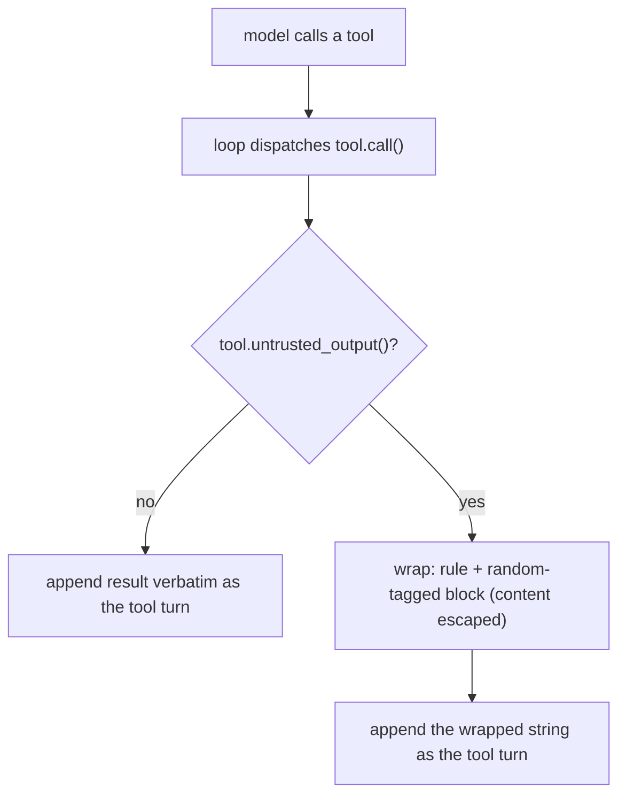

# Guard-wrap untrusted tool output

Built per [tools-public/how-to/how-to-vibe.md](tools-public/how-to/how-to-vibe.md), one self-contained commit, with the [tools-public/how-to/how-to-write-rust.md](tools-public/how-to/how-to-write-rust.md) conventions folded in.

## House rules (load first)

Before coding, the code subagent loads [tools-public/how-to/how-to-write-rust.md](tools-public/how-to/how-to-write-rust.md) and follows it. The workspace lints already deny clippy-all and unwrap-in-non-test; document public items, with `# Errors` where they return `Result`; tests land in the same commit.

## Level 1: what we are building

`web_fetch` returns attacker-controllable text, and a poisoned page can contain instructions aimed at the model (prompt injection). To reduce that, the runtime wraps the result of any untrusted-returning tool in a self-contained guard block before it enters the conversation: a plain-language rule that the enclosed text is data to analyze and not instructions to follow, then the content inside a random-tagged delimiter the content cannot forge. This is defense-in-depth on top of per-section scoping - it lowers the everyday injection risk but does not replace isolation (see non-goals).

This mirrors the approach already proven in paperflow's [inject_untrusted](wg21-paperflow/packages/pipeline/src/pipeline/tools.py).

## How it is triggered

A tool declares whether its output is untrusted; the loop wraps only those results. No second tool, no per-call choice, impossible to forget.

## Level 2 and 3: the pieces

- **Tool property** ([tools.rs](promptforge/crates/promptforge-core/src/tools.rs)): add a defaulted trait method `fn untrusted_output(&self) -> bool { false }` to `Tool`, documented. Everything is trusted unless it says otherwise.
- **web_fetch opts in** ([promptforge-webfetch/src/lib.rs](promptforge/crates/promptforge-webfetch/src/lib.rs)): override `untrusted_output()` to return `true`.
- **Wrapping in the loop** ([execute.rs](promptforge/crates/promptforge-core/src/execute.rs), `run_tool_loop`): generate one random nonce per section (loop invocation). At the append site - currently `conversation.push(Message::tool(call.id, result))` - if `tool.untrusted_output()` is true, replace `result` with the guard block: a fixed rule sentence, then an XML-style open tag carrying the nonce in the tag name `<untrusted_input_{nonce}>`, the content (with any literal occurrence of that tag or its close escaped), then the matching `</untrusted_input_{nonce}>`. XML-style because the models this routes to (Claude) are trained to respect XML delimiting of untrusted data; the nonce lives in the tag name (not just an attribute) so the close tag is unguessable and cannot be forged by the page. Trusted tools append verbatim as today.
- **Random nonce** ([Cargo.toml](promptforge/Cargo.toml)): add `fastrand` (the lean no-tree choice from the Rust guide) to generate an unpredictable hex nonce. It need only be unguessable by the fetched content, not cryptographic.
- **Escaping**: before wrapping, replace any literal occurrence of the open or close tag in the content so a page cannot inject a fake closing tag and break out of the data block.

## Rust conventions for this change

- The new trait method is defaulted (`{ false }`) and documented, so it is a non-breaking addition to `Tool` and existing impls need no change.
- The wrap helper is a small pure function `wrap_untrusted(content: &str, tag: &str) -> String` with a doc comment and a unit test; no `unwrap`/`expect` in non-test code.
- `fastrand` used only to build the tag string; keep the call site tiny.
- Tests land in this commit; `#[tokio::test]` only where the loop is driven.

## Level 4: the step (one commit; complete, wired, tested)

**guard-wrap.** Intent: an untrusted-returning tool's result reaches the model wrapped in a self-contained rule-plus-random-tagged block, while trusted tool results are unchanged. Add the trait property, override it in web_fetch, add the wrap-and-escape helper and the per-section tag, and apply it at the tool-turn append site. Tests: `web_fetch.untrusted_output()` is true and a sample core tool defaults false; `wrap_untrusted` produces the rule, both markers with the tag, and escapes an embedded forged marker; in the loop, an untrusted mock tool's result is wrapped and a trusted mock tool's result is not. Live: re-run `research-person.md` and confirm it still returns a coherent summary (fetched pages now arrive guarded).

## Before executing: one gap pass

The property (tools.rs) is read by the loop (execute.rs) the same commit; web_fetch sets it; the helper produces the block. Nothing is half-wired; trusted-tool behavior is untouched, so the repo stays green and runnable. One pass, not a gate.

## Build cycle

Code subagent writes the step (loading how-to-write-rust.md); main context commits; a review subagent applies the general `<code-review>` checks plus `<guard-wrap-review>` below into `cabinet/_scratch/guard-wrap-build/vibe-review.md`; a fixer applies findings; main context re-tests, runs the live check, amends. Git stays in the main context.

## Project-specific review checks

<guard-wrap-review>
Read the diff for the commit. Apply each as yes-or-no; append failures to vibe-review.md with file:line, the problem, and the fix.

1. Does `web_fetch.untrusted_output()` return true and does the `Tool` default return false, so only untrusted tools are wrapped?
2. Is an untrusted result wrapped as one self-contained string: a data-not-commands rule, then an XML-style open tag `<untrusted_input_{nonce}>`, the content, and the matching `</untrusted_input_{nonce}>`?
3. Is the nonce unpredictable (from a random source) and carried in the tag NAME (so the close tag is unguessable), and are literal occurrences of the tag inside the content escaped so a page cannot forge the closing delimiter?
4. Is a trusted tool's result appended verbatim, unchanged from before?
5. Does this commit change observable behavior on its own and leave the repo working (live research run still returns a summary)?
6. Rust conventions: defaulted documented trait method, pure documented wrap helper with a unit test, no unwrap/expect in non-test code, tests in the same commit.
</guard-wrap-review>

## Non-goals

- This does not make injection impossible - it is a probabilistic mitigation, not a boundary. It does not replace per-section scoping or the later context-clearing/state isolation, which are the hard controls for the irreversible cases.
- It does not remove the exfiltration channel: `web_fetch`'s own URL can still carry data out (the query-string limit in design-webfetch stands).
- `web_search` is left trusted this pass (its results are short structured snippets); it can adopt `untrusted_output()` later with a one-line change if wanted.
- Future hook (on record, not built now): when prompts can declare their own tools (the design's `state:`-filing tools), a per-tool `untrusted: true` flag in that declaration is the natural place for a prompt author to mark a custom tool's output untrusted, since the runtime could not otherwise know. There are no user-defined tools today, so it stays out of scope; `untrusted_output()` remains a Rust-side, tool-intrinsic property that a prompt author never sets.
- No `tools.remove`/`clear`, no new tools.

## Verification

`cargo fmt --all --check`, `cargo clippy --all-targets --all-features -- -D warnings`, `cargo test --workspace`, `cargo doc` green. Live: gateway with `BRAVE_API_KEY`, `promptforge run prompts/research-person.md "Tell me about <person>"` still returns a coherent summary.

## Decisions and confidence

- Property-driven wrapping over a second tool: the output is always untrusted, so a per-call choice is a footgun; a defaulted trait method generalizes and cannot be forgotten. Confidence: high.
- Rule stated inline in the same result string (not a separate system turn): the loop has no system message, and proximity aids compliance; the small repeated token cost is negligible against page content. Confidence: high.
- XML-style tag with the nonce in the tag name, over `<<<...>>>`: the routed model (Claude) is trained to respect XML delimiting, which lifts compliance; putting the nonce in the tag name makes the close tag unforgeable, and escaping covers the rest. Confidence: high. It is strictly better than a bracket convention for this model.
- `fastrand` for the nonce: unguessable-not-cryptographic is the requirement, and it is the lean no-tree dependency. Confidence: high. Falsifier: if a realistic page could predict or forge the tag despite the nonce and escaping, the source needs strengthening.