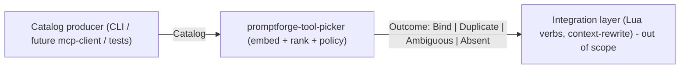

# Build the promptforge-tool-picker crate

A pure Rust engine that ingests an abstract tool catalog, embeds each tool once with a bundled CPU sentence-transformer, and resolves a plain-English capability need to one of four outcomes. It carries no Lua, no MCP/protocol, and no network dependency. Governing design: `design-tool-picker.md` and its evidence `RESULTS.md` in `promptforge-design/study-tool-picker/` (both under their pre-rename names `design-mcp-toolpicker.md` / `study-mcp-toolpicker/` until step 1 renames them), as narrowed by the decisions below.

## Decisions that override the design doc

- Crate name is `promptforge-tool-picker` (was `promptforge-mcp-toolpicker`); rename across all study docs. Also rename the study directories: `study-mcp-toolpicker` -> `study-tool-picker` and `mcp-classifier-spike` -> `spike-tool-picker`. Done first (step 1) so all later paths are final.
- No Lua dependency and no `promptforge-mcp-client` dependency. The Lua verbs (`tools.add_need`, `choose_mcp_tool`) and the context-rewrite hook are NOT in this crate - they are future integration-layer work in the caller. This crate exposes a Rust API only.
- Likely no `promptforge-core` dependency: the engine returns tool descriptors, not `dyn Tool`; the caller maps a chosen descriptor to a concrete tool.
- The catalog is the sole input contract and its type lives in this crate.
- The `promptforge` repo must never reference the `promptforge-design` repo. No crate code, test, fixture, or build step reads from `promptforge-design/`. Any preprocessing facts needed from the study (pooling, thresholds) are transcribed into this plan and the crate, not linked at build or test time. (The study rename in step 1 and the design-doc write in step 13 operate on the design repo but are not the crate referring to it.)
- v1 embeds only bge-small-en-v1.5 and uses CLS pooling. all-MiniLM-L6-v2 (mean pooling) is deferred; do not expose a model choice the binary cannot satisfy.
- The generated architect design document lives at the crate root: `promptforge/crates/promptforge-tool-picker/design-tool-picker.md`. It is the crate's own living design doc (inside the `promptforge` repo), separate from the study's historical writeup in `promptforge-design`.

## Boundary

## Public API contract (Rust-facing, normative)

- `ToolDescriptor { id, server, name, description, input_schema, annotations }` and `Catalog` (collection). Enriched text for embedding = name + description + parameter names (per design).
- `ToolPicker::build(catalog: Catalog, config: Config) -> Result<ToolPicker>` - embeds the whole catalog once; deterministic.
- `ToolPicker::resolve(need: &str) -> Outcome` - the four-outcome policy for a static binding.
- `ToolPicker::shortlist(need: &str, k: usize) -> Vec<ToolDescriptor>` - deterministic top-k retriever powering dynamic discovery in the caller.
- `Outcome = Bind(ToolDescriptor) | Duplicate(Vec<ToolDescriptor>) | Ambiguous(Vec<ToolDescriptor>) | Absent`. (Renamed from `ForeignAmbiguous` during implementation: it is the residual bucket for any near-tie the margin could not separate, including same-server non-twin ties, so a name asserting foreign provenance was false in cases the tests exercise.)
- `duplicate_threshold` is a TOOL-TO-TOOL cosine between two tools' own embeddings, independent of any query - which is what the 0.98 default was calibrated as. It is not a query-score level and not a tolerance on the gap between two scores. Consequently `Config` does not order it against `similarity_floor`; those are different measures. Open fork worth recording: a pair of paraphrased (not verbatim) same-server tools that are genuinely indistinguishable but sit below 0.98 will not be reported as `Duplicate`. Falsifier: an evaluation case where two paraphrased same-server tools tie below 0.98 and silently bind.
- `Config { model_id (v1: bge-small-en-v1.5 only), similarity_floor, margin, duplicate_threshold (~0.98), top_k }`. No weights path: weights are embedded in the binary.

## Engine specifics

- Matcher: local sentence embeddings via Candle + `candle-transformers` (BERT), tokenizer via `tokenizers`, CPU, deterministic. No LLM in-crate. Pooling is model-specific and must match the model: bge-small-en-v1.5 uses CLS-token pooling (not mean), then L2-normalize. Replicate exactly the preprocessing the study used (pooling, normalization, any bge query prefix), transcribed into the crate - the crate does not read the study repo.
- Policy: cosine rank; clear top-1 above floor with sufficient top1-vs-top2 margin -> Bind; near-tie at/above duplicate threshold within the author's own catalog -> fail loud (Duplicate); near-tie across intentionally imported/foreign servers -> ForeignAmbiguous shortlist; nothing above floor -> Absent. MCP `readOnlyHint`/`destructiveHint`/`idempotentHint` annotations break ties only where present.
- Model weights are never committed to git. `build.rs` downloads the model from HuggingFace pinned to a commit SHA (via `hf-hub`, cached in `~/.cache/huggingface`, verified with `sha2`) into `OUT_DIR` (under `target/`, already gitignored). The crate then `include_bytes!`-embeds the safetensors + `tokenizer.json` + `config.json` from `OUT_DIR`, so the weights compile into the `.rlib` and any linked binary carries them - no external file, no network, at runtime. Load from memory: `Tokenizer::from_bytes(...)` and Candle `VarBuilder::from_buffered_safetensors(...)`.
- Embed fp16 weights (~65MB) rather than fp32 (~130MB) to limit per-binary bloat; cosine similarity is unaffected in practice. bge-small-en-v1.5 ships fp32 on HuggingFace, so `build.rs` downcasts to fp16 before `include_bytes!`. Falsifier: a measurable accuracy drop on the opt-in study eval. Reversing to fp32 is a build-time change only.
- Do NOT use `tch`/rust-bert (they link native libtorch, an external runtime dependency that defeats embedding). Candle is pure Rust with in-memory safetensors loading.
- Side benefit of dropping MCP: no `rmcp`, so no forced workspace MSRV bump to 1.88; verify Candle builds under edition 2024 / rust 1.85 and bump only if Candle requires it.

## Dependencies

- Runtime: `candle-core`, `candle-nn`, `candle-transformers` (BERT), `tokenizers`, `serde`/`serde_json`, `thiserror`.
- Build (`[build-dependencies]`): `hf-hub` (pinned-revision download), `sha2` (checksum verification), `safetensors` (read/write the tensor file), `half` (correct round-to-nearest-even fp32 to fp16 conversion, rather than hand-rolling IEEE 754 binary16).

## Measured findings from the built engine

These came out of the fixture tests and belong in the design document as named tensions:

- The duplicate threshold is sensitive to description LENGTH, not only to how alike two tools are. Two tools sharing a description word for word, with names differing by one word, measure 0.983 when the description is a paragraph but only 0.960 when it is a single line - the name difference is a large fraction of a short text. So verbatim copies under short descriptions escape the 0.98 threshold, which sharpens the recorded falsifier: it is not only paraphrases that slip through. A genuinely paraphrased same-server pair measured 0.811.
- The 0.825 similarity floor is stricter than it reads, and that is the design working as calibrated. A need that restates a tool ("get the weather forecast for a city") scores 0.865 and binds; the way a person would actually ask ("what will the weather be like in Paris this week") scores 0.651 and abstains. The floor earns its 5% false-bind budget by binding only near-restatements. Consequence for callers: `resolve` is for author-register capability descriptions, and real end-user phrasing should expect `Absent` far more often. `shortlist` with a lowered floor is the honest entry point for that traffic.
- Loading the model twice in a row is measurably slower than once (the loader materializes ~133MB of f32 weights), so proving determinism across two builds costs about 6.6s. A future improvement would let callers share one loaded `Embedder` across engines.

## Build method

Adopt the Vibe rulebook ([vibe-how-to.md](tools-public/how-to/vibe-how-to.md)) as the execution method: one testable commit per step, each written in a subagent, reviewed in a fresh subagent that writes findings to `vibe-review.md` (overwritten each cycle), fixed in a third; git stays in the main context. Each step handed to its subagent by this plan's path plus the step number. Learn house rules first: workspace lints (forbid unsafe, deny unwrap/expect, warn missing_docs, clippy pedantic), edition 2024, `[lints] workspace = true`, thiserror for library errors, `///` on every public item, and update STATUS.md on commits (see [AGENTS.md](promptforge/AGENTS.md)). Use `promptforge-webfetch` as the crate-structure template.

<review>
Project-specific review checks, in addition to the general code-review block:
- No dependency on Lua, MCP/rmcp, or a network client anywhere in the crate.
- Every public item has `///` docs with `# Errors` where fallible.
- Resolution is deterministic: same catalog + need + config yields the same outcome across runs.
- The four outcomes are each exercised by a test with a crafted mini-catalog.
</review>

## Steps

Work them in order; each is one commit carrying code, test, and docs.

1. Renames first, so every later path is final: `git mv promptforge-design/study-mcp-toolpicker promptforge-design/study-tool-picker` and `git mv promptforge-design/mcp-classifier-spike promptforge-design/spike-tool-picker` (the spike's local `.venv` is untracked and can be left or regenerated); rename `design-mcp-toolpicker.md` -> `design-tool-picker.md`; replace `promptforge-mcp-toolpicker` -> `promptforge-tool-picker` across the study docs (design-tool-picker.md, manifest.md, rationale.md, README.md, RESULTS.md); update STATUS.md.
2. Crate skeleton: `promptforge/crates/promptforge-tool-picker/` with Cargo.toml (`[lints] workspace = true`), lib.rs, module stubs, AND add the crate to the workspace root `members` list in this same step - workspace inheritance (`workspace = true`, `workspace.dependencies`) will not resolve otherwise, so every later step's build/test depends on this.
3. Catalog types: `ToolDescriptor`, `Catalog`, serde derives, enriched-text derivation (name + description + parameter names), unit tests.
4. Config and Error types (thiserror), thresholds with documented defaults (no weights path; weights are embedded).
5. Model assets via `build.rs`: `hf-hub` downloads bge-small-en-v1.5 (fp16 safetensors + tokenizer.json + config.json) pinned to a commit SHA into `OUT_DIR`, `sha2`-verified; the crate `include_bytes!`-embeds them. Weights stay out of git (OUT_DIR is under target/).
6. Embedding backend: load embedded weights via Candle `VarBuilder::from_buffered_safetensors` and tokenizer via `Tokenizer::from_bytes`; tokenize + CLS-pool (bge) + L2-normalize; tests for output dimension and run-to-run determinism (golden vector), all from in-memory bytes.
7. Index build: embed the whole catalog in `ToolPicker::build`; store vectors in memory (no persistent cache in v1).
8. Cosine ranking + top-k ordering, with tests.
9. Four-outcome policy (floor, margin, duplicate threshold, annotation tie-break) -> `Outcome`; one test per outcome using crafted mini-catalogs.
10. Public API: `build` / `resolve` / `shortlist` tied together; integration test.
11. Behavior + determinism tests over small fixtures committed under the crate's own `tests/fixtures/` (the four outcomes and a golden vector). No path into `promptforge-design`. The full-corpus evidence run (29k cases / 9,922-tool catalog) stays in the study repo as an opt-in harness and is not part of `cargo test`.
12. Verify `cargo build`/`clippy --all-targets --all-features -- -D warnings`/`test` clean for the whole workspace; bump MSRV only if Candle requires it. (Workspace membership was added in step 2.)
13. After implementation is complete, generate the design document: spawn one subagent whose entire prompt is - read this plan file, grep for `<design-doc>`, and follow the block inside it. It writes `design-tool-picker.md` at the crate root, `promptforge/crates/promptforge-tool-picker/design-tool-picker.md`. Set `{slug}` = `tool-picker`.

<design-doc>
OUTPUT A DESIGN DOCUMENT, NOT CODE. Write one markdown file, design-tool-picker.md,
that explains the design of what this plan describes. You run as the final step
of the plan, after the implementation is complete, so describe the design as
built, reconciling against the finished work any decision the implementation
changed from what this plan first recorded.

NO IMPLEMENTATION CODE - no function bodies, no private machinery, no
step-by-step algorithm walkthroughs. You MAY include any normative artifact the
design needs to remove ambiguity: public signatures, schemas, state or
transition tables, wire formats, configuration syntax, sequence diagrams, and
pseudocode. Each such artifact must express a design contract, not an
implementation technique; include one only where prose cannot say the same
thing as precisely, and show the artifact alone, not the surrounding machinery.

FOR EVERY DESIGN ELEMENT, STATE THREE THINGS: what is observed (by the user or
by an external consumer), how it is structured, and WHY - the motivation, the
rationale, the principle. For a costly-to-reverse element, "why" must include
what reversing it later would cost.

DESIGN-ELEMENT TEST - include something only if changing it would change ANY of:
  (a) ANYTHING THE USER SEES, READS, WRITES, TYPES, OR NAMES. For a library the
      user is the caller, so this is the PUBLIC API - its operations and their
      contracts (ownership, lifetime, thread-safety, error and complexity
      guarantees). It also includes every config file or frontmatter the user
      edits, and - critically - the NAMES of everything the user sees. A name
      is a design decision: `goto` is a good one, `clear_and_transfer_control`
      is a bad one. Naming is design.
  (b) the shape or structure of the system.
  (c) something costly or hard to reverse that the user never sees - the ABI,
      an on-disk or persisted format that outlives a version, a high-reach
      convention that touches everything, or a cross-cutting quality trade-off
      (security, failure modes, data lifecycle, performance).
If it is none of these - merely how you implement the design behind those
surfaces, such as a private helper type, an internal algorithm choice, a
dependency version pin, or a serialization used only between your own
components - it is implementation. Leave it out.

A public interface is design; a private type is implementation - the same
struct is on opposite sides of the line depending on whether the user sees it.
Describe an interface's shape and contract in prose by default; show the actual
artifact - a signature, a schema, a state table - wherever that artifact is
itself the load-bearing decision and prose would blur it. No fixed budget binds
these; each earns its place only by being load-bearing.

COMPRESS BEFORE WRITING - only if the design carries far more ditchable detail
than load-bearing decisions (roughly 10 to 1 or worse). If it is already lean,
skip this. Run the pass in order, cheapest cut first, and stop once the ratio
is healthy:
  1. Drop a default only when changing it would change no observable behavior
     and carry no meaningful risk. A consequential default - a timeout,
     ownership, a security posture, a retry policy, a resource limit, a
     compatibility choice, a failure mode - resolved a real fork and stays.
  2. Move anything decidable later at little or no extra cost to a "decide by
     use" list, or drop it. A cheaply-deferrable element is not a headline one.
  3. Replace an enumeration with the rule that generates it.
  4. Merge consequences into the decision that forces them, and sibling
     elements into their shared pattern.
  5. Name a known pattern instead of re-deriving it.
  6. Rank what remains and keep about 10 to 15 headline elements; demote the
     rest to one line.
  7. Delete anything whose removal would still let a competent builder build
     the right thing.

STRUCTURE - three fixed sections, then whatever the design earns:
  - A title stating what building this produces.
  - An executive summary that stands alone; a reader acts on it without the body.
  - A numbered list of the 10 to 15 key design choices, each a short paragraph.
Then, for a reader who stops early:
  - Write headings that state the point, not the topic ("Labels compute at
    boot, off the critical path", not "Labels").
  - Keep rationale in prose; do not bulletize an argument. Enumerate only
    parallel items (decisions, constraints, options).
  - State the evidence before the value word: never "fast" before the number.
  - Where a choice resolved a real fork, name the alternative and why it lost.
  - Order by importance; put a dependency first only where the reader needs it
    to follow what comes next, so cutting from the bottom never removes the core.
  - Add no YAML frontmatter. Close with one italic line naming the date and the
    model. Name no tool, rulebook, or source document for the document's own
    rules or structure.

CHECK BEFORE FINISHING, and fix any no: no implementation code, and every
normative artifact expresses a contract rather than a technique; every element
states what, how, and why; headings state points; no argument is bulletized;
the compression ratio is healthy; no source document is named. If the plan
carries no key design choices, write no document and return the reason.
</design-doc>