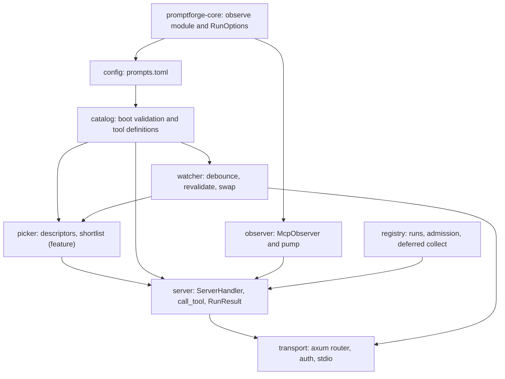
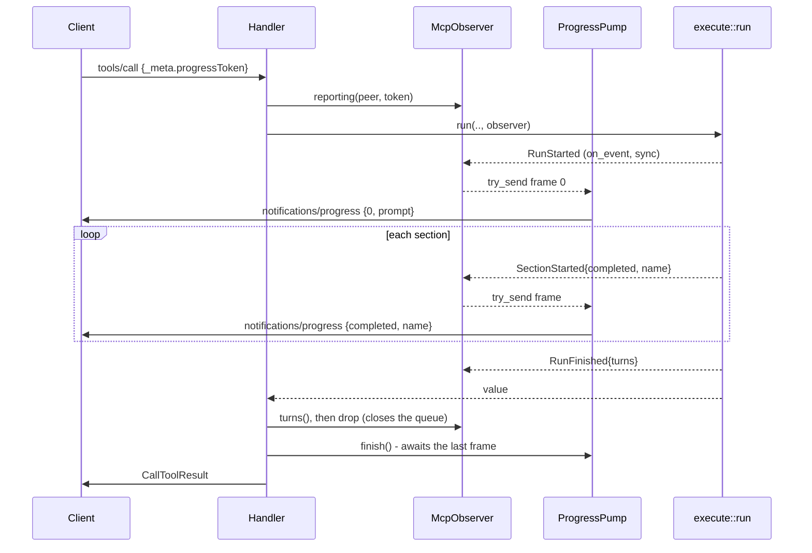

# PromptForge MCP server

## 1. What we are building

One binary, `promptforge-mcp`, that lets an agentic harness - Cursor, Claude Code - call a PromptForge prompt as if it were a tool. The harness sends arguments, the server runs the prompt to completion against the gateway, reports progress while it runs, and returns what the prompt returned.

The prompts directory is watched, so writing a prompt is an edit-and-call loop rather than an edit-restart-call one. The operator decides how much of the catalog the harness sees. Some prompts are published as their own tools, named and described for the calling model to select directly. The rest are reachable without spending a context slot each, two ways: a listing the model walks, and a retrieval tool that takes a plain-English description of what is wanted and hands back the three closest prompts. It is all one catalog.

This is the whole job. It is not the service in `promptforge-design/design/design-mcp.md`, which was drawn for a deployment with a Django site, database-backed extensions, and Windows service installation. What that document contributes here is its MCP surface, its progress-forwarding path, and its boot-validation discipline; the rest is dropped and listed under section 4.

## 2. Design decisions

Settled. Each is written as made, with what it costs.

1. **A prompt is published as an MCP tool, never as an MCP prompt.** The `prompts/get` primitive returns messages for the *client's* model to run, which would hand execution to Cursor and leave the gateway, the Lua sandbox, and the tool pool unused. Execution happens here, so each prompt is a tool. The `prompts` primitive is not implemented at all, so there is no second discovery path to keep in agreement with the first.

2. **Two exposure modes, both live at once.** A prompt is `expose = "tool"` (its own entry in `tools/list`) or `expose = "list"` (reachable only through the built-ins). When any prompt is `list`, the server publishes `list_prompts` and `run_prompt`. Direct prompts also appear in `list_prompts`, marked `direct: true`, so a model walking the list sees the entire catalog and can prefer the typed tool. The cost is one extra round trip for a listed prompt, paid only by prompts the operator judged not worth a permanent context slot.

3. **The catalog is assembled by glob, corrected by name.** `[catalog].include` and `exclude` are glob lists over the prompts directory and carry `default_expose`; a `[prompts.NAME]` block is an exception - promote one prompt to `expose = "tool"`, drop one with `enabled = false`, or reach a file no glob matches by giving it a `file`. Directory patterns are what make "everything I write here is available" a one-line statement, while a named block keeps per-prompt control without turning folder layout into policy. The alternative - a separate include block per pattern, each with its own exposure - was rejected because moving a file would then silently change what the harness sees, and two patterns matching one file would need a precedence rule. Two rules keep this safe: a named block with no `file` that matches no globbed prompt fails the boot, so a stale override is never a silent no-op, and a globbed file declaring no `promptforge:` frontmatter version is skipped in silence, because it is not a prompt at all.

4. **Arguments are one string.** `execute::run` takes a single raw `args` string, so every published tool's input schema is one optional string property named `args`, and no JSON Schema enters frontmatter. This costs client-side autocompletion and typed validation for prompt parameters. It is reversible later by adding a `params` schema to frontmatter, which changes the tool definition builder and nothing else; nothing persists that would need migrating.

5. **The result carries the value, not a path.** The core writes no output files, so the run's returned string is the entire product. It goes in the `content` text block verbatim and in `structuredContent` as `RunResult.value`. The design document's "return a path, do not re-emit the body" rule is for a system with output roots and does not apply until one exists.

   Carrying the value verbatim turned out not to be enough. What was observed: the tool text said nothing about what the value is, so a caller read it as source material and paraphrased it, discarding the finished artifact the user had asked for. The surface therefore states, in its own text, that a prompt's value is a finished artifact written for the user to read and should be passed through as it stands. The statement is client-agnostic by constraint - it names no client, no product, and no user interface, and describes nothing about how a result is displayed - because the server has one text for every caller and cannot know whether it is a terminal, an editor, a web application, or a script; a sentence about any one of them would be false for the rest and would drift as clients change. It says what the value is and who it is for, and lets the caller draw the conclusion, rather than instructing a client to do anything. The cost is one sentence of context per request wherever it appears, which is why it is one sentence and not a paragraph.

6. **A run that outlives the client's patience is collected, not lost.** Cursor's remote streamable-HTTP calls fail at about 300 seconds, staff-confirmed and not configurable, and a progress notification does not extend the clock: the MCP specification says a client *may* reset it on progress, and Cursor does not. Claude Code over stdio is effectively unbounded, and its own remote HTTP path idles out at five minutes. So on the transport Cursor uses, a prompt running past five minutes is certain to be cut off. The server therefore blocks for up to `reply_deadline` (default 240s, chosen to land inside the 300s wall with margin); past that it returns a `RunResult` with `status: "running"` and a `run_id`, and the run continues in the background. A third built-in, `check_run`, collects it by id. Finished records are readable for `retain_completed` (default 1h) and then evicted oldest-first. Blocking forever loses the work outright on the transport we ship; always returning a `run_id` makes every two-second prompt a two-call affair. A stdio-only deployment can raise `reply_deadline` past the wall, since no such limit applies there.

7. **Progress is a first-class part of the build, and the core grows an event stream to carry it.** `promptforge-core` gains an `Observer` trait and an `Event` enum; the MCP server forwards them as `notifications/progress`, which Cursor renders live in place. Without it every run is one silent multi-minute call. Progress buys visibility only, never time: no client resets its timeout on a progress notification, so it is decision 6 and not this one that keeps a long run alive. The cost is a breaking change to `execute::run` and the standing obligation to keep the event stream stable enough for the notification path to mean something.

8. **`progress` counts completed sections and `total` is always absent.** `goto` and an early return mean the number of sections a run will visit is unknown when it starts, so a denominator would be a guess wearing a measurement's clothes. The client shows a changing caption rather than a filling bar. `completed` never decreases, which the protocol requires; a retry repeats a value rather than falling back.

9. **The run is configured in TOML, not in the process environment.** `prompts.toml` carries the gateway URL, token, and model, and the server constructs a `GatewayClient` explicitly. Setting a process environment variable is `unsafe` under edition 2024 and the workspace forbids unsafe, so `GatewayClient::from_env` cannot be driven from a config file. `execute::run` therefore takes the client as an option, with `None` keeping today's env-based path for the CLI.

10. **Boot either produces a complete catalog or the service refuses to start.** Every prompt the globs and the named blocks resolve to is read, parsed, and checked at boot; failures accumulate and all are printed before a nonzero exit. A service that starts with nine of ten prompts is one whose catalog silently disagrees with its configuration, and a client discovers that as a missing tool with no explanation. The one thing a glob may skip in silence is a file that is not a prompt; a file that is one and is broken still stops the boot, and an empty resolved catalog does too.

11. **One shared bearer token, non-empty, required only by the transport that uses it.** Step 13's review found a local stdio install unable to boot because `[server].token` was required by the schema and interpolated at load, so a Claude Code user was stopped by a credential their transport never reads. The token is a property of the HTTP surface: it is optional in the file, required when `serve` binds a port, and ignored by `serve --stdio`. `[gateway].token` stays required on both, because every transport runs prompts and every run needs the gateway. The step 9 review found that an empty `[server].token` made a request with no `Authorization` header compare equal, opening every authenticated route including `tools/call`. An empty token is therefore refused at load, and an absent or malformed header is unauthorized before any comparison happens, so the two defences are independent: neither a config typo nor a comparison bug can open the surface alone. The middleware sits over `/mcp`; `/healthz` is registered after the layer, so its exemption is structural rather than a string comparison. Per-request rather than per-session means a rotated token rejects an established session's next call. The cost is that logs cannot distinguish callers: a leaked token is indistinguishable from legitimate use except by source address.

12. **Both transports are offered: streamable HTTP and stdio.** HTTP is the networked case Cursor uses, with sessions on because a progress notification rides the SSE stream the `tools/call` POST opened. stdio is one extra `rmcp` call and is how a local Claude Code install attaches without a token or a port. The design document refused stdio on the assumption of a remote workstation only; a local harness is the common case here. Step 9 settled three things this left open. The setting is spelled `legacy_session_mode` on `rmcp` 3.1.0, not `stateful_mode`: SEP-2567 removes sessions from protocol version `2026-07-28` onward, so what the flag now buys is that a client negotiating an earlier version gets a session, and a client on the newest one is served statelessly whatever we ask for. Logging cannot go to stdout on stdio, because stdout is the protocol wire; it goes to stderr there and to stdout on HTTP. And stdio ignores `[server].bind` rather than refusing a configuration that sets one - a single `prompts.toml` has to serve both transports, so a bind address is not an error on the transport that does not use it, and the transport logs that it ignored it. `[server].token` is never read on stdio, since no auth layer is constructed there, which is why decision 11 makes it optional in the file rather than required by the schema.

13. **`rmcp` is pinned exactly, at `=3.1.0`.** The `ServerHandler` signatures and `Tool` field set have moved across minor releases, so an upgrade is a diff to read rather than a number to bump. 3.1.0 published 2026-07-31 and 3.0.0 went stable 2026-07-28; the design document's `=2.2.0` was chosen on 2026-07-25 when 3.x was a one-day-old beta. Greenfield code on the 2.x line buys a migration within weeks. Falsifier: if 3.1.0's handler surface is undocumented enough to cost more than a day, fall back to `=2.2.0`, which that document verified against this exact usage. This is a deliberate exception to the house rule against exact pins, which protects a *library's* consumers from an over-constrained resolver; nothing consumes this crate, and the pin buys a readable upgrade instead of a surprise one.

14. **No extensions, no output roots, no HTTP fire surface.** Each belongs to a deployment that does not exist.

15. **The prompts directory is watched, and a reload is per prompt rather than all-or-nothing.** A developer writing a prompt cannot restart a service on every save, so `notify` watches `prompts.toml` and the prompts directory recursively, debounced at 500ms, and the same validation the boot pass runs then runs against the candidate. Each prompt is judged on its own: one that validates swaps in, and one that fails is retained in a broken state carrying its error, still listed but answering a call with the parse failure instead of running the previous copy. A run in flight holds its catalog snapshot and finishes under it. This inverts the design document's all-or-nothing reload deliberately - refusing the whole candidate is right at boot, where nothing depends on the service yet, and wrong on save, where one typo in one file would freeze every other prompt in the catalog. Serving the last good copy of an edited-and-broken prompt is the worst option of the three: the developer would watch a stale version run and have no way to tell.

16. **A prompt under development stays `list`; direct exposure is a promotion.** Cursor's tool-list cache is per application process, not per chat or per window: staff confirm that a new chat, the MCP pane's reload button, and `Developer: Reload Window` all carry the old snapshot over, and that only quitting and reopening the application is reliable. Claude Code freezes its tool index at session start, so a new `claude` invocation does pick up a new tool, which makes it the cheaper harness for iterating on a direct prompt. Either way a newly added or renamed direct tool is invisible until the client restarts, whatever the server notifies. `list_prompts` and `run_prompt` are fixed names, so the catalog behind them changes freely and a new prompt is callable the moment it is saved. The server sends `notifications/tools/list_changed` anyway, since a client that honors it is strictly better off. The cost is that `expose = "tool"` carries a restart, which is exactly why it is a promotion for a prompt whose name and description have stopped moving.

17. **A prompt name resolves exactly, and a miss is a correctable answer rather than a protocol error.** `run_prompt` takes a name the calling model produced, and a model that skipped `list_prompts` will guess. Resolution normalizes case and treats `-` and `_` as the same character - safe, because the derived tool name may contain neither uppercase nor a hyphen, so normalizing cannot merge two legal names - and then matches exactly. It never runs a near miss: fuzzy matching a name onto a different prompt spends minutes of gateway time producing the wrong artifact, and the failure is silent because the caller gets a plausible result for a prompt it did not ask for. Instead an unresolvable or ambiguous name returns `isError: true` carrying the enabled names, closest first by edit distance, which turns the guess into a self-correcting second call. That is why this one case is a result and not `-32602`: a protocol error is the client's bug to fix, and some clients surface it as a hard failure the model never gets to react to, while a bad name is precisely the model's own mistake and the model is the only thing that can correct it. A malformed argument shape stays `-32602`, because that one really is the client's.

Two supports go with decision 17: `run_prompt`'s description tells the caller to consult `list_prompts` when unsure of a name, and the server's `instructions` say the same once at the session level. Neither can be relied on - models skip discovery - which is why the error path carries the catalog. The catalog is deliberately *not* embedded in `run_prompt`'s description: it would pay the same context cost in prose no client can filter, and worse, a client caches that description for the life of its process, so it would go stale the moment a prompt is added.

18. **`need_prompt` describes what it wants and gets three candidates back, never an execution.** `promptforge-tool-picker` resolves a plain-English need against the prompt catalog, which becomes descriptors carrying the prompt's name, its description, and its `args` schema. It returns the top three prompts and the calling model chooses, with the whole conversation in front of it, and then calls `run_prompt` with a name it was handed rather than one it guessed - which closes the gap decision 17 could only mitigate. It never runs a prompt: a retriever picking wrong spends minutes of gateway time on the wrong artifact, and the caller cannot tell.

19. **`need_prompt` steers its caller into author register, because the phrasing is worth more than the model.** In the random-distractor regime this catalog sits in, a need that restates the prompt's own documentation retrieves correctly 0.984 of the time, while the same request phrased as a user goal retrieves 0.857. Nothing about the engine closes that gap; the wording does. So the parameter is named `capability` rather than `need` - the first invites "Build a stakeholder position report for one entity", the second invites "I need to find out what Herb thinks about ABI" - and both the tool description and the parameter's schema description state the register and carry one good and one bad example, including the instruction to leave out entity names and task specifics, which are noise against a generic description. This steers and cannot enforce: models follow phrasing instructions imperfectly, and the backstop is that three candidates come back rather than one, so a conversational phrasing degrades the ordering instead of producing a wrong answer.

20. **The picker's similarity floor is lowered to near zero for this use, and the shortlist replaces it.** The crate's 0.825 default was tuned for author-register prose and abstains on conversationally phrased needs. A floor exists to stop an unattended bind, and nothing here binds unattended, so abstention buys nothing and costs the feature: a user who phrases a request casually would get an empty answer. Three weak candidates are self-evidently weak to the model reading them. The crate's four-outcome policy stays intact for its own launch-time binding case, which is where the floor still earns its keep.

21. **The picker is rebuilt on save, reusing the loaded model.** `ToolPicker` is immutable, and building it from scratch reloads the weights - seconds of CPU, on a directory that changes every time a developer saves. The crate therefore gains a rebuild path that takes an already-loaded embedder, which reduces a save to one forward pass per prompt and lets the rebuild ride the same catalog swap the watcher already performs. The alternatives both cost something real: reloading the model in a background task leaves a window where `need_prompt` recommends a prompt that was just renamed, and rebuilding lazily makes the first call after any save wait for the weights.

22. **The picker is an optional dependency, on by default.** It compiles roughly 67MB of weights into the binary and its first build anywhere needs Hugging Face access, so `--no-default-features` exists for an offline or size-sensitive build and drops `need_prompt` alone. Default on, because a server whose retrieval tool depends on remembering a flag is a server whose retrieval tool does not get used. Falsifier: if offline or air-gapped builds become routine, flip the default.

## 3. Decide by use

- Whether `list_prompts` needs a filter argument. It returns the whole catalog today; at forty prompts a substring or keyword filter may earn its place. Adding one is additive.
- The catalog size at which direct exposure starts degrading the harness's own tool selection. Measurable only against a real catalog in a real client.
- Whether three is the right shortlist size, and whether a floor above zero becomes worth having if shortlists read as noise. Both are one constant.
- Whether frontmatter should carry `keywords`. It would sharpen both `list_prompts` and any later retrieval, and the parser does not read it today.
- Whether the run registry should survive a restart. It is in memory; recovery is a re-fire.

## 4. What is dropped from design-mcp.md, and why

The Django `POST /v1/runs` fire and `GET /v1/runs/{id}` status endpoints, `GET /v1/prompts`, `GET /v1/validate`, the `Extension` trait with `[tools]` bindings, output roots and `OutputRef`, `[[mcp_clients]]` remote extensions, `daemon-kit` service installation, and slot maps. Every one exists to serve a Celery-driven website or a database-backed extension, and neither exists. Two things survive in altered form: the run registry, reduced to what decision 6 needs, and hot reload, whose all-or-nothing candidate rejection is replaced by the per-prompt rule in decision 15.

## 5. Components, in dependency order



The core change comes first because everything downstream of it consumes the event stream. Inside the new crate, configuration fixes the catalog, the catalog fixes the tool definitions, and the handler is the only thing that needs all of them. The watcher comes last because it needs both the validation pass it re-runs and the session handle it notifies.

## 6. Contracts

These are what the steps must produce. They are the plan's normative content; a step's tests check the contract, not the wording.

### The core's event stream

```rust
pub trait Observer: Send + Sync { fn on_event(&self, ev: &Event); }

#[derive(Debug, Clone, serde::Serialize)]
#[non_exhaustive]
pub enum Event {
    RunStarted { prompt: String, sections: usize },
    SectionStarted { completed: u32, name: String },
    SectionFinished { name: String },
    ModelTurn { section: String, turn: u32 },
    ToolCalled { section: String, tool: String, ok: bool },
    RunFinished { turns: u32, elapsed_ms: u64, ok: bool },
}

pub struct NullObserver;

pub struct RunOptions<'a> {
    pub observer: &'a dyn Observer,
    /// `None` falls back to `GatewayClient::from_env()`, which is what the CLI uses.
    pub client: Option<GatewayClient>,
}

pub async fn run(prompt: &Prompt, args: &str, tools: &[&dyn Tool], store: &Store, opts: RunOptions<'_>) -> Result<String>;
```

`completed` starts at 1 for the first section and never decreases. `on_event` is synchronous and must never block.

### `prompts.toml`

```toml
[server]
bind = "127.0.0.1:9310"
token = "${PROMPTFORGE_MCP_TOKEN}"   # optional; required to bind, unread on stdio (decision 11)
max_concurrent_runs = 4
admission_timeout = "30s"
reply_deadline = "240s"          # must stay under the client's own call ceiling; see decision 6
retain_completed = "1h"
watch = true                     # re-read prompts on save; see decision 15
watch_debounce = "500ms"

[paths]
prompts = 'C:\ProgramData\promptforge\prompts'

[gateway]
url = "http://127.0.0.1:8081/v1"
token = "${PROMPTFORGE_TOKEN}"
model = "claude-sonnet-4-6"        # optional; the core default otherwise

# Whole directories. Patterns are relative to [paths].prompts; `*` does not
# cross a separator and `**` does. Omit this table to enumerate by hand.
[catalog]
include = ["*.md", "governance/**/*.md"]
exclude = ["_*.md", "drafts/**"]
default_expose = "list"

# Individual prompts. A block with no `file` is an exception to the globs.
[prompts.research_person]
expose = "tool"                    # promote one globbed prompt to its own tool

[prompts.scratch_test]
enabled = false                    # drop one the globs caught

[prompts.staker]
file = "experiments/staker-v3.md"  # reach a file no glob matches
expose = "tool"
```

Resolution order: expand `include`, subtract `exclude`, then apply the named blocks. A prompt's identity is its frontmatter `name`, which is what a named block keys on and what the derived tool name comes from; `[paths].prompts` and `[catalog].include` both default such that a config with neither still works by enumeration alone. Durations are `humantime_serde` strings. `${VAR}` interpolation and the `Secret` newtype follow `crates/promptforge-gateway/src/config.rs`; globbing uses the `glob` crate. Interpolation runs over the parsed document rather than the raw text, which is what attributes an unset variable to the field that carried it - the step 13 review found no other way to let `[server].token` alone survive one while every other field still fails the load.

### The MCP surface

One sentence states what a prompt's returned value is, carried in the session `instructions` and in the description of every published tool that returns such a value: the per-prompt direct tools, `run_prompt`, and `check_run`. It reads approximately: a prompt's value is a finished artifact written for the user to read, so pass it through as it stands rather than restating it. The exact wording is the implementer's; that it names no client, no product, and no user interface, and says nothing about how a result is displayed, is not (decision 5). It is one literal, shared by every site, so the copies cannot drift. `list_prompts` and `need_prompt` do not carry it - they return catalog data a caller acts on rather than recites - and a broken direct prompt does not either, since it returns no value. `check_run` carries it because it hands back the same finished value whenever a run outlived the call that started it.

A direct prompt's tool: name is the frontmatter `name`, description is the frontmatter `description` followed by that statement, input schema is `{"type":"object","properties":{"args":{"type":"string"}}}` with nothing required (a missing `args` is the empty string).

A broken direct prompt keeps its entry, described as `unavailable: {problem}`. Step 5 settled this, and it follows from decision 16: the client has cached that tool name for the life of its process, so withdrawing the entry changes nothing the caller can see, while saying why it cannot run is information the model can act on.

The built-ins, published only when at least one prompt is `expose = "list"`:

- `list_prompts` - no arguments. Returns every enabled prompt as `{name, description, version, direct, problem}`, where `problem` is absent on a healthy prompt and carries the validation error on a broken one. A file added since the client connected appears here immediately, which is what makes this the surface a developer iterates against.
- `run_prompt` - `{prompt: string, args?: string}`. Runs any enabled prompt. The name resolves per decision 17, and the description directs the caller to `list_prompts` when unsure.
- `check_run` - `{run_id: string}`. Returns the `RunResult` for a run still going or recently finished.
- `need_prompt` - `{capability: string}`. Returns up to three candidate prompts as `{name, description}`, best first, for the caller to choose among and then invoke with `run_prompt`. Present only when the `picker` feature is compiled in. Its description, and the `capability` parameter's own, both read approximately: state the capability the way a tool author would document it - an imperative phrase naming the operation and what it acts on, with no entity names, task specifics, or conversational framing. Good: "Build a stakeholder position report for one entity." Bad: "I need to know what Herb Sutter has said about ABI stability." The exact wording is the implementer's, the register instruction and both examples are not.

`check_run` is published whenever the built-ins are, and also whenever any prompt is direct, since a direct call can exceed `reply_deadline` too.

### Retrieval

A catalog entry becomes a `ToolDescriptor` with `server` set to `promptforge`, `name` the prompt's frontmatter name, `description` its frontmatter description, and `input_schema` the same one-string `args` schema its tool carries. The picker is configured with `similarity_floor` at zero and `top_k` at three, and the server calls `shortlist(need, 3)` - never `resolve`, whose four outcomes exist for a binding decision this tool does not make.

`Catalog::hash`, a content hash over every entry's name and description, is what tells the watcher whether a save changed anything the picker ranked on; a body-only edit skips the rebuild entirely.

Step 12 settled four things this contract left open. **A broken entry is not a descriptor.** It cannot run, so recommending it would spend the caller's next call on a certain failure, and it carries no description, so it would be ranked on its name alone; `list_prompts` is where a broken prompt and its problem are read, and that is the surface for it. **Boot cannot fail over the picker.** Loading the model is the slow part of boot and the one part that can fail on its own, and everything else about the server - every prompt, both listing tools, the runner, the collector - works without it, so a model that will not load is reported at error level and the process serves on. **A published `need_prompt` with no index behind it answers `isError: true` naming `list_prompts`**, which is the error-mapping section's rule for an advertised built-in that cannot answer: the tool was published, so the caller did nothing wrong, and a protocol fault would blame it for the server's own state. An engine that fails to embed a capability is `-32603`, since nothing the caller says would fix it. **The one-string `args` schema contributes a constant.** The engine enriches a descriptor's text with its parameter names, so every prompt's embedded text ends in the same `parameters: args` tail; it separates no prompt from another, and the discriminating text is the name and the description. The step 12 review removed the `Entry::embed_text` accessor the seam had provided: the engine builds a descriptor's embedded text from the fields themselves, so a second spelling of that text on this side was a claim held true only by a test taping the two together.

### Progress

Written by step 7, which found section 6 carried no progress contract at all - decision 8 fixes `progress` and `total` and says nothing about which events become frames, and the step's own test asks for an "exact notification sequence". What is settled:

| Event | Frame |
|---|---|
| `RunStarted` | frame 0, `message` the prompt's name |
| `SectionStarted` | `progress` the latched `completed`, `message` the section's heading |
| `SectionFinished` | none |
| `ModelTurn`, `ToolCalled` | none, logged only |
| `RunFinished` | none; it latches the run's turn total, which is what `RunResult.turns` reports |

`total` is always absent (decision 8) and `progress` is latched with a maximum, so it never decreases. `SectionFinished` sends nothing because the frame it would send is the one already on the wire - same latched `progress`, same section name - and a client renders the caption in place, so a second identical frame is invisible to the reader and pure cost on the stream. `RunStarted` has no section to name, so frame 0 is captioned with the prompt.



`on_event` is synchronous and never blocks: the channel is bounded at 64 and written with `try_send`, and a frame that finds it full is dropped and counted rather than allowed to stall the run. The final flush is bounded for the same reason: the step 7 review found `finish()` awaiting the pump without limit, which let a client that stalled its stream without closing it hold the `tools/call` reply open indefinitely. Progress is best-effort in both directions - the flush waits briefly for the last frames and then abandons them, because a caption nobody will read is never worth a reply nobody receives. `elapsed_ms` is taken before the flush, so the run's timing measures the run. A call carrying no `progressToken` builds the same observer with no channel behind it - no pump task, and a result identical to the reported path's. The handler therefore has two public entry points, `dispatch` and `dispatch_with_progress(request, peer, token)`, and `call_tool` chooses between them on `context.meta.get_progress_token()`.

One thing step 7 could not test as written: every request an `rmcp` client sends is given a progress token by the peer before it goes out, with no way to suppress it, so the untokened call is asserted against `dispatch` rather than from the client.

Step 8 settled what this section left open: what happens to a run's progress once the call that asked for it has been answered. A `progressToken` names a stream that closes with its call, and the protocol offers nowhere else to send a frame, so the pump is finished on both paths - the completed one and the deadline one - and a run that outlived its call keeps reporting into a queue with no reader, where `try_send` fails and every later frame lands on the drop counter that already exists for a stalled peer. The alternatives were both worse: holding the reply open until the run ends is exactly what decision 6 refuses, and re-attaching the run to whatever stream `check_run` arrives on would make a caption's meaning depend on which call happened to be open. The cost is that a backgrounded run is invisible until it is collected, which is the same visibility a `run_id` already carries.

### The result

```rust
#[derive(Serialize, JsonSchema)]
pub struct RunResult {
    pub run_id: String,
    pub prompt: String,
    pub version: u32,
    pub status: RunStatus,     // running | completed | failed
    pub value: Option<String>,
    pub turns: u32,
    pub elapsed_ms: u64,
    pub error: Option<String>,
}

#[derive(Serialize, Deserialize, JsonSchema)]
#[serde(rename_all = "snake_case")]
pub enum RunStatus { Running, Completed, Failed }
```

`structuredContent` carries it. The `content` text block carries `value` verbatim on completion, the error on failure, and on `running` a line naming the `run_id` and telling the caller to collect with `check_run`. A failed run sets `isError: true`; a `running` one does not.

A backgrounded run always reaches a terminal record, whatever happens to it. The task that runs it records its own outcome, and a supervisor owns the join handle past the reply deadline, so a run that panics or is aborted is recorded as `failed` with an error saying the run did not finish and `turns` at zero. Nothing else could report it: the call that asked for it has already been answered, and its own task is gone. That matters beyond the reading, because eviction only reaches a record that finished - a run left `running` would be both uncollectable and permanent, which is a leak for the life of the process rather than a missing answer.

`elapsed_ms` measures the run and not the wait for one: the clock starts once admission grants a slot, so an `admission_timeout` spent queueing is no part of it. A run that never started at all - a broken prompt, an unbindable tool - reports zero rather than the microseconds spent discovering that.

Step 8 fixed two more things this shape left open. A `running` result reports `turns` as zero and `elapsed_ms` as how long the run has been going: the tally is not final, and a partial count read as a total would be worse than an obvious zero. And eviction is a sweep by age taken on each read and each write of the registry rather than an ordered pass over a capacity - with a retention window and no bound on the number of records, "oldest-first" and "everything past the window" remove exactly the same records, and the sweep needs no timer task to do it.

### Error mapping

The line is who can fix it. A malformed argument shape is the client's bug and returns `-32602`. Anything the calling model can correct on its own is `isError: true` with the information needed to correct it: an unresolvable or ambiguous prompt name carries the enabled names, closest first; an admission timeout names the wait so the model can retry; a run that started and failed carries its error and the full `RunResult`. An unknown or evicted `run_id` is also a result, naming the retention window, since a model that polled too late should learn that rather than see a protocol fault. A tool name that is not published at all - an unknown name, or a built-in the catalog does not publish - is `-32601`, method not found, since the caller is asking for something that does not exist rather than asking wrongly for something that does. That makes publication the single line dispatch reads: a built-in is answered only while `tools/list` offers it, so the two can never disagree about what exists. The converse case, a built-in this catalog does publish but a step has not yet implemented, is `isError: true` saying so rather than `-32603`: the tool was advertised, so the caller did nothing wrong, and a partly built server should tell the model what it cannot do yet instead of faulting at it. Everything else that reaches the handler is `-32603`.

### Reload

A filesystem event under `[paths].prompts` or on `prompts.toml` starts a debounce window; when it closes, the catalog is re-resolved from disk by the same code the boot pass uses. The resolution differs from boot in one way only, and it is the consequence rather than the checks: a prompt that fails validation becomes a broken entry carrying its error rather than stopping the process. A broken entry keeps its place in `list_prompts` with `problem` set, and a call to it returns that error. A prompt that vanishes from disk leaves the catalog. When `Catalog::hash` changed, the picker is rebuilt from the already-loaded embedder as part of the same swap, so a `need_prompt` call never sees a catalog the runner does not have. Step 12 fixed the order that phrase leaves open: the rebuild happens *after* the catalog is stored, not before it. Neither order is instantaneous, and the two failure modes are not symmetric - retrieval hands a name to a caller that will pass it to the runner, so an index briefly behind the catalog offers a name the runner may refuse with the correctable listing decision 17 already carries, while one briefly ahead of it offers a name that does not exist yet for the same reason and buys nothing. Both windows are the seconds the embedding takes; only one of them is on the side where being wrong is already handled. A rebuild that fails keeps the previous index and logs why, since a stale shortlist is a name `run_prompt` corrects and no shortlist at all is a tool that stopped working over one bad save. A prompt whose name, description, or exposure changed causes `notifications/tools/list_changed` to be sent to every connected session, which most clients will ignore (decision 16). `[server].bind` and the transport do not reload; changing either is a restart, and the reload logs that it ignored them rather than silently pretending otherwise. A run in flight holds an `Arc<Catalog>` snapshot and finishes under the definition it started with.

Step 10 widened that last rule and narrowed one other. What does not reload is every setting the running service already wired into something: all of `[server]` (the bound socket and the bearer layer, the registry's limits, the watcher's own window), all of `[gateway]`, and `[paths].prompts`, which is the directory the watcher is watching - resolving against a different one would publish prompts nothing is watching. The reload names each changed setting in one log line and puts the boot value back, so only the catalog-shaping tables take effect on save; `[server].bind` is the case the plan named and not a special one. Narrower: the comparison that decides the notification is over each prompt's name, description, exposure, and *problem*, not over the serialized `tools/list`. A listed prompt's description is part of what a caller reads and no part of what `tools/list` carries, so keying the announcement on the tool list alone would leave a renamed listed prompt changing the catalog visibly and announcing nothing. Also settled: a path that cannot be watched at all refuses the boot rather than serving without live reload, since `watch = false` is the way to ask for that and losing it silently is worse than being told to fix the path.

Step 10's review forced three more, each a choice about the mechanism rather than about what a save means. **An event path is matched against both the configured prompts root and its canonicalized form**, resolved once at startup. `notify` does not promise which form it delivers - its fsevent backend canonicalizes the watch root - so a relative `[paths].prompts`, which is what the default is, or one reached through a symlink, which is what a temporary directory usually is, fails every prefix test against the configured spelling alone: the server watches successfully and never reloads. Matching either form is what `notify`'s own tests do. Canonicalizing once is safe precisely because `[paths].prompts` is one of the settings a reload refuses to apply, so the watch root cannot move under a running server. **The re-resolution runs on `spawn_blocking`**, because it re-reads `prompts.toml` and reads and parses every prompt file, and a runtime worker blocked for the whole of that is what section 14 of the language guide forbids; the debounce callback is therefore a future, and the window awaits its own reload rather than opening the next one over a resolution still in flight. **A `notify` error is logged at error level and re-registers both roots on the next settled window.** The error queues a token itself, because a watch that is genuinely dead delivers no later event to trigger a repair, and the platform watcher is reached through a `Weak` so that the repair path is never what keeps a watch alive - dropping the `Watcher` still unregisters immediately. A transient error costs one log line and reloading continues; an error that cannot be repaired is reported at error level saying that live reload has stopped and that a restart is needed once the path is back, which is the only way the developer whose saves stopped taking effect finds out. The process keeps serving through both: a lost watch is not worth ending a server that is still answering calls, and refusing to serve without live reload is a decision `watch = false` already owns at boot.

### Boot validation

A glob-matched file that declares no `promptforge:` version is not a prompt and is skipped without comment. Every other resolved file must be readable, must parse, and must carry a frontmatter `name` matching `^[a-z][a-z0-9_]{0,47}$`. Step 4 settled that the tool name is that string verbatim and nothing derives it: a transformation could map two legal, distinct prompt names onto one tool name, and decision 17's lenient resolution already assumes the published name is the prompt's own. Two resolved prompts declaring one name fail, naming both files. A prompt whose name is `list_prompts`, `run_prompt`, `need_prompt`, or `check_run` fails too: step 6 found that dispatch must match the built-ins first, which would publish such a prompt as a tool that can never run, and a boot refusal naming the collision is the only version of this the author can act on. A `[prompts.NAME]` block carrying a `file` must have its frontmatter `name` equal the table key; a block with no `file` must match a globbed prompt, or it fails as a stale override. An empty resolved catalog fails. Every failure names the prompt and its file path, failures accumulate, and the pass runs to completion before exiting nonzero.

## 7. Steps

Each step is one commit carrying its code, its tests, and its doc comments.

House rules, in force for every step: `c:\Users\Vinnie\src\cursor\tools-public\how-to\rust-how-to.md` is the language guide and binds each change; `promptforge/AGENTS.md` is the repository's own; the plan is the spec. What they settle that this plan does not repeat: unit tests live in `#[cfg(test)] mod tests` in the file under test, integration tests in one binary at `crates/promptforge-mcp/tests/it/main.rs` with `mod` per area, `lib.rs` holds crate docs and `mod`/`pub use` and no logic, every public item carries a `///` with `# Errors` where it returns `Result`, error `Display` text is a lowercase noun phrase with no `failed to` and no trailing period, public error enums are `#[non_exhaustive]` and leak no dependency's error type, `anyhow` appears in the binary and never in a public signature, no file passes 500 lines, and filesystem tests use `tempfile::TempDir` rather than writing in the tree.

Every step also updates `STATUS.md` and `README.md` in its own commit, per `AGENTS.md`. An earlier draft of this plan deferred both to the shipping step; that contradicts the repository rule and defeats what STATUS.md is for, which is being true for the next fresh context rather than true at the end. `Event` also derives `PartialEq`, which the step 1 review asked for so tests compare values instead of serialized JSON.

Most tests need no gateway: a prompt whose Lua block returns a value finishes without a model call, which is how `promptforge-core`'s own tests stay offline. Only the turn-counting and progress-sequence tests need the fake HTTP backend, which `crates/promptforge-gateway/tests/it/main.rs` already demonstrates.

1. **Core: the `observe` module.** `Observer`, `Event`, `NullObserver` in a new `promptforge-core::observe`, exported from `lib.rs`. Nothing calls it yet. Test: each `Event` variant serializes to the expected JSON shape, and `NullObserver` accepts every variant.

2. **Core: emit the events.** `RunOptions` added, `execute::run`'s signature changed, events emitted from the section loop and from `run_tool_loop`, and `crates/promptforge-cli/src/main.rs` updated to pass `NullObserver` and `client: None`. Test: a recording observer over the existing two-section Lua fixture sees the exact event sequence, and `completed` never decreases across it.

3. **The crate and its configuration.** `crates/promptforge-mcp` added to the workspace: manifest with `rmcp = "=3.1.0"` (features `server`, `schemars`, `transport-streamable-http-server`), `axum`, `tokio`, `toml`, `glob`, `arc-swap`, `notify`, `humantime-serde`, `thiserror`, `tracing`, and `promptforge-tool-picker` as an optional dependency behind a default-on `picker` feature, written `picker = ["dep:promptforge-tool-picker"]` so the implicit feature does not leak; `tempfile` in `[dev-dependencies]`. Every external crate is declared once in `[workspace.dependencies]` and inherited with `.workspace = true`, the picker's path entry gains a `version` so the workspace stays publishable, and `optional = true` sits on the member's entry because the workspace table rejects it. `lib.rs` is a facade - crate docs, `mod`, `pub use` - with `error.rs` and `config.rs` beside it, the latter parsing `prompts.toml` per section 6. Test: a full fixture parses with every field; `${VAR}` interpolates from the environment; a blank `[server].token` errors while an absent one loads (decision 11); an unknown key errors; `default_expose` and a named block's `expose` both land where expected; a config with no `[catalog]` still parses.

4. **The catalog and the boot pass.** The catalog held in an `ArcSwap` from the start, glob expansion against a temporary prompts directory, the named-block exceptions, every check in section 6, accumulated failures, and the resolved `Catalog`. Test: a recursive `**` pattern picks up a nested prompt while `*` does not; `exclude` beats `include`; a non-prompt markdown file in the directory is skipped silently; a named block promotes a globbed prompt to `tool` and another drops one with `enabled = false`; a named block matching nothing fails as a stale override; two files declaring one frontmatter name fail naming both; an empty resolved catalog fails; a catalog with three independent faults reports all three, each naming its prompt and file path. Also: `embed_text` is the name and description joined, and `hash` changes when a description changes and is stable across a re-resolve of unchanged files.

5. **Tool definitions.** Frontmatter to `rmcp::Tool` for direct prompts, plus all four built-ins and the rule that governs when each is published, constructed in one table so a fifth is one row. This step owns `need_prompt`'s *definition* as well, which the plan first assigned to step 12: the definition is data and belongs beside its siblings, while step 12 owns the ranking behind it. The cost is that `need_prompt` appears in `tools/list` and cannot be answered until step 12, which is invisible because nothing is served until step 9 and step 12 precedes the shipping step. Test: golden `tools/list` JSON for a mixed catalog (two direct, one listed) asserting names, descriptions, and the single-string schema; an all-direct catalog omits `list_prompts` and `run_prompt` but keeps `check_run`; an all-listed catalog publishes no per-prompt tool.

6. **`call_tool`.** Look up, resolve the prompt's frontmatter tool names to `WebFetch`/`WebSearch` (about twenty lines mirroring `crates/promptforge-cli/src/tools.rs`; a third copy would justify lifting it into a shared crate, two does not), construct the `GatewayClient` from config, run, and build the `RunResult`. Test: a direct tool runs a Lua-only prompt and returns its value in both the text block and `structuredContent`; `run_prompt` reaches a listed prompt; a name differing only in case or in `-` versus `_` resolves to the right prompt; an unresolvable name returns `isError: true` whose text lists the enabled names with the nearest first, and runs nothing; a malformed argument shape returns `-32602`; a failing prompt returns `isError: true` with `status: "failed"`.

7. **Progress.** `McpObserver` with a bounded channel of 64 and `try_send`, a drop counter, and the pump task calling `notify_progress`. `RunStarted` sends frame 0; `ModelTurn` and `ToolCalled` are logged only. Test: against an in-process `rmcp` client, a three-section prompt produces the exact notification sequence; the same call without a `progressToken` produces zero notifications, spawns no pump, and returns an identical result; a pump that never drains still lets the run finish, with a nonzero drop count.

8. **The registry, admission, and deferred collect.** In-memory records keyed by `run_id`, a `max_concurrent_runs` semaphore with `admission_timeout`, the `reply_deadline` race that converts a slow call into a `running` result, `check_run`, and eviction after `retain_completed`. Test: with `reply_deadline` at 50ms a slow prompt returns `status: "running"` with a `run_id`, and `check_run` on that id later returns the completed result with its value; `max_concurrent_runs = 1` with two concurrent calls refuses the second after its admission timeout with a retryable error; an evicted id returns `isError: true` naming the retention window rather than a protocol fault.

9. **The router.** Streamable HTTP nested at `/mcp` with a 15s SSE keep-alive, the bearer middleware over it, `/healthz` registered after the layer, `serve <config>` and `serve --stdio <config>` in `main.rs`, and tracing to stdout on HTTP and stderr on stdio (decision 12). Test: the auth matrix (missing header, wrong scheme, wrong token, correct token) on `/mcp`; `/healthz` answers without a token; a stdio smoke test completes `initialize` and `tools/list`. Step 9 also made `PromptForgeServer` `Clone`, because the transport's session factory hands one handler to every session and all three of its fields are already shared - which is what keeps one run registry behind every session, so a run started in one is collectable from another.

10. **The watcher.** `notify` over `prompts.toml` and the prompts directory recursively, the debounce window, re-resolution, the per-prompt broken-entry rule, the `ArcSwap` store, and the `tools/list_changed` notification when the published set changed. Test: editing a prompt's body between two calls makes the second call use the new body; adding a file makes it appear in `list_prompts` without a reconnect; breaking a prompt marks it broken with its error in `list_prompts` and returns that error when called, while every other prompt keeps serving; deleting a file removes it; a run in flight across a swap finishes under its original snapshot; a `bind` change is logged as ignored.

11. **Picker: rebuild without reloading the model.** In `crates/promptforge-tool-picker`, a path that builds a `ToolPicker` from an already-loaded `Embedder` - `build_with(embedder, catalog, config)`, or `rebuild(&self, catalog)` returning a new picker over the same weights. The existing `build` becomes a thin wrapper over it, so there is one code path and no second policy. Test: a rebuild over a changed catalog resolves against the new entries and not the old; two pickers built from one embedder return identical vectors for identical text; a rebuild is measurably faster than a build, asserted by not touching the weight-loading path rather than by a wall-clock number.

12. **`need_prompt`.** Its definition landed in step 5; this step answers it. The catalog rendered as descriptors, the picker constructed at boot behind the `picker` feature with the floor at zero and `top_k` three, the handler calling `shortlist`, and the watcher rebuilding the picker when `Catalog::hash` changed. Test: over a fixture catalog, a capability phrased in author register returns the right prompt first; the same request phrased as a conversational user goal still returns it within the three; a casual phrasing that the crate's default floor would reject still returns candidates at all; the published description and the parameter's schema description each carry the register instruction and both examples; an empty catalog returns no candidates rather than an error; saving a renamed prompt makes the next `need_prompt` return the new name; a body-only edit does not rebuild the picker; the crate compiles and every other test passes with `--no-default-features`, and `need_prompt` is absent from `tools/list` there.

13. **Ship it.** A working `prompts.toml` beside the existing `gateway.toml`, the Cursor and Claude Code configuration snippets in `README.md`, the recommended developer loop (write as `list`, promote when stable), and a final pass over `STATUS.md` (which every prior step has kept current). Test: the shipped example config parses and validates against the repo's `prompts/` directory, and `RUSTDOCFLAGS="-D warnings" cargo doc --no-deps --all-features` is clean.

14. **Generate the design document.** By now the plan's decisions have been kept current commit by commit, so the generator composes rather than reconstructs. After implementation is complete: spawn one subagent whose entire prompt is - read this plan at `c:\Users\Vinnie\.cursor\plans\promptforge_mcp_server_63a2e252.plan.md`, grep it for the literal string `design-doc`, and follow the instructions in the block those tag lines delimit. Slug: `promptforge-mcp`.

## 8. How to run each step

Write the code in one subagent, review in a second, fix in a third. Keep git in the main context, where its output is bounded.

- To build step N: hand the subagent this plan's path and the step number, tell it to read `c:\Users\Vinnie\src\cursor\tools-public\how-to\rust-how-to.md` first, and tell it to implement only that step.
- To review: the reviewer applies the general checks in `c:\Users\Vinnie\src\cursor\tools-public\how-to\vibe-how-to.md` (grep it for `code-review`), the language checks in `rust-how-to.md`, and the project checks in this plan (grep for `mcp-review`); it reads the diff for the step's commit and overwrites `vibe-review.md` with its findings.
- To fix: send a third subagent to `vibe-review.md`, then re-run the gate and amend the commit. The gate is `cargo fmt --all --check`, `cargo clippy --workspace --all-targets --all-features -- -D warnings`, and `cargo test --locked --workspace --all-features`, plus the same clippy and test pair for `-p promptforge-mcp --no-default-features`. Step 12's review found the picker-off configuration failing clippy while passing `cargo check`, which is what added the second pair: a feature combination nothing lints is a feature combination nobody is keeping.

**Keep the record current.** A step whose implementation contradicts, extends, or resolves a decision in section 2 or a contract in section 6 edits that decision in this plan, in the same commit, saying what the implementation forced and why. A step that changes nothing about the design writes nothing. This plan is the design record and the only thing that carries reasoning forward; a diff can show that a default changed and can never show why. The document itself is not written until the last step, because ranking the choices by importance is a judgment about the whole design and cannot be made a step at a time.

<mcp-review>
Project checks, applied in addition to the general ones and to the language guide at c:\Users\Vinnie\src\cursor\tools-public\how-to\rust-how-to.md:

1. Does every public item carry a `///` with `# Errors` wherever it returns `Result`, and does `RUSTDOCFLAGS="-D warnings" cargo doc --no-deps --all-features` pass?
2. Is the change free of `unwrap`, `expect`, and `unsafe` outside test code?
3. Do public error types stay `#[non_exhaustive]`, avoid leaking a dependency's error type, and read as lowercase noun phrases with no `failed to` and no trailing period?
4. Does no canonical tool name (`web_search`, `web_fetch`) appear anywhere on the MCP surface?
5. Does the tool result carry the prompt's returned value and no accidental transcript, prose, or section body?
6. Is `Observer::on_event` free of anything that can block or await, and is no `std::sync` guard held across an `.await` anywhere in the change?
7. Does the bearer check use a length-checked constant-time comparison, and is `/healthz` outside the auth layer structurally rather than by a path string test?
8. Does every configuration field the plan names exist with the spelling and default the plan gives?
9. Are new tests in the right place - unit tests in the file under test, integration tests inside the single `tests/it` binary - and does any filesystem test use a temporary directory rather than the tree?
10. Does the change still build and pass with `--no-default-features`?
11. Where the implementation departed from a decision in section 2 or a contract in section 6 of the plan, does the same commit update that text with what forced the change?
</mcp-review>

<design-doc>
OUTPUT A DESIGN DOCUMENT, NOT CODE. Write one markdown file, design-{slug}.md,
that explains the design of what this plan describes. You run as the final step
of the plan, after the implementation is complete, so describe the design as
built, reconciling against the finished work any decision the implementation
changed from what this plan first recorded.

NO IMPLEMENTATION CODE - no function bodies, no private machinery, no
step-by-step algorithm walkthroughs. You MAY include any normative artifact the
design needs to remove ambiguity: public signatures, schemas, state or
transition tables, wire formats, configuration syntax, sequence diagrams, and
pseudocode. Each such artifact must express a design contract, not an
implementation technique; include one only where prose cannot say the same
thing as precisely, and show the artifact alone, not the surrounding machinery.

FOR EVERY DESIGN ELEMENT, STATE THREE THINGS: what is observed (by the user or
by an external consumer), how it is structured, and WHY - the motivation, the
rationale, the principle. For a costly-to-reverse element, "why" must include
what reversing it later would cost.

DESIGN-ELEMENT TEST - include something only if changing it would change ANY of:
  (a) ANYTHING THE USER SEES, READS, WRITES, TYPES, OR NAMES. For a library the
      user is the caller, so this is the PUBLIC API - its operations and their
      contracts (ownership, lifetime, thread-safety, error and complexity
      guarantees). It also includes every config file or frontmatter the user
      edits, and - critically - the NAMES of everything the user sees. A name
      is a design decision: `goto` is a good one, `clear_and_transfer_control`
      is a bad one. Naming is design.
  (b) the shape or structure of the system.
  (c) something costly or hard to reverse that the user never sees - the ABI,
      an on-disk or persisted format that outlives a version, a high-reach
      convention that touches everything, or a cross-cutting quality trade-off
      (security, failure modes, data lifecycle, performance).
If it is none of these - merely how you implement the design behind those
surfaces, such as a private helper type, an internal algorithm choice, a
dependency version pin, or a serialization used only between your own
components - it is implementation. Leave it out.

A public interface is design; a private type is implementation - the same
struct is on opposite sides of the line depending on whether the user sees it.
Describe an interface's shape and contract in prose by default; show the actual
artifact - a signature, a schema, a state table - wherever that artifact is
itself the load-bearing decision and prose would blur it. No fixed budget binds
these; each earns its place only by being load-bearing.

COMPRESS BEFORE WRITING - only if the design carries far more ditchable detail
than load-bearing decisions (roughly 10 to 1 or worse). If it is already lean,
skip this. Run the pass in order, cheapest cut first, and stop once the ratio
is healthy:
  1. Drop a default only when changing it would change no observable behavior
     and carry no meaningful risk. A consequential default - a timeout,
     ownership, a security posture, a retry policy, a resource limit, a
     compatibility choice, a failure mode - resolved a real fork and stays.
  2. Move anything decidable later at little or no extra cost to a "decide by
     use" list, or drop it. A cheaply-deferrable element is not a headline one.
  3. Replace an enumeration with the rule that generates it.
  4. Merge consequences into the decision that forces them, and sibling
     elements into their shared pattern.
  5. Name a known pattern instead of re-deriving it.
  6. Rank what remains and keep about 10 to 15 headline elements; demote the
     rest to one line.
  7. Delete anything whose removal would still let a competent builder build
     the right thing.

STRUCTURE - three fixed sections, then whatever the design earns:
  - A title stating what building this produces.
  - An executive summary that stands alone; a reader acts on it without the body.
  - A numbered list of the 10 to 15 key design choices, each a short paragraph.
Then, for a reader who stops early:
  - Write headings that state the point, not the topic ("Labels compute at
    boot, off the critical path", not "Labels").
  - Keep rationale in prose; do not bulletize an argument. Enumerate only
    parallel items (decisions, constraints, options).
  - State the evidence before the value word: never "fast" before the number.
  - Where a choice resolved a real fork, name the alternative and why it lost.
  - Order by importance; put a dependency first only where the reader needs it
    to follow what comes next, so cutting from the bottom never removes the core.
  - Add no YAML frontmatter. Close with one italic line naming the date and the
    model. Name no tool, rulebook, or source document for the document's own
    rules or structure.

CHECK BEFORE FINISHING, and fix any no: no implementation code, and every
normative artifact expresses a contract rather than a technique; every element
states what, how, and why; headings state points; no argument is bulletized;
the compression ratio is healthy; no source document is named. If the plan
carries no key design choices, write no document and return the reason.
</design-doc>
