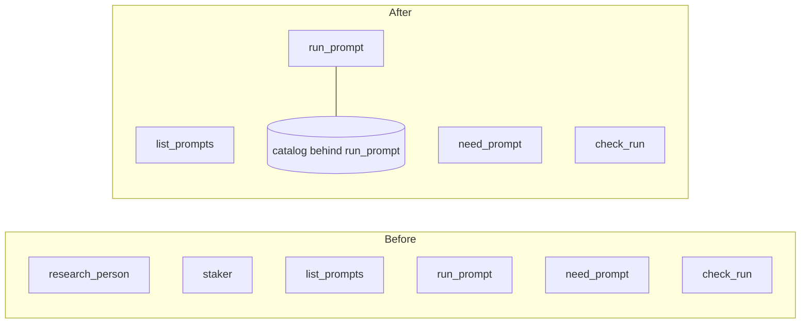

# PromptForge MCP server: correction and coherence

## 1. What is wrong

A PromptForge prompt is a command. It is invoked because someone named it - a user asking for a report, a developer testing a pipeline, or eventually a scheduler firing a run. It is never something a model reaches for because it noticed a tool that looked relevant.

The system was built on the opposite assumption, and not only in the server. `design.md` line 147 states that "a calling model selects from names, descriptions, and typed input schemas." `design-mcp.md` lines 65 to 73 reject a `list_prompts`/`run_prompt` dispatcher *because* it would collapse forty descriptions into one and leave the model unable to choose. `design-promptforge.md` line 120 says a prompt's description "steers a calling model's tool selection." The code follows: per-prompt tools published for direct selection, an `expose` field and a promotion workflow to decide which prompts compete, `need_prompt` to help a model discover a prompt it did not know it wanted, and two decisions built entirely around clients caching the tool list.

`notes.md` line 32 records the design that was rejected - "two MCP tools: `list_prompts`, `run_prompt`". That rejected design is the correct one.

This plan is correction and coherence only. It does not add output files, and it does not build the continuously running report runner; both are named in section 6 with what they would need.

## 2. Design decisions

**The governing principle, which outranks everything below and applies to every later plan: do more with less.** Before a feature earns new infrastructure, it must be shown that no existing facility can carry it. Lua already runs, with a sandbox and an instruction budget; a run-scoped store already exists with a file backend and is already exposed to Lua; the catalog already resolves globs and exceptions. A new frontmatter field, a new configuration key, or a new resolution path has to justify itself against all of that, and "it would be tidier" does not. The threshold is the key rather than the table, because configuration bloats one key at a time and nobody ever notices the table it accumulated into. The core stays minimal and its primitives get reused, because a small set of primitives used ten ways is a system a person can hold in their head, while ten mechanisms each used once is not.

This is the litmus test for every step here and for the work in section 6: can it be built with what is already there?

1. **`run_prompt` is the only way to invoke a prompt.** No prompt is published as a tool of its own, so nothing this server offers can be chosen for a task the caller did not ask for by name. A model that wants to run a prompt must name one, and naming one is what a command is.

2. **The published tool list is fixed at four entries and never changes.** `list_prompts`, `run_prompt`, `check_run`, and `need_prompt` when the `picker` feature is compiled in. This is the largest practical consequence of decision 1: because the tool list is static, the client-side caching that shaped two earlier decisions stops mattering. A prompt saved thirty seconds ago is callable immediately in every client with no reconnect and no restart, and the `notifications/tools/list_changed` machinery is deleted rather than fixed.

3. **`expose`, the promotion workflow, and the direct/listed distinction are removed, not defaulted off.** An opt-in would preserve the ambient-selection path and its caching problem while leaving the design two shapes to explain. The cost is real and accepted: a prompt can never be called under its own name as a tool, and per-prompt typed argument schemas are permanently off the table, since every call goes through one tool with one schema.

4. **There are two need-resolutions and they live in different crates.** *Need to tool* belongs in the executor: a prompt declares a capability it requires as a sentence or two, in frontmatter or its opening Lua, bound to an id private to the prompt, and the runtime resolves it to whichever concrete tool the deployment actually provides. That is the indirection worth having, because a prompt that names `web_search` or a particular provider is a prompt welded to one deployment. It is unbuilt, it is `promptforge-core`'s to build, and it is the tool-picker crate's primary reason to exist - the study specified it as `tools.add_need(alias, description)`.

5. **`need_prompt` resolves an inexact prompt name and stays.** *Need to prompt* is the second use of the same engine and it is a convenience rather than a requirement: the caller who says "run the promptforge prompt that builds a stakeholder report" without knowing it is called `staker`. The intent still came from a person naming what they want, so it does not conflict with decision 1, and its description says exactly that rather than inviting a model to go looking for something useful. It survives on economics as much as merit - once the executor resolves needs, `promptforge-core` depends on the picker and this server links core, so the model weights are in the process whether or not this tool exists. Its marginal cost is four tool definitions and one `shortlist` call, which is not worth deleting working code to avoid. `retrieval.rs` and the default-on `picker` feature are therefore untouched by this plan.

6. **The tool text is written in the register of a command interpreter.** It says what this server executes and that a caller names what to run. It carries no trigger phrasing, no "use this when", and nothing that competes for selection against a client's own tools. A model that ignores this and never calls the server is behaving correctly.

7. **A prompt named after a built-in still fails at boot.** Nothing shadows a tool name any more, so the collision is no longer structural, but "run `check_run`" is ambiguous to a human and to a model, and a boot refusal naming the file is the only version of that a prompt author can act on.

8. **The crate is `promptforge-mcp-server` and the binary matches.** The old name described a protocol; the new one describes a process, which is what it is and what the design documents already call it in prose. The rename reaches the library name (`promptforge_mcp_server`), the binary, `serverInfo.name` (which derives from `CARGO_PKG_NAME`), the test harness's `CARGO_BIN_EXE_*` variable, and the design document's filename.

9. **Every design document in both repositories says the same true thing when this is done.** A corpus where three documents argue for model selection and the code does the opposite is worse than either position; the argument for rejecting the dispatcher has to be replaced by the argument for accepting it, not merely deleted.

10. **A crate's design document lives in the crate root, named for the crate without the `promptforge-` prefix.** `design-tool-picker.md` and `design-webfetch.md` already do this; `design-promptforge-mcp.md` is the outlier and becomes `design-mcp-server.md`. The document travels with the code it describes, so a reader who has the crate has its design, and a rename or a deletion cannot leave a document orphaned in another repository. This is why the MCP server currently has two design documents that disagree - 973 lines in the design repository and 220 in the crate - and why `promptforge-core`, `promptforge-gateway`, and `promptforge-cli` are each documented from outside while carrying nothing themselves.

11. **The split is as-built versus not-yet-built, and the residue keeps its own file.** A crate's document describes what that crate does today and lives in the crate. Everything designed and unbuilt stays in the design repository as a sidecar named for what it is residue of - `design-core.md` becomes `crates/promptforge-core/design-core.md` plus `promptforge-design/design/design-core-residue.md`. So a migration is a division, not a move, and the design repository remains where forward design is read. That matters most for `design-core.md`, which specifies an `Executor`, slots, extensions, and output resolution against a crate that has `execute::run` and `RunOptions`, and for `design-cli.md`, which describes a CLI that is a client of this server taking `promptforge run PROMPT key=value` while the shipped one takes a file path and never speaks to the server. The cost is that this plan now audits three crates it was not otherwise touching, and the audits are the work rather than the moves.

12. **Only a crate that exists gets a document in the code repository.** Nothing else moves. `design-paperstore.md`, `design-classify.md`, and `design-label.md` describe extensions that were designed and never built, so they stay in the design repository beside the residues, and no folder is reserved for a crate that does not exist - an empty directory holding one markdown file claims a name without earning it, and the name is available when the code needs it. `design.md` holds the system's boundaries, `design-promptforge.md` is the prompt language, which core implements but does not own since a second executor would read the same document, `design-avatar.md` is a different product, and `design-map-reduce-synthesis.md`, `papergate-evaluation-funnel.md`, and `chatlight-fine-tuning-small-models.md` are memos and proposals. All of them stay. The consequence is a clean rule with no exceptions to remember: a document moves into a crate when, and only when, it describes what that crate does today.

13. **`design-mcp.md` is renamed to `design-mcp-server.md`.** The old name is ambiguous now that a `promptforge-mcp-client` is designed in the tool-picker study and may one day have a document of its own, and a reader should not have to open a file to learn which side of the protocol it describes. Its residue is therefore `design-mcp-server-residue.md`, in the design repository, while the crate's own as-built document is `crates/promptforge-mcp-server/design-mcp-server.md`. Two files with the same name in two repositories is deliberate: one describes the crate, one holds what the crate does not do yet.

## 3. What stays exactly as it is

Worth stating, because the reframe could be read as wider than it is. The catalog resolution and its glob-plus-exception rule, the per-prompt reload where a broken prompt stays listed carrying its error, the watcher, the deferred-collect ticket and `check_run`, admission, progress notifications, the finished-artifact sentence, boot refusing an incoherent catalog, and both transports are all unaffected. So is `Catalog::hash`, which the picker rebuild still needs.

## 4. Contracts after the change

### The tool surface

- `list_prompts` - no arguments. Every prompt this server can run, as `{name, description, version, problem}`. The `direct` field is gone with per-prompt tools.
- `run_prompt` - `{prompt, args?}`. The only invocation path. Name resolution is unchanged: normalized on case and `-`/`_`, exact after that, never a near miss, and an unresolvable name returns a result carrying the enabled names closest first.
- `check_run` - `{run_id}`. Unchanged.
- `need_prompt` - `{capability}`. Present with the `picker` feature. Rewritten as name resolution for a caller who described the prompt instead of naming it.

Each description states that this server executes named PromptForge prompts and that the caller supplies the name. The finished-artifact sentence stays on `run_prompt` and `check_run`.

### `prompts.toml`

`[catalog].default_expose` and `[prompts.NAME].expose` are removed. Every table still rejects unknown keys, so a configuration carrying either fails the load with a message naming the key - which is the right outcome, since silently ignoring it would leave an operator believing a prompt was promoted.

## 5. Steps

Each step is one commit with its code, tests, and doc comments.

**A code step that falsifies an example fixes that example in the same commit, even when the document is scheduled for rewrite later.** Steps 17 through 19 rewrite the crate's design document, but a reader between here and there should not be told to write a configuration that no longer loads or to call a tool that no longer exists. The repair is narrow - the example, the sentence around it, nothing else - and the rewrite still happens later. This is the same judgement that pulled the shipped `prompts.toml` into step 1, and it applies to `README.md`, `STATUS.md`, and any design document a step invalidates.

House rules are unchanged from the previous plan: `c:\Users\Vinnie\src\cursor\tools-public\how-to\rust-how-to.md` binds every change, `promptforge/AGENTS.md` is the repository's own, `STATUS.md` and `README.md` move with every commit, and a step whose implementation contradicts a decision here revises this plan in the same commit.

The gate for every step is `cargo fmt --all --check`, `cargo clippy --workspace --all-targets --all-features -- -D warnings`, the same clippy for `-p promptforge-mcp-server --no-default-features`, `cargo test --locked --workspace --all-features`, and `cargo test -p promptforge-mcp-server --no-default-features`. Note that a running server holds a lock on its own binary on Windows; stop it before building.

1. **Publish only the built-ins.** Remove per-prompt tool definitions from `crates/promptforge-mcp/src/tools.rs`, delete the `Expose` enum and `Entry::is_direct`, drop `direct` from the `list_prompts` payload, and rewrite every description and the session `instructions` in the command register of decisions 5 and 6. `retrieval.rs`, `retrieval/index.rs`, and the `picker` feature are not touched: `need_prompt` keeps working and only its description text changes. The shipped `prompts.toml` also loses its `default_expose` and `expose` lines and the comment describing the promotion workflow, because a configuration file that advertises a key nothing reads is a lie told to an operator, and the step 1 review found exactly that. The `Expose` enum and the configuration fields that parse those keys survive until step 3, which is where the schema changes; until then the parser tolerates a key it ignores, which is invisible to anyone who has not written one. Test: the golden `tools/list` is exactly the four built-ins for a catalog of three prompts, and a separate assertion that no prompt name ever appears as a tool name for any catalog; the descriptions carry no trigger or selection language; `list_prompts` still reports `problem`.

2. **Delete the list-changed machinery.** Remove `watch/sessions.rs`, the `Sessions` type and its threading through `PromptForgeServer::new`, `serve_http`, `serve_stdio`, and `Reloader`, the `ListChanged` trait, and `Reload::published_changed`. Keep `ranking_changed`, which the picker rebuild uses. Test: a reload still swaps the catalog and rebuilds the picker; a prompt added mid-session is callable through `run_prompt` with no notification sent and no reconnect; the capability is no longer advertised.

3. **Remove `expose` from the configuration.** Delete `default_expose` and the per-prompt `expose` field, and update the shipped `prompts.toml` and its comments. Test: a config carrying either key fails the load naming it; the shipped config still resolves against the repository's `prompts/` directory through the boot rule.

4. **Rename to `promptforge-mcp-server`.** The directory, the package, the binary, the library name and every `use promptforge_mcp::`, the workspace members list, `Cargo.lock`, `CARGO_BIN_EXE_promptforge-mcp` in `tests/it/stdio.rs`, the `serverInfo.name` assertions at `tests/it/stdio.rs:155` and `:206`, the usage text in `src/main.rs`, the log lines in `src/transport.rs`, the doc comments the survey lists in `config.rs`, `progress.rs`, `retrieval.rs`, and `tools.rs`, and the design document's filename, which becomes `design-mcp-server.md` per decision 10. Test: the whole gate passes, the stdio test asserts the new server name, and no occurrence of the old crate name remains outside a historical note.

5. **Sweep every crate for doc comments that call shipped code unbuilt.** The audit found three - `promptforge-core/src/client.rs` lines 3 to 4 claim "no tools, no streaming" while `complete()` sends tools, `promptforge-core/src/execute.rs` lines 25 to 28 say the tool-call loop is "still to come" when it is implemented below, and `promptforge-gateway/src/lib.rs` lines 9 to 12 list `web_search` as deferred when it ships - but three is what one audit noticed, not what exists. Check every crate-level and module-level comment in `promptforge-core`, `promptforge-gateway`, `promptforge-cli`, and `promptforge-webfetch` for the same defect: prose calling something deferred, planned, or absent when the code beneath it does that thing, or describing a shape the code no longer has. A comment nobody rereads while editing the code under it is precisely where this rots, so the sweep is the point and the three are the seed. Correcting a comment in the wrong direction - calling something built that is not - is the one outcome worse than leaving it. Verified by reading rather than by a new test, with `cargo doc` clean.

6. **Write the governing principle where it will be read.** Add it to `promptforge/AGENTS.md`, which every step of every future plan already loads, and to the top of `promptforge-design/design/design.md`, which claims authority over every boundary in the system. State it as the litmus test - can this be built with what is already there - and name the facilities it points at: Lua, the store, the catalog. This is deliberately a separate commit from the document corrections below, because it is a rule rather than a correction. Verified by reading; no test.

7. **Reconcile the documents that stay in the design repository.** `design.md` line 147 and `design-promptforge.md` line 120 state the model-selection model and must state explicit invocation instead - replacing the argument, not deleting it, so a reader learns why one tool per prompt lost. `notes.md` line 32's dispatcher sketch is now the shipped design and should say so. Name the crate correctly wherever it appears. Verified by reading; no test.

### The document migration, three commits per document

Steps 8 onward move one document at a time, and each document takes three commits in this order. Never start the next document before the current one is finished and reviewed.

**Refactor in place.** Reorganize the document where it already lives, in the design repository, into two plainly separated parts: what the crate does today, and what was designed and never built. Every claim in the built part is checked against the crate's code before it is called built. Nothing moves repositories, nothing is deleted, and no prose is rewritten beyond what the separation forces. The commit's diff is therefore reviewable for exactly two faults - content lost, and something claimed as built that is not.

**Transfer.** Move the built part into the crate root as `design-<crate>.md`, and write that file to the block tagged design-doc at the end of this plan, with the slug the crate takes. The block is not reserved for step 19: a standalone crate document is a design document, so it needs the three fixed sections - a title stating what the crate produces, an executive summary that stands alone, and the numbered key design choices - and those choices have to be authored from the crate's code, because a built part sorted out of a specification carries no rationale for what shipped and headings that state topics rather than points. Everything the built part says survives into the new file, reworded only where the block's rules force it; the design repository's copy loses that part in the same commit, so the content exists once. A reviewer checks the two halves of the diff against each other for anything lost or invented in transit, and checks every authored claim - each key choice above all - against the crate's code rather than against the diff.

**Finish the residue.** Rename what is left to `design-<crate>-residue.md`, in place in the design repository. Retitle it so a reader knows it is forward design rather than a description of a crate, state at the top what exists today and that the crate's own document describes it, fix every cross-reference in the other documents that pointed at the old whole, and delete whatever the transfer made redundant.

Order runs smallest first, because the shape is worth proving on a document where a mistake is cheap, and the MCP server's runs last because steps 1 through 4 change what its as-built truth is.

8, 9, 10. **`design-cli.md`.** The step 8 audit found the divergence total rather than partial, so these three commits take a shape the others will not. The document specifies an MCP terminal client - `run`, `list`, and `validate`, clap with a global `ConnArgs`, three-layer configuration through `etcetera`, `rmcp` over streamable HTTP with a bearer on every request, 503 retry, JSON Schema coercion of `key=value` pairs, an `indicatif` progress bar on stderr, elicitation on stdin, Ctrl-C mapped to an MCP cancel, and eleven documented exit codes. The crate is a minimal in-process runner: `promptforge run <file.md> [input]`, manual argv parsing, no clap, no MCP, no configuration file, a null observer, an in-memory store, and `ExitCode::SUCCESS` or `FAILURE`. The only overlaps are the binary name, the word `run`, tokio with `ExitCode`, and errors on stderr with the result on stdout - and every one of them misleads if transferred as written, because `run` names a file path rather than a catalog prompt, and the environment variable is `PROMPTFORGE_BASE_URL` where the document says `PROMPTFORGE_URL`.

So the built part is a handful of sentences that all need caveats, and step 9 cannot be a transfer alone: the crate's `design-cli.md` is written from the code, taking the audit's list of crate behaviour the document never mentions - the frontmatter version gate, the single raw `args` string, the in-memory sandbox store, the local `web_fetch` with an optional gateway-backed `web_search` - and folding in whatever the built part genuinely contributes. Step 10 then renames what is left to `design-cli-residue.md`, which will be nearly the whole document, and says at the top that it specifies a client that does not exist and that the crate's own document describes what does.

11, 12, 13. **`design-gateway.md`.** Unlike the CLI, this one has a substantial built half: the process shape, `POST /v1/chat/completions` with bearer auth and a constant-time comparison, exact-string model routing with a 404 on a miss, upstream substitution and the model rewrite, the flattened passthrough of everything the wire types do not name, `gateway.toml` with `deny_unknown_fields` and `${VAR}` interpolation, the `Secret` type, `validate()`'s three checks, the unauthenticated `GET /health`, the OpenAI error envelope, and the `Upstream` trait seam. Unbuilt: admission control and the whole budget model, endpoint pinning through `X-PromptForge-Run`, streaming, the Anthropic shim, model packs, hot reload, four of the five routes, most error variants, retries, graceful shutdown, and the observability section.

Two findings from the step 11 audit shape these commits. The document asserts as a boundary that the gateway holds no non-LLM credential, and the shipped `[tools.web_search]` Brave key contradicts it - so that is not a split between built and unbuilt but a claim the code refutes, and the built half must say what is true rather than repeating it. And `POST /v1/tools/web_search` is absent from the document entirely, along with its configuration table, its request and response shapes, and `ToolNotConfigured`, so the crate's document gains it from the code the way the CLI's did. Smaller traps: the document calls an endpoint's key `name` where the code has `id`, and `default_max_tokens` parses but is never read, which is partly-built and must be described as exactly that.

14, 15, 16. **`design-core.md`.** The largest divergence, and the step 14 audit puts roughly ninety percent of the document in the unbuilt half. It specifies an `Executor` with typed newtypes, slot maps, an `Extension` trait, a canonical tool vocabulary, structured run state with generated filing tools, declared outputs, explicit exits through `break_section`, `goto`, `Task` and `fanout`, postcondition `check()` with retries, `Limits`, and boot validation over the section graph. The crate is a fall-through MVP: parse, walk every top-level section in file order, run Lua, substitute, one model turn with a tool loop, and return a string.

**The vocabulary must be checked word by word, because the document and the code use the same names for different things.** This is the trap that makes a careless built-half worse than no document at all:

| Document | Code |
|---|---|
| `Executor`, `RunConfig` | `execute::run`, `RunOptions` |
| crate `promptforge` | crate `promptforge-core` |
| `Section.body`, `Section.script` | `Section.prose`, `Section.lua` |
| substitution over `params`, `state` | substitution over `args`, `var`, `sys` |
| `return_result`, a tool the model can call | a Lua top-level `return`, which no model can reach |
| `store`, meaning structured run state a prompt queries | `store`, meaning a run-scoped virtual filesystem |
| `version: String` | `version: u32` |
| entry at `## Main` | entry at the first H2, whatever it is called |

The `store` row is the dangerous one: same word, different subsystem, and a built half that transfers the document's `store` prose would describe a thing that does not exist under a name that does. The document also pins mlua 0.11.6 in Luau mode with a 64 MiB memory cap and one VM per run, while the crate uses mlua 0.10 with lua54, no memory cap, and a fresh VM per chunk.

**Part I is authored from the code, not sorted out of the document, and the same license applies here as at step 9.** The step 14 review flagged this as a departure from the refactor's shape, and the plan is what was wrong: with ninety percent unbuilt and a vocabulary that misnames the shipped thing in eight places, every sentence worth sorting would have needed rewriting on arrival, and a Part I assembled from the document's own prose would smuggle `Executor`, `store`-as-state, and `return_result` into a description of code that has none of them. The reviewability the refactor exists for is preserved differently: nothing is deleted, the whole original survives as Part II, and the review checks Part I claim by claim against the crate rather than against the diff.

**Step 15's crate document is written to the design-doc block, slug `core`.** The same reasoning that authors Part I from the code applies again on arrival: the crate's `design-core.md` is the only design document `promptforge-core` will have, and a reader of it needs the key design choices - the free function over an executor, fall-through control flow, the destroyed context, the store's precise meaning, the sandbox - each stating what, how, and why, none of which the specification supplies for the shipped shape. So the transfer authors those choices from the code, rewrites the built part's headings to state points, and keeps every claim the refactor checked. This is not a licence to change content: anything the built part asserted still appears, and anything newly asserted is checked against the crate.

Things the crate does that the document never mentions, which the crate's own document needs: the `promptforge:` frontmatter version gate, `default_return`, `max_tool_iterations`, the H1 title and description text, the Lua `var` and `sys` globals, `Tool::untrusted_output` and the guard block wrapped around untrusted tool results, and the store's numbered-line reads, `str_replace`, and `glob`.

17, 18, 19. **`design-mcp.md`, ending in the crate document's rewrite.** The step 17 audit found that almost nothing in this document is both true of the code and absent from the crate's own document, so step 18 is a thin merge and step 19 is where the work is. What the design repository's copy still gets right, the crate's document already says: the scope, the transport, the structural `/healthz` exemption, prompts as tools rather than the MCP `prompts` primitive, progress with no denominator, admission by refusal, the in-memory registry, boot refusing an incomplete catalog, the tool-name rule, and the per-request bearer. Per-prompt reload is not among them: the design repository's copy refuses the whole candidate catalog on any failure, which is the behaviour decision 6 of the crate's document deliberately inverted. What it gets wrong is nearly everything else, and in two directions: it specifies a great deal that was never built - one tool per prompt, the Django fire-and-poll surface, `RunResult.outputs` and `OutputRef`, `RunStatus::Queued`, slots, extension wiring, output roots, limits, remote MCP clients, the boot probe, the error taxonomy, service installation, and the `_meta` event payload - and it is stale where the code moved: it says stdio is not offered, that loopback is unsupported, that the bind default is `0.0.0.0`, and that reload announces `tools/list_changed`, all of which the code contradicts.

Both documents also lag today's commits. The crate's own document still describes direct per-prompt exposure, the `expose` configuration, the `direct` field in `list_prompts`, and the `tools/list_changed` notification - all deleted in steps 1 through 3 - and the design repository's copy names `rmcp` at `2.2.0` when the workspace pins `3.1.0`, while the crate's document names no version at all. Step 19 fixes that, and it is the reason this document goes last.

Three wrinkles the others do not have. Its first commit also renames it to `design-mcp-server.md` per decision 13, before the refactor, so the rename is visible on its own rather than buried in a reorganization. The crate already carries a document, so the transfer is a merge into the crate's `design-mcp-server.md` rather than a new file, and the merge has to reconcile two texts that disagree. And the third commit is not a tidy-up but the full rewrite from the finished work: the eleven passages the audit lists at lines 15, 29, 35, 37, 96, 109, 151, 165, 169, 171, and 214 all assume model selection, choices 2, 3, 12, and 13 are about exposure modes and steering that no longer exist, and four facts lag the code - the finished-artifact sentence, run logging at info, the Windows path fix in the watcher, and the optional token. That commit follows the block tagged design-doc at the end of this plan, with slug `mcp-server`. What is left in the design repository becomes `design-mcp-server-residue.md`, and that file is deleted outright only if nothing forward-looking survives in it, which is unlikely - the Django fire-and-poll surface, output roots, extension wiring, and service installation are all designed there and none is built. Two of those are what the continuously running deployment needs, so that residue is where the next plan starts reading.

Nineteen steps, and the three-commit shape is not negotiable for a document that splits: the refactor makes the split reviewable, the transfer makes loss detectable, and collapsing them would hide both in one diff.

## 6. Deliberately not in this plan

**Needs resolved in the executor.** The feature described in decision 4: a prompt declares the capability it requires in prose, bound to a private id, and the runtime resolves it against whatever tools the deployment provides. It removes the last place a prompt is welded to a particular implementation, and `promptforge-tool-picker` already has the engine and the four-outcome policy it needs - `resolve`, not `shortlist`, is the entry point for it, and the crate's calibrated floor and margin exist for exactly this decision. The governing principle settles where the declaration goes: a Lua verb, `tools.add_need(alias, description)`, which is what the study specified and which needs no new frontmatter field, no new parser branch, and no second place to look. What a design pass still owes is when it binds - boot, so an unresolvable need fails loudly rather than halfway through a run, is the interesting answer - and what happens when a need resolves to nothing.

**Somewhere to put a report.** Both repositories specify a mechanism: `outputs` in frontmatter at `design-promptforge.md` lines 161 to 165, output roots in `prompts.toml` at `design-mcp.md` lines 621 to 624, a resolver, and an `OutputRef` on the wire. The governing principle says try the existing facility first, and there is one: the run-scoped store already exists, already has a file backend, and is already exposed to Lua, so a prompt writing its report through the store into a directory the server configured would deliver the product with none of that new machinery. It may not survive contact - a naming convention and the returned path have to come from somewhere - but it is where the design pass starts, and the specified mechanism is what it falls back to if the store genuinely cannot carry it.

**The continuously running report runner.** The real deployment is a process producing reports at scale, a stakeholder report over every company in a list, monthly. Neither repository designs a scheduler: `design-mcp.md` assumes Django's Celery task is the durable queue and fan-out over subjects happens outside PromptForge entirely. What exists inside a prompt is `fanout()` over sections, which is one run doing many things, not many runs over many subjects. This needs a design conversation before it can be planned.

**The dossier system as a prompt.** A strong candidate - its phases are already gather, extract, synthesize, finalize, with fan-out at two levels and a fixed output schema at `umbra/dossiers/_SCHEMA.md`. The frictions are real: the rules live across three files and ad hoc plans rather than one executable spec, its acquisition phase is open-ended and judgment-driven, its Executive Summary is written last from everything before it which fights context clearing, and it needs private sources through several MCP servers rather than the open web. Also its own next step, once outputs exist.

## 7. How to run each step

Three subagents per step, and this applies to the document steps exactly as it does to the code ones: one writes, a second reviews with a fresh view, a third fixes, with findings passing through `vibe-review.md` and nowhere else. A document commit gets the same cold review as a code commit, because a migration that silently drops a paragraph or calls an unbuilt thing built is the same class of defect as a bug and is harder to notice later.

**Dispatch by reference, never by copy.** A dispatch carries the path to this plan, the step number, the path to `c:\Users\Vinnie\src\cursor\tools-public\how-to\rust-how-to.md`, and nothing else of substance. It does not restate the step, and it does not carry guidance invented at dispatch time. If a subagent needs to know something, that something is written into this plan first and the dispatch points at it - otherwise the real instructions live in a chat message that no later reader can find, and a prompt that inlines its constraints is a prompt that can be shortened into one that drops half of them. This was violated throughout the previous build and is the discipline most worth keeping here.

**What the main context does.** It commits, amends, reads bounded output such as a status line or a test summary, and decides what to dispatch next. It does not read source, diffs, or design documents: those are dispatches, because their size depends on what they contain and the context holding the plan has to survive nineteen steps. A finding that needs judgement comes back as a subagent's report, not as a file for me to read.

**Migrations start with an audit.** For each of steps 8, 11, 14, and 17, the first act is a read-only subagent that checks the document against its crate's code and reports, claim by claim, what is built and what is not, citing the file that proves each. The refactor is written from that report. The divergence is the whole difficulty of these steps, and a writer that audits and rewrites in one pass will believe the document.

To review, apply the general checks in `c:\Users\Vinnie\src\cursor\tools-public\how-to\vibe-how-to.md` (grep it for `code-review`), the language rules in `rust-how-to.md`, and the project checks below.

<mcp-review>
Project checks, applied in addition to the general ones and to the language guide:

1. Does every public item carry a `///` with `# Errors` wherever it returns `Result`, and does `RUSTDOCFLAGS="-D warnings" cargo doc --no-deps --all-features` pass?
2. Is the change free of `unwrap`, `expect`, and `unsafe` outside test code?
3. Do public error types stay `#[non_exhaustive]`, avoid leaking a dependency's error type, and read as lowercase noun phrases with no `failed to` and no trailing period?
4. Does any published tool name, description, or instruction read as a capability offered for selection rather than a command executed on request? Any trigger phrasing, any "use this when", any claim on a situation, is a failure.
5. Can any prompt name reach `tools/list`, by any path, for any catalog?
6. Does the tool result carry the prompt's returned value and no accidental transcript, prose, or section body?
7. Is `Observer::on_event` free of anything that can block or await, and is no `std::sync` guard held across an `.await`?
8. Does every configuration field the plan names exist with the spelling and default the plan gives, and is every removed field rejected rather than ignored?
9. Are new tests in the right place - unit tests in the file under test, integration tests inside the single `tests/it` binary - and does any filesystem test use a temporary directory rather than the tree?
10. Does the change still build and pass with `--no-default-features`?
11. Where the implementation departed from a decision in section 2 or a contract in section 4, does the same commit revise that text with what forced the change?
12. Does the change add a frontmatter field, a configuration key, a public type, or a resolution path that an existing facility - Lua, the store, the catalog, the observer - could have carried? If so, say which facility and why it was rejected; an unanswered version of this question is a failure.

For a document migration commit, these three replace checks 1 through 3, which are about code:

13. Refactor-in-place: is anything in the built part not actually built? Check each claim against the crate's code, naming the file that proves or refutes it. Was any content dropped rather than sorted, and was any prose rewritten beyond what the separation required?
14. Transfer: does every claim that left the design repository appear in the crate's document, does that document satisfy the design-doc block - three fixed sections, headings stating points, every element giving what, how, and why - and is every claim it authored beyond the transferred content, the key design choices above all, true of the crate's code, with the file that proves it named?
15. Finish: does the remainder say plainly that it is forward design, name what exists today and where its document lives, and does any other document still point at the part that moved?
</mcp-review>

<design-doc>
OUTPUT A DESIGN DOCUMENT, NOT CODE. Write one markdown file, design-{slug}.md,
that explains the design of what this plan describes. You run as the final step
of the plan, after the implementation is complete, so describe the design as
built, reconciling against the finished work any decision the implementation
changed from what this plan first recorded.

NO IMPLEMENTATION CODE - no function bodies, no private machinery, no
step-by-step algorithm walkthroughs. You MAY include any normative artifact the
design needs to remove ambiguity: public signatures, schemas, state or
transition tables, wire formats, configuration syntax, sequence diagrams, and
pseudocode. Each such artifact must express a design contract, not an
implementation technique; include one only where prose cannot say the same
thing as precisely, and show the artifact alone, not the surrounding machinery.

FOR EVERY DESIGN ELEMENT, STATE THREE THINGS: what is observed (by the user or
by an external consumer), how it is structured, and WHY - the motivation, the
rationale, the principle. For a costly-to-reverse element, "why" must include
what reversing it later would cost.

DESIGN-ELEMENT TEST - include something only if changing it would change ANY of:
  (a) ANYTHING THE USER SEES, READS, WRITES, TYPES, OR NAMES. For a library the
      user is the caller, so this is the PUBLIC API - its operations and their
      contracts (ownership, lifetime, thread-safety, error and complexity
      guarantees). It also includes every config file or frontmatter the user
      edits, and - critically - the NAMES of everything the user sees. A name
      is a design decision: `goto` is a good one, `clear_and_transfer_control`
      is a bad one. Naming is design.
  (b) the shape or structure of the system.
  (c) something costly or hard to reverse that the user never sees - the ABI,
      an on-disk or persisted format that outlives a version, a high-reach
      convention that touches everything, or a cross-cutting quality trade-off
      (security, failure modes, data lifecycle, performance).
If it is none of these - merely how you implement the design behind those
surfaces, such as a private helper type, an internal algorithm choice, a
dependency version pin, or a serialization used only between your own
components - it is implementation. Leave it out.

A public interface is design; a private type is implementation - the same
struct is on opposite sides of the line depending on whether the user sees it.
Describe an interface's shape and contract in prose by default; show the actual
artifact - a signature, a schema, a state table - wherever that artifact is
itself the load-bearing decision and prose would blur it. No fixed budget binds
these; each earns its place only by being load-bearing.

COMPRESS BEFORE WRITING - only if the design carries far more ditchable detail
than load-bearing decisions (roughly 10 to 1 or worse). If it is already lean,
skip this. Run the pass in order, cheapest cut first, and stop once the ratio
is healthy:
  1. Drop a default only when changing it would change no observable behavior
     and carry no meaningful risk. A consequential default - a timeout,
     ownership, a security posture, a retry policy, a resource limit, a
     compatibility choice, a failure mode - resolved a real fork and stays.
  2. Move anything decidable later at little or no extra cost to a "decide by
     use" list, or drop it. A cheaply-deferrable element is not a headline one.
  3. Replace an enumeration with the rule that generates it.
  4. Merge consequences into the decision that forces them, and sibling
     elements into their shared pattern.
  5. Name a known pattern instead of re-deriving it.
  6. Rank what remains and keep about 10 to 15 headline elements; demote the
     rest to one line.
  7. Delete anything whose removal would still let a competent builder build
     the right thing.

STRUCTURE - three fixed sections, then whatever the design earns:
  - A title stating what building this produces.
  - An executive summary that stands alone; a reader acts on it without the body.
  - A numbered list of the 10 to 15 key design choices, each a short paragraph.
Then, for a reader who stops early:
  - Write headings that state the point, not the topic ("Labels compute at
    boot, off the critical path", not "Labels").
  - Keep rationale in prose; do not bulletize an argument. Enumerate only
    parallel items (decisions, constraints, options).
  - State the evidence before the value word: never "fast" before the number.
  - Where a choice resolved a real fork, name the alternative and why it lost.
  - Order by importance; put a dependency first only where the reader needs it
    to follow what comes next, so cutting from the bottom never removes the core.
  - Add no YAML frontmatter. Close with one italic line naming the date and the
    model. Name no tool, rulebook, or source document for the document's own
    rules or structure.

CHECK BEFORE FINISHING, and fix any no: no implementation code, and every
normative artifact expresses a contract rather than a technique; every element
states what, how, and why; headings state points; no argument is bulletized;
the compression ratio is healthy; no source document is named. If the plan
carries no key design choices, write no document and return the reason.
</design-doc>
