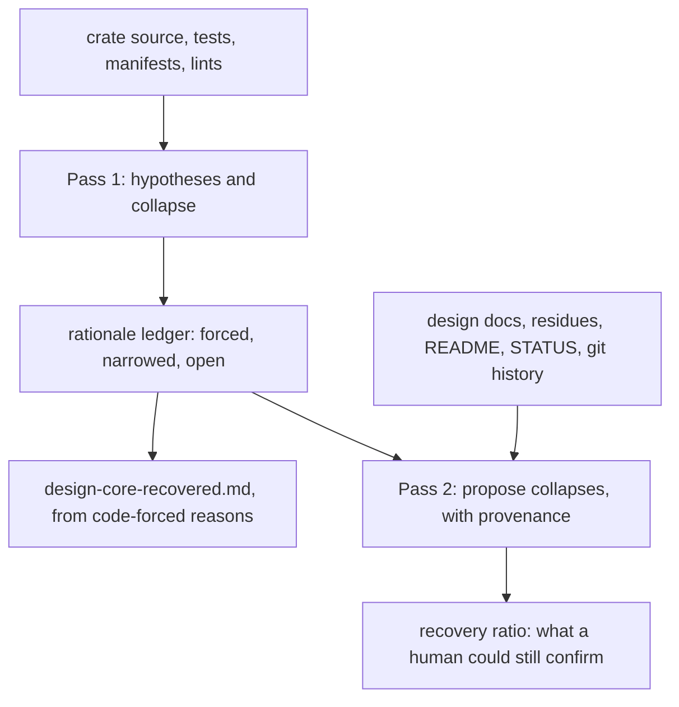

# Recovering the design of promptforge-core from its code

## 0. Paths

Every relative path below is relative to the code repository. Nothing in this plan depends on anything said in the conversation that produced it.

- Code repository, and the only git repository this plan commits to: `c:\Users\Vinnie\src\cursor\promptforge`
- The crate under study: `crates/promptforge-core`
- The ledger: `research/2026-08-03-recover-rationale-promptforge-core.md`, inside the code repository, so each step is a real commit with a real diff
- The archive repository, opened only in pass 2: `c:\Users\Vinnie\src\cursor\promptforge-design`
- Review findings, overwritten each cycle: `c:\Users\Vinnie\src\cursor\cabinet\_scratch\recover-rationale\vibe-review.md`
- Pass 1 group files, one per extraction step: `c:\Users\Vinnie\src\cursor\cabinet\_scratch\recover-rationale\group-<n>.md`

## 1. What this is and why it might work

A design document is mostly *why*. Code contains *what*. The bet here is that a large part of the why is recoverable anyway, because most design choices are forced by constraints that are themselves visible in the code - and where nothing forces a choice, that fact is worth stating rather than papering over.

The method: for each design element, write down three or four competing explanations, then hunt the crate for evidence that kills them. What survives is the answer. How many survive is itself the finding.

An element that collapses, from this crate:

> `execute::run` takes its gateway client through `RunOptions` rather than reading the environment. Competing reasons: injection for testability; a caller configured from a file cannot set the environment; avoiding global mutable state as a matter of taste; no reason at all. Now the evidence. The workspace manifest sets `unsafe_code = "forbid"`. The crate is edition 2024, where `std::env::set_var` is unsafe. So a file-configured caller *cannot* set the environment in this workspace - the second explanation is not preference but necessity. `GatewayClient::from_env()` survives as the `None` path, which kills "no reason at all". Testability remains true but is a consequence rather than a cause, because it would not have forced the change alone.
>
> Verdict: **forced**, and the document can say so flatly.

An element that does not collapse, from the same file:

> `DEFAULT_MAX_TOOL_ITERATIONS` is 24. Competing reasons: measured, at the point where prompts stop converging; derived from a token budget; a round number chosen to be generous; inherited from somewhere else. Now the evidence, and what makes this example worth keeping is that none of it kills anything. The constant is declared at `execute.rs:50` and read once, at `execute.rs:231`, as the fallback when a prompt's frontmatter declares no `max_tool_iterations`. A test pins the value: `tool_loop_uses_the_default_cap_when_unspecified` drives a model that never converges, asserts the loop makes exactly that many round trips, then asserts the constant equals 24. So somebody chose the number on purpose and nailed it down. That still says nothing about where 24 came from: no other constant relates to it, no test probes behaviour on either side of it, and 24 is not a round number, which weighs against generosity without refuting it. Measured, budgeted, and inherited all survive.
>
> Verdict: **open**. The code fixes the number deliberately and does not say where it came from, and the document should say exactly that.

The failure mode this guards against is confident fabrication. A model asked why some code is the way it is will always produce a fluent answer, and a wrong one reads exactly like a right one. Requiring competing explanations and demanding evidence to kill them is what makes "I cannot tell" a reachable answer.

## 2. The method, precisely

**What counts as a design element.** Include it only if changing it would change one of three things: what a person sees, reads, writes, types, or names - for a library that means the public API and its contracts, and it emphatically includes the *names*; or the shape of the system; or something costly to reverse that nobody sees, such as an on-disk format, a cross-cutting convention, or a security or failure-mode trade-off. A private helper, an internal algorithm, or a dependency version is implementation. This test is stated at length in the `design-doc` block at the end of `c:\Users\Vinnie\src\cursor\tools-public\tools\architect.md`.

**What counts as evidence.** Anything structural in the permitted sources: a type, a signature, a lint setting, an edition, a test that would fail otherwise, a trait bound, a name, an absence where a presence would be expected. Also the language and its ecosystem - knowing that `set_var` is unsafe in edition 2024 is reasoning, not reading. Plausibility is *not* evidence. "This is the sort of thing people do for testability" kills nothing.

**How a hypothesis dies.** Either the evidence makes it impossible, or it makes it unnecessary - something else already forces the outcome, so this reason cannot be why. Record which, and cite the file and item.

**A hypothesis no evidence could ever touch is discarded, not counted.** "As a matter of taste" and "the author preferred it this way" are true of every choice ever made and can never be refuted by anything in a file. Write `unfalsifiable` where that hypothesis's evidence would go and leave it out of the survivor count. Without this rule every record carries one immortal taste hypothesis, nothing is ever forced, and the verdicts all slide one notch toward open. Discarding one is not free, though: a record whose only real competition was unfalsifiable has three hypotheses in name and one in fact, which the paragraph below forbids.

**The three verdicts.**

- **Forced** - one explanation survives. State it as fact and name the constraint that forced it.
- **Narrowed** - two survive. Name both and say what would distinguish them.
- **Open** - three or more survive, or the choice is arbitrary within a range. Say the code does not determine it.

An element whose hypotheses were never seriously competing is a failure of the method, not a success: if all four candidates are variations of one idea, the collapse is theatre. Three genuinely different explanations, or say so.

## 3. Pass 1 is blind, and the isolation is the experiment

Pass 1 may read: everything under `crates/promptforge-core/src` and its tests; `crates/promptforge-core/Cargo.toml`; the workspace `Cargo.toml`, `clippy.toml`, and `rustfmt.toml`; and the `src` of sibling crates, but only to see how core's API is *used*, since call sites are legitimate structural evidence.

Pass 1 may not read: `crates/promptforge-core/design-core.md`; any other `design-*.md` in any crate; anything in the `promptforge-design` repository; `README.md`, `STATUS.md`, or `AGENTS.md`, all of which carry rationale; and any git history - no `log`, `show`, `blame`, or commit message.

One practical guard, because the forbidden files sit next to the permitted ones and a careless search walks straight into them. Every crate keeps its design document beside its `src` directory, so an unscoped grep across `crates/` prints rationale from `design-core.md` into the very context that is supposed not to have it, and once printed it cannot be unread. Scope every search to source: `rg <pattern> --glob 'crates/*/src/**' --glob '!*.md'`, or name the file directly. A pass 1 step that has already seen a forbidden line says so in its report rather than pretending otherwise, because a contaminated record dressed as a clean one is worse than a missing one.

**Comments are treated as absent.** Every `//`, `///`, and `//!` is invisible in pass 1. This is deliberately blunt: deciding which comments merely describe and which give reasons is itself a judgement call, and pass 1 is meant to have none. Identifiers survive, including test names, which are often the best evidence in the crate.

The cost is real and worth accepting. This crate's comments are unusually good, so pass 1 will report *open* on questions the file plainly answers three lines above. That is the point - it measures what the method recovers when nobody wrote it down, which is the situation the tool exists for.

## 4. Pass 2 opens the archive to measure what it could add

Everything forbidden above becomes available: the design documents and residues in `promptforge-design`, the crate's existing `design-core.md`, `README.md`, `STATUS.md`, `AGENTS.md`, and the full git history.

For every element that came out narrowed or open, search that material for anything bearing on it and write a **proposal**: the collapse it would justify, the evidence, and the evidence's provenance - a file and line, or a commit hash and its date.

Provenance is not decoration. This repository's own history contains reversals: the design corpus argued that a calling model should select among per-prompt tools, and later commits deleted that and made invocation explicit. A proposal citing the older document without its date would argue for a design that no longer exists. Two further cautions. The residues describe things that were never built, so rationale found there may explain an intention rather than the code. And many commit messages are self-reported by the agent that wrote the change; they may record the reason that sounded best afterward.

**No proposal is ever applied, because no human enters this run.** A proposal is a measurement: it records what a person could confirm if they read it, and it stands as the ledger's audit trail. It never moves a verdict and it never becomes rationale in the document. The verdicts that reach the document are the ones pass 1 reached from code alone. This is deliberate - it measures exactly what code and archive recover without anybody's memory, which is the number worth knowing before pointing this at a codebase nobody here wrote.



## 5. The ledger, and its record format

One file, `research/2026-08-03-recover-rationale-promptforge-core.md` in the code repository, holding one record per element in this shape:

```
### E-014  The gateway client is passed in, never read from the environment
Element:    RunOptions::client, crates/promptforge-core/src/execute.rs
Kind:       public API
Hypotheses: H1 injection for testability
            H2 a file-configured caller cannot set the environment
            H3 avoiding global mutable state, as taste
            H4 incidental, no reason
Evidence:   workspace Cargo.toml, [workspace.lints.rust] unsafe_code = "forbid"
            edition 2024: std::env::set_var is unsafe
            client.rs:163 GatewayClient::from_env retained as the None path
Survives:   H2. H1 is a consequence, not a cause. H3 is unfalsifiable here.
            H4 refuted by the retained fallback.
Verdict:    FORCED
Reach:      every caller of execute::run
Seen by:    the caller
```

`Reach` and `Seen by` are the ranking inputs for the document: how much breaks if this changes, and whether a person ever encounters it. Both are needed, because a single configuration key can have almost no reach and still be the first thing a reader must understand.

## 6. Steps

Each step is one commit in the code repository. Dispatch every step to a fresh subagent by reference - hand it this plan's path and the step number and nothing else of substance; if a subagent needs to know something, write it into this plan first. Review each commit in a second subagent with a fresh view, fix in a third through the review file named in section 0, then amend. Keep git in the main context and do not read source there.

1. **Fix the format before anything is gathered.** Create the ledger with the method from sections 2 and 3 restated at its top, and the two worked examples from section 1 written out as full records, `E-001` for the client and `E-002` for the iteration cap. Nothing else. A later step that disagrees with the format changes it here, in its own commit.

2, 3, 4, 5. **Pass 1 extraction, four steps that run at the same time.** The groups are disjoint, so nothing is gained by making one wait for another: `parser.rs` with `lib.rs` and `error.rs` is step 2; `execute.rs` with `execute/tests.rs` and `observe.rs` is step 3; `lua.rs`, `subst.rs`, and `store.rs` is step 4; `client.rs`, `tools.rs`, and `tools/web_search.rs` is step 5. Each writes its records to its own group file from section 0 and never to the ledger, so four agents writing at once cannot collide or overwrite each other. Each numbers its records in its own reserved range - step 2 from `E-201`, step 3 from `E-301`, step 4 from `E-401`, step 5 from `E-501` - which keeps every identifier unique without any agent needing to see what another wrote; step 6 renumbers them into one sequence. Each reports its verdict counts, because a group returning all-forced is a signal that hypotheses were not competing.

These four steps carry no commit of their own. The group files are scratch and live outside the code repository, so there is nothing for git to record until step 6 folds them into the ledger, and the whole extraction lands as that one commit. Reviewing them still happens here rather than after the merge, and gains from being early: four reviewers each hold one small group, they run at the same time, and every fix is applied before the records are renumbered into a single sequence. A reviewer reads the group file itself, since a new file has no diff to read.

6. **Merge and rank.** Fold the four group files into the ledger, renumber into one `E-0NN` sequence, deduplicate elements that two groups both found - keeping the record with the stronger evidence and noting the other group also reached it - fill `Reach` from actual call sites in the sibling crates, and order the ledger by reach and visibility together. Report the three verdict counts and the ten highest-ranked elements. The group files are scratch and are not committed.

7. **Pass 2 proposals, as measurement.** Search the archive for every narrowed and open element and append a proposal to each, with provenance and date. Change no verdict. These proposals are the measurement of what a human could confirm and the ledger's audit trail; because no human enters this run, none is ever applied and none becomes rationale in the document. Report how many elements found candidate evidence and how many found none.

   Pass 1 leaves most records narrowed or open - on the order of four dozen - and each one needs the whole archive searched against it, so this runs as three agents over disjoint thirds of the record list rather than one agent over all of them. Splitting by record cannot produce two proposals for one element the way splitting by archive source would, since no two agents share a record. Each writes to its own proposal file in the scratch directory from section 0 and none touches the ledger; a fourth agent then appends all three into the ledger, which is also the only place a proposal that bears on two records can be noticed. The commit is still one commit.

8. **Write `crates/promptforge-core/design-core-recovered.md` as a design document, organized by the system rather than by the ledger.** Follow the `design-doc` block at the end of `c:\Users\Vinnie\src\cursor\tools-public\tools\architect.md`: it is the authority on the document's shape - three fixed opening sections, ten to fifteen headline choices with the rest demoted to a line, headings that state a point, ordered by importance, naming no source document. The ledger is the evidence behind the document, not its outline: consult it, never transcribe it. A document a reader could rebuild by rewording the ledger one record at a time has failed, however clean its sentences, because the reader wanted the crate and got the audit trail. Stay blind to the existing `design-core.md` - do not read it - so the recovered document is an independent artifact the two can be compared against; leave it untouched.

   The block covers the document's shape and its "why"; the one thing it does not cover is how to be honest about what code alone could not establish, which is this method's whole point and its trap. The rule: the audience is a reader learning the crate, not an auditor of the recovery.
   - Where the code forced the reason, state it as fact, which is the block's own "why".
   - Where the reason is not settled but a reader cannot act on not knowing it, state what the code does and omit the reason, silently, the way any honest design document leaves out what its author does not know. No verdict word, no "the code does not determine this".
   - Where the reason is not settled and a reader could otherwise build on a decision nobody made, spend one sentence saying so. The linear section walk is the case: a reader must not take file order for a chosen control-flow design when it may be the only shape built so far.
   Rationale appears only where the code forced it; pass 2's proposals are unconfirmed and never become reasons here. No record identifiers and no verdict vocabulary in the body - the ledger is the committed audit trail and the recovery ratio is step 9's job.

9. **Report the recovery ratio.** In the commit message and a short report, from the ledger as pass 1 settled it: how many elements the code forced on its own, how many pass 2 found archive evidence for but no human confirmed - the recovery this run leaves on the table - and how many stay open with nothing bearing on them. No verdict moved in this run, so these three account for every element. That ratio is the experiment's actual result and the thing worth knowing before pointing this at a codebase nobody here wrote.

## 7. How the document must read

This plan exists because the documents this repository produces keep failing in two ways. The first was accurate and unreadable: correct sentences asserting compressed abstract properties. The second, worse, was accurate and useful only to an auditor - the rationale ledger transcribed into sixty-one verdict-reciting paragraphs, each stapled to a record identifier, teaching a reader nothing about how the crate works. Three rules bind the document step, and the review enforces them.

**The document is organized by the system, not by the ledger.** Its spine is how a prompt becomes a run - the shape a reader needs - and the `design-doc` block governs that shape. The ledger is the evidence; the document teaches the crate. A document that could be rebuilt by rewording the ledger one record at a time has failed no matter how clean its sentences, because the reader wanted the crate and got the audit trail.

**State what happens, not what property a thing has.** The failing register asserts attributes in compressed abstract nouns; the working one says what occurs and why anyone cares. The pair to keep in view, both describing the same fact:

- Bad: "Parsing is total and produces no side effects. A `Prompt` is inert data: it can be constructed, inspected, and enumerated on an MCP surface without running any prompt code."
- Good: "Reading a prompt file never runs anything inside it, which is why a server can list prompts and show what each one claims to do without executing them."

**Never count what you do not name.** "Two of those five are refuted by the code" sends a reader hunting. Name the two.

<recover-review>
Checks for this work, applied with the general ones in `c:\Users\Vinnie\src\cursor\tools-public\how-to\vibe-how-to.md` (grep it for `code-review`):

1. Does every record carry at least three genuinely competing explanations, rather than one idea in four costumes?
2. Does every dead hypothesis cite evidence that exists - open the file and confirm it says what the record claims - and does that evidence make the hypothesis impossible or unnecessary, rather than merely unlikely?
3. Does any collapse rest on plausibility alone? That is the failure this method exists to prevent.
4. Does the verdict match the surviving count - one is forced, two is narrowed, three or more is open - counting neither the dead hypotheses nor the ones discarded as unfalsifiable?
4a. Does any record lean on a hypothesis marked unfalsifiable to reach its count of three genuinely competing explanations? A record with two real hypotheses and a taste hypothesis has not met check 1.
5. In a pass 1 commit, does any citation come from a forbidden source - a design document, a residue, a README, STATUS, AGENTS, a comment, or git history?
6. In a pass 2 commit, does every proposal carry provenance and a date, and does it leave the verdict unchanged?
7. In the document, could a reader who never saw the ledger learn how the crate works from it? A document useful only to an auditor of the recovery has failed.
7a. Does any paragraph exist mainly to report a verdict or to point at a record, and does any record identifier or verdict word - forced, narrowed, open - appear in the body? Either is the ledger-transcript failure this rewrite exists to prevent.
7b. Is uncertainty spent only where not knowing changes what a reader would build, and omitted silently everywhere else? An element whose openness a reader cannot act on should read as a plain statement of what the code does.
7c. Is every claim supported by a code-forced record, with nothing asserted beyond what survived and nothing drawn from an unconfirmed proposal? Not every record need appear; every claim must be earned.
7d. Does the document obey the `design-doc` block's shape - ten to fifteen headline choices with the rest demoted, headings that state a point, ordered by importance, no source document named?
8. Prose: does any sentence assert a property where it could say what happens? Does any sentence count things it never names?
9. Prose, sampled: pick three sentences at random and say what each means in your own words. If any cannot be paraphrased, the section it came from is rewritten - not the sentence, the section.
</recover-review>

## 8. What this cannot recover, stated up front

Contingency. A number chosen inside a range, a fact measured outside the repository, an approach tried and abandoned. The clearest example lives one crate over: the MCP server waits 240 seconds before handing back a run id, and the reason is that Cursor abandons a remote tool call at about 300 seconds - something learned from forum threads and staff replies, which appears in no file and never could. Pass 2 can recover it from a commit message; pass 1 cannot recover it at all.

Worse, and unfixable: a deleted alternative leaves no trace. Nobody reading the current server could learn that prompts were once published as individual tools or why that lost, and "what lost and why" is the most valuable line a design document has. When the ledger reports a high open count, some of it is this - not a failure of effort, but the archaeology being genuinely gone.
