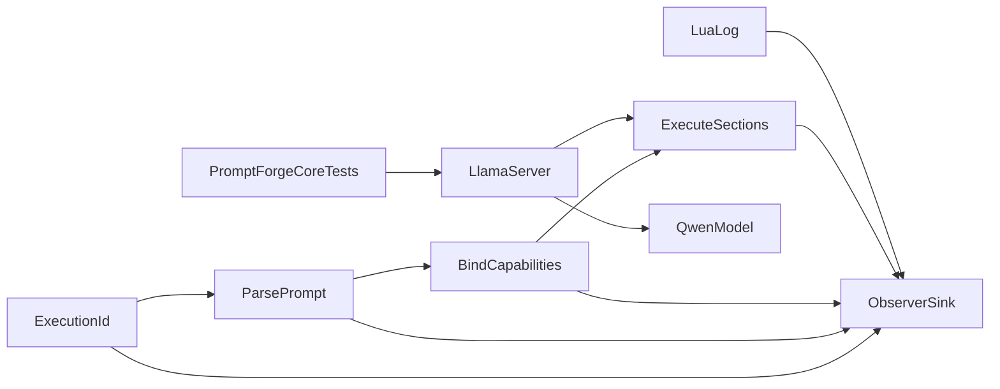

# Prompt Fixtures and Lua Logging

## Resolution 1: What is being built

- Observer reports gain a stable execution ID: `observe(execution, section, detail)`.
- Lua gains constrained `log(message)` routed through the observer; direct `print` is disabled.
- The unused author-facing YAML `version:` field is removed everywhere, while required `promptforge:` engine-version behavior remains unchanged.
- A new unpublished `promptforge-core-tests` crate owns readable prompt fixtures and an explicit real-model test executable.
- Existing inline tests remain authoritative for narrow grammar, sandbox, and tool-loop edge cases. File fixtures cover complete author-shaped prompt stories.
- The real-model path talks directly to a pinned local `llama-server`; `promptforge-gateway` is not part of this test layer.

## Resolution 2: Components in dependency order

1. **Observer correlation.** Execution IDs must exist before Lua logs or fixture traces can be correlated.
2. **Lua diagnostics.** `log()` depends on the correlated observer seam and supplies checkpoints consumed by execution fixtures.
3. **Prompt metadata cleanup.** Removing author `version` establishes the final grammar before canonical fixture files are accepted.
4. **Model-test fixture harness.** The new crate depends on the final parser API and grammar.
5. **Offline execution fixture catalog.** Deterministic fixtures depend on observer IDs, Lua logging, final metadata, and the new crate.
6. **Artifact provisioner.** Cached llama-server and model downloads depend on a stable test-crate boundary but remain outside normal `cargo test`.
7. **Real-model runner.** Tool-call tests depend on the provisioner, fixtures, and a healthy local llama-server.

## Resolution 3: Settled component behavior

### Observation and concurrency

- The harness creates one execution ID before parse, bind, and run, then threads it unchanged through every observation.
- MCP reuses its existing run ID. CLI generates one ID per invocation. Library callers provide an ID explicitly.
- Observer implementations own synchronization. Recording observers use `Mutex<Vec<_>>`; `log()` itself adds no global lock and never holds a lock across an await.
- Async tasks may move between OS threads, so the identifier is an execution ID, never a thread ID.

### Lua logging

- `print` is removed by the Lua hardening pass and covered by a sandbox regression test.
- `log(message)` accepts exactly one UTF-8 string, at most 256 characters, containing no newline or control characters.
- It emits `detail = "Lua: <message>"` under the current execution ID and H1 or H2 section.
- It is installed phase-locally for H1 binding, shared replay, preamble, epilog, and the compatibility `run_chunk` path. No observer reference survives a Lua phase or model await.
- Lua log text is the single explicit author-controlled exception to the observer's otherwise payload-free detail rule. Documentation forbids logging arguments, replies, tool results, credentials, paths, or store contents.
- `NullObserver` discards logs without changing execution.

### Version removal

- Remove `Frontmatter::version`, catalog and run-result version fields, version constructor arguments, MCP JSON `version` properties, and author-version documentation.
- Keep `Frontmatter::promptforge`, `promptforge_version`, `UnsupportedVersion`, CLI detection, catalog detection, and runtime engine-major gating unchanged.
- Existing YAML `version:` becomes an ignored unknown key, but all repository prompts and fixtures remove it.

### Prompt files

```text
crates/promptforge-core-tests/
  Cargo.toml
  src/
    main.rs
    artifacts.rs
    server.rs
    suite.rs
  prompts/
    valid/
      minimal.md
      shared-library.md
      preamble-prose-epilog.md
    invalid/
      missing-h1.md
      misplaced-shared-lua.md
      malformed-epilog.md
    execution/
      log-checkpoints.md
      preamble-return.md
      store-fallthrough.md
      real-text.md
      real-tool-call.md
```

- Move the user-created [`promptforge-core/tests/valid/1.md`](C:/Users/Vinnie/src/cursor/promptforge/crates/promptforge-core/tests/valid/1.md) to `promptforge-core-tests/prompts/valid/minimal.md` and use it as the canonical minimum prompt after version removal.
- Register each fixture explicitly with `include_str!`; do not add directory discovery, TOML manifests, generated loaders, or build scripts.
- Valid cases assert parsed structure. Invalid cases assert the error variant and a stable message fragment. Execution cases assert result, store effects, and exact `(execution, section, detail)` checkpoints without a live network or model.
- Keep current inline tests for exact fence near-misses, individual malformed fields, instruction budgets, mock gateway wire behavior, and picker policy.

### Real-model testing

- Add an unpublished workspace binary crate named `promptforge-core-tests`.
- Ordinary `cargo test` for this crate runs only offline fixture and artifact-provisioning unit tests and never downloads or launches anything.
- `cargo run -p promptforge-core-tests` is the explicit real-model command.
- Cache artifacts under repository-root `.model-cache/`, which is gitignored and survives repeated test runs.
- Pin official CPU-only llama.cpp release assets per supported platform, store URL plus SHA-256 in code, download to `.part`, verify, extract, and atomically rename.
- Pin the official `Qwen/Qwen3-0.6B-GGUF` file `Qwen3-0.6B-Q8_0.gguf`, size 639 MB, SHA-256 `9465e63a22add5354d9bb4b99e90117043c7124007664907259bd16d043bb031`.
- Start `llama-server` directly on loopback with Jinja tool templates, temperature zero, thinking disabled, a 4096-token context, and a small generation limit. Select a free port, poll readiness with a deadline, capture diagnostics, and guarantee child termination on success, failure, panic, and Ctrl-C.
- Point `GatewayClient` directly at llama-server. Do not start or route through `promptforge-gateway`.
- Real-model assertions are behavioral: nonempty text, expected alias call, schema-valid arguments, tool result continuation, final completion, epilog visibility, and turn-budget compliance. Do not assert exact prose.

## Data flow



## Resolution 4: Testable commit steps

Each step is implemented by a subagent, committed, reviewed in a fresh context, fixed from scratch `vibe-review.md`, re-reviewed, and amended before the next step. Do not stop to ask between steps.

1. **Correlate observer reports**
   - Change `Observer::observe` to accept execution, section, and detail.
   - Thread one ID through `Prompt::parse`, `bind_prompt`, `RunOptions`, `SectionVm`, model/tool loops, store reports, CLI, MCP, and every recorder.
   - Preserve report ordering and prove concurrent recorder safety with interleaved execution IDs.
   - Update observer, core, CLI, MCP, README, STATUS, and authoritative design documentation.
   - Complete when parse, bind, run, Lua, store, model, and tool reports carry one stable ID and all existing behavior passes unchanged.

2. **Add constrained Lua logging and disable print**
   - Add `print` to `harden()` and verify it is unavailable.
   - Install `log(message)` with phase-local borrowed observer context in all executable Lua phases.
   - Validate arity, UTF-8 string type, 256-character limit, and single-line/control-free content.
   - Test H1 binding and replay, preamble, epilog, compatibility path, concurrent executions, ordering, validation failures, NullObserver equivalence, and absence of retained observer references.
   - Document the intentional payload-bearing exception and privacy rule.
   - Complete when `print` is unavailable, every executable Lua phase can log safely, and exact checkpoint tests pass.

3. **Remove author prompt versions**
   - Remove `Frontmatter::version`, `Entry::version`, `RunResult::version`, registry/runner plumbing, list and run JSON fields, constructor parameters, golden tool descriptions, fixtures, and shipped prompt keys.
   - Retain and regression-test every `promptforge:` detection and engine-major gate.
   - Update parser, catalog, result, registry, server, CLI, MCP, README, STATUS, and design documentation.
   - Complete when author `version` has no Rust or wire representation and every engine-version test still passes.

4. **Create the core-tests crate and prompt-file harness**
   - Add unpublished workspace member `crates/promptforge-core-tests` with an explicit binary entry point and offline unit tests.
   - Move `promptforge-core/tests/valid/1.md` to `promptforge-core-tests/prompts/valid/minimal.md`.
   - Register fixtures explicitly with `include_str!`.
   - Add representative valid and invalid prompt documents and table-driven public-API assertions.
   - Do not duplicate narrow inline parser tests; remove an inline test only when the file fixture covers the same complete behavior and assertions.
   - Complete when the new crate loads every registered fixture through public core APIs and reports fixture names on failure.

5. **Add deterministic offline execution fixtures**
   - Add offline execution fixtures for log checkpoints, preamble early return, and cross-section store fall-through.
   - Use a mutex-backed recording observer and stable test execution IDs.
   - Assert exact log checkpoint ordering and prove different concurrent execution IDs cannot be confused.
   - Run all shipped prompts through parse and bind smoke coverage.
   - Complete when all deterministic execution fixtures and shipped prompts pass without downloads, external processes, live networks, or live models.

6. **Provision pinned llama-server and Qwen artifacts**
   - Add `.model-cache/` to the repository gitignore.
   - Implement platform selection for official pinned CPU-only llama.cpp release assets with committed URLs and SHA-256 values.
   - Implement resumable-safe download, `.part` staging, digest verification, archive extraction, atomic installation, cache hits, corruption recovery, and clear unsupported-platform errors.
   - Implement the same cache path and verification for the pinned official Qwen3 0.6B Q8 GGUF.
   - Unit-test provisioning against a local fake HTTP server and tiny fake archives; normal tests must never contact GitHub or Hugging Face.
   - Complete when a second provisioning run performs no network work and every corrupt or partial artifact is rejected and repaired.

7. **Run real-model text and tool-call scenarios**
   - Add a llama-server process guard with free-port selection, readiness deadline, captured stdout/stderr, and guaranteed teardown.
   - Add one real text-completion fixture and one simple single-string tool-call fixture, followed by tool result and final answer.
   - Run PromptForge directly against llama-server through `GatewayClient`, with no promptforge-gateway process.
   - Assert behavioral outcomes rather than exact prose, use deterministic server settings, and print actionable diagnostics on failure.
   - Finalize `design-core.md`, core-tests crate documentation, README, STATUS, cache instructions, pinned artifact provenance, and test-count claims; keep `design-core-orig.md` byte-for-byte unchanged.
   - Complete when the explicit model-test command succeeds twice, with the second run using only cached artifacts, and the full offline workspace verification suite remains green.

## Data-flow and gap audit

`Execution ID -> parse -> bind -> execute -> Lua log -> observer sink`

`Prompt files -> include_str fixture registry -> public parse/bind/execute APIs -> expected structure/result/trace`

- Every later step consumes a stable output from the prior step.
- Logging cannot land before execution IDs because checkpoint assertions require correlation.
- Fixtures cannot become canonical before `version` removal because `tests/valid/1.md` intentionally represents the final minimum grammar.
- No step depends on chat-only information; all syntax, limits, privacy rules, layout, and exclusions are written above.
- The real-model executable remains isolated from normal workspace tests, so the plan introduces no live-model dependency into core or ordinary `cargo test`.
- The plan introduces no second observer, logging sink, manifest language, generated loader, directory discovery mechanism, embedded inference runtime, or promptforge-gateway dependency.

## Parallelism

- Steps 1 and 3 are technically independent but run sequentially so each reviewed commit sees one stable public API.
- Step 2 follows step 1.
- Step 4 follows step 3.
- Step 5 follows steps 1 through 4.
- Step 6 follows step 4 and may be developed after step 5 is reviewed.
- Step 7 follows steps 5 and 6.
- Do not begin a dependent same-branch step while the preceding commit is under review because fixes must amend that commit.

## Verification for every commit

- Targeted tests for the changed behavior
- `cargo fmt --all --check`
- `cargo clippy --all-targets --all-features -- -D warnings`
- `cargo test --locked --workspace --all-features`
- `cargo test --doc`
- `RUSTDOCFLAGS="-D warnings" cargo doc --no-deps --all-features`
- Fresh-context review using `vibe-how-to.md` and the repository's Rust rules

## Decision falsifiers

- **Three-string observer API:** revise if a required consumer needs typed fields for correctness rather than cosmetic reporting.
- **Observer-owned synchronization:** revise if an observer implementation cannot safely serialize its own sink without core coordination.
- **Constrained author logs:** revise if real prompt debugging requires multiline or structured values; do not loosen before examples establish the need.
- **Remove author version:** revise only if a real compatibility, cache, or negotiation mechanism begins consuming it.
- **Hybrid test layout:** revise if fixture files begin duplicating small parser edge cases rather than improving author-level readability.
- **Separate core-tests crate:** revise if the crate acquires reusable production behavior rather than test-only orchestration.
- **llama-server sidecar:** revise if process management proves less reliable than a maintained in-process runtime without requiring core changes.
- **Qwen3 0.6B Q8 baseline:** revise if repeated PromptForge fixtures show flaky tool-call structure; the measured fallback is Qwen3.5 0.8B Q4.

## Project-specific review

<project-review>
1. Does the commit implement only its numbered step?
2. Does every behavior have a regression test that fails without it?
3. Is `promptforge:` engine gating unchanged and fully tested?
4. Is author `version` absent after step 3 without removing unrelated protocol or package versions?
5. Does every observer report carry the correct execution ID without changing execution decisions?
6. Does observer synchronization remain inside each concrete observer, with no core-global logging mutex?
7. Is `log()` phase-local, bounded, single-line, control-free, and unavailable during model awaits?
8. Is `print` disabled in every executable Lua VM?
9. Are Lua log details the only documented author-controlled observer payload?
10. Are fixture files explicitly registered with `include_str!` and named descriptively?
11. Do file fixtures complement rather than duplicate narrow inline unit tests?
12. Do ordinary tests remain independent of live networks, live models, external processes, and external credentials?
13. Is `design-core.md` current for the behavior in this commit?
14. Is `design-core-orig.md` byte-for-byte unchanged?
15. Are downloaded llama-server and model artifacts official, pinned by URL and SHA-256, staged atomically, and cached only under `.model-cache/`?
16. Does the model test talk directly to llama-server without starting promptforge-gateway?
17. Does every spawned process terminate on all exit paths and produce bounded diagnostics?
18. Do real-model tests assert behavior rather than exact generated prose?
19. Do formatting, strict Clippy, workspace tests, doctests, and warning-denied documentation pass?
</project-review>

## Vibe execution protocol

1. The main context selects one numbered step, previews the dispatch, and sends an implementation subagent this plan path and the step number.
2. The implementer reads this plan, `rust-how-to.md`, `vibe-how-to.md`, and repository rules; implements only that step; adds tests and documentation; and runs targeted plus full checks.
3. The main context performs bounded git status, diff, and log checks, then creates the step commit.
4. A fresh reviewer reads the commit diff, the general review block in `vibe-how-to.md`, and `<project-review>`, then overwrites scratch `vibe-review.md` with actionable findings only.
5. A fresh fixer reads the numbered step and scratch review, applies only those corrections, and reruns verification.
6. Review and fix repeat until scratch review is empty, then the main context amends the same unpushed commit.
7. Continue immediately to the next step without asking the user. A bug discovered from an earlier completed commit gets its own fix commit.
8. After ten failed code-and-test attempts on one problem, dispatch external research and change direction only when evidence supports it; ask only for a hard-to-reverse unresolved choice.

Confidence: high - the current code inventory shows author `version` has no behavioral consumer, observer plumbing is the only concurrency seam, Lua phases already support scoped host callbacks, and the existing inline tests leave a clear author-document integration gap.