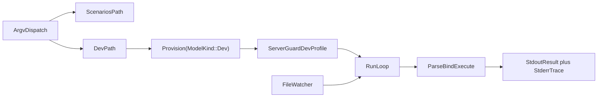

# PromptForge Dev Loop Upgrade

## Resolution 1: What is being built

`cargo run -p promptforge-core-tests` gains subcommands:

```text
cargo run -p promptforge-core-tests                        # both fixed scenarios (unchanged, Qwen3 0.6B, CPU build)
cargo run -p promptforge-core-tests -- scenarios           # same, explicit
cargo run -p promptforge-core-tests -- dev prompt.md "in"  # run one prompt with real inference
cargo run -p promptforge-core-tests -- dev prompt.md "in" --watch
```

Dev mode provisions a pinned Qwen3.5 9B GGUF (Apache 2.0, 262K native context, native reasoning and tool calling, ~5.7 GB download once), starts a GPU-enabled `llama-server` under the existing process guard, then runs parse, bind, and execute exactly like the CLI. Verbose `(execution, section, detail)` observer records and Lua `log()` checkpoints stream to stderr; the final result prints to stdout. `--watch` keeps the server warm and reruns on every save. The fixed scenarios keep the small model and remain byte-for-byte deterministic.



## Resolution 2: Components in dependency order

1. **Server profiles.** `server_args` hardcodes scenario flags; dev needs different context, generation limit, reasoning, KV cache, and GPU flags. Everything downstream launches through this seam.
2. **Artifact provisioning.** `provision()` hardcodes one model and CPU-only server archives. Dev needs its own model pin and GPU-enabled server assets without downloading unused artifacts.
3. **Dev runner.** Parse, bind, execute one prompt file against the guarded server with a live tool registry and a verbose observer.
4. **Argv dispatch and watch.** Subcommand routing in `main.rs`, then the warm-server rerun loop.
5. **Real-model verification and docs.** Cold and cache-only runs of both paths, provenance, README/STATUS/design updates.

## Resolution 3: Settled behavior

### Server profiles ([server.rs](C:/Users/Vinnie/src/cursor/promptforge/crates/promptforge-core-tests/src/server.rs))

- Add a `ServerProfile` threaded through `ServerGuard::start` and `server_args` (the `start_with` test seam at lines 143-205 already exists).
- The scenario profile reproduces today's exact flags; the existing `invocation_pins_deterministic_jinja_settings` test keeps pinning it.
- Dev profile: `--ctx-size` from `--context` (default 131072), `--n-predict` from `--max-tokens` (default 8192, reasoning chains are long), `--flash-attn on`, `--cache-type-k q8_0 --cache-type-v q8_0`, `-ngl 99`, `--jinja`, `--reasoning-format auto` with thinking enabled (a `--no-think` flag switches to the non-thinking preset), model-card sampling (`--temp 1.0 --top-p 0.95 --top-k 20 --presence-penalty 1.5`), `--parallel 1`.
- The 9B is a hybrid model with only 8 of 32 full-attention layers, so 128K context KV fits comfortably beside ~5.7 GB weights in 16 GB VRAM.

### Artifacts ([artifacts.rs](C:/Users/Vinnie/src/cursor/promptforge/crates/promptforge-core-tests/src/artifacts.rs))

- Parameterize provisioning: `provision(ModelKind::Scenario | ModelKind::Dev)`. `Provisioner::provision_file` is already asset-generic; only the selected `FileAsset` and server asset table change. One call never downloads the other mode's artifacts.
- Dev model pin (verified via the Hugging Face LFS metadata):
  - `unsloth/Qwen3.5-9B-GGUF`, file `Qwen3.5-9B-Q4_K_M.gguf`, 5,680,522,464 bytes, SHA-256 `03b74727a860a56338e042c4420bb3f04b2fec5734175f4cb9fa853daf52b7e8`.
  - Fallback if it misbehaves: `bartowski/Qwen_Qwen3.5-9B-GGUF` Q4_K_M, SHA-256 `d784ce9eda1a5a7b51e8f705a9e6310844bf4f173654d115823c775fdea56d43`.
- Dev server assets stay on release `b10082` (its February qwen3.5 hybrid support is confirmed in that build) but use GPU-enabled archives: Vulkan for Windows x64, Ubuntu x64, and Ubuntu arm64; the existing macOS tars are already Metal-enabled and are reused; Windows arm64 falls back to the existing CPU archive. Digests are read from the GitHub release API and committed, same as the current six entries. GPU installs get a distinct platform key (for example `windows-x86_64-vulkan`) so CPU and GPU installs coexist in `.model-cache/llama.cpp/`.
- All existing download, lock, confinement, extraction, and repair machinery is reused unchanged; offline tests extend the existing fake-HTTP harness to cover `ModelKind` selection.

### Dev runner (new `src/dev.rs`)

- Mirrors the CLI pipeline ([promptforge-cli/src/main.rs](C:/Users/Vinnie/src/cursor/promptforge/crates/promptforge-cli/src/main.rs) lines 49-117): read file, require `promptforge_version`, `Prompt::parse`, build live registry, `ToolPicker::build`, `bind_prompt`, `execute::run` - but with `client: Some(GatewayClient::new(base_url, api_key, model_alias))` pointed at the guarded server, exactly as `scenarios.rs` does. No `promptforge-gateway`.
- Registry: port the CLI's `available_tools` construction (add `promptforge-webfetch` workspace dep to this crate). `web_fetch` is always live; `web_search` joins only when `PROMPTFORGE_TOKEN`/`PROMPTFORGE_BASE_URL` name a gateway, otherwise a prompt needing search fails loudly as `Absent` at bind.
- Execution ID `dev-{nonce:016x}` per run. Verbose observer prints every `(execution, section, detail)` record - including `Lua: ...` log checkpoints - to stderr; stdout carries only the final result string. Errors print with the server's bounded diagnostics.

### Dispatch and watch ([main.rs](C:/Users/Vinnie/src/cursor/promptforge/crates/promptforge-core-tests/src/main.rs))

- Hand-rolled `std::env::args` dispatch matching workspace convention (no clap; none exists in the workspace). Empty args or `scenarios` runs today's suite unchanged; `dev <file> [input] [--watch] [--context N] [--max-tokens N] [--no-think]` runs the dev path. Unknown args fail with usage text.
- The existing Ctrl-C `tokio::select!` wrapper in `main` is preserved and wraps both paths.
- `--watch` uses the workspace `notify = "8"` dependency (already used by the MCP server) with a thin debounced watcher on the single prompt file - not the MCP `Watcher` type. The server and provisioned artifacts stay warm; each save re-reads, re-parses, re-binds, and re-executes. A failed parse prints the error and keeps watching.

## Resolution 4: Testable commit steps

Each step carries its code, its regression tests, and its documentation, is committed, fresh-context reviewed via scratch `vibe-review.md`, fixed, and amended before the next step, per the established workflow. Do not stop to ask between steps.

1. **Introduce server profiles**
   - `ServerProfile` through `start`/`start_with`/`server_args`; scenario profile identical to today; dev profile as specified.
   - Tests: scenario args byte-identical (existing test retained), dev args exact including GPU/KV/reasoning flags, context and max-tokens plumbing, `--no-think` variant.
   - Complete when scenarios still pass offline arg pinning and no caller change exists yet.
2. **Parameterize artifact provisioning**
   - `ModelKind`, dev model pin, GPU server asset entries with committed URL and SHA-256 values, distinct install platform keys.
   - Tests: extend the fake-HTTP harness for `ModelKind` selection, single-mode download isolation, GPU-key install coexistence; digest constants match the release API values recorded in the crate README.
   - Complete when offline tests cover both kinds and no real host is contacted by `cargo test`.
3. **Add the dev runner module**
   - `src/dev.rs`: registry port, verbose observer, single-shot parse-bind-execute against a `ServerGuard`, `dev-` execution IDs, stderr/stdout separation, bounded diagnostics on failure. Add `promptforge-webfetch` dependency.
   - Tests: observer formatting, registry composition with and without gateway env, argument validation, non-promptforge file refusal - all offline.
   - Complete when the module compiles and its offline tests pass without being reachable from `main`.
4. **Wire subcommands and watch mode**
   - Argv dispatch in `main.rs`, usage text, `--watch` via `notify` with debounce, warm-server rerun loop, parse-failure resilience, Ctrl-C teardown across both modes.
   - Tests: dispatch table, flag parsing, debounce/rerun trigger logic with a fake event source - offline.
   - Complete when `scenarios` remains default and byte-compatible and `dev --watch` logic is covered offline.
5. **Real-model verification and documentation closure**
   - Run `cargo run -p promptforge-core-tests` (cache-only scenarios) and `cargo run -p promptforge-core-tests -- dev <fixture> "input"` twice: first run downloads the ~5.7 GB model plus the GPU server archive, second run must be cache-only. Verify a tool-calling prompt end to end and clean teardown.
   - Docs: crate README (commands, flags, both model provenances, GPU archive provenance), root [README.md](C:/Users/Vinnie/src/cursor/promptforge/README.md), [STATUS.md](C:/Users/Vinnie/src/cursor/promptforge/STATUS.md), and the real-model item in [design-core.md](C:/Users/Vinnie/src/cursor/promptforge/crates/promptforge-core/design-core.md); `design-core-orig.md` stays byte-identical.
   - Complete when both commands succeed, the second dev run reports only cache hits, and the full offline verification suite is green.

## Verification for every commit

- Targeted tests, then `cargo fmt --all --check`, `cargo clippy --all-targets --all-features -- -D warnings`, `cargo test --locked --workspace --all-features`, `cargo test --doc`, `RUSTDOCFLAGS="-D warnings" cargo doc --no-deps --all-features`.
- Ordinary `cargo test` stays fully offline; real downloads and inference happen only in step 5's explicit commands.

## Decision log and falsifiers

1. **Vulkan/Metal GPU builds for dev, CPU build kept for scenarios.** One archive per platform, vendor-neutral, no CUDA DLL companion. Falsifier: Vulkan on the user's card is unstable or materially slower than CUDA; switch the Windows x64 dev asset to the CUDA 12.4 pair.
2. **Thinking enabled by default in dev.** The user asked for reasoning quality; `--reasoning-format auto` separates reasoning from content. Falsifier: `GatewayClient` mishandles replies with reasoning content or tool calls degrade; flip the default to `--no-think` behavior.
3. **Community GGUF pin (unsloth).** No official Qwen3.5 9B GGUF exists; the pin is by exact URL and SHA-256. Falsifier: quality or tool-call defects traced to the conversion; move to the bartowski fallback pin.
4. **Hand-rolled argv, no clap.** Matches every workspace binary. Falsifier: flag surface grows past comfortable manual parsing.
5. **Watch by `notify`, per-file debounce, warm server.** Falsifier: editor save patterns (atomic rename) evade the watcher; widen to watching the parent directory for the file name.
6. **128K default context.** The model card advises at least 128K for thinking; hybrid KV makes it cheap. Falsifier: measured VRAM overflow on 16 GB; lower the default and document `--context`.

## Project-specific review

<project-review>
1. Does the commit implement only its numbered step?
2. Scenario path byte-identical: same model, same server args, same assertions?
3. Are all new artifact URLs official-or-named-community with committed SHA-256, staged and confined under `.model-cache/`?
4. Does ordinary `cargo test` remain free of downloads, external processes, network, models, and credentials?
5. Does every spawned server terminate on success, error, panic, and Ctrl-C, including in watch mode?
6. Does dev output keep the result on stdout and all trace on stderr?
7. Are alias binding failures (`Absent`) surfaced clearly when a capability lacks a live tool?
8. Is `design-core-orig.md` byte-for-byte unchanged?
9. Does every new behavior have a regression test that fails without it?
10. Do formatting, strict Clippy, workspace tests, doctests, and warning-denied docs pass?
</project-review>

## Governing guides

- [tools-public/how-to/vibe-how-to.md](C:/Users/Vinnie/src/cursor/tools-public/how-to/vibe-how-to.md) governs the loop: one testable commit per step, fresh-context review, fixes folded back by amend, reversible decisions made without asking and recorded here with falsifiers.
- [tools-public/how-to/rust-how-to.md](C:/Users/Vinnie/src/cursor/tools-public/how-to/rust-how-to.md) governs every Rust edit: its non-negotiable rules bind each commit (tests land with code, lints in manifest tables, `Result` for expected failures, documented public items, fmt and Clippy clean before commit).
- Every implementer, reviewer, and fixer subagent must read both files plus this plan before acting.

## Vibe execution protocol

1. Implement each step in a subagent given this plan path, the step number, and both guide paths above; it implements only that step with its tests and docs and runs targeted plus full verification.
2. Commit in the main context (bounded git output only).
3. Review in a fresh subagent that reads the commit diff, the `<code-review>` block in `vibe-how-to.md`, the `<project-review>` block here, and `rust-how-to.md`; it overwrites scratch `vibe-review.md` with actionable findings only.
4. Fix in another subagent reading only the step and the scratch review; re-review until the scratch file is empty; amend the unpushed commit.
5. Continue immediately to the next step without asking. Commits and amendments for these steps follow the workflow already authorized in this session.
6. After ten failed code-and-test attempts on one problem, dispatch external research before changing direction; ask only for a hard-to-reverse unresolved choice.