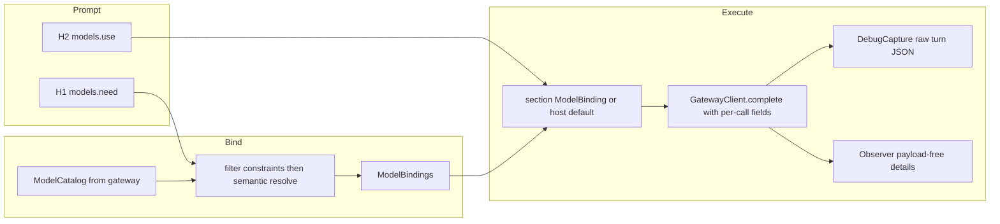

# Model bindings and debug cluster

## Governing guides

- [tools-public/rulebooks/vibe-rulebook.md](C:\Users\Vinnie\src\cursor\tools-public\rulebooks\vibe-rulebook.md) - bind for shape and discipline; execution uses the lean protocol below so the loop stays fast.
- [tools-public/rulebooks/rust-rulebook.md](C:\Users\Vinnie\src\cursor\tools-public\rulebooks\rust-rulebook.md) - tests land with code; `Result` for expected failures; fmt + clippy clean; documented public items with `# Errors`.

Scratch review file: `cabinet/_scratch/vibe-review-promptforge-models/vibe-review.md` (overwrite each cycle; empty when clean).

Do not touch `design-core-orig.md` (byte-frozen).

### Lean Vibe execution protocol

Keep the vibe loop (one testable commit per step, fresh-context review, amend until clean, never ask between steps, old bugs get their own commit). Drop only the parts that burned wall clock without catching bugs:

1. **Dispatch by reference.** Hand the implementer the plan path and the step number only. Do not paste the step body into the prompt.
2. **Targeted verify in the implementer.** Run `cargo fmt --all --check`, clippy on touched crates with `-D warnings`, and tests for the crates that step changed. Do **not** run the full workspace suite in the implementer or the reviewer.
3. **Git stays in the parent.** Stage, commit, amend only from the main context. Subagents edit, review, and fix.
4. **Parallelize the expensive gate.** After commit, start `cargo test --locked --workspace --all-features` in the background and dispatch the reviewer in the same turn. The reviewer is **diff-only**: `git show` the commit, apply `<code-review>` from the vibe rulebook and `<project-review>` below, write findings to the scratch file. No cargo in the reviewer. Cap the review: at most three actionable findings, severity-ordered; drop nits and speculative style notes.
5. **One amend round only.** Fix the scratch findings once (parent for small/local edits; one fixer subagent for larger ones), amend the unpushed commit, re-run targeted tests for the touched crates. Do **not** dispatch a second review. A second pass invents work; leftover polish rides to a later step or a rule-7 commit only if a test fails.
6. **Await the suite before declaring the step done.** If the background suite fails, fix in a vibe rule-7 commit (or amend if it is the same unpushed step commit and the failure is from that step), then continue without a fresh review. Do not start the next step until the suite for the current HEAD is green.
7. **Continue immediately** to the next step without asking.

### `<project-review>`

1. Observer stays payload-free; DebugCapture is opt-in and unused by CLI/MCP by default.
2. `design-core-orig.md` has an empty diff in the commit under review.
3. Ordinary offline tests never contact the network, launch llama-server, or require credentials.
4. Scenario suite byte contracts are unchanged unless the step explicitly changes them.
5. Dev stdout remains result-only; status, traces, and dump announcements go to stderr.
6. Gateway chat passthrough via `rest` is preserved; catalog is additive.
7. Prompts without `models.*` keep today's host-default behavior.
8. User-facing docs match the shipped grammar and gateway fields; no staging-path references in output docs.
9. Every new public item has docs including `# Errors` where fallible.
10. Tests would fail if the step's behavior were removed.

## Decision log

| Decision | Choice | Falsifier |
|---|---|---|
| Debug vs Observer | Separate `DebugCapture` on `RunOptions`; Observer stays payload-free | Any host needs payloads through Observer alone |
| H1 / H2 API | `models.need(alias, description, opts?)` and `models.use(alias)` | Authors cannot express per-section model choice |
| Constraint vs invocation | `context` and `thinking` capability filter the catalog; `temperature`, `max_tokens`, and switchable `thinking` ride per request | Backend rejects a field that was advertised as supported |
| Same weights, different params | Legal - identity is alias to binding (ModelId + invocation), not to weights | Two aliases collide incorrectly as Duplicate |
| No `models.use` | Host default client model (today's behavior) | Existing prompts break |
| Gateway role | Catalog metadata + `GET /v1/models`; request body stays passthrough via `rest` | Hosts invent model metadata out of band |
| Thinking dialect (v0) | Client emits OpenAI-shaped `chat_template_kwargs.enable_thinking` when binding requests it; backends that ignore it are catalogued `thinking = "never"` or `"always"` so bind filters them | A hybrid model cannot turn thinking off |
| MCP catalog fetch | Soft-fail to empty catalog + warn at boot (offline stdio); bind surfaces `ModelAbsent` only when a prompt declares models. CLI hard-fails fetch when a token is present. Forced by MCP offline boot. | Offline MCP cannot start without a gateway |

## Architecture



---

## Step 1 - DebugCapture seam

**Goal:** hosts can opt into raw request/response capture without widening `Observer`.

In [promptforge-core](C:\Users\Vinnie\src\cursor\promptforge\crates\promptforge-core):

- Add `DebugCapture: Send + Sync` trait with a single method that receives `(execution, section, turn_index, event)` where `event` is an owned enum carrying request body and/or response body as `serde_json::Value` (and finish_reason / reasoning_content when present). `NullDebugCapture` or `Option<&dyn DebugCapture>` on `RunOptions` - prefer `Option` so production hosts pay zero.
- Extend `RunOptions` with `debug: Option<&'a dyn DebugCapture>`.
- In [client.rs](C:\Users\Vinnie\src\cursor\promptforge\crates\promptforge-core\src\client.rs) / the tool loop in [execute.rs](C:\Users\Vinnie\src\cursor\promptforge\crates\promptforge-core\src\execute.rs): after building the request body and after parsing the response, call the capture when `Some`. Parsing must surface `finish_reason` and optional `reasoning_content` alongside today's `CompletionResult` (internal fields or a richer result type) so later steps can observe them; still do not put those payloads on the Observer.
- Dev runner in [promptforge-core-tests](C:\Users\Vinnie\src\cursor\promptforge\crates\promptforge-core-tests): implement a capture that writes `turn-N-request.json` and `turn-N-response.json` under `<prompt-stem>.store/.trace/` (same dump directory as store files; announce on stderr). Wire it in `run_once` always for dev mode.

**Tests:** offline fake HTTP - capture receives request/response when set; `None` changes nothing; dump lands beside the prompt under `.trace/`.

**Docs this step:** one short paragraph in root README "The prompt dev loop" and core-tests README that `.store/.trace/` holds raw turns.

---

## Step 2 - Empty reply and finish-reason observer details

**Goal:** payload-free signals that would have named today's empty `evidence.md`.

In [observe.rs](C:\Users\Vinnie\src\cursor\promptforge\crates\promptforge-core\src\observe.rs) `detail`:

- `MODEL_REPLY_EMPTY` = `"Model reply was empty"`
- `MODEL_TURN_TRUNCATED` = `"Model turn truncated"` (when `finish_reason == "length"`)

Emit from the tool loop when binding final text: empty `content` after a successful parse fires `MODEL_REPLY_EMPTY`; `finish_reason == "length"` fires `MODEL_TURN_TRUNCATED` (may fire with or without empty content). Keep `MODEL_TURN_COMPLETED` as today.

**Tests:** fake completion with empty content and/or `finish_reason: "length"` asserts the new details appear in a recorder.

**Docs this step:** "Watching a run" in root README names the two new details.

---

## Step 3 - Gateway model catalog

**Goal:** hosts fetch authoritative model metadata instead of inventing it.

In [promptforge-gateway](C:\Users\Vinnie\src\cursor\promptforge\crates\promptforge-gateway):

- Extend `ModelConfig` in [config.rs](C:\Users\Vinnie\src\cursor\promptforge\crates\promptforge-gateway\src\config.rs):
  - `description: String` (required for catalogued models - bind needs prose)
  - `context: u32` (context window size)
  - `thinking: ThinkingMode` enum: `never` | `always` | `switchable` (default `never` for today's Anthropic entry)
- Add `GET /v1/models` (bearer-authed like chat) returning OpenAI-shaped list plus PromptForge extensions in each object: `id` (= caller `name`), `description`, `context`, `thinking`.
- Update [gateway.toml](C:\Users\Vinnie\src\cursor\promptforge\gateway.toml) with description/context/thinking for `claude-sonnet-4-6`.
- Leave chat passthrough unchanged (`rest` already carries temperature / max_tokens / chat_template_kwargs).

**Tests:** config load rejects missing description/context; `/v1/models` returns the configured entries; unknown key still fails load.

**Docs this step:** README "Gateway configuration" documents the new `[[model]]` fields and `GET /v1/models`.

---

## Step 4 - Core language: `models.need` / `models.use`

**Goal:** prompt-local model bindings mirror tools.

### Types (promptforge-core)

- `ModelId` - stable identity (`server` + `name`, or single gateway-facing name; match ToolId shape if a server namespace helps multi-gateway later - for v0 use one namespace `"gateway"` + model name).
- `ModelDescriptor` - id, description, context, thinking mode.
- `ModelCatalog` / `ModelRegistry` - complete live set for the run (host-built).
- `ModelNeedOpts` from Lua table: optional `thinking` (bool), `context` (integer min), `temperature` (number), `max_tokens` (integer).
- `ModelBinding` - alias + resolved `ModelId` + frozen invocation (`temperature`, `max_tokens`, `thinking: Option<bool>`).
- `ModelBindings` - frozen H1 declarations; parallel to `ToolBindings`.

### Lua

- H1 binding VM: `models.need(alias, description, opts?)` - resolve as below; `models.use` forbidden.
- H1 replay: exact declaration replay like tools.
- H2: `models.use(alias)` - at most once before scope close; `models.need` forbidden. Closing records `Option<ModelBinding>` for the section (None = host default).

### Resolve

1. Filter catalog by hard constraints from opts (`context >= N`; if `thinking == false` require `switchable` or `never`; if `thinking == true` require `switchable` or `always`).
2. Semantic resolve description against filtered catalog via existing `promptforge-tool-picker` (build a `Catalog` of descriptors from model descriptions - reuse picker, do not fork a second embedding stack).
3. Outcomes: Bind / Absent / Duplicate / Ambiguous - all-but-Bind fatal at `bind_prompt`, same as tools.
4. Do **not** run tool-style near-duplicate rejection across model aliases that share weights with different invocation params.

### Bind / execute

- Extend `bind_prompt` (or a sibling that hosts call once) to accept `ModelCatalog` + picker and freeze `ModelBindings` into `BoundPrompt`.
- Section execution: after H2 close, if `models.use` selected a binding, build per-call fields for every `complete` in that section; else use `RunOptions.client`'s model with no extra sampling fields (compat).
- Extend `GatewayClient::complete` to accept optional `CompletionOptions { model override, temperature, max_tokens, thinking }` merged into the JSON body (`chat_template_kwargs` when thinking is `Some`).

### Hosts

- CLI / MCP: fetch `GET /v1/models` at boot (or first bind), build catalog; fail bind with clear Absent if catalog empty and prompt declares models.
- Dev runner: advertise the pinned Qwen3.5 as one catalog entry (`context` from server profile default 131072, `thinking: switchable`, description suited to analysis); still use llama-server for chat; gateway token still gates web_search only.

**Tests:** need resolves; constraint filters; use selects per section; no use keeps default; Absent on missing token-less search remains separate; wrong-arity / undeclared use fails loudly.

**Docs this step:** `design-core.md` new item for model bindings; root README "Prompt file anatomy" and "Prompt language" show `models.need` / `models.use`; note Lua table opts (no keyword args).

---

## Step 5 - User-facing docs pass and fixture

- Root [README.md](C:\Users\Vinnie\src\cursor\promptforge\README.md): consolidate Prompt language (tools + models), Gateway `[[model]]` + `/v1/models`, Watching a run (new details), Dev loop (`.store` + `.trace`).
- [design-core.md](C:\Users\Vinnie\src\cursor\promptforge\crates\promptforge-core\design-core.md): authoritative lifecycle paragraphs for DebugCapture, model bind/execute, observer details.
- Crate READMEs for gateway and core-tests as needed.
- Update [briefer.md](C:\Users\Vinnie\src\cursor\promptforge\briefer.md) (user prompt, keep untracked via exclude if needed) or add a tracked example under `prompts/` demonstrating:

```lua
models.need("analyst", "A model suited for careful analysis", { thinking = false, temperature = 0, context = 40000 })
```

```lua
models.use("analyst")
tools.add("search", "fetch")
```

- `STATUS.md` if it still lists gaps this closes.

---

Reviewers use the `<project-review>` block under Lean Vibe execution protocol above (same checks; do not duplicate here).

## Data-flow note

Step 1 produces the capture seam execute needs. Step 2 consumes finish_reason/content emptiness from step 1's richer parse. Step 3 produces catalog JSON hosts need. Step 4 consumes catalog + picker + client options; DebugCapture already records the new per-call fields. Step 5 documents the shipped surface. No step waits on undocumented chat context.
