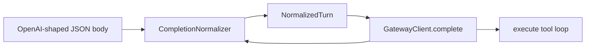

# Completion normalization layer

## Decisions (from review)

- **Trait stay.** `CompletionNormalizer` + `Arc<dyn …>` on the client is fine. If it stays single-impl forever, removing the trait is a small local edit - not a design debt to optimize for now.
- **Growth is the point.** If `normalize.rs` accretes more dialect cases and someday looks like a small genai, that means PromptForge needed a real normalizer. Keep special cases *here*, not everywhere else. Do not fear that growth; fear scattering.
- **Empty response invariant.** A normalized turn must yield either non-empty tool calls or non-empty text. Anything else is always `Error::EmptyModelReply` - including when `reasoning_content` is present. Never promote reasoning into the answer. Soft success with `Text("")` is forbidden.
- **Tool calls are not empty.** An assistant turn whose product is `tool_calls` (even with `content: ""` / null) is a valid non-empty response. The invariant is "no product," not "content string must be non-empty on every wire message."
- **This change is response-side.** See glossary below. Request-side thinking dialects stay in `CompletionOptions` for now; if they need a matching request normalizer later, it belongs in the same module family, not in execute.

**Not doing in this change:** adopting an external crate (`genai` / `rig`). In-tree seam first.

### Glossary: request vs response

| Side | What it is | Example quirk |
|---|---|---|
| **Response** (this plan) | JSON the model server sends back after a completion | Empty `content`, answer stuck in `reasoning_content`, field named `reasoning` vs `reasoning_content` |
| **Request** (not this plan) | JSON we send to ask for a completion | How to turn thinking off: `chat_template_kwargs.enable_thinking`, or `enable_thinking`, or Anthropic's thinking budget |

Today's briefer bug is 100% response-side. Request-side is how `models.use` already sets temperature/thinking on the way out.

---

## Architecture

Single new module: [`crates/promptforge-core/src/normalize.rs`](C:\Users\Vinnie\src\cursor\promptforge\crates\promptforge-core\src\normalize.rs).

| Piece | Role |
|---|---|
| `NormalizedTurn` | `outcome: CompletionResult`, `finish_reason`, `reasoning_content` (side channel only) |
| `CompletionNormalizer` | `fn normalize(&self, body: &Value) -> Result<NormalizedTurn>` |
| `OpenAiChatNormalizer` | Default impl: today's parse + synonyms + empty-text error |
| `Error::EmptyModelReply` | Distinct from `MalformedResponse`; message names empty content (and that reasoning was ignored if present, without pasting it) |

[`GatewayClient::complete`](C:\Users\Vinnie\src\cursor\promptforge\crates\promptforge-core\src\client.rs) calls the normalizer instead of private `parse_completion`. For slender drop-in without threading every host: store `Arc<dyn CompletionNormalizer>` on `GatewayClient`, defaulting to `OpenAiChatNormalizer` in `new` / `from_env`. A later host can construct with another impl; execute and RunOptions stay unchanged.

Execute tool loop: `EmptyModelReply` from `complete` fires `MODEL_TURN_FAILED` and fails the run. Remove the soft path that observes `MODEL_REPLY_EMPTY` and continues with `reply == ""` - empty text must not reach epilogs. Truncation (`finish_reason == length`) remains an observer detail only when text is non-empty; empty+length is still `EmptyModelReply`. Retire or repurpose `MODEL_REPLY_EMPTY` in docs so it is not described as a successful-run signal.

---

## Steps (lean vibe)

Governing guides: [vibe-rulebook](C:\Users\Vinnie\src\cursor\tools-public\rulebooks\vibe-rulebook.md) + [rust-rulebook](C:\Users\Vinnie\src\cursor\tools-public\rulebooks\rust-rulebook.md). Lean protocol: targeted tests in implementer; parallel full suite + diff-only review; **one amend round**; max three findings; never ask between steps. Scratch: `cabinet/_scratch/vibe-review-promptforge-normalize/vibe-review.md`.

### Step 1 - Normalize module + hard-fail empty text

- Add `normalize.rs`, export from `lib.rs`.
- Move parse logic out of `client.rs` into `OpenAiChatNormalizer::normalize`.
- Synonyms for reasoning: first non-empty among `reasoning_content`, `reasoning`, `thinking` (string fields only).
- **Invariant in the normalizer:** non-empty `tool_calls` → `ToolCalls`; else non-empty `content` → `Text`; else → `Error::EmptyModelReply` (fixed phrase if reasoning was present: "reasoning content was present but ignored", no payload).
- `GatewayClient` holds `Arc<dyn CompletionNormalizer>` defaulting to `OpenAiChatNormalizer`.
- Unit tests: answer+reasoning; tools+empty content OK; empty content+reasoning → error; `""` content no tools → error; null content no tools → error; synonym `reasoning` field.
- Update client tests to use the normalizer; update execute tests so empty-text soft success is gone (run fails with `MODEL_TURN_FAILED` / `EmptyModelReply`).

### Step 2 - Docs

- `design-core.md`: normalization seam; empty-response invariant; no reasoning-as-answer; growth of this module is expected.
- README "Watching a run": empty model product fails the run; adjust `MODEL_REPLY_EMPTY` wording if the constant is removed or demoted.
- Do not touch `design-core-orig.md`.

---

## Project-review

1. Wire quirks and the empty-response invariant live in `normalize.rs` (and its tests).
2. No path returns `Ok(Text(""))`.
3. Reasoning never becomes answer text.
4. Tool-call turns with empty `content` still succeed.
5. Default normalizer is what every current host gets.
6. `design-core-orig.md` untouched.
7. A test fails if empty+reasoning is accepted as success.
