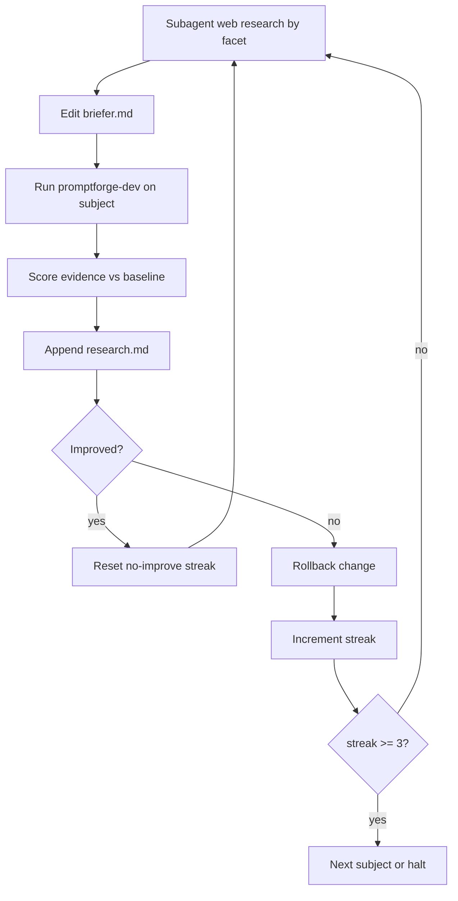

# Briefer evidence thickening

## Understanding (locked)

- Deliverable is thick, clean `evidence.md` from [`promptforge/briefer.md`](promptforge/briefer.md) on **local Qwen**.
- Gold shape / density reference: Opus packet [`cabinet/_scratch/2026-08-08-briefer-cpp-alliance/2026-08-08-briefer-cpp-alliance-evidence.md`](cabinet/_scratch/2026-08-08-briefer-cpp-alliance/2026-08-08-briefer-cpp-alliance-evidence.md) (Subject Profile fields, Domain Primer, Domain Landscape, Public Record, Vulnerabilities, Source Log).
- Staged beauty: (1) match best current local-Qwen evidence quality (clean, structured, no fence garbage / wrong-entity disasters); (2) surpass that baseline with more detail via prompt + context engineering informed by my own deeper web research.
- **Minimize turns per Web Search arm.** Target path: 1 search → 1-2 fetch rounds (batch URLs) → 1 final write. Prefer sharper queries and URL hints over extra model round-trips. A thicker packet that costs many more turns is a regression unless the score gain is large; log median/max tool turns per arm each round.
- Cut **Report** (and Epilog model turn if it still burns latency) until evidence is thick; restore Report only after Stage 2 is sticky on C++ Alliance.
- Log every change and verdict in gitignored [`cabinet/_research/2026-08-08-briefer-evidence-tuning.md`](cabinet/_research/2026-08-08-briefer-evidence-tuning.md) (user-facing name: research notes; not committed).
- Subjects in order: **C++ Alliance** → **Boost C++ Library Collection** → **Bloomberg**. Per subject: iterate facets + whole until **3 consecutive rounds with no meaningful improvement**, then advance. Global stop when all three subjects are exhausted under that rule.
- **Source Log deferred.** Do not require a consolidated Source Log in `evidence.md` during the main loop (fanout arms cannot safely merge one log without store append races). After evidence quality plateaus, try a late experiment: arms `store.append` to a separate `log.md` (or equivalent), then optionally fold into the packet. Until then, inline URL citations in body text are enough.
- **Git:** On every kept quality step-up (meaningful score gain on `briefer.md`), commit in `promptforge` with a short why-focused message. Do not commit research.md, stores, or scratch rounds. Squash/fold those commits later when you ask.

## Baseline and scoring

Capture once before edits (or use latest [`promptforge/briefer.store/evidence.md`](promptforge/briefer.store/evidence.md) if fresh):

Score each run 0-2 per facet against Opus shape (Alliance) or against subagent-sourced truth packs (Boost/Bloomberg):

- Structure (section headers, no nested fences, concatenable arms)
- Profile density (legal name, status, people, dates)
- Primer / landscape (peers, market structure, deps)
- Public record (filings, press, controversy)
- Vulnerabilities (sourced, on-entity)
- Source hygiene (fetch-backed quotes/URLs inline; UNKNOWN when thin). Source Log section not scored until the late experiment.
- Wrong-entity / hallucination rate (hard fail if present)

**Meaningful improvement** = higher total score, or same score with clearly thicker on-entity facts and no new hard fails, **without** a large turn-count regression. Cosmetic-only diffs do not count. Rollback any change that lowers score, adds hard fails, or balloons arm turns without score gain.

Also record per round: median and max model turns per arm (from traces / `tools.calls`).

## Prompt engineering direction (concrete)

Edit only [`promptforge/briefer.md`](promptforge/briefer.md) unless a tiny harness bug blocks iteration.

1. **Speed cut:** Comment out or stub `## Report` (and keep Epilog as pure ` ```lua ` return). Main ends after `store.write("evidence.md", ...)`.
2. **Output contract:** Force each arm to emit a fixed heading matching Opus sections (or a mapped topic→section table). Ban wrapping the whole reply in markdown fences. Ban process commentary.
3. **Topic list:** Retarget Topics to Opus facets (profile, founder/personnel, mission, structure/scale, domain primer, sector/peers, public record/finance, disaster exposure, vulnerabilities) so concat yields one coherent packet, not ten marketing blurbs.
4. **Search/fetch depth (few turns):** Seed query patterns and likely URL families in the arm prompt (org about page, ProPublica nonprofit explorer, bylaws/PDF, transparency posts) so the model does not need exploratory turns. Protocol: first turn = one focused `search`; second turn = `fetch` 2-4 best hits in one batch when the dialect allows, else two fetch turns max; third turn = evidence only. Cap effective tool loops in the arm instructions (stop searching after one query unless results are empty). Raise `max_tool_iterations` only as a safety ceiling, not as an invitation to wander.
5. **Anti-hallucination:** Keep fetch-only claims; require entity-name check before disaster/vulnerability claims; UNKNOWN over invention.
6. **Fanout width vs turn depth:** Prefer more parallel topic arms with shallow turn budgets over fewer arms that thrash tools. Widen fanout only when a facet is missing entirely; if a change adds turns without score gain, roll back.

## Experiment loop (per subject)



- **Subagents:** For each facet, search/fetch what is publicly knowable; write findings into the research log and into prompt query/URL hints (not into fabricated evidence).
- **Runs:** Gateway on `qwen.toml`; `cargo run -p promptforge-dev -- briefer.md "<subject>"`. Archive each round's evidence under `cabinet/_scratch/briefer-evidence-rounds/` (gitignored via cabinet).
- **C++ Alliance Stage 1:** Fix fences, wrong-entity disasters, thin profile until score ≥ current Qwen best and structure matches Opus outline.
- **C++ Alliance Stage 2:** Thicken using Opus source log as a treasure map (ProPublica EIN 82-2439331, bylaws PDF, transparency reports, fiscal sponsor vote). Stop after 3 no-improve rounds.
- **Restore Report** once Alliance evidence is thick; one smoke run that report does not invent beyond packet.
- **Boost, then Bloomberg:** Same loop; build truth packs via subagents first (no Opus gold file).
- **Late Source Log try** (after subjects plateau or on explicit pass): add `store.append("log.md", ...)` from arms; judge whether the merged log is usable without races; keep or roll back; commit only if it is a clear step up.

## Git discipline

- Commit `briefer.md` (and only related promptforge prompt files if needed) after each **kept** improvement.
- Skip commits for rollbacks and no-op experiments (still log them in research.md).
- Leave history granular; folding/squash is a later user-directed step.

## research.md format (append-only)

For each round:

- subject, round id, timestamp, model
- prompt/context diff summary (what changed)
- score table + hard fails
- turn budget: median/max model turns per arm; note if over the 1-search / ≤2-fetch / 1-write target
- keep / rollback decision and why
- facet notes (what web research found that the run missed)

## Stop conditions

- Per subject: 3 consecutive no-improve rounds → next subject.
- Global: after Bloomberg's streak completes with no further meaningful gains available under the same rule → stop and review research.md with you.
