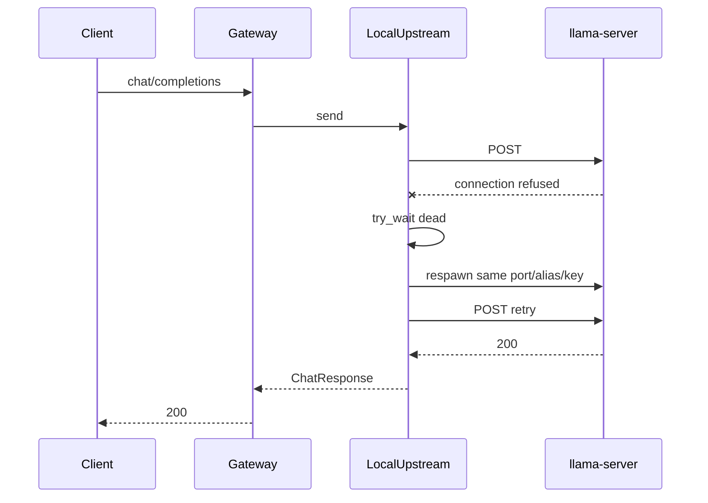

# Supervise local llama-server after death

## Problem

[`LocalRuntime::start`](promptforge/crates/promptforge-gateway/src/local/mod.rs) spawns `llama-server`, waits for readiness, then never watches the child. After exit, gateway `/health` and `/v1/models` still look fine; chat fails with `502 upstream_transport`. Design note that "endpoint health" is unbuilt means multi-endpoint failover, not "ignore a dead local child forever."

## Approach (locked)

**Lazy ensure-alive on send**, not a background watchdog.

- Introduce a local-only upstream that owns the child lifecycle.
- On each `send`, if the child is dead (or the first POST gets a connect failure and `try_wait` shows exit), respawn **once** with the **same port, `--alias`, and `--api-key`**, then retry the request once.
- Keep catalog `Model.upstream_name` and `OpenAiUpstream`-shaped URLs stable so routing/`Arc<Model>` need not be rewritten mid-flight.
- Cap respawn storms: if respawn readiness fails, return `UpstreamTransport` (same as today). Optional short cooldown (e.g. do not respawn more than once per few seconds) to avoid spin on hard GPU faults.

## Code changes

1. **[`server.rs`](promptforge/crates/promptforge-gateway/src/local/server.rs)**  
   - Factor a respawn entry that reuses a fixed `(port, alias, api_key)` instead of always calling `random_identity` + `free_port` (keep random free-port path for first start).  
   - Expose `try_wait` / `is_alive` on the guard (or split "recipe" from "running child" so Drop still kills the current child).

2. **New `LocalUpstream` in [`local/`](promptforge/crates/promptforge-gateway/src/local/)** (or `upstream.rs` if cleaner)  
   - Holds: executable path, model path, `LaunchOptions`, fixed identity + port, `Mutex` around the live `Child`/guard guts, shared `reqwest::Client`.  
   - Implements `Upstream::send`: ensure child alive → POST like [`OpenAiUpstream`](promptforge/crates/promptforge-gateway/src/upstream.rs) using live `base_url` + key → on transport error, if dead, respawn once and retry once.

3. **[`LocalRuntime::start`](promptforge/crates/promptforge-gateway/src/local/mod.rs)**  
   - Wire `endpoint.upstream = Arc::new(LocalUpstream::...)` instead of bare `OpenAiUpstream`.  
   - Runtime still owns whatever is needed so Drop tears down children (either keep guards, or move ownership fully into `LocalUpstream` and drop empty `guards` / replace with `Vec<Arc<LocalUpstream>>`).

4. **Docs**  
   - Update [`design-gateway.md`](promptforge/crates/promptforge-gateway/design-gateway.md): local child supervision on send is in scope; multi-endpoint health selection remains unbuilt.  
   - Log `tracing::warn!` on detected death + successful/failed respawn.

5. **Tests**  
   - Unit test with the existing spawn test seam: child exits after ready → next `send` path calls spawn again with same port/alias (assert spawn count / args).  
   - Keep existing Drop-kills-child test green.

## Out of scope

- Preventing Vulkan/OOM crashes (operator: lower `--parallel`, try `flash_attention = false`).  
- Background watchdog threads.  
- Changing public `/health` semantics (still process liveness); optional later: `admin/status` child-alive flag.  
- Gemma/Qwen profile retunes.
