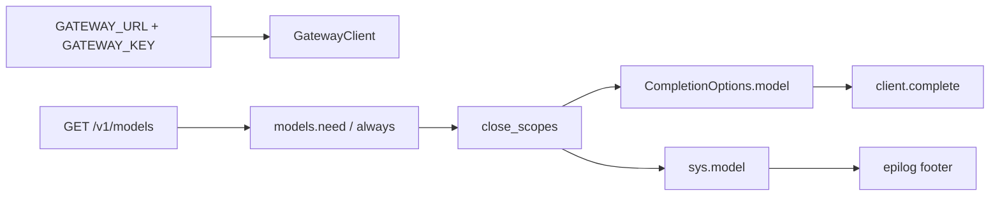

# Explicit models, gateway env rename, and `sys.model`

## What we are building

PromptForge stops inventing a model or gateway endpoint. Prompts bind models. Hosts supply `PROMPTFORGE_GATEWAY_URL` and `PROMPTFORGE_GATEWAY_KEY` only. After a section closes its model scope, `sys.model` names the bound catalog id for footers.

## Principle (design doc)

In [design-core.md](c:\Users\Vinnie\src\cursor\promptforge\crates\promptforge-core\design-core.md), near the top:

**No defaults. Everything explicit. Implicit is the enemy of precision.**

A prompt declares tools, models, context, thinking, and temperature. The host supplies credentials and the gateway URL, not silent capability choices. Accepting any model is still an explicit `models.need` / `models.always` with a capability sentence and constraints.

One-sentence pointer from README env / models sections.

Do not rewrite historical files under `research/` - leave them as archaeology.

## Definitions

**Model-facing section:** after preamble, substituted prose `trim()` is non-empty, so execution would call the model (`run_tool_loop`). Empty-prose sections need no binding.

**Bound model name:** `ModelBinding::id().name()` - the gateway catalog / caller-facing id (not the alias `writer`).

## Steps (dependency order - one commit each)

### Commit 1 - Principle

- Edit design-core.md + README pointer only
- No code behavior change
- Verify: docs build / read as intended (no test required beyond existing suite green)

### Commit 2 - Client and gateway vocabulary

**API (breaking, workspace `publish = false`):**

- `GatewayClient::new(gateway_url, key)` - drop model argument
- Remove `GatewayClient::model()`, `DEFAULT_MODEL`, `DEFAULT_BASE_URL`
- `from_env` reads only `PROMPTFORGE_GATEWAY_URL` and `PROMPTFORGE_GATEWAY_KEY`; either missing → `Error::MissingEnv` with that name
- `complete`: model comes from `CompletionOptions`; change `CompletionOptions.model` from `Option<String>` to `String` so the wire path cannot omit it (rust-rulebook: make illegal states unrepresentable). `ModelBinding::completion_options` always fills it.

**Config / env rename:**

| Old | New |
|-----|-----|
| `PROMPTFORGE_BASE_URL` | `PROMPTFORGE_GATEWAY_URL` |
| `PROMPTFORGE_TOKEN` | `PROMPTFORGE_GATEWAY_KEY` |
| MCP `gateway.token` | `gateway.key` |
| Gateway `[server] token` | `[server] key` |
| `${PROMPTFORGE_TOKEN}` in profiles / examples | `${PROMPTFORGE_GATEWAY_KEY}` |

Local llama-server child `--api-key` stays (upstream flag name).

**Touch:** `client.rs`, CLI, MCP bind + prompts schema, gateway `config.rs` / `lib.rs` auth / profiles `base.toml` / `analytical.toml` / `gateway.toml` / `gateway.local.example.toml`, core-tests `dev.rs`, all `GatewayClient::new(..., model)` call sites.

**Tests in same commit:** `from_env` missing URL or key; client constructs without model; `complete` sends `CompletionOptions.model`.

### Commit 3 - Require prompt binding

- In `execute.rs` / `fanout.rs`: before a model turn, if `scopes.model` is `None` → `Error::ModelRequired { section: String }` (or equivalent). Display: lowercase noun phrase, e.g. `model binding required for section {section}` (rust-rulebook error style).
- Remove README contract that omitting `models.use`/`always` keeps the host default.
- Fix tests/prompts that relied on fallthrough by adding `models.always` / `need` + catalog fixtures.

**Falsifier for the definition of model-facing:** a section with whitespace-only prose should not require a binding (same as today's empty skip).

### Commit 4 - `sys.model`

After `close_scopes`, for model-facing sections (binding now guaranteed):

1. `enrich_sys_model(&sys, binding) -> Value` inserts `"model": binding.id().name()`
2. Pass enriched sys to `subst::substitute`
3. Re-seal Lua `sys` so epilog sees it (`SectionVm` helper reusing `seal_sys`)

Mirror in fanout arms.

**Unavailable** in prologue (H1) and section preamble (H2 before close): no `model` key → unknown sys field.

**Tests:**

- H1 prologue reads `sys.model` → unknown field
- Epilog / `{{ sys.model }}` equals bound catalog name
- Fanout arm epilog sees `sys.model`

### Commit 5 - briefer + docs sweep

[briefer.md](c:\Users\Vinnie\src\cursor\promptforge\briefer.md) Report epilog:

```lua
store.write("report.md", reply .. "\n\n*" .. sys.when .. " - " .. sys.model .. "*")
```

Sweep STATUS.md, README env examples, design-gateway / design-core env names. No `PROMPTFORGE_MODEL`, `PROMPTFORGE_BASE_URL`, or `PROMPTFORGE_TOKEN` left in active code or operator docs.

## Data flow



Commit 2 feeds Commit 3 (options always carry model string). Commit 3 feeds Commit 4 (binding always present when enriching). Commit 5 consumes Commit 4.

## Execution method (light vibe + rust)

- Work in subagents; **one review pass** per commit then amend; no review loops
- Pass findings via `vibe-review.md`
- Rust: concrete `thiserror` variants; no `unwrap` in library paths; document new public items; test in the same commit as the behavior; `cargo fmt` + `clippy -D warnings` + `cargo test` for touched crates before each commit
- Do not invent packages; follow existing `Error::MissingEnv` and sealed-`sys` patterns

## Out of scope

- Exposing alias `writer` as `sys.model`
- Renaming MCP `gateway.url` (stays `url`; pairs with `key`)
- Historical `research/` rewrites
- Candle GPU / in-process llama FFI
