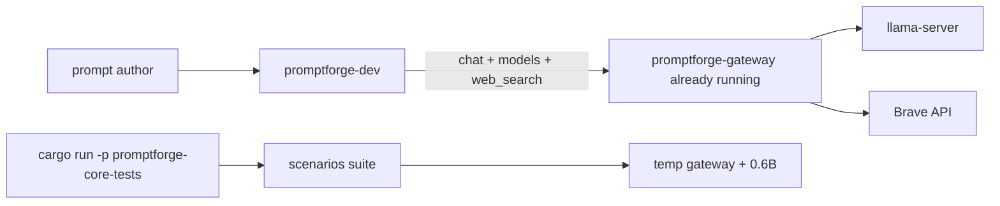

# Extract `promptforge-dev` and simplify core-tests

Governing rulebooks (load before coding or reviewing):

- [`tools-public/rulebooks/vibe-rulebook.md`](c:\Users\Vinnie\src\cursor\tools-public\rulebooks\vibe-rulebook.md)
- [`tools-public/rulebooks/rust-rulebook.md`](c:\Users\Vinnie\src\cursor\tools-public\rulebooks\rust-rulebook.md)

House conventions come from existing leaf bins ([`promptforge-cli`](promptforge/crates/promptforge-cli/), [`promptforge-core-tests`](promptforge/crates/promptforge-core-tests/)): hand-rolled args (no clap), `anyhow` in binaries, workspace-inherited package fields and `[lints] workspace = true`, unit tests in the same file as the code.

Scratch for review findings: `cabinet/_scratch/vibe-review-promptforge-dev/vibe-review.md` (overwrite each review cycle). Main context never reads the body.

## 1. What you are building

A small author-facing binary that runs one PromptForge prompt against an already-running gateway, plus a slimmer scenario harness that still self-hosts a temporary 0.6B gateway for CI. Prompt authors declare context / thinking / max_tokens on the prompt; the CLI does not.

## 2. High-level components (dependency order)

1. **`promptforge-dev`** (new leaf binary) - depends on `promptforge-core`, `promptforge-tool-picker`, `promptforge-webfetch`. Owns interactive run / watch / dump. Never depends on gateway spawn code.
2. **`promptforge-core-tests`** (existing, slimmed) - depends on core + picker + webfetch + its own `gateway` spawn for Scenario only. Loses the `dev` path and Dev profile.
3. **Author docs** - crate README/design for the new tool; root and core-tests README stop advertising `core-tests -- dev`.
4. **`briefer.md`** - example prompt that follows the prompt-owned-knobs rule and stamps the report footer.

## 3. Pieces inside each component

### `promptforge-dev`

| Path | Role |
|---|---|
| [`Cargo.toml`](promptforge/crates/promptforge-dev/Cargo.toml) | `publish = false`, bin `promptforge-dev`, deps via `*.workspace = true`, `[lints] workspace = true` |
| `README.md` | Author-facing how-to |
| `design.md` | What this crate owns and refuses to own |
| `src/main.rs` | Thin args + exit-code mapping (`anyhow`, `ExitCode`) |
| `src/run.rs` | One-shot parse / bind / execute (from [`dev.rs`](promptforge/crates/promptforge-core-tests/src/dev.rs)) |
| `src/watch.rs` | Debounced rerun (from [`watch.rs`](promptforge/crates/promptforge-core-tests/src/watch.rs)) |
| `src/dump.rs` | Store dump + `.trace/` (from [`dump.rs`](promptforge/crates/promptforge-core-tests/src/dump.rs)) |
| `src/tools.rs` | `WebFetch` always; `WebSearch` when env credentials present (mirror [`promptforge-cli/src/tools.rs`](promptforge/crates/promptforge-cli/src/tools.rs)) |

Behavior:

1. Args: `<prompt> [input] [--watch]` only. No `--context` / `--max-tokens` / `--no-think`.
2. Require `PROMPTFORGE_GATEWAY_URL` and `PROMPTFORGE_GATEWAY_KEY` before parse; friendly hard-fail if missing.
3. Clear `<prompt-stem>.store/` before each run; dump store and flush `.trace/` after success or failure.
4. Catalog: `fetch_model_catalog` (replace `pinned_qwen_dev_catalog`). Tools: live registry + picker like the CLI.
5. Client: `GatewayClient::new(url, key)`. Verbose observer on stderr; result on stdout. No gateway / llama spawn anywhere in this crate.

Rust constraints for this crate (from rust-rulebook + house):

- Leaf binary under `crates/promptforge-dev/`; add to root [`Cargo.toml`](promptforge/Cargo.toml) `members` list (workspace is an explicit list, not `crates/*`).
- No `workspace.dependencies` entry unless another member depends on it (none will).
- `main` stays thin; logic in modules named by domain (`run`, `watch`, `dump`, `tools`).
- Expected failures return `Result` / map to `ExitCode`; panic only on bugs.
- Unit tests in `#[cfg(test)] mod tests` in the same file; port offline tests (arg parse, dump, watch debounce, tool registry construction, missing-env fail). Do not run live-gateway tests in this crate.
- Before each commit: `cargo fmt --all --check` and `cargo clippy -p promptforge-dev --all-targets --all-features -- -D warnings` (Verify owns the full suite when scheduled).

### `promptforge-core-tests` (slim)

Keep: `scenarios.rs`, Scenario-only `gateway.rs`, offline `suite.rs`, fixtures under `prompts/valid|invalid|execution/`.

Remove: `dev` subcommand and types in `main.rs`, `dev.rs`, `watch.rs`, `dump.rs`, `DevServerOptions`, `GatewayProfile::Dev`, `ModelKind::Dev`, `prompts/dev/`, and all `--context` / `--max-tokens` / `--no-think` parsing and gateway tests that assert Dev profile flags.

Binary usage: `promptforge-core-tests` or `promptforge-core-tests scenarios` only.

### Docs + `briefer.md`

See steps 3 and 4.

## 4. Decisions (locked) with falsifiers

| Decision | Falsifier |
|---|---|
| Crate / binary name is `promptforge-dev` | Binary or package name differs |
| Dev never starts gateway or llama | This crate contains spawn / `GatewayGuard` / `GatewayProfile` / process launch of those bins |
| Scenario suite keeps temporary 0.6B sidecar | Scenarios require a hand-started gateway |
| Prompt owns `context` / `thinking` / `max_tokens`; CLI does not | New CLI accepts `--context`, `--max-tokens`, or `--no-think` |
| Catalog from live gateway | Dev path still calls `pinned_qwen_dev_catalog` |
| Briefer declares `context = 65536` on `models.always` and stamps italic footer in Report epilog | Missing opts or footer not blank-line-separated italics |

## 5. Pre-execution data-flow check

| Step | Needs from prior | Produces for later | Ambiguity? |
|---|---|---|---|
| 1 Create `promptforge-dev` | Existing `dev`/`watch`/`dump` sources; CLI `tools` + `fetch_model_catalog` pattern | Working binary + offline tests + crate docs; old modules still in core-tests until step 2 | None - copy then adapt, do not delete sources until step 2 |
| 2 Slim core-tests | Step 1 complete so authors have a home for the runner | Scenario-only binary; no Dev profile | None - delete only after step 1 lands |
| 3 Root / STATUS docs | Steps 1-2 names and usage strings | Repo entry points point at `promptforge-dev` | None |
| 4 `briefer.md` | Prompt-owned-knobs rule (decision) | Author example matches the rule | `context = 65536` locked; change only if user revises |

Parallelism: none across steps (2 deletes what 1 copies). Inside step 1, module ports can be written in one coder pass.

Efficiency: crate docs ship with step 1 (vibe: each commit carries its documentation). Root README is a separate step so step 1 stays reviewable. Steps cannot merge further without mixing two crates' review surfaces.

## 6. Steps (one commit each)

Per vibe loop, for every step:

1. Coder subagent implements only that step (code + tests + docs named by the step). Prompt by reference: plan path + step number. Return under 500 tokens.
2. Main: stage + commit.
3. Review-and-fix subagent: apply `<code-review>` from vibe-rulebook plus the project-review checks below that the step touches; overwrite scratch `vibe-review.md`; exactly one fix round; stop. Return under 1,000 tokens.
4. Main: amend if dirty (same commit only).
5. Verify when scheduled: after review dirties the tree; on every 3rd step; at end of a high-level component; on the final step. Verify returns one line (pass, or fail + log path). Main never reads the log.

Never stop for ordinary confirmation. Leftover review findings and a red Verify are not stop conditions; fix forward. Hard-to-reverse choices use rule 2 (already locked above).

### Step 1 - Create `promptforge-dev` and move the runner

Intent: authors can `cargo run -p promptforge-dev -- <prompt.md> [input] [--watch]` against an already-running gateway.

- Add crate + workspace `members` entry.
- Port `dev` / `watch` / `dump` logic; strip every gateway-spawn / `DevServerOptions` / pinned-catalog path.
- Wire required env + `fetch_model_catalog` + CLI-shaped tool registry.
- Port offline unit tests that do not need a live gateway.
- Write crate `README.md` and `design.md` (author knobs = `models.need` / `models.always`; CLI = path + input + watch only).

Verify: scheduled (first component complete).

### Step 2 - Slim `promptforge-core-tests` to scenarios + fixtures

Intent: this crate is only the offline fixture suite + explicit 0.6B scenario harness.

- Delete `dev` command path and unused modules / flags / `prompts/dev/` / Dev profile variants and their tests.
- Keep Scenario gateway spawn for 0.6B only.
- Rewrite crate README around offline fixtures + `scenarios`.

Verify: scheduled (second component complete). Offline `cargo test -p promptforge-core-tests` must pass; do not require a live scenario run in Verify unless the environment already has model cache (coder must not break Scenario compile path).

### Step 3 - Root docs pass

Intent: repo entry points no longer advertise `core-tests -- dev`.

- Update root [`README.md`](promptforge/README.md) and any STATUS mentions to point at `promptforge-dev`.

Verify: skip unless review dirties (docs-only; final Verify still covers workspace).

### Step 4 - Update [`briefer.md`](promptforge/briefer.md)

Intent: the flagship prompt demonstrates prompt-owned knobs and cabinet-style report metadata.

1. On `models.always` opts: keep `thinking = false`, `temperature = 0`; add `context = 65536`.
2. Report epilog owns the stamp: trim trailing whitespace from `reply`, append `\n\n*` .. `sys.when` .. ` - ` .. `sys.model` .. `*` so date and model are their own italic paragraph. Do not ask the model to write it.
3. Fix typo `analyist` -> `analyst`.

Verify: scheduled (final step). Prefer `cargo fmt` / `clippy` / offline tests for the workspace members touched by steps 1-2; briefer is markdown-only.

## 7. Project-review (plan-local, in addition to vibe `<code-review>`)

1. `promptforge-dev` never launches `promptforge-gateway` or `llama-server`.
2. Missing gateway env fails before any prompt parse with a clear message.
3. Scenario suite still compiles and retains temporary 0.6B gateway spawn.
4. Store dump still clears before each run and writes `.trace/` after.
5. Root and core-tests docs no longer tell authors to use `core-tests -- dev`.
6. No `--context` / `--max-tokens` / `--no-think` on the new CLI; docs point authors at `models.need` / `models.always`.
7. `briefer.md` declares `context` on `models.always`, and `report.md` ends with a blank-line-separated italic `*when - model*` paragraph written by the Report epilog.
8. `design-core-orig.md` untouched.
9. New Rust matches house leaf-bin layout: workspace lints, no crate-root `deny`, tests beside code, `fmt` + `clippy -D warnings` clean for touched packages.
