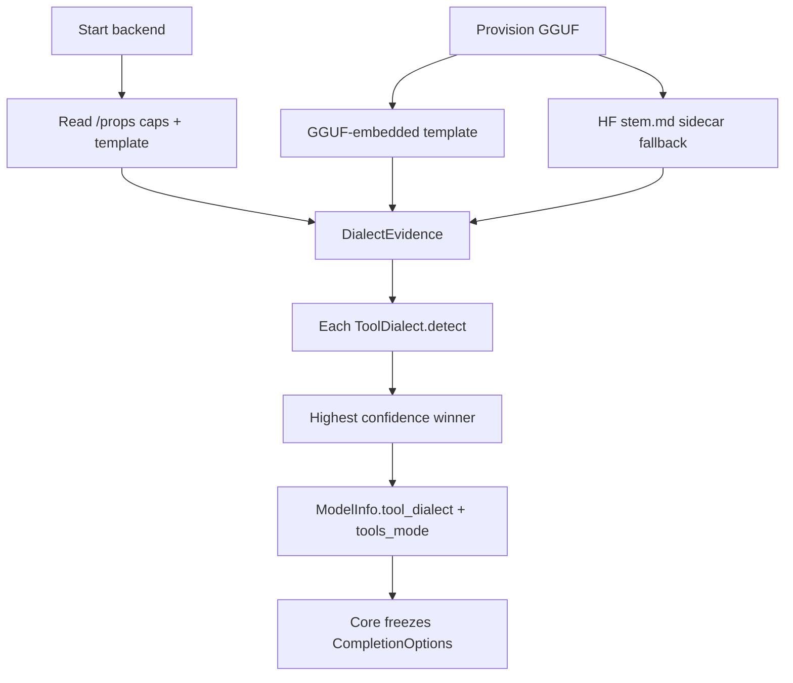

# Pluggable tool-call dialect layer

## 1. What we are building

1. A dialect plugin system so PromptForge’s tool loop speaks each model’s native tool protocol without putting that protocol in author prompts. Operators do not set a dialect by hand. Gateway gathers evidence and resolves a dialect id; core applies prepare / parse / echo through one trait. First shipping dialects: `openai` (passthrough) and `gemma3_tool_code`.
2. Per-VM tool call counts on `tools.calls` so an epilog can require real tool use with ordinary Lua, e.g. `assert(tools.calls["search"] > 0)`. No `require_called` helper (do more with less).

## 2. High-level components (dependency order)

1. **`promptforge-core` `dialects` module** - vocabulary + plugins. Everything else depends on this.
2. **`GatewayClient` + tool loop** - apply resolved dialect on each complete / history echo. Depends on (1).
3. **`tools.calls` counters** - per `SectionVm`, incremented on dispatch; visible in epilog. Depends on (2)’s tool loop.
4. **Catalog types** - `tool_dialect` + `tools_mode` on descriptor/options. Depends on (1).
5. **Gateway resolve + provision** - `/props` evidence, optional HF `<stem>.md` sidecar, catalog advertise. Depends on (1) and (4).
6. **Author prompts / design docs** - strip dialect coaching; briefer epilog asserts search. Depends on (2) and (3).

## Rulebook review

### Vibe-rulebook

| Check | Verdict |
|---|---|
| Levels of resolution (what → components → steps) | Was missing numbered commits; **fixed below** |
| Each step = one testable commit | **Added** (0a, 0b, then 1–4, 4b, 5–8) |
| Data flow: each step fed by prior | See data-flow section |
| Plan stands alone (no chat-only facts) | Paths and decisions recorded here; practice-check link is citation only |
| Look outward | Done via practice check; auto-detect = llama.cpp side, not vLLM flags |
| Irreversible choices | Recorded with falsifiers under Decisions |
| Work in subagents at execute time | When executing: coder → commit → review-and-fix per vibe loop |

### Rust-rulebook

| Check | Verdict / plan change |
|---|---|
| One concept per file; `foo.rs` + `foo/` not `foo/mod.rs` | Use [`src/dialects.rs`](promptforge/crates/promptforge-core/src/dialects.rs) facade + [`src/dialects/openai.rs`](promptforge/crates/promptforge-core/src/dialects/openai.rs) children (**not** `dialects/mod.rs`) |
| Document every public item; `# Errors` / doctests | Public trait, evidence, resolve, registry get docs in the same commits as code |
| `Result` for expected failure; concrete library errors | New `Error` variants (or dialect-local error mapped into existing `Error`) for unknown dialect, detect tie, detect none - never silent `openai` fallback |
| Tests with the code | Unit tests in each dialect file; resolve tests with fixture evidence |
| `#[non_exhaustive]` on public enums/structs we may extend | `ToolDialectId` as newtype or non_exhaustive enum; `DialectEvidence` non_exhaustive |
| Trait object at boundary | `Arc<dyn ToolDialect>` is correct; keep trait dyn-compatible (no async on trait methods; prepare/parse/echo stay sync; IO stays in gateway/client) |
| No dialect logic in `execute` / `client` beyond trait calls | Hard rule |
| Soft “may omit tools[]” | **Decide:** `gemma3_tool_code.prepare_request` **omits** OpenAI `tools`/`tool_choice` when evidence `supports_tool_calls != true`. `openai` always sends them. |

## Decisions (with falsifiers)

1. **Auto-detect primary, not operator toml.** Falsifier: detect wrong dialect on pinned Gemma or Qwen fixtures in CI → add override only for that model and fix matcher.
2. **Probe order:** native caps → `/props` template → GGUF template → sibling `<stem>.md` sidecar → weak card section inside that file. Falsifier: wrong pick when `/props` present but sidecar disagrees → trust `/props` always when present.
3. **Hard-fail on tie / no score above floor.** Falsifier: too many false fails on remotes → lower floor for `openai` when endpoint is known OpenAI-compat (still explicit code path, not silent).
4. **Layout `dialects.rs` + `dialects/*.rs`.** Falsifier: none; matches house rust-rulebook.
5. **P0 dialects only in first landing:** `openai`, `gemma3_tool_code`. P1 names reserved, not implemented until needed.
6. **Remote / no `/props`:** if endpoint is OpenAI-compat chat and evidence has no template/caps, resolve `openai` (explicit remote-thin path). Local llama without resolvable evidence still hard-fails. Falsifier: a remote that needs emulation is mis-labeled openai → add props-equivalent metadata or override.
7. **`tools.calls` only; no helper.** Counts are per `SectionVm` (section or fanout arm). Keyed by **scoped** prompt alias - the aliases this VM put in scope via `tools.need` / `tools.add`, not the global tool catalog. Measure **model** performance: increment when the model issues a call that resolves to a scoped alias and the loop dispatches it, whether the tool succeeds or fails. Scoped alias never called → `0`. Naming a tool that is **not in this VM’s scope** is a **hard error with a clear diagnostic** - even when that tool exists globally in the catalog. Same for model emissions and for Lua `tools.calls["…"]` (typo, or global-but-unscoped). Diagnostic names the bad id/alias, notes if it exists globally but is unscoped here, and lists aliases in scope for this VM. Epilog uses Lua `assert` / `error`. No `tools.require_called`. Falsifier: authors need richer stats → add fields later, not new functions now.

## Control plane

| Layer | Owns |
|---|---|
| Author Markdown | Task prose only |
| **promptforge-core** | Tool-loop transcript + dialect apply |
| **promptforge-gateway** | Evidence gather, `resolve`, advertise on `/v1/models` |
| llama / remote | Chat template apply only |

## Detection (not an LLM)

Ordinary Rust over `DialectEvidence`. Not the 0.6B test model. Not Opus at serve time. Each dialect file’s `detect` scores confidence from caps + template markers. Highest unique score above floor wins.

### Jinja: store and scan, do not execute

The chat template is a Jinja **source string** (from `/props.chat_template`, GGUF metadata, or a fenced block in `<stem>.md`). Dialect `detect` only does deterministic text checks. We do **not** run a Jinja engine. llama-server already applies the template at serve time via `--jinja`.

**Important:** Gemma 3 IT’s `` ```tool_code `` protocol is **not** in the chat template (live `/props` confirmed: standard `<start_of_turn>` template, `supports_tool_calls: false`). So `gemma3_tool_code.detect` must **not** look for `tool_code` inside Jinja. It matches on: tools unsupported in caps **plus** Gemma-3 template shape (`<start_of_turn>`, bos/eos pattern) and/or source/id fingerprints. Hermes/Llama dialects still match on real template markers (`<tool_call>`, etc.) when present.

### Context length: not from the sidecar

Context window is already a first-class catalog field:

- Operator / config: `[[local_model]].context` / `[[model]].context` (e.g. gemma.toml `context = 65536`)
- Advertised on `GET /v1/models` as `ModelInfo.context`
- Live llama `/props` also reports `default_generation_settings.n_ctx` (same value we launched with)

Dialect sidecars do **not** own context length. Optional card text mentioning “32k” is weak prose only; bind/filter uses the catalog `context` u32 as today.



Authoring path when detect fails: diagnostic package on disk → human/agent implements `dialects/<name>.rs` → register in `dialects.rs`.

## Trait (dyn-compatible, sync)

```rust
pub trait ToolDialect: Send + Sync {
    fn id(&self) -> ToolDialectId;
    fn detect(&self, evidence: &DialectEvidence) -> Option<DetectScore>;
    fn prepare_request(&self, request: &mut DialectRequest<'_>) -> Result<()>;
    fn parse_turn(&self, body: &Value) -> Result<NormalizedTurn>;
    fn echo_tool_results(
        &self,
        conversation: &mut Vec<Message>,
        calls: &[ToolCall],
        results: &[(String, String)],
    );
}
```

Delete `ToolHistoryStyle` and collapse `CompletionNormalizer` into `parse_turn`.

## `tools.calls` (per VM)

Orthogonal to dialects: the tool loop in [`execute.rs`](promptforge/crates/promptforge-core/src/execute.rs) increments a map keyed by the **prompt alias** used for dispatch. Before epilog, install a read-only Lua table `tools.calls` on the same `tools` object (or alongside it) so epilog can write:

```lua
assert(tools.calls["search"] > 0)
```

| Rule | Choice |
|---|---|
| Scope | One map per `SectionVm` (fresh for each fanout arm); aliases = that VM’s `tools.need` / `tools.add` only |
| Key | Scoped prompt alias (e.g. `search`), not wire `web_search` |
| In scope, never called | `0` |
| Tool failure after dispatch | Still counts (model issued the call) |
| Out of scope (model or Lua) | Hard error even if the tool exists in the global catalog; diagnostic names the bad id/alias, says global-but-unscoped when that applies, and lists this VM’s in-scope aliases |
| When to increment | After alias resolves in this VM’s scope and dispatch is attempted |
| Parent fanout | No automatic rollup; parent epilog does not see arm counts unless arms store them |
| Helpers | None - ordinary Lua only |

## Data flow (pre-execute check)

| Step | Needs | Produces |
|---|---|---|
| 0a progress | dirty gateway download-progress files | committed progress bar + tests |
| 0b tool_code | dirty core/briefer interim dialect files | committed interim parse/echo + tests (input to step 3) |
| 1 types | clean tree after 0a/0b; existing `Error`, `Message`, `ToolCall` | trait, evidence, registry, `openai` stub |
| 2 openai | step 1 | working passthrough prepare/parse/echo; client uses registry |
| 3 gemma3 | step 1–2 + 0b code | gemma dialect file; interim normalize/execute branches deleted |
| 4 execute | step 2–3 | tool loop echoes via `options.tool_dialect` (tests set id; catalog fill comes in 5–6) |
| 4b calls | step 4 | `tools.calls` map on VM; epilog can assert |
| 5 catalog | step 1 id type | wire + descriptor fields; binding copies dialect into `CompletionOptions` |
| 6 resolve | step 1 detect + step 5 | gateway fills dialect from `/props` (remote: see decision 6) |
| 7 sidecars | step 6 | `<stem>.md` beside GGUF when props thin |
| 8 docs/prompt | step 4 + 4b | briefer without fence coaching; search+fetch asserts; design-core updated |

Parallelism: 0a and 0b are independent (two commits). Then 1→4→4b serial. Step 5 after 1 (can overlap late 2–4). Step 6 after 5. Step 7 after 6. Step 8 after 4b.

## Steps (one commit each)

### 0. Land the dirty working tree first

Working set as of plan update (promptforge repo), two unrelated piles - commit separately:

**0a. Download progress** (gateway only)

- Files: root `Cargo.toml` / `Cargo.lock`, `crates/promptforge-gateway/{Cargo.toml,design-gateway.md,src/local/artifacts.rs}` (`indicatif` TTY/non-TTY progress)
- Commit the feature as-is if tests already cover it; otherwise add unit tests for the progress seam, then **amend** into the same commit (vibe: fix folds back; only if that commit is ours, unpushed).
- Does not block dialects; clears noise from the tree.

**0b. Interim tool_code path** (core + briefer)

- Files: `crates/promptforge-core/src/{client.rs,execute.rs,normalize.rs}`, `design-core.md`, `briefer.md` (`ToolHistoryStyle`, content `tool_code` parse, user-turn echo, briefer protocol text)
- Commit as an interim landing so history is not lost; add/extend normalize + execute unit tests for sole-fence → ToolCalls, mixed prose → Text, and user-turn tool-result history echo; **amend** if tests were missing from the first snapshot.
- Step 3 later **moves** this logic into `dialects/gemma3_tool_code.rs` and deletes the interim types - do not polish forever here.

Commit message focus on why (Gemma llama path / download UX), not file lists. Do not mix 0a and 0b in one commit.

### Dialect plugin commits

1. **Dialects skeleton** - Add `src/dialects.rs` + `src/dialects/openai.rs` stub; `ToolDialect`, `DialectEvidence`, `DetectScore`, `ToolDialectId`, `ToolDialectRegistry::builtin`, resolve helper, error variants. Unit test: empty evidence fails resolve; openai scores when `supports_tool_calls: true`.
2. **OpenAI dialect complete** - implement prepare/parse/echo; point `GatewayClient` at registry + `options.tool_dialect` (default openai for tests). Tests: parse wire `tool_calls`; echo `role=tool`.
3. **Gemma3 tool_code dialect** - move fence parse + user-turn echo from normalize/execute (0b) into `gemma3_tool_code.rs`; prepare omits `tools[]` when not native; delete `ToolHistoryStyle` / interim content-parse branch. `detect`: caps tools false + Gemma-3 template shape (not `tool_code` in Jinja). Tests: sole `tool_code` fence → ToolCalls; mixed prose stays text; detect fixtures for gemma vs openai props.
4. **Execute wiring** - tool loop calls `dialect.echo_tool_results`; `CompletionOptions` carries `tool_dialect` (tests and later binding set it). Test: mock client with gemma dialect id, two-turn loop.
4b. **`tools.calls`** - maintain per-VM alias→count map in the tool loop (pre-seed **this VM’s scoped** aliases at `0`); expose as `tools.calls` before epilog (read-only from Lua; `__index` hard-errors on out-of-scope keys). Increment after resolve+dispatch even when the tool returns an error. Unit tests: successful dispatch → count 1; tool error after dispatch → still count 1; in-scope never called → `0` and epilog assert fails; Lua `tools.calls["typo"]` → hard error + in-scope set; Lua/model names a **global catalog tool that this VM did not `need`/`add`** → hard error (global-but-unscoped, not silent dispatch); pure unknown → hard error. Document in design-core / README under tools Lua API. No new helper functions.
5. **Catalog fields** - gateway `ModelInfo` + core `ModelDescriptor` / fetch parse for `tool_dialect` + `tools_mode` (`native` \| `emulated`); `ModelBinding::completion_options` copies dialect id.
6. **Gateway resolve** - after llama healthy, GET `/props`, build evidence, `resolve` (core API; gateway already/will call into core), populate catalog. Local: hard-fail slot on tie/none. Remote thin evidence → `openai` per decision 6. Test: fixture props Gemma → `gemma3_tool_code`; tools-true → `openai`.
7. **HF sidecar fallback** - on HF provision, fetch small HF metadata (tokenizer `chat_template` string, optional card) and write **one markdown file** beside the GGUF with the **same stem**: e.g. `~/.promptforge/models/gemma-3-27b-it-q4_0.md`. Shape: YAML frontmatter (`source`, `fetched`) plus fenced `chat_template` (raw Jinja text for marker scan only), optional `card` excerpt. No context-length field required in the sidecar. Feed template into evidence only when missing from props/GGUF. Test: props wins over conflicting sidecar. **Current cache** has only GGUFs; no sidecars yet. Step 7 does **not** redownload GGUFs - only writes/updates the sibling `.md`.
8. **Prompt + docs** - strip dialect fencing from `briefer.md` Web Search arm (keep grounding rules); add Web Search arm epilog `assert(tools.calls["search"] > 0)` and `assert(tools.calls["fetch"] > 0)` (both required for the grounding contract); update `design-core.md` principle 18 / normalization + `tools.calls` note; STATUS if public surface changed.

## Out of scope

- Streaming tool deltas
- Dynamic `.so` plugins
- P1 dialects (`hermes`, …) implementation
- Runtime LLM classification
- vLLM as serve stack
- `tools.require_called` or other call-count helpers
- Cross-VM / parent rollup of `tools.calls`

## Abstract interfaces checklist

- `ToolDialect` - all wire behavior
- `DialectEvidence` / `DetectScore` / `ToolDialectRegistry`
- `tools.calls` - per-VM counts for aliases in that VM’s tool scope
- Catalog fields are resolved output
- Author prompt never names a dialect
- One dialect = one file under `src/dialects/` (`dialects.rs` facade)
- Prefer server-native; HF `<stem>.md` sidecar fallback only

## Pre-execute readiness

| Item | Status |
|---|---|
| Goal clear | Yes (dialects + tools.calls) |
| Components + commit steps | Yes |
| Data flow | Yes |
| Gemma detect without template `tool_code` | Fixed |
| Context vs sidecar | Clear |
| tools.calls per VM; scoped aliases; fail counts; out-of-scope hard-errors | Fixed in this update |
| Dirty tree landing | 0a / 0b |
| Remaining risk | Gateway→core dependency for `resolve` must match existing crate graph; confirm in step 6 |
| Ready to execute | **Yes** after user says go |


---

## Recovered rationale

Recovered from the producing chat sessions by the plan ledger on 2026-09-04. Everything below this heading is derived annotation, not part of the original plan.

# Enrichment: tool_dialect_plugins_db961a1c

Neither transcript holds any design discussion of this plan. The chats contain nothing beyond what the plan file already says.

The presumed creator chat ([TTS and PromptForge Dynamic Addons](586734c2-50a8-43fc-912e-054bcec4d0dd)) did not create this plan. It only read the plan file once, on 2026-08-28, to answer the user's question "is there a plan for the plugins" - and ruled it out: the assistant confirmed the tool_dialect_plugins plans are "about gateway tool-call dialects (OpenAI/Gemma formats, completed work, unrelated)" to the proprietary addon-DLL design that chat actually produced (a separate plan, `addon_dll_abi`). No rationale, why, or discarded alternatives for the dialect plan appear anywhere in it.

The context chat ([find the chat where we talk about promptforge plugins](25a3d0d4-9254-432a-860c-6733e66b3282)) is a transcript-search session; it adds only one attribution hint: the plan was "referenced during the commit rewrite scan" in a third chat (76c7cb24-43d1-4da3-9cc2-ae31fe690711, PromptForge History Rewrite), which may be a better candidate for provenance. The plan's true design discussion likely lives in an earlier, unlinked chat; the plan file itself is the authoritative record of its rationale.
