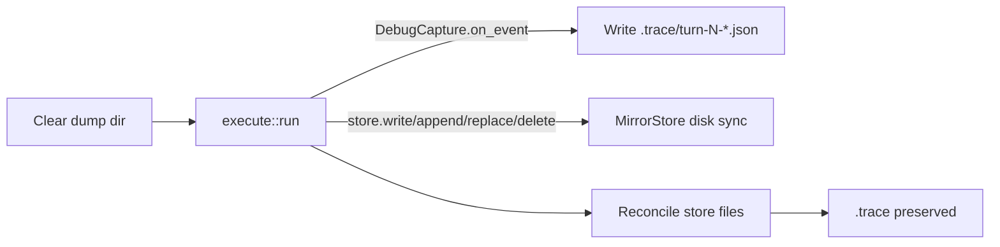

# Write-through dump for promptforge-dev

## Problem

Today [dump.rs](promptforge/crates/promptforge-dev/src/dump.rs) buffers all `DebugEvent`s and [run.rs](promptforge/crates/promptforge-dev/src/run.rs) only calls `dump_store` + `TraceCapture::flush` after `run()` returns. A long briefer leaves nothing inspectable under `briefer.store/` mid-flight.

## Approach (dev-only)

Keep clearing `<stem>.store/` once at run start. Mirror every store mutation and every debug turn to disk immediately. End-of-run becomes a reconcile that never wipes `.trace/`.



### 1. Immediate turn writes - `TraceCapture`

In [dump.rs](promptforge/crates/promptforge-dev/src/dump.rs):

- Drop the in-memory event buffer (or stop using it).
- In `on_event`, create `.trace/` if needed and write `turn-{n}-request.json` / `turn-{n}-response.json` with the same pretty JSON as today.
- Announce with `eprintln!("trace dump wrote ...")` (no `Write` sink available on the trait).
- `flush` becomes a no-op kept only if call sites still invoke it, or remove the call from `run.rs`.
- Other `DebugEvent` variants stay ignored.

### 2. Live store mirror - new `MirrorStore`

Still in `dump.rs`, implement `promptforge_core::store::Store` wrapping `MemStore`:

- Hold `dump_root: PathBuf`.
- After successful `write` / `append` / `str_replace`: read the new contents from the mem backend and write the safe relative path under `dump_root` (reuse `safe_relative_path`).
- After successful `delete`: remove the mirrored file if present.
- Reads / glob / read_lines pass through unchanged.
- Unsafe paths: skip disk mirror, `eprintln!("store dump skipped ...")` (same policy as today’s dump).
- Create parent dirs as needed; never touch `.trace/`.

Wire in [run.rs](promptforge/crates/promptforge-dev/src/run.rs):

```rust
let store = StoreRef::new(Box::new(dump::MirrorStore::new(dump_directory(prompt_path))));
```

instead of `StoreRef::memory()`.

### 3. End-of-run reconcile - change `dump_store`

Stop doing `remove_dir_all` at the end (that is what forced buffering).

New behavior:

- Enumerate in-memory store paths; overwrite each mirrored file (idempotent).
- Walk dump root (non-recursive for top-level + nested store paths): delete files that are not under `.trace/` and not present in the store (covers deleted store keys and stale names).
- If store is empty and dump has only `.trace/` (or is empty), leave `.trace/`; if dump has nothing at all, remove the dump directory (preserve today’s “empty store → no dump” for store-only cases; traces may still exist after a tool-only run with no `store.write`).
- Start-of-run clear in `run_once_with` stays as the sole full wipe.

Remove the post-run `capture.flush(...)` call once write-through is live.

### 4. Docs and tests

- Update [design.md](promptforge/crates/promptforge-dev/design.md) item on store/traces: write-through as events arrive; start clears; end reconciles without wiping `.trace/`.
- Rewrite dump tests:
  - `on_event` creates turn files before any flush.
  - Reconcile does not delete existing `.trace/` files.
  - `MirrorStore` write appears on disk immediately; delete removes the file.
  - Empty-store / second-run / partial-failure run tests in [run.rs](promptforge/crates/promptforge-dev/src/run.rs) still pass under write-through (start clear + reconcile).

## Out of scope

- Concurrent fanout / gateway `--parallel`
- Core `Observer` / `DebugCapture` API changes
- Streaming tokens inside a single turn (still one JSON file per completed request/response)
- MCP / CLI hosts (they do not own this dump path)