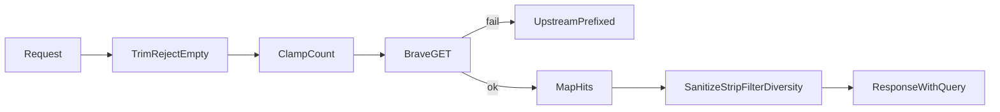

# Gateway web_search upgrade

Cold-reader test: a fresh agent with only this file and the workspace can finish every todo without asking a question.

**Plan path:** `C:/Users/Vinnie/.cursor/plans/gateway_web_search_upgrade_59d2ae56.plan.md`

**Status file:** `cabinet/_scratch/gateway-websearch-upgrade/status.md` - overwrite after each commit with: completed step id, commit hash, next step id, blocked reason or `none`.

**Do not edit this plan file during execution.** Complete every todo. Stop only when no forward path exists.

---

## Why (inline, not chat-dependent)

Research agents using promptforge get SERP leads via Brave through the gateway. The current tool returns only `title`/`url`/`description`/`age`, defaults count to 10, and does no host diversity or sanitisation. Briefer evidence runs under-fetched public pages partly because SERP rows were duplicate-host and thin. Peer stacks (Tavily, Nexo, Brave MCP, Codex Brave) expose freshness/geo and sanitise; they keep search separate from fetch. This plan upgrades the gateway tool only. Caller/Briefer prompt changes are a later plan.

## Baseline on disk (today)

`POST /v1/tools/web_search` in `promptforge-gateway`:

- Request: `query` (required), `count` optional; defaults `DEFAULT_COUNT=10`, `MAX_COUNT=20` constants in `tools.rs`
- Response: `{ "results": [ { title, url, description, age? } ] }` - no `query` echo
- Brave: `GET {base_url}/web/search?q=&count=` only; reads `web.results`
- Config `[tools.web_search]`: `provider`, `api_key`, `base_url` only
- Errors: missing tool 404; bad auth 401; Brave failures as upstream transport/status
- Empty query is not rejected before Brave
- Core tool schema (`promptforge-core`): `query` + `count` only; description says "title, url, description"
- `GatewayError::MalformedRequest(String)` already exists and maps to HTTP 400
- No `url` crate dependency; do not add one - parse host with a small manual helper

## Pre-flight target files

| Path | Lines | Role |
|---|---|---|
| `promptforge/crates/promptforge-gateway/src/tools.rs` | 229 | Handler, Brave client, types - primary edit |
| `promptforge/crates/promptforge-gateway/src/config.rs` | 1259 | `WebSearchConfig` near line 311; add fields + parse tests near `parses_web_search_tool_config` |
| `promptforge/crates/promptforge-gateway/src/error.rs` | - | Use existing `MalformedRequest`; no new variant required |
| `promptforge/crates/promptforge-gateway/tests/it/main.rs` | 859 | `fake_brave`, `web_search_*` tests near lines 144-256 |
| `promptforge/crates/promptforge-core/src/tools/web_search.rs` | 227 | Schema + descriptor test |
| `promptforge/crates/promptforge-gateway/design-gateway.md` | 469 | Section `### POST /v1/tools/web_search` near line 209 |
| `promptforge/README.md` | 787 | Tool configuration section near line 124 |
| `promptforge/gateway.toml` | 33 | `[tools.web_search]` near line 31 - commented optional keys only |

---

## Binding rules (distilled; paths are secondary)

Apply these imperatives on every step. Do not name rulebook files in crate docs or commit messages.

**Rust**

- Return `Result` for expected failure; panic only for internal bugs.
- Document every new public item; add `# Errors` on public fallible functions.
- Put a test in the same commit as the behavior it guards.
- Before each commit: `cargo fmt --all --check` and `cargo clippy -p promptforge-gateway -p promptforge-core --all-targets --all-features -- -D warnings` must pass (coder runs fmt/clippy on touched packages; full Verify uses the same).
- Prefer `&str` inputs on pure helpers; return owned `String` / `Vec` when producing new values.
- No `unsafe`. No new dependencies unless a step explicitly names one (this plan names none).

**Orchestration**

- Main context holds only: this plan path, status file contents, current step id, commit hashes, bounded git lines (`status`, `log -1`, `diff --stat`), Verify one-liners.
- Never load into main: source bodies, full diffs, test logs, `vibe-review.md` body.
- Per step: coder subagent → main commits → review-and-fix subagent → main amends if dirty → Verify when scheduled.
- Dispatch coder and review by grepping this plan for `<coder-task>` and `<review-task>`; pass only plan path, step id, and status path. Do not paraphrase the tagged blocks.
- Coder return: under 500 tokens (done/blocked, files touched, test command).
- Review return: under 1000 tokens (finding count, files changed, path to vibe-review).
- Scratch dir: `cabinet/_scratch/gateway-websearch-upgrade/` (overwrite freely).

**Verify schedule**

Run Verify after the post-process step, after the core-schema step, and after the final docs step; also whenever review-and-fix dirtied the tree. Verify command set:

1. `cargo fmt --all --check`
2. `cargo clippy -p promptforge-gateway -p promptforge-core --all-targets --all-features -- -D warnings`
3. The step's named test command

Verify returns one line: `pass` or `fail` plus a log path under scratch. Main does not read the log body.

---

## Recorded decisions

| Decision | Choice | Falsifier |
|---|---|---|
| Domain filters | Request fields `include_domains` / `exclude_domains`; filter after Brave | Over-fetch still cannot fill `count` after filters; raise multiplier from 3 to 4 in a later change |
| Host grouping | Full hostname, lowercase, strip one leading `www.` | Same-host spam remains dominant; then group by last two labels still without a PSL crate |
| URL parsing | Manual host parse; no new `url` crate | Host parse fails on exotic URLs; then add workspace `url` dep in a separate commit |
| Cache | None | Out of scope |
| Over-fetch | `brave_count = min(max_count, requested_count.saturating_mul(3).max(requested_count))` | Thin Brave pages leave short lists after diversity; accept shorter `results` |
| Module split | Keep post-process in `tools.rs` | If `tools.rs` would exceed 800 lines after the change, split helpers into `src/web_search_process.rs` and `mod` it from `lib.rs` / `tools` parent |

---

## Target contract

### Request

`#[serde(deny_unknown_fields)]`. Unknown JSON keys fail deserialize (HTTP 400).

| Field | Required | Rules |
|---|---|---|
| `query` | yes | Trim ASCII whitespace; if empty → `MalformedRequest("web_search: empty query")`; do not call Brave |
| `count` | no | Default `settings.default_count`; clamp `1..=settings.max_count` |
| `freshness` | no | Else if `settings.default_freshness` non-empty, use that; else omit from Brave query |
| `country` | no | Pass through when `Some` and non-empty |
| `search_lang` | no | Pass through when `Some` and non-empty |
| `safesearch` | no | Else if `settings.default_safesearch` non-empty, use that; else omit |
| `include_domains` | no | `Vec<String>`; empty vec and absent both mean no include filter |
| `exclude_domains` | no | `Vec<String>`; empty vec and absent both mean no exclude filter |

### Response

```json
{
  "query": "C++ Alliance",
  "results": [
    {
      "title": "The C++ Alliance",
      "url": "https://cppalliance.org/",
      "description": "Nonprofit supporting Boost and C++.",
      "age": "2 days ago",
      "site_name": "cppalliance.org",
      "extra_snippets": ["Staff engineers work on libraries."]
    }
  ]
}
```

| Field | Rules |
|---|---|
| `query` | Always present; trimmed request query |
| `age` | `skip_serializing_if` none |
| `extra_snippets` | `skip_serializing_if` empty or none |
| `site_name` | Present when host parses; omit when URL has no host |

### Error vs empty

| Case | HTTP | Behavior |
|---|---|---|
| No `[tools.web_search]` | 404 | existing `ToolNotConfigured` |
| Empty/whitespace `query` | 400 | `MalformedRequest("web_search: empty query")` |
| Brave transport error | existing | message/body prefixed `web_search: ` |
| Brave non-2xx | existing | body excerpt prefixed `web_search: ` |
| Success, zero hits | 200 | `{"query":"...","results":[]}` |

### Config keys under `[tools.web_search]`

| Key | Default | Meaning |
|---|---|---|
| `default_count` | 10 | Used when request omits `count` |
| `max_count` | 20 | Clamp and over-fetch ceiling |
| `max_per_host` | 2 | Diversity cap per hostname group |
| `default_freshness` | `""` | Applied when request omits freshness and this is non-empty |
| `default_safesearch` | `""` | Applied when request omits safesearch and this is non-empty |
| `strip_tracking` | true | Scrub tracking query params |

Keep existing `provider`, `api_key`, `base_url`. Omitting new keys must keep current `gateway.toml` valid.

### Post-process order (deterministic)

1. Map each Brave hit to `SearchResult` fields including `extra_snippets` (default empty vec).
2. Sanitize `title` and `description`: remove Unicode scalar values with `is_control()` except `\n` `\t` then treat those as space; collapse whitespace to single spaces; trim; decode only these entities: `&amp;` `&lt;` `&gt;` `&quot;` `&#39;` `&apos;`; cap by chars: title 512, description 4096, url 2048.
3. If `strip_tracking`: drop query params whose names equal `fbclid`, `gclid`, `mc_cid`, `mc_eid`, or start with `utm_`; remove empty `?`.
4. Set `site_name` from host helper.
5. Include filter then exclude filter (hostname equals listed domain or ends with `.` + listed domain; ASCII lowercase compare).
6. Diversity walk in Brave order; keep while group count `< max_per_host`; stop at requested `count`.
7. Return kept vec.

### Brave HTTP

- `GET {base_url}/web/search`
- Always: `q`, `count` (over-fetch), `extra_snippets=true`
- Optional: `freshness`, `country`, `search_lang`, `safesearch`
- Parse `web.results` only; missing `web` → empty results

### Worked example (post-process)

Input Brave order (after map), `count=3`, `max_per_host=2`, `strip_tracking=true`, no domain filters:

1. `https://a.com/x?utm_source=1` title "A1"
2. `https://a.com/y` title "A2"
3. `https://a.com/z` title "A3"
4. `https://b.com/1` title "B1"

Output:

1. `https://a.com/x` "A1" `site_name=a.com`
2. `https://a.com/y` "A2" `site_name=a.com`
3. `https://b.com/1` "B1" `site_name=b.com`

(A3 dropped by diversity; utm stripped.)



---

## Steps (one commit each)

Each step produces code + tests named below. After commit, update the status file.

### step-1 - Config defaults

Edit `config.rs`: add the six keys with serde defaults on `WebSearchConfig`. Edit `tools.rs`: `WebSearchState` holds a cloneable settings struct filled in `WebSearchState::new`. Unit tests: omitted keys → defaults; explicit TOML values parse. Rustdoc on new public fields.

**Test:** `cargo test -p promptforge-gateway parses_web_search`

### step-2 - Types + empty query

Expand `WebSearchRequest` with optional knobs and domain vecs. Expand `WebSearchResponse` with `query: String`. Expand `SearchResult` with `site_name: Option<String>`, `extra_snippets: Option<Vec<String>>` (or vec + skip-if-empty). Expand `BraveResult` for `extra_snippets`. Handler: trim/reject empty query; set response `query`; resolve count from settings; still call Brave with q+count only until the pipeline step lands (response must include `query` so integration tests that parse JSON do not break later). Update existing integration assertion that reads results to tolerate `query` if that test runs in CI against this commit.

**Test:** unit or handler-level test that empty query yields `MalformedRequest`; `cargo test -p promptforge-gateway --test it web_search_returns_results`

### step-3 - Post-process functions

Add pure functions in `tools.rs`: `sanitize_text`, `strip_tracking_params`, `host_from_url`, `site_name_from_host`, `filter_domains`, `diversify_hosts`. Unit tests covering the worked example numbers and the five bullets previously listed (caps, utm/fbclid, include, exclude, diversify 3+2 → 2+2 at count 4).

**Test:** `cargo test -p promptforge-gateway --lib diversify_hosts sanitize_text strip_tracking filter_domains`

### step-4 - Brave + pipeline

Replace `brave_search` with a params struct (query, over-fetch count, optional knobs). Always send `extra_snippets=true`. After map, run full post-process. Prefix upstream errors with `web_search: `. Update `#[ignore]` live test signature.

**Test:** `cargo test -p promptforge-gateway --lib`

### step-5 - Integration tests

Extend `fake_brave` to return at least 5 hits on 2 hosts with optional `extra_snippets`. Assert: `query` echo; at most 2 results per host when default config applies; empty query → 400; keep 401 and 404 tests.

**Test:** `cargo test -p promptforge-gateway --test it web_search`

### step-6 - Core schema

Update `promptforge-core` `WebSearch::description` and `parameters_schema` for all optional fields (types: string or array of strings; `count` integer). Update descriptor unit test expected JSON.

**Test:** `cargo test -p promptforge-core descriptor_is_stable`

### step-7 - Docs + final Verify

Update `design-gateway.md` section `POST /v1/tools/web_search` to match this contract. Update `README.md` tool section with under 15 new lines on defaults. Comment optional keys in `gateway.toml` without requiring them.

**Final Verify:** fmt, clippy (both packages), `cargo test -p promptforge-gateway`, `cargo test -p promptforge-core descriptor_is_stable`

### step-8 - Qwen3.6 briefer evaluation (after search upgrade)

Run only after step-7 is committed and Verify passed. This step evaluates the upgraded `web_search` under a newer local model. It does **not** edit `briefer.md` or any promptforge prompt.

**Model pin (dense 27B, matches prior qwen27 cell size class)**

- Repo: `unsloth/Qwen3.6-27B-GGUF`
- Files: `Qwen3.6-27B-Q4_K_M.gguf` then `Qwen3.6-27B-Q5_K_M.gguf`
- Resolve and record SHA-256 (`lfs.oid`) from Hugging Face at profile-create time; refuse unpinned serve
- Do not use MoE 35B-A3B or MTP variants in this step

**Profiles (operator tree, outside crate git - same pattern as `qwen9.toml` / `qwen27.toml`)**

- `C:/Users/Vinnie/src/cursor/qwen36-q4.toml` and `qwen36-q5.toml`
- `include = ["common.toml"]`
- `[[device.lane]]` generative `concurrency = 1` (parallel=1 / one slot)
- `context = 65536` (hard floor; do not ship 32768 for this trial)
- `thinking = "switchable"` on catalog; briefer bind keeps `thinking = false` (same EmptyModelReply trap as Qwen3.5)
- Same writer description string as existing briefer `models.always` so semantic bind hits
- `flash_attention = true`, `cache_type_k = "q8_0"`, `cache_type_v = "q4_0"`, `n_predict = 8192`, `gpu_layers = 99`

**Serve + smoke (each quant)**

1. Kill any prior gateway/`llama-server`; `cargo run -p promptforge-gateway -- serve` the Q4 profile first
2. Smoke: `/health`, `/v1/models` (`tool_dialect=openai`, `tools_mode=native`, `context>=65536`), one-turn native tool call
3. If load fails at 64k (VRAM/slot), stop that quant, log blocker in research, continue to Q5 only if Q4 failed for a quant-specific reason; if both fail at 64k, stop step as blocked with evidence (do not silently drop to 32k)

**Briefer matrix (r0 only - no thicken loop)**

Subjects (exact strings): `The C++ Alliance`, `Boost C++ Library Collection`, `Bloomberg`

For each quant profile:

1. `PROMPTFORGE_GATEWAY_URL` / `PROMPTFORGE_GATEWAY_KEY` set; `cargo run -p promptforge-dev -- briefer.md "<subject>"`
2. Archive `briefer.store/evidence.md` to scratch `cabinet/_scratch/briefer-evidence-rounds/qwen36-<q4|q5>-<subject-slug>-r0-evidence.md` (and stderr/stdout siblings)
3. Score lightly vs locked qwen9 bests in `cabinet/_research/2026-08-08-briefer-evidence-tuning.md`: packet bytes, clean five headers, search+fetch discipline (epilog stubs), Alliance EIN/Falco, Boost Shielder, Bloomberg FactSet/wrong-entity hygiene
4. After Q4 cell completes (or hard-blocks), switch profile to Q5 and repeat the three subjects

**Research log**

Append a dated section to `cabinet/_research/2026-08-08-briefer-evidence-tuning.md` (or a new `2026-08-09-…` sibling if that file should stay frozen - prefer append to the existing matrix log). Include: profile knobs, digests, serve/smoke notes, per-subject sizes/scores, verdict vs qwen9 default, whether upgraded SERP diversity visibly helped host variety in traces.

**Cleanup**

Stop gateway. Do not delete Qwen3.6 caches unless the operator asks (large re-download). Leave `qwen36-q4.toml` / `qwen36-q5.toml` on disk for reuse.

**Test / gate for this step:** not a cargo test - success is archived evidence for both quants (or a documented VRAM/slot blocker) plus the research-log append. No promptforge crate commit required unless a gateway bug is found; if a bug fix is required, cut a separate commit outside this plan's step numbering and note it in the research log.

---

## Out of scope

- Result cache / TTL
- Multi-provider / RRF / Brave LLM Context
- Briefer or promptforge prompt caller changes (step-8 evaluates; it does not edit prompts)
- Adding the `url` or `psl` crates
- Qwen3.6 MoE (35B-A3B), MTP, or context below 65536 for the step-8 trial

---

<code-review-extra>
For this plan, also fail the review if: a new crate dependency appeared; cache or disk state for search results was added; Briefer markdown was edited; `tools.rs` exceeds 800 lines without the recorded module split; public fallible items lack `# Errors`; a behavior change lacks a test in the same commit.
</code-review-extra>

<coder-task>
You are an executor. Follow the plan literally.

1. Read the plan file path from the dispatch message.
2. Read `cabinet/_scratch/gateway-websearch-upgrade/status.md` if it exists.
3. Implement only the step id named in the dispatch message.
4. Apply the Binding rules and Target contract sections of the plan.
5. Run only the Test command named in that step (not the full workspace suite).
6. Do not edit the plan file.
7. Return under 500 tokens: `done` or `blocked`, files touched (paths only), test command string, one-line blocker if blocked.
</coder-task>

<review-task>
You are an executor. Follow the plan literally.

1. Read the plan file path and step id from the dispatch message.
2. Diff the commit for that step (or working tree if amending).
3. Apply vibe code-review checks: intent match, tests cover new behavior, reuse existing types, errors handled, trust boundaries checked, style matches neighbors, no dead code, no secrets, plan decision drift revised in-plan only if execution required a decision change (if so, report blocked and do not rewrite the plan - surface to main).
4. Also apply `<code-review-extra>` in the plan.
5. Overwrite `cabinet/_scratch/gateway-websearch-upgrade/vibe-review.md` with one-sentence failures only.
6. Apply exactly one fix round for those failures.
7. Return under 1000 tokens: finding count, files changed, path to vibe-review.md.
</review-task>

---

## Plan review (audit against how-to-falco)

Findings fixed in this revision:

1. **Self-containment** - inlined why/baseline/pre-flight so a cold reader need not see the chat (falco 35).
2. **Pre-flight** - file paths, line counts, edit anchors recorded (falco 44).
3. **Status file** - fixed path for continuity (falco 47).
4. **Dispatch by reference** - `<coder-task>` / `<review-task>` tags; main must not paraphrase (falco 50).
5. **Bright lines** - empty-query error string; entity decode list; module-split at 800 lines; no new deps (falco 9/79).
6. **Worked example** - post-process expected I/O (falco 93).
7. **Removed chat-only ambiguity** - step-2 no longer says "may"; states Brave q+count until pipeline step; query echo required immediately.
8. **Execution gate text** - "Do not edit this plan during execution" (falco 36).

Residual risks (accept):

- Manual host parse will mishandle rare URLs; falsifier recorded.
- Integration test binary name is `it` via `tests/it/main.rs` (Cargo default); if rename occurs, update the test command in the failing step's commit message and status file, not by inventing a second test layout.
- `descriptor_is_stable` test name assumed from core file; if the actual test name differs, coder greps `web_search.rs` tests and uses the real name (file-on-disk is ground truth).

## Restated

Upgrade gateway `web_search` (steps 1-7, one commit each with tests). Then run Qwen3.6-27B briefer r0 at P=1 / 64k on Q4_K_M then Q5_K_M (step-8). Main stays clean; subagents execute tagged tasks for code steps. No search-result cache. No Briefer prompt edits. Fresh context reads this plan and the status file, then finishes every todo.
