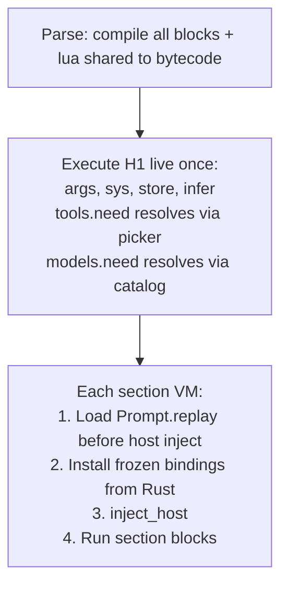

# PromptForge v2: First-class Objects + Section Grammar

## Status: SHIPPED

All runtime features are implemented and tested (504 core tests). Plan originally had 13 steps; 11 are fully done in code, 2 have minor documentation gaps.

Shipped in commits `5445214` through `a27687d` (Aug 9 2026), subsequently integrated through 0.1.0 release prep.

## What shipped (verified on rescan 2026-08-14)

| Step | Feature | Status |
|------|---------|--------|
| 0 | Terminology: preamble -> prologue | Done |
| 1 | `tools.need` returns `LuaToolHandle` | Done |
| 2 | `tools.add` accepts Tool objects and arrays | Done |
| 3 | `models.always`/`models.need` returns `LuaModelHandle` | Done |
| 4 | `model:infer()` via `block_in_place` | Done |
| 5 | ToolBag generation counter + cached snapshot | Done |
| 6 | Mutable `.description` on Tool objects | Done |
| 7 | Alternating blocks parser (`Section.blocks: Vec<Block>`) | Done |
| 8 | `tasks[]` + `execute()` + `jump()` (was goto) | Done |
| 9 | Fanout structured returns (`.text`, `.ok`, `.item`, `.exhausted`) | Done |
| 10 | sys fields + `store.exists()` | Done |
| 11 | design-core.md rewrite | Done (orig file gone - see gap) |
| 12 | STATUS update | Done (README gap - see below) |

## Remaining gaps

### 1. STATUS.md stale claim about design-core-orig.md

STATUS.md still claims "`design-core-orig.md` remains byte-identical history." That file does not exist on disk and was never committed (archived outside the repository; `design-core-residue.md` documents what was superseded). Fix: remove or correct the claim.

### 2. Root README lacks first-class API coverage

Root README was restored to an illustrated landing page (`7661b38`) and does not mention `model:infer`, `execute`, `jump`, `tasks[]`, structured fanout, or alternating blocks. All feature documentation lives in the mdbook user guide and `design-core.md`. Either add a brief "Prompt Language Features" section to README linking to the guide, or explicitly state that prompt-language documentation lives in the user guide.

## Obsolete plan content (removed on this rescan)

- Per-file implementation strategies (all files already changed)
- Executable commit sequence (completed)
- Baseline file line counts (all stale)
- Binding rules / orchestration machinery (execution complete)
- Code-review tags (no longer dispatching work)
- Verify schedules (no pending steps)
- "Preserve design-core-orig.md byte-for-byte" constraint (file gone; superseded by consolidation)
- `goto()` naming (shipped as `jump()`)

## Architecture (reference)

```
Parse -> Execute H1 live (resolvers fire, infer OK, store OK) -> Sections (Rust-installed bindings + library replay)
```



## Key decisions (historical record)

| Decision | Shipped as |
|---|---|
| Phase machine | Kept internally; new code uses objects/blocks |
| Prose path | Executor-driven for backward compat |
| infer() async | `block_in_place` + `Handle::block_on` |
| Tool bag | Generation counter, snapshot on infer/prose, cache on unchanged |
| Counts | Persist across infer/prose; new tools seed at 0 |
| Description override | Mutable `.description` on Tool; flows into schema prep |
| Non-final prose | Single-shot (one round then fall through) |
| Final prose | Full tool loop |
| execute() | Fresh VM, returns reply, recursion cap 8 |
| jump() | Context-clearing transfer, no return |
| Alternating blocks | Section.blocks: Vec of Lua or Prose; final-prose identified at parse time |
| Bind phase | Eliminated (separate h1_once_no_replay plan) |
| Library replay | Explicit `lua shared` fence -> `Prompt.replay` |
