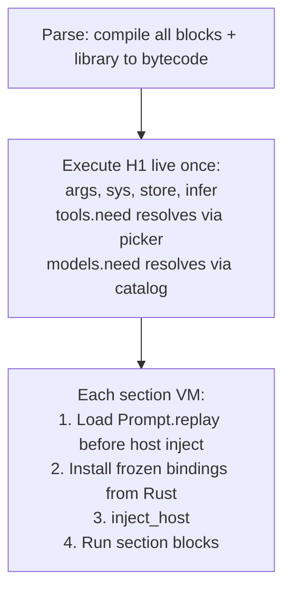

# Single-pass H1: live resolution, no bind phase

## Status: SHIPPED

All runtime steps completed and merged to master through 0.1.0 release prep. The architecture described below is the current production state of the repository as of `7661b38` (tip).

## What shipped (verified on rescan 2026-08-13)

- `bind.rs` deleted; replaced by `resolve.rs` (live runtime resolution)
- `BoundPrompt` gone from entire codebase
- No `install_replay_tools`, `install_replay_models`, `ToolPhase::Replay`, `ModelPhase::Replay`
- `Prompt` struct carries `replay: Option<LuaProgram>` and `h1_blocks: Vec<Block>`
- `execute::run` takes `&Prompt` + `ResolutionContext` directly
- `lua shared` fence recognized in parser; exactly one allowed, H1 only
- 504 promptforge-core lib tests pass
- CLI, dev, MCP all use parse-to-run path
- `design-core-orig.md` was deleted (consolidated into `design-core.md`)

## Remaining gaps (two documentation items)

### 1. Quick Reference missing from user guide

The plan called for a compact **Quick Reference** section at the end of the user guide (before the final robot image) with these rules:

- Non-final prose blocks: single-shot. One model round (may include tool calls for that round). Control moves to the next lua block after the model responds. Conversation accumulates.
- Final prose block: full tool loop. Model keeps calling tools until it produces text. That text becomes `reply`.
- Lua blocks: run sequentially. Can mutate tool scope (`tools.add`), write to store, inspect `reply`, call `execute()` or `jump()`, call `model:infer()` explicitly.
- One conversation per section. Context grows across all blocks within the section. Cleared between sections.
- Sections are subroutines. `execute("## Name", input?)` runs a section in a fresh VM, full tool loop, returns its reply. Like fanout but sequential and single.
- `jump("## Name")` transfers control. Context clears. The current section stops. The named section runs next. No return to caller.

Plus the block sequence diagram:

```
[lua] [prose] [lua] [prose] ... [lua]
```

This was never added. Needs to go into the current monolithic `promptforge-user-guide.md` or the mdbook equivalent.

### 2. STATUS.md stale claim

STATUS.md still says "`design-core-orig.md` remains byte-identical history." That file was deleted in commit `2d00ded` during the design consolidation. The claim must be removed or updated to reflect that `design-core.md` is now the sole authoritative design document.

## Architecture (reference, no longer actionable)

```
Parse -> Execute H1 live (resolvers fire, infer OK, store OK) -> Sections (Rust-installed bindings + library replay)
```



## Key decisions (historical record)

| Decision | Choice |
|---|---|
| Bind phase | Eliminated |
| `BoundPrompt` type | Removed |
| Declaration mode / replay mode | Removed |
| H1 execution | Once, live, full host access |
| `tools.need` / `models.need` | Runtime resolution via picker; return frozen Tool/Model objects |
| Section VM binding install | Rust installs from frozen maps |
| Library (`lua shared`) | Loaded per section BEFORE host inject; pure function defs only at load time |
| `var` from H1 | Serialized; seeds each section's initial `var` |
| `store` from H1 | Persists naturally (run-scoped) |
| Conditional declarations | Natural (tools.need inside if-blocks, after infer) |
| Near-duplicate validation | At scope-close |
| `design-core-orig.md` | Deleted during consolidation (was preserved during initial plan) |

## Research (retained for reference)

VM clone research confirmed no stock Lua 5.4 / mlua state clone exists. Host-ID-registry snapshot (Eris-style, in Rust) remains a viable future design for richer state sharing. Current approach (explicit `lua shared` replay + frozen bindings from Rust) is the pragmatic working solution.
