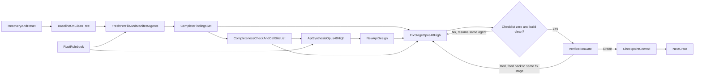

# PromptForge Top-to-Bottom Crate Review

## Postmortem of the first attempt (why this plan changed)

The first run committed `promptforge-tool-picker` (`c6ddd58`) with a red verification and left `promptforge-core` half-migrated. Two root causes, both fixed below:

- The "one fix round" was read as "one subagent invocation." The core implementation agent hit its execution limit at 132 of 238 findings, stopped, and was treated as done. A fix stage must run to completion, not to the first invocation boundary.
- A crate was committed while red, and moving on was allowed while red. That put a broken tree on master. A crate is now never committed or left until verification is green.

Secondary lesson: the tool-picker `build.rs` was rewritten to require `PROMPTFORGE_MODEL_DIR`, which broke ordinary `cargo build --workspace` from a clean checkout. No fix may regress a gate that passed at baseline.

## Recovery and reset (execute first, before any review work)

Current state: local `master` is the broken `c6ddd58`; the uncommitted `promptforge-core` partial work is in the tree; remote `origin/master` was already rolled back to `4f0f1ae`.

1. Create branch `recovery/aborted-review-2026-08-09` from the current `c6ddd58` working state.
2. On that branch, commit the two authorized-but-uncommitted pieces separately: first the `promptforge-core` design consolidation (`design-core.md`, new `design-core-residue.md`, deletion of the two predecessor docs), then the incomplete core implementation (`src/api.rs` and the modified core files) as an explicit WIP snapshot. This preserves every byte of partial work under a name.
3. Push `recovery/aborted-review-2026-08-09` to origin so the partial work is durable.
4. Switch to `master` and `git reset --hard 66e76eb`. This is the last known-good commit: doctests and workspace tests passed there, and it is the parent of the broken commit. It keeps the two good commits `66e76eb` and `9397b24`; it discards only our broken `c6ddd58`.
5. Remove the now-untracked leftovers from the master working tree (`src/api.rs`, `design-core-residue.md`) by moving them to `cabinet/_trash/`, so the reset tree is clean. They already live on the recovery branch.
6. Push `master`. Remote is at `4f0f1ae`, an ancestor of `66e76eb`, so this is a fast-forward and needs no force.
7. Confirm `git status` is clean and `HEAD` is `66e76eb` before any review begins.

Preserved review evidence in `cabinet/_scratch/promptforge-crate-review/` and `cabinet/_output/` (all per-file findings, both synthesized API designs, ledgers, verification reports) is not discarded. It is reused as reference input. Because the reset returns the tree to the exact state the tool-picker per-file findings were generated against, those findings and `design-promptforge-tool-picker-api.md` are directly reusable; the core findings were generated against the post-migration tree and must be regenerated when core's loop runs on the clean tree.

## Model assignment

- Recovery, reset, inventory, git, shell assembly, mechanical verification gates: GPT-5.6 Sol Medium. This work is deterministic; extra thinking adds latency, not safety.
- Per-file review agents: GPT-5.6 Sol Medium. The first run's per-file reviews were thorough and correct.
- Crate API synthesis: Opus 4.8 High.
- Whole-crate implementation (the fix stage): Opus 4.8 High.

## Fixed scope and order

Review all Rust source, test, fixture, integration-test, and build-script files under [promptforge](C:\Users\Vinnie\src\cursor\promptforge), plus each crate's `Cargo.toml` and the root workspace [Cargo.toml](C:\Users\Vinnie\src\cursor\promptforge\Cargo.toml), excluding generated build output and dependencies. Process crates strictly in this topological order:

1. `promptforge-tool-picker`
2. `promptforge-core`
3. `promptforge-core-tests`
4. `promptforge-gateway`
5. `promptforge-webfetch`
6. `promptforge-cli`
7. `promptforge-dev`
8. `promptforge-mcp-server`

The root [Cargo.toml](C:\Users\Vinnie\src\cursor\promptforge\Cargo.toml), each crate manifest, existing crate design documents, and [rust-rulebook.md](C:\Users\Vinnie\src\cursor\tools-public\rulebooks\rust-rulebook.md) provide review context.

Three rulebooks bind this pipeline and are cited by path, never copied into the plan or into a dispatched prompt:

- [rust-rulebook.md](C:\Users\Vinnie\src\cursor\tools-public\rulebooks\rust-rulebook.md) is the review criteria, the API-design law (section 6), and the verification gate list (section 12).
- [vibe-rulebook.md](C:\Users\Vinnie\src\cursor\tools-public\rulebooks\vibe-rulebook.md) sets the subagent loop, the code-review checks, and fix-forward completion.
- [prompts-rulebook.md](C:\Users\Vinnie\src\cursor\tools-public\rulebooks\prompts-rulebook.md) sets dispatch-by-reference, capped returns, and the main-context token contract.

## Operating discipline (applies to every crate loop)

Main context holds only: the plan, current crate name, current step, file inventory paths, artifact paths, bounded Git lines, and each subagent's capped return. Main context never holds: raw source, findings bodies, API-design bodies, diffs, or build and test logs. Every subagent reads large inputs from disk and returns at most 2000 tokens of distilled findings plus artifact paths; when a result exceeds that, it returns a summary plus the path to the full file.

Dispatch every subagent by reference. Each task prompt carries the target file path, the three rulebook paths, the relevant artifact paths, and the task's few variable values. It does not inline rulebook text or criteria blocks. Each review task instructs the subagent to read [rust-rulebook.md](C:\Users\Vinnie\src\cursor\tools-public\rulebooks\rust-rulebook.md) from its path before analyzing.

Assemble multi-file inputs through the shell, not through the write tool. The synthesis agent receives its crate's findings as a single shell-concatenated file so the combined payload never travels as a tool-call argument.

Every named artifact is commanded into existence by a specific step: the baseline creates the mirrored scratch tree, each per-file agent creates exactly one findings file, the synthesis agent creates one API-design file, and the implementation agent edits source and records dispositions. No later step references an artifact an earlier step was not told to create.

## Establish the baseline

Run this only after the recovery-and-reset section completes and `HEAD` is `66e76eb` with a clean tree. The reset reverted the earlier core design consolidation, so the consolidation step below runs again on the clean tree.

- Generate a deterministic inventory grouped by crate of repository-owned `.rs` files plus each crate's `Cargo.toml`, and record the current Git state.
- Run the rust-rulebook section 12 gate commands across the whole workspace once, in a subagent, and record pass or fail plus a log path so pre-existing failures are distinguishable from regressions introduced later. The gates are `cargo fmt --all --check`; `cargo clippy --all-targets --all-features -- -D warnings`; `cargo test --locked --workspace --all-features`; `cargo test --workspace --doc`; and `RUSTDOCFLAGS="-D warnings" cargo doc --no-deps --all-features`. Only the pass or fail line and the log path enter main context.
- Review the root workspace `Cargo.toml` once in a subagent against rust-rulebook sections 8, 9, and 12 (workspace layout, `[workspace.dependencies]` identity and additivity, `[workspace.lints]`), writing `Cargo.toml.findings.md` for the root into the mirrored tree. Workspace-scope findings are applied once during Final workspace closure, since no single crate owns them.
- Establish the API-surface tooling. Ensure a nightly toolchain and `cargo public-api` and `cargo semver-checks` are installed (verify each on crates.io before install per rust-rulebook section 9); nightly is required because both read rustdoc JSON. For every crate, capture its baseline public-API snapshot with `cargo public-api -p <crate>` into `<scratch>/<crate>/public-api.baseline.txt`. These snapshots are the authoritative public surface used for extraction and for the verification diff; the LLM never reconstructs the public API by hand when a snapshot exists.
- Create a mirrored **scratch** tree for per-file artifacts. A source such as `crates/promptforge-core/src/server.rs` maps to a findings file whose path preserves the crate-relative path, for example `<scratch>/promptforge-core/src/server.rs.findings.md`, so no two files collide. Each crate's `Cargo.toml` maps the same way to `<scratch>/<crate>/Cargo.toml.findings.md`.
- Consolidate the `promptforge-core` design docs in one subagent, since only that crate carries three (`design-core.md`, `design-core-orig.md`, `design-core-recovered.md`) and the other crates already have a single canonical doc. The subagent reads all three, writes the current, accurate design into one new `crates/promptforge-core/design-core.md`, writes everything that does not belong in the canonical design (superseded, historical, or recovered-only content) into one new `crates/promptforge-core/design-core-residue.md`, then moves the three originals to `cabinet/_trash/` (never a hard delete, per workspace rule; recoverable from there). It returns the two new paths and the trashed paths. After this step, every crate has exactly one canonical `design-<crate>.md` for its synthesis agent to read.

## Execute this complete loop for one crate at a time

### 1. Fresh per-file review agents

Launch one fresh subagent for every `.rs` file in the current crate, plus one for the crate's `Cargo.toml`. Agents may run in parallel within that crate, but no agent is reused and no next-crate work begins.

Each `.rs` task prompt carries the target source path, the mirrored findings-file path to create, and the three rulebook paths. The agent reads its assigned source, relevant module ancestry and manifest context, and reads [rust-rulebook.md](C:\Users\Vinnie\src\cursor\tools-public\rulebooks\rust-rulebook.md) from its path before analyzing. It writes exactly one `*.findings.md` artifact containing:

- The externally reachable public API contributed by the file, with signatures, visibility, contracts, and source locations. The authoritative crate surface comes from the `cargo public-api` baseline snapshot captured at baseline (`<scratch>/<crate>/public-api.baseline.txt`); the agent attributes those public items to the file it owns rather than reconstructing the surface from scratch. Test-only or private files explicitly record that they contribute no public API.
- Rulebook violations and risks, each citing the specific rust-rulebook section, with evidence, severity, confidence, impact, and a concrete correction.
- General code-hygiene opportunities, including ownership, error handling, documentation, naming, duplication, complexity, tests, dependency leakage, and module responsibility.
- Cross-file or API-design observations that the crate-level synthesis agent must consider.

The manifest agent reviews the crate's `Cargo.toml` against rust-rulebook sections 8, 9, 10, and 12 (member layout, feature additivity, dependency identity, package metadata, `[lints] workspace = true`), writing `<scratch>/<crate>/Cargo.toml.findings.md`.

Each agent returns at most 2000 tokens: a completion status, a one-line summary, the finding count, and the artifact path. Raw source and the findings body never enter main context.

When every agent has returned, main context lists the mirrored tree for this crate and diffs it against the inventory, confirming exactly one findings file per `.rs` file and per `Cargo.toml` before synthesis begins. It then enumerates downstream call sites with a single bounded `rg` for the crate name across the crates that depend on it, writing the resulting path list to `<scratch>/<crate>/downstream-call-sites.txt`. Both operations bound their own output, so they run in main.

### 2. Fresh crate API synthesis agent

After the completeness check passes, concatenate the current crate's `*.findings.md` files (including the manifest findings) into one combined file through the shell, then launch a new synthesis subagent. The task prompt carries the combined findings path, the manifest and current API-root paths, the crate's canonical existing design document path, the `downstream-call-sites.txt` path produced in step 1, and the rulebook paths. The agent reads rust-rulebook section 6 as the API-design law before proposing changes.

The agent writes a new **output** document named `design-promptforge-{crate}-api.md` that:

- Reconstructs the effective current public API, using the `cargo public-api` baseline snapshot as ground truth.
- Proposes the smallest coherent replacement API, reducing exports and types where justified, and applying rust-rulebook section 6 (`#[non_exhaustive]`, no dependency error types in the public API, named iterator types over `impl Trait`, `From`/`TryFrom` over `Into`, `pub(crate)` default with `unreachable_pub`, sealed traits, `#[must_use]`).
- Moves responsibilities to their natural modules or crates.
- Prevents recurrence of findings through stronger types, narrower visibility, clearer ownership, and better contracts.
- Provides an old-to-new migration map, explicit removals, compatibility decisions, invariants, and required test changes.
- Dispositions every API-related finding and avoids change for change's sake.

The agent returns at most 2000 tokens: a one-line summary of the proposed surface change and the design-document path. The design body never enters main context.

### 3. One fix stage, run to completion

There is exactly one review stage (step 1) and one fix stage (this step) per crate. The fix stage is not one subagent invocation; it is one continuous effort by a single implementation agent, on the same assignment, resumed across bounded slices until it is actually done. There is no second, independent review-then-fix cycle.

Launch the implementation agent (Opus 4.8 High) with the combined findings path, the `design-promptforge-{crate}-api.md` path, the `downstream-call-sites.txt` path, and the rulebook paths. It implements the approved API, fixes every valid finding, updates documentation and tests in the same edits (a change without a test is incomplete), and maintains a per-finding disposition ledger at a fixed scratch path.

Completion contract for the fix stage:

- Every finding ends fixed, or rejected with specific contrary evidence. "Unresolved" is not an acceptable terminal state.
- Every design item from `design-promptforge-{crate}-api.md` is implemented or explicitly dispositioned.
- The crate and all touched downstream call sites compile.

Slice loop: after each agent slice, main reads only the ledger counts and a mechanical `cargo build -p <crate>` (and `cargo build --workspace` once downstream edits exist) status. If the completion contract is not met and the build is not clean, resume the same agent with the ledger and the remaining checklist, pointing it at the unresolved items. Bound each slice; continue until the checklist reaches zero unresolved and the build is clean, or until two consecutive slices make no measurable progress (no reduction in unresolved count and no new passing gate), at which point stop and surface the blocker to the user rather than looping forever. Each slice returns at most 2000 tokens: unresolved count, files touched, build status, ledger path. Diffs and logs never enter main.

No fix may regress a gate that passed at baseline. In particular, no change may make an ordinary clean `cargo build --workspace` require a new environment variable or manual provisioning (the first-attempt `build.rs`/`PROMPTFORGE_MODEL_DIR` regression). If a finding's fix would break a baseline-passing gate, the fix must keep that gate passing or the finding is rejected with that evidence.

If the new API breaks downstream callers, the agent updates only the call sites listed in `downstream-call-sites.txt`, changing call sites only and adding no new `pub` items to those crates. Those files remain subject to a fresh full review when their own crate is reached. No unrelated downstream cleanup is performed early.

### 4. Verification gate (must be green to proceed)

Prerequisite: the embedding-model asset the tool-picker `build.rs` needs must be available to the verification environment (network for the first build, a warm Hugging Face cache, or the crate's provisioning mechanism). A gate that cannot run is BLOCKED, and BLOCKED is not GREEN.

Use one fresh verification context (GPT-5.6 Sol Medium). It does not fix anything. It applies the vibe-rulebook code-review checks against the crate's diff, runs the rust-rulebook section 12 gates scoped to the current package, and checks:

- Every finding is fixed or rejected with specific contrary evidence in the disposition ledger; zero unresolved.
- The implemented public API matches the synthesized design. This is checked mechanically: regenerate the current surface with `cargo public-api -p <crate>` and diff it against the design's declared surface; every difference is intended by the design or the mismatch is a FAIL.
- The scoped rust-rulebook section 12 gates pass and actually ran: `cargo fmt --all --check`; `cargo clippy -p <crate> --all-targets --all-features -- -D warnings`; `cargo test -p <crate> --all-features`; `cargo test -p <crate> --doc`; the doc build with `RUSTDOCFLAGS="-D warnings"`; and `cargo build --workspace`.
- No gate that passed at baseline now fails or is newly blocked.
- Downstream call-site edits are call-site-only, checked mechanically: for each touched downstream crate, `cargo public-api -p <downstream>` diffed against its baseline snapshot shows no added, removed, or changed `pub` item. Any diff there is a FAIL unless it is one of the forced signature changes the design logged.
- `cargo semver-checks` is run to surface breaking-change classification for the record (informational for these unpublished crates, but any unexpected result is investigated).
- The final diff contains no accidental generated files, secrets, dead code, or unrelated changes.

The verifier returns one GREEN or RED status line plus, on failure, a log path; main never reads the log. If RED, the failure is fed back into the same fix stage (step 3), not a new review, and the slice loop resumes until the verifier returns GREEN or the no-progress stop condition trips and the blocker is surfaced to the user.

Only after a GREEN verdict does main make one checkpoint commit for the crate (staging the crate's changes and any downstream call-site edits, message naming the crate and its green status). A crate is never committed while red and never left behind while red. Approving this plan authorizes these per-crate checkpoint commits; no other commits are made. Then begin the next crate.

## Final workspace closure

After all eight crate loops complete, apply the root workspace `Cargo.toml` findings recorded at baseline in one implementation subagent (one round of fixes for the workspace-scope manifest). Then run the full-workspace rust-rulebook section 12 gates again in a subagent (the same command set used for the baseline) and compare against the recorded baseline so no gate regressed. Reconcile all per-crate API documents against the final cross-crate API, verify every early downstream call-site edit received its later file review, and promote each `design-promptforge-{crate}-api.md` into its crate directory as the canonical `design-<crate>.md` (updating in place, so the permanent design record reflects the redesigned API rather than leaving it only in ephemeral output). Produce a concise final completion **output** report listing per-crate verification status, any red gates surfaced during the run, and remaining intentional tradeoffs, then make a final checkpoint commit for the workspace-scope changes. Only status lines, paths, and the report path enter main context.

## Data flow and efficiency check

The data dependencies are complete: the completeness check confirms every findings artifact exists and produces the downstream call-site list before synthesis; synthesis and the fix stage both consume that list and the shell-concatenated findings by path; verification receives the resulting diff plus the disposition ledger. Per-file and manifest work is the only broad parallel stage. There is exactly one review stage and one fix stage per crate; the fix stage runs to completion across bounded slices, and a red verification feeds back into that same fix stage rather than starting a new review. A crate is committed only on green and is never left behind while red. Cross-crate execution remains strictly serial as requested. No steps can be combined without losing the fresh-context review boundary or allowing incomplete evidence into API design.

Token contract per rulebook: every subagent is dispatched by path and rulebook-tag reference, returns at most 2000 tokens plus artifact paths, and keeps raw source, findings bodies, design bodies, diffs, and logs out of main context. The rulebooks are never copied into a dispatched prompt.