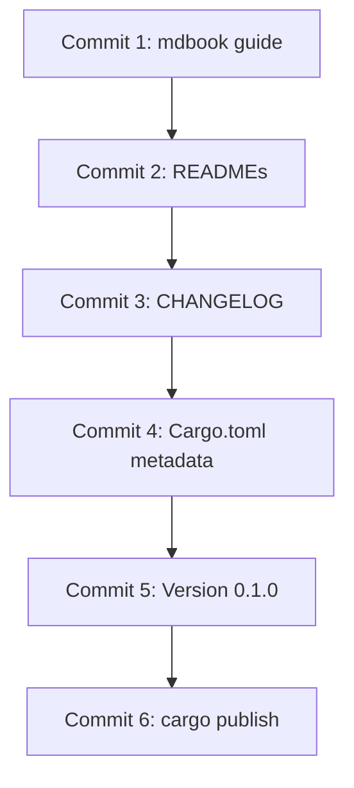

# PromptForge 0.1.0: User Guide + Publish

Six commits, each self-contained and reviewable. The guide comes first. Publishing comes last.

## Commit 1: mdbook user guide

Create `guide/` at workspace root. 15 chapters carved from the existing per-crate user guides.

### Structure

```
promptforge/guide/
  book.toml
  src/
    SUMMARY.md
    introduction.md
    getting-started.md
    prompt-files.md
    execution.md
    lua.md
    models.md
    tools.md
    fanout.md
    store.md
    gateway.md
    mcp-server.md
    tool-picker.md
    webfetch.md
    dev-runner.md
    errors.md
```

### Chapter sources

- **introduction.md** - synthesized from all 7 guide openings
- **getting-started.md** - from CLI guide: "Running Your First Prompt" + "Input and Output"
- **prompt-files.md** - from core guide: "Prompt Files"
- **execution.md** - from core guide: "Execution Model"
- **lua.md** - from core guide: "Lua Scripting"
- **models.md** - from core guide: "Models"
- **tools.md** - from core guide: "Tools"
- **fanout.md** - from core guide: "Fanout"
- **store.md** - from core guide: "Store"
- **gateway.md** - from gateway guide (whole thing)
- **mcp-server.md** - from mcp-server guide (whole thing)
- **tool-picker.md** - from tool-picker guide (whole thing)
- **webfetch.md** - from webfetch guide (whole thing)
- **dev-runner.md** - from dev guide (whole thing)
- **errors.md** - from core guide "Error Handling" + error sections from other guides

### Execution

Parallel subagents, one per chapter. Each reads the source guide section, restructures to standalone chapter (H1 title, H2/H3 body), tags all non-Rust fences explicitly per the [Rust rulebook](tools-public/rulebooks/rust-rulebook.md). Main writes `book.toml`, `SUMMARY.md`, `introduction.md`. Verify with `mdbook build`.

---

## Commit 2: README improvements

Every publishable crate needs a README that works on both GitHub and crates.io.

### Per-crate READMEs

Each publishable crate gets a short README (~30-50 lines) that serves as its crates.io landing page. The detailed content lives in the mdbook guide; the README is a signpost. Structure:

- H1 crate name
- Badges row (crates.io version, docs.rs, CI, license)
- One paragraph: what this crate does
- Minimal code or CLI example
- Link: "See the [PromptForge User Guide](https://cppalliance.github.io/promptforge/) for full documentation"
- MSRV + license

Create new:
- `promptforge-webfetch/README.md`
- `promptforge-tool-picker/README.md`

Rewrite existing (replace current content with the crates.io-ready format):
- `promptforge-core/README.md`
- `promptforge-cli/README.md`
- `promptforge-gateway/README.md`
- `promptforge-mcp-server/README.md`
- `promptforge-dev/README.md`

### Workspace root README

Update with badges, link to the published guide, component overview table.

---

## Commit 3: CHANGELOG.md

Create `CHANGELOG.md` at workspace root in [Keep a Changelog](https://keepachangelog.com/) format.

```markdown
# Changelog

All notable changes to this project will be documented in this file.

The format is based on [Keep a Changelog](https://keepachangelog.com/en/1.1.0/),
and this project adheres to [Semantic Versioning](https://semver.org/spec/v2.0.0.html).

## [0.1.0] - {date}

### Added
- Initial public release
- {summary of what ships in 0.1.0}

[0.1.0]: https://github.com/cppalliance/promptforge/releases/tag/v0.1.0
```

---

## Commit 4: Cargo.toml metadata

Fix metadata gaps identified in the [audit](cabinet/_output/audit-promptforge-publish.md).

### Add missing fields

Per-crate changes:

- **promptforge-webfetch:** add `readme = "README.md"`, `keywords`, `categories`
- **promptforge-tool-picker:** add `readme = "README.md"`, `keywords`, `categories`
- **promptforge-gateway:** add `readme = "README.md"`, `keywords`, `categories`

### Fix typo

- **promptforge-mcp-server:** fix garbled description ("runs a prompt an agentic harness names to run_prompt")

### Update comment

- **promptforge-core:** update the MANIFEST-001 comment to reflect the upcoming version change

### License file for subcrates

The LICENSE (BSL-1.0) is at the workspace root. Cargo includes it automatically when the `license` field is set. Verify with `cargo package --list` that the LICENSE appears in each crate's package. If not, add `license-file = "../../LICENSE"` to each publishable crate's Cargo.toml (BSL-1.0 is confirmed accepted on crates.io - multiple crates already published with it).

### Add docs.rs metadata

For library crates, add:

```toml
[package.metadata.docs.rs]
all-features = true
```

### Add `documentation` field

Set `documentation = "https://cppalliance.github.io/promptforge/"` on all publishable crates. This points crates.io to the mdbook guide rather than to docs.rs (which still hosts API reference automatically).

### Add GitHub Pages deploy workflow

Create `.github/workflows/guide.yml` using the modern artifact-based deploy (not the old `gh-pages` branch approach). Based on the [official mdbook starter workflow](https://github.com/actions/starter-workflows/blob/main/pages/mdbook.yml):

```yaml
name: Deploy guide to Pages
on:
  push:
    branches: [main]
  workflow_dispatch:
permissions:
  contents: read
  pages: write
  id-token: write
concurrency:
  group: "pages"
  cancel-in-progress: false
jobs:
  build:
    runs-on: ubuntu-latest
    env:
      MDBOOK_VERSION: 0.4.44
    steps:
      - uses: actions/checkout@v4
      - name: Install mdBook
        run: |
          wget -q "https://github.com/rust-lang/mdBook/releases/download/v${MDBOOK_VERSION}/mdbook-v${MDBOOK_VERSION}-x86_64-unknown-linux-gnu.tar.gz"
          tar xzf "mdbook-v${MDBOOK_VERSION}-x86_64-unknown-linux-gnu.tar.gz"
      - name: Setup Pages
        uses: actions/configure-pages@v5
      - name: Build
        run: ./mdbook build guide
      - name: Upload artifact
        uses: actions/upload-pages-artifact@v3
        with:
          path: guide/book
  deploy:
    environment:
      name: github-pages
      url: ${{ steps.deployment.outputs.page_url }}
    runs-on: ubuntu-latest
    needs: build
    steps:
      - name: Deploy to GitHub Pages
        id: deployment
        uses: actions/deploy-pages@v5
```

Requires one manual step: in repo Settings > Pages, set the build source to "GitHub Actions" (not "Deploy from a branch").

Also add `guide/book/` to `.gitignore` so the build output is never committed.

---

## Commit 5: Version 0.1.0 + enable publish

This is the "flip the switch" commit. No other changes.

### Version bump

- `[workspace.package]` version: `"0.0.0"` -> `"0.1.0"`
- `[workspace.dependencies]` for all three internal deps: version `"0.0.0"` -> `"0.1.0"`
- Individual crates that pin `version = "0.0.0"` directly (core, others): change to `"0.1.0"`

### Remove `publish = false`

From these 7 crates:
- `promptforge-tool-picker`
- `promptforge-core`
- `promptforge-webfetch`
- `promptforge-gateway`
- `promptforge-mcp-server`
- `promptforge-cli`
- `promptforge-dev`

Keep `publish = false` on:
- `promptforge-core-tests`
- `make-user-guide`

### Dry-run verification

```bash
cargo publish --dry-run -p promptforge-tool-picker
cargo publish --dry-run -p promptforge-core
cargo publish --dry-run -p promptforge-webfetch
cargo publish --dry-run -p promptforge-gateway
cargo publish --dry-run -p promptforge-mcp-server
cargo publish --dry-run -p promptforge-cli
cargo publish --dry-run -p promptforge-dev
cargo package --list -p promptforge-core  # spot-check package contents
```

---

## Commit 6: Publish to crates.io

Not a code commit. Since Rust 1.90+ (stable September 2025), Cargo handles workspace publishing natively:

```bash
cargo login  # one-time, requires crates.io API token

# Dry-run the full workspace first
cargo publish --workspace --dry-run

# Publish all 7 crates in topological order (skips publish = false crates automatically)
cargo publish --workspace
```

Cargo resolves the dependency graph and publishes in batches: tool-picker first, then core, then webfetch+gateway in parallel, then mcp-server+cli+dev in parallel. It waits for the index to propagate between batches automatically.

If `cargo publish --workspace` is not available (older toolchain), fall back to manual order:

```
1. cargo publish -p promptforge-tool-picker     (wait ~30s)
2. cargo publish -p promptforge-core             (wait ~30s)
3. cargo publish -p promptforge-webfetch         (parallel with gateway, wait ~30s)
   cargo publish -p promptforge-gateway
4. cargo publish -p promptforge-mcp-server       (parallel)
   cargo publish -p promptforge-cli
   cargo publish -p promptforge-dev
```

Tag the release: `git tag v0.1.0 && git push origin v0.1.0`

### Post-publish verification

- Check each crate page on crates.io
- Verify docs.rs builds succeed
- Verify `https://cppalliance.github.io/promptforge/` is live (after the GitHub Actions workflow runs)
- `cargo install promptforge-cli` and `cargo install promptforge-dev` from a clean environment

---

## Data flow



Each commit is independently reviewable. Commits 1-4 are pure additions with no behavioral change. Commit 5 flips the version. Commit 6 is the publish action.
