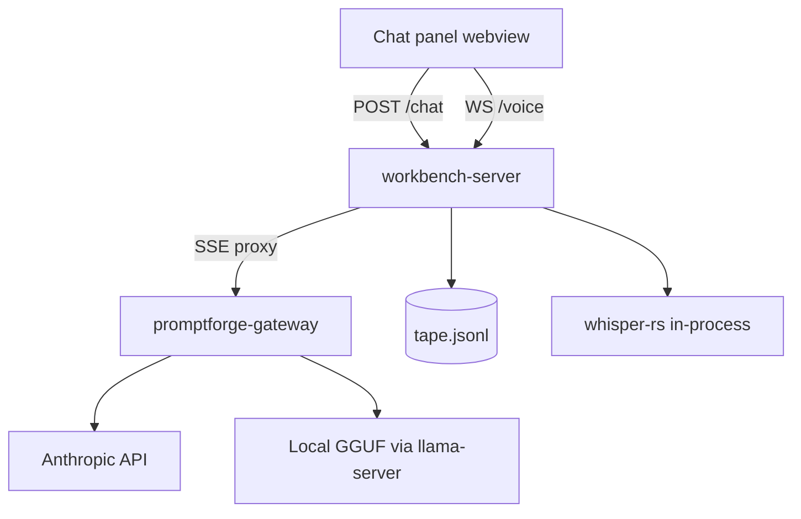

# Stage 1: The Window

Build the first deliverable of the PromptForge Workbench per the design notes at `c:\Users\Vinnie\.cursor\plans\promptforge_workbench_notes_8491f808.plan.md` (read its "Running this plan" section first; it governs). Stage 1 is defined there as: server crate plus shell crate plus a chat panel - streaming conversation with Claude through the gateway, local models too, and push-to-talk voice from day one - with a raw append-only JSONL tape recording every request and response from the first commit.

## What is being built

A local desktop app: a Rust HTTP server holding all logic, a thin native webview window displaying the UI, and a plain HTML/JS chat panel. You run the exe, a window opens, you talk to Claude or a local model through the promptforge-gateway, markdown renders, voice dictation works, and every byte lands on the tape.

The UI is dark mode and resembles Cursor: a left sidebar, the chat as the main column, the input box docked at the bottom, monospace for code, a dark neutral palette with subtle borders and one accent color. No light theme in this stage.

## Components (dependency order)

1. **promptforge-wb-server** (new member of the promptforge workspace) - axum HTTP server: serves the UI, proxies chat to the gateway, streams tokens via SSE, accepts voice audio over WebSocket, transcribes in-process via whisper-rs, writes the tape.
2. **ui/** (static assets served by the server) - index.html, app.js, style.css. Vanilla DOM plus markdown-it. No framework.
3. **promptforge-wb** (new member) - the executable. wry/tao window pointed at the server URL. WebView2 on Windows.
4. **The tape** - `tape.jsonl`, one event per line: timestamp, kind, model, request, response, latency.

## Data flow

## Rules of engagement

- **Drive to completion.** Do not stop until every step is done or an error has no forward path. A failed review, a red verify, or a hard step are not stop conditions; fix forward. Stop only when truly blocked - and say exactly what blocked you.
- Follow `tools-public/rulebooks/vibe-rulebook.md`: work in subagents, one testable commit per step, coder then review-and-fix, verify on schedule.
- Follow `tools-public/rulebooks/rust-rulebook.md` for all Rust: workspace lints, `&str`/`String` discipline, thiserror in libraries, doctests, clippy clean.
- Config: `workbench.toml` beside the binary - gateway base URL, gateway bearer key (via `${VAR}` env reference, matching promptforge convention), whisper model paths, tape path. No secrets in the file.
- When a build decision contradicts or extends the design notes, revise the notes in the same commit, naming what forced the change.
- Record every design choice made during the build in `promptforge/design/design-promptforge-wb-1.md`: each entry states the choice, the evidence, and what it cost, appended as the build proceeds. The file is created at the first decision and grows throughout the run.

## Steps

1. **Workspace scaffolding.** Add `crates/promptforge-wb-server` and `crates/promptforge-wb` to the promptforge workspace with workspace lints inherited. Server answers `GET /health` with `{"status":"serving"}`. Shell builds an empty window. Test: health endpoint returns 200 with the expected body.
2. **Gateway client and config.** Load `workbench.toml` with `${VAR}` interpolation. `GET /v1/models` proxied from the gateway. Non-streaming `POST /chat` round-trip: message in, completion out. Test: mock gateway (axum test server) returns canned catalog and completion; assert relay byte-for-byte.
3. **The tape.** JSONL writer behind a mutex; one event per chat request/response carrying timestamp, kind, model, request body, response body, latency. Test: write events, read the file back, parse every line, assert fields and ordering.
4. **SSE streaming chat.** `POST /chat` streams: the server opens the gateway's SSE stream and forwards events as they arrive. Test: mock gateway emits a multi-event SSE stream; assert the client receives all events in order.
5. **The chat UI.** Dark mode, resembling Cursor: left sidebar, chat as the main column, input box docked at the bottom, streaming markdown rendering via markdown-it, model picker populated from `GET /v1/models`. Dark neutral palette, subtle borders, one accent color, monospace for code. Test: server serves the page and assets (200s); UI verified by hand against the live gateway.
6. **Voice capture.** Push-to-talk button; getUserMedia plus AudioWorklet produces 16kHz PCM frames; frames stream up `WS /voice`; server acknowledges receipt. Test: WS round-trip with synthetic PCM frames, assert byte counts.
7. **Whisper interims.** whisper-rs linked; large-v3-turbo loaded from the configured path; sliding-window re-transcription loop emits interim transcripts down the WS as audio arrives. Test: a 16kHz fixture WAV with known speech produces a transcript containing the expected words (use whisper tiny/base in the test for speed; production config selects turbo).
8. **Pipelined final pass.** VAD-aligned segmentation of accumulated audio; large-v3 processes segments in the background, each conditioned on the previous transcript; on stop, one conditioned call for the tail; final transcript replaces the interims in the edit box. Test: fixture with two speech segments separated by silence; assert the assembled final transcript and that conditioning was applied.
9. **The shell window.** The shell crate spawns or connects to the server and opens the wry window at its address. File menu with Quit. Test: `cargo build` green; manual smoke - exe opens the window and the chat works end to end.
10. **Documentation.** README per crate (pitch, one example, config table), config example file, and the workspace README updated to list the new members.

## Notes

- The tape exists from the first chat round-trip (step 3), before the UI - capture never waits.
- Whisper models are downloaded out of band (documented in the README), never fetched at runtime in stage 1.
- No tools, no database, no block editor, no plan mode in this stage. Those are stages 2-4.
- After the final step, regenerate the design document per the Deliverable section of the design notes if any decision changed during the build.

---

## Recovered rationale

Recovered from the producing chat sessions by the plan ledger on 2026-09-04. Everything below this heading is derived annotation, not part of the original plan.

# Enrichment: Stage 1: The Window

## Why this exists

The session began with the user trying to point Cursor at a local Ollama endpoint to escape "the expensive frontier cloud services," then asking how a Cursor prompt round-trip works because "I want to replicate this functionality in my own IDE." The IDE ambition was examined and discarded the same day, in the user's words: "The whole idea of building my own IDE was fucking crazy, because first of all, I'd be duplicating everything, second of all, the risk is off the charts, third of all, I would just have like, I would have one million difficult problems that I'd have to solve in a row before I could get to the interesting thing." The surviving scope: a developer environment for PromptForge prompts, which "does one thing and it does one thing only. It doesn't generate reports, it doesn't edit your C++ program, it edits your PromptForge prompt."

The tape's rationale is the session's central thesis. The user: "the prompts themselves isn't something that you wanna edit, you wanna actually edit the plan that created the prompts... If you have the chat that created the plan that created the prompt, then you know what the human did. The human's inputs is the most valuable substance in the entire agentic workflow, and the chat captures it." And later: "we've lost the most precious human substance: the judgment, the choices, the indecisions, the mistakes." This is why the plan mandates the append-only tape from the first commit, before the UI exists. The plan's note "capture never waits" compresses this.

## Discarded alternatives

- **Full custom IDE**: discarded as above; risk and duplication.
- **VS Code / Cursor extension as the first deliverable**: considered ("I don't think I mind being locked to Cursor... 80% of that proprietary extension will be reusable webshit"), then inverted by the user into the two-crate split the plan adopts: "we could develop this as two crates. One is the web server... And then the second crate is a front end executable... so I could develop this completely standalone, make it work, make it awesome, and then when I'm ready, then integrate it into the Cursor, and then we don't have to solve the problem of the Cursor integration, and other people can use it."
- **Voice through the gateway**: rejected by the user: "can we just keep it all in the server, run the speech to text on the local video card and not involve the gateway?" On the objection that in-process whisper risks crash isolation: "I dont care about the crash isolation. If there's a bug, they can fix it."
- **Latency-first transcription**: initially the user asked for "the best: lowest latency, most accurate," then reversed: "I changed my mind. Low latency is important but it is more important to get the transcription right, early on, and so the user can see the words forming and correcting." The pipelined final pass (plan step 8) is the user's own design: "why don't we, in parallel, also run the large-v3 once we have 10 seconds worth, so that when the user stops, then on average they are only waiting for large-v3 to process 5 seconds of audio?"
- **Runtime model download in stage 1**: the user wanted the gateway to own model storage ("cache this model", "list cached models", SSE download progress), because the gateway already configures the model directory and "I don't wanna start duplicating all this code everywhere." This was deferred; the plan settles for out-of-band downloads documented in the README.

## How the stage boundaries were drawn

The user dictated the staging shape: "First stage is just a chat box with Claude. Second stage add agentic tools and the sync with file. Third stage is the earliest we add the database." He then elevated plan mode to stage 2 ("plan mode is the first deliverable... step one is talking to a model, and I think recording events. Like JSONL"), which fixed stage 1 as window + chat + voice + tape. Everything else discussed in the session - the immutable event database, branching timelines, deterministic replay, lineage, plan mode - was deliberately excluded: "No tools, no database, no block editor, no plan mode in this stage."

That exclusion was hard-won. The user personally attacked replay/caching as unsound: "this is not priced 'intermediate-large,' I would say this is priced at 'impossible'," citing model variance, fan-out ordering nondeterminism, and the need to "perfectly capture the entire state of the Lua virtual machine." He also questioned the storage substrate ("why not just use git as the storage engine... you can't 'submit a pull request' to someones promptforge db"). These unresolved questions are why stage 1's tape is a raw record, not a replay system, and why the database debate was pushed to stage 3. Two rounds of ChatGPT red-team feedback were mined for a few "cheap fixes" and then cut off: "I am getting the feeling that we are experiencing the classic generic red-team 'diminishing returns' from ChatGPT... I feel like we are going in the weeds now."

## Plan mechanics and naming

- The crate prefix `promptforge-wb-` is the user's abbreviation, chosen over `promptforge-workbench-` and `promptforge-web-shell`.
- A standalone copy of the plan was deleted by the user: "it can never be a first-class plan and then we would just be maintaining the same thing twice for no benefit. only the first class plan matters."
- The "Drive to completion" rule is verbatim user instruction: "when this plan runs DO NOT STOP until it is done or there is an error you cannot get past."
- The running design-decision log (`design-promptforge-wb-1.md`) and the rule to revise the design notes in the same commit as any contradicting build decision were both explicit user requests, as were the dark Cursor-like UI and the vibe/rust rulebooks.

## After the run (context for later plans)

Stage 1 was declared done by the user: "it's done. We have that... it works, the microphone works, it's beautiful." During and after the run he reversed two things this plan specifies, both belonging to follow-up work: config moved from env vars to a user-directory TOML with defaults ("can you imagine if you install Photoshop.exe and you have to set some env vars first in order to run it? no way"), and SSE-plus-vanilla-JS was later questioned in favor of two WebSocket connections and a murm-ui/dockview/TypeScript UI. The plan file still reflects the original SSE and vanilla-DOM choices.
