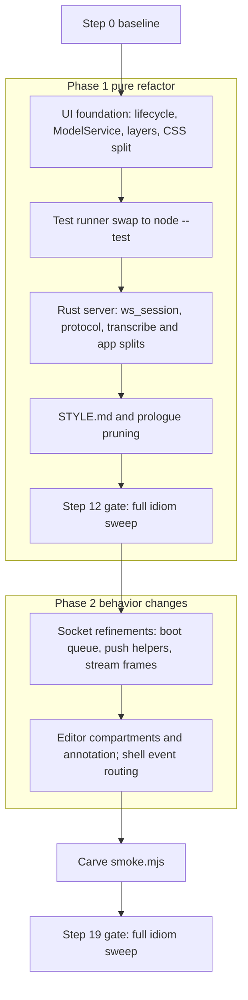

# Workshop Crates Idiom Refactor

## What we are building (level 1)

Restructure `crates/promptforge-ws-server` (Rust server + embedded TS UI) and `crates/promptforge-ws` (tao/wry shell) in the repo `c:\Users\Vinnie\cursor\promptforge` so they follow the idioms prescribed by the report "Human Code Organization vs PromptForge Workshop: What to Steal" (2026-08-26, in-repo at [design/compare-ui-stack-human-idioms.md](c:\Users\Vinnie\cursor\promptforge\design\compare-ui-stack-human-idioms.md); currently untracked - step 0 commits it). Phase 1 is pure structure: files move, code is extracted, wire behavior and rendered output stay identical, and every existing test passes. Phase 2 adds the report's behavior changes (Findings 7-9), each with new tests. The result is committed one green step at a time on `master`.

## Binding references

The executor loads these before work and treats them as the spec, in this precedence order:

1. This plan, then [promptforge/AGENTS.md](c:\Users\Vinnie\cursor\promptforge\AGENTS.md) ("do more with less" outranks tidiness; every public item gets `///` docs; update README when public surface changes; say in the commit which existing facility was considered when adding machinery).
2. The idiom report above (in-repo at `design/compare-ui-stack-human-idioms.md`) - its findings, refactor notes, and guardrails.
3. [tools-public/rulebooks/vibe-rulebook.md](c:\Users\Vinnie\cursor\tools-public\rulebooks\vibe-rulebook.md) - governs the execution loop.
4. [tools-public/rulebooks/rust-rulebook.md](c:\Users\Vinnie\cursor\tools-public\rulebooks\rust-rulebook.md) - governs every Rust edit.
5. [tools-public/rulebooks/html-css-rulebook.md](c:\Users\Vinnie\cursor\tools-public\rulebooks\html-css-rulebook.md) - governs the CSS split and any HTML touched.
6. [zed/docs/src/languages/typescript.md](c:\Users\Vinnie\cursor\zed\docs\src\languages\typescript.md) - TS tooling guidance; it motivates the `node --test` runner choice (auto-debuggable when `@types/node` is present, Node 20+).

AGENTS.md forbids outside-repo references; the idiom report now lives in the repo, so the operator-authorized exceptions are exactly the four external guidance documents (items 3-6) plus the scratch directory named below.

## Execution contract

- Run the vibe-rulebook loop: per step, `TodoWrite` checklist (Code, Commit, Review, Amend, Verify), coder subagent, then review-and-fix subagent once, findings through `promptforge/vibe-review.md` (overwritten each cycle). Dispatch subagents by plan path + step number. Main context holds only step numbers, commit hashes, and one-line Verify results.
- Plan-local override: Verify runs after EVERY step (idiom-report mandate), not every 3rd. Verify commands, mirroring CI (`.github/workflows/ci.yml` check-workshop) exactly:
  - `cargo fmt --all --check`
  - `cargo clippy -p promptforge-ws -p promptforge-ws-server --all-targets -- -D warnings`
  - `cargo test --locked -p promptforge-ws -p promptforge-ws-server`
  - in `crates/promptforge-ws-server/ui`: `npm run typecheck` then `npm test`
- Commit each green step on `master` with a message naming the step's intent. Never push.
- NO OPERATOR QUESTIONS. This overrides vibe rule 2's ask-the-user branch: for any open choice, decide, record the decision and its falsifier in this plan file, and continue. Never emit AskQuestion or pause for confirmation.
- Stop-and-re-plan condition: if a step's tests fail twice, do not push through - revise this plan autonomously (fix the step, reorder, or abandon it with a recorded reason), roll back to the last green commit if needed, and continue with the remaining independent steps. Halt entirely only when no forward path exists at all.
- Verify logs and the baseline record are scratch; write them under `cabinet/_scratch/vibe-workshop-refactor/`. Main never reads log bodies.

## Guardrails

- Vendored boundary: `ui/src/chat/` (murm-ui 0.2.0 + nested highlighter) is opaque. No layer rule, CSS split, restructuring, or reformatting inside it. The murm plugin seam stays as is.
- Do-not-touch: `crates/promptforge-ws/src/file_drop.rs` (dense working COM, documented; this is the report's `drop_target.rs` guardrail - the OLE target was replaced by the WebView2 bridge in commit `cf514dd`).
- Wire protocol semantics are frozen in phase 1: move and type the frames, do not redesign them. JSON shapes stay identical (same field names and values).
- Phase 1 done-criterion for every step: all existing tests pass with their assertions unchanged. Sanctioned mechanical edits inside `ui/test/*.mjs`: retargeting file and import paths (e.g. `titlebar-style.mjs` reading a moved CSS file), and adjusting construction setup where a refactor changes a constructor signature (e.g. handing `AgentController` its `ModelService` in step 2, or Disposable wiring in step 4). Assertions and expected behaviors never change in phase 1; if a step seems to require an assertion change, the step is wrong - invoke the re-plan rule.
- `smoke.mjs` stays green and intact until the final step, then gets carved (shrunk, not deleted).
- Test-runner swap changes discovery only; no test is rewritten or deleted while other refactor steps are in flight.

## Components in dependency order (level 2)

Rust server steps (7-10) are independent of UI steps (1-6); if a UI step gets stuck, the executor may reorder Rust steps ahead while re-planning, provided the data-flow edges hold: 1 before 4 and 6; 3 before 8 (protocol.ts must exist for the cross-cite); 8 before 14 and 15; 6 before 18; 11 before 12. Serial execution otherwise - every commit must leave the repo green. Neither phase gate (steps 12 and 19) may be reordered or skipped: phase 2 does not start until the phase 1 sweep is clean, and the run does not end until the phase 2 sweep is clean.

## Steps (level 4) - each is one commit carrying code, test, and docs

### Phase 0

**Step 0 - Baseline.** Read AGENTS.md and ci.yml. Commit the untracked idiom report `design/compare-ui-stack-human-idioms.md` as the run's first commit (message: it is the spec this refactor executes). Then record `git rev-parse HEAD` (the baseline hash the step 12 gate diffs from) and `git status` (any other dirty file is noted and treated as out of scope). In `ui/`: `npm ci` if needed; record `node --version`. Run all Verify commands; write results, the exact command set, and the hashes to `cabinet/_scratch/vibe-workshop-refactor/baseline.md`. Any pre-existing failure is recorded as the floor, not a regression.

### Phase 1 - pure refactor (Findings 1-6, 10)

**Step 1 - `base/lifecycle.ts` + `base/event.ts`** (Findings 3, 2). Create `ui/src/base/` in its final location. `lifecycle.ts` (~60 lines): `IDisposable`, `DisposableStore`, `Disposable` base with `_register`. `event.ts`: a minimal `Emitter<T>` with `event` subscribe returning an `IDisposable`. Colocated tests (`ui/test/` for now; colocation lands with the runner swap).

**Step 2 - `services/model-service.ts`** (Finding 2). Create `ui/src/services/`. `ModelService` owns the data behind `main.ts`'s module-level `modelCatalog` and `currentModel`, exposes `onDidChangeModels`/`onDidChangeCurrent` via the Emitter. Instantiate once in `main.ts` (composition root); hand it to `AgentController` (`ui/src/workshop/agent-controller.ts`) and the menu code (`ui/src/window-menu.ts`) through constructors. Delete the module globals. New colocated test; `agent-controller.mjs`, `window-menu.mjs`, `smoke.mjs` pass unchanged.

**Step 3 - Layer move + import rule** (Finding 1). Move workshop-owned files into `ui/src/base/`, `ui/src/services/`, `ui/src/ui/`; `main.ts` stays at `ui/src/main.ts` as composition root (build entry unchanged in `build.mjs`/`build.rs`). Assignment:
- `base/`: `memory-storage.ts` (plus step 1 files). Generic, DOM-free, app-agnostic.
- `services/`: `workshop-socket.ts`, `workshop-provider.ts`, `workshop/workspace-api.ts`, `workshop/layout-persistence.ts`, new `protocol.ts` (pure message types extracted from `workshop-socket.ts`: `StatusFrame`, `CatalogModel`, `ModelsFrame`, `ChatPayload`, ...), `model-service.ts`.
- `ui/`: `window-chrome.ts`, `window-menu.ts`, `about-dialog.ts`, `status-bar.ts`, `workspace-drops.ts`, `voice.ts` (touches audio + panel DOM), and `workshop/` panel files (`agent-controller.ts`, `chat-panel.ts`, `editor-dialog.ts`, `editor-panel.ts`, `editor-surface.ts`, `panel-types.ts`, `shortcuts.ts`, `workshop-panel.ts`, `zones.ts`) as `ui/src/ui/workshop/`.
- Edge cases classified by the rule itself: DOM-touching goes to `ui/`, app-aware but DOM-free goes to `services/`.
- Import rule: `ui` may import `services` may import `base`, never the reverse; `chat/` is importable as an opaque dependency from `services` and `ui`, never from `base`. `main.ts` is the composition root: it may import every layer and `chat/`, and nothing may import `main.ts`.
- Enforcement, at build time on both build paths, with the rule expressed once: `ui/check-layers.mjs` (dependency-free - it must import nothing from `node_modules` so it also runs under the `npx` fallback) exports `checkImport(importer, resolved)` and doubles as a standalone walk when run directly. Wire it three ways: (a) `build.mjs` adds an esbuild `onResolve` plugin (~15 lines) wrapping `checkImport`, so `esbuild.build` and watch mode fail on a violation; (b) `build.rs` spawns `node check-layers.mjs` before the bundle step in its existing Command pattern, so a violation fails `cargo build` (the CLI invocation cannot load plugins, hence the spawned walk); (c) `"typecheck": "tsc --noEmit && node check-layers.mjs"` keeps the fast CI signal. Mechanical path retargets in `ui/test/*.mjs` permitted.

**Step 4 - Disposable adoption** (Finding 3). Every workshop-owned panel, plugin, and binding routes listeners, emitters, and children through `_register`: `EditorPanel`, `CodeMirrorSurface`, `PermanentTab`, `StatusBar` bindings, zones, voice plugin, socket handler wiring in `main.ts`. Teardown becomes one `dispose()` up the tree. Existing tests unchanged.

**Step 5 - CSS split** (Finding 5, html-css-rulebook). Split `ui/style.css` (865 lines) into per-component files colocated with and imported by their owning TS modules, bundled by esbuild into `dist/app.css`: `window-chrome.css`, `window-menu.css`, `about-dialog.css`, `status-bar.css` (REC badge, progress, LED), `workshop/zones.css` (dock, tree), `workshop/editor-panel.css` (editor + dialogs), `voice.css` (mic, send-button overrides). `style.css` keeps only resets, `:root` design tokens, the `--mur-*` bridge, and scrollbars; it is still copied by `build.rs`/`build.mjs` and linked from `index.html`, so the serving contract holds. Preserve cascade order: TS import order mirrors the old file order wherever selectors overlap. Rendered output identical; `titlebar-style.mjs` retargeted mechanically.

**Step 6 - Runner swap** (Finding 6). Replace the 14-command `&&` chain in `ui/package.json` with glob discovery via the bare Node runner: `"test": "node --test test/"` (plus `"src/**/*.test.mjs"` glob once colocated tests exist, if local Node supports glob args per the step 0 record). Add `@types/node` devDependency and an `engines` field matching the baseline Node (CI uses Node 22). All 14 existing files in `ui/test/` are discovered as-is; none rewritten. Add `ui/test/helpers/leak-check.mjs`: a shared setup helper that fails a test leaking undisposed `DisposableStore`s (used by new tests from here on). Note the runner's `**/test/**` pattern discovers helper files too, so any file under `test/helpers/` must exit 0 when executed directly (export-only modules do). If parallel per-file execution flakes, pin `--test-concurrency=1` and record it.

**Step 7 - Rust: extract `ws_session.rs`** (Finding 4). New `src/ws_session.rs` in promptforge-ws-server owning the literal duplication between `chat_ws.rs` (lines ~51-74) and `voice.rs` (~43-56, 387-394): the `NEXT_SESSION` AtomicU64 counter, the mpsc(32) outbox + writer task spawn, and the drop/abort close choreography, behind one small struct. Both call sites adopt it; `chat_ws` keeps its forwarder task, `voice` keeps its interim loop. Module `//!` doc, `///` on public items, unit tests in-file. Existing 12 + 9 socket tests unchanged.

**Step 8 - Rust: pure `protocol.rs`** (Finding 4, Weylus pattern). New `src/protocol.rs`, zero I/O, grouped by direction (inbound/outbound). Move: `StatusBarUpdate`, `Progress`, `Severity`, `Activity`, `StatusFrame` (from `status.rs`; the bus stays), `CatalogPush`, `CatalogFrame` (from `catalog.rs`), `ChatRequest` (from `gateway.rs`). Add typed serde structs for the frames currently built with `serde_json::json!`: chat outbound `delta`/`reasoning`/`done`/`error` (with optional echoed `id`), voice outbound `interim`/`final`, voice inbound `start`/`stop` text constants. JSON shapes byte-compatible - move types, do not redesign. Cross-cite `ui/src/services/protocol.ts` and `src/protocol.rs` in each other's header comments as the two halves of the contract. Serialization round-trip tests pin the exact shapes.

**Step 9 - Rust: split `transcribe.rs`** (Finding 4, seams documented in the report). `src/transcribe.rs` becomes the facade (constants, `rms`/`is_silence`/`tail`, GPU gate, re-exports) with children `src/transcribe/engine.rs` (`VoiceEngine`), `slot.rs` (`VoiceSlot`), `worker.rs` (`Job`, `Transcriber`, `worker_loop`, `load_state`, `transcribe_blocking`), `prompt.rs` (`tail_chars` ... `final_prompt`), `final_pass.rs` (`FinalPass`, `FinalJob`, `FinalTranscriber`, `final_worker_loop`), `error.rs` (`TranscribeError`). Inline tests move with their code. Tests pin behavior; if coupling resists a seam, keep that seam unsplit and record why.

**Step 10 - Rust: split `app.rs` by role** (Finding 4). Extract from `app.rs` (1143 lines): `src/assets.rs` (the `UiAssets` rust-embed type + `ui_*` asset handlers) and `src/relay.rs` (gateway relay helpers `relay`, `bad_request`, `gateway_unreachable`, `tape_round_trip`, `value_from_bytes` + the `/chat` and `/v1/models` handlers). `app.rs` keeps `AppState`, `AppError`, router wiring, startup/degrade. Tests move with their code. `gateway.rs`, `provision.rs`, `workspace.rs` are not in scope (the report does not flag them).

**Step 11 - STYLE.md + prologue pruning** (Findings 10, 9b, 9c). New `promptforge/STYLE.md`: SilverBullet's comment policy (comments only for non-obvious why, invisible constraint, external-bug workaround, subtle ordering), SiYuan's issue-URL convention for workarounds, the two-zone error policy (panic on construction, never in steady state), the UI layer import rule, the vendored boundary, and the UI test conventions. Add one pointer line in AGENTS.md. Sweep `window.rs` workarounds for upstream issue URLs. Prune narration-only file prologues in both crates (keep the domain-documenting module docs; this is a pruning rule, not a purge). Full Verify, then the phase 1 gate (step 12).

### Phase 1 gate

**Step 12 - Full idiom sweep (phase 1)** (operator mandate). Dispatch one dedicated sweep subagent - it replaces the coder + review-and-fix pair for this step - that audits everything phase 1 governs: `crates/promptforge-ws-server/src/`, `crates/promptforge-ws/src/`, `ui/src/` (excluding `ui/src/chat/`), `ui/test/`, `ui/style.css` and the colocated CSS files, `ui/package.json`, `ui/index.html`, `STYLE.md`. Checklist:

- Finding 1: `check-layers.mjs` clean; every workshop file sits in its layer; no reverse imports; the rule is wired at all three points (esbuild plugin in `build.mjs`, spawned check in `build.rs`, `typecheck` script).
- Finding 2: no module-level mutable shared state in workshop TS; shared state lives in services passed through constructors.
- Finding 3: every workshop panel, plugin, listener, and emitter routed through `Disposable`/`_register`; no ad hoc cleanup left.
- Finding 4: `ws_session.rs` used by both sockets; `protocol.rs` pure (zero I/O) and the only definition site for wire shapes; no `json!` frame construction left in `chat_ws.rs`/`voice.rs`; split modules named by role, not size.
- Finding 5: nothing in `style.css` beyond resets, tokens, the `--mur-*` bridge, and scrollbars; every component CSS file imported by its owning TS module.
- Finding 6: no hand-ordered test chain anywhere; discovery by glob only; `smoke.mjs` still intact (carving is step 18).
- Finding 10 / STYLE.md: comment policy holds on workshop-owned files; no narration-only prologues.
- Rulebooks: apply the rust-rulebook "Detect in existing code" lists and the html-css-rulebook corrections across the workshop-owned phase 1 diff.
- Guardrails intact: `git diff <baseline-hash>..HEAD` (hash from step 0's baseline.md) is empty for `ui/src/chat/` and `crates/promptforge-ws/src/file_drop.rs`; wire JSON shapes unchanged (protocol round-trip tests prove it).

Deviation handling: fix every deviation that lacks a recorded exception. Recorded exceptions are exactly: this plan's guardrails, the decision log, per-step decisions recorded during execution, and inline documented suppressions with a stated reason (`#[expect(..., reason = "...")]` style). Exempted deviations are listed, not touched. The sweep subagent may fan out parallel read-only audit subagents (e.g. Rust surface and UI surface separately), but all fixes are applied by the one sweep subagent so the diff has a single author. It writes the full report (finding, location, fix or exemption) to `cabinet/_scratch/vibe-workshop-refactor/sweep-phase1.md` and returns only counts (found / fixed / exempted) plus files changed. Then full Verify; commit all fixes as one conformance commit (no commit when zero fixes), and record the end-of-phase-1 hash in baseline.md for step 19's diff range. The tests-fail-twice re-plan rule applies to sweep fixes too. Phase 2 does not start until this gate is clean.

### Phase 2 - behavior changes (Findings 7-9), each with new tests

**Step 13 - Boot queue in `WorkshopSocket`** (Finding 7). Queue status/models pushes that arrive before the app is ready; flush after init. New colocated test: push before ready is delivered after. Opportunistic only if this touches the reconnect path: adopt SilverBullet's capped-backoff pieces; otherwise leave backoff alone (it works today) and record the decision.

**Step 14 - Intent-named push helpers in Rust** (Finding 7). A `Push` struct wrapping the status/catalog broadcast buses with intent-named methods (SiYuan's `PushReloadFiletree` style), so business code never constructs frames. Adopt at all call sites; frames come from `protocol.rs`. Tests.

**Step 15 - Voice stream delimiting** (Finding 7, Weylus pattern). The `/voice` socket announces each new stream generation with an explicit JSON control frame before binary PCM flows; client tracks the generation and discards stale frames. Additive protocol change, documented in `protocol.rs` and `protocol.ts`. Tests on both sides.

**Step 16 - Editor idioms** (Finding 8). In `editor-surface.ts`/`editor-panel.ts`: CodeMirror compartments stored on the surface object for everything runtime-reconfigurable (the readOnly-during-take toggle first), and an `externalUpdate` `Annotation` tagging transactions that originate from the server (workspace file loads), so future autosave logic distinguishes remote edits from local typing. Tests.

**Step 17 - Shell event routing** (Finding 9). In `crates/promptforge-ws/src/window.rs`: route deferred side effects through `ShellEvent` (e.g. the open-external navigation effect); the synchronous decision callbacks (navigation allow/deny, permission) cannot defer through the proxy - keep them inline with a comment saying exactly that. `file_drop.rs` untouched. Tests where observable.

**Step 18 - Carve `smoke.mjs`** (Finding 6, last build step). Extract per-feature slices of the 1040-line `smoke.mjs` into colocated, plain-English-named tests under the runner; shrink smoke to a minimal end-to-end core (boot, one chat round-trip, one voice take). Wire the disposable-leak check into shared setup. Done when every extracted behavior has a named test and the suite is green. Full Verify, then the phase 2 gate (step 19).

### Phase 2 gate

**Step 19 - Full idiom sweep (phase 2)** (operator mandate; final step of the plan). Same subagent mechanics, deviation handling, exception rules, and commit rules as step 12; report goes to `cabinet/_scratch/vibe-workshop-refactor/sweep-phase2.md`. The audit re-runs the entire step 12 checklist (no phase 1 idiom may have regressed under phase 2 work) and extends it with phase 2 conformance:

- Finding 7: boot queue present and tested; every push goes through the intent-named `Push` helpers, with no frame construction at business call sites; voice stream generations delimited by control frames, tested on both sides; the additions documented in `protocol.rs` and `protocol.ts`.
- Finding 8: runtime-reconfigurables sit behind compartments stored on the surface object; server-originated transactions carry the `externalUpdate` annotation; both tested.
- Finding 9: no deferrable side effect left inline in wry callbacks; the two synchronous decision callbacks (navigation allow/deny, permission) carry the comment explaining why they stay inline; platform workarounds in `window.rs` carry upstream issue URLs.
- Finding 6 completion: `smoke.mjs` carved with coverage preserved (every extracted behavior has a named test); the leak check runs in shared setup.

After the sweep's fixes land: one last full Verify. The run ends only when this gate is clean or the stop-and-re-plan rule has recorded why it cannot be.

## Decision log (decisions already made; falsifiers make them recoverable)

- Test runner is bare `node --test` (zero deps - "do more with less"; Zed/vscode-js-debug auto-detect it). Falsifier: a need the runner cannot express, or unfixable parallel flake, triggers a vitest revisit.
- Layer rule enforced at build time by a dependency-free script, not eslint: one rule module (`check-layers.mjs`) consumed by an esbuild `onResolve` plugin in `build.mjs` (covers build and watch), a spawned check in `build.rs` (fails `cargo build`; the esbuild CLI path cannot load plugins), and the `typecheck` script. Rejected: TS project references (typecheck-only, three tsconfigs of ceremony) and eslint-plugin-boundaries (new dependency tree, still not build-time). Falsifier: the rule needs AST precision a resolver-walk cannot give.
- Protocol contract is twin annotated files (`protocol.rs` and `protocol.ts`) cross-citing each other; no codegen. Falsifier: the first observed drift bug between them buys the generator.
- Commits go directly on `master` (house pattern; every commit is green), never pushed by the executor.
- Verify uses CI-parity flags, not `--all-features` (the `cuda` feature makes `--all-features` toolchain-dependent).
- STYLE.md lives at repo root with a workshop section.
- Phase 2 is included: "total refactor" plus the report's own execution order covers Findings 7-9 after the pure refactor lands.
- Two conformance gates (steps 12 and 19) added by operator instruction on 2026-08-26: after each phase, a dedicated subagent sweeps the whole workshop-owned surface for idiom adherence and fixes every deviation lacking a recorded exception. Gates cannot be skipped or reordered.
- Step 3 execution (2026-08-26): `memory-storage.ts` lands in `services/`, not `base/` as the assignment table said - it implements chat's `ChatStorage` and imports `chat/core/types`, and the layer rule forbids `base` -> `chat`; the plan's own edge-case classifier (app-aware but DOM-free -> `services/`) governs. Falsifier: a rewrite that drops the chat types would re-qualify it for `base/`.
- Step 3 execution (2026-08-26): `layout-persistence.ts` lands in `ui/workshop/`, not `services/` as the table said - it drives `DockviewApi` and imports the zone registry (`zones.ts`, ui layer), and the layer rule forbids `services` -> `ui`; same edge-case classifier (DOM-coupled -> `ui/`). Falsifier: splitting a DOM-free zone-state serializer out of `zones.ts` would let persistence move to `services/`.
- Step 6 execution (2026-08-26): the test script is `node --test "test/**/*.mjs" "src/**/*.test.mjs"` - an explicit glob, not the planned directory argument `test/`. On Windows Node v24.19.0, `node --test test/` (with or without the slash) fails with MODULE_NOT_FOUND: the runner executes the directory path as an entry point instead of searching it. The glob form discovers all 20 files (18 pre-existing + helpers/leak-check.mjs + leak-check.mjs) and the matchless colocated glob `src/**/*.test.mjs` is tolerated (exit 0), so both args stay. Parallel discovery ran clean three consecutive times (~5s wall), so no `--test-concurrency=1`. Falsifiers: a Node release where the directory form searches correctly on Windows allows reverting to `test/`; the first parallel flake (port clash, shared tmp collision) buys `--test-concurrency=1`.
- Step 7 execution (2026-08-26): `ws_session.rs` uses one shared session-id counter for `/ws` and `/voice`, replacing the two per-file counters. Session ids feed tracing only; no test pins concrete ids, so per-endpoint id sequences are not load-bearing and the dedup wins. Falsifier: a test or log consumer asserting per-endpoint id sequences buys a counter seam (one counter per call site).
- Step 12 execution (2026-08-27): the phase-1 sweep leaves three module-scope state sites in place as recorded exceptions rather than sweep fixes: the zone registry's `dock`/`zoneGroups`/`zoneOverrides` (`ui/src/ui/workshop/zones.ts`), the tree panel's session caches (`ui/src/ui/workshop/workshop-panel.ts`, inline-documented: state must outlive the dockview-churned panel instance), and the lifecycle tracker seam (`ui/src/base/lifecycle.ts`, inline-documented test-only seam that the DisposableStore constructor itself consults, so constructor injection is impossible). The zone registry state predates phase 1 (step 3 moved the file, it did not rewrite it), is module-private behind the exported API, and a ZoneRegistry service conversion would rewrite ~74 call sites across three frozen test files (workshop-zones, workshop-layout, agent-controller) plus the dockview component-factory wiring - beyond the sweep's minimal-and-behavior-preserving mandate and colliding with the frozen-assertion guardrail. Related: `WorkshopTreePanel` stays a non-Disposable renderer - step 4's adoption list deliberately omitted it, and it owns no listener, timer, or emitter that outlives its element. Falsifier: phase 2 work that touches zone placement, or the first cross-panel state bug traced to the registry or tree caches, buys the service conversion as its own green step with the sanctioned test retargets.
- Step 9 execution (2026-08-26): all six seams split; none resisted. Prompt-budget constants (`MAX_PROMPT_CHARS`, `MAX_PROMPT_TOKENS`, `GLOSSARY_TOKEN_BUDGET`) stay private in the facade - child modules read a parent's private items, so no widening was needed. Cross-file widenings are `pub(super)` only: `Transcriber::{load, transcribe}`, `FinalTranscriber::{load, reset, submit, finish}`, `load_state`, `transcribe_blocking`, `sanitize_prompt`, `fit_glossary`, `final_prompt`. `glossary_prompt` keeps its pre-split `pub(crate)`. Test placement judgment: `final_submit_reports_the_segment_on_the_take_channel` and `final_finish_with_a_silent_tail_returns_empty_after_draining` drive `VoiceEngine` but assert the final worker's channel and FIFO-drain semantics, so they live in `final_pass.rs` (dominant child), not `engine.rs`. The `fixtures` module stays in the facade (shared by engine/prompt/final_pass tests plus voice.rs, app.rs, provision.rs). One mechanical doc retarget: the facade module doc's `FinalTranscriber` intra-doc link now points at `final_pass::FinalTranscriber` (broken_intra_doc_links is denied). Falsifier: a caller outside the transcribe tree needing a `pub(super)` item buys a `pub(crate)` widening.

- Step 14 execution (2026-08-27): the push facade is a new `src/push.rs` `Push` struct wrapping both buses, not methods on the bus owners - heartbeat otherwise threads two handles (status + catalog) through every signature, and the buses stay pure transport (`subscribe`, the ring) for the `/ws` forwarder while `Push` is the only production send path. Method set derived from what call sites do today: `push_status_update` (info), `push_failure` (error), `push_activity` (debug LED pulse), `push_progress` (takes raw current/total, moving the one business-side `Progress {}` construction into the facade), `push_idle`, `push_models_catalog`. `Push` delegates to the bus owners' send helpers, so `StatusBarUpdate`/`CatalogPush` construction stays inside the push machinery (status.rs/catalog.rs), where the frozen bus tests keep consuming it directly. Signature migrations: `heartbeat::spawn` and `provision::spawn` take a `Push` (the separate catalog argument folds in), `AppState` gains `push()`; adjustments to existing tests are construction-setup only (`Push::new(...)` wrapping at spawn/`startup_engine` call sites), assertions unchanged. Falsifier: a producer that must reach one bus but provably not the other (e.g. a sandboxed plugin allowed status but not catalog pushes) buys splitting the facade per bus.
- Step 16 execution (2026-08-27): three decisions. (1) The surface gains `setReadOnly(readOnly)` on the `EditorSurface` contract, backed by a `readOnly` Compartment pairing `EditorState.readOnly` with `EditorView.editable`; voice.ts keeps toggling `input.readOnly` on the chat input textarea - that is an HTML property on the chat UI's input element, not an editor-surface reconfiguration, so no voice wiring changes. Falsifier: voice dictation targeting the editor surface buys wiring `setReadOnly` into the take lifecycle. (2) No theme compartment: the theme is never reconfigured at runtime and speculative compartments are forbidden; the pre-existing `language` compartment already satisfies the idiom for lazy modes. Falsifier: a runtime theme-switch feature buys its compartment. (3) `externalUpdate` lives in editor-surface.ts (the annotation is a CM type and nothing else imports @codemirror/*), exported with an `isExternalUpdate(tr)` helper; the tagged dispatch site is inside `open()`, which now applies a full-document replace transaction when a view is already live (a first open creates the state, so no transaction exists to tag) instead of destroying and rebuilding the view - reloads preserve compartments and history and are distinguishable from typing. EditorPanel's load/reload sites are unchanged; they reach the dispatch through `surface.open()`. Falsifier: a consumer needing per-document history isolation on reload buys back the rebuild path.
- Step 13 execution (2026-08-27): readiness is an explicit `WorkshopSocket.ready()` call, not first-subscription - main.ts attaches `onStatus` early (status bar, before panels) and `onModels` last, so first-subscription semantics would flush status pushes before the app is wired; main.ts calls `ready()` once, after the `onModels` subscription. The boot queue is one array holding both push kinds so replay preserves interleaved arrival order, bounded at `BOOT_QUEUE_CAP = 32` with drop-oldest overflow (a newer status/catalog push supersedes an older one); disposal clears it, and (review fix, same day) so does a connection drop - pushes queued from a dead connection must not replay after the onDisconnect reset. Chat reply frames are never queued (they answer a `streamChat` call, which implies a running app). Backoff untouched: the change does not enter the reconnect path, and `scheduleReconnect` already is capped exponential backoff (1 s doubling to 30 s), so there is nothing to adopt. Sanctioned setup adjustment: `test/disposable-adoption.mjs` calls `socket.ready()` after wiring its handlers; assertions unchanged. Falsifier: a push kind that must not be superseded (e.g. a one-shot grant notice) buys per-kind queue policy.
- Step 18 execution (2026-08-27): the shared boot fixture (`test/helpers/boot.mjs`) reaches the disposable-tracker seam by appending one export to the dist/app.js text in memory and importing the result as a data URL - dist/app.js exports nothing (main.ts is an entry point) and esbuild tree-shakes the unused `setDisposableTracker` export away, so the seam is otherwise unreachable from outside the bundle. Judged against the idiom report's SilverBullet "post-build bundle string-patching" mess and found not to cross that line: the mess is mutating shipped build output, while this variant never writes disk bytes, is append-only (the genuine bundle bytes execute unmodified, so the residual smoke's end-to-end claim stays honest), is test-only, and fails loudly with a named remedy when the seam regex misses. The less invasive alternative - exporting the tracker from the source entry, gated for tests - was rejected because step 18 permits no production code changes. Falsifier: an esbuild upgrade changing the `?.trackCreated(this)` emit shape breaks the seam regex (the thrown error says to retune it); a second such break buys the gated source-entry export in a step of its own.

- Each step's inputs come from earlier steps: 1 feeds 2/4/6/18 (lifecycle, emitter); 2-3 create `base/`/`services/` in final locations so files move once (report's merge advice); 8 feeds 14/15 (typed frames); 6 feeds 18 (runner); 3 feeds 8 (protocol.ts exists to cross-cite); 11 (STYLE.md) feeds the gates' comment-policy check.
- No step is open to two readings: files, symbols, and line seams are named from the profiling of 2026-08-26.
- Steps 7-10 (Rust) and 1-6 (UI) are independent chains; serial execution is chosen because every commit must keep the repo green, but re-planning may interleave them. The gates (12, 19) are fixed points that interleaving may not cross.
- Step sizing: each step is coverable by one test surface (existing suite for phase-1 moves, one new named test for each phase-2 behavior, the sweep checklist for the gates).

---

## Recovered rationale

Recovered from the producing chat sessions by the plan ledger on 2026-09-04. Everything below this heading is derived annotation, not part of the original plan.

# Enrichment: workshop_idiom_refactor_2e623352 (Workshop idiom refactor)

## Origin and decisive intent

The plan was commissioned in one sentence (creator chat, 2026-08-26, verbatim): "I want a total refactor of @promptforge/crates/promptforge-ws-server @promptforge/crates/promptforge-ws using @cabinet/_output/compare-ui-stack-human-idioms.md as the guidance... When the plan runs it must not stop to ask the operator anything just barrel through. Make sure the idioms in the idiom file are followed."

The two phase gates (steps 12 and 19) exist because of a second verbatim instruction: "after phase 1 and after phase 2 I want a full sweep verification in a subagent, to check for adherance to idioms, fix any deviations which dont have required exceptions do you understand?" The gates were inserted into an already-drafted 18-step plan, which forced the renumbering to 20 steps.

The idiom report's in-repo location is also user-driven (verbatim): "I moved the idioms file into the repo itself so it can be committed in the first commit." This resolved a staging-path fragility the planner had flagged (the report originally lived in an ephemeral cabinet directory) and shrank the AGENTS.md outside-repo exception list from five files to four.

## Design thinking not spelled out in the plan

- The NO-OPERATOR-QUESTIONS clause reconciles a genuine tension (paraphrase): the idiom report mandates stop-and-re-plan after two test failures, while the user mandated never stopping. The resolution - re-plan autonomously, roll back to last green, abandon steps with recorded reasons, halt only when no forward path exists - was designed to honor the safety valve without ever pausing for input. The plan states the rule; it does not record that the rule is a reconciliation.
- Verify-after-every-step looks wasteful (~20 full cargo+npm cycles) but was deliberately accepted: `build.rs` rebuilds the UI `dist/` during cargo build, so a UI-only change ripples into the Rust asset tests. The full battery cannot be safely scoped down for UI steps. (Paraphrase of the plan-review reasoning.)
- Step granularity was chosen for rollback value over commit count: steps 1+2 and 9+10 were identified as mergeable but kept separate because the transcribe split (step 9) is the riskiest move in the plan and deserves its own revertable commit. Step 3 is deliberately the largest step because splitting it would move files twice, which the idiom report forbids.
- The plan's own pre-run review found five defects that the final plan silently embodies: the sanctioned test-edit exception was too narrow (steps 2 and 4 change constructor/setup code, so "tests pass unchanged" was self-contradictory - widened to allow mechanical setup adjustments while assertions stay frozen); step 0 originally never recorded the baseline hash the gates diff against; the reorder latitude could have run step 8 before the protocol.ts it cross-cites exists; `main.ts` had no layer classification (fixed as "composition root: may import everything, nothing imports it"); and a factual miscount of the external-file exceptions.

## Discarded alternatives

- **Layer-rule enforcement** (prompted by the user's verbatim question: "for the ui rules, is there a mechanism to enforce the layer import rules at build time?"). Rejected: TypeScript project references and eslint-plugin-boundaries (new dependencies, and neither gives true build-time enforcement without manual wiring); an esbuild-only plugin (build.rs shells out to the esbuild CLI, which cannot load JS plugins, so the cargo path would go unenforced); unifying build.rs onto `node build.mjs` (would require node_modules and break the npx fallback for fresh checkouts). Chosen: one dependency-free `check-layers.mjs` wired at three points - esbuild `onResolve` plugin in build.mjs, spawned process in build.rs, and the typecheck script. Dependency-free specifically so it runs under the npx fallback where node_modules may be absent.
- **Test runner**: vitest was the fallback, not the choice; node --test won on zero dependencies and native debuggability with @types/node present (the Zed TS doc's motivation), with concurrency pinning held in reserve.
- **zones.ts service conversion** (phase-1 sweep, run chat): the sweep considered converting the zone registry's module state into an injected service, including a lighter "thin delegate functions" variant, and rejected every variant because each either rewrites ~74 call sites across three frozen test files plus dockview factory plumbing, or merely relocates the module-level state instead of removing it. Recorded as a deferred exception with a falsifier instead.
- **ui/src/ui rename**: the doubled path was a known aesthetic trade-off, kept because the inner `ui/` name preserves the mapping to the idiom report's VS Code-derived base/services/ui layer names. A rename to e.g. `workbench/` was scoped (git mv plus check-layers.mjs rule table, imports, STYLE.md) and recommended only "if it genuinely grates" (paraphrase; confidence medium, purely aesthetic).

## Execution deviations not in the plan's decision log

- Phase-1 sweep tally (run chat c76dd3d2): 4 findings fixed, 14 exempted with recorded exceptions, 5 judged not deviations; Verify green (cargo 171/0, UI 20/20 files). The sweep fanned out two read-only audit subagents (Rust rulebook detect-lists; UI Disposable/comment-policy) while the sweep author ran the mechanical checks - the parallel-audit pattern the plan review had suggested.
- One coder subagent committed directly (a718b51) instead of following the dispatch-then-review pattern; the commit matched its step and was kept rather than reverted (paraphrase).
- Post-run footnote (run chat 59374b02): a stale `vibe-review.md` at the promptforge repo root (gitignored, predating the cabinet routing convention) surfaced three "open" findings against this plan's step 18 carve. They turned out already fixed - the reviewed commit 3d2b886 had been rewritten as ffb2506 containing all three fixes - so no commit was needed and the stale file was moved to cabinet/_trash/.
