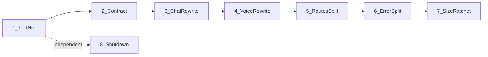

# PromptForge Workshop Server Refactor

Implements the execution order of [promptforge/design/compare-server-delivery-human-idioms.md](promptforge/design/compare-server-delivery-human-idioms.md) (Findings 1-3, 5, 6, 9), run under the vibe rulebook's Full path. Finding 4 (gateway merge) belongs to the plan already in flight; Findings 7 and 8 are excluded - user settled that nothing served is cacheable (windowed SPA, no content hashing), and `assets.rs` has explicit per-file routes with no SPA fallback, so the API-404 concern does not apply.

## Level 1 - What is being built

A structural refactor of the crate at `promptforge/crates/promptforge-ws-server`: the duplicated WebSocket session scaffolding (`ws_session.rs` outbox channel + writer task) is deleted in favor of one `select!` loop per connection with RAII cleanup; the 568-line `app.rs` splits into per-feature `routes/` constructors; `AppError` becomes an opaque wire error; `serve.rs` gains a force-exit watchdog and stopped barrier; a typed WS test harness lands first as the net. Wire protocol stays byte-identical, so `ui/` (TypeScript) should be untouched.

## Level 2 - Components in dependency order

1. **Test net** (`tests/it/` + `tests/common/`) - first, because the session rewrite changes delivery semantics and must land on characterization tests (directive 1).
2. **Delivery contract + WS session rewrite** (`protocol.rs`, `chat_ws.rs`, `voice.rs`, delete `ws_session.rs`) - the core behavior-adjacent change; depends on the net.
3. **Structure** (`routes/` split, error split, size ratchet) - moves the same files the rewrite touched, so it follows immediately (directive 6); error split rides the same seams (directive 8).
4. **Shutdown hardening** (`serve.rs`) - independent of everything (directive 9); scheduled last but may land any time if a big step stalls.

Build choice per component: sequential steps within each (each step consumes the previous step's shape); components 2 and 3 are strictly ordered; component 4 is order-free.

## Level 3/4 - Numbered steps (one commit each, code + tests)

1. **Test harness and characterization tests.** Create `tests/it/main.rs` (single integration binary per the Rust rulebook) with `tests/common/mod.rs`: a `JsonSocket`-style typed WS client over tokio-tungstenite and an in-process spawn fixture reusing `serve::spawn` / the existing `app::fixtures` helpers (export them to integration tests behind `#[cfg(debug_assertions)]` or a `test-fixtures` feature - coder's call, reversible). Characterization tests pin current chat and voice wire behavior end to end: delta/reasoning/done sequences, status and catalog pushes, interim/final voice frames, gateway-down error frame, disconnect cleanup. No session code moves in this commit.
2. **Delivery contract.** In `protocol.rs` module docs, classify every frame: durable (delivered exactly, coalesced - chat transcript deltas/reasoning/done via Notify + per-client cursor) vs ephemeral (droppable under lag, fully resent on reconnect - status bar, catalog, transcription interims via bounded broadcast). Every message type gets a line. Gate: `cargo doc` clean, characterization suite untouched and green.
3. **Chat WS rewrite.** Rewrite `chat_ws.rs` onto the Rustpad model: one task per connection, one `select!` loop owning read and write on the socket, bounded `broadcast` for status/catalog. Decision as built (step 3): durable chat frames are direct per-request replies owned by the connection's loop - no shared transcript exists to cursor - so the `select!` branch delivers them and no Notify+cursor machinery is added; falsifier: a future feature that fans one chat's frames to multiple clients would resurrect the cursor mechanism. Status/catalog buses gained latest-value retention plus a snapshot on connect, licensed by the contract's resend-on-reconnect clause. Typed serde boundary (Tabby's transport shape, but never `unwrap` on inbound frames - workspace clippy already denies it). Gateway stream and tape span wrapped in Drop guards; loop exit paths contain no cleanup calls. Delivery-semantics assertion changes in characterization tests are allowed only where the step-2 contract licenses them, stated in the commit message.
4. **Voice WS rewrite and scaffolding deletion.** Same model for `voice.rs` (PCM inbound, generation-tagged interims on the ephemeral path, engine lease as a Drop guard), then delete `ws_session.rs` outright. Success metric is negative diff in the session layer: no outbox channels, no writer tasks, no new `ws_common.rs` (directive 3). What stays shared: the typed transport boundary and Drop guards. Per root AGENTS.md, the commit names why `WsSession` could not carry the work.
5. **Router decomposition.** Split `app.rs` into `src/routes/chat.rs`, `routes/voice.rs`, `routes/workspace.rs`, `routes/assets.rs` (moving handler glue from `assets.rs`), each exporting `fn routes(state) -> Router`; `app.rs` shrinks to `AppState` + composition. Narrow state with plain `with_state` where a route group uses one service; no service-locator traits, no `Arc<RwLock<Option<...>>>` slots (directive 7). Pure structure: tests move but assertions do not change.
6. **Error split.** `AppError` becomes the opaque wire error: every variant maps to exactly one status code, central `IntoResponse`, no `#[from]` across the wire boundary (explicit conversions at the seams cut in step 5), internals leaked only in debug builds. `SpawnError`/`ConfigError` stay rich with `#[from]`. Follows the Rust rulebook's thiserror and message-style rules.
7. **Size ratchet.** Record the line count of every `src/` module in a checked-in ceilings file; add a test in `tests/it` that fails when any module exceeds its ceiling plus slack (OpenObserve's ratchet, directive 6 - "not optional" for AI-authored code).
8. **Shutdown hardening.** In `serve.rs`: force-exit watchdog (second signal or 5-10s timeout after graceful shutdown begins, since held WebSockets block axum's graceful shutdown forever) and a stopped barrier completing the spawn contract (readiness mpsc + shutdown oneshot + stopped barrier + thread join). Roughly 40 lines plus tests. Honors root AGENTS.md: no `process::exit` on the library path - the watchdog lives in the binary/serve shell.

## Execution mechanics (vibe rulebook, Full path)

- Per step: Coder subagent -> commit -> Review-and-Fix subagent -> amend if dirtied -> Verify on schedule (every 3rd step, end of each component, final step). Ledger in `vibe-ledger.md`, findings in `vibe-review.md`, one fix round, Critical findings block, two consecutive failures on a step stops the run for a re-plan.
- Rules manifest for every Coder/Review dispatch (paths only): `promptforge/AGENTS.md` + `promptforge/crates/promptforge-ws-server/AGENTS.md` (+ `.../ui/AGENTS.md` only if a step unexpectedly touches `ui/`). The crate AGENTS.md already encodes this design's target state.
- Rulebooks: Rust rulebook binds every step; TypeScript and HTML/CSS rulebooks bind only if `ui/` files are touched (expected: none, wire protocol is frozen).
- Verify command per step: `cargo fmt --all --check && cargo clippy -p promptforge-ws-server --all-targets -- -D warnings && cargo test --locked -p promptforge-ws-server` (matches the Windows CI job). Final step: workspace `cargo test` plus, if `ui/` was touched, `npm run typecheck && npm test` in the ui directory.
- Precondition: worktree must be clean at run start; the run never pushes.

## Plan defect pass (done once)

Each step receives what it needs: 1 produces the net 3-4 depend on; 2 produces the contract that licenses 3-4's assertion changes; 5 moves files only after 3-4 stop rewriting them; 6 uses 5's seams; 7 records counts only after 5-6 fix final module sizes; 8 is independent. No step admits two interpretations after the contract commit. Steps 3 and 4 stay sequential (both consume `protocol.rs` and the `ws_session.rs` deletion); 8 is the only parallelizable step and is cheap enough not to bother.

---

## Recovered rationale

Recovered from the producing chat sessions by the plan ledger on 2026-09-04. Everything below this heading is derived annotation, not part of the original plan.

# Enrichment: Workshop server refactor (workshop_server_refactor_88a35022)

## Why

The plan executes the execution order of the server-delivery comparison study (`promptforge/design/compare-server-delivery-human-idioms.md`). The user's framing was minimal: "plan this full refactor ... apply [the vibe, rust, html-css, typescript rulebooks]" - the deliverable was the plan itself, and execution followed only after approval ("git add commit, then run the plan"). The TypeScript and HTML/CSS rulebooks were included as guardrails only; since the wire protocol stays byte-identical, no `ui/` touch was expected and none occurred.

## Discarded alternatives and scope decisions

**Finding 7 (asset polish / immutable caching) - dropped entirely.** The design doc contradicted itself: its execution order included Finding 7 as step 5 while directive 10 limited scope to Findings 1-3, 5, 6, 9. The planner raised this as its one scope question. The user settled it verbatim: "I dont see a point to ugly content hashes in filenames, and nothing we have is cacheable its a windowed spa". The planner had first recommended keeping the two cheap non-caching fixes (API-path 404s, diagnostic missing-bundle 404), then flipped on inspection: `assets.rs` registers explicit per-file routes with no SPA catch-all, so API misses already 404 naturally and the fallback concern never applied. A further reason exclusion was cheap (paraphrase): the esbuild pipeline emits plain names (`app.js`, `app.css`) with no content hash, so the caching half would have required changing the UI build - a bigger change than the doc contemplated. The user then directed the policy be recorded, verbatim: "update @promptforge/design/compare-server-delivery-human-idioms.md and any AGENTS.md to reflect that we do not use ugly content hashes and we do not cache". That landed as commit 343ca0a before the run started.

**Finding 4 (gateway merge)** was excluded as belonging to a plan already in flight (the plan file states this).

**Finding 8** folded into the Finding 7 resolution: with explicit per-file routes and no SPA fallback, the API-404 concern does not apply.

## Design thinking behind the ordering

- Test net first because the session rewrite changes delivery semantics and must land on characterization tests. The net is external integration tests precisely because the colocated module tests were expected to move or change during the rewrite - the net had to survive it (paraphrase).
- The delivery contract was nearly folded into the harness commit; it was kept as its own doc-only commit so the rewrites' assertion changes have a licensing artifact to cite.
- Routes split and error split were weighed as one commit (directive 8 says to fold error work into the routes pass) but landed as two adjacent commits - the directive requires the same pass, not the same commit.
- Shutdown hardening is independent and was considered for an early slot (around step 2, to de-risk the run); it was scheduled last per the doc's execution order since it is cheap either way.
- Size ratchet mechanism: no xtask exists, so a test in the integration binary against a checked-in ceilings file - chosen as simple and reversible, not raised as a user question.
- Steps 3 and 4 were kept sequential (both consume `protocol.rs` and the `ws_session.rs` deletion); step 8 was the only parallelizable step and too cheap to bother.

## Deviations during execution

- **Step 3 (chat rewrite):** the plan's Notify + per-client cursor machinery was not built. As built, durable chat frames are direct per-request replies owned by the connection's loop - no shared transcript exists to cursor. The contract's mechanism note was amended and the plan file updated; falsifier recorded: a future feature fanning one chat's frames to multiple clients would resurrect the cursor mechanism. (The plan file's step 3 text already records this.)
- **Step 3 review Critical:** the always-ready gateway branch in `select!` could starve status frames past `done`; it failed live during the review's gate run and was fixed with `biased;` ordering.
- **Step 1 (from the run-chat review):** the harness reuses `serve::spawn` / `VoiceConfig` rather than exporting `app::fixtures` helpers - a sanctioned simplification, since Config/spawn were already public and no production change was needed. One Minor finding was delegated to step 3: the integration binary duplicates `#[cfg(test)]` fixture helpers (`transcribe::fixtures`, `spawn_gateway`), unavoidable without a production edit step 1 forbids; the stated fix is to gate the helpers behind a `test-fixtures` feature once a production-touching step allows it.
- **Step 8 empirical correction to the design study:** held WebSockets do not block axum's graceful drain (upgrades detach); wedged in-flight HTTP requests are the real blocker. The watchdog bounds both. Recorded in code comments and tests.
- **Environmental, not refactor-caused:** 7 promptforge-mcp-server test failures trace to the user's live promptforge-gateway.exe (pid 26072) occupying 127.0.0.1:8081, where those tests expect connection-refused; reproduced identically at the pre-run baseline. 5 whisper-fixture voice tests fail when force-run on this machine, also pre-existing (stash-verified). The final verify was re-run excluding the blocked crate rather than killing the user's running process.
