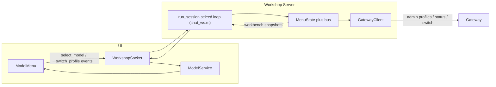

# Server-Driven Menu State

All paths are relative to the repository root `c:\Users\Vinnie\cursor\promptforge` unless prefixed otherwise.

## Execution protocol

- Execute one numbered step per commit, code and tests in the same commit, in the order listed. Steps 1-9 are each independent of everything after them and of each other; steps 10, 11, and 13 are mutually independent and may build in any order among themselves; every other step depends on the steps before it.
- Dispatch each step's coder and review subagents with these rulebook paths, instructing them to read each before working:
  - `c:\Users\Vinnie\cursor\tools-public\rulebooks\rust-rulebook.md` for any step touching `crates/`
  - `c:\Users\Vinnie\cursor\tools-public\rulebooks\typescript-rulebook.md` for any step touching `crates/promptforge-ws-server/ui/src/`
  - `c:\Users\Vinnie\cursor\tools-public\rulebooks\html-css-rulebook.md` for any step touching `.html` or `.css` files
- AGENTS.md manifest (paths only; each dispatch names the root file plus every file on the ancestor chain of the step's touched files): `AGENTS.md` (root), `crates/promptforge-ws-server/AGENTS.md`, `crates/promptforge-ws-server/ui/AGENTS.md`, `crates/promptforge-ws/AGENTS.md`. The gateway crate has no crate-level file; the root file governs it.
- The server crate's binding rules, restated from its AGENTS.md: two-zone error policy (startup fails loudly; runtime degrades, never panics), one task owns each WebSocket, every pushed frame classified in the protocol module's delivery contract, module sizes gated by `crates/promptforge-ws-server/module-ceilings.toml` (a new module needs a ceiling entry in the same commit; growth past +30 lines needs the ceiling raised in the same commit with the reason in the message).
- The UI's binding rules, restated from its AGENTS.md: one-way layer imports (`ui` -> `services` -> `base`), no module-level mutable shared state (shared state lives in a service class with a change emitter, constructed in `main.ts`), vendored code under `ui/src/chat/` is never edited - extend it only through its plugin hooks.
- Server tests are in-process only: `Router::oneshot`, the spawn fixture, and the typed JSON WebSocket client in `tests/common`. UI tests run under the existing node test harness in `ui/test/`.

## Terms

- **Workbench snapshot**: the one state frame this plan adds. Every push is complete; the UI renders it and keeps nothing else.
- **Switch stall**: today's defect - after a profile-switch click, the UI shows the old state, frozen, until the gateway's blocking call returns minutes later.
- **chat_ready**: a server-computed boolean in the workbench snapshot; true only when the model catalog is non-empty, a model is selected, no switch is in progress, and the heartbeat reports the gateway reachable.

## Current state (what exists today)

A fresh executor needs no conversation history; this section holds every fact the steps build on.

- **Product shape.** PromptForge Workshop is a desktop app: `crates/promptforge-ws` (tao/wry shell) wraps a web UI (TypeScript, bundled by esbuild from `crates/promptforge-ws-server/ui/` into `dist/`) served by `crates/promptforge-ws-server` (axum). The server relays to a separate gateway process (`crates/promptforge-gateway`), which serves an OpenAI-compatible API plus bearer-authenticated admin endpoints: `GET /admin/profiles`, `GET /admin/status`, `POST /admin/switch-profile`.
- **Profiles.** A gateway profile is a named config listing local models (llama.cpp child processes holding weights in VRAM) and remote models (Anthropic). One profile is active at a time. Switching stops the old profile's local children, loads the new config, starts the new children (the long pole: a local model takes on the order of 60 seconds to load into VRAM), then swaps the routing table atomically. The gateway does not drain: in-flight local generations die with the old children; remote ones survive. The dev setup has two profiles, `main` (remote Claude) and `qwen38` (local).
- **The implementation being replaced.** A recent commit added HTTP relay routes `GET /profiles` and `POST /profiles/switch` (handlers and six tests in [crates/promptforge-ws-server/src/relay.rs](crates/promptforge-ws-server/src/relay.rs), routes in [src/routes/chat.rs](crates/promptforge-ws-server/src/routes/chat.rs), a 300-second `SWITCH_PROFILE_TIMEOUT` in [src/gateway.rs](crates/promptforge-ws-server/src/gateway.rs)), plus UI-side `loadModels`, `loadProfiles`, `switchToProfile`, and a `profileCatalog` object in [ui/src/main.ts](crates/promptforge-ws-server/ui/src/main.ts), and a Profiles section in the Model menu (`ProfileMenuService` in [ui/src/ui/window-menu.ts](crates/promptforge-ws-server/ui/src/ui/window-menu.ts), radio rows, section hidden when fewer than 2 profiles exist). The switch is synchronous - the UI awaits the blocking HTTP call - which is the switch stall this plan removes.
- **The /ws protocol today** ([src/protocol.rs](crates/promptforge-ws-server/src/protocol.rs), [src/chat_ws.rs](crates/promptforge-ws-server/src/chat_ws.rs)). Outbound push frames: `status` (label, description, severity info/error/debug, activity general/thinking/generating, optional `progress {current,total}`) and the models catalog frame; both ride broadcast buses that retain the newest snapshot and resend it on connect. Inbound: `chat` frames with an optional `id` echoed on every reply frame (content deltas, `reasoning`, `done`, `error`). The session is one task owning the socket in a single select! loop; today it holds at most one in-flight chat and stops reading the client while it streams (the `if chat.is_none()` guard). The heartbeat ([src/heartbeat.rs](crates/promptforge-ws-server/src/heartbeat.rs)) watches gateway reachability and runs `refresh_catalog` on each down-to-up transition. `GatewayClient::list_profiles()`, `profile_status()`, and `switch_profile()` already exist in [src/gateway.rs](crates/promptforge-ws-server/src/gateway.rs).
- **UI services today.** `WorkshopSocket` ([ui/src/services/workshop-socket.ts](crates/promptforge-ws-server/ui/src/services/workshop-socket.ts)) owns the persistent socket with boot-queued emitters (e.g. `onModels`). `ModelService` holds `current` with `onDidChangeCurrent`, consumed by `AgentController` (one ChatUI per Agent tab). The status bar ([ui/src/ui/status-bar.ts](crates/promptforge-ws-server/ui/src/ui/status-bar.ts)) renders status frames; its right slot swaps between a determinate progress bar and the activity LED; `setRecording` drives a REC badge; `showLocal` paints client-originated messages. The voice plugin in [ui/src/main.ts](crates/promptforge-ws-server/ui/src/main.ts) mounts a mic button only when `voiceGpuAvailable()` reports GPU transcription, and its `isSubmitBlocked` hook currently returns `!modelService.current`. The chat composer lives in vendored code under `ui/src/chat/` - extend it only through plugin hooks.

## Decisions already settled (do not reopen)

- The server owns model selection and all menu state; the UI is a pure renderer.
- Menu clicks travel as WebSocket event frames, not HTTP calls.
- Chat streams are fully multiplexed per connection, interleaved by request id.
- The gateway's switch endpoint streams SSE stage events now (not deferred).
- Per-profile last-model memory persists to disk in `workshop-state.json`.
- Mic recording is disabled whenever `chat_ready` is false, and a live take is discarded.
- REC and the LED hide as one group when the progress bar shows.
- The gateway keeps its no-drain switch behavior; in-flight local chats fail with honest error frames.
- A failed switch gets no automated retry; the menu returns to the pre-switch state.

## Commands and environment

- Server tests: `cargo test -p promptforge-ws-server` from the repo root. Ignored whisper tests print stderr noise that can make the process exit nonzero even when every test passes; judge by the test result lines.
- UI, from `crates/promptforge-ws-server/ui/`: `npm test` (node test runner over `test/**/*.mjs`), `npm run typecheck` (tsc plus the layer checker), `npm run build` (esbuild into `dist/`, which the server serves).
- Lint gates: `cargo fmt --all --check` and `cargo clippy --all-targets --all-features -- -D warnings`.
- Desktop app: `cargo run -p promptforge-ws` for a dev run; `cargo build --release -p promptforge-ws` for release. CUDA is a default feature of the desktop crate and needs the NVIDIA CUDA toolkit installed to compile.
- A build fails with "Access is denied" while the app is running; stop `promptforge-ws.exe` first.
- Live verification needs the gateway running with the `main` and `qwen38` profiles configured and its API key available to the workshop server's config.

## Architecture

The server already pushes `status` and `models` frames over `/ws` through broadcast buses that retain their newest snapshot for connect-time resend. This plan adds a third retained bus for the workbench snapshot, and inbound event frames. The UI becomes a pure renderer: clicks send events; only pushed state changes what the menu shows.

The session loop is rewritten for full multiplexing. Today it holds one in-flight chat (`chat: Option<ActiveChat>`) and stops reading the client while that chat streams. After this plan, N chats stream concurrently, their delta frames interleave on the socket by request id, and the client socket is read at all times, so a menu event lands between two deltas instead of waiting behind a stream.

This fixes the switch stall: the instant a switch event arrives, the server publishes a snapshot with `switching` set and `chat_ready: false`, so every window renders the pending state (all Model-menu rows disabled, send and mic blocked, reason in the status bar); the gateway then streams stage events that drive the status bar's determinate progress bar; the final snapshot arrives when the gateway finishes and restores the last model used on that profile. The switch runs in a spawned task, so it never parks the inbound loop.

## Steps

### 1. Bugfix: LED stuck amber after an error frame
- Files: [crates/promptforge-ws-server/ui/src/ui/status-bar.ts](crates/promptforge-ws-server/ui/src/ui/status-bar.ts), its test file in `ui/test/` (create if absent).
- Reproduced live on "upstream connect error": a Thinking status frame pulses amber and sets `sustained = "thinking"`; when the pulse timer expires, its callback re-adds the sustained state to the lit set and clears the timer. A later non-thinking frame (the error) sets `sustained = null` but never touches the lit set or calls `applyLed()` - it relies on a pending pulse timer that no longer exists, so the amber class is orphaned indefinitely.
- Fix in `render()`: after updating `sustained`, when no pulse timer is pending, rebuild the lit set from the new sustained value and call `applyLed()`. When a timer is pending, make no extra call - its decay already lands on the new sustained state.
- Tests: thinking frame, let the pulse window expire, then an error frame with general activity - the LED returns to idle (the exact live repro).

### 2. Status bar: REC and LED hide as one group behind the progress bar
- Files: [crates/promptforge-ws-server/ui/index.html](crates/promptforge-ws-server/ui/index.html), [ui/src/ui/status-bar.ts](crates/promptforge-ws-server/ui/src/ui/status-bar.ts), [ui/src/ui/status-bar.css](crates/promptforge-ws-server/ui/src/ui/status-bar.css).
- Today only the LED lives in the swap slot; the REC badge sits beside it and stays visible when the progress bar appears. Move REC and the LED into one `.status-bar__indicators` group inside `.status-bar__right`, with the progress bar as its swap partner.
- `renderSlot` toggles the group, not the LED: progress shown hides the group; progress cleared restores it. The swap leaves REC state and LED classes untouched, so a live recording's badge reappears intact.
- CSS: move the `[hidden]` display rule from `.status-bar__led` to the group; keep the right-hand slot's fixed width so the bar text does not reflow during the swap.
- Tests: a progress frame hides the REC+LED group as one; clearing progress restores it with REC state intact.

Steps 3-9 fix verified review findings, one commit each, all independent of the feature steps. Two more findings from the same review are fixed inside the feature steps instead: serialized chats per connection is step 13's whole purpose, and abort-orphans-sibling-streams needs the cancel frame added to steps 13 and 15 below.

### 3. CI: check-workshop builds without the default cuda feature
- Files: [.github/workflows/ci.yml](.github/workflows/ci.yml).
- `crates/promptforge-ws` now defaults to `["cuda"]` (documented intent: voice-capable out of the box), but the `check-workshop` job on windows-latest has no CUDA toolkit, so its clippy and test commands fail at whisper-rs-sys's nvcc probe. Add `--no-default-features` to both the `Clippy (workshop)` and `Test (workshop)` commands, restoring the CPU-only whisper build CI had before the default changed. The desktop default stays.
- No test; CI green on a runner without CUDA is the verification.

### 4. Editor: the save baseline is the written text
- Files: [ui/src/ui/workshop/editor-surface.ts](crates/promptforge-ws-server/ui/src/ui/workshop/editor-surface.ts), [ui/src/ui/workshop/editor-panel.ts](crates/promptforge-ws-server/ui/src/ui/workshop/editor-panel.ts), their tests.
- Today `save()` awaits the PUT and then calls `markSaved()`, which snapshots the *current* editor text - keystrokes typed while the write was in flight are baselined as saved, dirty clears, and `requestClose()` skips the unsaved-changes prompt. Silent data loss.
- Fix: `markSaved` takes the saved text (`markSaved(text: string)` on the `EditorSurface` contract): it sets `savedText = text` and recomputes dirty by comparing against the live document. `save()` captures `const text = this.surface.text()` once, passes it to the writer and to `markSaved`. Same change in `overwrite()`, which also gains the `saving` re-entrancy guard `save()` already has.
- Tests: with a writer that stalls until released, type A, save, type B, release - dirty stays true and a second save writes AB; the close-dialog Save path does not close while B is unsaved.

### 5. Workshop socket: a close after reasoning-only is a failure
- Files: [ui/src/services/workshop-socket.ts](crates/promptforge-ws-server/ui/src/services/workshop-socket.ts), its tests.
- Today a `reasoning` frame sets `started = true`, so `settleAll` on socket close resolves the chat: a reasoning model that dies before its first answer token yields a completed turn with a Thinking block and an empty answer, reported as success.
- Fix: only answer `delta` frames set `started`. A close after nothing but reasoning rejects with the existing close error, so the tab shows a real failure. The resolve-on-early-close contract for chats with answer content is unchanged; update the comment that documents the reasoning branch.
- Tests: reasoning frames then close rejects; a delta then close still resolves.

### 6. macOS shell: consume only the Drop event
- Files: [crates/promptforge-ws/src/window.rs](crates/promptforge-ws/src/window.rs).
- The non-Windows drag-drop handler returns `true` for every `DragDropEvent`. In wry 0.56.1's wkwebview backend, `dragging_entered`/`dragging_updated` call `super` only when the handler returns `false` - returning `true` on Enter/Over starves WKWebView of the dragging session, so the page never receives dragover/drop and HTML5 drag-and-drop (Dockview panel rearrangement included) is dead in the shell.
- Fix: return `true` only for `DragDropEvent::Drop` (still forwarding the paths and suppressing file navigation); Enter, Over, and Leave return `false` so the default WebKit behavior runs. Update the closure comment to name the wry contract.
- No automated test reaches this closure; the change is code-review verified (the dev box is Windows, where this handler is compiled out).

### 7. Workspace: full-precision conflict token; colon ban gated to Windows
- Files: [crates/promptforge-ws-server/src/workspace.rs](crates/promptforge-ws-server/src/workspace.rs), [ui/src/services/workspace-api.ts](crates/promptforge-ws-server/ui/src/services/workspace-api.ts), [ui/src/ui/workshop/editor-panel.ts](crates/promptforge-ws-server/ui/src/ui/workshop/editor-panel.ts), tests on all three.
- Two findings, one file. First: the conflict token is whole-millisecond mtime and `modified_ms` collapses errors to 0, so a same-millisecond external write passes the equality check and a no-mtime filesystem never conflicts - the exact lost update the token exists to prevent. Second: `reject_forbidden` bans `:` in path components on every platform (an NTFS ADS guard), so on macOS/Linux a legal file like `backup-12:30.log` is listed by the tree but 403s on every file API.
- Token fix: the token becomes an opaque string, `"{mtime_nanos}-{len}"` from full-precision `modified()` plus file size; when `modified()` errs, fall back to `"h-{hash}"` over the contents with std's `DefaultHasher` (no new dependency; the file is already capped at `MAX_FILE_BYTES`). The wire field `modifiedMs: number` becomes `token: string | null` on read and write replies; the UI passes it back verbatim (`editor-panel.ts` renames its `modifiedMs` field, `workspace-api.ts` updates `WorkspaceFile` and the conflict check). A mismatch is still `ModifiedConflict`; the client-side dialog flow is untouched.
- Colon fix: wrap the `Component::Normal` colon arm in `#[cfg(windows)]`; the `ParentDir` ban stays on every platform.
- Tests: same-content rewrite changes the token only when mtime or length changed; a stale token still conflicts; the hash fallback path round-trips; a colon-named file reads and writes on unix (`#[cfg(unix)]` test) and stays refused on Windows (existing test, now `#[cfg(windows)]`).

### 8. Reasoning-synonym extraction loops past blanks
- Files: [crates/promptforge-ws-server/src/chat_ws.rs](crates/promptforge-ws-server/src/chat_ws.rs) (`delta_fields` only - the step 13 rewrite does not touch payload parsing).
- Today `find_map` takes the first *present* key, then filters empties: `{"delta":{"reasoning_content":"","reasoning":"actual"}}` yields nothing, silently dropping the thinking channel for the whole stream - contradicting the function's own doc ("the first non-empty synonym wins") and promptforge-core's `extract_reasoning`.
- Fix: iterate the synonym list and take the first key whose value is a non-empty string, skipping present-but-empty ones, matching promptforge-core.
- Tests: the empty-first-synonym payload above yields the populated synonym; all-empty yields none.

### 9. Titlebar glyphs: a hidden toggle that works on SVG
- Files: [ui/src/ui/window-chrome.ts](crates/promptforge-ws-server/ui/src/ui/window-chrome.ts), [ui/src/ui/window-chrome.css](crates/promptforge-ws-server/ui/src/ui/window-chrome.css), [ui/index.html](crates/promptforge-ws-server/ui/index.html) if needed, tests.
- The maximize/restore toggle assigns `.hidden` on `<svg>` elements; `SVGSVGElement` has no `hidden` IDL attribute (the `querySelector<HTMLElement>` cast hides this from tsc), and the UA `[hidden]` display rule covers only HTML-namespace elements - so both glyphs render simultaneously from boot and maximizing changes only the aria-label.
- Fix: type the queries as `SVGSVGElement`, toggle with `toggleAttribute("hidden", ...)`, and add `.window-titlebar__glyph--maximize[hidden], .window-titlebar__glyph--restore[hidden] { display: none }` to window-chrome.css (the same pattern the file already uses for the bar and controls).
- Tests: the maximized event hides one glyph and shows the other via the attribute.

### 10. Server menu module: workbench snapshot, bus, chat_ready, per-profile memory
- Files: new `crates/promptforge-ws-server/src/menu.rs`, [src/push.rs](crates/promptforge-ws-server/src/push.rs), [src/protocol.rs](crates/promptforge-ws-server/src/protocol.rs), `module-ceilings.toml` (new entry for `menu.rs`; raise `protocol.rs` past its 614 ceiling if needed, reason in the commit message).
- Snapshot struct: `profiles: Vec<String>`, `active: Option<String>`, `switching: Option<String>`, `selected_model: Option<String>`, `chat_ready: bool`. The server computes `chat_ready` (definition in Terms); the UI never derives it.
- Hold the bus in `AppState`, mirroring [src/catalog.rs](crates/promptforge-ws-server/src/catalog.rs) exactly: broadcast sender plus `latest: Arc<Mutex<Option<...>>>` written before each send, `latest()` for the connect-time snapshot, lag skips ahead, poisoned locks recover.
- Mutators, each publishing a fresh snapshot: `set_selected(id)` (validated against `state.catalog().latest()`; an unknown id is refused and reported, not applied), `begin_switch(name)` (single-flight: a second switch while one runs is refused), `finish_switch(result)`, `set_gateway_reachable(bool)`.
- Per-profile model memory: a `last_selected: HashMap<String, String>` map (profile name to model id), persisted to `workshop-state.json` in the directory holding the tape file (`config.tape.path.parent()`). Load at boot; write on each selection change. A missing, unreadable, or corrupt file means "no memory yet": log and continue (zone two). After a switch, `finish_switch` selects the remembered model for the new profile when it exists in the catalog, else the first model. The UI's panel layout stays in webview localStorage - that is view state; this file is server state.
- Catalog publishes reconcile the selection: `push_models_catalog` in [src/push.rs](crates/promptforge-ws-server/src/push.rs) becomes the single choke point that revalidates `selected_model` against the new catalog and republishes the workbench snapshot when it changed. Push gains a workbench intent method.
- Wire frame in [src/protocol.rs](crates/promptforge-ws-server/src/protocol.rs): `{"type":"workbench","profiles":[...],"active":"main","switching":null,"selected":"claude-sonnet-4-6","chat_ready":true}`. Classify it ephemeral in the protocol module's delivery-contract list: every push is a complete snapshot, retained and resent on reconnect, exactly like the catalog frame.
- Tests (in `menu.rs`): select, switch lifecycle, single-flight refusal, retained-latest snapshot, catalog-driven selection reconcile, the `chat_ready` truth table (empty catalog / no selection / switching / gateway down each force false), per-profile memory round-trip including missing-file, corrupt-file, and remembered-model-gone-from-catalog fallback.

### 11. Gateway: switch-profile streams stage events
- Files: the switch-profile admin handler in `crates/promptforge-gateway/`, [crates/promptforge-ws-server/src/gateway.rs](crates/promptforge-ws-server/src/gateway.rs).
- Change `POST /admin/switch-profile` from one blocking JSON reply to `text/event-stream`, mirroring the gateway's cache API pattern: stage events as work proceeds, then a terminal event. Stages map to the real sequence in `admin_switch_profile`: `{"stage":"stopping-models"}` before the old local children shut down, `{"stage":"loading-profile"}` around config load and validation, `{"stage":"starting-models"}` before `LocalRuntime::start` (the long pole - loading weights into VRAM), then terminal `{"status":"ready","profile":"..."}` or `{"status":"error","message":"..."}`. No drain stage exists because the gateway does not drain: in-flight local generations die with the old children and surface as error frames; remote ones survive.
- The workshop is the endpoint's only caller, so the reply shape changes outright - no compatibility mode.
- `GatewayClient::switch_profile` returns an SSE payload stream (the `cache_ensure` pattern: buffered reply for a refusal, stream for acceptance), replacing the buffered 5-minute call.
- Tests: gateway-side stage order, terminal ready, terminal error on a nonexistent profile; workshop-side parse of a mock stage stream including a malformed stage line (skipped with a log, stream continues - zone two).

### 12. Boot and heartbeat populate profile state and reachability
- Files: [crates/promptforge-ws-server/src/heartbeat.rs](crates/promptforge-ws-server/src/heartbeat.rs), boot wiring in the state constructor.
- The heartbeat already runs `refresh_catalog` on every observed down-to-up transition; extend that path to also fetch `GatewayClient::list_profiles()` and `profile_status()` (both exist) and publish the workbench snapshot. Boot populates the same way. A gateway without profile support publishes an empty profile list - a state, not an error.
- The heartbeat feeds `set_gateway_reachable` on every transition, so `chat_ready` goes false the moment the gateway drops and true when it returns.
- Tests: a down-to-up transition publishes a populated snapshot; a gateway that rejects the profile endpoints publishes an empty list; reachability flips `chat_ready`.

### 13. Session loop multiplexes concurrent chats
- Files: [crates/promptforge-ws-server/src/chat_ws.rs](crates/promptforge-ws-server/src/chat_ws.rs), [src/protocol.rs](crates/promptforge-ws-server/src/protocol.rs) (ordering-contract doc rewrite), `module-ceilings.toml` (raise `chat_ws.rs` past its 1358 ceiling, reason in the commit message).
- Replace the single slot: `chat: Option<ActiveChat>` becomes a map of in-flight chats keyed by request id, each holding its own `SsePayloadStream` and `StreamTape` guard. The loop selects over all of them (a `SelectAll`-style merged stream yielding `(key, payload)` pairs, each chat's stream chained with a terminal marker so its settle path runs when it ends). Frames of one chat stay ordered; different chats interleave freely, one delta per frame.
- Untagged chats stay singular: the `id` is optional on the wire, and frames without an id cannot be demuxed; at most one untagged chat streams at a time, and a second is answered with an `error` frame naming the rule. A duplicate live id is answered with an `error` frame.
- Delete the `if chat.is_none()` inbound guard; the client socket is read at all times.
- New inbound frame `{"type":"cancel","id":...}`: removes that chat's map entry - dropping its `SsePayloadStream` cancels the upstream completion and its tape guard records the abandonment, the same teardown a disconnect performs, scoped to one chat. An unknown or already-settled id is ignored with a debug log (a cancel racing its own `done` is normal). This is what lets the UI stop one tab without recycling the socket under every other tab's stream (today's abort path closes the shared socket, orphaning sibling chats).
- Per-chat settle bookkeeping: the tape stays exactly one event per chat (each map entry owns its guard; a disconnect drops every guard and each tapes its own note). Activity pulses stay per-delta; the idle status push fires when the last in-flight chat settles, not after each one.
- Rewrite the ordering promise in the protocol and module docs: frames within one chat are strictly ordered; distinct chats stream concurrently and interleave by id. The durable classification of chat reply frames is unchanged.
- No session-side concurrency cap: the gateway's per-dominion queue is the limiter, and per-delta scheduling keeps the socket fair.
- Tests: two concurrent chats against drip mocks interleave deltas with correct ids and tape one event each; per-chat frame order holds under interleave; a second untagged chat is refused; a duplicate live id is refused; a mid-stream disconnect tapes every in-flight chat's note; a cancel frame ends one chat (tape notes it) while the other streams to completion; a cancel for an unknown id is ignored; idle fires only after the last chat settles (no idle push between two overlapping chats); the existing `sequential_chats_on_one_socket_both_complete` test passes unchanged.

### 14. WS frames: connect snapshot, workbench branch, inbound events
- Files: [crates/promptforge-ws-server/src/chat_ws.rs](crates/promptforge-ws-server/src/chat_ws.rs), [src/protocol.rs](crates/promptforge-ws-server/src/protocol.rs).
- On connect, after the retained status and catalog sends, send `state.menu().latest()` the same way. The UI then boots with zero HTTP state fetches.
- Add a select! branch for the workbench bus receiver, in the biased ephemeral group beside status and catalog.
- Inbound dispatch gains two frame types:
  - `{"type":"select_model","model":"..."}`: validate against the retained catalog, mutate, publish. Handled inline - it costs microseconds between two deltas.
  - `{"type":"switch_profile","name":"..."}`: `begin_switch` publishes the pending snapshot (`switching` set, `chat_ready` false); a spawned task consumes the gateway's stage stream (step 11), pushes each stage as determinate status-bar progress (`push_progress` with stage n of 3 and a label naming the stage, e.g. "Starting models..."), then refetches profiles, status, and models, publishes the final workbench snapshot (remembered model selected, `chat_ready` recomputed) and catalog frame, and pushes idle or failure status. The task is deliberately not client-scoped: a profile switch is global server state and completes even if the clicking client disconnects - a stated exception to the drop-guard rule, with a comment naming it. A concurrent switch is answered with an `error` frame.
- Malformed event frames are answered with `error` frames and the session continues (zone two).
- Tests (in-module socket tests, existing pattern): on-connect workbench snapshot; select event round-trip; switch event against a mock gateway (pending snapshot, three progress pushes, final snapshot, failure path); a menu event lands and answers while a chat streams.

### 15. WorkshopSocket: workbench frame and event sends
- Files: [crates/promptforge-ws-server/ui/src/services/workshop-socket.ts](crates/promptforge-ws-server/ui/src/services/workshop-socket.ts).
- New `onWorkbench` emitter for the workbench frame, boot-queued like `onModels`.
- New send methods `selectModel(id)` and `switchProfile(name)` emitting event frames; when the socket is down, the caller surfaces a status-bar error instead of silently dropping.
- Abort rides the cancel frame from step 13: `streamChat`'s abort handler sends `{"type":"cancel","id":...}` and settles that one chat locally, instead of today's `reopen()` - which closes the shared socket with `onclose` nulled, so `settleAll` never runs and every sibling tab's in-flight `streamChat` promise hangs until reload. Delete `reopen()` (abort was its only caller) and the `onAbort` recycled-socket caveat comment; when the socket is already closed at abort time, settling locally is the whole job. `_onAbort` still fires so listeners clear activity state.
- Tests: frame routing to the emitter, boot-queue replay, send-method frame shape, socket-down error path; aborting one of two in-flight chats sends its cancel frame, settles only that chat, and leaves the other's deltas flowing on the same socket.

### 16. WorkbenchService and ModelService command/state split
- Files: new `crates/promptforge-ws-server/ui/src/services/workbench-service.ts`, [ui/src/services/model-service.ts](crates/promptforge-ws-server/ui/src/services/model-service.ts).
- WorkbenchService holds the last workbench snapshot (`profiles`, `active`, `switching`, `selected`, `chatReady`), exposes a change emitter, and is fed by `applySnapshot` from the socket handler. Constructed in `main.ts`, passed to the menu and the gating hook (step 19). No module-level state.
- `ModelService.setCurrent(id)` becomes a command: it sends the `select_model` event through an injected send function and never mutates; state changes only when the workbench snapshot arrives (`onDidChangeCurrent` fires then, so `AgentController` is untouched; apply never re-sends, so no echo loop). Delete the selection-fallback logic - the server owns it (step 10).
- Tests (under the leak-check helper - these construct disposables): apply/emit cycle, command sends without mutating, no echo on apply.

### 17. main.ts rewiring
- Files: [crates/promptforge-ws-server/ui/src/main.ts](crates/promptforge-ws-server/ui/src/main.ts).
- Delete `loadModels`, `loadProfiles`, `switchToProfile`, and the `profileCatalog` object - all state arrives via socket pushes. Delete the local "Switching to profile..." status-bar messages; the server's status frames carry them.
- `profileMenu` becomes a thin view over the WorkbenchService; `switchTo` calls `workshopSocket.switchProfile(name)`.
- Tests: update the smoke test for the removed boot fetches; verify the provider/AgentController path streams two tabs concurrently (the id demux exists for this; fix anything that assumed serial replies).

### 18. Menu renders the switching state
- Files: [crates/promptforge-ws-server/ui/src/ui/window-menu.ts](crates/promptforge-ws-server/ui/src/ui/window-menu.ts).
- `ProfileMenuService` gains `switching: string`. While set, every row in the Model menu is disabled - the model rows describe a catalog about to be replaced - and the target profile row shows a pending indicator instead of a check.
- When the Model popover is open as a workbench snapshot arrives, rebuild its rows in place so the checkmark and pending state move without reopening the menu.
- Tests: switching-state rendering (all rows disabled, pending indicator on the target), live rebuild while open.

### 19. Send and mic gating from chat_ready
- Files: [crates/promptforge-ws-server/ui/src/main.ts](crates/promptforge-ws-server/ui/src/main.ts) (the voice plugin and submit hook live here).
- Every Agent tab's composer blocks sending while the last workbench snapshot says `chat_ready: false`, through the existing `isSubmitBlocked` plugin hook - the same seam that blocks "no model selected" today, and the only sanctioned one, since the composer is vendored code. The hook reads the WorkbenchService instead of `modelService.current`.
- Mic recording is gated too: the voice plugin closes over the WorkbenchService; `onInputMount` subscribes to its change emitter and toggles the mic button's `disabled` state with `chat_ready`. When `chat_ready` goes false during a live take, stop and discard the take via the existing `discardIfRecording` path (whisper runs on the workshop server and could still transcribe, but a take that cannot be sent is a trap). Dispose the subscription in the plugin's `destroy` beside the VoiceHandle.
- The status bar carries the reason while `chat_ready` is false ("Switching profile...", "Gateway unreachable", "No models available") - the server's own status frames provide it; the UI adds no local message.
- Tests: mic disabled when `chat_ready` flips false, live take discarded, subscription disposed with the tab, submit hook blocks on false and unblocks on true.

### 20. Remove the HTTP profile routes
- Sequenced after step 17: deleting these routes while the UI still fetched them at boot would break every intermediate commit.
- Files: [crates/promptforge-ws-server/src/routes/chat.rs](crates/promptforge-ws-server/src/routes/chat.rs), [src/relay.rs](crates/promptforge-ws-server/src/relay.rs), `module-ceilings.toml`.
- Delete the `/profiles` and `/profiles/switch` routes, the `profiles`/`switch_profile` handlers, and their six tests. Keep `GET /v1/models` (OpenAI-compatible relay for external callers); the UI no longer calls it.
- Re-record `relay.rs`'s ceiling downward (currently 690, shrinks by roughly 200 lines) to bank the gain, per the ratchet's guidance.

### 21. Verification
- Run the commands in "Commands and environment": the full server suite, the UI suite plus typecheck, and both lint gates.
- Live verification: `npm run build` in the UI, `cargo run -p promptforge-ws`, with the gateway running. Confirm: two Agent tabs generating simultaneously stream in parallel; pressing Stop in one tab ends only that tab's stream while the other keeps streaming (the cancel frame path); switching main -> qwen38 -> main from the menu shows the pending state instantly and the progress bar advances through three labeled stages; a second window stays consistent with the first throughout; stopping the gateway makes send and mic go dark with the reason in the status bar, and restarting it restores them; typing during a save keeps the tab dirty and a second save persists the trailing keystrokes.

## Known risk areas

- Step 13 is the riskiest edit: it replaces the single-slot chat model and rewrites the ordering promise (per-chat order instead of global order). The tape and status paths assume one active chat today; both get per-chat bookkeeping, and the step's tests pin them. If the rewrite resists more than the vibe rulebook's attempt budget, stop and re-plan rather than patching.
- The status bus stays shared across chats and sessions (accepted). Intended LED behavior with concurrent chats: lit the whole time anything streams - green whenever any chat forwards content deltas, amber only when the sole active traffic is reasoning chunks, idle only when the last in-flight chat settles. This falls out of per-delta pulses plus idle-on-last-settle; a step 13 test pins that no idle push fires between two overlapping chats.
- A transient gateway `switch_failed at shutdown-local` error was seen live when switching away from a just-started local model. It surfaces through the failure path as an error status, and the menu returns to the truthful pre-switch state. Retry is a click; no automated retry.

---

## Recovered rationale

Recovered from the producing chat sessions by the plan ledger on 2026-09-04. Everything below this heading is derived annotation, not part of the original plan.

# Enrichment: Server-Driven Menu State

## Origin: observed defects

The plan grew out of defects the user observed live on Aug 26-27, 2026:

- "the MOdels menu does not show the available gateway profiles" - the HTTP-based Profiles section was broken.
- "When you switch profiles there's a pregnant pause, the old state stays for a long time and then finally it changes" - the synchronous switch stall the plan exists to remove.
- "on 'upstream connect error' the LED gets stuck on amber." and, a day earlier, "Bug: when you press stop in the middle of decoding, the LED is stuck on amber or green" - these became step 1.
- "nothing happens when I drop a folder into the view" - drag-drop lineage behind step 6.

## The core decision (verbatim)

"I'm thinking we need a fully decoupled state event system. The menu is driven entirely from state signals from the server. When a menu is selected it just sends events to the server."

This one sentence is the plan's foundation: the server owns truth, the UI is a pure renderer, clicks are events upstream. The assistant's verdict (paraphrase): this is the Elm/Redux/multiplayer-game-server pattern - one owner of truth, dumb renderers, events up, snapshots down - and every bug the user had hit here was one disease: the UI holding a private copy of server state.

## Multiplexing: the user's time-slice model

The user drove the session-loop rewrite with a specific mental model, verbatim: "everything should be quantized. It should be, it should be just like the operating system time slices, right? ... The WebSocket messages should never be more than a certain size."

The assistant's analysis (paraphrase): the quantization already existed end to end - gateway SSE deltas of a few tokens each already become small id-tagged WebSocket frames, so a size cap would be a rule nothing ever hits. The real defect was loop structure: a single chat slot (`chat: Option<ActiveChat>`) plus a guard that stopped reading the client while a chat streamed. So the plan rewrote the scheduler (one slot becomes a map keyed by request id; inbound is read at all times) instead of adding a packetizer; the UI already demuxed replies by id.

When the shared status bus was flagged as a caveat, the user ruled: "shared is fine and with 2 chats going, the light should be green always, or almost always" - this became the pinned LED semantics in the plan's risk section (lit while anything streams, idle only when the last chat settles).

## chat_ready

The user proposed the gating boolean, verbatim: "If there's no model available, then you can't, you shouldn't be able to send a chat. Like, that send button has to be disabled. So, I believe the state is a Boolean setting. It's whether or not there's an, a model that's available for, for completions."

Refinement (paraphrase): the server computes the boolean, not the UI, because a boolean is only trustworthy when one party computes it. An enum (Ready | Switching | GatewayDown | NoModels) was considered and rejected as redundant - the snapshot's other fields already encode the reason, and two representations of one fact is how state drifts. The reason reaches the user through status frames instead.

Further user directives that became plan requirements, verbatim:

- "recording should be disabled when chat is unavailable" - mic gating in step 19.
- "when the progress bar appears, the REC light should be hidden along with the LEDs. put the REC and the LEDs in its own group and just hide the group." - step 2.
- "mic should be disabled if no GPU" and "hide the controls entirely" - the voice-gating lineage.

## Discarded alternatives

1. **Client-side pending state** (spinner on the target row, greyed section, elapsed-time tick, no gateway change). Initially recommended as the cheap first step; superseded when the user chose full decoupling.
2. **Workshop-side fabricated stage guesses.** Explicitly skipped (paraphrase): fabricated timings, not real stages - motion that can mislead. Progress had to be real gateway stages or nothing.
3. **Frame size cap / packetizer.** The user's proposed "no more than like 1K" rule. Reply-path frames were already two orders of magnitude smaller, so the cap would never fire. Replaced by the multiplexing rewrite.
4. **Drain on switch.** The user assumed "first we have to drain existing connections"; the gateway deliberately does not drain (its status endpoint says "switch-profile is immediate (no drain)"). The assistant recommended keeping no-drain (paraphrase): in-flight local generations die with the old model children and surface as honest error frames, remote calls survive, and a drain is real machinery for a rare, deliberate act. Settled in the plan's do-not-reopen list.
5. **Events over HTTP.** Would have sidestepped the inbound-gating problem, but the user had already chosen WebSocket event frames, so the session loop was fixed instead.
6. **Within-stage percent progress** (llama.cpp load progress). Rejected (paraphrase): three real stages give visible forward motion for one evening's work instead of three.
7. **Reusing existing persistence.** The user asked: "and for saving the state we are just going to use the already-existing settings file?" None existed - the config TOML is user-authored input that machine writes would clobber, localStorage is browser-side per-window and unreadable by the server, tape.jsonl is append-only. Hence the new `workshop-state.json`, deliberately created as the server's settings file.
8. **Merging workbench and models snapshots into one frame.** Rejected (paraphrase): the models push already worked; two retained snapshots kept the change additive.
9. **chat_ready derived on the UI side** (`selected != null && switching == null`). Considered, rejected for a server-computed field so the UI computes nothing.

## Deviations during the run chat

- The plan was amended at run start: the user pasted a ten-item verified bug list and directed "add the fixes for these to the plan." Those became steps 1-9; two further findings folded into the feature steps (serialized chats per connection is step 13's whole purpose; abort-orphans-sibling-streams is the cancel frame in steps 13 and 15).
- Formatting directive, verbatim: "review the plan make sure each step is an integer number none of this 2a 2b shit" - lettered sub-steps were renumbered.
- Process complaint, verbatim: "why are your commit messages shitty blocks of text with no structure, not even the first line separate" - commit format was tightened mid-run.
- First live verification failed: "No models available" in the Models dropdown, "Profile switch failed" on qwen38 -> main, and "it says voice ready but the mic button is disabled." Root causes (paraphrase): (a) the running gateway predated the work and still served the old blocking JSON switch endpoint, which the new SSE-expecting client read as a refusal after waiting out the whole switch - fixed by rebuilding and restarting the gateway; (b) a real boot gap in the plan's own design - the catalog was only refetched on gateway down-to-up transitions and step 17 had removed the UI's boot fetch, so a fresh boot against an already-up gateway never populated the catalog, and the remembered selection was only re-applied after a switch, never at boot. Fixed mid-run by populating on initial reachability plus a `restore_selection` mutator (remembered model if still in the catalog, else first) - execution-time deviations beyond the plan's written steps.
- The run closed with the user taking over the gateway process directly: "kill that process for me."

## Why the plan reads the way it does

The final creator-chat directive, verbatim: "make the plan ready for a fresh context by pulling whatever it needs from this chat." This is why the plan carries the "Current state (what exists today)" and "Decisions already settled (do not reopen)" sections - they are this conversation's context, frozen into the document so a fresh executor never needs the chat.
