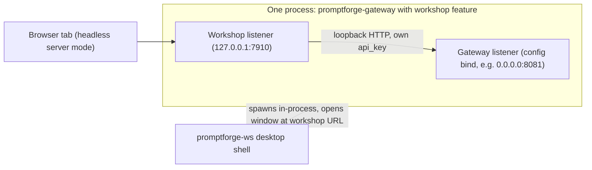

# Merged Gateway + Workshop Build

## Run state (resume here)

A run started 2026-08-27 21:16 and was stopped by the user after the pre-run action only. Where things stand:

- **Done - pre-run**: the commit-message format is in [tools-public/rulebooks/vibe-rulebook.md](c:\Users\Vinnie\cursor\tools-public\rulebooks\vibe-rulebook.md), committed in tools-public as `5fbcab1`. Do not redo it.
- **Not started**: Steps 1-11. No promptforge code was touched; promptforge master was at `3023a55` with a clean tree when the run halted.
- **Run scratch**: `c:\Users\Vinnie\cursor\cabinet\_scratch\vibe-merge-workshop\` holds `vibe-ledger.md` (initialized, one pre-run line) and is where `vibe-review.md` goes. Append one ledger line per step: step id, commit hash, Verify status, deferred non-Critical findings, rulings with falsifiers.
- **Rules manifest** (vibe rule 3, already surveyed - the four files exist and bind their subtrees): `promptforge/AGENTS.md`, `crates/promptforge-ws-server/AGENTS.md`, `crates/promptforge-ws-server/ui/AGENTS.md`, `crates/promptforge-ws/AGENTS.md`. Pass root + the ancestor-chain files by path in every coder and review dispatch.
- **Resume at Step 1** (cross-site blocking). Verify runs on schedule: steps 3, 6 (component end), 9, and 11 (final, full workspace suite). Both repos must be clean before resuming; stop if dirty.
- Execution follows the vibe loop per the Rulebooks section below: per step - TodoWrite checklist, coder subagent, commit (format per the rulebook's Commit Messages section), review-and-fix subagent once, amend if dirtied, Verify when scheduled. An unfixed Critical finding blocks the next step. Do not stop for ordinary confirmation; stop only when no forward path exists.

## Goal

One process serves both the inference gateway and the workshop UI. The gateway keeps its own bind (possibly non-loopback), and the workshop gets a second loopback-only listener (default `127.0.0.1:7910`) in the same process. Nesting under `/workshop/` on the gateway port stays a documented future option, not built now. The desktop shell (`promptforge-ws`) boots the merged gateway in-process, auto-generating a default gateway config and profile on first run.

## Rulebooks

This run applies, as binding rules:

- [tools-public/rulebooks/vibe-rulebook.md](c:\Users\Vinnie\cursor\tools-public\rulebooks\vibe-rulebook.md) - governs the loop: one testable commit per step, coder and review-and-fix subagents dispatched with their governing AGENTS.md paths, Verify on schedule, severity-gated review, the run ledger.
- [tools-public/rulebooks/rust-rulebook.md](c:\Users\Vinnie\cursor\tools-public\rulebooks\rust-rulebook.md) - governs all Rust code.
- [tools-public/rulebooks/typescript-rulebook.md](c:\Users\Vinnie\cursor\tools-public\rulebooks\typescript-rulebook.md) - governs any UI TypeScript touched (Step 10 shell wiring, any protocol-frame handling).
- [tools-public/rulebooks/html-css-rulebook.md](c:\Users\Vinnie\cursor\tools-public\rulebooks\html-css-rulebook.md) - governs any markup or styles touched.
- [tools-public/rulebooks/prompts-rulebook.md](c:\Users\Vinnie\cursor\tools-public\rulebooks\prompts-rulebook.md) - governs the wording of every subagent dispatch this run writes.

The nested AGENTS.md files in the promptforge repo bind their subtrees as always; the rules manifest from vibe rule 3 carries them into each dispatch.

## Commit messages

Before the first step, fold this format into [tools-public/rulebooks/vibe-rulebook.md](c:\Users\Vinnie\cursor\tools-public\rulebooks\vibe-rulebook.md) as its own short section (near the "Git in main" paragraph), update the rulebook's footer revision line, and commit it in tools-public with a message that itself follows the format. The rulebook text to add:

Every commit message must follow this format:

- A legible first line, 60 characters max.
- A well-formatted body of about 100 to 400 tokens.
- An overview of the high-level changes.
- No mention of step numbers or total steps; the ledger tracks steps, the message describes the change.
- From zero to 3 bullets of important notes: things that would not be immediately obvious from reading the code, gotchas, or deviations from the plan (which rule 2 already requires recording in the commit message).

Every commit in this run then follows the rulebook's format.

## Architecture

The workshop keeps talking to the gateway through its existing `GatewayClient` over loopback HTTP. No in-process call rewiring: this preserves the heartbeat/LED/reconnect semantics unchanged, and the same code path works whether the gateway is in-process or remote.

Code drift since drafting (2026-08-27 evening): the server refactor and Model-menu work landed, but the config-bearing files are untouched (`promptforge-ws-server/src/config.rs`, `promptforge-ws/src/discover.rs`, all of `promptforge-gateway-config`), so the steps below stand. Three deltas are folded in: the workshop now drives `GET /admin/profiles` and `POST /admin/switch-profile` (SSE) through `GatewayClient` (Step 8 auth and profile-rule notes), `menu.rs` persists per-profile model memory to `workshop-state.json` beside the tape file (Step 8 anchoring note), and `serve.rs` shutdown is already watchdog-hardened (Step 9 note). `promptforge-ws/src/main.rs` grew window-chrome wiring but its config-discover-spawn-health-window flow is unchanged.

## Pre-merge hardening (Steps 1-6)

Source: [tools-public/output/what-to-steal/compare-spa-crate-server-idioms.md](c:\Users\Vinnie\cursor\tools-public\output\what-to-steal\compare-spa-crate-server-idioms.md), Findings 1-5 plus the traversal check. These are independent of the merge mechanics but run first because hosting the workshop inside the gateway widens the blast radius of both Critical items. Each step is one commit with its test, per the vibe loop.

## Step 1: block cross-site requests (Critical)

One middleware layer on the workshop API router rejecting `Sec-Fetch-Site: cross-site` plus a JSON content-type guard on POST bodies; an explicit Origin allowlist in both WS upgrade handlers (chat and voice), since WS upgrades bypass Sec-Fetch in older browsers - allow the shell webview origin and the workshop's own loopback origin; URL-decode workspace path parameters before validation. Today any webpage the user visits can reach the loopback workspace-write and WS endpoints (CSRF/DNS-rebinding; grep confirms zero origin checks). The `/health` endpoint stays exempt so the shell probe and heartbeat keep working.

## Step 2: atomic workspace writes (Critical)

Extract one atomic-write helper (temp file + `sync_data()` + rename, temp removed on failure) used by both `workspace.rs` (currently a bare `fs::write` at the write endpoint - crash truncates the user's file) and `menu.rs` (which already half-implements the pattern); add a startup sweep for orphaned temp files.

## Step 3: deadlines everywhere

A default `TimeoutLayer` on the router with per-group overrides and none on the WS paths; an explicit timeout on `GatewayClient` HTTP calls (the live hang risk - no timeout exists anywhere in the crate today); bounded probes in `heartbeat.rs` shorter than the caller's patience. Matters directly for the merge: the shell's health-wait and the heartbeat drive the boot sequence in Step 10.

## Step 4: delta-decoder conformance

Audit the gateway SSE decoder against the aichat transition set: reasoning-to-content and reasoning-to-tool-call both close the think block, empty-string deltas filtered before state transitions, tool-call accumulation keyed on id/index with full-name-resend vs fragment handling, empty accumulated arguments defaulting to `{}`, trailing call flushed on `[DONE]`. Add random-byte-split tests including mid-UTF-8 splits.

## Step 5: backoff discipline

Gateway reconnect backoff resets only on useful work (a delivered token or successful completion), never on mere connect; add jitter and a total-delay budget.

## Step 6: debug asset path traversal parity

Verify the debug disk-serving asset path enforces the same traversal guarantee as the release embed path; the step's deliverable is the test that proves it, plus the fix if it fails.

Not pulled into this plan: the survey's refactor-riders (stream core template, end-state taxonomy, progress atomics, TS codegen, application-layer test mocks, liveness state enum, error shrink) ride the separately-planned chat_ws.rs decomposition, and its nine deferred ideas stay recorded in the report. This plan takes only what gates or strengthens the merge.

## Step 7: Gateway spawn API

[crates/promptforge-gateway/src/runner.rs](c:\Users\Vinnie\cursor\promptforge\crates\promptforge-gateway\src\runner.rs) - `run(&ServeOptions)` currently owns the runtime and blocks on Ctrl-C. Refactor into a spawnable form mirroring the workshop's `serve.rs` pattern:

- `spawn(&ServeOptions) -> Result<GatewayHandle>`: dedicated thread, own multi-thread runtime, mpsc bind-readiness handshake, oneshot shutdown wired into the existing `with_graceful_shutdown`.
- `GatewayHandle` exposes `url()` (the bound gateway address), `shutdown()`, `join()`.
- `run()` becomes a thin wrapper: spawn, install Ctrl-C handler, join. The binary's behavior is unchanged.

## Step 8: `[workshop]` config section

[crates/promptforge-gateway-config/src/config.rs](c:\Users\Vinnie\cursor\promptforge\crates\promptforge-gateway-config\src\config.rs) - `RawConfig` uses `deny_unknown_fields`, so add `workshop: Option<WorkshopConfig>` (same pattern as `tools`). Fields:

- `bind` (default `127.0.0.1:7910`), `open_browser` (default false)
- optional `[workshop.voice]` and `[workshop.tape]` sub-tables mirroring the workshop's own `VoiceConfig` / `TapeConfig` fields

Deliberately absent: any `[workshop.gateway]` section. The workshop's gateway `base_url` and `api_key` are derived at boot from the gateway's own `[server]` values - loopback-adjusted (a `0.0.0.0` bind becomes `127.0.0.1` for the client URL) and the same api_key. No duplicated credentials, no drift. The same single api_key authorizes the admin endpoints, so the workshop's Model menu (`GET /admin/profiles`, `POST /admin/switch-profile` SSE) works over the derived credentials with no extra config.

Anchor the runtime files: when `[workshop.tape].path` is absent or relative, resolve it against the directory holding the boot config (so `~/.promptforge/tape.jsonl` by default), never against the process cwd. This matters doubly now: `menu.rs` persists the per-profile model memory to `workshop-state.json` in the tape file's directory, so an unanchored tape path would scatter both files wherever the shell happened to start.

Profile rule: like `[server]`, the `[workshop]` section is boot-only and lives only in the boot config; a profile that carries a differing `[workshop]` is refused, same as the existing bind/api_key match check in `runner.rs:233-257`. This check gained teeth since drafting: the workshop UI itself now triggers switches mid-run, and the switch SSE stream's terminal error event is the natural carrier for the refusal.

## Step 9: Gateway hosts the workshop

[crates/promptforge-gateway/Cargo.toml](c:\Users\Vinnie\cursor\promptforge\crates\promptforge-gateway\Cargo.toml):

- `promptforge-ws-server = { workspace = true, optional = true }`
- features: `workshop = ["dep:promptforge-ws-server"]`, `workshop-cuda = ["workshop", "promptforge-ws-server/cuda"]`. Default stays empty, so headless gateway builds never pull whisper, CUDA, or the Node UI build.

In the spawn path (Step 7), when the feature is compiled in and `[workshop]` is present:

1. Build a `promptforge_ws_server::Config` programmatically (the structs `Config`, `ServerConfig`, `GatewayConfig`, `VoiceConfig`, `TapeConfig` are already public; confirm they are constructible and add constructors if fields are private). Apply the tape-path anchoring from Step 8.
2. Call `promptforge_ws_server::spawn(ws_config)` after the gateway listener is bound; hold its `ServerHandle` inside `GatewayHandle`.
3. Shutdown order on exit: workshop first, then gateway, so the workshop's final gateway calls don't hit a dead socket. The workshop side is already embedding-hardened since drafting (commit 31c180e): `shutdown()` returns Graceful or Forced with a 5s watchdog and never calls `process::exit`, so the gateway only sequences the two handles.
4. Log the workshop URL; honor `open_browser` for headless-server-with-UI use.

Route collisions (`/health`, `/v1/models` exist on both routers) are a non-issue with two listeners. Add a code comment noting the collision as the known blocker for the future nested-path option.

## Step 10: Desktop shell boots the merged gateway

[crates/promptforge-ws/src/main.rs](c:\Users\Vinnie\cursor\promptforge\crates\promptforge-ws\src\main.rs) and `discover.rs`:

- Swap the dependency: `promptforge-gateway = { workspace = true, features = ["workshop"] }` replaces the direct `promptforge-ws-server` dependency. The shell's `default = ["cuda"]` forwards to `promptforge-gateway/workshop-cuda`.
- Discovery now looks for the gateway boot config (exe dir, cwd, `~/.promptforge/gateway.toml`), keeping the existing search-order shape.
- First run generates: `~/.promptforge/gateway.toml` (loopback `[server]` bind on 8081, generated random api_key, `[workshop]` section with the current voice-model defaults) and `~/.promptforge/profiles/default.toml`, since the gateway requires `--profile` and a profiles directory.
- Boot: `promptforge_gateway::spawn(options)` with profile `default`, wait on the workshop `/health` (existing `health.rs`), open the window at the workshop URL, shut down the handle on window close.
- The legacy `workshop.toml` flow and the standalone `promptforge-ws-server` binary remain untouched for development against an external gateway.

## Step 11: Docs and design log

- Gateway README: `[workshop]` section, feature flags, build implications (Node/esbuild and whisper enter the gateway build only with `--features workshop`).
- Append the decisions (second listener now, nested path later, derived client credentials, boot-only workshop section, shutdown order) to [design/what-promptforge-is.md](c:\Users\Vinnie\cursor\promptforge\design\what-promptforge-is.md) or the design log per its conventions.

## Verification

- `cargo build -p promptforge-gateway` (no feature: no Node/whisper in the graph)
- `cargo build -p promptforge-gateway --features workshop` and `-p promptforge-ws`
- Hardening tests (Steps 1-6): cross-site requests rejected (Sec-Fetch-Site and WS Origin, with the shell webview origin accepted and `/health` exempt), atomic-write crash simulation plus orphan sweep, timeout firing on a stalled gateway stub, delta-decoder conformance including random-split and mid-UTF-8 splits, backoff staying escalated across connect-without-delivery, debug/release asset traversal parity
- Merge tests: config parse of `[workshop]`, loopback derivation of the client URL, profile-switch validation rejecting a changed `[workshop]`
- Manual: run the shell first-run flow on a clean profile dir; run the gateway headless with `open_browser = true`; confirm the webview still connects with the origin allowlist active
- Full workspace `verify` per the vibe-rulebook before commit

---

## Recovered rationale

Recovered from the producing chat sessions by the plan ledger on 2026-09-04. Everything below this heading is derived annotation, not part of the original plan.

# Enrichment: Merged Gateway + Workshop Build

Sources: creator chat (Aug 23-29, 2026) and run chat (Aug 27-28, 2026). Quotes are verbatim from the user; everything else is paraphrase.

## Origin of the merge

The merge was the user's idea, posed as a question on Aug 26:

> "Why not build the workshop directly into the gateway? I mean, the gateway already serves. Models, and it already serves the web search, so why don't we just serve the UI? ... the gateway is used two ways, one is on a headless server, right, in the data center, we don't need the UI there, we can just configure it to not, not run the UI. But now when you run it at home, like if you wanna run the UI at home, you need the gateway as well, and then having it be a separate app is kind of a pain in the ass."

Two deployment shapes drove the design: headless server (no UI, feature-gated out) and home/desktop (one process, one config, one binary). The gateway-as-essential-piece framing came earlier the same day (paraphrase): the gateway is required for everything the user builds, so anything using AI in any of his products will go through it.

The profile-switching UI hook was also the user's call:

> "the workshop UI is getting a Models menu added. And that menu can have a divider and it can show available gateway Profiles, and the user can swap profiles on the fly"

## Why the hardening steps lead the plan

On Aug 27 the user commissioned a five-subagent web survey of Rust projects serving an SPA from a single crate, explicitly hunting "techniques, bug fixes, optimizations, refactorings that reduce technical debt caused by vibe coding." When the consolidated report landed he said:

> "update the merge workshop plan to include all the fixes and improvements"

The assistant scoped that down with his later approval: only the six immediate fixes entered this plan, because (paraphrase) hosting the workshop inside the gateway widens the blast radius of the two Critical items (cross-site exposure, non-atomic writes). The seven refactor-riders were deliberately pointed at the separate chat_ws.rs decomposition and nine ideas stayed deferred in the report. The plan's "takes only what gates or strengthens the merge" line is the record of that scoping decision.

## Config philosophy (the why behind Step 8 and Step 10)

The user's constraint that killed environment variables:

> "no way there are too many environment variables. there should not be any. the gateway I guess is a necessary evil but that's it. we have to sort this shit. the tool should create the .toml file for th[e user]"

That is the direct ancestor of first-run generation of `~/.promptforge/gateway.toml` and the default profile.

When asked whether the workshop and gateway toml files should merge, the user probed the boundary:

> "I mean what about the menu settings, the window settings, saved stated, recently opened files, the path to the workshop database etc"

The resolution (assistant analysis the user accepted) was a four-way split by who writes the file and what losing it costs: config (human-edited toml), state (machine-written JSON beside the database, one file per writing component), view state (webview localStorage), data (the tape). The mechanical reason state must never merge into the toml: config is hand-edited and carries comments; if the program rewrites it to record "last opened: foo.md", serialization destroys comments, every click becomes a git diff, and the running app races the user's open editor. This is why `workshop-state.json` exists beside the tape file and why `[workshop]` in gateway.toml carries only boot config.

## Discarded or deferred alternatives

- **In-process call rewiring.** When the merge was first sketched, the assistant noted profile switching could be "no HTTP round-trip, just a function call to the same process's profile-switching logic." The plan rejects this: the workshop keeps talking to the gateway over loopback HTTP through the existing `GatewayClient`, preserving heartbeat/LED/reconnect semantics and keeping one code path for in-process and remote gateways. The user's earlier requirement underpins it: "the workbench must tolerate losing the connection to the gateway, and reconnecting."
- **Env-var interpolation in config.** The user floated `{$PROMPTFORGE_GATEWAY_URL}` interpolation inside the toml. Discarded in favor of deriving the workshop's gateway `base_url` and `api_key` at boot from the gateway's own `[server]` values - no duplicated credentials, no drift.
- **Nested path mounting.** Serving the workshop under `/workshop/` on the gateway port was considered and explicitly deferred: "a documented future option, not built now." The known blocker (route collisions on `/health` and `/v1/models`) is recorded as a code comment per Step 9.
- **System tray and system-service mode.** Part of the user's original merge pitch (tray icon, install as a service, always-on LAN gateway). Not in the plan; deferred without a tracking step.
- **Feature default on.** The first sketch had `default = ["workshop"]` so the gateway binary always carried the UI. The plan inverts this: default stays empty so headless builds never pull whisper, CUDA, or the Node UI build; the desktop shell opts in via `workshop-cuda`.
- **Merging the toml files wholesale.** Rejected via the four-way split above; only boot config merged, state stayed out.
- **The survey's refactor-riders** (stream core template, end-state taxonomy, progress atomics, TS codegen, application-layer test mocks, liveness state enum, error shrink): consciously excluded, bound to the chat_ws.rs decomposition plan.

## Process rules born in the creator chat

- The commit-message format in the plan's pre-run step is the user's text, dictated verbatim on Aug 27 ("Legible first line, 60 chars max ... no mention of step numbers or total steps ... things that would not be immediately obvious from reading the code, or gotchas, or deviations from the plan"). Rationale (paraphrase): the ledger tracks steps, so the message should describe the change.
- Step numbering: "steps are integers starting from 1, no letters (0a, 0b, etc)" - the assistant had drafted the hardening block as Step 0a-0e; the user made them Steps 1-6.
- The plan-as-deliverable doctrine: "the deliverable is no longer a design document. The plan itself is the deliverable. malleable, it shows each design element as a separate section. We add to it, update it, and from time to time we ask to have a small part of it extracted and placed at the beginning as an actionable step."

## Deviations during execution (run chat)

The plan's run-state note says the run halted after the pre-run step; the run chat shows it later resumed and completed all 11 steps (13 commits on promptforge master) plus a post-run findings sweep. Deviations and events worth keeping:

- **Interrupted Step 9 coder.** The run was stopped mid-dispatch, leaving uncommitted partial work (workshop.rs, runner.rs, Cargo.toml, lib.rs, api_error.rs) on top of Step 8's commit. On resume, a fresh coder verified the partial work was actually complete and correct; Step 9 committed without rework.
- **Concurrent edit collision.** During Step 10, `design/what-promptforge-is.md` was modified outside the run (a "Workbench to Workshop" prose rename by another agent or the user). The run staged only its own files per commit, and Step 11's decisions were appended to a separate design log file instead of the concurrently-edited one - the plan's "or the design log per its conventions" clause covered this.
- **Full-verify regression catch.** The final workspace Verify failed where focused per-step tests had not: a wedged-connection test fixture used a non-loopback Host that the new Step 1 cross-site guard now 403s (production code correct; fixture switched to loopback), plus masked ratchet failures (module-ceilings.toml missing entries, seven modules over ceiling, raised with documented reasons). Fixes landed in their own commits per rule 7, not folded into the current step.
- **Post-run sweep with a review loop.** The user rejected single-pass fixing: "when you do the fix pass I want everything fixed not just one pass." The sweep ran a review-and-fix loop - each round re-reviews the diff including prior fixes, loop ends only when a round raises zero new findings, hard cap of three rounds. It closed at zero open findings after two rounds and 14 commits. The one Important finding (Step 9 shutdown-ordering test) landed as a `cfg(test)` observer seam after two reviewers rejected the brittle stall-based approach.
- **Protocol overhead question.** Mid-run the user asked "okay but do we need the whole vibe protocol for every step?" - pressure on the per-step coder-plus-review ceremony that may motivate future rulebook tuning, but no change was made in this run.
- **Left for manual verification** (GUI-bound, not automatable in the run): shell first-run flow on a clean profile dir, headless gateway with `open_browser = true`, and webview connection under the new Origin allowlist.
- **Config-dir clutter.** First real boot surfaced legacy residue: the user asked "why is there so much crap in C:\Users\Vinnie\.promptforge", "can I delete everything but the toml files", "what about workbench.toml" - evidence the legacy `workshop.toml` flow and stale state files still confuse the single-config story the merge was supposed to deliver.
