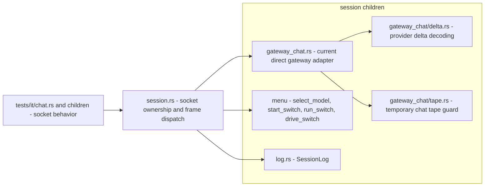

# Workshop Session Decomposition

## Run state (start here in a fresh context)

Both steps ran on 2026-08-29 and are complete. Step 1 landed as `eb8341a` (house rules). Step 2 landed as `add98be` (session module split, amended once for a message-only fix). The final full-workspace Verify was stopped before completing because a concurrent run from a separate chat advanced HEAD and dirtied the tree; `cargo build --workspace` had passed, and Step 2's focused verification (44 integration tests, 229 lib tests, clippy, doc) was green twice. Outstanding: rerun the full-workspace Verify once the tree is clean. Open findings: zero. The plan file name (`chat_ws_decomposition_521dd939.plan.md`) is a legacy name; the target module is `session`, not `chat_ws`.

At the latest reconciliation (2026-08-29 13:53), promptforge `HEAD` was `e622185`, `master` matched `origin/master`, and the tree was clean. The CUDA llama provisioning run that previously blocked this plan is complete with all findings closed. Recheck `git status --short` before executing; if another run has dirtied the tree, stop rather than absorb, stash, restore, or commit its work. Record the actual starting `HEAD` in `cabinet/_scratch/vibe-workshop-session/vibe-ledger.md`.

Both todos are completed; do not resume execution. Step 1 was a documentation-only house-rule commit. Step 2 was the module split; its final full-workspace Verify remains the only outstanding item. Run scratch lives at `C:\Users\Vinnie\cursor\cabinet\_scratch\vibe-workshop-session\`; main appends `vibe-ledger.md` and review writes `vibe-review.md` there. Every coder/reviewer dispatch receives these governing files by path:

- `promptforge/AGENTS.md`
- `promptforge/crates/promptforge-workshop-server/AGENTS.md`

The current module facts below were measured at `e622185`: `chat_ws.rs` is 2,965 lines / 121,585 bytes, with ceiling 2,963 plus the ratchet's fixed 30-line slack.

## Completed baseline this plan must preserve

The merged gateway and Workshop build is complete: the gateway optionally hosts the Workshop on its second loopback listener, the desktop executable boots that merged process, and the Model menu switches gateway profiles over the session socket. Its post-run findings sweep closed at zero open findings.

The server hardening survey's immediate fixes are also complete: cross-site and DNS-rebinding guards, atomic workspace writes, request deadlines, delta-decoder conformance, reconnect backoff, and debug asset traversal parity. Do not reimplement or weaken them during the split.

The current socket already multiplexes concurrent chats, cancellation, status and catalog pushes, workbench snapshots, model selection, and profile switching. The split preserves those contracts exactly.

Since the first draft, the crates were renamed from `promptforge-ws-*` to `promptforge-workshop-*`; all paths and commands below use the new names. `ChatRequest` is now the shared wire type through `promptforge-gateway-protocol`, and the Workshop uses the extracted `promptforge-gateway-client`; preserve those boundaries rather than recreating Workshop-owned copies.

## Rulebooks

This run applies, as binding rules:

- [vibe-rulebook.md](c:\Users\Vinnie\cursor\tools-public\rulebooks\vibe-rulebook.md) governs the two-commit execution loop, subagent dispatch, independent Message Subagent, review, ledger, and final Verify.
- [rust-rulebook.md](c:\Users\Vinnie\cursor\tools-public\rulebooks\rust-rulebook.md) governs every source move: `session.rs` beside `session/`, one concept per file, no new file over 500 lines, concrete types before traits, tests colocated with private logic, and one integration-test binary.
- [typescript-rulebook.md](c:\Users\Vinnie\cursor\tools-public\rulebooks\typescript-rulebook.md) governs any TypeScript touched. No TypeScript change is planned; touching it is a plan deviation and must preserve strict types, direct imports, runtime validation, and exported return types.
- [html-css-rulebook.md](c:\Users\Vinnie\cursor\tools-public\rulebooks\html-css-rulebook.md) governs any markup or CSS touched. No HTML/CSS change is planned; touching it is a plan deviation and must preserve semantic controls, accessibility, focus behavior, and the existing visual contract.
- [prompts-rulebook.md](c:\Users\Vinnie\cursor\tools-public\rulebooks\prompts-rulebook.md) governs subagent prompts.

The nested AGENTS.md files in promptforge bind their subtrees; the rules manifest from vibe rule 3 carries them into each dispatch. Commit messages follow vibe-rulebook's Message Subagent and `<commit-message>` contract.

The plan contains every implementation-relevant fact extracted from the comparison research. Coders work from this plan and the governing AGENTS.md files; they do not read the external clones or reports.

## Execution contract

Each step is one commit:

1. Create the step checklist.
2. Dispatch the coder with the plan path, step id, governing AGENTS.md paths, and this plan's step text.
3. Stage the result and dispatch the Message Subagent on the staged diff.
4. Commit with the returned message.
5. Dispatch review-and-fix once against the commit diff.
6. Amend with a regenerated message if review changes anything beyond tests.
7. Run Verify when scheduled.
8. Append one ledger line: step id, commit hash, Verify status, decisions with falsifiers, and open findings.

Step 1 is documentation-only and has no scheduled Verify. Step 2 is the final step and runs the full workspace Verify.

## Current state

`chat_ws.rs` is 2,965 lines / 121,585 bytes (ceiling recorded in [module-ceilings.toml](c:\Users\Vinnie\cursor\promptforge\crates\promptforge-workshop-server\module-ceilings.toml), enforced by `tests/it/ratchet.rs`). Its name is obsolete: the module began as a chat relay, but now owns the Workshop's persistent WebSocket session, including chat multiplexing, status and catalog pushes, workbench snapshots, model selection, and profile switching. Chat is one protocol concern carried by the session, not the transport itself. Its internal seams, from a fresh read of the module:

- Session loop and socket ownership: `run_session` (131), `send_frame` (1041), `send_error` (1053)
- Chat multiplexing: `ActiveChat` (271), `ChatWork` (283), `ChatKey` (297), `Chats` (331), `ChatEvent` (373), `next_event` (390), `advance_chat` (418)
- Frame handling: `handle_frame` (500), `cancel_chat` (576)
- Model-menu events: `select_model` (605), `start_switch` (625), `run_switch` (663), `drive_switch` (690), `push_stage` (713), `switch_refusal` (734)
- Chat lifecycle: `begin_chat` (753), `Forward` (783), `forward_payload` (793), `declined_stream` (838)
- Delta decoding: `DeltaFields` (870), `delta_fields` (887)
- Tape: `StreamTape` (924), `TapeEntry` (932), `impl StreamTape` (941), `Drop for StreamTape` (1000), `impl TapeEntry` (1019)
- Logging: `SessionLog` (255), `Drop for SessionLog` (259)
- Tests: `mod tests` (1062)

The module already matches the Rustpad one-task-owns-the-socket shape (single `select!` loop, merged chat events, no outbox channel, no writer task). The refactor is a split by role, not a shape change.

## Naming boundary

The replacement module is `session`, not `chat_ws`. The public route remains `/ws`; the Rust module name describes the server-side responsibility rather than the current upstream used for one message type. Temporary direct-gateway chat code lives in `session/gateway_chat.rs` and its children.

Today the session's chat concern relays directly through `GatewayClient`; later, chat will run through PromptForge instead. That later routing change is not part of this refactor. Keep the chat execution dependency behind the chat concern's boundary so replacing direct gateway execution does not disturb socket ownership, menu events, status pushes, cancellation, or tape lifecycle.

## Target shape

The permanent session transport is separated from the temporary direct-gateway chat adapter. No generic relay abstraction is introduced for hypothetical reuse: the long-term harness moves streaming into `promptforge-gateway-client`, policy into the Lua harness, and content delivery into a collecting Observer.

## Step 1: reconcile the Workshop server house rules

Update `crates/promptforge-workshop-server/AGENTS.md` in one documentation-only commit:

- Zone one returns rich errors to the host; an embeddable crate never panics for configuration, binding, asset, or initialization failures. Binary entry points may convert returned errors to a failing exit status.
- Each WebSocket endpoint owns its socket, task, channels, protocol policy, and cleanup. Protocol-neutral helpers may be extracted inside an endpoint when they reduce current code; promote one across endpoints only after a second production consumer exists. Never share hypothetical reuse.
- Durable state is recoverable from retained state or a cursor, and consumers tolerate duplicate delivery. Ephemeral snapshots may coalesce or drop under lag; the latest complete snapshot is resent on reconnect.
- A module name states its responsibility. When the name no longer covers what the module owns, rename or split it before adding another responsibility. Use `session.rs` beside `session/`; do not introduce `session/mod.rs`.
- The ceiling ratchet prevents regrowth, not responsibility drift. Never raise a ceiling to add a new responsibility; a split records every new module at its actual size and removes or lowers the old ceiling in the same commit.
- The Workshop session owns transport and multiplexing, not chat execution. Direct gateway execution is the current adapter, not the session architecture.

## Step 2: replace chat_ws.rs with the session module

Do a pure structural move with no new lifecycle, delivery, or streaming abstractions:

- Delete `chat_ws.rs`; replace `mod chat_ws` with `mod session`; keep public route `/ws` unchanged.
- `session.rs`: module contract, upgrade, `run_session`, socket ownership, retained status/catalog/workbench snapshots, top-level frame dispatch, `send_frame`, and `send_error`.
- `session/gateway_chat.rs`: the temporary direct-gateway chat adapter, including `ActiveChat`, `ChatWork`, `ChatKey`, `Chats`, `ChatEvent`, opening and payload polling, `forward_payload`, cancellation, and decline handling. Keep it below 500 lines.
- `session/gateway_chat/delta.rs`: `DeltaFields`, `delta_fields`, and their pure unit tests.
- `session/gateway_chat/tape.rs`: `StreamTape`, `TapeEntry`, and their private tests. Its qualified path distinguishes it from crate-root `tape.rs`.
- `session/menu.rs`: WebSocket-side model selection and profile-switch orchestration, distinct from crate-root `menu.rs`.
- `session/log.rs`: `SessionLog`.
- Keep private unit tests beside the extracted code. Move socket-level behavior tests into the existing `tests/it/chat.rs` integration module and its behavior-named children under `tests/it/chat/` (multiplexing, cancellation/tape, menu/profile), reusing `tests/common`. Keep each test file below 500 lines, preserve every scenario and assertion, and do not create a second integration-test binary or a mock-service layer.
- Update `lib.rs`, `routes/chat.rs`, internal imports, and documentation links from `chat_ws` to `session`. Keep `routes/chat.rs` named as-is because it mounts `/v1/models`, `/chat`, and `/ws`.
- Delete the `chat_ws.rs` ceiling and add every `session.rs` and `session/**/*.rs` ceiling at actual size in `module-ceilings.toml` in this same commit. The ratchet covers only `src/**/*.rs`; test files under `tests/` need no ceiling entries. No new source or test file may exceed 500 lines.

Preserve the existing single-task architecture, multiplexing fairness, cancellation, tape ordering, retained snapshots, lag handling, cross-site checks, deadlines, and profile switching exactly.

## Execution dependencies

Step 1 must land first because it defines the ownership and naming constraints Step 2 implements. Step 2 is then a mechanical move under those rules. No implementation step depends on external research or an unfinished design decision.

## Verification

- Step 1 changes documentation only; review verifies that the six rules are mutually consistent with root AGENTS.md.
- The existing session WebSocket test suite (currently `chat_ws`'s `mod tests` at line 1062) stays green through Step 2. Move tests mechanically; do not rewrite assertions to make the split pass.
- `cargo test -p promptforge-workshop-server --test it` proves both behavior and ratchet coverage after Step 2.
- `cargo build -p promptforge-workshop-server` and `--features cuda` both compile (`cuda` is the compatibility alias for `voice-cuda`).
- Run the final full-workspace Verify after Step 2.
- Report the final open-findings count before declaring the run complete; zero is the target, and any non-Critical carryover must name its owner or delegated step.

## Not in scope

### Deferred to the agentic-harness plan

These items belong to `C:\Users\Vinnie\.cursor\plans\interactive_webhook_tool_9ab3c21f.plan.md`, which is the planned consumer of the session boundary. That plan still contains pre-rename `promptforge-ws-server` paths and must be reconciled before it runs:

- Replacing `session/gateway_chat.rs` and its children with a PromptForge Lua harness.
- `user_input` wait-registry frames.
- Collecting-Observer event forwarding over the existing session.
- Rust-to-TypeScript protocol generation, because the harness expands the protocol with Observer and user-input frames.
- Generic streaming and terminal-state machinery, because the harness moves streaming into `promptforge-gateway-client` and policy into Lua.

### Deferred as independent follow-ups

These ideas either optimize temporary direct-gateway code, duplicate existing fixtures, or need their own bounded plans:

- Progress sampler.
- Listener gating.
- Liveness enum.
- Mock-service layer.
- HTTP error shrink.
- Voice WebSocket decomposition.

### Recorded but not scheduled

These survey ideas remain evidence only:

- Invalidation-signal push.
- Typed event bus.
- Runtime isolation.
- Write-behind drain.
- Digest-pinned downloads.
- UI-triggered shutdown.
- Counter-heartbeat.
- Debug-embed parity.
- Startup timing.
- Message tree.

---

## Recovered rationale

Recovered from the producing chat sessions by the plan ledger on 2026-09-04. Everything below this heading is derived annotation, not part of the original plan.

# Enrichment: Workshop session decomposition (chat_ws_decomposition_521dd939)

Sources: creator chat 6786ed55 (Aug 23-29, 2026), run chat f387344e (Aug 29, 2026). User quotes are verbatim; everything else is paraphrase.

## Why the plan exists

`chat_ws.rs` grew from 46KB to 116KB during the Model-menu work (concurrent chats, workbench frames, profile switching, cancel frames), and the hardening pass pushed it to 121KB / 2,963 lines - larger than the next four biggest modules combined. The user on seeing the number: "are you fucking kidding me, its at 121KB ?"

The creator chat made the structural point explicit (paraphrase): per-diff review never saw the growth because each step's diff was clean; the accretion is only visible at module level, exactly the failure mode the ceiling ratchet exists to catch. The seams were clean and the test suite was the invariant, so a mechanical split was judged safe.

## The naming insight that reshaped the plan

The first draft (Aug 28, 17:42) kept the `chat_ws/` name. The user then asked: "why is this called chat?" Answer (paraphrase): the name is a fossil from the single-chat era; the module is really the session multiplexor - the one socket carrying everything the UI needs - so the honest move is naming it `session/` during the split.

The user's decisive sentence: "Yes definitely, especially because we are going to go through promptforge to chat, not the gateway directly. but thats for another day."

That sentence produced the plan's central boundary: session transport is permanent, the direct-gateway chat relay is a temporary adapter, and the chat execution dependency stays behind the chat concern's boundary so the later PromptForge routing swap disturbs nothing else. The route stays `/ws` because the Rust module name should state the server-side responsibility, not today's upstream of one message type.

## Discarded alternatives

The nine-step first draft included two assistant-recommended options the user initially accepted: a generic `Stream` relay core with a `DoneState { Running, SendingDone, Done }` machine (the mistral.rs template, session logic as callbacks), and Rust-to-TypeScript wire-type codegen in the same plan. Riders from the SPA-crate comparison research were folded in: a `StreamEnd { Completed, Error, ClientDisconnected }` taxonomy, progress atomics with a 1Hz sampler, listener gating, a mock-layer application test framework, a gateway liveness enum, and an `error.rs` shrink.

The Aug 29 review killed most of it on two Critical findings (paraphrase):

1. The generic shared stream core conflicts with the crate's AGENTS.md. `Chats`, `next_event`, `advance_chat`, and `StreamTape::Drop` already form the state machine; a generic `DoneState` adds a second state layer, and "voice may reuse it later" is speculative reuse, which the rules prohibit (never share hypothetical reuse; shared WebSocket scaffolding must be deleted, not relocated).
2. The three-state `StreamEnd` taxonomy was incomplete: real termination paths are completed, explicitly canceled, gateway declined, open failed before any exchange, stream failed, client disconnected, and tape settled but the terminal `done` frame failed to send.

The decisive cut came when the user pointed at the long-term harness plan (`interactive_webhook_tool_9ab3c21f`) and asked whether it changed the proposal. It did: nearly every concern the generic core would polish - `ChatWork::Opening`, direct `GatewayClient` opening, `SsePayloadStream` polling, `forward_payload`, `delta_fields`, the gateway-specific `StreamTape` - is scheduled for deletion or radical change once chat executes through the PromptForge Lua harness. The assistant's formulation (paraphrase): investing in a polished generic abstraction around these would create infrastructure specifically for code scheduled for deletion.

Result: trimmed to two commits - house rules, then a pure structural split. Removed: generic stream core, `DoneState`, terminal taxonomy, progress sampling, listener gating, liveness enum, mock framework, error shrink, immediate TS codegen. Codegen moved to the harness plan specifically because that is when the protocol expands (Observer and `user_input` frames), so types move once. The user then had the deferrals grouped by destination: harness-plan items, independent follow-ups, recorded-but-not-scheduled survey ideas.

## Where Step 1's house rules came from

The six AGENTS.md rules were not invented for the split; they fix contradictions the review found in the existing Workshop-server AGENTS.md (paraphrase): startup-panic wording contradicted the embeddable-crate never-panic rule; the shared-scaffolding ban was overbroad and blocked legitimate endpoint-internal helpers; "delivered exactly" was too strong for a disconnecting transport; and the ratchet prevented regrowth but not responsibility drift. The sixth rule is the session boundary itself: the session owns transport and multiplexing, not chat execution; direct gateway execution is the current adapter, not the architecture.

## Rulebook-driven shape

Applying the rust-rulebook at the user's direction set the final layout: `session.rs` beside `session/` (never `session/mod.rs`), no new file over 500 lines, the adapter split into `session/gateway_chat.rs` plus `delta.rs` and `tape.rs` children, private unit tests colocated, socket behavior tests moved mechanically into the existing single integration binary under `tests/it/chat/` with every assertion preserved.

## Run deviations and decisions (run chat)

- The Step 2 coder flipped several items to `pub` and added `#[must_use]` so the moved integration tests could reach them - a deviation from "pure structural move," accepted as inherent to relocating tests into `tests/it/` (paraphrase).
- One genuinely new test appeared (a scripted-admission gateway in `cancellation.rs` pinning that a parked open never blocks the socket) although the coder had reported "moved, no new tests." Review's only finding (Minor) was the commit message saying "adds"/"gains" for tests that moved verbatim; fixed by a message-only amend, producing `add98be`.
- The final Verify was first dispatched synchronously and blocked the session. The user: "jesus christ you launched the task syncrhonously again for fucks sake" - then directed a permanent rulebook change: "modify the @tools-public/rulebooks/vibe-rulebook.md subagents must ALWAYS be asynchronous NEVER synchronous". The vibe-rulebook now carries that rule.
- The user, believing this run finished, launched a second vibe run elsewhere: "I thought you were done and I launched another vibe in a separate chat". That run advanced HEAD and dirtied the tree, so the in-flight full-workspace Verify was stopped per the plan's stop-rather-than-absorb rule. Both commits (`eb8341a`, `add98be`) were already landed and are ancestors of the other run's HEAD.
- The user then retired the one outstanding item: "We don't need the full workspace verify because that'll be handled by the other vibe pro- vibe coder. It'll do its own." The assistant concurred (paraphrase): the other run's final Verify certifies these commits in the only tree state that matters, CI exercises the split on push, and the nightly CUDA workflow covers the `--features cuda` check.
- On deferred items, the user's thesis: "none of these deferred items, none of these are top-level features. They're all implementation details that we would rediscover on our own when we go to implement the features that need them anyway. Is that correct?" Answer (paraphrase): correct for the structural items - techniques whose pain announces itself in the code when needed - with one carve-out: the harness-plan items are actual features and live in their own self-contained plan. The user also confirmed this plan file need not be kept for the deferred items; the source research at `tools-public/output/what-to-steal/` carries them in richer form.
