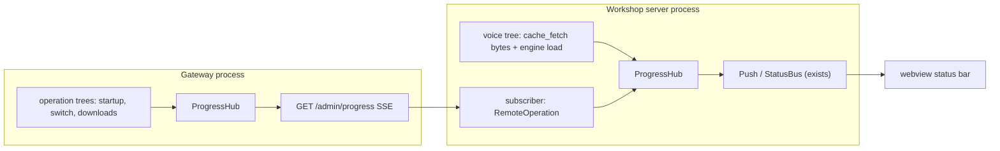

# Progress Architecture: promptforge-progress with Full Adoption

## Context

The workspace ships four independent ad-hoc progress mechanisms: indicatif/tracing reporters in [artifacts/progress.rs](promptforge/crates/promptforge-gateway-local/src/artifacts/progress.rs), per-request `DownloadProgress` SSE in [cache.rs](promptforge/crates/promptforge-gateway/src/cache.rs), a `&'static str` stage channel in [lib.rs `run_switch`](promptforge/crates/promptforge-gateway/src/lib.rs), and hand-built `push_progress` calls in [provision.rs](promptforge/crates/promptforge-workshop-server/src/provision.rs). None compose. Meanwhile [push.rs](promptforge/crates/promptforge-workshop-server/src/push.rs) already is a complete UI renderer (`push_progress` -> `StatusFrame` -> `/ws`).

Architecture (whisper is on-device in workshop-server; the gateway only serves model bytes via its blob cache):

## Executor orientation

Everything a fresh session needs, nothing here requires the chat that wrote this plan.

- **Repo**: `c:\Users\Vinnie\cursor\promptforge` (a git repo; worktree was clean when this plan was written - verify with `git status` before step 1 and stop if dirty). All linked paths in this plan are relative to the workspace root `c:\Users\Vinnie\cursor`.
- **Governing rulebooks**: `tools-public/rulebooks/vibe-rulebook.md` (execution protocol; subagent dispatches name its `<rule-book>`, `<code-review>`, and `<commit-message>` tag blocks) and `tools-public/rulebooks/rust-rulebook.md` (Rust standards). Read both before step 1.
- **House rules manifest** (vibe rule 3): `promptforge/AGENTS.md` governs everything. Per-crate files bind their crates: `crates/promptforge-transcribe/AGENTS.md`, `crates/promptforge-gateway-local/AGENTS.md`, `crates/promptforge-gateway/AGENTS.md`, `crates/promptforge-gateway-client/AGENTS.md`, `crates/promptforge-workshop-server/AGENTS.md`. tool-picker, mcp-server, cli, and dev have no crate-level file - the root governs them. The new crate gets `crates/promptforge-progress/AGENTS.md` written in the sibling convention as part of step 1.
- **Scratch files**: `vibe-ledger.md` and `vibe-review.md` live in `cabinet/_scratch/progress-rollout/` (create the directory at run start).
- **Workspace mechanics**: `members = ["crates/*"]` picks up the new crate automatically; add `promptforge-progress = { path = "crates/promptforge-progress", version = "0.1.0" }` to `[workspace.dependencies]` in the root `Cargo.toml` so members write `promptforge-progress.workspace = true`. Edition 2024, rust-version 1.89, license BSL-1.0, `[lints] workspace = true` in the member manifest - the workspace lints already match the rust rulebook.
- **Test fixtures**: transcribe tests marked `#[ignore = "requires whisper test fixtures (tests/fixtures/)"]` need `crates/promptforge-transcribe/tests/fixtures/` populated (ggml-tiny.en.bin from the Hugging Face URL named in that crate's lib.rs, plus jfk.wav). Steps 2 and 14 name tests that need fixtures; without them those tests stay ignored and the non-fixture tests carry the step's verification.
- **Commits**: one commit per step, message from the Message subagent, never push.

## Components

In dependency order, with the reason for each placement:

1. **promptforge-progress** - the vocabulary. Everything depends on it; it depends on no promptforge crate (the invariant core-support advertises, kept separate because core-support's domain is run execution and only core/parser/lua consume it).
2. **Producers** (transcribe, gateway-local, tool-picker) - independent crates; build in parallel. Each only reports into handles; none knows about events or serde.
3. **mcp-server** - consumes tool-picker; its two changes (BGE dedup, boot leaves) are sequenced dedup-first because they touch the same call sites.
4. **gateway** - consumes gateway-local and the vocabulary; adds the process hub and the SSE export. Its three steps are sequenced endpoint-first because the migrations derive from it.
5. **gateway-client** - consumes the wire types; can build against a mock server once the event schema lands in step 1.
6. **workshop-server** - consumes everything above; renderer before subscriber before provision migration, because each later step feeds the tree the earlier step renders.
7. **cli / dev** - leaf binaries, TTY renderers only.

## Step 1: New crate `promptforge-progress`

Lives at `crates/promptforge-progress/` with a sibling-convention `AGENTS.md`. Zero promptforge dependencies. Deps: `tokio` (sync only, for the broadcast), `tracing`; `serde` optional. Features: `default = []`, `serde = ["dep:serde"]` gating `#[cfg_attr(feature = "serde", derive(Serialize, Deserialize))]` on the wire types - producers never serialize. Member manifest carries `[lints] workspace = true` like its siblings.

This step also writes the standing convention into the root `promptforge/AGENTS.md`, so any future code that needs progress knows what to do. Three sentences, approximately: "Long-running work reports progress through `promptforge-progress`: attach an operation tree to the process `ProgressHub` - or register leaves on the current operation's tree when one exists - and report through the `ProgressHandle` it returns. Never invent a parallel progress channel: no ad-hoc callbacks, stage strings, or direct status-bus calls for fractional progress. Producers never format output; renderers subscribe to the hub."

- `tree.rs`: `ProgressTree` - **operation-scoped, bounded lifetime**. The owner of one operation (startup provisioning, one profile switch, one cache download, one voice provision) creates the tree, registers every leaf up front (`register(label, weight) -> ProgressHandle`), then runs its own existing control flow and reports through the handles; the tree is destroyed when the operation ends. The tree measures, it does not schedule: leaves are not tree-invoked closures, because the stages have heterogeneous intermediate values flowing between them (a download's path feeds the spawn step, a verify feeds a digest) that no uniform `FnOnce(&ProgressHandle)` signature can carry, and because the owner chooses its own concurrency (parallel model loads, overlapping downloads). **Weights are proportional to expected time, not bytes or unit counts** (the Eclipse rule): a leaf's byte total is how *it* computes its own fraction internally; its weight is its share of the operation's expected duration. Weighted aggregate `fraction()`; interior mutability via `Arc` + `AtomicU64` fractions stored as fixed-point millionths (0..=1_000_000) so worker-thread reporters take no locks.
- `hub.rs`: `ProgressHub` - one `Arc<ProgressHub>` per process, living in `AppState` forever; operations install and remove themselves by lifetime. Internals: `live: std::sync::Mutex<HashMap<OperationId, Arc<TreeState>>>` for membership plus a `tokio::sync::broadcast::Sender<ProgressEvent>` for the event stream, deliberately outside the lock. The Mutex guards membership only (attach, detach, snapshot walk) with microscopic critical sections and no guard crossing an `.await`; leaf fractions are `AtomicU64`s inside `TreeState`, so reporters on worker threads never touch the lock. No Arc cycle: the hub holds `Arc<TreeState>`, the owner's `ProgressTree` handle holds its `OperationId` plus a hub reference and detaches on `Drop` (infallible, non-blocking - a panicking operation still unregisters). Lock poisoning recovers the value, matching `VoiceSlot`'s posture. Conceptually `Arc<Option<ProgressTree>>` generalized to zero-or-more, because operations genuinely overlap (a cache download is per-request and unserialized, and can overlap a profile switch). The empty set is the idle state (there is no "empty tree" - an idle process simply runs no operations): the SSE endpoint then streams only keep-alives and snapshots return empty. This, not a long-lived tree, is what the SSE endpoint and the UI renderer subscribe to.
- `handle.rs`: `ProgressHandle` - cheap to clone, `Send + Sync`; `set_fraction(f)` clamped 0..=1, `set_units(done, total)`, `complete()` forcing 1.0 on every exit path, `child(label, weight)` for subtrees. Handles coalesce event emission: an update is broadcast only when the fraction moved at least 1% or 100 ms elapsed since the last emit, so byte-counting reporters cannot flood the bus. Terminal states are never coalesced.
- `event.rs`: `ProgressEvent { operation, path, label, state }`, `#[non_exhaustive]`, where `operation` identifies the live tree and `path` is a hierarchical leaf id within it (`"local-models/ggml-large-v3/download"`); `state` is `Begun { weight } | Updated { fraction } | Finished { ok }`. Intermediate events are lossy; terminal events are delivered from task join results, never through the lossy path (the cache.rs invariant). Consumers detect completion only from `Finished`, never from a fraction reaching 1.0 (the Apple rule: floats lie about completion; only the terminal event is authoritative).
- `remote.rs`: `RemoteOperation` - attaches to a `ProgressHub` like a local tree, but its leaf fractions are driven by `apply(event)` from a remote process's event stream. Serves both the long-lived gateway subscription and per-request SSE streams.
- `render.rs`: `hub.snapshot()` -> per-operation ordered vecs of `(path, label, weight, fraction)`; `headline()` picks the active highest-weight unfinished leaf across live trees for status-bar text. **The aggregate fraction never steps backward while operations are live** (the NetBeans rule): when a tree attaches mid-run, remaining space is rebalanced among live trees rather than diluting completed work, and the renderer holds a high-water mark that resets only when the hub goes idle.
- **Runtime-agnostic**: the crate never spawns and never blocks; it exposes a `tokio::sync::broadcast` of events plus pull-based snapshots. The gateway and workshop-server spawn their own forwarding and renderer tasks.
- Public API posture: `#[non_exhaustive]` on the event enum and public structs, `#[must_use]` on constructors, `Debug`/`Clone` where valid, compile-time `Send + Sync` assertions on `ProgressHandle` and `ProgressTree` (they hold `Arc` + atomics), every public item documented with doctests.
- `lib.rs` is a facade: crate docs, `mod` declarations, `pub use` re-exports only.
- Tests: weight math, clamping, completion-forces-1.0 despite bad estimates, coalescing (paused time via tokio test-util), detach-on-drop removes a tree from hub snapshots, remote import, snapshot ordering, never-backwards rebalancing when a tree attaches mid-run.

## Step 2: transcribe prewarm + progress handle

[worker.rs](promptforge/crates/promptforge-transcribe/src/worker.rs), [engine.rs](promptforge/crates/promptforge-transcribe/src/engine.rs):

- Add `prewarm(path, &ProgressHandle)`: chunked sequential read (4 MiB reused buffer, `set_units` per chunk) populating the page cache before `WhisperContext::new_with_params`; open/read failures map to the existing `TranscribeError::LoadModel` naming the path (preserves the test at engine.rs:243). Prewarm is unconditional: the product is designed on the assumption that every supported machine has enough memory for the transcription models, so the thrash case the research warns about (full-file prewarm when the model exceeds RAM - llama.cpp Discussion #18758, vs the ~2.8-3.5x cold-load win when it fits, PRs #734/#869) is excluded by design rather than by a runtime gate.
- `VoiceEngine::new_with_progress(config, Option<ProgressHandle>)`; `new` delegates with `None`. Each worker thread prewarms then loads its own model, which also parallelizes the currently sequential interim/final loads (engine.rs:71-75) - both changes land in this one step.
- Prewarm registers bytes (stat at registration); whisper/CUDA init is an indeterminate sibling leaf that only gets `complete()`.
- Tests: prewarm of the fixture model drives the leaf to 1.0; a missing file still fails as `LoadModel` naming the path; `new` without a handle behaves exactly as before.

## Step 3: gateway-local byte-measurable producers

[artifacts/](promptforge/crates/promptforge-gateway-local/src/artifacts/):

- Keep the `DownloadProgress` trait as the internal byte-counting seam; add one `TreeProgress` impl feeding a `ProgressHandle` (download bytes via Content-Length).
- Add the same handle reporting to SHA-256 verify (bytes read - new callback in `verified.rs`/`digest.rs`) and archive extract (entry count).
- The indicatif `IndicatifProgress` and `TracingProgress` impls stay in place until step 10 moves them; this step only adds the tree reporter alongside.
- Tests: `TreeProgress` drives a handle's fraction per byte; verify and extract report their counts.

## Step 4: gateway-local readiness leaf + runtime wiring

[runtime.rs](promptforge/crates/promptforge-gateway-local/src/runtime.rs), [server.rs](promptforge/crates/promptforge-gateway-local/src/server.rs):

- `LocalRuntime::start` takes `Option<&ProgressHandle>`; registers one subtree per local model (download/verify/extract children from step 3) plus an indeterminate readiness leaf per `llama-server` spawn (the bounded poll in server.rs:202-300 only gets `complete()`).
- Tests: a runtime start over a mock layout registers the expected subtree shape.

## Step 5: tool-picker progress handles

[picker.rs](promptforge/crates/promptforge-tool-picker/src/picker.rs), [embed.rs](promptforge/crates/promptforge-tool-picker/src/embed.rs):

- `Model::load_with_progress(Option<&ProgressHandle>)` reports the safetensors copy in chunks (bytes); `Model::load` delegates with `None`.
- `ToolPicker::build_with_model` gains `Option<&ProgressHandle>`, one fraction step per embedded tool; `build` threads it through.
- Tests: building over a known catalog drives the fraction to 1.0 in tool-count steps.

## Step 6: fix the duplicate BGE embedding model load in mcp-server

Boot currently loads the ~40-100 MiB BGE model twice: `Index::build` ([retrieval/index.rs:51](promptforge/crates/promptforge-mcp-server/src/retrieval/index.rs)) calls `ToolPicker::build`, and `PreparedTools::new` ([server/bind.rs:130](promptforge/crates/promptforge-mcp-server/src/server/bind.rs)) calls it again. The sharing seams already exist: `Model` is an `Arc`-shared cheap clone, `ToolPicker::build_with_model` is the documented multi-catalog path, and `Index::build_with` already exists gated `#[cfg(test)]` (index.rs:62-76). Call-site wiring only:

- Boot (`lib.rs` `run`) loads `Model::load()` once, before both consumers.
- Promote `Index::build_with` from `#[cfg(test)]` to always available; `Retrieval::start` takes `&Model`.
- `PreparedTools::load` / `new` take `&Model` and call `build_with_model`.
- Failure semantics unchanged in effect: a shared model-load failure fails boot via `PreparedToolsError::picker`; retrieval's idle-degradation remains only for per-catalog index failures.
- Tests: boot with a shared model loads the encoder once. The assertion seam is `Model::shares_encoder`, currently `#[cfg(test)] pub(crate)` in tool-picker and unreachable cross-crate - promote it behind a `test-fixtures` feature re-export, following the transcribe precedent (a self dev-dependency enables it for test builds only).

## Step 7: mcp-server boot progress leaves

[lib.rs](promptforge/crates/promptforge-mcp-server/src/lib.rs): boot creates a hub and one operation tree with leaves - catalog resolve (file count), retrieval index (prompt count), tool build (tool count) - wired to the handles from step 5 and the shared model from step 6. mcp-server is a server with no TTY, so its renderer is a small subscriber task that logs leaf transitions through the crate's existing `tracing` posture (it already logs the retrieval index count at info). Tests: a boot over a fixture catalog drives all leaves to completion.

## Step 8: gateway tree + GET /admin/progress

[runner.rs](promptforge/crates/promptforge-gateway/src/runner.rs), [lib.rs](promptforge/crates/promptforge-gateway/src/lib.rs):

- `AppState` gains a process-lifetime `ProgressHub`, built before `LocalRuntime::start` (runner.rs:434); startup provisioning creates the hub's first operation tree.
- New `GET /admin/progress`: bearer-authed like the other admin routes, SSE stream of `ProgressEvent` from the hub (serde feature on), modeled on `switch_sse_response` (lib.rs:671): lossy intermediate samples, terminal events from join results. The stream emits heartbeat comment lines every 15-20 s so idle connections survive NAT/firewall timeouts, and a freshly connected subscriber first receives a snapshot of live operations so it can render current state without waiting for the next event.
- Tests: attach an operation tree to a test hub, register leaves, assert the SSE stream carries begun/updated/finished in order, and that the stream goes quiet when the tree drops.

## Step 9: gateway run_switch migration

[lib.rs](promptforge/crates/promptforge-gateway/src/lib.rs): replace the `stages: mpsc::Sender<&'static str>` channel with a per-switch operation tree attached to the hub (`loading-profile`, `stopping-models`, `starting-models` as weighted leaves, the middle one covering the VRAM-serialized teardown), created when the switch starts and destroyed when it ends. The per-request switch SSE response becomes a filtered view of hub events for that switch's operation id - one source of truth. Tests: the existing switch tests assert the same stage sequence, now read from hub events.

## Step 10: gateway cache leaves + TTY renderer

[cache.rs](promptforge/crates/promptforge-gateway/src/cache.rs), gateway binary:

- Each cache download creates a small operation tree attached to the hub; `ChannelProgress` reports into its leaf. The per-request SSE stays but derives from the tree's events.
- The indicatif/tracing reporters move from gateway-local's `artifacts/progress.rs` into the gateway binary's renderer task, which renders `hub.snapshot()` to indicatif on a TTY or tracing lines otherwise. gateway-local drops its indicatif dependency; the library no longer chooses a presentation.
- Tests: a download's tree appears in hub snapshots and detaches at completion; renderer output is covered by a snapshot-to-lines unit test.

## Step 11: gateway-client subscription

[model/transport.rs](promptforge/crates/promptforge-gateway-client/src/model/transport.rs) pattern: add `subscribe_progress()` returning an SSE stream of deserialized `ProgressEvent`, bearer auth via the existing plumbing. Tests: against a mock axum SSE router (the provision.rs:419-434 pattern).

## Step 12: workshop-server tree + renderer

[app.rs](promptforge/crates/promptforge-workshop-server/src/app.rs), new `progress.rs`:

- `AppState` gains the workshop `ProgressHub`. Operations with bounded lifetimes attach as they run: voice provisioning (one tree: model fetch leaves plus engine load leaves) and the gateway `RemoteOperation`.
- Renderer task: watches hub snapshots, calls `Push::push_status_update` / `push_progress` with `headline()` label and aggregate fraction. Status texts ("Voice ready", failures) stay as explicit push calls - the tree owns only fractional progress. **Anti-flicker policy lives here, not in the UI**: the indicator is shown only once an operation has been live for ~1 s, stays up at least ~0.5 s once shown, and the displayed fraction is the monotonic aggregate from `render.rs` - the bar never stalls, lies, or resets mid-operation.
- **The status bar progress indicator is the terminal renderer, and it already exists.** The chain is hub snapshot -> `headline()` label + aggregate fraction -> `Push::push_progress` -> `StatusFrame.progress` -> `/ws` -> the `<progress>` element in [status-bar.ts](promptforge/crates/promptforge-workshop-server/ui/src/ui/status-bar.ts) (`renderSlot`, lines 93-104: a frame carrying progress shows the bar at that fraction and hides the REC/LED group; a null progress restores it). No UI or protocol change is needed - the wiring is entirely the server-side renderer task feeding frames the bar already paints. When the hub's last tree detaches, the renderer calls `Push::push_idle()` (push.rs:99), which clears the bar and restores the indicators group.
- Tests: registered leaves produce the expected `StatusBarUpdate` sequence on the bus (the push.rs:130 wired() pattern).

## Step 13: workshop-server gateway subscriber

New task with the heartbeat's lifecycle posture: subscribes to `/admin/progress` when the gateway is reachable, applies events via `RemoteOperation::apply`, resubscribes on reconnect. Tests: mock gateway SSE feeds events; the workshop hub reflects them as a remote operation; a reconnect resubscribes without duplicating state.

## Step 14: workshop-server provision migration

[provision.rs](promptforge/crates/promptforge-workshop-server/src/provision.rs): `cache_fetch` applies `CacheEvent::Downloading` samples to a voice-download leaf instead of calling `push.push_progress` directly; `VoiceEngine::new_with_progress` wires the prewarm/init leaves (provision.rs:154, app.rs `startup_engine`). Note the test-expectation change this forces: the `/ws` end-to-end test at provision.rs:770 asserts `Downloading` frames for a mock download that completes in milliseconds, but the step 12 anti-flicker threshold suppresses the indicator for sub-second operations - update that test to assert the terminal sequence ("Download complete", "Voice ready") without the progress frames, and cover the threshold itself with a renderer unit test on paused time.

## Step 15: cli/dev TTY renderers

[app.rs](promptforge/crates/promptforge-cli/src/app.rs), [run.rs](promptforge/crates/promptforge-dev/src/run.rs): a small tree around `ToolPicker::build` + catalog fetch, rendered with indicatif on a TTY. Small - these are per-run CLIs.

## Step 16: retirement + verification

- Delete `artifacts/progress.rs` (moved in step 10), the retired `run_switch` stage channel remnants, and any orphaned `ChannelProgress` plumbing.
- Full matrix: `cargo fmt --all --check`, `cargo clippy --all-targets --all-features -- -D warnings`, `cargo test --locked --workspace --all-features`, `cargo test --doc`, and a build with and without the `cuda` / `local` features.

## Data flow check

Registration precedes execution at every level: the gateway hub exists before `LocalRuntime::start` creates the startup tree; a switch's tree registers its leaves before the switch task runs; the workshop hub is built in `AppState::new` before `provision::spawn` creates voice trees. Step 1 delivers the vocabulary every later step consumes; steps 2-5 need only step 1; step 8 needs step 4 for meaningful startup events; step 13 needs steps 1 and 11; step 14 needs steps 2 and 12. No step needs information a previous step does not produce. Trees are operation-scoped and destroyed at completion, so memory is bounded by the operation and the hub's idle state is simply "no live trees."

## Decisions made, with falsifiers

- **The wire format carries no version field.** Gateway and workshop-server ship together in the desktop deployment. Falsifier: if either is ever deployed against a mismatched peer, add a `v` field to `ProgressEvent` then.
- **Progress is pull-plus-lossy-push, never guaranteed delivery.** Intermediate samples may be dropped under backpressure; terminals never are. Falsifier: a consumer that must audit every sample would need a recorded stream, not a broadcast.
- **Trees measure; owners schedule.** Leaves are reporting handles registered up front, not closures the tree invokes, because stage outputs are heterogeneous (paths, digests, child handles) and flow between stages, and because each owner picks its own concurrency. Falsifier: if every operation converges on uniform `FnOnce(&ProgressHandle) -> Result<()>` steps, an executing tree becomes possible and this inverts.
- **The tree owns fractions; `Push` keeps status text.** Renderer computes labels from `headline()`, but "Voice ready" and failures remain explicit calls. Falsifier: if every status text ends up derived from leaves, fold status into the tree.

## Execution conventions (vibe rulebook)

Full path. The AGENTS.md manifest in Executor orientation is authoritative (it was surveyed when this plan was written); every Coder and Review-and-Fix dispatch carries the root path plus the per-crate paths for the crates its step touches. Each step is one commit: Coder subagent (code + focused tests), Message subagent on the staged diff, Review-and-Fix once against `<code-review>`, amend if dirtied, Verify subagent on schedule (every 3rd step, end of each component, and the full suite on step 16). All subagents dispatch asynchronously. Main keeps `vibe-ledger.md` - one line per step: number, commit hash, Verify status, decisions with falsifiers. If the worktree is dirty at run start, stop and ask the user to commit or stash first.

## Explicitly out of scope

- `promptforge-gateway-build` (cargo build-time; progress belongs in build output).
- `promptforge-core-support`'s `observe` module (run lifecycle events, a different vocabulary - no merge).
- Changing the `/ws` protocol: `StatusFrame`/`Progress` already carry what the UI needs.

---

## Recovered rationale

Recovered from the producing chat sessions by the plan ledger on 2026-09-04. Everything below this heading is derived annotation, not part of the original plan.

# Enrichment: Progress architecture rollout

## Origin

The plan grew out of a `promptforge-transcribe` API review, not a progress initiative. The user asked to tighten the crate's public surface; the first progress answer was negative. Model load is a single opaque mmap'd whisper call with no load-progress callback, so (paraphrase) "a progress bar would be fake" - only four milestones exist, and `VoiceSlot` plus `tracing` already cover them. The user's prewarm idea (sequentially reading the model file to populate the OS page cache before whisper maps it) flipped that verdict: the read is byte-countable, so it yields honest percentages where whisper's own load never could, and it also removes first-take stutter from demand page faults.

## The why

The user proposed the pattern verbatim: "should we build a progress architecture? A two-phase api. First, a piece of code registers the operation and the number of increments (in this case it is number of bytes of the model to prewarm). Then after all the pieces of code register, the caller runs the initialization which calls each piece of code with an observer that registers its share of the completion towards the sum?"

The assistant's first response was that this is NSProgress / Eclipse SubMonitor, sound but over-engineering for one crate with four leaves. What changed the verdict was a 26-crate sweep that found four independently invented ad-hoc progress mechanisms already shipping (indicatif/tracing in gateway-local, per-request `DownloadProgress` SSE in cache.rs, the `&'static str` stage channel in `run_switch`, hand-built `push_progress` in provision.rs), none composing. (Paraphrase) "That's the tell" - duplication across four subsystems is the evidence the shared vocabulary is needed.

The two-consumer topology that justifies a standalone crate is the user's own: "because in theory there are two users. The gateway, and the workshop ui. I would want the gateway to offer an endpoint where you can get events to know how long it is taking to switch models or load. And then there's the workshop server, it receives the gateway events but it also incorporates that into its own larger progress context which includes the transcription, and then forwards that to the UI."

## The user's decisive design corrections

1. **Bounded tree lifetime.** The draft plan had process-lifetime trees with "leaf retirement." The user killed it: "why an empty tree? I thought the lifetime would be bounded. when the gateway wants to do something, it creates a tree. hands it to clients to add things to. then it runs tree which invokes each item one at a time with the callback. and when everything is done, then it is destroyed?" The assistant conceded (paraphrase) "your model is better than what I wrote" - the process-lifetime tree conflated the broker (must live forever, subscribers come and go) with the tree (should live exactly as long as the operation). That split is the hub/tree design; destruction of the tree is the retirement, and idle is simply "no live trees."

2. **The hub shape.** "Can we have just one Arc which lives forever and we install and remove things based on lifetime, and use a Mutex to protect it?" - this is the `ProgressHub` verbatim in spirit. The user's earlier `Arc<Option<ProgressTree>>` sketch was generalized to zero-or-more because concurrent downloads and switches are real.

3. **Tree-as-executor rejected.** The user's sketch had the tree invoke each item one at a time with a callback. The pushback (which the user accepted): stage outputs are heterogeneous - a download's path feeds the spawn step, a verify feeds a digest - so no uniform `FnOnce(&ProgressHandle)` signature can carry them, and one-at-a-time fights the parallel model loads the transcribe step wants. The plan records this as "trees measure; owners schedule"; the chat records that the executor model was the user's proposal, discarded on data-flow grounds.

4. **Prewarm gate removed.** The research-hardened draft gated prewarm on the model fitting comfortably in RAM (a `PREWARM_MAX_BYTES` constant). The user: "Forget 'fits comfortably.' The program is designed that everone will have enough memory for the transcription models." So prewarm is unconditional - the thrash case the research warned about is excluded by product design, not by a runtime check, and no `sysinfo` dependency was needed.

5. **The standing convention.** "The plan should write 2 or 3 sentences somewhere (maybe agents.md?) so that any new code that comes later which needs progress will know what to do." Motivation (paraphrase): the convention exists so the next person who needs progress does not invent a fifth ad-hoc mechanism. Placed in the root `promptforge/AGENTS.md` because that is where a future contributor working anywhere in the tree will see it.

## Discarded alternatives

- Merging transcribe's eight files into one (Rust has no header/impl split; the re-export block already gives consumers one flat namespace).
- Milestone-only observability via `VoiceSlot`/`tracing` instead of a progress API (the initial position, overtaken by prewarm plus the sweep).
- Progress inside `promptforge-core-support` (rejected: the gateway stack does not depend on it and its documented domain is run execution; a zero-dependency crate preserves the invariant core-support advertises).
- Process-lifetime trees with leaf retirement (the plan's own earlier draft; would have grown unboundedly and made `fraction()` meaningless at rest).
- `Arc<Option<ProgressTree>>` (zero-or-one; cannot express two downloads overlapping a switch).
- A single registered renderer callback (cannot express zero, one, or two consumers; the broadcast channel can).
- `thiserror` (registration and fraction-setting cannot fail; it fails the workspace dependency bar).
- Existing Rust crates (research verdict: prodash has the tree but no wire format; atomic-progress has serialization but no hierarchy - nothing fills the cross-process nesting gap).

## Research folded into the plan (paraphrase)

Time-proportional weights rather than unit counts (Eclipse); never-backwards aggregate rebalancing when a tree attaches mid-run (NetBeans); the ~1 s anti-flicker display threshold enforced server-side; Apple's rule that completion is detected from terminal events, never from a fraction hitting 1.0; prewarm measured at ~2.8-3.5x cold-load speedup when the model fits in RAM.

## Run deviations (from the execution chat)

- Step 1: tokio features `["sync", "time"]` instead of sync-only - the coalescer clock needs a time source. Recorded in the ledger with a falsifier.
- Step 9: switch leaves register per-phase as the switch opens them, not all up front - a deliberate departure from the plan's "registers every leaf up front" posture, forced by pinned test behavior.
- Step 3 review caught a real bug beyond tests: a marker-hit early return in `verified.rs` left the verify leaf at 0.0 forever.
- Post-run, user-directed: burn down 46 carried-forward Minor findings as a cleanup pass. The cleanup added a `fail()` terminal on `ProgressHandle` emitting `Finished { ok: false }` - an API addition the plan never specified - plus sticky terminal, snapshot replay, weight fallback, CRLF, and Indicator-floor decisions recorded in the cleanup commit.
- The user declined the final full-matrix verification: "i dont want the final verification".
- Consequence outside the repo: the vibe rulebook itself was amended so an open finding of any severity blocks the next step (previously only Critical blocked), with fix rounds running until clear, capped at three.
