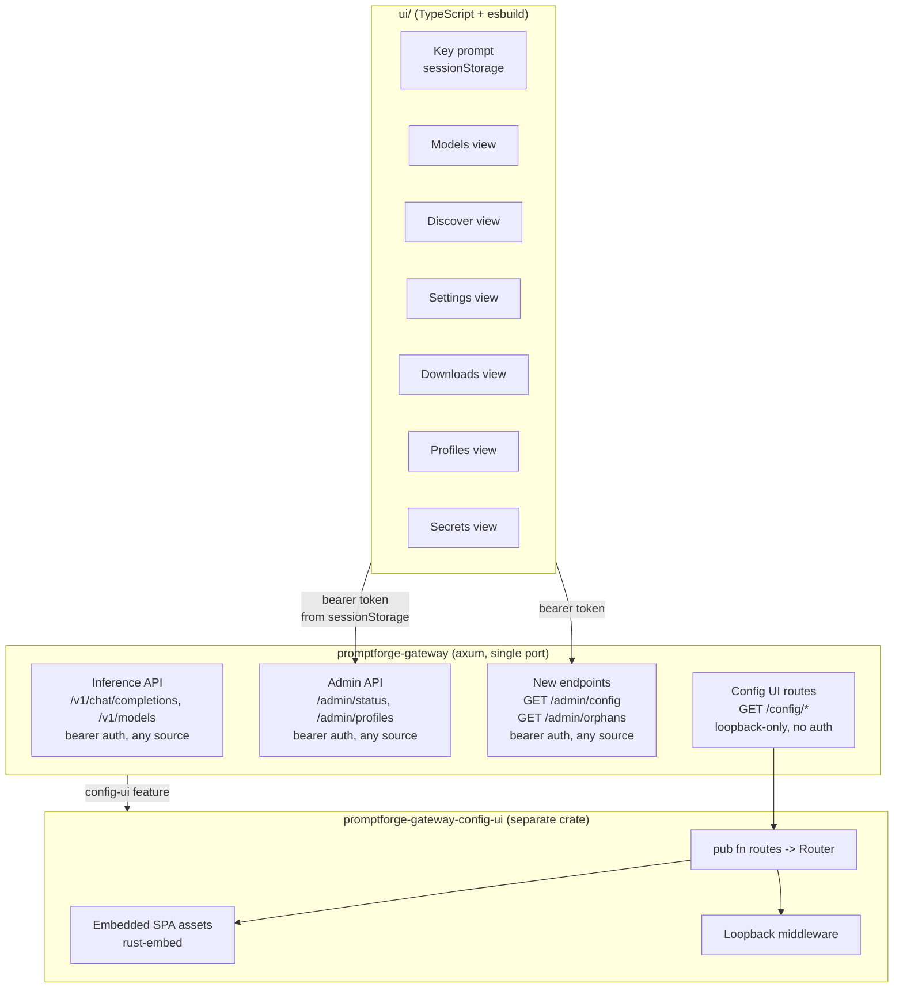

# Gateway Config SPA

## Fresh context bootstrap

Everything an executor needs that does not live in the plan body:

- **Repository:** `c:\Users\Vinnie\cursor\promptforge` (a git repo; workspace root is `c:\Users\Vinnie\cursor`). All plan paths are relative to the workspace root. Per the vibe rulebook: if the worktree is dirty at run start, stop and tell the user to commit or stash first. The tool never pushes.
- **Rulebooks (read before executing):**
  - `c:\Users\Vinnie\cursor\tools-public\rulebooks\vibe-rulebook.md` - execution model
  - `c:\Users\Vinnie\cursor\tools-public\rulebooks\rust-rulebook.md` - all Rust work
  - `c:\Users\Vinnie\cursor\tools-public\rulebooks\html-css-rulebook.md` - all SPA markup/CSS
- **Unsloth reference source:** `c:\Users\Vinnie\cursor\unsloth\studio\frontend\src\` (a local checkout of the unslothai/unsloth monorepo, AGPL-3.0 - read for layout values and design only; never copy code). The "Unsloth source reference map" section below indexes into it.
- **Visual references (screenshots of the Unsloth target):**
  - Model Hub (Discover): `C:\Users\Vinnie\.cursor\projects\c-Users-Vinnie-cursor\assets\c__Users_Vinnie_AppData_Roaming_Cursor_User_workspaceStorage_70d1070fbc17b15dcfcb6aa0345a5424_images_image-d15506db-caad-4b54-96c9-19a453b73839.png`
  - Settings > System page: `...\image-56aff5aa-6441-4830-9dec-ba27fb6fd6a2.png` (same directory)
  - Model detail card with quant selector + Download: `...\image-09ad9fe6-f528-4867-8518-2a5cd9104fe0.png` (same directory)
- **Brand assets:** the medallion icon is `promptforge/crates/promptforge-workshop-server/ui/icons/promptforge-icon-1.png` (cold state). Frames 2-5 of a cold-to-hot sequence exist in `promptforge/crates/promptforge-desktop-shell/assets/icons/` for a future activity animation - not in scope for this plan, but the config-ui should load the icon from a shared, copied asset in its own `ui/icons/`.
- **Known AGENTS.md files** (gather the full manifest per vibe rule 3 before dispatching): `promptforge/crates/promptforge-workshop-server/AGENTS.md`, `promptforge/crates/promptforge-workshop/AGENTS.md`, `promptforge/crates/promptforge-desktop-shell/AGENTS.md`. Check for a root `promptforge/AGENTS.md` and any others.
- **Run ledger:** main keeps `vibe-ledger.md` and the review subagent writes `vibe-review.md` in `c:\Users\Vinnie\cursor\cabinet\_scratch\gateway-config-spa\` (create the directory at run start).
- **Toolchain:** Node >= 22 for the esbuild pipelines (`npm ci` once in each `ui/` directory), Rust 1.89+ (workspace MSRV), Windows host.

## Architecture



### Single-port design, separate crate

The config UI is served on the gateway's own port - no second listener. But the SPA assets, the esbuild pipeline, the loopback middleware, and `rust-embed` all live in a **separate crate** (`promptforge-gateway-config-ui`), keeping the gateway lean. The gateway pulls it as an optional dependency behind the `config-ui` feature flag (same pattern as `workshop = ["dep:promptforge-workshop-server"]`), and mounts the crate's exported routes at `/config/*` in `build_router`.

A headless build without `config-ui` never compiles the config-ui crate, never needs Node for esbuild, and adds nothing to the binary.

**Loopback guard:** Two layers, because the routes live in two places. The config-ui crate wraps its `/config/*` asset routes in a middleware that extracts `ConnectInfo<SocketAddr>` and checks `remote_addr.ip().is_loopback()` (403 otherwise). The **new admin config endpoints** (everything in the "Complete endpoint list" section except the "existing endpoints reused" line: config read/write, env, orphans, system, model-info, hf proxy, profiles create/delete, reveal) get the same loopback-only middleware applied in the gateway's `build_router` - they hold secrets in plaintext (`GET /admin/env`) and write files, so they must never be reachable from the LAN even with the bearer key. The middleware is a small shared function in the tiny always-on crate `promptforge-gateway-loopback` (axum-only), re-exported by the config-ui crate and depended on unconditionally by the gateway, so the check exists in exactly one place AND headless builds (no config-ui feature) still carry the wall without pulling in rust-embed or the Node pipeline. (As-built change from the original design, which placed the function in the config-ui crate: that crate is optional, but the wall must exist in every build.) Existing admin routes (`/admin/status`, `/admin/profiles`, `/admin/switch-profile`, `/admin/progress`) and inference routes keep their current bearer-only, any-source behavior.

**Auth model:** Config UI static assets (HTML/CSS/JS) are served at `/config/` with the loopback guard but **no bearer auth** - they're just the SPA shell with no secrets. The SPA prompts for the gateway's bearer key on first load, stores it in `sessionStorage`, and sends it as the `Authorization` header on all admin API calls. No proxy layer, no credential forwarding, same-origin requests.

### Crate layout

- **New crate:** `promptforge-gateway-config-ui` - owns the SPA assets, build pipeline, `rust-embed`, loopback middleware, and exports `pub fn routes() -> Router`
- **Feature on gateway:** `config-ui = ["dep:promptforge-gateway-config-ui"]` - pulls the crate and mounts its routes in `build_router`. (As-built change, user-directed after step 24: `config-ui` joined the gateway's default feature list and the desktop app pins it explicitly - both shipped binaries always carry the config UI. Cost accepted: default builds require Node 22. Policy recorded in the repo's root AGENTS.md "Binaries and features" section.)
- **UI dir:** `promptforge-gateway-config-ui/ui/` - TypeScript SPA with its own `package.json` and esbuild pipeline, same pattern as `promptforge-workshop-server/ui/`
- **Embedding:** `rust-embed` with `#[folder = "ui/dist/"]` in the config-ui crate; debug reads from disk, release embeds into the gateway binary transitively
- **No `[config_ui]` boot section.** The feature flag alone controls whether the routes are mounted. No configuration needed - the UI is always at `/config/` on the gateway's existing port, loopback-only.

## Backend changes

### 1. Add `Serialize` to config types

In [`promptforge-gateway-config/src/config.rs`](promptforge/crates/promptforge-gateway-config/src/config.rs) and companion modules, add `Serialize` to all pub config structs and enums that lack it. `Secret` fields get `#[serde(serialize_with = "ser_redacted")]` emitting `"***"` - the UI shows a password field, never echoes secrets.

Types needing `Serialize` added:
- Structs: `ServerConfig`, `LocalConfig`, `DominionConfig`, `EndpointConfig`, `ModelConfig`, `LocalModelConfig`, `ToolsConfig`, `WebSearchConfig`, `WorkshopConfig`, `WorkshopVoiceConfig`, `WorkshopTapeConfig`, `SpeculativeConfig`, `MultimodalProjectorConfig`
- Enums: `Protocol`, `DominionKind`, `QueuePolicy`, `SearchProvider`, `SpeculationType`
- Newtype: `DraftTokenMax` (custom `Serialize` impl)

### 2. New endpoint: `GET /admin/config`

Returns the full resolved config as JSON. `Config` itself has no serde impls (validated construction only), so the endpoint serializes through `RawConfig`: step 1 adds `Serialize` to `RawConfig` (private, crate-internal) plus a `Config::to_raw()` (or equivalent) that reconstructs the raw shape via the existing accessors. `Secret` fields serialize as `"***"`.

**Provenance is part of the payload.** The UI's "from common.toml" annotations require knowing which file each entry came from, and the merged `Config` does not carry that today. The profile loader's merge pass (`merge.rs`) is extended to record the origin file of every keyed-array entry (`[[model]]`, `[[local_model]]`, `[[endpoint]]`, `[[dominion]]`) and every overridden table path, returned as a `source_file` field per entry in the JSON. This is additive backend work in `promptforge-gateway-config`, covered by step 2's tests.

**Secret round-trip rule:** the UI never sends a real secret back. On write, any secret field arriving as `"***"` means "preserve the existing value from the current file" - the write path substitutes the on-disk value before serializing. A secret only changes when the UI sends a new literal value or a `${VAR}` reference.

### 3. New endpoint: `GET /admin/orphans`

Scans `<cache_dir>/models/` and diffs against loaded `[[local_model]]` entries. Returns one list:
```json
{
  "orphans": [
    { "path": "models/Qwen3-8B-Q4_K_M.gguf", "size_bytes": 4900000000, "sha256": "..." }
  ]
}
```
Only available with the `local` feature.

### 4. Config UI feature and route mounting

In [`promptforge-gateway/Cargo.toml`](promptforge/crates/promptforge-gateway/Cargo.toml):
```toml
config-ui = ["dep:promptforge-gateway-config-ui"]
```

In [`promptforge-gateway/src/lib.rs`](promptforge/crates/promptforge-gateway/src/lib.rs), `build_router` conditionally nests the config-ui crate's exported routes behind `#[cfg(feature = "config-ui")]`:

```rust
#[cfg(feature = "config-ui")]
let router = router.nest("/config", promptforge_gateway_config_ui::routes());
```

The config-ui crate's `routes()` returns a `Router` with the loopback middleware already applied and all asset routes mounted. The gateway crate has no `config_ui.rs` module, no stub - just the one-line nest call.

## SPA architecture

### Build pipeline

Copy from workshop: `ui/package.json` (esbuild 0.28, TypeScript 7, Node >= 22), `ui/build.mjs` (esbuild bundle, `--watch` for dev, `--package` for release). The **config-ui crate's own** `build.rs` runs the SPA build (debug: esbuild + disk, release: verify manifest + embed), same pattern as the workshop's `build.rs` - the gateway's `build.rs` is untouched, since `rust-embed`'s `#[folder]` resolves relative to the config-ui crate.

Dependencies: esbuild + TypeScript + **Lucide icons** + **marked** (README rendering, same version as workshop). No framework - vanilla TypeScript with DOM APIs, same as the workshop UI. No React, no Svelte.

SPA tests run under `node --test` with `jsdom`, same as the workshop UI's test setup.

### Icons: Lucide (both config-ui and workshop)

Use [Lucide](https://lucide.dev) (MIT license) as the icon system for **both** the new config-ui SPA and the existing workshop UI. Lucide is the same icon set llama.cpp's web UI uses.

**How it integrates:**
- Add `lucide` (the vanilla JS package, not `lucide-react`) as a dependency in both `promptforge-gateway-config-ui/ui/package.json` and `promptforge-workshop-server/ui/package.json`
- Import individual icons by name: `import { Cpu, MemoryStick, HardDrive, Download, Search, Settings, Trash2, RotateCcw } from "lucide"`
- Each import is a tree-shakeable function returning SVG path data; esbuild bundles only the icons actually used
- Icons render as inline SVGs with `currentColor` - they inherit the molten lava accent (or any theme color) via CSS `color` on the parent element
- A small `icon.ts` helper component wraps creation: `createIcon("cpu", { size: 16, className: "status-icon" })` returns an `SVGElement`

**Icons needed for config-ui:**
- Tab bar: `layers` (Models), `search` (Discover), `download` (Downloads), `folder` (Profiles), `key` (Secrets), `settings` (Settings)
- System metrics: `cpu`, `memory-stick`, `circuit-board`, `hard-drive`
- Model rows: `cloud` (remote), `chip` (local), `eye`, `eye-off`, `star`
- Controls: `trash-2` (delete), `rotate-ccw` (reset field), `x` (cancel/close), `check` (confirm), `plus` (add), `chevron-down/right` (collapsible sections), `help-circle` (per-field help tooltips), `external-link` (HF links), `folder-open` (reveal in folder)
- Status: `circle` (status dots - colored via CSS), `alert-triangle` (warnings), `info` (notes)

**Workshop UI icon migration (replace hand-inlined SVGs with Lucide imports):**

The workshop already uses Lucide-identical SVGs, but they're hand-pasted as HTML string constants in [`promptforge-workshop-server/ui/src/chat/utils/icons.ts`](promptforge/crates/promptforge-workshop-server/ui/src/chat/utils/icons.ts) (12 icons: copy, check, edit, settings, paperclip, chevron-right, git-branch, more-horizontal, more-vertical, pin, pin-off, trash). Nine consumer files import from that module.

Migration:
1. Add `lucide` to [`promptforge-workshop-server/ui/package.json`](promptforge/crates/promptforge-workshop-server/ui/package.json) as a dependency
2. Rewrite `icons.ts` to import from `lucide` and re-export SVG HTML strings via a helper that calls `createElement` and serializes (preserving the current `innerHTML` assignment pattern the consumers use), or switch consumers to a `createIcon` element-based API matching the config-ui helper
3. Delete all hand-inlined SVG path data from `icons.ts`
4. Verify the 9 consumer files still work: `turn-footer.ts`, `feed-node.ts`, `thinking-plugin.ts`, `tool-run-group.ts`, `tool-row.ts`, `html.ts` (code block copy), `settings-plugin.ts`, `edit-plugin.ts`, `attachment-plugin.ts`, `sidebar.ts`, `feed.ts`
5. Add any new Lucide icons the window menu and status bar want (menu items currently have no icons; adding them from Lucide becomes trivial once the dependency is in place)

### UI design rule: Unsloth-first, no invention

**Strict execution rule for the entire plan.** Do not invent UI elements. For every component, control, layout pattern, and interaction:

1. Look at Unsloth Studio/Desktop first. If they have the element, copy it verbatim - layout, spacing, control type, label placement, interaction behavior.
2. If Unsloth has something similar but not identical, adapt it with the minimum change needed.
3. Only if Unsloth has nothing remotely applicable, fall back to the other researched UIs (LM Studio, Open WebUI, KoboldAI Lite, llama-swap) in that priority order.
4. **Flag every UI element that had to be invented** (not found in any of the researched UIs) with a `[INVENTED]` comment in the source code and a note in the PR description. The goal is zero invented elements.

This applies to: component structure, control types (slider vs input vs dropdown), label/help text placement, section grouping, navigation patterns, modal/dialog behavior, empty states, error states, loading states, and responsive breakpoints.

### Design tokens (CSS custom properties)

- `--bg-primary: #0F0F0F` (near-black, Unsloth-matching)
- `--bg-secondary: #1A1A1A` (cards, tab bar)
- `--bg-tertiary: #252525` (inputs, hover)
- `--text-primary: #E8E8E8`
- `--text-secondary: #888888`
- `--accent: #E05A2B` (molten lava core)
- `--accent-hover: #F07030` (hotter)
- `--accent-subtle: rgba(224, 90, 43, 0.15)` (selected rows, active tabs)
- `--accent-gradient: linear-gradient(90deg, #8B2500, #E05A2B, #F09030, #FFD080)` (progress bars)
- `--danger: #DC3545`
- `--success: #28A745`
- `--warning: #F09030`
- `--border: #2A2A2A`
- `--radius: 8px`
- `--font: system-ui, -apple-system, sans-serif`
- `--font-mono: ui-monospace, "Cascadia Code", monospace`

### Module structure

```
ui/src/
  main.ts              - entry: key prompt, hash router, composition root
  styles/
    base.css           - reset, tokens, typography
    controls.css       - slider, toggle, dropdown, input, chip-input components
    layout.css         - tab bar, master-detail split, banners
  services/
    gateway-api.ts     - fetch wrapper with bearer from sessionStorage; 401 -> key prompt
    hf-api.ts          - HF search/model/README via gateway proxy
    system-api.ts      - GET /admin/system polling (5s interval)
    download-store.ts  - global download state (survives navigation)
    config-store.ts    - running config, pending config, dirty state, shadow actions
  views/
    models-view.ts     - master-detail: model list + detail pane
    discover-view.ts   - HF search with quant picker + README
    downloads-view.ts  - active downloads, history
    profiles-view.ts   - profile list, create/delete/switch, include chain editor
    secrets-view.ts    - .env editor, HF_TOKEN dedicated field
    settings-view.ts   - System / Gateway / Workshop / Dominions / Endpoints / Tools / About
  components/
    tab-bar.ts         - top tab bar: medallion (standalone), profile switcher, tabs, Apply/Revert, connection dot
    profile-switcher.ts- active-profile dropdown in the tab bar (workshop Model-menu Profiles pattern)
    metric-tile.ts     - CPU/RAM/VRAM/Disk card (Settings > System)
    key-prompt.ts      - first-load API key screen (standalone only)
    model-row.ts       - one row in the model list
    model-detail.ts    - detail pane: registry-driven form + provenance annotations
    slider-control.ts  - slider + click-to-type readout
    toggle-control.ts  - on/off switch
    dropdown-control.ts- styled select
    chip-input.ts      - tag/chip entry (effort_levels, endpoints multi-select)
    search-bar.ts      - debounced input with filter chips
    progress-bar.ts    - lava gradient progress
    settings-registry.ts - setting declarations as data, one renderer
    confirm-modal.ts   - confirm dialog (delete, revert)
    apply-overlay.ts   - full-screen SSE stage progress for Apply/switch
    toast.ts           - bottom-right toast stack
    banner.ts          - persistent top banners (pending changes, restart required)
    markdown.ts        - marked wrapper for README rendering
```

## UI specification (complete element inventory)

Every element below is tagged: **[Unsloth]** copied verbatim, **[Adapted: source]** minimally changed from the named UI, **[INVENTED]** no researched precedent (flagged in code and PR).

### Global shell (two modes)

The config UI runs in two modes, detected at load time:

**1. Workshop panel mode** - loaded inside the workshop's webview as a panel. The workshop and the config UI are different origins (different ports), so the workshop cannot set `window` properties on the config UI directly. Instead:
- The workshop hosts the config UI in an iframe inside a dockview panel, loading it with `?mode=panel` in the URL.
- The config UI detects `mode=panel` at boot and mounts panel-only content (no tab bar medallion, no key prompt - see auth note below).
- The bridge is `postMessage`: the workshop listens for action messages (`apply`, `revert`, `download-started`) and owns all progress display; the config UI listens for context messages (theme, initial route).
- Auth in panel mode: the workshop already holds the gateway bearer key server-side. The config UI in panel mode routes its API calls through `postMessage` to the workshop, which forwards them with the key attached - the key never enters the iframe. (Standalone mode uses the key prompt as before.)
- Accessed from a workshop menu item ("Gateway Config" in the Window menu, next to Workshop Panel).

**2. Standalone mode** - loaded directly in a browser at `http://localhost:8081/config/`. In this mode:
- Full shell: tab bar (medallion, profile switcher, tabs, Apply/Revert All, connection dot), progress strip, key prompt - the config UI owns all its own chrome.
- Entirely self-contained; no workshop dependency.

Detection: `new URLSearchParams(location.search).get("mode") === "panel"` at boot. The SPA's composition root either mounts the full shell or the panel-only content based on this check.

**Hash routing (both modes):** `#/models`, `#/models/{name}`, `#/discover`, `#/downloads`, `#/profiles`, `#/secrets`, `#/settings/{section}` **[Adapted: llama.cpp]** `#/settings/<section>` routed pages. In panel mode, the workshop panel host may set the initial hash.

### Global shell - standalone mode elements

- **Tab bar** as the single top element: PromptForge medallion left (standalone only - workshop already shows it), then the **profile switcher**, icon+label tabs center, Apply/Revert All right **[Adapted: Unsloth]** Discover/On Device segmented toggle extended to a full tab bar.
- **Profile switcher** in the tab bar, left of the tabs: a dropdown button showing the active profile name (from `GET /admin/status`) with a `chevron-down`. Opening it lists every profile from `GET /admin/profiles` with the active one checked **[Adapted: workshop]** - the workshop's Model menu Profiles section is exactly this pattern (radio rows, check on active, pending mark while switching). Selecting another profile runs `POST /admin/switch-profile` with the SSE stage overlay. While a switch is in flight, all rows disable and the target shows a pending mark - same behavior as the workshop menu. The Profiles *view* remains the management surface (create/delete/includes); the tab bar switcher is the fast path.
- **No left sidebar.** 6 flat destinations don't justify 280px of sidebar.
- **No persistent hardware strip.** System stats (CPU, RAM, VRAM, Disk) live in Settings > System, like Unsloth. Hardware info is consulted, not monitored - it doesn't need to be always-visible.
- **Main content** below tab bar, full width per view. Models and Discover use master-detail split within their view area.
- **Tab bar styling:** tabs `h-10 px-4 gap-2`, Lucide icon + label, active tab `border-b-2 border-accent text-accent`, inactive `text-muted-foreground`, all `rounded-none` (horizontal underline, not pill). Tab bar background `--bg-secondary`.

### Standalone layout

```
+--[icon]--[default v]--[Models][Discover][Downloads][Profiles][Secrets][Settings]--[Apply(3)][Revert]--+
+--------------------------------------------------------------------------------------------------------+
|                                                                                                          |
|                                    View content (full width)                                             |
|                                                                                                          |
+----------------------------------------------------------------------------------------------------------+
```

### Hardware metrics (Settings > System only)

System stats live exclusively in the Settings > System tab - there is no persistent hardware strip. The four metric cards use the `MetricTile` pattern **[Unsloth]** (see Unsloth source reference map):

- **CPU card:** `cpu` Lucide icon, frequency ("2.50 GHz"), "192 logical / 96 physical", thin utilization bar.
- **RAM card:** `memory-stick` icon, "100.9 / 1023.3 GiB", thin usage bar.
- **VRAM card:** `circuit-board` icon, "57.3 / 95.6 GiB", segmented bar (model-allocated vs free), GPU name below in muted text.
- **Disk card:** `hard-drive` icon, cache-drive usage "747.6 GB / 4 TB", thin bar.
- **GPU vendor badge** on the VRAM card: colored text chip - "NVIDIA" `#76B900`, "AMD" `#ED1C24`, "Intel" `#0068B5` **[Adapted: Unsloth]** plain GPU name; we add a colored vendor chip. No trademark logo art.
- **Data source:** `GET /admin/system`, polled every 5s only while the System tab is visible **[Adapted: Open WebUI]** job polling. New gateway dependencies: `sysinfo` (CPU/RAM/Disk) and `nvml-wrapper` (GPU name/VRAM, optional - no GPU means the VRAM card and vendor badge are hidden, not errored).

The tab bar's right cluster holds: connection dot (green = gateway reachable) **[Adapted: llama-swap]**, and **Apply (N)** + **Revert All** buttons rendered only when shadow files exist **[INVENTED]**.

### Key prompt screen (first load / 401)

Centered card on `--bg-primary` **[Adapted: Unsloth]** local auth bootstrap screen:
- Cold medallion icon (`promptforge-icon-1.png`), "PromptForge Gateway" title.
- Password input labeled "API key", submit button in accent.
- Wrong key: inline error "Invalid API key" below the input.
- Key stored in `sessionStorage`; any API 401 returns to this screen.

### Models view

Master-detail **[Unsloth]** Model Hub "On Device" tab:

- **Toolbar:** debounced search input (client-side filter), filter chips: All / Local / Remote / Unconfigured, sort dropdown (Name / Size / Kind) **[Unsloth]** filter bar.
- **List rows:** status dot (green running / gray stopped / red error, from `/admin/status`), name in `--font-mono`, kind badge pill, quant badge parsed from filename, file size, source icon (`chip` local / `cloud` remote) **[Adapted: llama-swap]** ModelsDash rows.
- **Selected row:** `--accent-subtle` background **[Unsloth]**.
- **Unconfigured section** at list bottom: divider "Unconfigured files on disk", rows with filename, size, **[Adopt]** and **[Delete]** buttons **[Adapted: Jan]** Import flow + LM Studio per-row kebab actions.
- **Empty state:** "No models configured" with [Add Local Model] [Add Remote Model] [Search Hugging Face] buttons **[Unsloth]** empty-state pattern.
- **Loading:** skeleton rows (pulsing `--bg-tertiary` rectangles) **[Unsloth]**.

### Model card - local model (detail pane)

**Header** **[Unsloth]** detail card:
- Name as large editable heading (text input styled as title).
- Status dot + status text, kind badge, quant badge, file size.
- Source path with `folder-open` icon button (reveal in folder via `POST /admin/reveal`) **[Adapted: LM Studio]** "Reveal in File Explorer".
- Action row: **Save** (accent, enabled when dirty), **Reset** (outline), **Delete** (danger outline, confirm modal naming file + size).

**Sections** (collapsible, `chevron-right`/`chevron-down`) - section grouping **[Adapted: LM Studio]** load panel:

- **GPU & Memory:** `gpu_layers` slider 0-200 with Max detent, readout "N / total" when GGUF layer count is known (`GET /admin/model-info`), plain "N" otherwise; `vram_gb` number input (visible only when a local dominion is bound); `flash_attention` toggle; `cache_type_k` dropdown (f16/q8_0/q4_0); `cache_type_v` dropdown, **disabled unless flash_attention is on** **[LM Studio]** dependency rule.
- **Context & Generation:** `context` slider (log scale 512-262144) **[Adapted: KoboldAI Lite]** slider+typeable readout; `n_predict` slider 256-32768; `parallel` slider 1-16; `thinking` dropdown; `chat_template_file` path input.
- **Source & Verification:** `source` text input, `sha256` hex input, `dominion` dropdown (local-kind dominions + None).
- **Speculative Decoding** (rendered only when configured, or via an "Add speculative decoding" button): type dropdown, source, sha256, `draft_max` slider 1-16.
- **Multimodal Projector** (same conditional pattern): source, sha256. When present, the `images` capability toggle shows on with note "Implied by multimodal projector."
- **Capabilities:** `max_output` input, `default_temperature` input (0.0-2.0 step 0.1), `images` toggle, `parallel_tool_calls` toggle, `effort_levels` chip input **[Adapted: Open WebUI]** stop-sequence chips, `default_effort` dropdown populated from effort_levels, `adaptive_thinking` toggle (visible when thinking != never).

### Model card - remote model

Same header minus file info, `cloud` icon. Sections:
- **Routing:** `upstream` text input; `endpoints` multi-select chips from configured endpoint ids **[Adapted: Open WebUI]** connections picker.
- **Context & Generation:** context slider, thinking dropdown, `default_max_tokens` input, `tool_dialect` dropdown (chat kind only).
- **Capabilities:** same block as local.

### Inheritance and provenance (core UX rules)

The merge semantics in [`merge.rs`](promptforge/crates/promptforge-gateway-config/src/profile/merge.rs) produce **two different override behaviors**, and the UI encodes both:

1. **Table fields** (`[local]`, `[tools]`, scalars): recursive field-level merge. Overriding writes just that one key to the leaf file.
2. **Keyed array entries** (`[[model]]`, `[[local_model]]` by `name`; `[[endpoint]]`, `[[dominion]]` by `id`): an overlay entry **replaces the whole entry**. Overriding any field of an inherited model copies the entire definition into the leaf file.

UI rules **[INVENTED]** - no researched UI has include-chain inheritance; the dirty-dot/reset pattern is **[Adapted: llama.cpp]** server-default indicators:

- Field defined in the active file: normal rendering, no annotation.
- Field inherited: muted annotation "from common.toml" below the label. The annotation is a link: "Edit in common.toml" drills into that file (breadcrumb: `default.toml > common.toml`).
- First time a user edits an inherited **array entry** per session: one-time info note - "This copies the full model definition into default.toml as an override. To change it for every profile that includes common.toml, edit common.toml instead." Dismissible.
- Pending field (saved to shadow, not applied): "pending" chip next to the label; tooltip shows the currently-running value.
- Dirty field (edited, not saved): orange dot + per-field reset (`rotate-ccw`) button.

### Profiles view

**[INVENTED]** as a whole (no researched UI manages profiles); individual elements are copied patterns:

- **Left: profile list** from `GET /admin/profiles`. Active profile: green dot + "Active" pill **[Adapted: llama-swap]** profiles list.
- **[New Profile]** button: dialog with name input and "Start from" radio group **[Adapted: Unsloth]** pill selectors - Empty / Copy of [dropdown of profiles] / Include [dropdown] (creates a leaf whose only content is `include = ["that.toml"]`).
- **Per-row kebab menu:** Set Active (runs switch-profile with the SSE overlay), Delete (confirm modal; server refuses deleting the active profile) **[Unsloth]** row hover actions.
- **Right: profile summary card:** name, model counts, allowlist chip summary, and the **include chain editor**:
  - Ordered rows: drag handle **[Adapted: Open WebUI]** drag-reorder, path text, exists/missing indicator, [Edit] (drill in) and [X] (remove from chain) buttons.
  - [Add Include] button: autocomplete over existing `.toml` files in the profiles dir, plus "Create new file" **[Adapted: Open WebUI]** combobox.
  - Note under the list: "Later files override earlier ones."
  - Cycle/depth errors surface from server validation on Save.

### Discover view

**[Unsloth]** Model Hub Discover tab, verbatim layout:
- Search bar (300ms debounce), accepts keywords, `user/repo`, pasted HF URLs **[Adapted: LM Studio]** paste-a-URL.
- Filter chips: GGUF (locked on), capabilities filter, sort dropdown (Most downloads / Trending / Newest).
- Results list (left): rows with publisher avatar (HF API avatar URL), name, param count, downloads, likes, relative updated time **[Unsloth]** row anatomy.
- Detail card (right): name, publisher + verified badge, tags, **quant picker table** - rows of quant name / exact file size / fit badge, one row starred "Recommended" **[Unsloth]** quant selector + **[LM Studio]** fit badges.
- **Fit badge heuristic:** green "Fits GPU" when size x 1.2 < free VRAM; yellow "Partial offload" when < total VRAM; gray "CPU only" when < free RAM; red "Too large" otherwise **[Adapted: LM Studio]** four-state fit model.
- **README** rendered below the card via `marked` (same dependency the workshop already uses) **[Unsloth]** model card rendering. Images load from whatever URLs the README references; browser cache handles them.
- **No HF_TOKEN:** banner "Set HF_TOKEN in Secrets to enable Hugging Face search" with a link to the Secrets view **[Adapted: Open WebUI]** missing-connection notice.
- Download button -> `POST /v1/cache` SSE -> global download store -> progress shows in Downloads view and the top progress strip.

### Downloads view

- **Active cards:** filename, lava-gradient progress bar, percent, speed, ETA, cancel X **[Adapted: LM Studio]** download card + **[Jan]** global indicator.
- **Completed rows:** green check, filename, size, relative date, kebab with Delete **[Adapted: LM Studio]**.
- **Persistent thin progress strip** at the very top of the window while any download is active, visible from every view **[Adapted: LocalAI]** top-strip progress.

### Progress indicator

The config UI subscribes to `GET /admin/progress` (SSE) on startup and maintains a live progress state for everything the gateway does: downloads, model loads/unloads, profile switches, any operation that goes through the progress hub. This is the same SSE stream the workshop consumes - the config UI is an independent subscriber and works whether or not the workshop is connected.

**Progress surfaces in three places (standalone mode):**
1. **Downloads view** - per-download cards with lava-gradient bars, sourced from progress events whose label matches the download path.
2. **Tab bar** - the thin progress strip along the tab bar's top edge and a badge count on the Downloads tab icon.
3. **Apply overlay** - during a profile switch (Apply or Set Active from Profiles), progress events for `loading-profile`, `stopping-models`, `starting-models` stages are shown in a full-screen overlay with per-stage status (spinner -> check -> error) **[Adapted: Unsloth]** full-screen phase overlay.

The progress hub is a core gateway component (`AppState.hub`, always present), not a workshop feature. `GET /admin/progress` exists in every build.

**Standalone mode:** the config UI subscribes to the SSE stream directly and renders its own progress visuals (download cards, top strip, Apply overlay).

**Workshop panel mode:** the config UI does **not** subscribe to progress - the workshop is already subscribed and owns all progress display. The config UI dispatches actions (start download, apply config) and the workshop's status bar shows the results. No duplicate progress bars, no duplicate SSE subscriptions.

### Secrets view

- **HF Token card:** dedicated password input with show/hide `eye` toggle, [Test Connection] button (calls HF `whoami` via the gateway proxy), status text (Valid / Invalid / Not set) **[Adapted: Unsloth]** HF token field with inline validation.
- **Environment Variables card:** rows of KEY = password-input value, [X] delete per row, [Add Variable] row at bottom **[Adapted: Open WebUI]** key-value editing.
- Each variable annotated with "used by: endpoint 'openai' api_key" cross-references, computed by scanning the TOML for `${VAR}` **[INVENTED]** - small, flagged.
- Save writes the `.env.next` shadow; note under the card: "Applied on restart or profile switch."

### Settings view

Secondary nav column **[Unsloth]** settings category list: System / Gateway / Workshop / Dominions / Endpoints / Tools / About.

- **System:** the 2x2 live monitor card grid + GPU Devices section with segmented VRAM bar **[Unsloth]** verbatim.
- **Gateway:** bind text input, api_key password field, "Restart required to apply" note.
- **Workshop:** bind input, open_browser toggle, voice/tape collapsible sub-sections.
- **Dominions / Endpoints:** expandable cards per entry with the fields from the per-TOML section spec, [Add] button at bottom, "used by" chips, delete with dependent-warning **[Adapted: Open WebUI]** connections management.
- **Tools:** web_search card (provider locked dropdown, api_key password, count inputs, strip_tracking toggle).
- **About:** cold medallion, version, license link **[Unsloth]** about dialog content.

### Global states inventory

- **Loading:** skeleton rows **[Unsloth]**.
- **Inline error:** banner at top of the view, red left border, message + retry **[Adapted: Open WebUI]**.
- **Gateway unreachable:** full-screen splash - medallion icon, "Gateway unreachable", auto-retry with backoff + manual Retry button **[Adapted: llama.cpp]** ServerErrorSplash.
- **Pending changes banner** (shadows exist at UI load): "You have N pending changes from a previous session" + [Review] [Apply] [Revert All]. Review opens a diff view of pending vs running **[INVENTED]** - diff view is a simple two-column value table, not a text diff. (As-built note: the banner shipped in step 16; the [Review] diff view is assigned to step 21, which closes out the SPA views. Falsifier: if step 21 runs long, the diff view moves to its own follow-up commit.)
- **Restart banner** (boot shadow applied): persistent, "Restart the gateway to apply these changes" **[INVENTED]** - flagged.
- **Toasts:** bottom-right stack, success/error/info, 4s auto-dismiss **[Adapted: Open WebUI]**.

### Modals and overlays

- **Confirm modal** (delete model/file, Revert All): title, body naming the target and size, [Cancel] outline + danger action **[Adapted: llama.cpp]** DialogConfirmation.
- **Apply/switch overlay:** full-screen dim, centered card listing SSE stages with per-stage spinner/check, terminal event closes it **[Adapted: Unsloth]** full-screen phase overlay.

### Element provenance summary

- **[INVENTED]** elements (all flagged in code + PR): Apply/Revert All button pair, provenance annotations and override notes, include chain editor, pending-changes banner, restart banner, pending-vs-running diff view, env-var cross-reference annotations.
- Everything else traces to Unsloth first, then LM Studio / Open WebUI / KoboldAI Lite / llama.cpp / llama-swap / Jan / LocalAI as noted inline.

### Complete endpoint list

Read:
- `GET /admin/config` - running config as JSON (Serialize derives; secrets redacted)
- `GET /admin/config-pending` - merged view: real files overlaid with shadows
- `GET /admin/config-dirty` - `{ dirty, pending_files, changed_sections }` from shadow existence
- `GET /admin/orphans` - GGUF files on disk with no `[[local_model]]` entry
- `GET /admin/system` - CPU/RAM/Disk (sysinfo), GPU name/VRAM (NVML, optional)
- `GET /admin/model-info?path=` - GGUF header parse: layer count, param count (for the "N / total" slider readout; optional, UI falls back to plain N)
- `GET /admin/hf/search?q=...` and `GET /admin/hf/model/{repo}` - HF proxy using `HF_TOKEN` from the process env
- `GET /admin/env` - parsed `.env` variables (values included; the UI is loopback-only and already holds the master key)

Write (all write shadows, never real files):
- `PUT /admin/config` - active profile leaf shadow + merged-chain validation
- `PUT /admin/boot-config` - boot config shadow
- `PUT /admin/include/{path}` - included-file shadow
- `PUT /admin/env` - `.env.next` shadow
- `POST /admin/config-apply` - promote all shadows, reload profile (or restart-required for boot)
- `POST /admin/config-revert` - delete all shadows
- `POST /admin/profiles/{name}` - create profile (empty / copy / include)
- `DELETE /admin/profiles/{name}` - delete profile file (refused when active)
- `POST /admin/reveal` - open the OS file manager at a path (loopback-only)

Existing endpoints reused: `GET /admin/profiles`, `GET /admin/status`, `POST /admin/switch-profile` (SSE), `GET /admin/progress` (SSE), `GET /v1/models`, `POST /v1/cache` (SSE), `GET /v1/cache`, `DELETE /v1/cache/{sha256}`, `GET /health`.

### Settings registry pattern (from llama.cpp research)

Each setting declared as data, not markup:

```typescript
interface SettingDef {
  key: string;
  label: string;
  help: string;
  section: "memory" | "gpu" | "cache" | "generation" | "companion";
  type: "slider" | "toggle" | "dropdown" | "input";
  default: number | boolean | string;
  min?: number;
  max?: number;
  step?: number;
  options?: string[]; // for dropdowns
  dependsOn?: { key: string; value: unknown }; // e.g. cache_type_v depends on flash_attention=true
}
```

One renderer walks the registry and builds controls. Adding a setting later is one object, not new markup.

## Unsloth source reference map

Every element below maps to a specific file in `unsloth/studio/frontend/src/`. The codebase is React 19 + Tailwind v4 + shadcn/Radix; we re-implement in vanilla TS + CSS, using the same layout values and visual spec.

### Shell layout

- **Root layout:** `app/routes/__root.tsx` - flex column, sidebar peer layout via `SidebarProvider`
- **No persistent hardware bar exists in Unsloth, and we don't build one.** Hardware info appears in the Model Hub header (`features/hub/catalog/models-header.tsx`) as summary pills, and in Settings > System as the metric card grid. Our config UI puts system stats only in Settings > System, using the `MetricTile` pattern.

### Sidebar

- **File:** `components/app-sidebar.tsx`
- **Width:** 280px default (var `--sidebar-width`), min 260, max 480, collapsed icon rail 48px (`3rem`)
- **Nav item:** 33px tall, `rounded-full`, 8.5px gap, icon `~15px` + label `text-ui-14p5` (~13.6px), `font-medium`
- **Active state:** animated pill `bg-accent`, inactive text `#383835` light / `#c9c9c9` dark
- **Hover:** `bg-nav-surface-hover` (`#f0f0f0` light / `#2a2a2a` dark), icon bounce `scale(1.08)` 0.3s
- **Bottom:** user/profile row 44px, avatar 32px, settings gear overlay

### Model Hub (Discover + On Device)

- **Page shell:** `features/hub/hub-page.tsx` (`ModelsPage`)
- **CSS:** `features/hub/hub.css` - `--hub-measure: clamp(1100px, 94%, 1760px)`
- **Split left (list):** `clamp(460px, 32%, 620px)`, max 44%, `border-r`
- **Split right (detail):** `flex-1`, `--hub-measure-compact: clamp(860px, 94%, 1180px)`
- **Tabs (Discover/On Device):** `features/hub/catalog/models-toolbar.tsx` - segmented toggle `h-9 rounded-full w-[280px]`, sliding pill on transition
- **Search input:** `h-9 rounded-full border-0`, bg `.field-soft` (5% foreground), icon `left-3.5 size-4`, text `text-ui-13`
- **Filter dropdowns:** `features/hub/catalog/hub-option-menu.tsx` - trigger `h-9 rounded-full w-[128px]`, dropdown `rounded-[14px] p-1`

### Model list rows

- **Split rows:** `features/hub/catalog/models-table.tsx` (`ResultSplitRow`) - 64px virtual row (56px cell + 8px gap), avatar 32px `rounded-[9px]`, name `text-ui-12p5 font-semibold`, stats `text-ui-10p5 tabular-nums`
- **Card rows:** 86px virtual row (78px cell), avatar 52px `rounded-[16px]`, name `text-ui-15 font-semibold`
- **On Device rows:** `features/hub/catalog/models-catalog-rows.tsx` (`InventoryRow`) - avatar 36px `rounded-[12px]`, name `text-ui-13p5`
- **Selected row:** `data-[selected]:bg-foreground/[0.07]`
- **Virtualization:** `@tanstack/react-virtual` with fixed row heights

### Model detail card

- **Shell:** `features/hub/catalog/hub-detail-view.tsx` + `model-inspector.tsx` (`ModelInspector`)
- **Header avatar:** 60px `rounded-[18px]`, 4px gap
- **Title:** `text-ui-25 font-semibold leading-ui-31`
- **Publisher:** `text-ui-15 text-muted-foreground`
- **Tag row:** `gap-1.5`, pills h-6 `rounded-full px-2.5 text-ui-11p5 font-medium`
- **Quant selector:** `features/hub/catalog/gguf-download-card.tsx` - trigger `h-9 rounded-full px-3`, quant chips `h-5 rounded-full px-2 text-ui-11p5`, popover `min-w-[300px] max-h-[344px]`
- **Stat chips:** `px-2.5 py-1 text-ui-11p5` (downloads, likes, params, recency)
- **README:** `features/hub/catalog/model-readme.tsx` via markdown parser

### Capability pills

- **File:** `features/hub/catalog/shared.tsx` (`CapabilityPill`)
- **Dimensions:** h-6 `rounded-full px-2.5`, icon `size-3`, text `text-ui-11p5 font-medium`
- **Colors by capability:** vision indigo, conversational fuchsia, reasoning violet, code cyan, audio rose, embedding emerald, tools amber, multilingual sky - each at 10% bg / 700 text (light), 20% bg / 300 text (dark)

### Settings page

- **Shell:** `features/settings/settings-dialog.tsx` - modal `max-w-[960px] h-[820px]`
- **Category sidebar:** 248px, items h-32 `rounded-full pl-3`, text `text-ui-14p5`, animated active pill via `motion layoutId`
- **Section wrapper:** `features/settings/components/settings-section.tsx` - title `text-base font-semibold`, description `text-xs text-muted-foreground`
- **Row wrapper:** `features/settings/components/settings-row.tsx` - `py-3`, label `min-w-[11rem] flex-1`, control right-aligned

### Metric tiles (CPU/RAM/VRAM/Disk)

- **File:** `features/settings/tabs/resources-tab.tsx` (`MetricTile`)
- **Grid:** `grid gap-2 sm:grid-cols-2 py-3`
- **Card:** `rounded-xl p-4 gap-2.5`, border `border-border/60`, bg `bg-muted/20 dark:bg-white/[0.06]`
- **Label:** `text-ui-11 font-semibold uppercase tracking-[0.08em] text-muted-foreground`
- **Value:** `font-mono text-sm tabular-nums`
- **Bar:** `h-1.5 rounded-full bg-muted dark:bg-black/40`
- **Bar colors:** <70% `bg-control-accent`, 70-89% `bg-amber-500`, >=90% `bg-destructive`

### GPU devices section

- **File:** `features/settings/tabs/resources-tab.tsx` (inline in `ResourcesTab`)
- **Row:** `py-3`, name `text-sm font-medium`, subline `text-xs text-muted-foreground`
- **VRAM pill:** `rounded-full bg-control-accent/10 px-2 py-1 text-ui-10 font-semibold tabular-nums`
- **VRAM bar block:** `w-[392px]`, readings `font-mono text-ui-11 tabular-nums`, segment dividers `h-3 w-px bg-border`

### Model settings form (our detail pane's primary reference)

- **File:** `features/model-picker/components/model-config-page.tsx` - Unsloth's per-model settings page: label-left/input-right rows, the GPU slider (`AdvancedGpuSlider`), context slider with min/max labels below, `panel-slider` / `panel-switch` overrides, select triggers (`SELECT_TRIGGER_CLASS`).
- **Numeric readout:** `features/model-picker/components/numeric-value-input.tsx` (`NumericValueInput`) - the click-to-type number field paired with sliders, inline width `calc(Nch + 2px)`.
- **Panel control overrides:** `index.css` (`.panel-slider` ~L1269-1329, `.panel-switch` ~L1456-1464) - the muted 4px-track slider and switch styling used inside config panels.
- **Related:** `features/model-picker/components/chat-template-editor-dialog.tsx` (chat template editing - our `chat_template_file` field's cousin), `sidebar-model-config.tsx`.

### Primitives index (`components/ui/`)

Stock shadcn/Radix primitives we draw on, by our element:

| Our element | Unsloth file |
|---|---|
| Tab bar | `tabs.tsx` |
| Confirm modal (delete, Revert All) | `alert-dialog.tsx` |
| Dialogs (New Profile, browser-mode Add Folder) | `dialog.tsx` |
| Right-click context menus | `context-menu.tsx` |
| Filter/sort dropdowns, profile switcher | `popover.tsx`, `dropdown-menu.tsx`, `command.tsx` (autocomplete) |
| Per-field "?" help | `info-hint.tsx`, `tooltip.tsx` |
| Collapsible settings sections | `collapsible.tsx` |
| Empty states | `empty.tsx` |
| Loading skeletons | `skeleton.tsx` |
| Toasts | `sonner.tsx` |
| Quant picker table | `table.tsx` |
| Scrolling lists | `scroll-area.tsx` |
| New Profile "Start from" radio | `radio-group.tsx` |
| Kind/status badges | `badge.tsx` |
| Text inputs | `input.tsx`, `input-group.tsx`, `label.tsx`, `field.tsx` |
| Capability toggles beyond switches | `checkbox.tsx`, `toggle.tsx`, `toggle-group.tsx` |
| Progress bars | `progress.tsx` |
| Publisher avatars | `avatar.tsx` |
| Section dividers | `separator.tsx` |
| Include-chain breadcrumbs | `breadcrumb.tsx` |

### Controls reference

**Slider** (`components/ui/slider.tsx`):
- Default: track h-8 (8px), thumb 16px, `bg-primary`
- Panel override (`.panel-slider` in `index.css`): track 4px, thumb 14px, muted colors
- Value readout pattern: label left, `NumericValueInput` right (`h-8 w-[92px] rounded-full`), slider full-width below

**Switch** (`components/ui/switch.tsx`):
- Default: 32x18.4px track, 16px thumb
- Small: 24x14px track, 12px thumb
- Checked: `bg-control-accent`, unchecked: `bg-input`

**Select** (`components/ui/select.tsx`):
- Trigger: h-9 (default) or h-8 (sm), `rounded-full px-3.5`
- Content: `rounded-xl p-1`, item `rounded-[11px] py-2 pl-3 pr-8`

**Button** (`components/ui/button.tsx`):
- All `rounded-full`, default h-9 px-3, sm h-8, xs h-6
- Primary: `bg-primary text-primary-foreground`
- Outline: `border bg-background`, dark `bg-white/[0.06]`
- Destructive: `bg-destructive/10 text-destructive`

### Theme tokens (`index.css`)

- **Dark bg:** `#181818` (--background)
- **Muted:** `#242424` (--muted)
- **Border:** `#303030` (--border)
- **Text:** `#ececec` (--foreground), `#9b9b9b` (--muted-foreground)
- **Sidebar:** `#1f1f1f` (--sidebar), border `#2a2a2a`
- **Primary (accent):** `#17b88b` (Unsloth green; we use `#E05A2B` molten lava)
- **Control accent:** `#4dabff` dark (their blue switch/bar color; we use `#E05A2B`)
- **Radius:** 1.1rem (~17.6px) base, `rounded-full` for pills/buttons/inputs
- **Fonts:** Inter (sans), JetBrains Mono (mono), Space Grotesk / Hellix (headings)
- **Icons:** Hugeicons (`strokeWidth={1.75}`, `size-icon` ~15px); we use Lucide (same concept, MIT)

## UI behavior per TOML entry type

The gateway configuration lives in two layers: a **boot config** (`gateway.toml`) and one or more **profile configs** (`profiles/<name>.toml`). Profiles use `include = [...]` for recursive inheritance; later definitions replace earlier ones by `id` (endpoints, dominions) or `name` (models, local_models). Everything is editable; boot-owned sections write to the boot file's shadow and require a restart, profile sections write to profile shadows and apply via reload.

### Boot-owned sections (editable, restart required to apply)

These sections are fixed for the process lifetime - the gateway refuses profile switches that change them. But the UI lets users edit and save them to disk. A persistent banner appears after saving: "Restart the gateway to apply these changes." The banner stays until the gateway restarts (detected by polling `/health` and comparing boot time or a generation counter).

#### `[server]` - gateway listener

Fields: `bind` (socket address), `api_key` (secret).

**UI behavior:** displayed in the Settings view's "Gateway" card, fully editable. `bind` is a text input. `api_key` is a password input with show/hide toggle - edits write to the `.env` file when using `${VAR}` interpolation, or directly to the TOML when literal. After saving, the "Restart required" banner appears. Changing `api_key` also means the SPA's stored session key will be invalid after restart - the banner notes this: "After restart, you will need to enter the new API key."

#### `[workshop]` - hosted workshop UI

Fields: `bind` (socket address, default `127.0.0.1:7910`), `open_browser` (bool), plus optional `[workshop.voice]` sub-table (interim/final model paths and sources, window_seconds, interval_ms, vocabulary) and `[workshop.tape]` sub-table (path).

**UI behavior:** displayed in the Settings view's "Workshop" card, fully editable. Each field has the appropriate control (text input for bind, toggle for open_browser, collapsible voice/tape sub-sections with their own fields). "Restart required" banner after save. When workshop is absent, an "Enable Workshop" button adds the section with defaults.

#### Config UI (no TOML section - feature-flag only)

The config UI has no boot section. It is compiled in by the `config-ui` feature flag and served at `/config/` on the gateway's own port, restricted to loopback callers by middleware. There is nothing to configure.

**UI behavior:** the Settings view's "Config UI" card shows "Enabled" with the URL (`http://127.0.0.1:{port}/config/`), derived from the gateway's own bind address. Informational display only - the feature is compile-time.

### Profile-owned sections (editable, the main UI surface)

#### `[local]` - artifact cache settings

Fields: `cache_dir` (optional string, default `~/.promptforge`).

**UI behavior:** displayed in the Settings view's "Storage" card. Shows the resolved `cache_dir` path with disk usage (total/free, from `GET /admin/system`). In edit mode: a text input for the path. Changing this requires understanding that existing model files stay at the old location - a warning appears: "Changing cache_dir does not move existing files."

#### `[[dominion]]` - compute pool definitions

Fields per entry: `id` (string), `kind` (dropdown: remote/local), `max_concurrency` (optional number, unlimited when absent), `max_queue` (number, default 100), `policy` (dropdown: queue/reject), `fair_scheduling` (toggle, default true), `vram_gb` (optional number, local kind only).

**UI behavior:** a collapsible section in the Settings view titled "Dominions." Each dominion is an expandable card showing its `id` as the header. The card body has:
- `kind`: dropdown (remote/local). Selecting "local" reveals the `vram_gb` field; selecting "remote" hides it.
- `max_concurrency`: number input with placeholder "Unlimited" when empty. The `?` help says "Max concurrent requests across all endpoints bound to this dominion."
- `max_queue`: slider 0-500 (step 10), default 100. Help: "How many requests wait when concurrency is full."
- `policy`: dropdown (Queue / Reject). Help: "Queue waits for a slot; Reject fails immediately when full."
- `fair_scheduling`: toggle, default on. Help: "Round-robin by client key prevents one caller from monopolizing the pool."
- `vram_gb`: number input (only visible for local kind). Help: "VRAM budget in GiB for co-residency checks."

Add dominion button at the bottom (creates a new card with empty `id` focused). Delete button (trash icon) per card with confirm. Dominions referenced by endpoints or local_models show a "used by" chip count on the header; deleting one with references shows a warning naming the dependents.

#### `[[endpoint]]` - remote backend connections

Fields per entry: `id` (string), `protocol` (dropdown: openai), `base_url` (string), `api_key` (secret), `dominion` (optional dropdown of dominion ids).

**UI behavior:** a section in the Settings view titled "Endpoints." Each endpoint is an expandable card with `id` as header.
- `id`: text input (the operator-chosen handle, referenced by `[[model]]` entries).
- `protocol`: dropdown. Currently only "openai" - shown as a disabled/locked dropdown with help: "The wire protocol this endpoint speaks."
- `base_url`: text input. Help: "The backend's base URL (e.g. https://api.openai.com/v1)."
- `api_key`: password input, never pre-filled from the server response (arrives as `***`). A "Change" button reveals the input; leaving it empty means "keep existing." Help: "The credential sent to this backend."
- `dominion`: dropdown populated from the `[[dominion]]` entries whose `kind = "remote"`, plus a "None" option. Help: "Shared concurrency pool governing this endpoint."

Add/delete with the same pattern as dominions. Endpoints referenced by `[[model]]` entries show a "used by" chip.

#### `[[model]]` - remote model routing

Fields per entry: `name` (string), `kind` (dropdown: chat/embedding/classifier), `description` (text), `context` (number), `thinking` (dropdown: never/always/switchable), `upstream` (string), `endpoints` (multi-select of endpoint ids), `default_max_tokens` (optional number), `tool_dialect` (dropdown: openai/gemma3_tool_code), plus flattened `Capabilities`: `max_output`, `default_temperature`, `images`, `parallel_tool_calls`, `effort_levels`, `default_effort`, `adaptive_thinking`.

**UI behavior:** this is the primary content of the **Models view** when a remote model is selected from the list. The model list shows remote models with a cloud icon, and selecting one opens the detail pane:
- **Header:** model name (large), kind badge, description (editable textarea).
- **Routing section** (collapsible):
  - `upstream`: text input. Help: "The name the backend knows this model by."
  - `endpoints`: multi-select chips from configured `[[endpoint]]` ids. Help: "Which backends serve this model."
- **Context & Generation section:**
  - `context`: slider 512-262144 (logarithmic scale), with numeric readout. Help: "Context window size in tokens."
  - `thinking`: dropdown (Never / Always / Switchable). Help: "Whether thinking tokens are available."
  - `default_max_tokens`: number input, placeholder "None (model decides)". Help: "Applied when the caller omits max_tokens."
  - `tool_dialect`: dropdown (openai / gemma3_tool_code). Help: "How tool calls are formatted on the wire." Only visible for chat kind.
- **Capabilities section** (collapsible):
  - `max_output`: number input, placeholder "Unlimited". Must not exceed context.
  - `default_temperature`: number input (0.0-2.0, step 0.1), placeholder "Model default."
  - `images`: toggle. Help: "Whether the model accepts image inputs."
  - `parallel_tool_calls`: toggle.
  - `effort_levels`: chip/tag input (type, Enter to add). Help: "Reasoning effort levels the model accepts."
  - `default_effort`: dropdown populated from `effort_levels` entries.
  - `adaptive_thinking`: toggle. Only visible when thinking is not "never."

Add/delete remote models from the model list toolbar.

#### `[[local_model]]` - local GGUF inference models

Fields per entry: `name` (string), `kind` (dropdown), `description` (text), `source` (string - HF URL or local path), `sha256` (optional hex string), `dominion` (optional dropdown of local-kind dominion ids), `parallel` (number, default 1), `vram_gb` (optional number), `context` (number), `thinking` (dropdown), `gpu_layers` (number, default 99), `flash_attention` (toggle, default true), `cache_type_k` (dropdown, default q8_0), `cache_type_v` (dropdown, default q4_0), `n_predict` (number, default 8192), `chat_template_file` (optional path), plus optional `[local_model.speculative]` (type, source, sha256, draft_max) and `[local_model.multimodal_projector]` (source, sha256), plus flattened Capabilities.

**UI behavior:** this is the heart of the UI - the primary content of the **Models view** when a local model is selected. The model list shows local models with a GPU/chip icon, status dot (running/stopped/error from admin/status), quant badge extracted from the filename, and file size. Selecting one opens the detail pane with settings grouped into sections:

- **Header:** model name (large, editable), kind badge, description (textarea), source path or URL shown below with a link icon.
- **GPU & Memory section** (the LM Studio-style controls):
  - `gpu_layers`: **slider** 0-200 with a "Max" detent at the right (maps to 99999). Readout shows `N / total` when total layer count is known. Live VRAM estimate updates as you drag. Help: "GPU layers offloaded. Higher = faster, more VRAM."
  - `vram_gb`: number input, visible when a local dominion is bound. Help: "VRAM footprint estimate for co-residency checks."
  - `flash_attention`: toggle, default on. Help: "Reduces KV memory at long contexts. Required for quantized V cache."
  - `cache_type_k`: dropdown (f16, q8_0, q4_0). Default q8_0. Help: "KV cache quantization for K."
  - `cache_type_v`: dropdown (f16, q8_0, q4_0). **Disabled unless flash_attention is on** (LM Studio's dependency rule). Default q4_0. Help: "KV cache quantization for V."
- **Context & Generation section:**
  - `context`: slider 512-262144 (log scale), readout. Help: "Context window size in tokens."
  - `n_predict`: slider 256-32768, readout. Default 8192. Help: "Generation ceiling per completion."
  - `parallel`: slider 1-16, step 1. Default 1. Help: "Max concurrent inferences (llama-server --parallel)."
  - `thinking`: dropdown (Never / Always / Switchable).
  - `chat_template_file`: file path input with browse (or paste). Help: "Override the GGUF's embedded chat template."
- **Source & Verification section:**
  - `source`: text input (HF URL or local path). Help: "Where the GGUF was downloaded from."
  - `sha256`: text input (64-char hex), placeholder "None (no pin)". Help: "SHA-256 pin verified after download."
  - `dominion`: dropdown of local-kind `[[dominion]]` ids + "None."
- **Speculative Decoding section** (collapsible, absent when not configured):
  - `speculative.type`: dropdown (draft-mtp). Help: "Speculative decoding strategy."
  - `speculative.source`: text input.
  - `speculative.sha256`: text input.
  - `speculative.draft_max`: slider 1-16 (DraftTokenMax range). Help: "Max speculative tokens per step."
- **Multimodal Projector section** (collapsible, absent when not configured):
  - `multimodal_projector.source`: text input.
  - `multimodal_projector.sha256`: text input.
  - When a projector is configured, the `images` capability is implied true and the toggle shows as on with a note "Implied by multimodal projector."
- **Capabilities section:** same as `[[model]]` above.

#### `models = [...]` - model allowlist

A top-level key (distinct from the `[[model]]` array-of-tables) listing model names the profile exposes from the merged catalog.

**UI behavior:** in the Models view toolbar, a filter chip "Allowlist" shows active/inactive. When active, the model list filters to only allowlisted names; editing the allowlist is a chip/tag input in a popover: type a model name, Enter to add, X to remove. When absent (null), all models are exposed - the chip shows "All models visible." Help: "Restrict which models this profile exposes to callers."

#### Secrets tab - `.env` file management

The gateway loads `.env` files at startup for both the boot config and the active profile (`<config>.env` and `<profile>.env`). Secrets like API keys use `${VAR}` interpolation in the TOML, referencing variables from these env files. The Secrets tab is the UI for managing these files.

**UI behavior:** a dedicated "Secrets" tab (key icon), opening a full-width settings-style view. The gateway loads two env files: the boot config's `<config>.env` (startup) and the active profile's `<profile>.env` (profile switch). The view shows both as separate labeled sections - "Profile environment (`default.env`)" first (edited most often), "Boot environment (`gateway.env`)" second (collapsed by default, since it holds the master key reference). Both write to their own `.next` shadows. Within each section:

- **Hugging Face** section: a single dedicated `HF_TOKEN` field (password input with show/hide toggle). Hardcoded because HF is the model source. Shows connection status ("Valid" / "Invalid" / "Not set") by testing the token against the HF API. This is the field users interact with most - it gates the Discover view's search and all downloads.
- **Environment Variables** section: a key-value list of all variables in the active `.env` file. Each row: variable name (text, e.g. `OPENAI_API_KEY`), value (password input with show/hide), delete button. An "Add Variable" row at the bottom. The TOML's `${VAR}` references are shown as muted annotations next to each variable (e.g. "used by: endpoint 'openai' api_key") so users see what depends on what.

**Save behavior:** writes the `.env` file atomically (write to temp, rename). The gateway reads env files only at startup and profile switch, so a "Restart required" note appears after edits. The TOML itself is never touched by this tab - secrets stay in `.env`, references stay as `${VAR}` in TOML.

#### `[tools]` / `[tools.web_search]` - built-in tool config

Fields: `provider` (dropdown: brave), `api_key` (secret), `base_url` (text, default Brave API), `default_count`/`max_count`/`max_per_host` (numbers), `default_freshness`/`default_safesearch` (text), `strip_tracking` (toggle).

**UI behavior:** in the Settings view, a "Tools" card. When `[tools.web_search]` is absent, shows "Web search not configured" with an "Enable" button. When present:
- `provider`: disabled dropdown showing "Brave" (only option).
- `api_key`: password input with "Change" reveal, same pattern as endpoints.
- `base_url`: text input with placeholder showing the Brave default.
- Count fields: number inputs with their defaults shown as placeholders.
- `strip_tracking`: toggle, default on.

#### `include = [...]` - profile inheritance

An array of relative paths to parent profile files, resolved depth-first, later wins. Max 16 levels, cycle-detected.

**UI behavior:** in the Settings view, a "Profile Includes" card showing the resolved include chain as a vertical ordered list. Each entry is an editable row:
- File path (text, relative to the profile dir).
- An "Edit" button that opens that included file's contents in the same UI - navigating into it as if it were the active profile, with a breadcrumb trail showing the include depth. All settings in the included file are fully editable (the app owns every file).
- Drag handles for reordering (later entries override earlier ones - the UI shows an "overrides" annotation on settings that shadow an earlier include).
- A delete (X) button to remove the include from the chain.
- An "Add Include" button at the bottom to add a new file to the chain (creates the file if it doesn't exist, or browses existing `.toml` files in the profiles directory).

The merge semantics are shown visually: when a setting in the active profile overrides an inherited value, the inherited value appears as a muted "from: common.toml" annotation below the active value. Clearing the override (resetting the field) removes it from the leaf file and the inherited value takes effect.

### Orphan files (not a TOML section - filesystem state)

Files in `<cache_dir>/models/` that have no matching `[[local_model]]` entry.

**UI behavior:** in the Models view, orphan files appear in a distinct section at the bottom of the model list, visually separated by a divider labeled "Unconfigured files on disk." Each orphan row shows the filename (with quant extracted: e.g. `Qwen3-8B-Q4_K_M.gguf`), file size, and two action buttons:
- **Adopt:** opens a pre-filled "Add local model" form in the detail pane, with `source` set to the local path, `name` derived from the filename, and `sha256` computed (or left empty). Saving writes the new `[[local_model]]` entry to the active profile's shadow, same as any other edit.
- **Delete:** confirm modal naming the file and size, then `DELETE /v1/cache/{sha256}`.

### Interaction model summary for editable sections

Every editable field follows the same grammar:
1. **Initial state:** control shows the config value. If the value matches the serde default, the field is visually muted (no override dot).
2. **Edit:** changing the value marks it dirty - a small dot appears next to the label, and a per-field reset button (rotate-ccw icon) appears.
3. **Reset:** clicking reset reverts that single field to the loaded value and removes the dot.
4. **Save:** the section's Save button is enabled when any field is dirty. Clicking it writes to the TOML file. The gateway is not reloaded. Toast: "Saved to disk." A "pending" indicator appears on the section header, and the global Apply button in the top bar updates its count.
5. **Apply:** the global Apply button (tab bar, always visible when pending changes exist) triggers the profile reload. SSE progress overlay during the reload. On success, all pending indicators clear.
6. **Navigation guard:** navigating away from a dirty detail pane shows a "Revert unsaved changes?" confirm.

## TOML ownership model

**The app owns the TOML.** The config files are machine-generated, not hand-edited. This eliminates the `toml_edit` comment-preservation problem entirely. The write path is:

1. Deserialize the current config into typed structs (already done at load time)
2. Mutate the structs from UI edits
3. Serialize back with `toml::to_string_pretty`
4. Write atomically (temp file + rename)

Comments, custom formatting, and manual ordering are not preserved - because no human is editing the file anymore. That's the point of the UI.

**The app owns every file in the chain.** Profile files, included parent files, the boot config, the `.env` files - all machine-generated, all written by `toml::to_string_pretty` + atomic write. No file is hand-edited. The UI provides full control over the include chain (add, remove, reorder includes) and over every included file's contents.

**Secrets stay in `.env`.** API keys and tokens are never written to TOML. The TOML uses `${VAR}` interpolation references, and the Secrets tab manages the `.env` file separately.

## Write path: shadow files with explicit Apply

Every managed config file has a **shadow file** holding pending changes. The shadow is the dirty state - physical, inspectable, and persistent across gateway restarts.

### Shadow file layout

For each real file, a sibling shadow:

- `gateway.toml` -> `gateway.toml.next`
- `profiles/default.toml` -> `profiles/default.toml.next`
- `profiles/common.toml` (an included parent) -> `profiles/common.toml.next`
- `gateway.env` -> `gateway.env.next` (same pattern for secrets)

The suffix is `.toml.next`, not `.next.toml`: `list_profiles` globs `*.toml`, so a `.next.toml` name would appear as a phantom profile named `default.next` and could even be switch-loaded. The `.toml.next` suffix never matches the glob, making the collision impossible by construction.

### The three states

1. **Dirty** - edited in the UI but not yet saved. Orange dot on the field. Pure browser state; lost on tab close.
2. **Pending** - written to a shadow file. A "pending" indicator on the section header, and the global Apply button shows a count. Survives UI close, gateway restart, everything.
3. **Applied** - shadow promoted to the real file and loaded by the gateway. No shadow exists.

### Save

Per-section Save button. Serializes the edited config and writes it to the shadow file via `PUT /admin/config`. The real TOML is untouched; the gateway is not reloaded. Toast: "Saved to disk."

**Save validates early.** Writing a shadow triggers a full merge-and-validate pass on the server: the include chain is resolved using shadow versions of every file where they exist, and the merged result goes through the same `Config::from_value` validation as a real load. A Save that would produce an invalid config fails at save time with the validation error, not at Apply time.

### Apply

A global Apply button in the tab bar, visible whenever any shadow exists, with a Revert All button beside it. Apply shows a count: "Apply (3 changes)". Clicking it:

1. Promotes every shadow to its real file (atomic rename per file)
2. For profile-scoped changes: calls `POST /admin/switch-profile` with the current profile name, streaming SSE stages into a progress overlay
3. For boot-scoped changes (a `gateway.toml.next` was promoted): shows the persistent "Restart required" banner - the gateway cannot hot-reload its own bind
4. On success: toast "Configuration applied", Apply button disappears
5. On reload failure: error toast, gateway keeps running the old config (existing switch-profile failure semantics). The files were already promoted, so the new config will load on next restart - the error message notes this.

### Revert All

The pending state has two actions: **Apply** and **Revert All**. Revert All is a button in the tab bar, next to Apply, visible whenever any shadow exists. Clicking it opens a confirm modal: "Revert all pending changes? This restores N pending changes across M files to the running configuration." On confirm, `POST /admin/config-revert` deletes every shadow file. Nothing is rewritten - the real files were never touched. All pending indicators clear, the Apply and Revert All buttons disappear. This makes Save safe to use liberally - one click always returns to the running configuration.

### Restart semantics

The gateway always boots from the real files. Pending changes in shadows **never** take effect on restart - they persist as shadows until explicitly applied or reverted. When the UI opens and shadows exist (from any previous session), a banner appears: "You have N pending changes from a previous session" with Review / Apply / Revert All actions. Review opens a diff view of shadow vs running config.

### Reading pending state

The UI displays pending values, not just running values. `GET /admin/config` returns the running config; `GET /admin/config-pending` returns the merged view (real files overlaid with shadows where they exist). Fields whose pending value differs from the running value get the "pending" indicator; a tooltip shows the currently-running value.

### Boot sections

Boot-scoped changes (`[server]`, `[workshop]`) follow the same shadow model: Save writes `gateway.toml.next`, Apply promotes it and shows the "Restart required" banner instead of reloading. The banner stays until the gateway restarts (detected by comparing a boot timestamp or generation counter from `/health`).

### New endpoints

- `PUT /admin/config` - writes the active profile's shadow file(s) atomically, validates the merged result. No reload.
- `PUT /admin/boot-config` - writes the boot config's shadow file atomically. No reload.
- `GET /admin/config-dirty` - returns `{ dirty: bool, pending_files: [...], changed_sections: [...] }` from shadow existence and comparison.
- `GET /admin/config-pending` - returns the merged pending config (real + shadows).
- `POST /admin/config-apply` - promotes all shadows to real files, then reloads the profile (or reports restart-required for boot changes).
- `POST /admin/config-revert` - deletes all shadow files.
- `GET /admin/env` and `PUT /admin/env` - read the real `.env`, write the `.env.next` shadow (loopback-guarded).
- `PUT /admin/include/{path}` - writes the shadow for an included file in the profile chain.

## Execution model

This plan executes per the **vibe rulebook**: each step is one commit carrying its code and its tests, built by subagents. Steps are ordered by dependency. Each step is the largest slice of behavior one set of tests can cover.

### Governing rulebooks

- **vibe-rulebook** (`tools-public/rulebooks/vibe-rulebook.md`) - execution model, subagent dispatch, per-step checklist
- **rust-rulebook** (`tools-public/rulebooks/rust-rulebook.md`) - all Rust changes: Serialize derives, endpoints, config-ui crate. Key bindings: `Result` for expected failures, `#[non_exhaustive]` on public types, lint levels in `[lints]` tables not crate root, tests in the same change as code, `cargo fmt` + `clippy --all-targets --all-features -- -D warnings` before every commit
- **html-css-rulebook** (`tools-public/rulebooks/html-css-rulebook.md`) - all SPA markup and CSS. Key bindings: semantic HTML (`<header>`, `<nav>`, `<main>`, `<button>` not `<div onclick>`), every control has a `<label>`, `:focus-visible` never removed without replacement, CSS custom properties with fallbacks, cascade layers not `!important`, 4.5:1 text contrast minimum

### Step decomposition

Steps are ordered by dependency. Backend steps come first because the SPA depends on the endpoints existing.

**Component: Config serialization (promptforge-gateway-config)**

1. **Add `Serialize` to all config types.** Add `Serialize` derive to every pub struct and enum in `config.rs`, `config/companion.rs`, `config/workshop.rs` that lacks it. Add `ser_redacted` for `Secret` fields (emits `"***"`). Add custom `Serialize` for `DraftTokenMax`. Tests: round-trip each type through `serde_json` and back, verify secrets serialize as `"***"`.

**Component: Gateway read endpoints (promptforge-gateway)**

2. **`GET /admin/config` with provenance** - returns the running config as JSON via a serializable `RawConfig` view (`Config::to_raw()`), with per-entry `source_file` provenance recorded during the include-merge pass. Tests: load a fixture config with includes, call the endpoint, assert the JSON shape matches the TOML structure, secrets are redacted, and each keyed-array entry carries the file it came from.

3. **`GET /admin/orphans`** - scans `<cache_dir>/models/`, diffs against loaded `[[local_model]]` entries. Tests: create temp dir with GGUF files, some configured some not, assert the orphan list.

4. **`GET /admin/system`** - CPU/RAM/Disk via `sysinfo`, GPU name/VRAM via NVML (optional, graceful degradation). Tests: assert the endpoint returns valid JSON with expected fields; GPU fields may be absent on CI.

5. **`GET /admin/model-info`** - GGUF header parse for layer count and param count. Tests: parse a known GGUF header fixture.

6. **HF proxy: `GET /admin/hf/search` + `GET /admin/hf/model/{repo}`** - proxies to huggingface.co API using `HF_TOKEN` from process env. Tests: mock the HF API, assert proxy forwards correctly, handles 401/404.

**Component: Gateway write endpoints (promptforge-gateway)**

7. **Shadow file write endpoints.** `PUT /admin/config` (write `.toml.next` shadow + validate merged chain), `PUT /admin/boot-config`, `PUT /admin/include/{path}`, `PUT /admin/env` (`.env.next`), plus `GET /admin/env` (read the real `.env`, values included - loopback-only). All loopback-guarded. Secret fields arriving as `"***"` preserve the on-disk value. Tests: write a shadow, verify file exists, verify validation catches invalid configs, verify real file is untouched, verify a `"***"` secret round-trips to the original value in the shadow, verify `GET /admin/env` returns parsed variables.

8. **`GET /admin/config-pending` + `GET /admin/config-dirty`** - merged real+shadow view, shadow existence report. Tests: write shadows, assert pending view reflects them, assert dirty report lists correct files.

9. **`POST /admin/config-apply` + `POST /admin/config-revert`** - promote shadows + reload, or delete shadows. Tests: apply promotes files and triggers reload, revert deletes shadows, apply with boot shadow reports restart-required.

10. **Profile management: `POST /admin/profiles/{name}` + `DELETE /admin/profiles/{name}`** - create (empty/copy/include) and delete (refuse active). Tests: create each variant, delete non-active, refuse delete of active.

11. **`POST /admin/reveal`** - open OS file manager at a path, loopback-only. Tests: verify path validation rejects non-loopback, verify the open command is constructed correctly (mock the opener).

**Component: Config UI crate (promptforge-gateway-config-ui)**

12. **Crate scaffold + build pipeline.** `Cargo.toml` (axum, rust-embed), `src/lib.rs` with loopback middleware and `pub fn routes() -> Router`, `build.rs` with esbuild pipeline, `ui/package.json` + `ui/build.mjs` + `ui/tsconfig.json`. Tests: crate compiles, `routes()` returns a Router, loopback middleware rejects non-loopback ConnectInfo.

13. **Gateway feature integration.** Add `config-ui` feature to `promptforge-gateway/Cargo.toml`, `nest("/config", ...)` in `build_router`. Tests: build with and without the feature, verify routes exist/absent.

**Component: SPA shell (promptforge-gateway-config-ui/ui)**

14. **Base CSS + design tokens.** `base.css` with molten lava tokens, `controls.css` with slider/toggle/dropdown/input components, `layout.css` with tab bar and master-detail split. Per html-css-rulebook: semantic HTML, cascade layers, custom properties with fallbacks, `:focus-visible` styles, 4.5:1 contrast. Tests: visual review only (no automated CSS tests).

15. **Tab bar + profile switcher + key prompt + router.** Top tab bar with 6 tabs, profile switcher dropdown (active profile checked, pending mark while switching, triggers switch-profile with SSE overlay), key prompt screen, hash router, composition root. Tests: router navigates, switcher lists profiles and marks active, switch triggers the overlay, key prompt stores key in sessionStorage, 401 returns to key prompt.

**Component: SPA views**

16. **Models view.** Model list + detail pane with settings-registry-driven controls, dirty state, Save (shadow write), Apply/Revert All in tab bar. Tests: list renders from config JSON, detail pane populates, dirty tracking works, Save calls correct endpoint.

17. **Discover view.** HF search with quant picker, fit badges, README rendering via `marked`. Tests: search results render, quant table populates, download button calls correct endpoint.

18. **Settings view.** System tab (metric cards), Gateway tab, Workshop tab, Dominions tab, Endpoints tab, Tools tab, About tab. Tests: each tab renders, settings populate from config JSON.

19. **Downloads view + global download store.** Active/completed downloads, persistent progress strip. Tests: store tracks downloads, progress updates render, cancel works.

20. **Profiles view.** Profile list, New Profile dialog, include chain editor, Set Active. Tests: profile list renders, create dialog works, include chain editor adds/removes/reorders.

21. **Secrets view.** HF_TOKEN field with connection test, env var key-value editor. Tests: HF token test calls correct endpoint, env vars render and edit.

**Component: Workshop integration**

22. **Workshop icon migration.** Add `lucide` to workshop `ui/package.json`, rewrite `icons.ts` to import from lucide, verify 9 consumer files. Tests: workshop builds, icons render identically.

23. **Workshop visual refresh.** Align workshop chrome with Unsloth-derived design tokens. Scope bound: token-level replacement only - swap the workshop UI's color/surface/radius custom-property definitions to the plan's design-token table (molten lava accent, near-black backgrounds) in the workshop's existing CSS token files. Chrome only (sidebar, menus, status bar, tab strip); no layout changes, no chat-content restyling, no new components. Tests: visual review.

24. **Workshop panel integration.** Config UI as workshop panel, `?mode=panel` + postMessage bridge, menu item, dockview iframe host. Tests: panel mode skips chrome, standalone mode shows full shell.

**Component: Workshop workspace panel (add/remove folders)**

Today workspace roots come only from drag-and-drop (`POST /workspace/grant`); there is no revoke and no picker. This component adds right-click management to the workspace panel.

25. **Workspace revoke endpoint.** `POST /workspace/revoke` in [`promptforge-workshop-server/src/workspace.rs`](promptforge/crates/promptforge-workshop-server/src/workspace.rs): removes a granted root from the in-memory `BTreeSet` (exact canonical match; nested grants are independent - revoking `C:\a` leaves a separate `C:\a\b` grant intact). Refuses unknown roots with a 404-class error. (As-built clarification: the server re-checks grants per operation, so both reads and writes under a revoked root fail with `OutsideGrants`; only client-held editor text survives a revoke.) Tests: grant then revoke removes the root, revoking an unknown root errors, reads under a revoked root are rejected, a nested grant survives its parent's revoke.

26. **Desktop shell folder-picker bridge.** New web-message command in [`promptforge-desktop-shell/src/window.rs`](promptforge/crates/promptforge-desktop-shell/src/window.rs), mirroring the file-drop bridge: the page posts `workspace-pick-folder` over the WebView2 channel, the shell opens a native folder dialog (add the `rfd` crate - verify identity per rust-rulebook section 9), and answers with a `promptforge:folder-picked` event carrying the chosen path. (As-built contract: cancel dispatches NO event, mirroring the file-drop bridge's empty-drop convention; a `promptforge:folder-picked` event always carries `detail.path`.) Tests: command parsing, cancel produces no event, a chosen path round-trips through the event payload validation.

27. **Workspace panel context menu.** Right-click on the workspace tree in `workshop-panel.ts`, reusing the chat sidebar's `showDropdown` helper ([`ui/src/chat/components/dropdown.ts`](promptforge/crates/promptforge-workshop-server/ui/src/chat/components/dropdown.ts)) anchored at the pointer. (User-directed addition: the roots listing carries a per-root `exists` flag - the server stats each root - and the panel renders a missing root struck through in the danger color with a "missing" label, not color alone; Remove from Workspace is the cleanup path for dead roots.)
   - On a root row: "Remove from Workspace" (danger item, `trash-2` icon) -> `POST /workspace/revoke` -> dispatch `WORKSPACE_CHANGED_EVENT` (the existing refresh signal from `workspace-drops.ts`).
   - On empty panel space and as a header "+" button: "Add Folder to Workspace..." (`folder-plus` icon) -> in the desktop shell, posts `workspace-pick-folder` and grants the picked path; in a plain browser (no bridge, no absolute paths available), opens a small dialog with a text input for the folder path and grants what the user types.
   - Status bar confirmation/error per action, same as the drop flow (`statusBar.showLocal`).
   Tests (node --test + jsdom): right-click opens the menu with the right items per target, remove calls revoke and fires the change event, browser-mode add grants the typed path, picker-cancel grants nothing.

### Verify schedule

Per the vibe rulebook: Verify runs on every 3rd step, at the end of each component, and on the final step (full suite). Verify steps: 3, 6, 9, 11 (end of write-endpoints component), 12, 13 (end of config-ui component), 15, 18, 21, 24 (end of workshop-integration component), 27 (final, full suite).

### Files touched in existing crates

- [`promptforge/Cargo.toml`](promptforge/Cargo.toml) - add new crate to workspace deps
- [`promptforge-gateway/Cargo.toml`](promptforge/crates/promptforge-gateway/Cargo.toml) - add `config-ui` feature + optional dep
- [`promptforge-gateway/src/lib.rs`](promptforge/crates/promptforge-gateway/src/lib.rs) - new admin routes, `nest("/config", ...)` in `build_router`
- [`promptforge-gateway-config/src/config.rs`](promptforge/crates/promptforge-gateway-config/src/config.rs) - add `Serialize` derives
- [`promptforge-gateway-config/src/config/companion.rs`](promptforge/crates/promptforge-gateway-config/src/config/companion.rs) - add `Serialize`
- [`promptforge-gateway-config/src/config/workshop.rs`](promptforge/crates/promptforge-gateway-config/src/config/workshop.rs) - add `Serialize`
- [`promptforge-workshop-server/ui/package.json`](promptforge/crates/promptforge-workshop-server/ui/package.json) - add `lucide`
- [`promptforge-workshop-server/ui/src/chat/utils/icons.ts`](promptforge/crates/promptforge-workshop-server/ui/src/chat/utils/icons.ts) - rewrite to use lucide
- [`promptforge-workshop-server/src/workspace.rs`](promptforge/crates/promptforge-workshop-server/src/workspace.rs) - add `Workspace::revoke` and the `POST /workspace/revoke` route
- [`promptforge-workshop-server/ui/src/ui/workshop/workshop-panel.ts`](promptforge/crates/promptforge-workshop-server/ui/src/ui/workshop/workshop-panel.ts) - right-click context menu (add/remove folder)
- [`promptforge-desktop-shell/Cargo.toml`](promptforge/crates/promptforge-desktop-shell/Cargo.toml) - add `rfd` (native folder dialog)
- [`promptforge-desktop-shell/src/window.rs`](promptforge/crates/promptforge-desktop-shell/src/window.rs) - `workspace-pick-folder` web-message command and `promptforge:folder-picked` event

### New crate

- `promptforge-gateway-config-ui/` - Cargo.toml (axum, rust-embed), src/lib.rs (loopback middleware, asset serving, `pub fn routes() -> Router`), build.rs (esbuild pipeline), ui/ (full SPA)


---

## Recovered rationale

Recovered from the producing chat sessions by the plan ledger on 2026-09-04. Everything below this heading is derived annotation, not part of the original plan.

# Enrichment: Gateway Config SPA (gateway_config_spa_acb714e8)

## Why this plan exists

The user wanted the gateway's configuration to be fully operable from a UI so that (paraphrase) the user never has to touch the config file themselves - add/remove models, change settings via sliders and dropdowns, search Hugging Face, and reconcile orphaned GGUF files on disk with missing config entries. The scope grew during the creator chat: first read-only, then read-write with an inert Save, then a full write path with shadow files, Apply, and Revert.

## Decisive user statements (verbatim)

- On why the gateway serves the UI itself, rejecting a workshop-only panel: "no, the gateway has to deliver the UI independently of the workshop, beacuse the gateway can be compiled \"headless\". But its not exactly headless, it can have that settings UI on localhost"
- On escalating from read-only to read-write: "if there is this much data then we should make the UI both read and write."
- On single port vs. two ports: "I don't like having two ports for the gateway. Can't we just put it on one port, and reject non-loopback addresses whose target is the config ui?"
- On the separate crate: "yeah but I liked having it be a separate crate though can't we route it to the other crate if the feature is on? having it separate is beneficial otherwise we are bloating the gateway."
- The plan-wide UI execution rule: "do not innovate UI elements. always look to unsloth first to find an element to use verbatim. if you can only find something similar, adapt it with as little change as possible. Flag UI elements that you had to come up with yourself"
- On TOML comment preservation, discarded: "who gives a shit about comments in the TOML? Let's just treat the TOML as owned by the app?" and "No hand-edited anything. App owns it all."
- On immutable boot-time fields: "for the immutable gateway fields, let them change it, and we write the file but tell the user they have to restart"
- On the Apply model: "there has to be a master button which applies the config changes, unloads the current config, loads the new config... they should be able to save, and come back and edit more, without changing the config. Only when they press \"Apply\" then it does it, this prevents an unexpected thud."
- On shadow files: "You have to have a shadow file. For each actual config you store the ##.next.toml which is the pending apply and this persists across launches. And there is a shadow file for each actual file, since profiles are separate files and there can be multiple tomls"
- On naming: "I like the word Revert, because Discard sounds like you are losing something."
- On layout: "no floating anything in our config ui. I want tabs on the top, and a panel."
- On plan completeness: "I want the plan to have ahead of time every element so that when we go to implement this there are no surprises."
- On branding: "I want my accent color to be molten lava" and "why \"No trademark logo art\"? Unsloth has logo art. We should too."
- On secrets: "I think it should have a tab for Secrets. And it can read and write the .env file. HF_TOKEN should have a hardcoded field since the config hard-codes huggingface."
- On icons: "I want Lucide added to the plan. Now. And I want it for both gateway and workshop. Now."
- On download progress: "but we dont want two progress bars. when workshop is connected we want to use the workshop status bar do we not?"

## Discarded alternatives

- **Second listener port** for the config UI - rejected by the user in favor of one port plus a loopback guard (quote above).
- **Workshop-hosted UI only** - rejected; the gateway must serve it independently because headless builds exclude the workshop.
- **Comment-preserving TOML round-trip** - rejected; TOML and .env are app-owned, no hand-editing support.
- **React / Tailwind / shadcn** - the user asked "are we losing anything by not using React and Tailwind and wtf is shadcn anyway?" and accepted (paraphrase) the answer that the existing esbuild + vanilla TypeScript pattern from the workshop UI loses nothing at this scale.
- **Auto-apply on save or on close** - rejected in favor of the explicit Apply button with persistent shadow files, to "prevent an unexpected thud."
- **"Discard" as the button label** - rejected wording; "Revert" chosen.
- **Single-file config with `inherit={key}`** - raised mid-run as a hypothetical replacement for multi-file TOML includes, explicitly deferred: "we are explicitly NOT going to do this now.. but what if we got rid of the multi-file TOML and just put it all in one file and instead of \"include\" we just have a key \"inherit={key}\" ?"

## Run-time deviations (from run chats)

- **MSRV break:** `sysinfo 0.39.6` (pulled in for the system-stats endpoint) requires rustc 1.95, breaking the workspace MSRV of 1.89; the user surfaced the build error and the dependency had to be pinned to a compatible version.
- **Feature policy change (user-directed, after step 24):** "I want \"cargo build --release -p promptforge-workshop\" to build promptforge-workshop.exe with the config-ui and the gateway built in, always" and the gateway build "should always... include the config-ui feature." The user asked for the agent's opinion, agreed with the trade-off (default builds now require Node 22), and directed: "Add lean, concise guidance to that effect to the proper AGENTS.md in the repo."
- **Workspace panel addition:** during the workspace-folder work the user added a UI refinement - "could it check every root for existence and then draw it in red with a line through it if absent."
- **Environment constraint (process, not design):** AwaitShell/background shell waits hang in this environment; run chats record that all commands must run as plain foreground shell calls. This cost roughly 2.5 hours of stalled execution in the first run chat.
