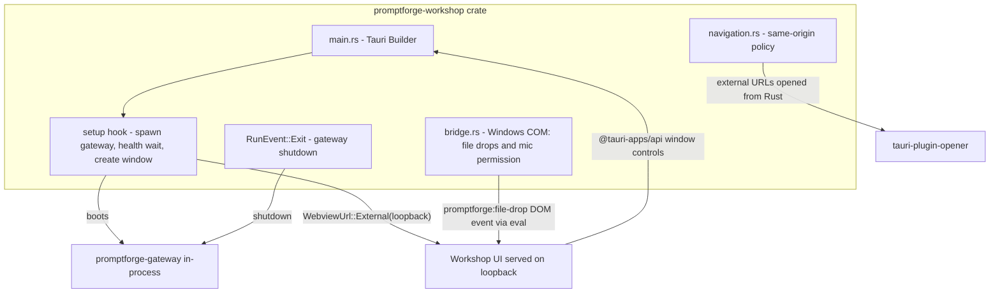

# Tauri Migration for PromptForge Workshop

## Pre-flight (read this first)

This plan is written to be executed by a fresh context. Everything it assumes is stated here.

**Governing documents, read before writing any code:**

- `c:\Users\Vinnie\cursor\tools-public\rulebooks\rust-rulebook.md` - binds every Rust edit (ownership, errors, docs, tests, lints, unsafe discipline).
- `promptforge/AGENTS.md` (repo root) - "do more with less", comment rules, dist-freshness requirement, verify commands.
- `promptforge/crates/promptforge-desktop-shell/AGENTS.md` - the crate being deleted; its unsafe-confinement and error-policy rules transfer to the workshop crate.
- Workspace rules in effect: no em dashes or double dashes anywhere (use a single dash); never use the Delete tool on workspace files (move to `cabinet/_trash/` instead - but git-tracked deletions via `git rm` after a checkpoint commit are recoverable and fine); when recommending an action, append a confidence level with a one-phrase reason.

**Working-tree state (resolved):** the code-review follow-ups (origin-pinned navigation, maximized-dispatch dedup, single-proxy consolidation, updated tests in `window.rs`, plus the `lib.rs` doc line) were committed as `a69157e` "Pin desktop-shell navigation to the server origin" on 2026-08-31. That commit is checkpoint 0 - the base the final fold resets to. The working tree was clean after it.

**Commit contract (user requirements, non-negotiable):**

- Checkpoint commit after each phase; the per-checkpoint gate is scoped compilation only (`cargo check -p promptforge-workshop` for Rust phases, `npm run typecheck` for the frontend phase, `cargo check -p` per touched crate for field fixes). No full workspace rebuilds, no clippy, no tests at checkpoint time.
- The full verification loop runs exactly once at the end (Phase 7).
- After verification passes, fold ALL checkpoint commits into one: `git reset --soft` to the pre-migration base (the review-fixes commit above) and create a single migration commit. The checkpoints must not survive in the final history.

**Reference material available in this workspace:**

- `unsloth/studio/src-tauri` - the proven Tauri v2 reference implementation. Specific patterns are cited inline with file:line throughout this plan.
- `cabinet/_research/2026-08-31-conduct-research-tauri-v2-loopback-migration-api.md` - the Tauri v2 API research notes (capabilities for remote URLs, lifecycle, dragDropEnabled, with_webview, plugin versions), with verbatim doc quotes.
- `cabinet/_output/review-promptforge-desktop-shell.md` - the code review that produced the uncommitted fixes and motivated the migration.

**Environment:** Windows 11, PowerShell (no `&&` - use `;` between commands), cargo/rustc stable, Node 24. The Tauri CLI is NOT installed; Phase 1 installs it. `cargo check -p promptforge-workshop` takes several minutes cold because it builds the whole gateway stack - budget for it.

## Architecture after migration

Key facts established by research (Unsloth Studio at `unsloth/studio/src-tauri` is the working reference; Tauri 2.11.5):

- `WebviewWindowBuilder::new(app, "main", WebviewUrl::External(url)).build()` in `setup`; `app.windows` omitted from config entirely. `frontendDist` stays unset - the UI is served by the in-process gateway, never bundled.
- Remote origins get zero Tauri API access by default; capabilities need `"remote": { "urls": ["http://127.0.0.1:*", "http://localhost:*"] }` (port wildcard must be explicit).
- `withGlobalTauri: true` injects `window.__TAURI__` on remote URLs; the workshop UI will use the `@tauri-apps/api` npm package (esbuild bundles it, same as dockview).
- `dragDropEnabled` defaults true and breaks HTML5 drag-and-drop on Windows (the tauri#15138 problem the shell already solved). Windows keeps the existing COM bridge; non-Windows uses Tauri's `WindowEvent::DragDrop`.
- `App::run` never returns; exactly-once gateway shutdown goes in the `RunEvent::Exit` handler.
- Unsloth's Groupy-compatible title bar pattern: create the window decorated, then `set_decorations(false)` at runtime (`main.rs:797` in Unsloth). Copy this instead of `with_decorations(false)` at build time. Windows-only: macOS and Linux keep native decorations, matching today's behavior.
- Microphone per platform, per Unsloth's proven tree: Windows needs a WebView2 `PermissionRequested` COM handler; Linux needs webkit2gtk `enable-media-stream` plus a `permission-request` handler allowing user-media only; macOS needs NO code - WKWebView defers to system TCC, and the requirement is `NSMicrophoneUsageDescription` in Info.plist (without it macOS kills the process on mic access) plus the `com.apple.security.device.audio-input` entitlement, wired via a `tauri.macos.conf.json` overlay.
- The workshop server sets no CSP headers, so Tauri's `fetch(ipc://)` transport works unimpeded.

## Phase 1: Scaffold (desktop-shell untouched throughout)

- Install the Tauri CLI once: `cargo install tauri-cli --locked` (a dev tool, not a project dependency).
- Workspace [Cargo.toml](promptforge/Cargo.toml): add `tauri`, `tauri-build`, `tauri-plugin-dialog`, `tauri-plugin-opener`, `tauri-plugin-window-state`, `tauri-plugin-single-instance` to `[workspace.dependencies]`. All six were verified against crates.io/docs.rs during research (tauri 2.11.5, tauri-build 2.6.3, dialog 2.7.3, opener 2.5.5, window-state 2.4.1, single-instance 2.4.4) - no near-miss names. Do NOT touch the `promptforge-desktop-shell` entry yet - promptforge-workshop still references it, and removing it now breaks the checkpoint's own compile gate. After wiring, run `cargo tree -d` to catch duplicate-version surprises.
- [promptforge-workshop/Cargo.toml](promptforge/crates/promptforge-workshop/Cargo.toml): add the tauri deps; Windows-only `webview2-com` and `windows-core` at versions matching Tauri's wry (check `tauri-runtime-wry`'s manifest at the locked version, same discipline as today); mirror the workspace lint set with `unsafe_code = "deny"` exactly as desktop-shell does now, plus `clippy::undocumented_unsafe_blocks = "deny"` and `clippy::missing_safety_doc = "deny"`. Add `build.rs` containing `fn main() { tauri_build::build() }` (mandatory for `generate_context!`).
- Confirm the workspace `rust-version` satisfies Tauri 2.11's MSRV (cargo check fails otherwise; better to know at scaffold time).
- Icons first, config second (tauri-build can validate icon paths): run `cargo tauri icon` from the crate directory against `assets/icons/promptforge-icon-1.png`, output to `crates/promptforge-workshop/icons/`. Caveat: the bundled source is 128x128 and the tool wants 1024x1024 for clean downscaling - upscaled output is acceptable, but a 1024px master is the better outcome if one exists.
- Write the FINAL `tauri.conf.json` at the crate root: `productName: "PromptForge"`, `identifier: "com.promptforge.workshop"`, `withGlobalTauri: true`, no `app.windows`, bundle targets `["nsis", "dmg", "deb", "appimage"]` (platform-filtered at build time), Windows `webviewInstallMode: embedBootstrapper silent`, the generated icons list. Platform-specific bundle settings live in overlay files (`tauri.macos.conf.json` etc. beside the base config; Tauri merges them via JSON Merge Patch - nested objects merge key-by-key, arrays replace whole), following Unsloth's overlay layout.
- Write the FINAL `capabilities/default.json`: window `main`, `remote.urls` = the loopback wildcards, permissions: `core:default`, `core:window:default`, `core:window:allow-minimize`, `allow-close`, `allow-start-dragging`, `allow-toggle-maximize`, `core:event:default`, `dialog:allow-open`. No opener permission: external URLs are opened from the Rust `on_navigation` handler, which needs no capability, and the remote origin should hold nothing it does not use.

## Phase 2: Rust core - main.rs and navigation (no drops/mic yet)

- [main.rs](promptforge/crates/promptforge-workshop/src/main.rs) rewritten around `tauri::Builder::default()`:
  - `.plugin()` for dialog, opener, single-instance, window-state (`StateFlags::SIZE | POSITION | MAXIMIZED`). Single-instance also prevents a second instance failing ugly on the gateway's fixed port bind.
  - `setup`: run existing `discover` + gateway `spawn` + `health::wait_for_health` (blocking, same as today - window appears only when healthy), then create the window programmatically with `.visible(false)`, `set_decorations(false)` on Windows only (Unsloth pattern; macOS and Linux keep native decorations, matching today's behavior - Unsloth removes decorations on Linux too, but that requires frontend resize-edge hit targets via `startResizeDragging`, which the workshop UI does not have; deferred), then `.show()` - the hide-then-show order avoids window-state restore flicker.
  - Close behavior: preserve today's semantics on every platform - closing the window exits the app and shuts down the gateway (the app IS the gateway host; a windowless process serving nothing is not a useful state). No `RunEvent::Reopen` handling, no close-to-tray, no macOS quit-confirmation interception (Unsloth's objc2 `applicationShouldTerminate:` machinery exists for its tray/confirmation UX, which we do not have).
  - Navigation policy: `WebviewWindowBuilder::on_navigation` closure using the ported same-origin check; denied URLs open from Rust via `tauri-plugin-opener`.
  - `GatewayHandle` stored via `app.manage()`; `RunEvent::Exit` calls `gateway.shutdown()` (fires exactly once; `App::run` never returns).
  - Error discipline: every expected failure propagates as `anyhow` with `.context()`; no `unwrap`/`expect` outside tests (the crate denies both); `main()` keeps the `ExitCode` pattern and prints `{error:?}`. The existing unit tests (`workshop_url_from`, crate name) are preserved.
  - Verify at runtime (Phase 7 smoke list): `tauri-plugin-window-state` may not restore a programmatically created window (Unsloth's window comes from config). If it does not apply, restore size/position manually from the plugin's state file or drop the plugin.
- [discover.rs](promptforge/crates/promptforge-workshop/src/discover.rs) and [health.rs](promptforge/crates/promptforge-workshop/src/health.rs): unchanged.
- New `src/navigation.rs`: the `classify_navigation` same-origin logic and its tests move here from window.rs in the same change as the code (the origin-pinning work carries over).
- Drop the `promptforge-desktop-shell` dependency from promptforge-workshop's Cargo.toml (the crate itself still exists as a workspace member until Phase 4).

## Phase 3: Rust bridge - file drops and mic permission

- New `src/bridge.rs`: gated by a single `#[cfg(target_os = "windows")]` on the `mod` line. Ports `file_drop.rs`'s `attach` (via `with_webview` -> `controller()` -> `get_CoreWebView2()` -> `add_WebMessageReceived`, same `workspace-drop` contract) plus a WebView2 `PermissionRequested` handler granting microphone only (replaces wry's `with_permission_handler` on Windows). Dropped paths dispatch the same `promptforge:file-drop` DOM CustomEvent via `window.eval()` - the page contract is unchanged. file_drop.rs's COM tests move with it in the same change.
- Unsafe discipline per the rulebook: the module opts out of the crate's `unsafe_code` deny with `#[expect(unsafe_code, reason = "...")]` (not `allow`, so the exemption warns if it ever goes stale), and every `unsafe` block gets a `// SAFETY:` comment on the immediately preceding line naming the precondition - the ported blocks gain these comments where the originals relied on function-level docs.
- Non-Windows drops: `on_window_event` matches `WindowEvent::DragDrop(Drop { paths, .. })` and evals the same `promptforge:file-drop` dispatch. `dragDropEnabled` stays default (true) off Windows; Windows calls `.disable_drag_drop_handler()`. Unsloth runs the default handler on macOS/Linux with no platform branching and no reported HTML5 drag-and-drop conflict, which is encouraging for Dockview - but the Phase 7 smoke test still verifies it, since the failure mode is silent.
- Linux mic permission (port of Unsloth's `setup_linux_media_permissions`, `main.rs:805-837`): WebKitGTK ships with `enable-media-stream` off and a stock permission-request handler that denies everything, so a `with_webview` handler sets `settings.set_enable_media_stream(true)` and connects `connect_permission_request`, allowing `UserMediaPermissionRequest` only - every other permission kind keeps the default deny. Adds Linux-only `webkit2gtk = "2.0.2"` to the crate.
- macOS mic permission (investigation resolved by Unsloth's tree - it is bundle config, not code): WKWebView defers to the system TCC prompt, so what the app needs is an `Info.plist` with `NSMicrophoneUsageDescription` (without it, macOS hard-crashes the process on mic access) and an `Entitlements.plist` with `com.apple.security.device.audio-input`, wired through a `tauri.macos.conf.json` overlay (`bundle.macOS.entitlements` / `infoPlist`). Unsloth's `webview_permissions.rs` documents explicitly that macOS needs no permission delegate. No macOS Rust code.
- The crate's AGENTS.md: rewrite for the new structure (unsafe now confined to `src/bridge.rs`).

## Phase 4: Delete promptforge-desktop-shell

- Delete `crates/promptforge-desktop-shell/` entirely (source, tests, AGENTS.md, assets - the icon source was already consumed in Phase 1). Everything it held has either moved (navigation, bridge, tests) or been replaced (Tauri built-ins).
- Remove the `promptforge-desktop-shell` entry from the workspace [Cargo.toml](promptforge/Cargo.toml) `[workspace.dependencies]` - only now is nothing referencing it.

## Phase 5: Frontend (promptforge-workshop-server/ui)

- [package.json](promptforge/crates/promptforge-workshop-server/ui/package.json): add `@tauri-apps/api` and `@tauri-apps/plugin-dialog`, then `npm install` so `package-lock.json` regenerates.
- [window-chrome.ts](promptforge/crates/promptforge-workshop-server/ui/src/ui/window-chrome.ts): replace `window.ipc.postMessage` with `getCurrentWindow()` calls (`minimize()`, `toggleMaximize()`, `close()`, `startDragging()`); desktop detection becomes `window.__TAURI_INTERNALS__` presence; maximized glyph sync becomes `onResized(() => isMaximized())`. Browser-mode branching structure stays.
- [workshop-panel.ts](promptforge/crates/promptforge-workshop-server/ui/src/ui/workshop/workshop-panel.ts): `addFolder` uses `open({ directory: true })` from the dialog plugin; delete the `promptforge:folder-picked` listener and `PICK_FOLDER_MESSAGE`.
- [workspace-drops.ts](promptforge/crates/promptforge-workshop-server/ui/src/ui/workspace-drops.ts): unchanged - the `chrome.webview.postMessageWithAdditionalObjects` bridge and `promptforge:file-drop` DOM event survive intact.
- [main.ts](promptforge/crates/promptforge-workshop-server/ui/src/main.ts), `window-menu.ts`, gateway-config bridge: unchanged (window-menu delegates to window-chrome).
- Tests: `window-chrome.mjs` and `workshop-panel-menu.mjs` get `__TAURI_INTERNALS__`/dialog mocks; `titlebar-browser-mode.mjs` asserts their absence instead of `ipc`'s; `workspace-drops.mjs` unchanged.
- `npm run typecheck && npm test`, then `npm run package` to refresh the checked-in `dist/` (repo AGENTS.md requirement).

## Phase 6: Field-report fixes (from the Windows build-and-run report)

Independent product fixes surfaced by a fresh-machine field report. Each cites its Unsloth cliff note where one exists. These touch none of the migration's files except the UI's voice surface, which the migration does not rewrite.

- **Download resume (the high-value one).** `promptforge-gateway-local/src/cache.rs` currently deletes `.part` on failure and restarts from zero - fatal for multi-GB model downloads on connections that reset (the reporter's Hugging Face fetch died near 800 MB, repeatedly). Cliff note: Unsloth's `studio/backend/hub/utils/resumable_partials.py`. The pattern: keep the partial on failure; on retry, open it in append mode and send `Range: bytes=<current-len>-`; if the server answers 200 to a Range request, seek to 0 and truncate (server ignored the Range); guard resume provenance with a marker so a partial from a different source is never appended to; verify exact size, then the existing digest, and only then rename into place. Tests: interrupted download resumes from its offset; a 200-to-Range answer restarts cleanly; a partial larger than the declared size truncates; a partial with a mismatched marker is discarded; digest verification still gates publication (the existing ART-007 tests change meaning - a failed publication keeps the `.part` now).
- **Silent truncation when no final model is configured.** A take longer than `window_seconds` (15s) loses its leading audio on `stop` and nothing says so - the reporter measured a 19.91s clip losing its first five seconds. The shipped default config now carries both models, so this bites only when the final model is removed or fails to provision - exactly when the user is least equipped to guess. Fix in the STT stop path (`promptforge-workshop-server` voice/transcribe modules): when a take exceeds the window and no final pass exists, log a warning naming the truncation and surface it on the status bar. No Unsloth equivalent - their pipeline is whole-clip faster-whisper.
- **Mic hidden without a reason.** `voiceGpuAvailable()` in [voice.ts](promptforge/crates/promptforge-workshop-server/ui/src/ui/voice.ts) answers false on any failure and the mic silently disappears; a fresh config with no chat models leaves it grey with no explanation anywhere. Cliff note: Unsloth's `thread.tsx:4239` - "Keep the mic clickable: if the engine can't run here, explain and point to the local model instead of disabling the button." Keep the mic visible; on click with voice unavailable, the status bar names the blocker (no GPU, models not provisioned, chat not ready). 
- **No `~` expansion in model paths.** A `~/...` path in `[workshop.stt]` fails at provisioning. Expand `~` against the user profile where STT model paths resolve, and add a test with a tilde path.
- **Status bar lag after a late websocket join** (cosmetic): recompute the status line on join instead of leaving a stale "Connected to gateway".

The report's Windows build-troubleshooting content (CUDA 13.2+ with VS 2026, libclang via pip, Ninja generator, ggml arch pins, WDAC notes, Git Bash quoting) is deliberately NOT in this plan: `guide/promptforge-user-guide.md` is regenerated by a prompt, so hand edits would be overwritten. Changing that prompt is out of scope.

## Phase 7: Verify, then fold

- Full rulebook loop, exactly once: `cargo fmt --all --check`, `cargo clippy --all-targets --all-features -- -D warnings`, `cargo test` at the workspace root, `npm run typecheck && npm test`, `cargo tauri build` (produces the NSIS installer).
- Docs sweep (repo AGENTS.md requires README currency): grep `README.md` for references to the desktop shell's mechanics (wry, IPC bridge, title-bar behavior) and update what went stale. Do NOT hand-edit `guide/promptforge-user-guide.md` - it is regenerated by a prompt; any staleness there gets fixed by regeneration, which is out of scope.
- Manual smoke on Windows: Groupy top-edge resize (the originating bug), Explorer file drops, Dockview panel drags, Add Folder picker, voice/mic grant, close window -> gateway shuts down, window-state restore across relaunch, second-instance launch focuses the existing window, browser-mode regression via `promptforge-workshop-server` standalone.
- Manual smoke on macOS/Linux when hardware is available: Dockview drags with Tauri's drag-drop handler enabled (flagged risk; if broken, disable there too and accept no OS path drops off Windows initially), mic grant path from Phase 3 (Linux: WebKitGTK handler; macOS: TCC prompt with the usage description).
- Known Linux failure modes, learned from Unsloth's battle scars - adopt workarounds only if smoke testing actually hits them, do not port preemptively:
  - WebKitGTK's DMA-BUF renderer breaks on proprietary NVIDIA drivers (Wayland and X11) and on AppImages that cannot load GLES; Unsloth carries a whole `linux_webkit.rs` module of env-var workarounds (`WEBKIT_DISABLE_DMABUF_RENDERER` / `WEBKIT_DMABUF_RENDERER_FORCE_SHM`, chosen per display server) set before GTK init. Symptom: blank window.
  - Multi-threaded X11 use without `XInitThreads()` corrupts Xlib's transport (Unsloth calls it as main's first statement via `x11_threads.rs`). Symptom: intermittent X11 crashes.
  - AppImage on Ubuntu 24.04+ may need `libfuse2t64` on the host; the `.deb` is the reliable Linux artifact.
- macOS packaging note for later: notarizing the `.dmg` itself is a separate CI step from notarizing the `.app` (tauri#7533); relevant when code signing lands, not now.

## Commit strategy (user requirement)

- Checkpoint commit after each phase. The gate for a checkpoint is scoped compilation only - no full workspace rebuild, no clippy, no tests at checkpoint time:
  - Rust phases: `cargo check -p promptforge-workshop`.
  - Frontend phase: `npm run typecheck` in the UI directory.
- Checkpoints, in order:
  0. Pre-flight: commit the pending code-review fixes to promptforge-desktop-shell as a standalone commit (see Pre-flight). This commit is NOT part of the migration and is the base the fold resets to.
  1. Scaffold Tauri in promptforge-workshop (deps, build.rs, final tauri.conf.json, capabilities, icons; desktop-shell untouched and compiling).
  2. Rust core (main.rs rewrite, navigation.rs; desktop-shell dependency dropped from the workshop crate).
  3. Rust bridge (bridge.rs: drops and mic permission, all platforms).
  4. Delete the promptforge-desktop-shell crate and its workspace.dependencies entry.
  5. Frontend (sources, test mocks, lockfile, repackaged dist).
  6. Field-report fixes (download resume, truncation warning, mic UX, tilde expansion, status bar). Scoped gates: `cargo check -p` on each touched crate, `npm run typecheck` for the UI change.
  7. Any fixes from the verification phase.
- The full rulebook loop runs exactly once, at the end, before the fold (Phase 7). Accepted tradeoff: deferred checks can surface failures late, when the diff is largest; checkpoint 7 absorbs those fixes.
- After final verification, fold all checkpoint commits into one: `git reset --soft` to the checkpoint-0 commit (the standalone review-fixes commit) and create a single migration commit on top of it.
- Known intermediate state: checkpoints 2-4 compile but the running app has dead window controls and no drops (the Tauri app serves the old UI, which still calls the removed `window.ipc`). Inherent to the migration - the gate is compilation, and the final fold means no one lands on an intermediate commit.

## Deferred (not this migration)

- `tauri-plugin-updater` (needs signing key + release endpoint decisions). When it lands, also port Unsloth's `webview_cache_plugin` pattern (clear WebView caches on version bump so updates never serve a stale frontend).
- Code signing certificates and macOS notarization (including the separate DMG notarization step). Elevated by field evidence: WDAC-managed machines refuse to run unsigned executables at all (the report's P2 blocked even cargo's own build scripts), so an unsigned NSIS installer is dead on arrival on exactly those machines. Signing is a launch blocker for managed environments, not polish.
- macOS overlay title bar (`titleBarStyle: Overlay` + `hiddenTitle` + `trafficLightPosition`, with the frontend skipping its window controls and leaving a 78px traffic-light inset - Unsloth's pattern). Today macOS keeps full native decorations; this is polish, not a gap.
- Linux frameless window (Unsloth does `set_decorations(false)` on Linux with frontend resize edges via `startResizeDragging`); the workshop UI would need the eight edge/corner hit targets first.
- Linux renderer workarounds (Unsloth's `linux_webkit.rs` DMA-BUF module and `x11_threads.rs`) - port only if Phase 7 smoke testing hits the failure modes they solve.
- System tray, deep links, notifications (plugins identified, no current need).

## Assumptions

- Bundle identifier `com.promptforge.workshop`; change freely before first release.
- NSIS as the Windows installer format (WiX/MSI available later if enterprise deployment demands it).
- The page contract (`promptforge:file-drop` DOM event, `workspace-drop` web message) is preserved deliberately to keep `workspace-drops.ts` and the config-UI iframe bridge untouched.

---

## Recovered rationale

Recovered from the producing chat sessions by the plan ledger on 2026-09-04. Everything below this heading is derived annotation, not part of the original plan.

# Enrichment: Tauri migration for Workshop

## Origin and rationale

The plan grew out of a code review of `promptforge-desktop-shell` (2026-08-31), not from a pre-existing migration agenda. During the review follow-ups the user reported the window's top edge was nearly impossible to resize because Groupy (a Windows window-tabbing tool) injects its tab strip there. Diagnosis: raw tao's `with_decorations(false)` produces a `WS_POPUP` window with userland `WM_NCHITTEST` resize grips, while Tauri's borderless mode uses `DwmExtendFrameIntoClientArea`, so the DWM still owns the edges and Groupy coexists with them. The user supplied the reference: "@unsloth/ manages it correctly". Unsloth Studio proved to be a Tauri v2 app in the same workspace and became the working reference for nearly every implementation point.

The assistant's honest framing (paraphrase): the Groupy fix alone is the weak argument - a Groupy exclusion costs nothing, and a manual DWM frame extension on the tao HWND is about 30 lines. "If the resize issue were the whole story, I'd advise against migrating." The strong argument is trajectory: the shell was already "an accidental reimplementation of a Tauri subset" (hand-rolled IPC protocol, navigation policy, icon decoder, folder picker, a 265-line unsafe COM drop bridge), and a shipping desktop app would need an installer, auto-updates, window-state persistence, and single-instance - each another hand-built subsystem, each future platform quirk diagnosed alone. The repo's AGENTS.md bar ("new machinery has to beat what is already there on the merits, and 'it would be tidier' is not a merit") was weighed explicitly; the case was made on merits, not tidiness, with a caveat: if Workshop were an internal tool, migration is optional.

The user settled the caveat with the decisive sentence: "Workshop has to be a polished, finished product worthy of delivering to users as a packaged desktop application with an installer and native platform feel."

Due diligence before committing: Tauri wraps tao/wry rather than replacing them (seven direct dependencies become two); maintenance risk judged low (11 minor releases in 2026, ~110k stars, CrabNebula-funded full-time engineers).

## Discarded alternatives

- **Exclude PromptForge in Groupy's settings.** Zero code; fixes one machine, not the product.
- **Hand-rolled DWM frame extension on the tao HWND.** ~30 lines, Windows-only; treats the symptom while platform-quirk maintenance stays in-house.
- **Re-enable native decorations, drop the custom title bar.** Loses the custom chrome.
- **Stay on raw tao/wry.** A live option until the shipped-product requirement was stated; only then rejected.
- Deferred, not discarded: updater plugin, code signing and notarization (elevated by the field report's WDAC finding - unsigned executables do not run at all on managed machines), macOS overlay title bar, Linux frameless window, Linux renderer workarounds (port only if smoke testing hits them).

## The commit contract (user requirements, verbatim)

- "I want it done with checkpoint commits (the gate is that compilation works) and then when it is all finished I want all the commits folded into a single commit"
- "you understand I want all the commits folded down into one at the end?"
- "and I dont want a full project rebuild and verify at each commit either"

The third sentence was pushback: the assistant had raised the checkpoint gate to the full rulebook loop (fmt, clippy, tests per commit) and the user pulled it back to scoped compilation, accepting that deferred checks surface failures late, when the diff is largest. The fold is also why the plan tolerates compile-green but runtime-broken intermediate commits (dead window controls between checkpoints 2 and 5): no one ever lands on them.

## Scope decisions from the creator chat

- Proxy consolidation entered scope via "we are touching the code anyway and three of something duplicated sounds like waste" - previously an out-of-scope review nit.
- Unsloth as reference was a user directive: "use @unsloth/ as a loose guide for structure and also each specific implementation point (such as, microphone on mac). Especially look at unsloth to make sure we are mac and linux compatible. Do this now."
- Phase 6 (field-report fixes) exists because the user brought an external Windows build-and-run report (a gist by wpak-ai) and instructed "fix the important stuff in the plan and use @unsloth/ as the cliff notes." Each claim was verified against the repo first; one (stale voice-defaults docs) was already fixed and dropped.
- The user-guide exclusion is the user's call: "forget the user guide changes. the user guide gets regenerated by a prompt. that prompt has to change, and its out of scope. make the plan ready for a fresh context."
- Checkpoint 0 (`a69157e`) exists because the review fixes were still uncommitted when planning ended; the user ordered "git add commit them", and that commit became the fold base.
- Executor thinking-level: "HIgh thinking or Max thinking? I want to minimize technical debt" - answered Max: checkpoint gates catch compilation debt but not reasoning debt (unsafe SAFETY proofs, capability scoping, exactly-once shutdown, resume provenance in cache.rs).

## Deviations during execution (run chat)

The migration folded into a single commit (`1add82e`) as contracted. Everything below surfaced after the fold and landed as separate follow-up commits - itself a deviation from "one commit", driven by smoke-test discoveries:

1. **Static CRT fix (`1e4b33a`).** `cargo tauri build` failed on the user's VS 2026 toolchain: the repo's mixed-CRT arrangement (whisper.cpp and the WebView2 loader /MT, Rust /MD, the mismatch suppressed with /NODEFAULTLIB:LIBCMT) broke once CUDA 13.2's /guard:cf cudart and the loader's nothrow-new reference needed symbols only the static libs carry, and the trigger was the Tauri CLI force-enabling `tauri/custom-protocol`. The user rejected the older-toolchain escape: "I dont want VS 2026 preview, I only prefer to use release toolchains" and "2022 is 4 years old" (VS 2026 had already GA'd). A first `+crt-static` attempt was reverted because NVCC compiles the CUDA kernels /MD with no external flag; five web-research subagents then found whisper-rs-sys 0.15.0's build script forwards `CMAKE_*` env vars as cmake defines, so the shipped fix is three lines in `.cargo/config.toml`, no vendoring. The user's reading of "/MD" as "multithreaded debug" was corrected along the way: it is multithreaded DLL (dynamic CRT).
2. **Console window fix (`621253d`).** The installed app showed an extra console window; the exe was console-subsystem. Fixed with the standard Tauri `#![cfg_attr(not(debug_assertions), windows_subsystem = "windows")]`, verified against Unsloth's `main.rs`. Known tradeoff, flagged in the original review: release-build `eprintln!` diagnostics now vanish.
3. **The mic failure was hardware, not the port.** "it couldn't get the microphone either" on the installed app; the PermissionRequested port was verified line-equivalent to wry's proven handler and Windows showed zero capture endpoints registered. The new Phase 6 mic UX did its job by naming the blocker on the status bar instead of hiding the mic.
4. **Console flicker fixes (`d8ad9e9`, `d47ca26`).** Two distinct causes: the Gateway Config menu flicker was the cross-origin config iframe making Chromium spawn utility processes (fixed by serving the config UI same-origin through the workshop server); the startup flicker was llama-server and icacls spawned without `CREATE_NO_WINDOW`. The user then directed "fold the const cleanup into our commit" - the flag became a crate-level constant matching Unsloth's pattern - and "have a look at @unsloth/ to verify our work" confirmed every post-migration decision against the reference.
5. **`open_browser` left in place.** The user asked "what is open_browser? that feels like a useless setting"; the assistant agreed but kept removal out of migration scope.
