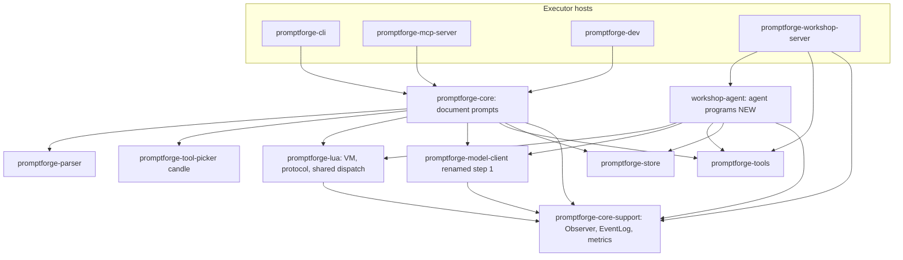

# The agent loop is a prompt

## For a fresh session: context in brief

- **Status: nothing is implemented.** All 16 todos are pending. Execution begins at step 1 after confirming a clean worktree (`git status` in the repo). This plan file is the source of truth: mark todo statuses here as steps complete.
- Repo: `C:\Users\Vinnie\cursor\promptforge` - a Rust workspace (29 crates under `crates/*`) plus a TypeScript SPA under `crates/promptforge-workshop-server/ui`.
- PromptForge runs **document prompts** (`.md`: sections, prose, a built-in tool loop) via `execute::run` in `promptforge-core`. This plan adds **agent programs** (`.lua`: a Lua main loop that drives model turns itself) via `run_agent` in a NEW crate `workshop-agent` (the first crate breaking from the `promptforge-` prefix; the workshop family is moving away from it).
- The end state: the Workshop's direct-to-gateway chat relay is deleted and `agents/chat.lua` - a minimal agent - is the only chat. Six parity tests (step 15) gate the deletion (step 16).
- Vocabulary: the **Observer** is write-only run reporting (core-support). The **EventLog** is the read-side history agents build context from - a separate trait, deliberately not the Observer. **Deltas** are live streaming chunks for the UI only; they never enter the EventLog. The **model client** (`promptforge-model-client`, renamed in step 1 from `promptforge-gateway-client`) is the HTTP client executors use to reach the gateway; it is not part of the gateway binary.
- Execution runs under `tools-public/rulebooks/vibe-rulebook.md`: one step = one commit with its tests; coder/review subagents receive rulebook paths (`rust-rulebook.md`; for steps 13, 14, and 16 also `typescript-rulebook.md` and `html-css-rulebook.md`) and the AGENTS.md manifest (survey at run start; root plus every nested AGENTS.md on touched paths). Subagent dispatch prompts main writes during the run follow `tools-public/rulebooks/prompts-rulebook.md` (it governs any text whose reader is a model). Ledger: `cabinet/_scratch/vibe-agent-loop/vibe-ledger.md`. Review file: `cabinet/_scratch/vibe-agent-loop/vibe-review.md`. Dirty worktree at start = stop and ask.
- Verify commands: `cargo test` at the workspace root; `npm run typecheck && npm test` in `crates/promptforge-workshop-server/ui`; UI-touching commits also run `npm run package` to refresh the checked-in `dist/` (build.rs verifies it).
- This plan was deep-reviewed against the real source (32 findings) and boundary-reviewed (crate placement below); both are folded in. Reference-harness studies (Zed, Pi, Unsloth - local checkouts in sibling directories of the workspace) and an Agent Client Protocol review (agentclientprotocol.com, v1 + v2 draft) are likewise folded in wherever they are cited; do not re-run that research.

**The test gate:** every step's tests must contribute to proving that the functionality required to replace the direct chat exists and works. Step 15 is the gate itself. Step 16 does not begin until all six gate tests are green.

## The four products

Crate names encode product membership. This plan touches all four; nothing in it may blur a product boundary.

1. **gateway** - the server app that proxies inference. Crates: `promptforge-gateway` and the `promptforge-gateway-*` family (config, local, loopback, protocol, routing, config-ui, build), plus the gateway-owned media and search crates (`promptforge-stt`, `promptforge-transcribe`, `promptforge-web-search-service`). Untouched by this plan except the streaming dialect-emulation fix in step 4. (`promptforge-progress` is shared bottom-of-graph infrastructure used by the gateway and mcp-server; no product owns it.)
2. **promptforge** - the library that gives you `execute::run`. Crates: `promptforge-core` and its substrate (`promptforge-core-support`, `promptforge-lua`, `promptforge-parser`, `promptforge-store`, `promptforge-tools`, `promptforge-tool-picker`, `promptforge-model-client` after step 1, `promptforge-webfetch`, `promptforge-web-search`). This plan extends the substrate (steps 2-6) but leaves `execute::run` and core's public API untouched.
3. **workshop** - the windowed desktop application, which also bundles the gateway. Crates: `promptforge-workshop`, `promptforge-workshop-server`, and NEW `workshop-agent` (steps 7-16). The workshop family is moving away from the `promptforge-` prefix; `workshop-agent` is the first crate named under the new scheme, and existing workshop crates keep their names in this plan (renames are separate work). Placement falsifier: agents are workshop-owned because the workshop is their only host; if a second host ever needs agents, the crate promotes into the library product - its dependency set (library substrate only) already permits that as a pure rename.
4. **mcp-server** - the server app that runs promptforge prompts via MCP. Crate: `promptforge-mcp-server`. Untouched by this plan.

Product dependency direction: workshop -> promptforge (library), mcp-server -> promptforge (library). The gateway product depends on neither - it is reached over HTTP. `workshop-agent` is workshop-product code that consumes the promptforge library substrate; it is not part of the library. (`promptforge-cli` and `promptforge-dev` are development tools for the library product; this plan does not touch them.)

## Crate placement and the dependency graph

The boundary review moved `run_agent` out of `promptforge-core` into a new crate, and the product taxonomy above settles which product owns it: agents are a workshop feature, so `workshop-agent` belongs to the workshop product, consuming the promptforge library substrate without joining it. Reasoning, recorded per the root AGENTS.md merit rule:

- The workshop server today does not depend on core. Core drags `promptforge-parser` (markdown) and `promptforge-tool-picker` (candle, tokenizers - the ML embedding stack). Agent programs need neither: no sections to parse, tools registered by name with no semantic resolution. A workshop-server -> core edge buys the heaviest dependency in the tree for machinery the agent path never executes.
- `workshop-agent` depends only on what agents use: `promptforge-lua`, `promptforge-model-client`, `promptforge-tools`, `promptforge-store`, `promptforge-core-support`. Core and agent are sibling executors over the same substrate; neither depends on the other.
- The shared tool-dispatch function (cancel race, counts, untrusted wrap, observer events) is needed by core's scheduler (section-VM `tool_call`) and the agent driver. Every piece it composes lives at or below `promptforge-lua` (`ToolCallCounts` is lua's; cancel/untrusted/observe are core-support's; `Tool` is tools'), and both executors already depend on lua - so it lives in `promptforge-lua` with a one-line charter amendment ("hosts tool-dispatch support that executors invoke"). Zero new edges. Rejected alternatives: in core (agent cannot reach it), in tools (charter: vocabulary only, and it would need a lua dep for counts), duplicated (the drift risk review flagged).
- Core's public API is untouched: no new `RunConfig` fields. The agent crate defines its own slim `AgentConfig` carrying exactly what agents need.
- Workshop-server gains three lean edges: `workshop-agent`, `promptforge-tools` (the `user_input` Tool impl), `promptforge-core-support` (WorkshopObserver, RuntimeEvent). It stays free of parser, picker, and core.



## Two program types, two entry points

**Document prompts (.md)** run via `promptforge_core::execute::run`. Unchanged in every way.

**Agent programs (.lua)** run via `workshop_agent::run_agent`. Agent-only host calls: `models.chat`, `runtime.events()`, `ui()`. Shared kernel: `tool_call`, store, var, cancel, `models.infer`. `execute()`, `fanout()`, and `jump()` are **absent - not stubbed**. Agents and document prompts are different species; nothing is "ported" between them, so there is no one to serve with a courtesy error. An agent calling `execute` fails as an undefined global, exactly as a document prompt calling `models.chat` does. `Request::Execute`/`Fanout` cannot reach the agent driver (no shim, stripped coroutines), so its exhaustive-match arms for them are unreachable internal-invariant guards - the mirror of core's `Chat` arm.

`models.chat` never exists in a section VM - not stubbed, simply absent. A document prompt calling it fails as an undefined global at the Lua level. Because the coroutine global is stripped from author reach, a section VM cannot yield a `Request::Chat` at all; the arm core's exhaustive `Request` match is forced to carry (the enum is shared via `promptforge-lua`) is an unreachable internal-invariant guard, not a feature.

## Concurrency model (designed now, implemented post-gate)

The agent program is one coroutine. It runs only between yield points - no preemption, no result is ever injected into running Lua. All concurrency lives on the Rust side of the yield: the driver is a tokio task, and the question "how does a finished background job deliver its result" reduces to "what does the driver await while the coroutine is suspended, and what may wake it." The gate's answer is "exactly one future - the current request." Jobs generalize it:

- `spawn(alias, args) -> job` (agent VM host call): the driver pushes the tool future - built by the same shared `dispatch_tool` - onto a per-run `JobSet` (`FuturesUnordered` keyed by job id) and resumes the coroutine immediately with a job handle. Subagents, shells, anything long-running: all tokio tasks behind a handle.
- `wait_any(job, ...) -> job, result` (agent VM host call, the only wait primitive): suspends until any listed job completes; returns which and its result. `wait_any()` with no arguments waits on any outstanding job (the POSIX `waitpid(-1)` reading). Results completing while nobody waits buffer in the JobSet; waiting on an already-finished job returns immediately - no lost wakeups. Each result is claimable exactly once.
- `wait_all(job, ...) -> results` is **pure-Lua prelude sugar** (`install_shim_prelude`), a claim loop over `wait_any` - the claim-once buffer makes the loop semantically identical to a native version, so the protocol carries one wait, not two. Zero-arg `wait_all()` drains all outstanding jobs.
- Division of labor, precisely: the **model** plans - it requests tool calls (including background-flavored ones) but only ever requests; one `models.chat` round is stateless and returns tool_calls **unexecuted** (step 8), so `models.chat` cannot be the thing that waits - nothing exists on the model side between rounds. The **agent program** dispatches: it walks the returned tool_calls, blocks (`tool_call`) or spawns (`spawn`) each per its own policy, and when it spawns it immediately answers that tool call with "started as job N, completion will be delivered." The job ledger is therefore a plain Lua table in the agent program - it knows every handle because it created every handle. The **runtime** supplies mechanism only and never initiates anything.
- `user_input` is not special-cased and is called by nobody but the agent program: never advertised to the model, never auto-invoked by the runtime. "Gather input when the model produces no more text, thinking, or blocking tool calls" is the else-branch of the agent loop - turn-end policy is agent code, the thesis again. At turn end the program does `wait_any(input_job, ledger jobs...)`: if a job wins, it pushes a job-completion notification into the messages and runs another model round while the user_input wait stays registered (the SPA box stays open, the handle survives to the next turn end - claim-once buffering makes this safe); if the user wins, a normal turn. Eager wake vs. letting completions sit in the EventLog until the next context build is likewise the program's choice.
- Blocking `tool_call(alias, args)` (step 5) is retroactively sugar: spawn then wait_any on that single job. Nothing in the gate changes.
- Wire-correctness rule for the loop: **every tool_call_id is answered exactly once, on the immediately following round** - OpenAI-shaped models reject unanswered tool calls. A background spawn therefore answers its tool call immediately ("started as job N"); the completion later re-enters as an ordinary message ("background job N finished: ..."), never as a late tool message.
- Corollary at context-build time (reference harnesses: Zed's cancel sentinel, Unsloth's synthetic results): after a turn-cancel, the EventLog may hold an assistant tool_calls event whose results never fired. The agent's context builder must heal this - synthesize "canceled" results for the unanswered ids or drop the dangling assistant message - or the rebuilt messages table is wire-invalid.
- Parallel tool batches (Zed and Pi both default to parallel dispatch with source-ordered results) are the spawn-all-then-`wait_all` pattern; no additional primitive needed.
- Events are automatic, messages are deliberate: dispatch/chat/input fire their observer events as byproducts (persistence and SPA rendering come free); the messages table for `models.chat` contains only what the agent program puts there. Compaction (deferred) is the same split - `models.chat` returns `usage`, the agent summarizes and rewrites its messages table when nearing budget; the EventLog keeps the full record regardless.
- Job completion also appends a `RuntimeEvent` to the EventLog (observability, context building); the claimable payload rides the JobSet.
- The JobSet is owned by the run task: firing the `CancelHandle` aborts every outstanding job. Turn-cancel kills background jobs - the simple rule, documented where jobs are.

Protocol reservation so step 5 is not designed into a corner: `Request::Spawn { alias, args }` / `Answer::Spawned { job }` and `Request::Wait { jobs }` / `Answer::WaitResult { job, result }` (single completion; `wait_all` never reaches the protocol) are additive variants alongside `Request::ToolCall`; section VMs never install `spawn`/`wait_any`/`wait_all` (absent, not stubbed - same rule as everything else). Implementation is the first post-gate step.

## Multimodal user input (shape pinned now, attachments post-gate)

`user_input` returns a **table** from day one, never a bare string - retrofitting string-to-table later would break every agent program's most-called function. Contract: `result.text` (string, byte-exact what the user typed) and `result.images` (array of `{ media_type, data }`; always empty in the gate - the SPA attachment UI is post-gate). Mechanism: tool bindings declare an output kind; plain tools resume into Lua as strings exactly as today, structured tools (user_input is the first) have their JSON output resumed as a Lua table through the existing serde boundary (`LuaSerdeExt`) - no JSON codec is exposed to scripts and none is needed. Images flow onward as OpenAI content parts (`{type="image_url", image_url={url="data:...;base64,..."}}`) in the message list the agent builds for `models.chat`, so step 8's validation accepts content as a string or a parts array (shallow-validated: known `type` per part). Attachment bytes never enter the event JSONL (unbounded bloat): they store beside the session log under `state_dir/sessions/<id>/assets/` and events reference them with the ACP `resource_link` field set - `{uri: "attachment://<id>", name, mimeType, size}` - which keeps the records MCP/ACP-conversant for free. The linked-vs-embedded split maps cleanly: what `user_input` returns to Lua is a link (id), what the agent sends `models.chat` is embedded (data URI). When SPA attachments land, model catalog entries gain capability flags (`image`, ...) mirroring ACP promptCapabilities, so the attach button greys for non-vision models and `models.chat` fails loudly instead of silently degrading. One constraint: the structured output kind is restricted to **trusted** tools until untrusted wrapping over tables is designed - the nonce envelope is a string mechanism, and wrapping structured data is its own problem.

## Settled design decisions

- **`models.chat(messages, opts)`** (agent-only): one tool-capable round over a prompt-built message list. Returns reply or tool_calls plus finish_reason, model, metrics. `opts.model` overrides the default binding. **`opts.tools` is an explicit array of alias names to advertise; the default is none.** Host-primitive tools (`user_input`) are never advertised. `finish_reason` of `"length"` **or `"content_filter"`** with tool calls fails the batch (partial JSON args must not execute). Agents branch on the **presence of tool_calls, never on finish_reason** - llama.cpp and vLLM routinely finish tool-call rounds with `stop` (Unsloth Studio enforces the same rule). Event-log and SPA keying scope tool_call_id by turn - providers recycle ids like `call_1` across rounds (Zed scopes ids for the same reason).
- **`tool_call(alias, args)`** (both VMs): suspending dispatch of a bound tool through the shared dispatch function in `promptforge-lua`. Untrusted output nonce-wrapped. Fires `on_tool_result` only - no synthetic assistant tool-call event; fabricated provenance would poison event-log context building. Script-initiated resolution is against the run's full bound tool catalog, not the section's advertised scope: the scope shapes what the model is offered, and the author's own code is not the model. The in-scope rule was worse than useless - it coupled script access to model exposure, forcing an author to advertise a tool to the model just to call it from Lua; the catalog rule lets a tool be bound, kept out of every section's scope, and remain Lua-only (user decision 2026-09-01, replacing step 5's original in-scope rule; implemented as its own commit after step 9). The model-advertised set stays section-scoped.
- **`runtime.events()`** (agent-only): read-only history backed by the **`EventLog` trait, distinct from the Observer**. The Observer stays write-only per its charter; the EventLog is an explicit run input on `AgentConfig`. Indexed access (`len`/`get`), single-entry conversion on access, no bulk copy. Snapshot (a length bound) refreshes at every host-call resume - an agent program is one long-running chunk, and concurrent appends happen only while it is suspended, so resume-refresh stays deterministic. Section VMs are unaffected.
- **`user_input`**: a Workshop-registered tool, never advertised to models, returning **trusted, structured** output (a table - see the Multimodal section) - the operator is not an attacker of their own session; no nonce envelope wraps user text. The **session** fires `on_user_input` byte-exact when `input_response` arrives, then completes the wait. `chat.lua` builds user messages from `UserInput` events.
- **There is no `send_to_chat`.** The SPA renders assistant replies from `on_assistant_reply` events; the observer stream is the display channel.
- **ACP alignment (adopted).** The Agent Client Protocol v2 draft independently converged on this architecture (lifecycle-as-notifications, agent-owned history, replay-on-resume), so we adopt its vocabulary and rules where they are free, keeping the bespoke WebSocket protocol and an adapter path open:
  - Event-kind labels follow ACP `sessionUpdate` names where equivalents exist (`user_message`, `agent_message`, `agent_thought`, `tool_call`, `tool_call_update`) - chosen at step 2, where the labels are born.
  - Every ephemeral delta frame is stamped with the id of the durable event that will supersede it; the SPA coalesces by that id (ACP's messageId chunk-vs-upsert rule).
  - Cancellation is a stop reason, never an error: turn-cancel returns the session to waiting with no error frame; late frames between cancel and relaunch are a defined grace window; a pending input wait is explicitly invalidated to the SPA, not silently dropped.
  - Durable event frames carry the event's log index (the EventLog is already indexed), so a future `replayFrom` cursor needs no wire change.
  - Attachment records use the `resource_link` field set: `{uri: "attachment://<id>", name, mimeType, size}` (Multimodal section).
  - If session selectors ever land, they are generic config options (`id`, `name`, `type`, `currentValue`, `options`, category) - never a bespoke mode enum; ACP shipped modes and had to deprecate them in one major version. The SPA model picker is the `category: "model"` selector.
  - Reserved shapes, pinned now, implemented with their post-gate producers (no dead variants in the gate): a `plan` event kind with snapshot-replace semantics and a required `planId`; an optional `ToolKind` on tool bindings plus the five-status tool state (`pending`/`in_progress`/`completed`/`failed`/`cancelled`) for SPA cards when jobs land; per-model capability flags (`image`, ...) on catalog entries when SPA attachments land, so the attach button greys and `models.chat` fails loudly instead of silently degrading.
- **One `complete` method on the model client, always streaming SSE internally.** Delta callback; accumulated `Completion` returned. Non-streaming callers pass a no-op. (Zed exposes only `stream_completion`; Pi's `complete()` is `stream().result()`; Unsloth always streams and drains at the route layer.)
- **Deltas ride the `on_delta` callback on `AgentConfig`, never the Observer.** The Workshop feeds them to a dedicated broadcast channel; agent delta frames are **ephemeral** (completed-reply event is the repair path) - a recorded departure from the durable `DeltaFrame` classification of the old relay.
- **The Observer trait carries content** via default-body methods in `promptforge-core-support`; NullObserver pays nothing; content methods carry untrusted data; the event log records what happened, never assembled framing (no system prompts, no injected files, no tool schemas). Step 2 amends the core-support AGENTS.md: metrics/event vocabulary admitted; the no-read-back rule restated and satisfied by the EventLog split.
- **History is the EventLog** (append-only, never compacted). **Context is the agent's per-turn projection**, converted to LLM-shaped messages only at the `models.chat` boundary (Pi's dual message model).
- **Metrics types are canonical in core-support**, re-exported by the model client: `Usage` (with cached/reasoning tokens), `LlamaTimings`, `VllmMetrics`, `ClientTiming`, `CallMetrics`, `ToolCallEvent`, `RuntimeEvent`, `RuntimeEventKind` (no section-lifecycle variants; `Observation` owns that vocabulary). Every field must be populated by steps 3-4 fixtures or deleted.
- **Model attribution** on every assistant reply, tool-call batch, and thinking event.
- **`ui()`** (agent-only): an injected host **function**, not a table - each call invokes the provider closure on `AgentConfig` and returns a fresh snapshot table, so there is no staleness and no resume-refresh machinery (the provider is synchronous; no yield). This plan ships `selected_model` and `workspace_root` only (editor-state fields have no producer yet; dead fields violate do-more-with-less). Absent (nil global) when the host supplies no provider - CLI/MCP.
- **Agent sessions survive socket disconnect.** A typed, construction-phased `AgentSessions` registry owns running agents; sockets attach/detach; reconnect replays the log and resends unresolved waits. A documented carve-out from the workshop-server "no session registry" socket rule, which governed per-request relay work.
- **Turn-cancel**: cancel the `run_agent` task via its CancelHandle, relaunch over the retained EventLog; the agent rebuilds from events and waits for input. One mechanism serves cancel (gate 5) and restart (gate 4).
- **Agent windows are modal.** One agent per window. Agent types are `.lua` files discovered from a new `[agents] path` workshop config key (default resolved beside the config file).
- **History is read-only in the SPA.** Editing/branching deferred.
- **Lua instruction hook stays, trip limit goes.** Cancellation keeps working.
- **The tape dies.** The event JSONL supersedes it outright; step 16 deletes the tape module, `TapeConfig`, and every consumer - not contingent on anything. The tape path's parent directory currently anchors the menu memory (`workshop-state.json`) and the boot orphan sweep (`app.rs`), so step 12 introduces an explicit `[server] state_dir` (default: the config file's directory) and step 16 re-anchors both to it.
- **Deferred:** async jobs (`spawn`/`wait_any` - fully designed in the Concurrency model section; first post-gate step), mid-turn input (designed below in "Interrupt and steer"), retry taxonomy (Pi and Zed both carry typed retry strategies - a later hardening pass), agent `execute()` composition, compaction, NVML, Prometheus, multi-hop timing, cost derivation, /slots polling, message editing, editor-state ui fields.

## Interrupt and steer (designed now, post-gate)

Nothing can push a message into a running agent - the coroutine receives values only at yield-point resumes, and the agent is pull-based by design: user text arrives only because the program asked via `user_input`. "Send a chat that interrupts the model" therefore decomposes into cancel (in the gate) plus one small new piece, a per-session **input mailbox**:

- SPA sends one frame: the message text plus an interrupt flag. That is the UI's whole responsibility.
- Session: enqueue the message in the mailbox; if the interrupt flag is set, fire the retained `CancelHandle` (the existing turn-cancel path - aborted generation leaves no reply event; dangling tool calls heal at context build).
- The `user_input` tool checks the mailbox before registering a wait: non-empty pops and resumes immediately (no `input_required` frame; `on_user_input` and the event fire as normal), empty takes the normal wait path.
- The relaunched agent rebuilds from the EventLog and asks for input as it always does; the answer is already there. `run_agent` and the agent program change not at all - the executor stays ignorant of steering policy.
- **Steer without cancel** is the same frame minus the interrupt flag: the current generation completes, and the message delivers at the loop's next `user_input`. Pi's steer/follow-up queues, as one boolean.
- Gate note: gate test 5 already proves cancel-then-next-input as two actions; an SPA-orchestrated "send now" (cancel, await `input_required`, auto-send) works with zero server changes. The mailbox is the robust server-side version - no race window, survives SPA disconnect mid-interrupt - and lands post-gate alongside steps 11-12's machinery.

## Proposed API surface

### workshop-agent (NEW crate)

```rust
/// Runs a .lua agent program in an agent VM.
/// Agent-only host calls: models.chat, runtime.events(), ui().
/// Shared kernel: tool_call, store, var, cancel checkpoints, models.infer.
/// execute(), fanout(), jump() do not exist here - absent, not stubbed.
/// run_agent installs config.cancel as the task's cancel scope, so every
/// suspended host call (models.chat, tool_call, user_input via tool_call)
/// races cancellation through the shared dispatch.
pub async fn run_agent(
    source: &str,
    tools: &ToolCatalog,
    models: &ModelCatalog,
    store: &StoreRef,
    config: AgentConfig,
) -> Result<(), AgentError>;

/// Exactly what agents need; core's RunConfig is untouched.
pub struct AgentConfig {
    pub execution: String,
    pub name: String, // as built in step 7: the agent's .lua file stem, the observer section label (the plan mandated the label but the signature had no carrier)
    pub observer: Arc<dyn Observer>,
    pub cancel: CancelHandle,          // core-support cancel; installed as scope
    pub event_log: Option<Arc<dyn EventLog>>,
    pub on_delta: Option<Arc<dyn Fn(StreamDelta) + Send + Sync>>,
    pub ui: Option<Arc<dyn Fn() -> serde_json::Value + Send + Sync>>,
    pub limits: AgentLimits, // lua memory, lua logs
}
```

How the caller learns things, by channel - `run_agent` itself signals nothing beyond its return:

- **user_input called**: the caller supplied the `user_input` Tool in the catalog, so the tool is the caller's own code - it creates the wait and emits `input_required` itself (step 11). `run_agent` has no user_input awareness.
- **content events**: `config.observer` (completed replies, tool results, thinking, user inputs).
- **live deltas**: `config.on_delta`.
- **cancellation**: the caller keeps the `CancelHandle` it put in `config.cancel` and fires it; the suspended host call aborts and `run_agent` returns `Interrupted`.

Crate AGENTS.md (written in step 7): agent executor only; depends on lua, model-client, tools, store, core-support; never on parser, picker, or core.

### promptforge-core-support

```rust
// Default-body Observer methods (existing observe/Observation unchanged; write-only).
fn on_assistant_reply(&self, execution: &str, section: &str,
    chain_id: u32, depth: u32, turn: u32, text: &str,
    finish_reason: Option<&str>, model: &str, metrics: Option<&CallMetrics>) {}
fn on_assistant_tool_calls(&self, execution: &str, section: &str,
    chain_id: u32, depth: u32, turn: u32, model: &str, calls: &[ToolCallEvent]) {}
fn on_tool_result(&self, execution: &str, section: &str,
    chain_id: u32, depth: u32, turn: u32,
    tool_call_id: &str, alias: &str, content: &str, trusted: bool) {}
fn on_thinking(&self, execution: &str, section: &str,
    chain_id: u32, depth: u32, turn: u32, model: &str, text: &str) {}
fn on_user_input(&self, execution: &str, section: &str, text: &str) {}

/// Read-side history. Distinct from Observer by design: the Observer is
/// report-only and never read back; the EventLog is an explicit run input.
pub trait EventLog: Send + Sync {
    fn len(&self) -> u64;
    fn get(&self, index: u64) -> Option<RuntimeEvent>;
}
```

```rust
pub struct Usage { pub prompt_tokens: u32, pub completion_tokens: u32,
    pub total_tokens: u32, pub cached_tokens: Option<u32>,
    pub reasoning_tokens: Option<u32> }
pub struct LlamaTimings { pub prompt_n: u32, pub prompt_ms: f64,
    pub prompt_per_second: f64, pub predicted_n: u32, pub predicted_ms: f64,
    pub predicted_per_second: f64, pub draft_n: u32, pub draft_n_accepted: u32 }
pub struct VllmMetrics { pub time_to_first_token_ms: Option<f64>,
    pub generation_time_ms: Option<f64>, pub queue_time_ms: Option<f64>,
    pub mean_itl_ms: Option<f64>, pub tokens_per_second: Option<f64> }
pub struct ClientTiming { pub ttft_ms: Option<f64>,
    pub mean_itl_ms: Option<f64>, pub e2e_ms: f64 }
pub struct CallMetrics { pub usage: Option<Usage>,
    pub llama: Option<LlamaTimings>, pub vllm: Option<VllmMetrics>,
    pub client: Option<ClientTiming> }
pub struct ToolCallEvent { pub id: String, pub name: String,
    pub arguments: serde_json::Value }
pub struct RuntimeEvent { pub kind: RuntimeEventKind, pub section: String,
    pub chain_id: u32, pub depth: u32, pub turn: u32, pub content: String,
    pub model: Option<String>, pub tool_call_id: Option<String>,
    pub finish_reason: Option<String>, pub metrics: Option<CallMetrics> }
pub enum RuntimeEventKind { AssistantReply, AssistantToolCalls, ToolResult,
    Thinking, UserInput }
```

### promptforge-lua

```rust
// protocol.rs - new Request/Answer variants (core's scheduler gains a real
// ToolCall arm; its Chat arm is an unreachable internal-invariant guard,
// since section VMs never install models.chat):
pub enum Request {
    // existing: Infer, Execute, Fanout, Mcp
    Chat { messages: serde_json::Value, model: Option<String>, tools: Vec<String> },
    ToolCall { alias: String, args: serde_json::Value },
}
pub enum Answer<E> {
    // existing variants
    Chat(std::result::Result<ChatResult, E>),
    // As built in step 5: ToolCallOutcome classifies Plain(String)/Structured(json),
    // so the envelope renderer (the sole resume site) applies the output-kind rule;
    // dispatch_tool itself keeps Result<String, Error>. Agent driver (step 9) reuses
    // ToolCallOutcome::from_dispatch.
    ToolCallResult(std::result::Result<ToolCallOutcome, E>),
}
pub struct ChatResult { pub reply: Option<String>,
    pub tool_calls: Option<Vec<ToolCallEvent>>,
    pub finish_reason: Option<String>, pub model: String,
    pub metrics: Option<CallMetrics> }

// dispatch.rs (new) - the one shared tool-dispatch body both executors invoke:
// cancel race, ToolCallCounts increment, untrusted nonce wrap, observer events.
pub async fn dispatch_tool(...) -> Result<String, Error>;
```

### promptforge-model-client

```rust
pub struct Completion {
    // existing fields, plus:
    pub model: String,
    pub usage: Option<Usage>,               // re-exported core-support types
    pub llama_timings: Option<LlamaTimings>,
    pub vllm_metrics: Option<VllmMetrics>,
    pub client_timing: Option<ClientTiming>,
}
impl GatewayClient {
    pub async fn complete(&self, messages: &[Message],
        tools: Option<&[ToolSchema]>, options: &CompletionOptions,
        on_delta: impl Fn(StreamDelta),
    ) -> Result<Completion, CompletionError>;
}
pub enum StreamDelta { Text(String), Reasoning(String) }
```

### promptforge-workshop-server

```rust
pub struct WorkshopObserver { /* append-only log; implements Observer (write)
    and EventLog (read); JSONL append-per-entry behind a versioned header
    line; load-on-start */ }
impl Observer for WorkshopObserver {}
impl EventLog for WorkshopObserver {}
impl WorkshopObserver {
    pub fn new(persist_path: Option<&Path>) -> io::Result<Self>;
    pub fn load_from(path: &Path) -> io::Result<Self>;
    pub fn subscribe(&self) -> broadcast::Receiver<RuntimeEvent>;
}
pub struct WaitRegistry { /* single-use cryptographic tokens */ }
impl WaitRegistry {
    pub fn create(&self) -> (String, oneshot::Receiver<String>);
    pub fn complete(&self, token: &str, value: String) -> Result<(), WaitError>;
    pub fn cancel(&self, token: &str);
}
pub struct AgentSessions { /* typed, construction-phased; sessions survive
    socket disconnect; sockets attach/detach */ }
```

## The 16 steps

Each step is one commit with its tests. "Gate contribution" states what the step proves toward replacing the direct chat. "Debt risk" states how technical debt would appear; its mitigation is a review item.

### Step 1. Rename promptforge-gateway-client to promptforge-model-client

Rename the crate directory, workspace Cargo.toml entry, dependent Cargo.tomls (`promptforge-core`, `promptforge-lua`, `promptforge-workshop-server`), all `use` paths, compatibility re-exports in `promptforge-core/src/client.rs` and `model.rs`, and prose in AGENTS.md/README files (core's AGENTS.md names the old crate).
- Tests: full `cargo test` green; grep proves no `promptforge_gateway_client` / `promptforge-gateway-client` outside git history - the sweep includes AGENTS.md and README prose.
- Gate contribution: none directly; honest naming for everything after.
- Debt risk: a lingering doc reference resurrects the old name. Mitigation: the grep sweep is test evidence.

### Step 2. core-support: EventLog, metrics types, Observer content methods, charter amendment

Files: `crates/promptforge-core-support/src/observe.rs`, new `events.rs`, crate AGENTS.md.
Add the types, the `EventLog` trait, and the default-body Observer methods per the API surface. Observer stays write-only; read access is EventLog alone. Amend the AGENTS.md in the same commit. No section-lifecycle variants in `RuntimeEventKind`. Kind labels follow ACP `sessionUpdate` naming where equivalents exist (`user_message`, `agent_message`, `agent_thought`, `tool_call`, `tool_call_update`); the versioned-header doc comment records the reserved post-gate kinds (`plan` with snapshot-replace + `planId`; five-status tool state) without adding dead variants.
- Tests: serde round-trip for every type including the JSONL line shape; NullObserver inherits defaults; an in-memory EventLog fixture proves indexed single-entry access; kind label stability.
- Gate contribution: the vocabulary every later proof speaks, with the read/write split keeping the Observer charter intact.
- Debt risk: types drift from real backend responses, leaving dead Optional fields. Mitigation: steps 3-4 populate every field from fixture bodies or delete the field.

### Step 3. model-client: parse model, usage, timings, metrics at the normalize layer

Files: `crates/promptforge-model-client/src/normalize.rs`, `wire.rs`, crate AGENTS.md (re-export note).
Parse `model`, `usage` (with `cached_tokens`, `reasoning_tokens` detail fields), llama.cpp `timings`, vLLM `metrics` into the core-support types on `Completion`. Re-export the types. This adds the model-client -> core-support edge (its first; core-support has no dependencies, so no cycle).
- Tests: at the normalize layer (functions over `serde_json` bodies), NOT the buffered transport step 4 deletes - llama.cpp, vLLM, and frontier fixture bodies; absent fields None; malformed metrics degrade to None with a tracing warning, tested as a deliberate path.
- Gate contribution: usage and model attribution exist - the SPA labels replies; the agent reads token counts.
- Debt risk: parsing silently swallows malformed metrics. Mitigation: degrade-to-None is a tested path with a warning.

### Step 4. model-client: unified always-streaming complete

Files: `crates/promptforge-model-client/src/client/transport.rs`, `wire.rs`; `ScriptedGateway` in `crates/promptforge-core/src/execute/tests/mod.rs`; gateway stream path in `crates/promptforge-gateway/src/lib.rs`; callers in `tool_loop.rs`, `tools.rs`, `promptforge-gateway/tests/it/chat.rs`, `it/local.rs`.
Convert `complete` to always stream SSE: inject `stream_options.include_usage`, accumulate deltas, invoke `on_delta`, guard the empty-choices usage chunk, measure TTFT/mean-ITL/e2e into `ClientTiming`, buffer tool-call fragments, fail the batch on `finish_reason == "length"` with tool calls. Delete the buffered path in the same commit. Convert `ScriptedGateway` to emit SSE. **Extend the gateway's Gemma tool-code dialect emulation to the streaming path** - it currently runs only non-streaming, and an always-streaming executor would silently lose tool calling on that dialect.
- Tests: streamed accumulation equals fixtures byte-for-byte; usage from the final chunk; TTFT populated; reasoning separated; truncated tool-call batch fails; dialect emulation over the stream (new gateway test); the whole executor suite green through the SSE ScriptedGateway.
- Gate contribution: streaming exists and is correct - the direct chat's defining behavior.
- Debt risk: two transport paths linger and diverge. Mitigation: the old path is deleted in this commit; review confirms one transport function.

### Step 5. lua+core: Request::ToolCall + shared dispatch + section VM shim + scheduler arm

Files: `crates/promptforge-lua/src/protocol.rs`, new `dispatch.rs`, `vm.rs` (shim), crate AGENTS.md (one line: hosts tool-dispatch support that executors invoke); `crates/promptforge-core/src/execute/scheduler.rs` (dispatch arm), `tool_loop.rs` (adopts the shared function). One commit: core's exhaustive `Request` match makes protocol and scheduler compile-coupled.
Add `Request::ToolCall`/`Answer::ToolCallResult` (reuse `call_string`/`json_field`; byte-identical error framing with existing variants). The shim resumes results by the binding's declared output kind: plain tools resume as a Lua string (all existing tools; unchanged behavior), structured tools resume their JSON output as a Lua table via the serde boundary (first consumer: `user_input` in step 11 - see the Multimodal section). Extract the dispatch body (cancel race, counts, untrusted wrap, observer events) from `tool_loop.rs` into `promptforge_lua::dispatch::dispatch_tool`; both the tool loop and the new scheduler arm call it. Install the `tool_call` global in section VMs. Fire `on_tool_result` only for script-initiated calls.
- Tests: protocol parse/render matrix; scheduler fixtures - dispatch success, unknown alias names the resolvable set (as built in step 5: the in-scope set; widened 2026-09-01 by user decision to the full bound catalog in a follow-up commit), cancellation interrupts a slow tool, untrusted wrap applied, counts incremented; a plain binding resumes as a Lua string and a structured binding as a table (invalid JSON from a structured tool is a tool error); the existing tool-loop suite green through the extracted function; document prompts without `tool_call` unaffected.
- Gate contribution: Lua-issued dispatch, reused verbatim by the agent driver in step 9.
- Debt risk: dispatch semantics fork between executors. Mitigation: one function, two callers, in the crate both already depend on; review confirms no duplicated dispatch bodies anywhere.

### Step 6. lua: remove the instruction trip limit, keep the cancellation hook

Files: `crates/promptforge-lua/src/lib.rs` and `hardening.rs` (where `HOOK_BUDGET`/`HOOK_INTERVAL` actually live).
Raise the trip budget to effectively unlimited. The hook stays installed at its interval and keeps polling the cancel flag. No configurable-budget plumbing is added; the typed quota errors remain for memory and log budgets.
- Tests: a loop exceeding the old budget completes; a pre-cancelled handle aborts a tight `while true do end` within a bounded wall-clock; memory and log budget errors stay reachable.
- Gate contribution: an agent's infinite loop is legal and still cancellable - the session kill switch.
- Debt risk: cancellation quietly dies with the budget. Mitigation: the tight-loop cancel test is the proof.

### Step 7. NEW crate workshop-agent: run_agent skeleton

Files: new `crates/workshop-agent/` (Cargo.toml with deps lua/model-client/tools/store/core-support only; AGENTS.md stating the charter; `src/lib.rs`, `agent.rs`, `config.rs`), workspace `Cargo.toml` member + dependency entries. The crate name deliberately drops the `promptforge-` prefix; the workshop family is moving away from it.
`AgentConfig` (carrying `observer`, `cancel: CancelHandle`, `on_delta`, `event_log`, `ui`, limits) and `AgentError`. Load Lua source, build an agent VM (reuse `SectionVm` construction: harden, untrusted, host injection, store, log, var), install the shared kernel (`models.infer`, `tool_call`), run the program as one coroutine, drive yields through a leaf-dispatch driver. **No stubs, ever**: `execute`, `fanout`, and `jump` are simply not installed - an agent touching them hits an undefined global, the same way a document prompt touching `models.chat` does. The driver's exhaustive `Request` match carries unreachable internal-invariant guards for `Execute`/`Fanout`/`Mcp` (no shim can produce them), mirroring core's `Chat` arm. `models.chat` is also not installed until step 8. `run_agent` installs `config.cancel` as the task's cancel scope so suspended host calls race it; teardown observed like a section. Observer convention: agents have no sections, so every observer call passes the agent's name (the `.lua` file stem) as the `section` label - recorded here because the SPA and the JSONL both key on it.
- Tests: a trivial agent writes to the store and returns; `execute`/`fanout`/`jump` are nil in the agent VM (undefined-global failures, no typed errors anywhere); firing `config.cancel` interrupts a suspended `models.infer` and `run_agent` returns `Interrupted`; a negative test in core proves `models.chat` is nil in section VMs (same undefined-global shape).
- Gate contribution: the new entry point exists and runs a program end to end, in a crate the workshop can depend on without parser/picker baggage.
- Debt risk: the agent driver becomes a scheduler copy that drifts. Mitigation: the driver handles leaf dispatch only and calls the shared `dispatch_tool`; review confirms no duplicated dispatch bodies.

### Step 8. lua+agent: Request::Chat + agent VM shim + streaming dispatch

Files: `crates/promptforge-lua/src/protocol.rs`, agent VM shim install, `crates/workshop-agent/src/agent.rs`; `crates/promptforge-core/src/execute/scheduler.rs` gains only the arm its exhaustive match forces - an internal-invariant error, unreachable because no section VM installs the shim and stripped coroutines make a hand-rolled yield impossible.
Add `Request::Chat { messages, model, tools }` / `Answer::Chat` / `ChatResult`, with message-table validation in the protocol parse (known roles; content is a string or a content-parts array with known part types - multimodal-ready per the Multimodal section; tool entries carry tool_call_id, empty list rejected, errors name the offending index). Install `models.chat(messages, opts)` in the agent VM only. Driver dispatch: resolve `opts.model` or the default binding; advertise exactly `opts.tools` aliases (default none; host-primitive tools never advertised); call the model client's `complete`, forwarding deltas to `AgentConfig::on_delta`; fire `on_assistant_reply`/`on_assistant_tool_calls`/`on_thinking` with model and metrics; resume with `ChatResult`.
- Tests (SSE fixture gateway in the agent crate): text reply round-trip with metrics and model populated; tool_calls returned unexecuted; thinking captured; `opts.model` override honored; `opts.tools` controls the advertised set and defaults to none; invalid message table fails at the call site naming the index; length+tools and content_filter+tools failures propagate; a fixture with `finish_reason: "stop"` alongside tool_calls still surfaces the tool_calls (presence, not finish_reason, is the signal); Observer receives each content event exactly once; deltas reach the callback. (Section-VM absence of `models.chat` is already pinned by step 7's nil-global test; no dispatch-level test exists because the request cannot occur.)
- Gate contribution: the agent can hold a model conversation with the same no-tools wire shape the direct chat sends today.
- Debt risk: message validation duplicated in the driver. Mitigation: validation lives in the protocol parse once.

### Step 9. agent: tool_call dispatch + runtime.events

Files: `crates/workshop-agent/src/agent.rs`, events userdata in `crates/promptforge-lua`.
The agent driver dispatches `Request::ToolCall` through `dispatch_tool`. Install `runtime.events()` in the agent VM: lazy userdata (`__index`/`__len`) over the `EventLog` from `AgentConfig`; the snapshot length-bound refreshes at every host-call resume; entries convert one at a time.
- Tests: tool dispatch from an agent (counted, wrapped, cancellable); events appended by a models.chat turn visible after the next resume, not before; per-index access converts single entries (instrumented EventLog counts `get` calls); absent EventLog yields an empty table.
- Gate contribution: the agent can read its own history - required for context building.
- Debt risk: the resume-refresh rule lives only in comments. Mitigation: the visibility test pins it; the rule is recorded here and in the module doc.

### Step 10. workshop-server: WorkshopObserver

Files: new module in `crates/promptforge-workshop-server/src`; Cargo.toml gains `promptforge-core-support`.
Append-only in-memory log implementing Observer (write) and EventLog (read); `subscribe()` broadcast; JSONL persistence appending one line per entry as it lands, behind a versioned header line; `load_from` replays a file.
- Tests: concurrent appends lose nothing, preserve per-producer order; EventLog reads see a consistent prefix; subscribe receives every entry; append/load round-trips byte-for-byte; a committed fixture file from this step loads forever after (schema-drift canary); poisoned-lock recovery per the zone-two policy.
- Gate contribution: the event log that feeds the SPA, the agent, and session restore.
- Debt risk: the JSONL schema is implicitly the struct; changes break old sessions silently. Mitigation: versioned header plus the committed fixture pin the format.
- Runs in parallel with step 11 - no dependency between them.

### Step 11. workshop-server: WaitRegistry + user_input tool + wire frames

Files: new module, `crates/promptforge-workshop-server/src/protocol.rs`; Cargo.toml gains `promptforge-tools`.
`WaitRegistry` with single-use cryptographic tokens. A `user_input` `Tool` (promptforge-tools trait; Workshop-only; never advertised to models) returning **trusted, structured** output - a table per the Multimodal section: `result.text` byte-exact, `result.images` present but always empty in the gate. This tool is how the caller of `run_agent` learns the agent wants input - `run_agent` itself has no user_input awareness; the tool IS caller code. It is constructed per session holding an `Arc<WaitRegistry>` and a frame sender: its `call()` registers a wait, emits the `input_required` frame itself, then awaits the completion receiver. A drop guard removes the registry entry if the future is dropped (turn-cancel drops it via the shared `dispatch_tool` cancel race), so cancelled turns leak no waits - and the invalidation is explicit: a dying wait emits an `input_cancelled` frame (durable) so the SPA never shows a stale prompt against a dead token (ACP rule: cancellation is an outcome, not silence). The session fires `on_user_input` byte-exact when `input_response` arrives, then completes the wait. `input_required`/`input_response`/`input_cancelled` frames classified: durable, unresolved waits retained and resent on reconnect.
- Tests: registry matrix (complete, duplicate, unknown, cancel); the tool suspends and resumes as a table whose `text` field is SPA text byte-exact and envelope-free, with `images` present and empty; the tool emits `input_required` with its wait token on call; dropping the tool future removes the wait AND emits `input_cancelled` for its token (drop-guard proof); `on_user_input` fires exactly once per response; disconnect does NOT cancel the wait (sessions outlive sockets); frame shapes pinned; reconnect resends unresolved waits.
- Gate contribution: the user can type into the agent - the input half of chat.
- Debt risk: token lifecycle leaks waits on abnormal paths. Mitigation: cancel and agent-teardown tests enumerate the paths; a leaked-wait assertion runs in step 12's session tests.

### Step 12. workshop-server: agent sessions end to end

Files: `crates/promptforge-workshop-server/src/app.rs`, new `session_agents` module (respecting module-ceiling rules), routes, `config.rs` (new `[agents] path` key, default beside the config file; new `[server] state_dir` key, default the config file's directory - this becomes the state anchor that outlives the tape in step 16); Cargo.toml gains `workshop-agent`.
Agent discovery: list `.lua` files from `[agents] path` (step 15 extends discovery with the embedded built-in default `chat` - see there; this step is dir-only). `AgentSessions`: typed, construction-phased; sessions survive socket disconnect; sockets attach/detach (documented carve-out). Session event JSONLs live at `state_dir/sessions/<session-id>.jsonl`. Session lifecycle: build the agent ToolCatalog (`user_input` + configured tools), construct WorkshopObserver (persisting) + WaitRegistry; spawn `run_agent` with `AgentConfig` carrying the observer, a fresh `CancelHandle` retained by the session for turn-cancel, the EventLog, a `ui` provider (selected_model from MenuBus, workspace_root), and an `on_delta` closure feeding a dedicated delta broadcast channel (deltas never enter the EventLog). Stream observer entries and delta frames over the WebSocket - durable event frames carry the entry's log index (future `replayFrom` cursor rides it free), and every delta frame is stamped with the id of the durable event that will supersede it so the SPA coalesces by id; replay persisted entries on reconnect. Status-bus wiring: Thinking on turn dispatch, Generating on first delta, idle on completion; `backoff.record_useful_work()` on completed replies. Turn-cancel: fire the session's retained CancelHandle, then relaunch `run_agent` over the retained EventLog with a fresh handle. Cancellation is a stop reason, not an error - the session returns to waiting with no error frame, and frames arriving between cancel and relaunch are a defined grace window (forwarded or dropped cleanly, never a protocol violation).
- Tests (in-process, SSE mock gateway): launch default agent; input_response produces delta frames then the completed reply frame, deltas and reply sharing the superseding-event id; durable frames carry monotonically increasing log indices; next input works - the full turn cycle; reconnect mid-session replays the log and resends the pending wait; turn-cancel returns to waiting with an `input_cancelled` for any pending wait and NO error frame; two sessions do not cross-talk; status frames fire in order; no leaked waits after teardown.
- Gate contribution: the server half of chat works end to end.
- Debt risk: session state accretes as late-binding slots in AppState. Mitigation: `AgentSessions` is construction-phased; review checks state shape against the crate AGENTS.md.

### Step 13. SPA: protocol types + socket routing

Files: `crates/promptforge-workshop-server/ui/src/services/protocol.ts`, `workshop-socket.ts`, tests. Follows step 12: wire shapes are frozen there (the plan pins Rust types, not JSON shapes - nothing to build against earlier).
TypeScript types for agent frames (agent list, session event entries mirroring RuntimeEvent with their log index, input_required/input_response/input_cancelled, ephemeral delta frames carrying their superseding-event id). Socket routing per the boot-queue/durable/ephemeral discipline; agent deltas documented ephemeral with the completed-reply event as repair, coalesced by the shared id. Cross-cite Rust-to-TS both ways plus a wire-shape fixture test on each side asserting the same JSON. Refresh `dist/` (`npm run package`).
- Tests: node suite routes each new frame; wire fixtures match the Rust side; typecheck; layer check.
- Gate contribution: the SPA can hear the agent.
- Debt risk: TS types drift from Rust wire structs. Mitigation: paired fixture tests fail on either side's drift.

### Step 14. SPA: agent menu + session rendering + input affordance

Files: new components under `ui/src/ui/` and `ui/src/services/`, composed in `main.ts`. Never touch vendored `ui/src/chat`. Refresh `dist/`.
Agent menu listing discovered agents; launching creates a session. Session view renders from the event stream: user inputs, deltas coalescing into replies, model labels, reasoning blocks, tool rows, error events. The chat input pins to the pending `input_required` and sends `input_response`. Semantic HTML per the html-css-rulebook; typescript-rulebook discipline.
- Tests: component tests for menu, event-to-render mapping, pending-input pinning, delta coalescing, reasoning display, error display; disposal leak-check; typecheck + layer check.
- Gate contribution: the user-visible half of chat works.
- Debt risk: a second chat renderer grows beside the vendored one. Mitigation: the agent session view is the only non-vendored chat surface; step 16 settles the vendored directory's fate.

### Step 15. agents/chat.lua + the six-test parity gate

Files: new `crates/promptforge-workshop-server/agents/chat.lua`, discovery extension in the step 12 module, integration test in workshop-server.
The committed file is embedded via `include_str!` as the built-in default agent (the same shipped-asset pattern as the SPA's `dist/`): discovery always offers `chat` even with a missing or empty agents dir, and a file named `chat.lua` in the dir shadows the built-in - a fresh install always has a working chat.
The default agent, frozen minimal: no tools advertised, no system prompt, transparent pass-through - with `pcall` around `models.chat`, because the current chat survives transport errors and so must this. Reads `runtime.events()`, builds messages from `UserInput`/`AssistantReply` events, calls `models.chat(messages, { model = ui().selected_model })`, loops on `user_input`. On failure: the session surfaces the error frame; the loop returns to `user_input`.
- Tests - discovery offers the built-in `chat` with a missing agents dir, and a dir file named `chat.lua` shadows it - then THE GATE, in-process with SSE mock gateway, each mapped to a current-chat behavior:
  1. Multi-turn history: three turns accumulate; user content byte-exact, no untrusted envelope.
  2. Live streaming: a subscribed client observes text deltas AND reasoning deltas during generation, then the completed reply.
  3. Model switch: changing the selected model takes effect next turn; the reply event carries the new model id.
  4. Restart: reload from persisted JSONL restores the conversation; the agent resumes waiting for input.
  5. Turn-cancel: cancel mid-generation; the session returns to waiting; the next input works.
  6. Error survival: the model call fails mid-session; an error surfaces; the next input still works.
- Gate contribution: this IS the gate. Green means the replacement demonstrably exists and works.
- Debt risk: chat.lua grows features before parity is proven. Mitigation: frozen minimal except the pcall; enhancements come after step 16.

### Step 16. Excise the direct chat path

Files: `crates/promptforge-workshop-server/src/session.rs` (remove the `chat`/`cancel` frame arms and relay plumbing; KEEP `select_model`, `switch_profile`, status/catalog/workbench pushes, boot snapshots), `session/gateway_chat/` (delete), `routes/chat.rs` buffered `POST /chat` (delete), `relay.rs` (remove chat relay and `tape_round_trip`; KEEP `/v1/models`), SPA relay wiring; remove the vendored `ui/src/chat/` directory whole if unreferenced after the excision (verify no imports). **Delete the tape entirely** - it has no consumer once the relay is gone: `tape.rs`, `TapeConfig` and the `[tape]` config section, `AppState.tape`, the `Tape`/`TapeError`/`TapeEvent` re-exports in `lib.rs`, spawn's unopenable-tape failure path, and every tape test/fixture. Re-anchor the menu memory and boot orphan sweep in `app.rs` from `config.tape.path.parent()` to `config.server.state_dir` (introduced in step 12). Refresh `dist/`.
An excision inside shared files, not file deletion. Orphan sweep: grep every frame type, protocol variant, and helper the relay owned; each is deleted or its retention documented.
- Tests: full workspace suite + UI suite green; the six gate tests still green with the relay gone; `POST /chat` absent (404); `/v1/models` still relays; menu events and boot snapshots still work; menu memory persists and the orphan sweep runs against `state_dir` with no `[tape]` section present; no dead code (clippy + orphan-sweep review item with the grep list attached to the commit; `rg -i tape` returns nothing in the crate).
- Gate contribution: the replacement is total; the old path cannot regress because it does not exist.
- Debt risk: half-deleted relay leaves orphaned frames or an unused tape module. Mitigation: the orphan sweep is an explicit review item.

## Sequencing and parallelism

- 1 -> 2 -> everything except 6. 3 -> 4. 5 needs 2; 6 needs only 1 (budget removal touches no new types and can run in parallel with 2). 7 needs 5 and 6. 8 needs 4 and 7. 9 needs 5 and 7.
- 10 and 11 mutually independent after 2; both feed 12. 12 needs 7-11. 13 needs 12. 14 needs 13. 15 needs 12-14. 16 needs 15.
- Two work-subagent lanes: lane A (3, 4, 8) the model path; lane B (5, 6, 10, 11) dispatch and server groundwork; converge at 7/9, then 12.

## Data-flow check (performed, per always-rules)

- Step 2's types feed 3 (parse targets), 4 (ClientTiming), 8 (ChatResult), 9 (EventLog reads), 10 (log entries), 13 (TS mirrors). No step consumes a type before it exists.
- Step 4 changes `complete`'s signature and converts `ScriptedGateway`; after it, nothing references a buffered path, including gateway integration tests.
- The delta path: model client (4) -> AgentConfig::on_delta (7/8) -> session delta channel (12) -> ephemeral WS frame (12/13) -> SPA coalescing (14). Deltas never enter the EventLog.
- The input path: SPA input_response (14) -> session fires on_user_input + completes wait (11/12) -> tool returns a trusted structured result, text byte-exact in `result.text` (11) -> agent builds history from UserInput events (15).
- The cancel path: SPA cancel -> session cancels the run task -> relaunch over retained EventLog (12) -> gate test 5 (15).
- Crate edges added, each justified above: model-client -> core-support (3); workshop-server -> core-support (10), -> tools (11), -> agent (12); the new agent crate's five downward edges (7). No edge to parser, picker, or core from the workshop; no core <-> agent edge in either direction.

## What this removes

- The Workshop WS chat relay (the `chat`/`cancel` arms and `session/gateway_chat/`) and the buffered `POST /chat` route; `agents/chat.lua` replaces them.
- Concurrent multiplexed chats on one socket (tagged ids, the untagged slot, per-chat cancel) - replaced by the modal one-agent-per-window design.
- The gateway-health short-circuit for chat - replaced by the error-path behavior (gate test 6).
- The session tape, whole: `tape.rs`, `TapeConfig`, `AppState.tape`, its `lib.rs` re-exports, and its tests. The event JSONL supersedes it. The state-dir anchor moves to `[server] state_dir`.
- The vendored `ui/src/chat/` renderer, if unreferenced after the excision.

## Post-gate user additions (2026-09-01)

Bounded changes, run after step 16's final Verify, in this order (post-00 first):

0. **Config-bridge origin fix (post-00, old bug).** Commit `d8ad9e9` (pre-run) changed `gateway-config-panel.ts` to mount the config iframe through the same-origin proxy (`/gateway/config/?mode=panel&bridge=...`) but left `gateway-config-bridge.ts` origin-pinned to the gateway's own port (fetched from `/gateway/origin`): the iframe's `pf-bridge-ready` arrives with the workshop origin, fails `event.origin === origin`, and is dropped, so `pf-context` never sends and the panel shows "Workshop bridge pending" forever; even without the check, the reply's `targetOrigin` (gateway origin) would be browser-dropped. Fix in `setupGatewayConfigBridge`: accept `event.origin === window.location.origin` and reply pinned to `window.location.origin`; keep `/gateway/origin` for the standalone flow; update `gateway-config-bridge.mjs`, whose synthetic events default to the gateway origin and masked the break. One file plus its test, then repackage dist.

1. **murm-ui removal (post-01).** After the excision, the vendored `ui/src/chat/` tree survives only because `workshop-panel.ts` imports its dropdown component and icons (verified by the step 16 orphan sweep). Port those two pieces into the workshop's own UI tree (local components or native elements per the html-css rulebook), delete `ui/src/chat/` whole, verify no imports remain, repackage dist. The step 16 README note recording murm-ui as a utility dependency is deleted with the tree.
2. **Voice transcription restored (post-02).** `ui/src/services/voice.ts` and its unit tests survived step 16; the mic mount died with the vendored composer. Remount capture on the agent session input in `agent-session-view.ts`: mic button with rec badge, capability-gated via the existing voice capability endpoint (`gpu`/`engine` flags), interim-transcript splice into the input, cursor-position insert, discard-on-send, readonly-take semantics. The deleted suites (`chat-gating-mic.mjs`, `rec-badge.mjs`, `voice-cursor-insert.mjs`, `voice-discard-on-send.mjs`, `voice-interim-splice.mjs`, `voice-readonly-take.mjs` at `75cabcb^`) specify the old behaviors; write equivalents against the agent input. Repackage dist.

## What this does NOT change

- `execute::run` and document prompts (.md): section walk, prose, built-in tool loop, var, reply, jump, execute, fanout - identical. Core's public API gains no new RunConfig fields.
- The Observer's existing `observe` method and `Observation` enum; the Observer remains write-only.
- `relay.rs`'s `/v1/models` passthrough; `select_model`, `switch_profile`, status/catalog/workbench pushes and boot snapshots.
- CLI and MCP callers: no agent crate dependency, `ui()` absent, `runtime.events()` empty without an EventLog, `models.chat` absent in section VMs.


---

## Recovered rationale

Recovered from the producing chat sessions by the plan ledger on 2026-09-04. Everything below this heading is derived annotation, not part of the original plan.

# Enrichment: interactive_webhook_tool_9ab3c21f ("The agent loop is a prompt")

## Origin and why

The plan file's slug preserves the original feature: an interactive webhook tool. In the design chat the user opened with "A webhook tool call. So a PromptForge prompt can add a tool, it's a built-in tool, it's a webhook, and what that does is that will suspend, that'll do a coroutine suspension." Messages later the idea collapsed into its final shape: "what the fuck is the difference between a webhook? And a user input? I mean, they're both HTTP requests... you're delivering a block of text." The webhook became `user_input`.

The deeper why, from the creator chat: the workshop's value is the harness, not the model - "Cursor's harness is what makes the model strong." The decisive strategic sentence: "we are going to go through promptforge to chat, not the gateway directly." In the design chat this became the replacement question: "Can we replace the chat? Can we replace the chat client where it talks to the gateway?... with the PromptForge prompt?"

The human-as-tool concept (creator chat, verbatim): "it's a tool call, but the human is the tool. So a promptforge prompt, if you inject the chat user tool, now the promptforge prompt can interact with the user." A companion "say" tool was sketched alongside it and discarded (replaced by observer reply events and deltas). The constraint that shaped the protocol: "nice try but tools can only be invoked by the model currently" - so `user_input` is called by the agent program and never advertised to the model.

The thesis itself was inferred by the assistant and ratified by the user: "Who, who gave you that thesis? You kind of invented that. I never said it explicitly." Then: "you are correct though, it is the thesis. I was thinking it all along, and you inferred it correctly." The thesis: the agent loop is a prompt; policy lives in Lua, the runtime supplies mechanism only.

## Design thinking and decisive calls (verbatim quotes)

- Two species, no stubs: "do NOT stub shit in agents! No one is going to 'port a promptforge prompt to an agent' these are 2 drastically different species - dont stub execute() in the agent executor, just leave it out." Same message: "get rid of the tape.jsonl it is no longer needed."
- Naming: "lets call it execute:run and execute:run_agent" and "yes and we will call it 'agent' not harness." Crate: "literally 'workshop-agent' - we are moving away from promptforge- prefix."
- Step 1 rename rationale: "promptforge-gateway-client is a confusing name. I want 'promptforge-gateway' to be exclusively to mean 'every crate needed to build promptforge-gateway.exe and nothing more and nothing less'."
- Lua budget removal: "I never wanted a budget on Lua that makes no sense. If the user codes an infinite loop that's their problem" and "keep the hook. remove the limit."
- Modal windows: "then we are accepting that agent windows are modal." The rejected alternative (creator chat): a "general purpose agentic window" with a mode dropdown; instead you "choose the type of agent up front" and its system prompt never changes.
- History vs context: "we need two things then. the history, which we retain at lossless fidelity, and our current context, which contains a suffix of the history plus whatever system prompts we put at the beginning, followed by compacted data." Plus "the event log should not contain repeated system context entries." This is the EventLog vs per-turn projection split.
- History editing: "even easier, we just don't allow editing yet and defer the choice to later."
- Concurrency: the user picked the primitives - "I would use wait_all and/or wait_any" - and demanded multimodal input: "I am assuming that user_input can return multi-modal values? several images, some text?" He also challenged the wait design ("wouldn't models.chat() be the function that actuall does the wait()... how does the chat.lua know what tasks the model has spawned"), which produced the plan's division of labor: model plans, program dispatches, runtime supplies mechanism; the job ledger is a plain Lua table.
- `ui()` origin: the user proposed "an extra table injected called `ui`... (userdata driven)"; the plan made it a function returning a fresh snapshot to eliminate staleness (paraphrase of plan rationale).
- Default agent: "the current direct-to-gateway chat completion approach will be removed, and it will be replaced purely by a default agent... the default agent injects no tools, no system prompt" and "yes and I like chat.lua as the file."
- Streaming: the user asked "how do we hook the executor? Put a member on the Observer and it receives streaming tokens?" The plan split the channels instead: deltas ride `on_delta` (ephemeral), never the Observer or EventLog.

## Discarded alternatives

- Webhook tool as a separate built-in: merged into `user_input` (above). Revisited later - "what if we wanted to drive the agent via webhooks" - and explicitly dropped: "dont capture."
- Mode-switching general agent window (dropdown of agent/debug/plan modes): rejected for modal, typed agents (above).
- Wait-until-full compaction: "typically compaction algorithms, they wait until the context is full, and then they force the user to pause while they do like this super fucking expensive model call, and I don't like that." He wanted a speculative sidecar summarizer running ahead of need; the plan defers compaction entirely and leaves it to the agent program.
- Agent crate riding with core: probed twice - "why should agent be a workshop product? I feel like agent should ride right along the core" and, after cloud-agent research, "my point is that having an agent in the cloud means putting the agent in workshop is the wrong call." The plan kept workshop placement but recorded the falsifier: promote to the library if a second host ever needs agents.
- Generic stream core and polished relay abstractions: rejected because the direct relay is scheduled for deletion. Assistant framing the user accepted (paraphrase): direct gateway execution is "the current adapter, not the session architecture." This also redirected the companion chat_ws decomposition plan to a pure mechanical split with the temporary code kept visibly together.
- Writing the agent loop in Rust instead of Lua: raised ("at this point, why even use Lua? Why not we just write it in Rust?") and answered by the thesis - the loop must be user-editable prompt code, not compiled engine (paraphrase).

## Run deviations

From the run chat for this plan (06ea0d08); of the other listed chats, f387344e and de57be51 ran different plans (chat_ws decomposition, crate taxonomy rename) and 904ee191 was a stalled message-subagent lookup - nothing about this plan's design.

- Mid-run user decision: script `tool_call` resolves against the full bound catalog, not the in-scope set, so a tool can be Lua-only without being advertised to the model. Recorded inline in step 5.
- The post-gate additions came from the run, not the design: the user found the gateway-config panel regression ("The gateway config ui used to work, and now it doesnt?"), ordered murm-ui removed ("yeah I want murm-ui gone"), and voice transcription restored on the agent input.
- Auxiliary fixes during the run (paraphrase of its closing summary): the module-ceiling ratchet, a stale generated guide, mcp-server test fixtures the always-streaming client broke, and an stt test helper.
- Known deferrals at close: the gateway's non-emulated SSE relay drops empty-choices usage chunks from live backends (the gate used a mock gateway), and a pre-existing voice take race. Final tally: 23 commits, about 6700 lines excised, repo left unpushed.
- Process note: mid-execution, a parallel design chat accidentally edited the plan ("what the fuck? no ! you just updated a plan that is already being executed"); the edit was rolled back and the crate-rename work was split into a separate plan ordered to run after this one.
