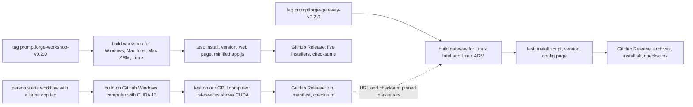

# PromptForge Build Simplification

## Context for a fresh session

If you are picking this up with no prior context, here is what you need to know.

- **Repository**: `c:\Users\Vinnie\cursor\promptforge`, a Rust workspace of about 30 crates under `crates/*`. The two products are `promptforge-gateway` (a headless HTTP server) and `promptforge-workshop` (a Tauri desktop app that embeds the gateway). Both serve web UIs built with esbuild.
- **Current branch**: `master`. The head commit is `becb112`, a cherry-pick of upstream PR 10 ("Accept fractional `vram_gb` for local models"). That commit is already verified and stays. All work in this plan goes on top of it as interim `wip:` commits, then squashes to one commit at the end. See "Commits and squash" at the bottom.
- **The problem**: today `cargo build` rewrites six git-tracked files under two `ui/dist/` folders (a 76,000-line diff), the CUDA llama-server build requires the CUDA toolkit and a GPU on the developer's machine, and a fresh `cargo build` fails on macOS and Linux because it tries to build the Tauri workshop with its default `cuda` feature.
- **Decisions already made by the user**: crates.io is not a target. Delivery is prebuilt installers from GitHub Releases. Node.js 22 is a required build tool. The Blackwell CUDA llama-server is a separate GitHub-built release artifact, Windows x64 only. The gateway installer is Linux only, via cargo-dist. The workshop installer covers Windows, macOS (ARM and Intel), and Linux, via tauri-action. whisper-rs stays linked in (do not split it into a sidecar). Work happens directly on `master`, interim commits, squash to one at the end after verification.
- **Reference material**: a comparison report against Zed and Unsloth is at `cabinet/_output/report-build-comparison-zed-unsloth-promptforge.md` in the parent workspace. It is background, not required reading; this plan is self-contained.
- **Verification**: each part ends with a numbered test section. Run all of them before the squash. The final gate is `git status --porcelain` printing nothing after a full build.

## How to read this plan

This plan has five parts: A, B, C, D, E. Each part is independent work. Each numbered step ends in its own commit. Do not push to any remote until the user asks.

Words used in this plan:

- **UI**: the web pages (the workshop page and the config page). Written in TypeScript. A tool named esbuild turns them into one `app.js` file and one `app.css` file.
- **dist folder**: the folder that holds the built `app.js` and `app.css`. Today it is `ui/dist/` and git tracks it. This is the cause of the dirty-tree problem.
- **build script**: a Rust file named `build.rs`. Cargo runs it before it compiles the crate.
- **build-dependency**: a crate that the build script uses, not the program itself.
- **OUT_DIR**: a folder Cargo gives each crate for build output. It lives under `target/`. Git never tracks it.
- **rust-embed**: a Rust library. It puts files into the program at compile time. In debug builds it can also read files from disk when a request comes in.
- **llama-server**: the program that runs GGUF models. PromptForge starts it as a child process.
- **CUDA**: NVIDIA's GPU software. A CUDA build of llama-server is faster than the Vulkan build on NVIDIA GPUs.
- **Blackwell**: the newest NVIDIA GPU generation. Its compute capability number is 12.0, written as `120a-real` in build files.
- **nvidia-smi**: a program that comes with the NVIDIA driver. It tells us which GPUs the computer has.
- **cargo-dist**: a tool that builds Rust programs and publishes GitHub Releases with install scripts.
- **tauri-action**: a GitHub Action that builds a Tauri desktop app and uploads the installers to a GitHub Release.
- **workflow**: a file in `.github/workflows/`. GitHub runs it when something happens (a push, a tag, a schedule).
- **runner**: a computer GitHub provides to run a workflow. A "self-hosted runner" is our own computer. The existing `cuda.yml` workflow uses our self-hosted Windows computer with a GPU.
- **smoke test**: a fast test that answers one question: does the thing we built start and work at all.

## Background: why we are doing this

Today, when you run `cargo build` or `cargo test`, the build script rewrites six files that git tracks (two `app.js`, two `app.css`, two `manifest.json`). The diff is about 76,000 lines. The repository is never clean. This plan removes that problem at the root.

Today, building the CUDA version of llama-server happens inside `cargo build`. It needs the CUDA toolkit, CMake, Visual Studio, and a GPU on the developer's computer. This plan moves that work to GitHub and downloads the result like any other file.

## Answers to earlier questions

**Is one shared UI build helper correct for both UI crates?** Yes. We compared the two copies. The differences are: the list of static files, one extra check in the workshop crate, and a few lines that tell Cargo what to watch. A helper that takes a list of static files and a true/false flag for the extra check covers both. If the two UIs diverge later, each crate keeps its own small `build.rs` where crate-specific steps can live. Medium confidence: the difference today is small and structural, not behavioral.

**Do the Unsloth-style release checks work on GitHub Actions?** Yes. Each release workflow gets a test job at the end. The job installs the artifact on a clean computer, runs the program, and checks that the web page is served and that `app.js` is the small minified version. If a check fails, the release does not publish.

**Does the standalone gateway use Tauri?** No. `promptforge-gateway` is a plain HTTP server program. It has no window. It serves the web pages to any browser. Only `promptforge-workshop` uses Tauri. This is why the two products use different packaging tools.

## Part A: Move the UI build out of git

Goal: no build step ever writes into a folder that git tracks.

### A1. Make a new crate named `ui-build`

Location: `crates/ui-build/`. It is a library. Both UI crates use it as a build-dependency. This mirrors how `promptforge-gateway-build` is used today.

The crate has one public function:

```rust
pub struct UiBuild {
    /// Files to copy next to the bundle, relative to the ui folder.
    pub static_files: &'static [&'static str],
    /// Run the layer-rule check before bundling (workshop only).
    pub layer_check: bool,
}

pub fn build(config: UiBuild) -> Result<(), String>;
```

What `build` does:

1. Read `CARGO_MANIFEST_DIR` and `OUT_DIR` from the environment. If `CARGO_MANIFEST_DIR` is missing, fail with the message "run through cargo".
2. Tell Cargo to watch the inputs. Print one `cargo::rerun-if-changed=` line for the `ui/src` directory (Cargo watches a directory recursively, so one line covers every file under it), one for each static file, and one each for `ui/build.mjs`, `ui/package.json`, `ui/package-lock.json`, `ui/tsconfig.json`, and `ui/check-layers.mjs` when `layer_check` is true. Cargo reruns the build script when any of them change. This replaces the old manifest hash.
3. If `layer_check` is true, run `node check-layers.mjs` in the `ui` folder. Fail the build if it fails.
4. Run esbuild on `ui/src/main.ts` with these arguments: `--bundle --format=esm --target=es2022 --outfile=<OUT_DIR>/ui-dist/app.js`. Read the `PROFILE` environment variable; when it is `release`, add `--minify`. Prefer `ui/node_modules/.bin/esbuild` (on Windows it is `esbuild.cmd` and must run through `cmd /c`). If it is missing, fail with a clear message: "run `npm ci` in the ui folder first". Do not fall back to `npx`, because `npx` can download a different version and produce different output.
5. Copy each static file from `ui/` to `<OUT_DIR>/ui-dist/`, keeping the relative path.

There is no manifest file. There is no hash. Cargo's change detection does the job.

### A2. Change both UI crates to use the helper

In `crates/promptforge-workshop-server/build.rs`, replace the whole file with:

```rust
fn main() -> std::process::ExitCode {
    match ui_build::build(ui_build::UiBuild {
        static_files: ui_build::WORKSHOP_STATIC_FILES,
        layer_check: true,
    }) {
        Ok(()) => std::process::ExitCode::SUCCESS,
        Err(error) => {
            eprintln!("{error}");
            std::process::ExitCode::FAILURE
        }
    }
}
```

The static file lists move into `ui-build` as two constants: `WORKSHOP_STATIC_FILES` (index.html, style.css, pcm-worklet.js, the icon) and `CONFIG_UI_STATIC_FILES` (index.html, the icon). The config UI crate's `build.rs` is the same shape with `static_files: ui_build::CONFIG_UI_STATIC_FILES` and `layer_check: false`.

Add to each crate's `Cargo.toml` under `[build-dependencies]`: `ui-build = { path = "../ui-build" }`.

### A3. Point rust-embed at the build output

In `crates/promptforge-workshop-server/src/assets.rs` line 14 and `crates/promptforge-gateway-config-ui/src/assets.rs` line 12, change:

```rust
#[folder = "ui/dist/"]
```

to:

```rust
#[folder = "$OUT_DIR/ui-dist/"]
```

Add the `interpolate-folder-path` feature to `rust-embed` in the workspace `Cargo.toml`. In debug builds rust-embed reads from that folder at request time, so editing the UI and rebuilding the bundle still needs no Rust recompile. In release builds the files are embedded. One thing to verify in A7: rust-embed resolves `$OUT_DIR` to an absolute path, so the debug read-from-disk path must still work even though the folder is no longer next to the crate. The A7 debug test catches this if it is wrong.

### A4. Untrack the dist folders

Run:

```bash
git rm -r --cached crates/promptforge-workshop-server/ui/dist
git rm -r --cached crates/promptforge-gateway-config-ui/ui/dist
```

Add to `.gitignore`:

```
/crates/promptforge-workshop-server/ui/dist/
/crates/promptforge-gateway-config-ui/ui/dist/
```

### A5. Delete the old machinery

Delete these files with `git rm`:

- `crates/promptforge-workshop-server/build/manifest.rs`
- `crates/promptforge-workshop-server/ui/manifest.mjs`
- `crates/promptforge-gateway-config-ui/build/manifest.rs`
- `crates/promptforge-gateway-config-ui/ui/manifest.mjs`

In both `ui/build.mjs` files, remove the manifest-writing code and the `--package` flag. After this, `build.mjs` is only the esbuild API call with minify always on, plus the layer-rule plugin in the workshop one. The build scripts no longer call `build.mjs`; the helper calls esbuild directly in both profiles. `build.mjs` remains only so the `npm run build` script in each `package.json` (used by the CI `ui` job and by developers working on the frontend) keeps working.

### A6. Update the documentation

In the root `README.md` and both UI crate READMEs, state: to build this project you need Node.js 22 and you must run `npm ci` once in each `ui/` folder. Remove the sentences that say the artifact is checked in and that builds work without Node.

### A7. Test Part A

1. `cargo build -p promptforge-workshop-server` succeeds. `git status --porcelain` prints nothing.
2. `cargo build --release -p promptforge-workshop-server` succeeds. The binary serves the workshop page.
3. Same two checks for `promptforge-gateway-config-ui`.
4. `cargo test -p promptforge-workshop-server` passes (the asset tests in `assets.rs` must still pass).
5. Commit.

## Part B: Blackwell llama-server as a separate release product

Goal: no developer computer needs the CUDA toolkit, CMake, or a GPU to build PromptForge. The CUDA llama-server is built on GitHub and downloaded at run time, the same way the Vulkan build is downloaded today.

Facts this part relies on:

- The upstream llama.cpp project publishes a Windows CUDA 13 zip for each release. It includes Blackwell support (`120a-real`) since upstream PR 18436. It also publishes a matching `cudart` zip with the CUDA runtime DLLs. It publishes no Linux CUDA binary.
- Today the CUDA build lives in `crates/promptforge-gateway-build` and runs inside `cargo build` of `promptforge-gateway-local` when the `llama-cuda` feature is on. It detects the GPU with `nvidia-smi`, builds with CMake, walks the DLL dependencies with `dumpbin`, runs a smoke test, and embeds the result into the Rust binary with `include_bytes!`.
- The download table for the Vulkan/Metal builds is in `crates/promptforge-gateway-local/src/artifacts/assets.rs`. The pinned llama.cpp release tag there is `b10082`.

### B1. Turn the CUDA builder into a command-line tool

Move the crate with `git mv crates/promptforge-gateway-build crates/llama-cuda-build`. Update the workspace member list in the root `Cargo.toml` if it names the path (it uses `crates/*`, so no change needed there). Change the crate from a library used as a build-dependency into a program with `[[bin]] name = "llama-cuda-build"`. The only consumer today is `promptforge-gateway-local`'s build-dependency, which Part B3 removes; until B3 lands, keep a thin `src/lib.rs` that re-exports nothing and mark the old build-dependency for removal, or do B1 and B3's feature removal in the same step. Simpler: do B1 and the feature removal together in one commit, since the crate has no other consumer.

Keep these modules as they are: `cmake.rs` (the CMake flag list does not change), `deps.rs` (the dumpbin walk), `manifest.rs` (the manifest format), `toolchain.rs` (the nvcc/cmake version checks).

Change these things:

- Remove `submodule.rs`. The tool no longer checks a git submodule. It takes `--source <folder>` pointing at a llama.cpp checkout.
- Add `--arch <list>`. Example: `--arch 120a-real`. This replaces the `nvidia-smi` detection, which fails on a computer with no GPU. When `--arch` is not given, keep the `nvidia-smi` detection as the default.
- Add `--out <folder>`. The tool writes its output there.
- Add `--no-smoke`. This skips the `--list-devices` smoke test, which needs a GPU. The GitHub build computer has no GPU, so the workflow uses this flag. The self-hosted smoke test in B2 covers the GPU check.
- After the build, copy the CUDA runtime DLLs that `llama-server.exe` imports (for example `cudart64_*.dll`, `cublas64_*.dll`, `cublasLt64_*.dll`) from the toolkit on the build computer into the output. The dumpbin walk in `deps.rs` already knows which ones. With these DLLs in the zip, the end user does not need the CUDA toolkit installed, only the NVIDIA driver.
- Write one zip file named `llama-server-cuda-blackwell-<tag>-win-x64.zip` containing `llama-server.exe`, its sibling DLLs, the CUDA runtime DLLs, and `llama-cuda-manifest.json`. Write a second file `<name>.sha256` with the checksum of the zip.
- Remove the code that embeds the bundle into Rust (`llama_cuda_bundle.rs` generation and the `include_bytes!` path). Nothing embeds this output anymore.

### B2. The GitHub workflow that builds it

New file: `.github/workflows/llama-cuda-blackwell.yml`.

When it runs: when a person starts it by hand (with an input for the llama.cpp tag, default `b10082`), and when a push to `master` changes files under `crates/llama-cuda-build/`.

Three jobs:

1. **build** on `windows-2022` (a GitHub computer):
   - Install the CUDA toolkit version 13.x with the `Jimver/cuda-toolkit` action. The llama.cpp project builds its own CUDA releases on this same kind of computer, so this is proven. A GPU is not needed to compile.
   - Clone `ggml-org/llama.cpp` at the tag.
   - Run `cargo run -p llama-cuda-build -- --source <checkout> --arch 120a-real --no-smoke --out dist/`.
   - Upload `dist/` as a workflow artifact.
2. **smoke** on `[self-hosted, windows, cuda]` (our own computer, the one `cuda.yml` already uses):
   - Download the artifact. Unzip it.
   - Run `llama-server.exe --list-devices`. The output must contain `CUDA`.
   - Run the existing live test with `PROMPTFORGE_LIVE_CUDA=1` against this binary.
3. **publish** (runs only if smoke passes):
   - Create or update a GitHub Release named `llama-cuda-blackwell-<tag>` on the upstream repository.
   - Upload the zip, the manifest, and a `SHA256SUMS` file.

Then delete `.github/workflows/cuda.yml`. Its two jobs (compile check and live test) now live in this workflow.

### B3. Run-time selection of the llama-server build

In `crates/promptforge-gateway-local`:

1. **Asset table** (`src/artifacts/assets.rs`): add two new Windows x64 rows next to the existing Vulkan row.
   - `cuda-blackwell`: the URL and sha256 of the release from B2. One zip.
   - `cuda`: the upstream `llama-b10082-bin-win-cuda-13.x-x64.zip` plus the matching `cudart` zip, each with its sha256. Two archives extracted into the same install folder. Extend the installer code to handle a row with more than one archive.
2. **Backend selection** before any download. This selection runs only on Windows x64. On Linux the existing Vulkan row still applies; on macOS the existing Metal row still applies; neither changes. On Windows x64, run `nvidia-smi --query-gpu=compute_cap --format=csv,noheader`.
   - Any GPU with compute capability `12.x`: use `cuda-blackwell`.
   - Any other NVIDIA GPU: use `cuda`.
   - No NVIDIA GPU, or `nvidia-smi` missing or failing: use `vulkan`.
   - Config override in the gateway config file: `[local] llama_backend = "auto" | "cuda-blackwell" | "cuda" | "vulkan"`. Default is `auto`. One new key. No new port.
3. **Resolution order for the executable** (this is the Zed pattern): first `[local] llama_server_path` from the config, then the `PROMPTFORGE_LLAMA_SERVER` environment variable (today it is used only in tests; promote it to production), then the managed download under `~/.promptforge/llama.cpp/`. If a download fails and an older version is already in the cache, use the cached one and log a warning instead of failing to start.
4. **Remove the embedded CUDA path**: delete `src/artifacts/cuda_bundle.rs`, the `llama_cuda_embedded` configuration flag, and the `llama-cuda` feature from `promptforge-gateway-local` and `promptforge-gateway`. The `workshop-cuda` feature becomes `["workshop", "promptforge-stt/cuda"]`. The workshop `cuda` default feature now means only the speech-to-text CUDA build. The `CUDA_PATH` discovery code is no longer needed because the runtime DLLs ship inside the archives.
5. **Remove the submodule**: `git rm third_party/llama.cpp` and delete `.gitmodules`. The B2 workflow clones llama.cpp by tag, so the submodule has no remaining user. Update the README: `git submodule update --init` is no longer a setup step.

### B4. Test Part B

1. On a Windows computer with a Blackwell GPU: `llama_backend = "auto"` downloads the Blackwell zip and `llama-server --list-devices` shows CUDA.
2. On a Windows computer with an older NVIDIA GPU: `auto` downloads the upstream CUDA zips.
3. On a computer with no NVIDIA GPU: `auto` downloads the Vulkan zip.
4. `PROMPTFORGE_LLAMA_SERVER` pointing at a local build wins over the download.
5. `cargo build -p promptforge-workshop` succeeds on a computer with no CUDA toolkit.
6. Commit.

## Part C: Release workflows



### C1. Gateway release for Linux

What we use: a tool named cargo-dist. It is made for Rust programs. It builds the program, puts it in an archive, writes an install script, and publishes a GitHub Release. We do not write these steps by hand.

What cargo-dist makes on our machine, one time:

- A config file at the repository root, named `dist-workspace.toml`. This file tells cargo-dist what to build.
- A workflow file, `.github/workflows/release.yml`. GitHub runs this file when we push a tag.

What we put in the config file:

- Build only the `promptforge-gateway` program. Do not build the other crates. Build it with the `workshop` feature on, so the headless Linux gateway can also serve the workshop web page to a browser. The full feature set for the release build is the default features plus `workshop`.
- Start a release when we push a tag with this name: `promptforge-gateway-v0.2.0`. The number is the version from the root `Cargo.toml`.
- Build for two kinds of Linux computer: Intel/AMD 64-bit, and ARM 64-bit. Do not build for Windows. Do not build for macOS. Those users get the gateway inside the workshop installer.
- Make one `install.sh` script. A user runs this script with one command. The script downloads the correct archive for the computer and puts the program in the user's `bin` folder.
- Make a file named `SHA256SUMS`. This file has a checksum for each archive. A user can check that the download is correct.

One extra step before the build:

- The gateway contains two web pages (the config page and the workshop page). To build them, the GitHub computer needs Node.js. We add a step that installs Node.js version 22 and runs `npm ci` in the two `ui/` folders. The gateway build then finds the web pages.

One extra file in the archive:

- A sample systemd service file, `promptforge-gateway.service`. A Linux server admin can copy this file to start the gateway at boot. If you do not want this, we remove it. It is 15 lines.

A test after the build:

- Start a clean Linux computer on GitHub.
- Run the `install.sh` script against the archive we built.
- Run `promptforge-gateway --version`. It must print the version.
- Start the gateway with a small config file.
- Request `/config/` from the gateway. The response must be the config web page.
- If any step fails, the release does not publish.

### C2. Workshop release for Windows, macOS, and Linux

What we use: a GitHub Action named `tauri-action`. It runs `cargo tauri build` and uploads the installers to a GitHub Release. The bundle settings are already in [crates/promptforge-workshop/tauri.conf.json](crates/promptforge-workshop/tauri.conf.json): NSIS for Windows, DMG for macOS, deb and AppImage for Linux.

New file: `.github/workflows/release-workshop.yml`. It runs when we push a tag named `promptforge-workshop-v0.2.0`.

Four build jobs:

- **Windows** on `windows-latest`: install the CUDA 13 toolkit with `Jimver/cuda-toolkit`. The toolkit is needed because the speech-to-text library (whisper-rs) compiles CUDA code. A GPU is not needed to compile. Install Node.js 22, run `npm ci` in both `ui/` folders, then build with the default features. Output: one NSIS `.exe` installer.
- **macOS ARM** on `macos-latest` with target `aarch64-apple-darwin`: build with `--no-default-features`. The Metal llama-server comes from the existing download row; whisper runs on CPU. Output: one `.dmg`.
- **macOS Intel** on `macos-latest` with target `x86_64-apple-darwin`: same flags. Output: one `.dmg`.
- **Linux** on `ubuntu-22.04`: build with `--no-default-features`. The Vulkan llama-server comes from the existing download row; whisper runs on CPU. Output: one `.deb` and one `.AppImage`.

No code signing yet. Nothing is signed today. The workflow leaves clear places to add signing later.

A test after each build:

- Install the produced package on a clean computer of the same kind (NSIS with the `/S` flag, mount the DMG and copy, `dpkg -i` the deb).
- Run `promptforge-workshop --version`. It must print the version.
- Check that the installed program serves the workshop web page and that `app.js` is the small minified file, not the large debug file. A size check is enough: the minified file is under one fifth the size of the debug file.
- If any step fails, the release does not publish.

Publish: one GitHub Release with all five installers and a `SHA256SUMS` file.

### C3. Keep the tree clean in CI

In `.github/workflows/ci.yml`, add one step at the end of the `check` and `check-workshop` jobs: run `git status --porcelain` and fail if it prints anything. This makes CI catch any future build step that writes into the repository.

## Part D: Line-ending rules for Windows checkouts

The repository already has a [.gitattributes](.gitattributes) that forces LF line endings in the two `ui/` trees. Extend it:

```
* text=auto eol=lf
*.ps1 text eol=crlf
*.bat text eol=crlf
*.png binary
*.ico binary
*.icns binary
*.gguf binary
*.bin binary
```

The existing `ui/**` rules stay. Their comment about the manifest hash is removed, because Part A removes the manifest.

Then run `git add --renormalize .` and commit the result on its own. This is the only commit in this plan that touches many files without changing their content.

## Part E: Make a fresh clone build on macOS and Linux

This part comes from a build-friction inventory of the repository. The findings, with evidence:

- The root README says to run `cargo build`. Because the workspace members are `crates/*`, that command builds every crate, including `promptforge-workshop`. The workshop's default feature is `cuda`, which turns on the whisper CUDA build. On macOS and Linux this fails without the CUDA toolkit. On Linux it also fails without the webkit2gtk system packages that Tauri needs. CI never runs this path: the Linux jobs exclude the workshop, and the workshop job runs on Windows with `--no-default-features`.
- The lean path, `cargo build -p promptforge-gateway`, works on macOS and Linux today. Its default features (local, web-search, config-ui) pull in no CUDA, no Tauri, and no whisper. It needs only a C compiler (for the vendored Lua, onig, and ring) and network access for a one-time 130 MB model download.
- The submodule is needed only for the Windows `llama-cuda` feature. After Part B3 it is gone entirely.
- The README and `AGENTS.md` disagree about Node. One says the default build needs Node 22; the build scripts say a fresh clone with a good checked-in `dist` needs no Node. After Part A, Node is always required, which settles this.
- There is no `rust-toolchain.toml`, so a developer with an older Rust gets a confusing error instead of a clear one.
- The guide needs mdBook to build locally. The README does not say so.

### E1. Make plain `cargo build` build the gateway

In the root `Cargo.toml`, add:

```toml
default-members = ["crates/promptforge-gateway"]
```

After this, `cargo build` and `cargo test` with no `-p` flag build only the gateway and its dependencies. This works on a fresh clone on macOS and Linux with no CUDA toolkit, no Tauri system packages, and (after Part B3) no submodule. Building the desktop app becomes an explicit choice: `cargo build -p promptforge-workshop`. Zed does exactly this (`default-members = ["crates/zed"]`).

### E2. Per-OS setup instructions

Add a "Build from source" section to the root README with three subsections.

**Ubuntu 22.04:**

```bash
sudo apt install build-essential pkg-config cmake clang libclang-dev
# only for the desktop app (promptforge-workshop):
sudo apt install libwebkit2gtk-4.1-dev libxdo-dev libssl-dev libayatana-appindicator3-dev librsvg2-dev
```

**macOS:**

```bash
xcode-select --install
brew install cmake node
```

**Windows:** Visual Studio with the C++ workload, CMake, Node.js 22. The CUDA toolkit is needed only for the whisper CUDA feature, which the workshop enables by default on Windows.

Each subsection ends with the two commands: `cargo build` for the gateway, `cargo build -p promptforge-workshop` for the desktop app.

### E3. Pin the Rust toolchain

Add `rust-toolchain.toml` at the root:

```toml
[toolchain]
channel = "1.89"
```

This matches the MSRV in the workspace `Cargo.toml` and the CI pin. A developer with an older default toolchain now gets the right one automatically through rustup instead of a compile error.

### E4. Align the documentation

- Root README: replace the current build section with the E2 section. State that Node 22 and `npm ci` in both `ui/` folders are required (Part A makes this true). State that `cargo build` builds the gateway and `cargo build -p promptforge-workshop` builds the desktop app.
- `AGENTS.md`: same two commands.
- Gateway README: fix the line that says the default build needs Node 22. After Part A it does, but the sentence should say Node is needed for the UI build, not for Rust itself.
- Guide: add one line to the README, "build the guide locally with `mdbook build guide`".

### E5. Add a Linux workshop build to CI

Add one job to `.github/workflows/ci.yml`:

- Runner `ubuntu-22.04`.
- Install the Tauri system packages from E2.
- Install Node 22, run `npm ci` in both `ui/` folders.
- Run `cargo build -p promptforge-workshop --no-default-features`.

This is the first time CI builds the desktop app on Linux. It catches the class of failure your teammates are hitting. It does not run the app, only compiles it. The release workflow in Part C2 already builds the real installers.

### E6. Test Part E

1. On a clean Ubuntu 22.04 container with only the E2 packages: `git clone`, `npm ci` in both `ui/` folders, `cargo build` succeeds and produces `promptforge-gateway`.
2. Same on macOS with only CLT, cmake, and node.
3. `cargo build -p promptforge-workshop --no-default-features` succeeds on Ubuntu with the Tauri packages.
4. `cargo test` (no flags) runs the gateway tests and passes with no GPU and no models.
5. Commit.

## Order of work

1. **Part D** first. It is one commit and it makes every later diff clean.
2. **Part E** second. It is small, it unblocks your macOS and Linux teammates today, and it is independent of the rest.
3. **Part A** next. It fixes the dirty tree, the problem that started this work.
4. **B1 and B2** in parallel with A if wanted. B3 waits for the first Blackwell release from B2, because the asset table needs its URL and checksum.
5. **Part C** last. It needs A (release computers build the UI the new way) and B3 (no CUDA compile on GitHub computers). C3 needs only A.

## Commits and squash

- Work happens directly on `master`.
- Every numbered step in every part ends in its own interim commit. Interim commit messages start with `wip:` so they are easy to recognize (for example `wip: add ui-build crate`, `wip: untrack ui/dist`).
- Nothing is pushed to any remote during the work.
- Before the first `wip` commit, record the current head of `master` (`git rev-parse master`). This is the squash base.
- After the last step, run every test section in the plan (A7, B4, C-smoke where possible locally, E6) and confirm `git status --porcelain` is clean.
- When all checks pass, squash the interim commits into one: `git reset --soft <squash base>` then a single `git commit` with a real message describing the whole change. `master` then has exactly one new commit for this work, on top of the earlier commits including the PR 10 cherry-pick.
- The squash happens only after you confirm the verification results. If any check fails, the interim commits stay so we can find the step that broke.

## Risks

- The `Jimver/cuda-toolkit` action's exact CUDA 13 sub-version on `windows-2022` must be checked when we write the workflow. Low confidence on the exact sub-version; the approach itself is proven by llama.cpp's own CI.
- The generic CUDA row needs two archives (about 380 MB total) where every other row needs one. The installer code needs a small extension for multi-archive rows.
- Removing the submodule changes the clone instructions. Anyone with an existing checkout runs `git submodule deinit third_party/llama.cpp` once. The README will say so.
- The macOS workshop builds are unsigned. macOS will warn users on first launch. Signing needs an Apple developer account and is a later task.
- The `ui-build` helper's debug-mode read-from-disk path depends on rust-embed resolving `$OUT_DIR` to an absolute path at request time. This is the one unverified assumption in Part A. The A7 debug test catches it. If it fails, the fallback is to have the build script also copy the bundle to a fixed folder under `target/` and point rust-embed there.

## Final verification before squash

Run these in order after the last `wip` commit. All must pass before the squash.

1. `git status --porcelain` prints nothing.
2. `cargo build` (no flags) succeeds and produces `promptforge-gateway`.
3. `cargo build -p promptforge-workshop --no-default-features` succeeds.
4. `cargo test` (no flags) passes with no GPU and no models.
5. `cargo build --release -p promptforge-gateway` succeeds and the binary serves `/config/`.
6. `cargo test -p promptforge-workshop-server` passes (the asset tests in `assets.rs`).
7. On Windows with a Blackwell GPU, after B2 has published its release: a run of the gateway with default config downloads the Blackwell zip and `llama-server --list-devices` shows CUDA.
8. The three workflow files parse (`llama-cuda-blackwell.yml`, `release.yml`, `release-workshop.yml`). Full end-to-end release testing happens on GitHub, not locally; local verification covers steps 1 through 6, and step 7 needs the B2 release to exist.

Steps 7 and 8 cannot run fully until the workflows execute on GitHub. The squash does not wait for them. Squash after steps 1 through 6 pass and the workflow files are reviewed.


---

## Recovered rationale

Recovered from the producing chat sessions by the plan ledger on 2026-09-04. Everything below this heading is derived annotation, not part of the original plan.

# Enrichment: PromptForge Build Simplification

## Why this plan exists

The trigger was frustration, not a feature request. Mid-chat, while cherry-picking upstream PR 10, the user said: "I am getting fucking sick of this shit with the ui/dist changing and showing dirty on github." That sent the session into a comparative study of Zed and Unsloth builds. The study's headline finding framed the whole plan: PromptForge was the only one of the three that runs a web bundler inside the compiler, the only one that compiles CUDA inside the compiler, and the only one that tracks built UI output in git.

Later the user widened the scope beyond the dirty tree: "Its not just about the ui/dist stuff. Its about being able to build easier in general. My teammates on mac and linux report endless headaches." This sentence is the reason Part E (fresh-clone builds on macOS/Linux) exists; without it the plan was only Part A.

## Decisive user calls (verbatim)

These sentences settled the design. They are quoted because they carry intent the plan file only summarizes:

- "I no longer care about keeping crates on crates.io." - killed the packaging constraints that crates.io imposes (no network at build time, no prebuilt binaries), which is what made prebuilt-installer delivery possible at all.
- "The primary delivery vehicle will be a prebuilt installer binary for Linux, Mac, or Windows."
- "I'm okay with the CUDA prebuild, but since I have dual Blackwell home setup I also need a specialized build. Can we move that to its own separate build product and have it built on GitHub with GitHub Actions and published as a release binary with known SHA?" - the origin of Part B.
- "A shared helper for the app.js build or whatever is fine, but call it ui-build not promptforge-anything." - naming was the user's, and he challenged the premise: "Are you sure that the same helper will always be applicable to both?" The plan's "Answers to earlier questions" section exists to answer that challenge.
- "Leave whisper-server alone for now, because this introduces yet another port number and config headache" - the explicit rejection of the sidecar alternative (see below).
- "standalone gateway installer github release should be for Linux" - gateway is Linux-only by user decision, not by technical limitation.
- "I want each step to be its own interim commit and then I want you to squash everything down to 1 commit at the end once we verify it works" and "use master silly" - the wip-commit-then-squash workflow and the no-feature-branch decision.
- "reword this to be crystal clear and not require massive context. Use ASD-STE100" - the plan's glossary, plain language, and per-step test sections are a direct response to this demand, after the user reacted to an earlier draft with "There is so much jargon here and I do not understand it."

## Discarded alternatives

- **whisper-server as a sidecar child process** (replacing linked-in whisper-rs). The comparison report recommended it at low confidence; the user rejected it outright ("yet another port number and config headache"). Consequence the plan had to absorb: the workshop's default `cuda` feature still compiles whisper.cpp with nvcc, so the CUDA toolkit requirement survives on Windows workshop builds even after llama-server stops needing it.
- **crates.io as a distribution target.** Dropped by the user; this unlocked runtime downloads of prebuilt binaries.
- **Upstream's prebuilt CUDA llama-server for Blackwell.** Research found upstream's Windows CUDA 13.x prebuilt already covers sm_120, but the user wanted PromptForge's own specialized build with a known SHA, so Part B builds it instead of trusting upstream's artifact.
- **Keeping the llama.cpp submodule.** The assistant initially kept it for the Blackwell workflow, then decided a shallow CI clone at a pinned tag is cleaner so developers never need it; the plan removes the submodule entirely.
- **Zed-style plain archives with install scripts for the gateway.** Considered against cargo-dist's native installers; cargo-dist won because it produces shell/powershell/MSI installers and GitHub Releases from a tag with no custom tooling.
- **A single shared release tag for both products.** Rejected in favor of per-product tags (`promptforge-gateway-v*`, `promptforge-workshop-v*`) because cargo-dist and tauri-action each want to own release creation and would conflict on one tag.
- **Keeping the self-hosted `cuda.yml` daily build.** Retired; its smoke-test role moves into the new Blackwell workflow.

## Deviations discovered during the run

The plan's mechanics held; the surprises were all in GitHub Actions reality:

- **`Jimver/cuda-toolkit` failed on `windows-2022` with CUDA 13.2** (installer exit code failure). The plan had flagged low confidence on the exact sub-version; the fix was to drop the action and install CUDA with NVIDIA's network installer in a plain script step.
- **The self-hosted runner did not exist yet.** The user had to register it fresh (one for the fork, one for upstream), then fight three environment issues the plan never anticipated: `dtolnay/rust-toolchain` needs `bash.exe`, so Git's `bin` had to be added to the runner service's PATH via the registry; PowerShell script execution was disabled (execution policy fix); and `pwsh` was absent (only Windows PowerShell on the runner).
- **GitHub expressions have no `.replace()`.** `release-workshop.yml` failed validation ("Unexpected symbol: '('") and the tag-to-version parsing had to be rewritten.
- **tauri-action argument passing:** `--no-default-features` must follow a `--` separator or the CLI rejects it.
- **macOS Intel leg cross-compiling from an ARM runner** hit the whisper.cpp deployment-target wall (`-mmacosx-version-min=10.13` injected by the cmake crate). Env-var fixes did not reach the build script; the working fix was a `.cargo/config.toml` `[env]` section, with a later recommendation to use a native Intel runner instead.
- **Release provenance changed hands mid-run.** The user pushed to his fork first to iterate, then to upstream, and ordered: "no that's not ok, I already pushed to the upstream. you have to reset to upstream/master and then add the sha on top." The Blackwell zip built on the fork was copied to the upstream release so the pinned checksum in the asset table stays valid ("will the release checksum be the same for the version compiling in the upstream?" - it would not have been).
- **Scope grew: nightly installer builds.** Not in the plan. The user asked for them and chose trigger-on-push over manual dispatch: "I want 1 and I want it triggered on push so we can iterate and I dont have to remember to trigger it manually?" A fork guard keeps nightlies from running on forks.
- **A FAQ worth keeping:** when the user asked "why do we need the CUDA toolkit install if the cuda llama is prebuilt", the answer is whisper-rs - the toolkit on the Windows workshop leg compiles whisper.cpp's CUDA backend, not llama-server. This is the direct cost of the discarded sidecar alternative.

## Emotional register (context for future runs)

The user was frustrated throughout the run ("why is this such a fucking pain in the ass?", "I hate GHA", "this is fatigueing") and surprised an LLM could not one-shot workflow files. The plan's local verification gates (steps 1-6 before squash) proved their value: every failure above was a CI-environment issue, not a plan-logic issue.
