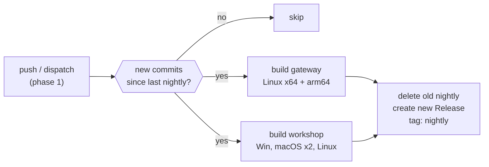

# Nightly Installer Builds

## Design

One new workflow file: `.github/workflows/nightly.yml`. Two phases:

**Phase 1 (fork testing):** triggered on push to master and `workflow_dispatch`. No fork guard. Every push kicks it off so we iterate fast. The `nightly` release lands on the fork.

**Phase 2 (upstream):** once green, change the trigger to `schedule: cron 0 8 * * *` plus `workflow_dispatch`, add `if: github.repository == 'cppalliance/promptforge'` on the first job, and remove the push trigger. One commit swap.

## Skip-when-unchanged

The first job compares `github.sha` against the tag `nightly`'s commit. If they match, the workflow exits early and burns no compute. On push triggers during phase 1, every push with new code runs the build; duplicates from force-pushes are caught by the concurrency group.

## Gateway build

Reuse the cargo-dist build setup: install Node 22, `npm ci` in both `ui/` folders, then `cargo build --release -p promptforge-gateway --features workshop` for both Linux targets. This mirrors the release workflow but without cargo-dist's release machinery (no install script, no announcement). The binaries are archived as tarballs.

The ARM build needs a cross-compilation runner or a native ARM runner. The release workflow uses `ubuntu-22.04-arm` for this. The nightly does the same.

## Workshop build

Reuse `tauri-apps/tauri-action@v0` with the same matrix as [`release-workshop.yml`](.github/workflows/release-workshop.yml): Windows (default features, CUDA toolkit for whisper), macOS ARM, macOS Intel, Linux (no-default-features). The CUDA toolkit install step uses the same network installer workaround.

No signing, matching the release workflow.

## Publish

- Delete the existing `nightly` tag and release with `gh release delete nightly --cleanup-tag --yes`
- Create a new release: `gh release create nightly --title "Nightly (YYYY-MM-DD)" --prerelease --target $GITHUB_SHA`
- Upload all built artifacts plus a `SHA256SUMS` file
- The release is marked as a prerelease so it doesn't show as "Latest" (the CUDA Blackwell release keeps that spot)

## Key details

- **Trigger (phase 1):** `push: branches: [master]` plus `workflow_dispatch` - iterates on every push
- **Trigger (phase 2):** `schedule: cron '0 8 * * *'` plus `workflow_dispatch` plus fork guard
- **Timeout:** 240 minutes for the whole workflow (the CUDA toolkit install + whisper compile on the Windows workshop leg is the bottleneck)
- **Concurrency:** `group: nightly, cancel-in-progress: true` - a manual re-trigger cancels the running build
- **No tests:** the nightly skips the per-platform install tests from the release workflows; CI on master already covers correctness
- **Artifact naming:** files include the date and short SHA, e.g. `promptforge-gateway-nightly-2026-09-02-5cc0254-linux-x64.tar.gz`
- **Permissions:** `contents: write` for the release creation/deletion
- **Fork guard:** none in phase 1; `if: github.repository == 'cppalliance/promptforge'` in phase 2

## Files changed

- New: `.github/workflows/nightly.yml`
- No changes to existing files

---

## Recovered rationale

Recovered from the producing chat sessions by the plan ledger on 2026-09-04. Everything below this heading is derived annotation, not part of the original plan.

# Enrichment: Nightly installer builds (nightly_installer_builds_d83a02b9)

Source: creator chat, Sep 1-2 2026 (began inside the promptforge_build_simplification run).

## Origin

The idea came at 11:34 PM, minutes after the CUDA Blackwell llama-server release finally shipped on upstream following roughly eight hours of fighting self-hosted runners, CUDA installer failures, shell PATH issues, and workflow syntax errors. The user's ask was one line: "can we make it so there are nightly installer builds". The assistant switched to plan mode explicitly because "nightly builds are a design decision with trade-offs (compute cost, storage, signing, update channels)" (assistant, paraphrase of mode-switch rationale).

## Decisions and why

**Scope: both products, rolling single release.** The assistant posed two questions with options. Product scope options were: both gateway and workshop (recommended), workshop-only, or gateway-only. Retention options were: rolling keep-only-latest (recommended), keep last 7 nightlies, or workflow artifacts (auto-expire in 90 days, no GitHub Release). The recommended options (both products, rolling single nightly) were adopted; the other five combinations were discarded without debate. The rolling-delete design is also what keeps the nightly from competing with real releases for storage and attention.

**Skip-when-unchanged.** Comparing `github.sha` against the `nightly` tag's commit exists to avoid burning compute on nights with no new commits - a direct reaction to a day spent watching long, expensive builds run unnecessarily.

**CUDA toolkit stays on the Windows leg.** The user challenged this: "why do we need the CUDA toolkit install if the cuda llama is prebuilt". Answer: the toolkit is for whisper-rs (the workshop's default `cuda` feature compiles whisper.cpp's CUDA backend from source), not for llama-server. The assistant offered a discarded alternative: build the nightly workshop with `--no-default-features` (CPU-only whisper) to skip the toolkit install and cut 10+ minutes. The user rejected it with the decisive sentence: "10 minutes is fine. do mac and linux have solutions for whisper?" (macOS uses Core ML / Accelerate, Linux builds with `--no-default-features` anyway, so only Windows pays the toolkit cost.)

**Two-phase trigger: the user's central design contribution.** The assistant originally wrote the plan with cron + fork guard from the start. The user asked "but how will we test this before pushing to the upstream? are you sure it will work first try?" The assistant answered honestly: "No, I'm not sure it will work first try. Today's track record makes that clear." It offered two options: (1) drop the fork guard, test on the fork with manual `workflow_dispatch`, then add the guard back for upstream - "safer given today's experience" (assistant); or (2) push to upstream and iterate there, leaning on GitHub's immediate YAML validation but risking broken build steps on upstream. The user picked option 1 but modified it, in the sentence that defines the final design: "I want 1 and I want it triggered on push so we can iterate and I dont have to remember to trigger it manually?" That is why Phase 1 triggers on every push to master with no fork guard, and Phase 2 is a one-commit swap to cron + `if: github.repository == 'cppalliance/promptforge'`.

**Fork guard mechanics.** The user asked "will this also build nightlies in my fork". The guard goes on the first job so the fork's cron fires, hits the condition, and exits immediately with zero compute burned - same pattern as the Pages workflow already in the repo.

**Prerelease flag.** The nightly release is marked `--prerelease` so it never takes the "Latest" slot, which belongs to the CUDA Blackwell release that had just shipped (paraphrase of plan rationale, consistent with the chat context).

## Validation of the phased approach

The user's instinct proved correct within the hour: the first fork run failed because `tauri-action` rejects `--no-default-features` unless it is passed after `--`. The same latent bug was found and fixed in the release workflow too. Iterating on the fork caught this before it ever touched upstream.

## Emotional context (why the safety margins)

By the time nightlies came up, the user had said "why is this such a fucking pain in the ass?", "I hate GHA", and "this is fatigueing". The push-triggered iteration loop, the skip-check, and the fork-first testing are all designed to minimize exactly that pain: no manual triggers to remember, no wasted compute, no broken builds on upstream.
