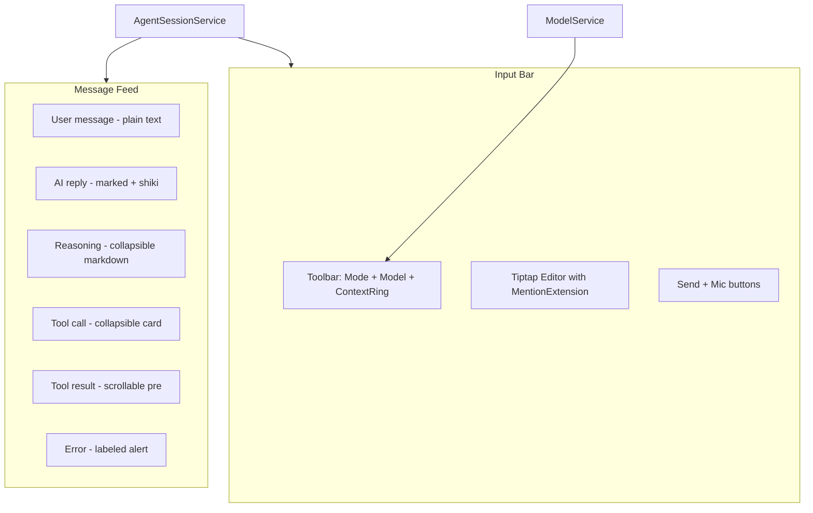

# Workshop Agent Window - Cursor Clone

## Current State

The agent session UI ([agent-session-view.ts](promptforge/crates/promptforge-workshop-server/ui/src/ui/agent-session-view.ts)) is plain text only: a `<textarea>` input, `textContent`-rendered transcript, flat `<code>` tool calls. The backend supports chat, streaming, reasoning, tool calls, tool results, model selection, and voice. No markdown, no mentions, no modes, no context tracking.

## Naming Conventions

New code aligns with Cursor's internal naming for future comparison. Existing types (`AgentSessionService`, `TranscriptItem`, `AgentPanel`, etc.) stay - they're clearer than Cursor's "composer" naming and well-tested.

| New component | Class/function name | Cursor equivalent |
|---|---|---|
| Rich editor wrapper | `PromptInput` | prompt-input module family |
| ProseMirror mention node | `mentionNode` (type name in schema) | Same |
| ProseMirror command node | `commandNode` (type name in schema) | Same |
| Inline mention pill | `MentionChip` | mention-chip component |
| Typeahead suggestion popup | `TypeaheadPopup` | suggestion render |
| Mode selector chip | `ModeChip` | mode-chip / `unifiedMode` |
| Model picker button | `ModelPickerTrigger` | Same |
| Context usage SVG | `TokenRing` | Same |
| Tool call display | `ToolCallCard` | tool-call-card |
| Markdown render function | `renderMarkdown()` | `TC` component (better name) |
| Mode state field | `unifiedMode` | Same |

CSS classes for new elements: `.prompt-input`, `.mention-chip`, `.tool-call-card`, `.token-ring-background`, `.token-ring-progress`, `.model-picker-trigger`, `.mode-chip`.

## Target State

A Cursor-style agent panel with:
- Tiptap rich editor with @-mention scaffold (chips, typeahead popup, keyboard nav)
- Markdown-rendered AI messages (marked + shiki)
- Collapsible tool call cards with header/body/status
- Model dropdown (wired to existing `ModelService`)
- Mode dropdown (UI-only, events for future wiring)
- Context usage ring (UI-only scaffold)
- Streaming cursor animation on pending messages
- Restyled feed matching Cursor's single-column density

## Architecture

## Dependencies to Add

In [ui/package.json](promptforge/crates/promptforge-workshop-server/ui/package.json):

- `@tiptap/core`, `@tiptap/pm`, `@tiptap/starter-kit` - editor framework (vanilla install confirmed: `new Editor({ element, extensions, content })`, no framework needed)
- `@tiptap/extension-mention`, `@tiptap/extension-placeholder` - mention and placeholder (mention has an official vanilla-JS example in Tiptap docs)
- `@floating-ui/dom` - popup positioning for the typeahead, only if Tiptap's managed `props.mount()` API is unavailable in the installed version
- `marked` - markdown to HTML
- `shiki` - syntax highlighting. IMPORTANT: do not import from `shiki` or `shiki/bundle/*` - those register every grammar as a dynamic-import chunk even when tree-shaken. Use `createHighlighterCore` from `shiki/core` with explicit static imports per language (`@shikijs/langs/lua`, `@shikijs/langs/python`, `@shikijs/langs/rust`, `@shikijs/langs/typescript`, `@shikijs/langs/html`, `@shikijs/langs/css`, `@shikijs/langs/javascript`, `@shikijs/langs/yaml`, `@shikijs/langs/toml`, `@shikijs/langs/json`, `@shikijs/langs/markdown`, `@shikijs/langs/bash`) plus a custom theme built from the Step 1 `--syntax-*` values (those ARE Cursor's code colors - using `dark-plus` instead would leave the tokens dead and the colors off). Use `createJavaScriptRegexEngine` from `shiki/engine/javascript` - it avoids the Oniguruma WASM binary entirely. WebView2 is Chromium with ES2024 regex `v` flag support, so `@shikijs/langs-precompiled` (smaller, faster startup) is also an option if plain grammars prove slow.
- `dompurify` - sanitize marked HTML output (marked's built-in `sanitize` is deprecated)

No React. All vanilla TS with Tiptap's framework-agnostic API.

## Rulebook Constraints

All paths in this plan are relative to the workspace root `c:\Users\Vinnie\cursor`.

Governing rule files for every dispatch (read before working; their rules bind):
- `promptforge/AGENTS.md` (repo root)
- `promptforge/crates/promptforge-workshop-server/ui/AGENTS.md` (UI layer rules)
- `tools-public/rulebooks/vibe-rulebook.md` (execution discipline)
- `tools-public/rulebooks/typescript-rulebook.md`
- `tools-public/rulebooks/javascript-rulebook.md`
- `tools-public/rulebooks/html-css-rulebook.md`
- `tools-public/rulebooks/rust-rulebook.md` (Step 9 and Step 16 touch Rust)

## Build and Test Commands

All UI commands run in `promptforge/crates/promptforge-workshop-server/ui`:

- Build: `npm run build` (esbuild -> `dist/`)
- Typecheck + layer check: `npm run typecheck`
- Tests: `npm test` (node --test over `test/**/*.mjs` and `src/**/*.test.mjs`; jsdom-based)

Rust commands run at the workspace root `promptforge/`:

- Build: `cargo build -p promptforge-workshop-server -p promptforge-stt`
- Tests: `cargo test -p promptforge-workshop-server -p promptforge-stt`

TypeScript rulebook bindings for all new code:
- `strict: true` + `verbatimModuleSyntax` are enforced by the project's `tsconfig.json`; `noUncheckedIndexedAccess` is NOT in tsconfig - write new code as if it were (defensive indexed access), but do not enable it globally in these steps
- No `enum` - use `as const` with derived union types (applies to mode dropdown values)
- No `any` - ProseMirror doc JSON is `unknown` at extraction boundaries, validate before use
- No barrel files - no `index.ts` re-exports among new files
- `import type` for type-only imports
- Explicit return types on exported functions
- All Promises awaited or `void ... .catch(...)` - Tiptap init and Shiki highlighter init are async

HTML/CSS rulebook bindings for all new code:
- Semantic elements: `
`/`
` for ToolCallCard, `<button type="button">` for toolbar triggers, `<nav>` or `role="toolbar"` for AgentToolbar
- `:focus-visible` styles on all interactive elements (existing pattern uses `outline: 2px solid var(--accent-dim)`)
- CSS custom properties with fallbacks: `var(--token, fallback)` on every var() use
- Logical properties (`margin-inline`, `padding-block`) over physical for new CSS
- Contrast check: `--text-tertiary` at 60% opacity of #F0F0F0 on #181818 yields ~#9A9A9A at ~4.2:1 - borderline for 4.5:1 body text; acceptable for secondary/de-emphasized content but must not carry primary meaning

JavaScript rulebook bindings:
- No floating promises - `void ... .catch(...)` for fire-and-forget (Shiki highlighter init, Tiptap editor creation)
- Never `innerHTML` untrusted data - markdown output from `marked` is piped through `DOMPurify.sanitize()` before DOM insertion; user messages always use `textContent`
- ESM imports with explicit extensions (esbuild handles this)

## File Plan

### New files

- `ui/src/ui/prompt-input.ts` + `prompt-input.css` - Tiptap editor component (`PromptInput` class), placeholder, submit handling, IME guard, auto-resize
- `ui/src/ui/workshop/mention-chip.ts` - ProseMirror NodeView (`MentionChip`) for inline mention pill
- `ui/src/ui/workshop/typeahead-popup.ts` - positioned popup (`TypeaheadPopup`) for @-mention suggestions, keyboard-navigable
- `ui/src/ui/markdown-render.ts` + `markdown-render.css` - `renderMarkdown(text, options?)` using marked + shiki + DOMPurify, chunked streaming, returns `DocumentFragment`
- `ui/src/ui/tool-call-card.ts` + `tool-call-card.css` - `ToolCallCard` class, `
`/`
` collapsible card
- `ui/src/ui/mode-chip.ts` - `ModeChip` dropdown, mode state as `as const` union
- `ui/src/ui/model-picker-trigger.ts` - `ModelPickerTrigger` dropdown, wired to `ModelService`
- `ui/src/ui/token-ring.ts` - `TokenRing` SVG component, two concentric circles with stroke-dasharray
- `ui/src/ui/agent-toolbar.ts` + `agent-toolbar.css` - `AgentToolbar` composing ModeChip + ModelPickerTrigger + TokenRing in a flex row

### Modified files

- [agent-session-view.ts](promptforge/crates/promptforge-workshop-server/ui/src/ui/agent-session-view.ts) - Replace textarea with `PromptInput`, replace `renderItem()` to use markdown renderer and `ToolCallCard`. Feed structure stays (identity-diffed prefix repaint).
- [agent-session.css](promptforge/crates/promptforge-workshop-server/ui/src/ui/agent-session.css) - Restyle the feed: single-column, streaming cursor, left accent on user messages, Cursor-density spacing.
- [agent-panel.ts](promptforge/crates/promptforge-workshop-server/ui/src/ui/workshop/agent-panel.ts) - Pass `ModelService` into the view for the toolbar.
- [panel-types.ts](promptforge/crates/promptforge-workshop-server/ui/src/ui/workshop/panel-types.ts) - Thread `ModelService` into `AgentPanel` factory.
- [main.ts](promptforge/crates/promptforge-workshop-server/ui/src/main.ts) - Pass `ModelService` through to panel factory. Restore zoom from localStorage on boot.
- [style.css](promptforge/crates/promptforge-workshop-server/ui/style.css) - Add all design tokens (Step 1).
- [build.mjs](promptforge/crates/promptforge-workshop-server/ui/build.mjs) - Verify esbuild handles the new Tiptap/ProseMirror/marked/shiki/DOMPurify imports.
- [shortcuts.ts](promptforge/crates/promptforge-workshop-server/ui/src/ui/workshop/shortcuts.ts) - Add zoom keybinds.
- [window-menu.ts](promptforge/crates/promptforge-workshop-server/ui/src/ui/window-menu.ts) - Add zoom menu items.
- [index.html](promptforge/crates/promptforge-workshop-server/ui/index.html) - REC badge span becomes a second LED span (Step 17).
- [status-bar.ts](promptforge/crates/promptforge-workshop-server/ui/src/ui/status-bar.ts) - `setRecording()` targets the rec LED modifier (Step 17).
- `voice.ts`/`voice.css` - renamed to `stt.ts`/`stt.css` (Step 9), then gain the `SttInputTarget` adapter seam (Step 10).
- Rust: `promptforge-stt` crate route registration and `promptforge-workshop-server` router composition - `/voice` -> `/stt`, `/voice/capability` -> `/stt/capability` (Step 9).

### Unchanged

- `agent-session.ts`, `agent-socket.ts`, `protocol.ts` - service layer untouched
- `model-service.ts`, `workbench-service.ts` - consumed, not modified
- `workshop-panel.ts`, `editor-panel.ts` - untouched

## Implementation Steps

Steps are ordered by dependency. Each step is one commit with its own focused tests.

### Step 1: Design tokens

Full sweep of [style.css](promptforge/crates/promptforge-workshop-server/ui/style.css) to sync with Cursor's dark theme. All values extracted from Cursor's `tokens.js` and embedded `:root` CSS in `workbench.glass.main.js`. The `--cursor-*` prefix is dropped; values map to the workshop's existing token names plus new ones.

**Surfaces** - replace current tokens:
- `--bg` #0f0f0f -> `#181818`
- `--bg-raised` #1a1a1a -> `#141414`
- `--bg-hover` #252525 -> `color-mix(in srgb, #F0F0F0 8%, transparent)`
- Add `--bg-card`: `color-mix(in srgb, #F0F0F0 6%, transparent)`
- Add `--bg-input`: `#181818`
- Add `--bg-elevated`: `#181818`

**Text** - opacity tiers:
- `--text` #e8e8e8 -> `#F0F0F0`
- `--text-muted` #909090 -> `color-mix(in srgb, #F0F0F0 74%, transparent)`
- Add `--text-tertiary`: `color-mix(in srgb, #F0F0F0 60%, transparent)`
- Add `--text-quaternary`: `color-mix(in srgb, #F0F0F0 36%, transparent)`

**Borders** - opacity-based:
- `--border` #2a2a2a -> `color-mix(in srgb, #F0F0F0 12%, transparent)`
- Add `--border-subtle`: `color-mix(in srgb, #F0F0F0 8%, transparent)`

**Typography**:
- `--font-size-xs`: 11px, `--font-size-sm`: 12px, `--font-size-base`: 13px, `--font-size-lg`: 14px
- `--line-height-xs`: 14px, `--line-height-sm`: 16px, `--line-height-base`: 18px, `--line-height-lg`: 22px
- `--letter-spacing-base`: -0.08px, `--letter-spacing-lg`: -0.15px
- `--font-weight-medium`: 500, `--font-weight-semibold`: 590

**Spacing** - Cursor's 4px base unit:
- `--space-1` through `--space-20` (4px to 80px)
- Old names become explicit aliases: `--space-xs: var(--space-1)` (4px), `--space-sm: var(--space-1-5)` (6px), `--space-md: var(--space-2)` (8px), `--space-lg: var(--space-3)` (12px), `--space-xl: var(--space-4)` (16px)

**Radius**:
- `--radius` 8px -> 6px (base), `--radius-sm`: 4px, `--radius-lg`: 8px, `--radius-xl`: 12px, `--radius-full`: 9999px

**Control heights**: `--height-xs`: 20px, `--height-sm`: 24px, `--height-base`: 28px, `--height-lg`: 32px

**Shadows**:
- `--shadow-primary`: `color-mix(in srgb, #000 20%, transparent)`
- `--shadow-secondary`: `color-mix(in srgb, var(--shadow-primary) 60%, transparent)`
- `--shadow-tertiary`: `color-mix(in srgb, var(--shadow-primary) 30%, transparent)`
- `--shadow-popup`: `0 3px 8px var(--shadow-secondary), 0 2px 5px var(--shadow-secondary), 0 1px 1px var(--shadow-secondary)`

**Accent** - keep workshop orange, add Cursor semantic colors:
- Keep `--accent` #e05a2b, `--accent-dim` #b04722
- Add `--color-red`: #FC6B83, `--color-green`: #3FA266, `--color-yellow`: #F1B467, `--color-cyan`: #81A1C1, `--color-blue`: #7BAFE9, `--color-purple`: #9386F2

**Syntax highlighting** (for code blocks):
- `--syntax-bg`: #181818, `--syntax-fg`: #D6D6DD
- `--syntax-keyword`: #82D2CE, `--syntax-string`: #E394DC, `--syntax-function`: #EFB080
- `--syntax-number`: #EBC88C, `--syntax-comment`: #E4E4E45E, `--syntax-constant`: #F8C762, `--syntax-link`: #87C3FF

**Motion**:
- `--duration-instant`: 50ms, `--duration-fast`: 100ms, `--duration-normal`: 150ms, `--duration-slow`: 200ms
- `--ease-out-cubic`: `cubic-bezier(0.215, 0.61, 0.355, 1)`, `--ease-out-quint`: `cubic-bezier(0.16, 1, 0.3, 1)`

**Component tokens** (used by later steps):
- `--mention-bg`: `color-mix(in srgb, #81A1C1 12%, transparent)`, `--mention-text`: #81A1C1
- `--tool-card-bg`: `var(--bg)`, `--tool-card-border`: `var(--border-subtle)`, `--tool-card-header-height`: 28px
- `--prompt-input-bg`: `var(--bg-card)`, `--prompt-input-border`: `var(--border-subtle)`, `--prompt-input-border-focus`: `var(--border)`, `--prompt-input-min-height`: 36px, `--prompt-input-max-height`: 200px, `--prompt-input-radius`: 6px
- `--model-trigger-height`: 24px, `--model-trigger-radius`: 9999px
- `--token-ring-track`: `var(--border-subtle)`, `--token-ring-fill`: `var(--text-muted)`

Test: build passes, no broken layouts in the existing UI (spacing aliases keep spacing identical; the 8px -> 6px base radius tightening is an intentional visual change, not a regression).

### Step 2: Markdown renderer

Build in `markdown-render.ts`:

- `renderMarkdown(text: string, options?: { streaming?: boolean }): DocumentFragment` - the message renderer. Uses `marked` with these custom renderers (extracted from Cursor's `markdownRenderer.js` overrides): `image` parses dimension suffixes from the href (`image.png =100x200` -> width/height attrs); `link` HTML-escapes the href, falls back to href as title, sets `draggable="false"`; `paragraph` renders inline tokens only. Fenced code blocks integrate Shiki through marked's `code` renderer.
- `highlightCode(code: string, lang: string): string` - standalone Shiki highlighter for one code block, exported for Step 3's ToolCallCard to highlight tool-call argument JSON.

Shiki init is async (`createHighlighterCore` returns a Promise) but `renderMarkdown` is sync. Resolution: create the highlighter at module scope and export `markdownReady: Promise<void>`; `main.ts` awaits `markdownReady` during boot before mounting dockview (alongside the existing socket boot queue). Before readiness, `renderMarkdown` renders code blocks as unhighlighted `<pre><code>` - a brief degraded state at cold boot, never mid-session.

Sanitization contract (research-confirmed): marked deliberately does not sanitize - it emits `javascript:` hrefs and passes raw `<script>`/`` through; the built-in sanitize option was removed for giving false confidence. The pipeline is `DOMPurify.sanitize(marked.parse(text), { USE_PROFILES: { html: true }, SANITIZE_NAMED_PROPS: true })` as the LAST step before DOM insertion, never post-processed after. Sanitization lives at the render boundary inside `renderMarkdown` itself so no upstream caller can bypass it.

Streaming mode: per LangChain's frontend guidance, re-parsing and re-sanitizing the full buffer on every delta is fast enough for chat-length content (<5ms for a 5KB message). Do NOT build the 12ms chunked renderer from Cursor's `markdownChunkedRender.js` - it is over-engineering for our message sizes. If profiling later shows flicker on long streams, the upgrade path is block-sealed incremental parsing (streamkit/Incremark pattern: re-lex into block tokens, memoize completed blocks, re-render only the growing tail block - O(n) instead of O(n^2)).

Add `markdown-render.css` for code blocks, blockquotes, tables, inline code, and headings - all using the new syntax and surface tokens from Step 1. The rendered output's root element carries class `markdown-content` - Step 4's streaming-caret selector and Step 5's containers both target that class, so it is part of this step's contract.

Dependencies: `marked`, `shiki`, `dompurify`. Verify esbuild bundles cleanly.

Test: `renderMarkdown` produces correct DOM for headings, paragraphs, bold, italic, code blocks with syntax highlighting, links, lists, blockquotes, tables. Security test: `javascript:` hrefs, `<script>` tags, and inline event handlers in model-authored input are stripped. Streaming: full re-parse per delta stays under frame budget at chat-scale lengths.

### Step 3: Tool call cards

Build `ToolCallCard` class in `tool-call-card.ts`. A `
`/`
` collapsible card. Header shows tool name in `--font-weight-semibold`, call count badge (`calls.length` from `ToolCallItem`), status icon. Body shows call arguments as syntax-highlighted JSON (via `highlightCode(args, "json")` from Step 2) and tool result as scrollable `<pre>`.

Pending definition (the wire protocol has no pending flag for tool calls - deltas exist only for reply/reasoning): a tool call is "running" until a `tool-result` item with a matching `toolCallId` appears later in the transcript. `ToolCallCard` takes `running: boolean` from the caller (Step 5 computes it by scanning for the matching result). Auto-open while running, auto-collapse when the result lands.

Add `tool-call-card.css` using tokens from Step 1.

Test: card renders with correct header text and call count, expands/collapses, auto-expands while `running` is true, auto-collapses when it flips false.

### Step 4: Feed restyle

Update `agent-session.css` to single-column layout. Drop `align-self: flex-end` on `.agent-item--user`. Add subtle left accent border on user messages (`border-inline-start: 2px solid var(--accent-dim)`). Add streaming cursor animation on the last pending row: `.agent-item--pending:last-child` gets a blinking caret via `::after` on its last content element (attach to `.markdown-content > :last-child::after` after Step 5 replaces `.agent-item__text` with markdown containers - the selector must target the rendered markdown tail, not the old text-block class). CSS animation uses `--duration-*` tokens. Update all spacing and typography to use the new tokens from Step 1.

Test: visual inspection; existing tests pass.

### Step 5: Feed integration

Replace the rendering paths in `renderItem()` in [agent-session-view.ts](promptforge/crates/promptforge-workshop-server/ui/src/ui/agent-session-view.ts):
- `reply` items: use `renderMarkdown(item.text, { streaming: item.pending })` instead of `textBlock()`; the fragment lands in a container with class `markdown-content` (Step 2's contract - Step 4's caret selector depends on it)
- `reasoning` items: use `renderMarkdown()` inside the existing `
` block, same `markdown-content` container
- `tool-call` items: use `ToolCallCard` instead of flat `<code>` + `<ul>`; compute `running` by scanning the transcript for a `tool-result` whose `toolCallId` matches one of the call's rows (Step 3's contract)
- `user` items: keep `textContent` (user-authored, not markdown)
- `tool-result` and `error` items: keep current rendering

The identity-diffed prefix repaint stays unchanged - it diffs by `TranscriptItem` object identity regardless of how each item renders.

Test: full transcript renders with markdown, tool cards collapse correctly, streaming messages update without rebuilding settled history.

### Step 6: PromptInput base

Build `PromptInput` class in `prompt-input.ts` wrapping a Tiptap `Editor` instance. Extensions: `StarterKit` (paragraph, text, hardBreak only), `Placeholder`. Submit on Enter (with `isComposing` guard). Auto-resize: sync `scrollHeight` to `style.height` on update, clamped between `--prompt-input-min-height` and `--prompt-input-max-height`. Exposes `getText(): string` and `clear(): void`. Emits an `onSubmit` callback.

Add `prompt-input.css` for the editor container, placeholder, focus border.

Test: editor mounts, placeholder shows, Enter submits (IME composition guarded), auto-resize works, `getText()` returns the content.

### Step 7: Mention chip

Build the `MentionChip` NodeView in `mention-chip.ts` by **extending the official `@tiptap/extension-mention`** - not a from-scratch node: `Mention.extend({ name: "mentionNode", addNodeView() { ... } })` (CORRECTED mid-run: the rename must live in `.extend({ name })`, not `.configure({ name })` - in @tiptap/core 3.31 `configure()` merges its argument into options and explicitly restores the parent name, so it cannot rename the node). The `name: "mentionNode"` rename makes the registered node type match Cursor's ProseMirror JSON schema, so serialized docs compare cleanly against Cursor's; the extension's suggestion command follows the rename automatically.

The NodeView is vanilla DOM (research-confirmed pattern from tiptap.dev/docs/editor/extensions/custom-extensions/node-views/javascript): `addNodeView()` returns `{ dom }` where `dom` is a `` containing an icon slot, a label `` (CSS-truncated), and a remove `<button type="button" aria-label="Remove">` whose click handler deletes the node via `editor.chain().deleteRange({ from: getPos(), to: getPos() + node.nodeSize }).run()`.

Test: mention node renders as a pill in the editor, remove button deletes it, node is non-editable, `editor.getJSON()` serializes it with type `mentionNode`.

### Step 8: Typeahead popup

Build `TypeaheadPopup` in `typeahead-popup.ts`. Creates a `
` with a keyboard-navigable `<ul>` of suggestion items, appended to `document.body`. Implements Tiptap's suggestion render lifecycle (research-confirmed API from tiptap.dev/docs/editor/api/utilities/suggestion):

- `onStart(props)` - create the popup DOM, wire click handlers calling `props.command(item)`, position it
- `onUpdate(props)` - re-filter items, re-render the list, re-anchor position as the cursor moves
- `onKeyDown(props)` - return `true` to consume ArrowUp/ArrowDown (cycle a `selectedIndex` with modulo wraparound), Enter (`props.command(selectedItem)`), Escape (close). Return `false` to let the editor handle other keys
- `onExit()` - remove the popup from the DOM, no leaks

**Positioning** (two options, prefer the first): Tiptap's newer `props.mount(element)` API anchors the popup to the cursor rect and auto-repositions on scroll/resize via Floating UI's autoUpdate - no positioning code to write. If `mount` is unavailable in the installed version, fall back to manual: pass `{ getBoundingClientRect: () => props.clientRect?.() ?? new DOMRect() }` as a virtual element to Floating UI `computePosition` with `strategy: "fixed", placement: "bottom-start", middleware: [offset(6), flip(), shift()]`, then assign `left`/`top` to the popup. Requires `@floating-ui/dom` as a dependency only in the manual case.

Items come from a stub that returns three canned entries (e.g. `@README.md`, `@src/main.ts`, `@Cargo.toml`) so the popup's open/filter/select cycle is testable before a real workspace index exists. An empty stub can't be tested - the popup would have nothing to render.

Wired into the mention extension from Step 7 via `suggestion: { char: "@", items, render: () => ({ onStart, onUpdate, onKeyDown, onExit }) }`.

Test: typing `@` opens the popup, arrow keys navigate with wraparound, Enter selects (inserts mention node), Escape dismisses, popup tracks the cursor across scroll/resize.

### Step 9: Rename voice to stt

Mechanical rename, no behavior change. The capability is speech-to-text dictation - no voice output exists - and prior art is unanimous that `/voice` signals a two-way voice pipeline (STT+LLM+TTS), not one-way dictation: OpenAI uses `/v1/audio/transcriptions` for STT and reserves voice naming for Realtime; Azure uses `/stt/...`; Deepgram uses `/listen`; Corti's push-to-talk dictation endpoint is `/transcribe`. The Rust crate is already `promptforge-stt`, so `/stt` is the coherent name across the stack.

UI:
- `ui/src/ui/voice.ts` -> `ui/src/ui/stt.ts`, `voice.css` -> `stt.css`
- `setupVoice` -> `setupStt`, `VoiceStatus` -> `SttStatus`, `VoiceHandle` -> `SttHandle`, `VoiceCapability` -> `SttCapability`, `voiceCapability()` -> `sttCapability()`
- CSS classes: `.voice-mic` -> `.stt-mic`, and any other `.voice-*` classes in `stt.css`
- References: `agent-session-view.ts`, `agent-panel.ts` (`SILENT_STATUS` type), `workshop/panel-types.ts` (imports `VoiceStatus` from `../voice` - becomes `SttStatus` from `../stt`), `ui/test/agent-voice.mjs` -> `agent-stt.mjs`, `agent-voice-boot.mjs` -> `agent-stt-boot.mjs`

Wire routes (same commit - one rename, one history line):
- `/voice` -> `/stt`, `/voice/capability` -> `/stt/capability` - every reference across the `promptforge-stt` crate (route registration), `promptforge-workshop-server` (router composition, any tests), and the UI fetch paths in `stt.ts`.

Test: existing voice test suite passes under the new names and routes; build passes on both the UI and the Rust workspace.

### Step 10: PromptInput integration + stt adapter

Replace the `<form>` + `<textarea>` in `AgentSessionView` with `PromptInput`. The mic button moves into the new input bar. Submit reads `editor.getText()` and calls `editor.commands.clearContent()` on success. The pending-wait gate maps from `input.disabled`/`input.readOnly` to `editor.setEditable(pinned)` / `editor.setEditable(true)` (ProseMirror has no `disabled`; `setEditable(false)` is the equivalent).

**STT adapter** (data-flow fix - the plan's earlier "voice.ts unchanged" was wrong): `stt.ts` splices interim transcripts into `input.value` and reads `selectionStart` - an API that only exists on `<textarea>`. Tiptap's `view.dom` is a `contenteditable` div, not a textarea. Introduce a narrow `SttInputTarget` interface in `stt.ts`: `{ getText(): string; insertAtCursor(text: string): void; setReadOnly(readOnly: boolean): void }` (exact shape settled by what stt.ts actually touches). Two implementations: the existing textarea adapter (one-line wrappers, behavior unchanged) and a ProseMirror adapter (`insertAtCursor` -> `editor.chain().insertContent(text).run()`, readOnly -> `setEditable(!readOnly)`). `AgentSessionView` passes the adapter matching whichever input is mounted.

Test: agent session works end-to-end (send, receive, dictation splices at cursor), input enables/disables with pending wait, placeholder shows when empty.

### Step 11: Mode chip

Build `ModeChip` dropdown in `mode-chip.ts`. A `<button type="button">` trigger showing the current mode label and icon. Click opens a dropdown (using existing `DropdownMenu` from `dropdown.ts`) with Agent/Ask/Plan/Debug items. Mode state: `const UNIFIED_MODES = { Agent: "agent", Ask: "ask", Plan: "plan", Debug: "debug" } as const; type UnifiedMode = typeof UNIFIED_MODES[keyof typeof UNIFIED_MODES]`. Selection fires a `CustomEvent("agent-mode-changed", { detail: mode })` on `document` - no backend wire yet. Default: `"agent"`.

Test: dropdown opens, selection changes the chip label, custom event fires with correct mode.

### Step 12: Model picker trigger

Build `ModelPickerTrigger` dropdown in `model-picker-trigger.ts`. A pill-shaped `<button type="button">` (`--model-trigger-height: 24px`, `--model-trigger-radius: 9999px`) showing `ModelService.current` display name. Click opens a dropdown listing `ModelService.models`. Selection calls `ModelService.setCurrent()`. Subscribes to `onDidChangeModels` and `onDidChangeCurrent` for reactive updates.

Test: shows current model, dropdown lists models, selection updates the service, reactively updates when models change.

### Step 13: Token ring

Build `TokenRing` in `token-ring.ts`. An SVG with two concentric circles: a background circle (`--token-ring-track`) and a progress circle (`--token-ring-fill`) using `stroke-dasharray` and `stroke-dashoffset` for the fill percentage. Reads from a stub that always returns 0%. Size: 16px default.

Test: renders correctly, stub percentage shows empty ring.

### Step 14: Toolbar

Build `AgentToolbar` in `agent-toolbar.ts`. A flex row (`role="toolbar"`) containing `ModeChip` + `ModelPickerTrigger` + `TokenRing`. Height: `--height-base` (28px). Add `agent-toolbar.css` using tokens from Step 1.

Test: toolbar renders all three controls, correct spacing, correct alignment.

### Step 15: Toolbar integration

Mount `AgentToolbar` above `PromptInput` in `AgentSessionView`. The threading seam already exists: [panel-types.ts](promptforge/crates/promptforge-workshop-server/ui/src/ui/workshop/panel-types.ts) defines `PanelServices` (currently `{ statusBar: TreeStatusSink & SttStatus }`) which `main.ts` passes through Dockview's `createComponent` into `createPanelComponent(options, services)`. Add `modelService: ModelService` to `PanelServices`, populate it in `main.ts`, and consume it in the `agent` factory: `new AgentPanel(services?.statusBar, services?.modelService)`. [agent-panel.ts](promptforge/crates/promptforge-workshop-server/ui/src/ui/workshop/agent-panel.ts) forwards it to the view. The toolbar sits between the feed and the input bar.

Test: full agent session UI shows toolbar with working model picker, mode chip, and context ring.

### Step 16: Global zoom

Add Ctrl+Plus / Ctrl+Minus / Ctrl+0 zoom to [shortcuts.ts](promptforge/crates/promptforge-workshop-server/ui/src/ui/workshop/shortcuts.ts) and [window-menu.ts](promptforge/crates/promptforge-workshop-server/ui/src/ui/window-menu.ts). Export `zoomIn()`, `zoomOut()`, `resetZoom()` functions. Step size 0.1, range 0.5 to 2.0.

Keybinding detail: `event.key` is `"="` for Ctrl+= but `"+"` for Ctrl+Shift+= (same physical key, shifted). The existing `installShortcuts` handler returns early for Shift combinations except `Ctrl+Shift+F`, so the zoom cases must be evaluated BEFORE that early return, accepting both `"="` and `"+"` as zoom-in (both are the plus key conventionally). Ctrl+- is `"-"` and Ctrl+0 is `"0"` with or without Shift.

**Implementation - NOT CSS zoom** (research-changed). CSS `zoom` on `documentElement` breaks fixed-position overlays: `getBoundingClientRect()` returns zoom-scaled viewport coordinates while `client*`/`offset*` properties do not, so dropdowns and the typeahead popup land offset by the zoom factor, and floating-ui mispositions under CSS zoom specifically (floating-ui issue #3032). Production Tauri apps (Vibe Kanban PR #3175) migrated off CSS/native-viewport zoom for exactly these reasons.

Two-tier approach:
- **Desktop (Tauri)**: native webview zoom via `getCurrentWebviewWindow().setZoom(factor)` from `@tauri-apps/api/webviewWindow` (already a dependency at ^2.11.1 - no new package), gated on `window.__TAURI_INTERNALS__ !== undefined` (the existing desktop-detection pattern used in `workshop-panel.ts`). Native zoom scales the entire coordinate system consistently - no overlay breakage.
- **Browser/dev fallback**: CSS zoom on `document.documentElement` with `position: relative` on `body` (the documented floating-ui workaround for #3032). Degraded but functional for development; dropdown/popup positions may drift at non-1.0 zoom.

Persistence: `promptforge.workshop.zoom` in localStorage (default 1.0), restored at boot in `main.ts` (calls `setZoom` on desktop). Native zoom does not persist across sessions on its own.

Note: WebView2 can compound app zoom with OS display/text scaling on a minority of systems (WebView2Feedback #3839) - not actionable, but documented so a reported "UI too big/small" bug checks OS scaling first.

Test: keyboard zoom works, menu items work, zoom persists across reload, all panels scale uniformly, dropdown menus and (later) the typeahead popup anchor correctly at 0.8x and 1.5x zoom.

### Step 17: REC badge becomes an LED

Replace the REC text badge in the status bar with a second LED. Today [index.html](promptforge/crates/promptforge-workshop-server/ui/index.html) renders `REC` beside `` inside `.status-bar__indicators`; [status-bar.ts](promptforge/crates/promptforge-workshop-server/ui/src/ui/status-bar.ts) `setRecording()` toggles `--active` on the badge; [status-bar.css](promptforge/crates/promptforge-workshop-server/ui/src/ui/status-bar.css) styles the badge with `--rec-idle`/`--rec-active`.

The change:
- `index.html`: replace the REC span with ``, placed one LED-width to the left of the activity LED (the indicators group's `gap` becomes `var(--led-size)`).
- `status-bar.ts`: `setRecording(on)` toggles a `status-bar__led--recording` modifier on the rec LED instead of the badge class. Constructor querySelector updates to the new class.
- `status-bar.css`: add `.status-bar__led--recording` - same radial-gradient core + layered box-shadow bloom as the generating/thinking modifiers, in red (`--color-red` #FC6B83 from Step 1). Idle state is the shared unlit lens (no separate idle styling needed). Delete the `.status-bar__rec` rules and the now-dead `--rec-idle`/`--rec-active` tokens from `style.css`.
- Tests: `ui/test/progress-swap-indicators.mjs` and any test querying `.status-bar__rec` update to the new element.

Accessibility: the badge's "REC" text was a visible label; the LED is color-only. The `aria-label` covers assistive tech, and recording state is also visible on the mic button itself (`aria-pressed` + the recording fill in stt.css), so no information is lost.

Test: recording lights the red LED, stopping dims it to the idle lens, progress bar swap still hides/shows the indicators group intact, existing status-bar tests pass with updated selectors.

### Step 18: CSS sweep

Sweep all component CSS files to use the new design tokens from Step 1, replacing hardcoded px/hex values. The old token names (`--space-xs` etc.) stay as aliases. No visual change expected - this is a token-only cleanup.

Files: `agent-session.css`, `status-bar.css`, `window-chrome.css`, `window-menu.css`, `stt.css`, `workshop/zones.css`, `workshop/dropdown.css`, `workshop/editor-panel.css`, `workshop/gateway-config-panel.css`, `about-dialog.css`.

Test: build passes, no visual regressions.

---

## Recovered rationale

Recovered from the producing chat sessions by the plan ledger on 2026-09-04. Everything below this heading is derived annotation, not part of the original plan.

# Enrichment: Workshop Agent Window Clone (4a7128b9)

## Origin and intent

The creator chat opened with "Find the UI for the agent window here C:\Users\Vinnie\AppData\Local\Programs\cursor" - the first move was to read Cursor's installed source, not to design from imagination. The goal, verbatim: "I want to replicate the look and feel and behavior of Cursor's agent window, but in my promptforge/crates/promptforge-workshop/"

The decisive scoping sentence: "I want a clone of Cursor's agent window, when it is in project mode (a visible workspace tree showing folders, not the glass shit). Dont just add everything, get the scaffold in place for what we currently support, which is I think just the chat." This is why the plan builds full visual surface (mode dropdown, token ring, mention chips) with stubbed or absent backends - everything visible, wired only where the backend exists.

## Discarded alternatives

- **React**: user floated it ("would react make this easier?") then closed it: "I'm not trying to add React though can we just look at React implementation to copy the shape?" Rejected on bundle size, rewrite cost against dockview, and because the existing identity-diffed `renderItem()` already is React's model written against the DOM. Tiptap/ProseMirror was confirmed framework-free before adoption ("does ProseMirror NodeView require react?" - no).
- **highlight.js**: considered as simpler to bundle; rejected because Cursor ships Shiki and look-fidelity was the point.
- **30-language Shiki bundle**: the assistant initially conceded "Ship the languages you want," but the user later reversed: "lets not bundle 30 languages just yet. bundle Lua, Python, Rust, Typescript, HTML, CSS, Javascript plus any other language we are using in promptforge or its toolchain (YAML? TOML?)" - hence the plan's explicit static-import grammar list.
- **Lazy grammar loading**: discussed and rejected in favor of static bundling - it matches the esbuild one-file-out pipeline and avoids serving grammar assets from promptforge-workshop-server.
- **Nested subagent tree views**: discarded after user correction: "hmm no I have never seen cursor show a hierarchical subagent view. opening a subagent always opens a new agent tab but it is a special agent tab that has no edit boxes."
- **Inline diff rendering and drag-and-drop context pills**: user expressed interest ("not sure what inline diff rendering is but I probably want it") but both were scoped out by the "scaffold for what we currently support" directive.

## Design decisions behind plan details

- **Naming alignment** (the plan's naming table): user-proposed - "should we rename some of our typescript app elements to align with Cursor's? for future code comparisons?" - to make future side-by-side diffs against Cursor source cheap. Existing workshop names stay where clearer (assistant recommendation, approved with "yes this sounds sensible").
- **Token sync** (Steps 1 and 18): "yes and I want a full sweep through cursor's stylesheets to sync our look and feel with theirs."
- **Global zoom** (Step 16): user asked for global Ctrl+/Ctrl- and probed the scope: "does this need menu items (i.e. Window menu) and will this affect every window not just agent?" - hence shortcuts plus window-menu plus all-window scope.
- **REC LED** (Step 17): "replace our REC light on the status bar with another LED, with one LED-width space to the left of the existing LED, and make it red off (red when recording)"; confirmed "the LEDs wont be adjacent, there will be a gap?" - hence the gap-equals-LED-width detail.
- **stt rename** (Step 9): "should we call it stt.ts instead of voice.ts? and in general use stt instead of voice?" and "should we rename /voice? spawn a subagent and search the web for prior art" - the rename was validated against external prior art before being planned.

## Run deviations (run chats)

- **Verification scoping**: user challenged "does full heavy verify make sense if we are not changing Rust?" - heavy Rust verify was skipped for steps touching no Rust.
- **REC LED color override**: the plan specified `--color-red` #FC6B83; post-implementation the user overrode: "amend the commit that it appears in, use ff2a4d as the color and do it ONLY for the LED, not for anything else."
- **Step 10 latitude**: the dispatch granted that the `SttInputTarget` interface in the plan was a sketch, not a contract - "settle the EXACT shape by reading what stt.ts actually touches."
- **Outcome gap**: after the run the user judged "if I'm being honest, this ui does not much resemble Cursor at all" and asked "why you didn't copy the elements, coordinates, layout, even though I told you to." Diagnosis (paraphrase from the run chat): the plan extracted Cursor's token values and component contracts but never extracted layout composition - column max-widths, paddings, DOM nesting, toolbar-inside-card - so the run delivered the machinery, not the appearance. The user then requested a fresh-context prompt for a pure layout-copy pass; that follow-up is this plan's expected successor.
