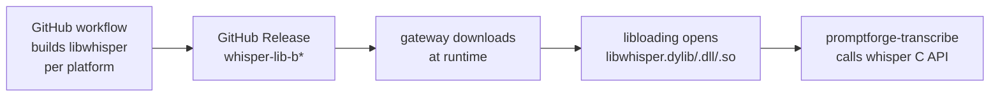

# Whisper Shared Library

## Execution strategy

Three bounded tasks, run sequentially in separate sessions:

1. **Whisper shared lib (W1-W6):** One commit for the workflow (push to fork, iterate until green), one commit for the FFI crate + asset table + switchover + feature removal + GPU probe. The workspace is `c:\Users\Vinnie\cursor\promptforge`. The Rust rulebook at `c:\Users\Vinnie\cursor\tools-public\rulebooks\rust-rulebook.md` governs code quality. Read the root `AGENTS.md` and any nested `AGENTS.md` on the path of touched crates before writing code.
2. **Download progress (P1):** One commit. Small change - emit the status frame the status bar already handles.
3. **Auto-updater (U1-U3):** Two or three commits. Push to the fork for testing (the `latest.json` endpoint needs a real GitHub Release). Read the Unsloth Studio auto-updater as reference: `c:\Users\Vinnie\cursor\unsloth\studio\src-tauri\src\desktop_updater.rs`, `c:\Users\Vinnie\cursor\unsloth\studio\frontend\src\hooks\use-tauri-update.ts`, and `c:\Users\Vinnie\cursor\unsloth\studio\src-tauri\tauri.conf.json` (updater section at lines 43-51).

## Problem

`whisper-rs-sys` compiles whisper.cpp from source inside every `cargo build` that includes the workshop feature. This requires cmake, a C++ toolchain, and - on macOS - a deployment target hack that we still can't get working in CI. The CUDA variant also needs the CUDA toolkit at build time. Moving whisper to a prebuilt shared library eliminates all of this.

## Architecture



Today's chain: `promptforge-transcribe` -> `whisper-rs` -> `whisper-rs-sys` (cmake compile at build time).

New chain: `promptforge-transcribe` -> `whisper-ffi` (libloading at run time) -> prebuilt `libwhisper`.

## Whisper C API surface needed

`promptforge-transcribe` uses exactly these whisper-rs functions (whisper-rs is used only in that crate, nowhere else in the workspace):

- `WhisperContext::new_with_params(path, params)` - maps to `whisper_init_from_file_with_params`
- `ctx.create_state()` - maps to `whisper_init_state`
- `ctx.tokenize(text, max)` - maps to `whisper_tokenize`
- `FullParams::new(Greedy { best_of: 1 })` + setters - maps to `whisper_full_default_params` + field writes
- `state.full(params, samples)` - maps to `whisper_full_with_state`
- `state.as_iter()` / `segment.to_str_lossy()` - maps to `whisper_full_n_segments_from_state` + `whisper_full_get_segment_text_from_state`
- `install_logging_hooks()` - maps to `whisper_log_set`
- `convert_integer_to_float_audio` - trivial, reimplement locally (test-only)

Plus `whisper_free` / `whisper_free_state` for cleanup.

Total: ~12 C function pointers loaded via `libloading`.

## Parts

### W1: The whisper build workflow

New file: `.github/workflows/whisper-lib.yml`.

Triggered on `workflow_dispatch` (with a whisper.cpp tag input) and on push to a `crates/whisper-ffi/` path.

Five build jobs (parallel):
- **Windows x64** (`windows-latest`): CUDA toolkit, `-DGGML_CUDA=ON -DBUILD_SHARED_LIBS=ON`. Produces `whisper.dll` plus CUDA runtime DLLs.
- **macOS ARM** (`macos-latest`, native): `-DGGML_METAL=ON -DBUILD_SHARED_LIBS=ON -DCMAKE_OSX_DEPLOYMENT_TARGET=11.0`. Produces `libwhisper.dylib`.
- **macOS Intel** (`macos-latest`, `--target x86_64-apple-darwin`): `-DGGML_METAL=OFF -DBUILD_SHARED_LIBS=ON -DCMAKE_OSX_DEPLOYMENT_TARGET=10.15`. Produces `libwhisper.dylib`.
- **Linux x64** (`ubuntu-22.04`): `-DBUILD_SHARED_LIBS=ON`. Produces `libwhisper.so`.
- **Linux ARM** (`ubuntu-22.04-arm`): same. Produces `libwhisper.so`.

Each job: clone whisper.cpp at the tag, cmake configure + build, pack the shared library + `whisper.h` into a zip with sha256, upload as artifact. A publish job creates a `whisper-lib-<tag>` GitHub Release with all five zips and a `SHA256SUMS`.

### W2: The `whisper-ffi` crate

New crate: `crates/whisper-ffi/`. A pure Rust crate with no build dependencies. Uses `libloading` to open the shared library and resolve the ~12 function pointers.

Public API mirrors the subset of `whisper-rs` that `promptforge-transcribe` uses:

```rust
pub struct WhisperLibrary { /* libloading::Library */ }
pub struct WhisperContext { /* raw pointer + library ref */ }
pub struct WhisperState { /* raw pointer + context ref */ }
pub struct FullParams { /* whisper_full_params struct */ }

impl WhisperLibrary {
    pub fn load(path: &Path) -> Result<Self, WhisperError>;
}
impl WhisperContext {
    pub fn new(lib: &WhisperLibrary, model: &Path) -> Result<Self, WhisperError>;
    pub fn create_state(&self) -> Result<WhisperState, WhisperError>;
    pub fn tokenize(&self, text: &str, max: usize) -> Result<Vec<i32>, WhisperError>;
}
impl WhisperState {
    pub fn full(&mut self, params: FullParams, samples: &[f32]) -> Result<(), WhisperError>;
    pub fn segment_count(&self) -> i32;
    pub fn segment_text(&self, i: i32) -> Result<String, WhisperError>;
}
```

The `FullParams` struct and its setters are a Rust copy of `whisper_full_params` with `#[repr(C)]` and the same field layout (rulebook section 16: every foreign type is `#[repr(C)]`). `SamplingStrategy::Greedy` maps to `WHISPER_SAMPLING_GREEDY`.

Implementation notes from the Rust rulebook review:
- The crate lowers `unsafe_code` from `forbid` to `deny` with a reason (the FFI calls require it), matching the workspace pattern in `promptforge-workshop`.
- Every `unsafe` block carries a `// SAFETY:` comment naming the precondition (rulebook section 15).
- `WhisperContext` and `WhisperState` implement `Drop` calling `whisper_free`/`whisper_free_state` - infallible destructors (rulebook section 6).
- `WhisperError` is a concrete `thiserror` enum, never `String` or `anyhow` in the public API (rulebook section 5).
- The library holds the `libloading::Library` in an `Arc` so contexts and states can reference it safely without lifetime tangles (rulebook section 4: own at the top, lend downward).

### W3: The whisper asset table

In [`crates/promptforge-gateway-local/src/artifacts/assets.rs`](crates/promptforge-gateway-local/src/artifacts/assets.rs), add a whisper library asset table alongside the llama-server table. Five rows (one per platform), each with:
- archive name, URL, sha256
- library filename (`whisper.dll`, `libwhisper.dylib`, `libwhisper.so`)

`ArtifactStore` gains `provision_whisper_library` that downloads, verifies, and extracts the platform's archive, returning the library path.

### W4: Switch `promptforge-transcribe` from `whisper-rs` to `whisper-ffi`

Replace every `whisper_rs::` import with the `whisper_ffi::` equivalent. The API shapes are intentionally matched, so most call sites change only the import path. The library path comes from the new `provision_whisper_library` call in `promptforge-stt`'s startup.

Remove `whisper-rs` and `whisper-rs-sys` from the dependency tree.

### W5: Remove the `cuda` feature chain

- `promptforge-transcribe`: remove the `cuda` feature entirely. GPU whisper is now a download choice (the Windows asset has CUDA baked in; macOS has Metal; Linux has CPU).
- `promptforge-stt`: remove the `cuda` feature.
- `promptforge-gateway`: remove `workshop-cuda`; `workshop` no longer implies any native compilation.
- `promptforge-workshop`: remove the `cuda` default feature and the `cuda` feature. `default = []`.
- CI: the Windows workshop build no longer installs the CUDA toolkit.
- Nightly/release workflows: remove the CUDA toolkit install step from the macOS and Windows workshop legs, remove the `.cargo/config.toml` deployment target hack.

### W6: Runtime GPU detection for whisper

Today `gpu_transcription_available()` in `promptforge-transcribe` uses `cfg!(feature = "cuda")` - a compile-time check. Replace with a runtime probe: check whether the loaded `libwhisper` was built with CUDA/Metal support by calling a whisper API (for example `whisper_print_system_info` and looking for "CUDA" or "Metal" in the output).

## What this eliminates

- cmake, C++ compiler, and CUDA toolkit from `cargo build -p promptforge-workshop`
- The `cuda` feature flag chain (5 crates)
- The `MACOSX_DEPLOYMENT_TARGET` hack in CI
- The 10-minute CUDA toolkit install in the Windows workshop nightly/release builds
- whisper-rs / whisper-rs-sys from the dependency tree

## What it adds

- One new GitHub workflow (~5 builds, run once per whisper.cpp version bump)
- One new crate (`whisper-ffi`, ~300 lines)
- Five new rows in the asset table
- A ~2 second download on first workshop launch (the shared library is ~5-15 MB)

## Part P: Download progress on the status bar

Today `ArtifactStore` downloads llama-server archives and GGUF models through `promptforge-progress` (`ProgressHandle` with `download`/`verify`/`extract` child leaves), and the gateway's progress hub drives the console progress bars. The workshop UI's status bar already receives `{"type":"status",...}` frames from the progress hub. What's missing: the download byte fraction never reaches the WebSocket status frame.

### P1: Wire download byte progress to the status bar

The `DownloadProgress` trait in `promptforge-gateway-local` already reports `(bytes_so_far, total_bytes)`. The `TreeProgress` adapter writes it to a `ProgressHandle` fraction. The gateway's `ProgressHub` already snapshots these fractions. The workshop's `/ws` status push already reads the hub. The gap: the status bar renders the `progress` field of the status frame only when the frame carries one, and the provisioning reporter emits `download` leaves but never surfaces their fraction as a status-bar frame.

Fix: in the gateway's provisioning reporter (the `ProgressHub` subscriber in `runner.rs`), when a `download` leaf's fraction changes, emit a status frame with `progress: fraction` and `label: "Downloading <model-name>"`. The status bar's existing `<progress>` element renders it. No new protocol, no new frontend code - just emit the frame the status bar already handles.

This covers llama-server, whisper lib (after W3), and GGUF model downloads automatically because they all go through the same `ProgressHandle` tree.

## Part U: Workshop auto-updater

Following the Unsloth Studio pattern: `tauri-plugin-updater` checks a `latest.json` on the GitHub Release, downloads the signed bundle, and installs it.

### U1: Add the updater plugin

- Add `tauri-plugin-updater` to `crates/promptforge-workshop/Cargo.toml` and register it in `main.rs`.
- Add the `updater` section to `tauri.conf.json`: `endpoints` pointing at `https://github.com/cppalliance/promptforge/releases/latest/download/latest.json`, a minisign `pubkey` (generate a keypair with `tauri signer generate`), and `windows.installMode: "passive"`.
- Add `updater:default` to the capabilities.
- Add `tauri-plugin-process` for `relaunch()`.

### U2: Update UI

Three surfaces, same as Unsloth:

- **Update banner**: a bottom-right card when an update is available. Shows the new version, a one-line release note, "Update now" and "Remind me later" buttons.
- **Update screen**: a full-window overlay during the download+install. Progress bar (percentage from `downloadAndInstall`'s chunk events), status text, expandable log.
- **Settings > About**: "Check for updates" button, current version display.

Frontend: a `useTauriUpdate` hook that invokes `check_desktop_update` on startup (once, after 5 seconds), manages the update state machine, and calls `Update.downloadAndInstall()` then `relaunch()`.

### U3: Release CI

In [`release-workshop.yml`](.github/workflows/release-workshop.yml):

- Generate a minisign keypair (stored as a GitHub secret: `TAURI_SIGNING_PRIVATE_KEY`, `TAURI_SIGNING_PRIVATE_KEY_PASSWORD`).
- Enable `createUpdaterArtifacts: "v2Compatible"` in `tauri.conf.json` so the build produces `.sig` files.
- After all platform builds pass, assemble `latest.json` with the version, pub_date, notes, and per-platform `{ url, signature }` entries pointing at the release's immutable asset URLs.
- Upload `latest.json` as a release asset. Mark the release as "latest" on GitHub so the `releases/latest/download/latest.json` URL resolves.

## Order of work

1. **W1** first (whisper build workflow, tested on the fork)
2. **W2** next (the FFI crate, tested locally)
3. **W3** (whisper asset table)
4. **W4** (the switchover in `promptforge-transcribe`)
5. **W5** (feature removal and CI cleanup)
6. **W6** (runtime GPU probe)
7. **P1** (download progress to the status bar - can run in parallel with W1-W6)
8. **U1** (updater plugin)
9. **U2** (updater UI)
10. **U3** (release CI for the updater)

W1-W6 and P1 are independent. U1-U3 depend on P1 (the user sees download progress during the update) and on the release workflow being stable (U3 modifies it).

## Context for a fresh session

- **Repository**: `c:\Users\Vinnie\cursor\promptforge`, a Rust workspace under `crates/*`.
- **Fork**: `vinniefalco/promptforge` on GitHub (for workflow testing). Upstream: `cppalliance/promptforge`.
- **Self-hosted runner**: registered on both repos, Windows x64 with two Blackwell GPUs, labels `self-hosted, windows, cuda`. Git bash and PowerShell execution policy are configured.
- **Current state**: the nightly workflow exists but the macOS workshop legs fail because whisper-rs-sys compiles whisper.cpp from source and the `MACOSX_DEPLOYMENT_TARGET` hack doesn't reach through the cmake crate. This plan eliminates that problem at the root.
- **Key files to read first**: root `AGENTS.md`, `crates/promptforge-transcribe/src/worker.rs` (whisper-rs usage), `crates/promptforge-gateway-local/src/artifacts/assets.rs` (asset table pattern), `crates/promptforge-stt/src/lib.rs` (public STT API).
- **The whisper-rs API surface in `promptforge-transcribe`**: `WhisperContext::new_with_params`, `ctx.create_state()`, `ctx.tokenize()`, `FullParams::new(Greedy)` + setters, `state.full(params, samples)`, `state.as_iter()` / `segment.to_str_lossy()`, `install_logging_hooks()`, `convert_integer_to_float_audio` (test-only). Files: `worker.rs`, `final_pass.rs`, `prompt.rs`, `engine.rs`, `lib.rs`.
- **The `cuda` feature chain**: `promptforge-workshop/cuda` -> `promptforge-gateway/workshop-cuda` -> `promptforge-stt/cuda` -> `promptforge-transcribe/cuda` -> `whisper-rs/cuda` -> `whisper-rs-sys/cuda`.
- **Existing CI quirks**: GitHub Actions `with:` values must be scalars (no YAML sequences); the NVIDIA network installer works where `Jimver/cuda-toolkit` crashes on `windows-2022`; use `shell: powershell` not `pwsh` on self-hosted runners; set `RUSTUP_TOOLCHAIN` to override the repo's `rust-toolchain.toml` pin in CI.
- **Unsloth reference for the auto-updater**: `c:\Users\Vinnie\cursor\unsloth\studio\src-tauri\src\desktop_updater.rs` (check command), `use-tauri-update.ts` (state machine and `downloadAndInstall` with chunk progress), `tauri.conf.json` lines 43-51 (updater config with pubkey and endpoint).


---

## Recovered rationale

Recovered from the producing chat sessions by the plan ledger on 2026-09-04. Everything below this heading is derived annotation, not part of the original plan.

# Enrichment: whisper shared lib (whisper_shared_lib_65778678)

## Provenance note

The chat designated as creator (d2fad42b) holds no design discussion for this plan - only a post-completion status check ("did this finish?") and two later asides ("where's the build-whisper crate?" and a request to explain "CUDA DLL dependency closure" in plain terms, answered with "well... fix the cuda thing if you think it best"). The plan was actually authored inside chat 5f9a0386 on the morning of Sep 2, 2026, growing out of the build-simplification run; that chat is the real source of the why and the discarded alternatives. Execution deviations come from chat 410235e1, which ran the plan the same day.

## Why

- Immediate trigger: the macOS workshop CI legs kept failing because `whisper-rs-sys` compiles whisper.cpp from source inside `cargo build`. Cross-compiling x86_64 on an ARM runner produced `'path' is unavailable: introduced in macOS 10.15` errors. Three fixes were tried and failed: CFLAGS/CXXFLAGS (the cmake crate builds its own flags and ignores them), the `MACOSX_DEPLOYMENT_TARGET` env var (not reaching the build script through tauri-action; the cmake crate injects its own `-mmacosx-version-min=10.13` when cross-compiling), and a generated `.cargo/config.toml` `[env]` hack borrowed from the auto-subs project.
- The user's decisive sentence: "long term, this is a giant pain in the ass. explain to me how we make whisper a separate binary for downloading like we do llama.cpp" - then "yeah let's plan that. call it whisper-shared-lib".
- The precedent was set the same day: llama.cpp had just been converted to a prebuilt per-platform download, which prompted "why do we need the CUDA toolkit install if the cuda llama is prebuilt". The whisper plan copies that pattern wholesale.
- Scope grew by user directive: "study @unsloth/ I want the auto-updater feature and I want the download to show progress via the gateway endpoint which then routes to the status bar". That added parts P and U to what began as a whisper-only plan.

## Discarded alternatives

1. **Sidecar binary** (whisper.cpp server mode as a child process over HTTP/stdio, like llama-server): rejected in favor of the shared library. Reasoning (paraphrase): the whisper API surface is tiny (~12 C functions), the libloading wrapper is small, in-process calls have zero IPC overhead, and the approach mirrors the existing NVML dynamic-loading pattern; a wire protocol is overkill for a library that processes audio buffers synchronously.
2. **Keep patching the macOS deployment target in CI**: abandoned as fighting the wrong layer. The sentence that carried the argument (assistant): "The headaches we're having now are entirely about the toolchain integration layer (cmake crate inside cargo inside Tauri). Removing that layer is the whole point."
3. **Drop the custom Blackwell llama.cpp build** (assistant suggestion, since upstream CUDA 13.3 already includes sm_120a): rejected by the user - "are you asking if I want to get the most out of my $145,000 machine?" The custom Blackwell build stays.
4. **Full vibe-rulebook execution**: the user judged it too heavy - "the shared library items have to be done in one go (no benefit to multi-commit them)" - and ordered "I want them done sequentially", which produced the three-bounded-tasks execution strategy at the top of the plan.
5. **macOS Intel via cross-compile from ARM**: the pre-execution plan review recommended a native `macos-15-intel` runner instead, since cross-compiling cmake on macOS was exactly where the deployment-target pain lived. The plan text still shows the cross-compile form; the review verdict pointed the other way.

## Execution deviations (run chat 410235e1, Sep 2)

- **Process**: the plan called for three sequential sessions; the runner executed all ten tasks in one ~5-hour chat and later owned it: "The plan explicitly suggested three separate sessions. I attempted the entire campaign in one chat instead." Commit granularity also ended up much finer than the plan's one-commit-per-part estimate (confirmed in the creator chat's post-hoc review).
- **W1 macOS ARM**: CMake expects Apple's `arm64` spelling, not Rust's `aarch64` - fixed as a follow-up commit.
- **W1 Windows CUDA**: the GitHub-hosted compile took 95 minutes; the job was moved to the self-hosted Blackwell runner (9 minutes). There, `CUDA_PATH` was not exported and the toolkit's runtime DLLs were not beside nvcc, so packaging switched to a recursive toolkit-root copy - the "CUDA DLL dependency closure" follow-up.
- **W1 Windows load test**: the workflow smoke test passed only because Python added the package directory to the DLL search path; the Rust wrapper did not, so DLL search flags were added for real loads.
- **W1 release integrity**: rebuilding one tag produced different zip hashes while the asset table pins immutable bytes, so push-triggered runs became build-only ("Keep pinned whisper releases immutable"). A stale llama archive retained in the self-hosted workspace also leaked into a release and had to be cleaned out.
- **P1**: the plan was partly stale on arrival - the workshop server already imported the gateway progress hub, and startup downloads happen before the workshop server is up, so the status bar cannot reflect those. The remaining work narrowed to putting the model name in the label.
- **W6**: beyond the planned runtime probe, a guard was added to avoid loading CUDA when no display driver is present.
- **U3 updater artifacts**: macOS needed the `app` bundle target (not just DMG) for the updater; manifest artifact suffixes were made explicit; tar uploads were narrowed so DEB internals could not leak into releases.
- **U3 publish job**: it had no checkout, so `gh release` failed with "fatal: not a git repository"; fixed with an explicit `GH_REPO`, and the rolling updater pointer was created manually from the already-published `latest.json` without a rebuild.
- **Upstream landing**: cargo-dist rejected the hand-edited generated workflow until `allow-dirty = ["ci"]` was added; plus a rustfmt import join and Windows-only Clippy safety-comment fixes. Cosmetic: release runs showed the tag's commit message as their title ("what a shitty commit message for a version"), so `run-name` was added for future runs.
