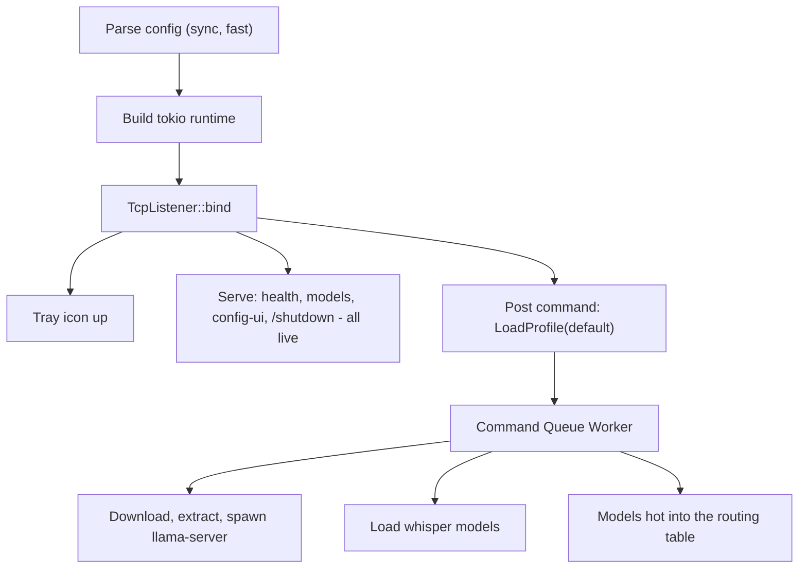

# Instant-Ready Gateway with Command Queue

## Thesis

The gateway should be instantly live. Today it blocks on provisioning before binding - a multi-GB download stands between the user and a responsive system. The new architecture inverts this: parse config, bind, serve, tray up in under a second. Everything that takes time is a command in a serialized queue that the running system processes, and any command can be cancelled.

## Current flow (the problem)

```
load_startup (sync, fast)
  -> Renderer::start (plain thread)
  -> Gateway::from_config_with_hub (sync: downloads GBs, extracts, spawns llama-server)
  -> tokio runtime built
  -> TcpListener::bind
  -> ready signal
  -> gateway.serve
```

Provisioning (the slow part) runs before the runtime, before the bind, before the tray. The user sees nothing until it finishes. Quit can't reach it. The progress bars fight tracing for the terminal.

## Target flow



The bind IS the readiness signal. `/health` answers immediately. `/v1/models` returns whatever's loaded (initially empty). The config UI is reachable. The tray shows "Running - loading models..." and transitions to "Running - 2 models, 4.1 GB" when the command completes.

## Pieces

### 1. Instant-ready `serve_thread`

- `serve_thread` becomes: parse config (sync, fast) -> build the tokio runtime -> bind the listener -> assemble the `Gateway` with an **empty** routing table and no local runtime -> send the ready signal -> `gateway.serve(...)`.
- `Gateway::from_config` splits: `Gateway::new(config, profiles)` assembles the shell (routing table, app state, shutdown signal, command queue sender) instantly. `LocalRuntime::start` is never called in the startup path.
- The ready signal fires in under a second on any hardware.

### 2. The command queue

A bounded `tokio::sync::mpsc` channel with one worker task (`command_worker`) draining FIFO.

**Command enum:**
- `LoadProfile { name, token }` - provision and load a profile's models (the boot command; also the profile-switch command)
- `ProvisionModel { name, source, token }` - download/verify/extract/spawn one model
- `UnloadModel { name }` - stop a llama-server child
- (future: `DownloadArtifact`, `UpdateConfig`, etc.)

Each command carries a `CancellationToken`. The worker:
- Takes one command at a time (serialized - no concurrent downloads fighting for bandwidth)
- Runs it as an async task, checking the token at chunk boundaries (downloads) and phase boundaries (extract, spawn)
- Reports progress into a `ProgressHub` operation tree (the existing mechanism)
- On completion, hot-swaps the result into the live routing table (the existing profile-switch hot-reload path)

**Debouncing and coalescing:** commands of the same type are never duplicated in the queue. When a `LoadProfile` arrives while another `LoadProfile` is pending or active:
- If the pending/active command is for the *same* profile, the new command is dropped (no-op).
- If it's for a *different* profile, the pending command is replaced (the queue's pending slot holds at most one `LoadProfile`; the latest wins) and the active command is cancelled (its token fires) so the new one starts promptly. The user who clicks A, B, C rapidly gets C, not A-then-B-then-C.

The same rule applies to `ProvisionModel` for the same model name. `UnloadModel` commands are not debounced (they're fast and order-independent).

**In-process state** (on `AppState`, accessible from routes and the tray):
- `active_command: Option<CommandStatus>` (name, progress fraction, started_at)
- `pending_commands: Vec<CommandSummary>` (name, queued_at)
- `cancel_active()` - fires the active command's token
- `cancel_pending(index)` - removes a pending command from the queue

**User-cancelable from day one:** the config UI's status bar shows a cancel button next to the active command's progress bar. Clicking it calls `POST /admin/queue/cancel` (a new admin route that fires `cancel_active()`). The button is present in the first version of the bar - the queue's cancellation token is already there, so the endpoint is just plumbing. Cancelling a pending command removes it from the queue (no token to fire - it never started).

### 3. Boot command

After the ready signal, `serve_thread` posts `LoadProfile { name: "default" }` into the queue. The worker provisions the server binary, downloads models, spawns llama-server children, and hot-swaps them into the routing table. If the user quits during this, the token cancels the download mid-chunk and the process exits cleanly.

The existing `prepare_switch_target` / profile-switch machinery in [runner.rs](crates/gateway/src/runner.rs) becomes the body of the `LoadProfile` command. It already handles the hot-swap-into-live-routing-table shape.

### 4. Drop indicatif; terminal progress is log lines

The `indicatif` dependency and the `Renderer` thread (`render.rs`) are deleted. Terminal progress bars were the source of the duplicating-bars bug, and with the command queue feeding the config UI status bar and the tray label, there is no interactive user watching the terminal.

- **TTY and non-TTY:** tracing log lines for command progress, using the existing `LineRenderer` shape (started/percent/done per node). `tracing_subscriber::fmt()` writes to stderr as it always has - no `MultiProgress`, no custom `MakeWriter`.
- **The whisper log bridge (piece 5) still matters:** without it, ggml's `fprintf(stderr, ...)` interleaves with tracing output. The bridge routes the C-side output into `tracing::debug!(target: "whisper_cpp", ...)` so the `whisper_cpp=warn` filter actually works and the terminal is clean.
- `render.rs` is either deleted or reduced to the `LineRenderer` only (which is pure and tested, useful for the tracing-line emission from the command worker).

Removed: `indicatif` from `Cargo.toml`, `MultiProgress`, `ProgressBar`, `ProgressStyle`, the `tty_loop` path, the `Renderer` struct and its thread.

### 5. Whisper log bridge

- `gateway-whisper-ffi` gains `WhisperLibrary::set_log_callback` - loads `whisper_log_set` / `ggml_backend_log_set` from the runtime DLL and installs a callback that writes into `tracing::debug!(target: "whisper_cpp", ...)`.
- The existing `whisper_cpp=warn` env filter then actually works (today it's dead because nothing emits that target).
- The callback is installed right after `WhisperLibrary::load` succeeds, inside the `LoadProfile` command.

### 6. Tray and config-UI status bar read the queue

**Tray:** the 5-second status tick reads `AppState`'s command status:
- Active command running: "Running - downloading whisper-base-en (34%)" or "Running - loading models..."
- No active command, models loaded: "Running - 2 models, 4.1 GB"
- No active command, no models: "Running - 0 models"

This replaces the current `TrayPhase` state machine (Starting/Running/Error) with something richer and always accurate.

**Config UI:** a fixed bottom bar in `mountChrome` (the same slot as the toast stack, but anchored to the viewport bottom, VS Code style). The gateway's bar has two mutually exclusive states that share the same visual space:

- **Idle state (LEDs):** per-endpoint LED strip - one LED per capability endpoint (`/v1/chat/completions`, `/v1/audio/transcriptions`, `/v1/images/generations`, etc.). Each LED is green (endpoint has at least one ready model), amber (model configured but not yet loaded - e.g. after a fresh boot before the load command finishes), or gray (no model configured for this endpoint). The LED set is driven by the routing table's live state. Model count + VRAM summary text beside the LEDs.
- **Active command state (progress):** the LED strip is replaced by a full-width progress bar + command label ("Downloading whisper-base-en - 34%") + **cancel button** (calls `POST /admin/queue/cancel`, which fires the active command's `CancellationToken`). Pending count shown if commands are queued behind the active one, with a way to cancel pending commands too. When the command completes or is cancelled, the bar transitions back to the LED strip.

The transition is driven by the `queue` field in `GET /admin/status`: `active` is non-null -> progress mode; `active` is null -> LED mode. The `endpoints` array feeds the LEDs regardless (it's always present in the response); the LEDs just aren't shown while a command is running.

The bar is fed by extending `GET /admin/status` with a `queue` field (active command, pending count) and an `endpoints` field (array of `{ path, name, ready: bool, provisioning: bool }`). The poll cadence matches the existing health poll the SPA already runs. In panel mode (workshop) the bar is hidden (the workshop owns status display).

The **status bar shell** (the fixed-bottom container, the progress bar, the command label, the cancel button) lives in `shared-ui` as a reusable primitive. The **endpoint LED strip** is gateway-specific - it extends the shared bar with a row of named LEDs that the gateway's `mountLiveShell` populates. The shared primitive exposes a slot for this kind of extension.

Files: [main.ts](crates/gateway-config-ui/ui/src/main.ts) (`mountChrome` gains the bar element), a new `status-bar.ts` in `shared-ui` (the shell), a new `endpoint-leds.ts` in the gateway config UI (the LED strip), `layout.css` for the bar's fixed positioning, and the gateway's `/admin/status` response shape.

### 7. Cleanup and --browser rename

- The `process::exit(0)` hack in `Armed::run` is deleted - Quit fires `cancel_active()` on the queue, then signals the serve shutdown, and the join returns promptly because the provisioning task has already exited.
- The `SetForegroundWindow` menu-positioning fix stays.
- The existing `Renderer::start` (plain thread with indicatif bars) is deleted; the command worker emits tracing log lines for progress instead.
- `--open-settings` is renamed to `--browser` everywhere: the flag, `ServeOptions.open_settings` -> `ServeOptions.browser`, the USAGE text, the installer finish page (`serve --browser`), the guide docs, and the tests. `--login` still suppresses it. The browser opens after the bind and before the boot command posts, so the config UI is reachable when the page lands.

## What this unlocks (not in this plan, but enabled by it)

- `GET /v1/queue` endpoint: the config UI or a model can see what the gateway is doing and cancel commands
- Parallel provisioning (widen the worker to a semaphore-bounded JoinSet) when bandwidth allows
- Model pre-warming as a queue command
- The agent loop querying the gateway's readiness before sending a request, instead of getting a 503

## 8. Shared UI library (`shared-ui`)

The gateway config UI adopts the workshop's Cursor Dark visual identity, and the duplicated UI primitives are extracted into a shared package both UIs consume.

**Package shape:** a new `crates/shared-ui/` directory (not a Rust crate - a plain npm workspace member or a sibling of the two `ui/` directories, importable by both esbuild builds). Contains:
- **Cursor Dark token sheet** (`tokens.css`): the `:root` variables both UIs need - `--bg-primary/secondary/tertiary`, `--text/--text-muted`, `--accent`, `--border`, `--danger`, `--radius`, `--space-*`, and the `--cursor-*` tokens the workshop's AGENTS.md mandates. Sourced from the workshop's existing `style.css` `:root` block and `cursor-dark-color-theme.json`. The gateway's "molten lava" `base.css` is replaced by an import of this sheet.
- **Behavioral primitives** (TypeScript + CSS):
  - Focus-trapped modal (merging gateway's `confirm-modal` + workshop's `editor-dialog` patterns)
  - Dropdown menu (the gateway's `.menu` and workshop's `workshop-dropdown` converge)
  - Toast stack (the gateway's `toast-stack` becomes the shared version; the workshop adopts it for update notifications)
  - Status bar (extracted from the workshop's existing `status-bar.ts` - `renderSlot(progress)` toggles between a progress bar and an indicators group in the same fixed-width space via `hidden`; LED pulse/glow/fade is pure CSS with a JS timer; the slot is generalized so the workshop populates it with activity + recording LEDs and the gateway populates it with endpoint-capability LEDs; both get the progress swap for free)
  - Progress bar (inline, the kind the status bar uses)
  - Button/input base classes (`.button`, `.button-primary/outline/danger`, `.input`)
- **Not extracted** (genuinely UI-specific):
  - Gateway: settings controls (`slider`, `toggle`, `chip-input`, settings-registry), the review-diff overlay, the key prompt
  - Workshop: agent chrome (`prompt-input`, `tool-call-card`, status LEDs, mode-chip, mention-chip), the Dockview tab integration, the Shiki code renderer

**Migration path for the gateway config UI:**
- Replace `styles/base.css` with `@import "shared-ui/tokens.css"`
- Replace `controls.css` button/input/select classes with shared-ui's
- Replace `confirm-modal`, `toast`, dropdown with shared-ui imports
- The status bar is born in shared-ui
- Verify the workshop's `check-layers.mjs` still passes (shared-ui is a "base" layer import)

**The workshop-server/ui AGENTS.md rule** ("Cursor Dark exact tokens") is now the rule for both: shared-ui's `tokens.css` is the single source of truth, pinned to Cursor's installed theme values. Both UIs inherit it.

**Naming convention:** follows the `shared-` prefix (`shared-ui`), consistent with `shared-progress`, `shared-loopback`, `shared-protocol`, `shared-sidecar`.

## Constraints

- The sync `Gateway::from_config` (with inline provisioning) stays for tests and embedders that want the simple path
- `cargo check -p gateway --no-default-features` stays green
- Progress bars render correctly in a plain terminal, the Cursor integrated terminal, and `--no-tray`
- No model request returns an error it would not have returned before; an unloaded model returns 503 with a message naming the active command ("model provisioning in progress"), not a silent failure

## Steps

Eight steps, one commit each. Pieces 1-3 (instant-ready, queue, boot command) are one behavioral change - they cannot be tested independently, so they land as a single commit.

1. **menu-fix** - Commit the `SetForegroundWindow` tray-menu positioning fix (already in the worktree); revert the uncommitted `process::exit` hack (the queue's cancellation replaces it). Tests: `cargo test -p gateway`, clippy.
2. **core-restructure** - Pieces 1-3 in one commit: `Gateway::new` (instant assembly, empty routing), the command queue (bounded mpsc, one worker, debounce rules, per-command `CancellationToken`, in-process status on `AppState`), the boot `LoadProfile` command reusing the existing hot-reload machinery, and `serve_thread` restructured to parse -> runtime -> bind -> serve -> post boot command. Tests: boot is instant (no provisioning in the startup path), the queue drains FIFO, debounce drops/replaces/cancels correctly, a cancelled download stops mid-chunk, Quit during provisioning exits promptly.
3. **drop-indicatif** - Piece 4: delete the `Renderer` thread and the `indicatif` dependency; the command worker emits tracing log lines via the existing `LineRenderer` shape. Tests: the `LineRenderer` unit tests stay green; terminal output during a download is clean log lines.
4. **whisper-bridge** - Piece 5: `WhisperLibrary::set_log_callback` (symbol load + safe wrapper + callback writing `tracing::debug!(target: "whisper_cpp")`), installed after `WhisperLibrary::load` in the `LoadProfile` command. Tests: the symbol resolves from the packaged b4938 library (the existing `PROMPTFORGE_WHISPER_LIBRARY` test pattern); the callback never panics across the FFI boundary.
5. **status-surfaces** - Piece 6: the tray label reads the queue; `GET /admin/status` gains `queue` and `endpoints` fields; `POST /admin/queue/cancel` route; the config UI's bottom status bar (LED strip <-> progress swap, cancel button). Tests: the admin route shapes, the LED state mapping, the cancel route firing the token; UI component tests for the swap.
6. **cleanup-and-browser** - Piece 7: the `process::exit` hack's removal verified against the now-cancellable queue; `--open-settings` -> `--browser` rename across flag, field, USAGE, installer, docs, tests. Tests: the renamed parse tests, the installer template still compiles (makensis harness).
7. **shared-ui** - Piece 8: extract `shared-ui` (tokens, modal, dropdown, toast, status bar shell, progress bar, button/input bases); the gateway config UI adopts Cursor Dark; the workshop adopts the shared toast; both esbuild configs import from it. Tests: both UIs' `npm test` suites, `check-layers.mjs`, and the gateway config UI's visual smoke.

## Execution

This plan runs on the Bounded-plus path of [vibe-rulebook.md](c:\Users\Vinnie\cursor\tools-public\rulebooks\vibe-rulebook.md) with the lightened schedule; all Rust work follows [rust-rulebook.md](c:\Users\Vinnie\cursor\tools-public\rulebooks\rust-rulebook.md). Executors read both before starting. This plan is self-contained (rule 5).

- **Precondition:** the worktree is clean after step 1's commit. The rules manifest from the previous run is reused: `cabinet/_scratch/gateway-sidecar/rules-manifest.md` (no re-survey).
- **Per step, in order:** Coder subagent (code + focused tests, then package-scoped `cargo test -p <touched>` and `cargo clippy -p <touched> --all-targets -- -D warnings` - never the workspace suite) -> main stages, Message subagent writes the commit message from the staged diff -> commit -> Review-and-Fix subagent against the diff (fix rounds capped at three; it re-runs the package-scoped tests after any fix round, so a dirtied tree needs no separate Verify dispatch) -> amend if review dirtied the tree, re-messaging when the fix changed more than tests. An open finding of any severity blocks the next step. All subagents are dispatched asynchronously.
- **Verify schedule (light):** workspace-wide build + test only after step 2 (the core restructure) and on the final step (step 7, full suite). No boundary gates otherwise. A red scheduled Verify gates the next step; three failed fix rounds stop the run.
- **Run state:** `vibe-ledger.md` and `vibe-review.md` live in `cabinet/_scratch/async-boot/`. Frontmatter todos flip to `completed` as each step's commit lands.
- **Decisions:** reversible calls are made and recorded in this plan with falsifiers; hard-to-reverse choices surface to the user before execution (rule 2). Old bugs found mid-run are fixed in their own commits (rule 7).
- **Rust constraints:** new dependencies verified against docs.rs (none expected beyond what's in the tree; `indicatif` is removed); `unsafe` only at the whisper FFI boundary with `// SAFETY:` comments; `thiserror` in libraries, `anyhow` at binary edges; tests in the same commit; `cargo fmt --all --check` and package-scoped clippy before every commit.


---

## Recovered rationale

Recovered from the producing chat sessions by the plan ledger on 2026-09-04. Everything below this heading is derived annotation, not part of the original plan.

# Enrichment: Async boot and progress (async_boot_and_progress_0249ca12)

## Origin: two live bugs forced the redesign

The plan was born from watching the gateway misbehave during the preceding sidecar plan's run (creator chat, the morning of Sep 4, 2026):

- "The progress bars are ugly they do not work right they duplicate instead of updating in place" and later "I'm running again. 5 progress bars. lol" - indicatif's MultiProgress fought tracing and whisper.cpp's C-side stderr writes for ownership of the terminal.
- "I tried to exit it myself from the tray. the tray icon disappeared. but the exe was still in Task Manager, and it looked like it was still downloading" - Quit could not reach provisioning: the shutdown oneshot only resolves inside the serve future, which had not started, because provisioning ran synchronously before the runtime existed.

A `process::exit(0)` hack was applied as a stopgap, then deliberately reverted (it never got committed) once the real fix was chosen. The assistant framed the tradeoff: "The quick fix (not ideal but stops the hang)... The clean fix: thread provisioning through a cancellation token that Quit can signal." Steps 1 and 6 of the plan encode the hack's removal.

## The pivot: the user's instant-ready design displaced "async boot"

The user opened with "I'm thinking we should go full async though, no?" The assistant began drafting an async-boot plan, but the user then dictated the actual architecture (verbatim, abridged):

"I don't think there should be ... a boot up. ... as soon as you launch the gateway, we install the tray icon, we set up the server, the HTTP server, and we go immediately ready to serve ... the config UI. That's it. ... Everything is commands in the command queue. So we always know what's active and what's pending. We can always cancel anything. And if we want to, we can expose that to an endpoint so that the model can understand what the gateway is doing. So the model can work on the gateway itself."

The assistant explicitly conceded its framing lost: "My plan was still thinking in terms of 'provisioning is a phase that blocks readiness.' Your design says: readiness is instant, provisioning is just work the running system does." Hence the plan's "the bind IS the readiness signal," and the promotion of the existing profile-switch hot-reload machinery from edge case to the only path - boot is just the first `LoadProfile`.

## Discarded alternatives

- **A richer queue** (priorities, dependencies between commands, a named registry): rejected in favor of "FIFO channel, one worker, serialized commands - the minimum that solves the cancel/progress/quit problems" (assistant; the user approved the simple channel with room to grow, paraphrase).
- **Keeping indicatif with a single owner**: the first async draft routed all terminal output through MultiProgress. Once the status bar existed, the user asked "given these changes do we still want to show text progress bars in stdout/stderr?" and the decision flipped to deletion. The duplicating-bars bug was "the three-way fight (tracing vs indicatif vs whisper.cpp) that caused the duplicating bars," and it is "eliminated by removing the combatant." The terminal becomes logs only; visual progress lives in the UI and tray.
- **The workshop losing indicatif too**: discarded on facts - the workshop is a Tauri webview app and never used indicatif; VS Code and Cursor render progress as DOM elements, not terminal escapes. "The terminal is for logs; the UI is for progress" (assistant).
- **`--headless` / `--no-desktop` naming**: rejected as misleading, since the config SPA still serves without a tray; `--no-tray` "says exactly what it does." The future service mode is a split process (headless session-0 service plus a per-user tray client over loopback), which the queue and status endpoints make "trivially thin" (assistant).
- **The gateway's "molten lava" theme**: discarded; per "I want the UI for the gateway to look identical to the UI for the workshop," the gateway adopts Cursor Dark and shared-ui holds the single token set.
- **Deferring user-cancellation**: the user only asked to "design this so we can add user-cancelation of downloads later," but the plan makes cancellation first-class from day one (`POST /admin/queue/cancel`, a cancel button in the bar's first version) because the token plumbing was already there - the endpoint is "just plumbing" (plan text).
## User-mandated specifics that shaped the plan

- **Debounce:** "we have to make sure we debounce commands I dont want multuple profile switch commands queued at once" - this produced the latest-wins rule (same target dropped, different target replaces pending and cancels active), so rapid A, B, C clicks yield C.
- **Status bar swap:** "the progress bar replaces the LEDs when a command is being processed. otherwise the LEDs are shown" and "Workshop already uses this pattern" - so the shared-ui status bar lifts the workshop's existing `renderSlot` progress/LED toggle rather than inventing one; the gateway only fills the indicators slot with per-endpoint LEDs.
- **Browser flag:** "I want it implemented. As --browser. and it should be sequenced to happen after the bind (obviously)."
- **Execution schedule:** "keep the vibe steps light I dont want to rebuild the world and test the world every time. I want this plan to run as quickly as possible." - hence package-scoped tests per step and workspace-wide Verify only after step 2 and at the end.
- **Shared naming:** "every shared crate should have 'shared-' prefix" (from the earlier sidecar discussion, carried into shared-ui's naming).

## Run deviations (step 2, core-restructure; the only run chats provided)

- **Stalled dispatch, redispatched fresh.** The first Coder dispatch (07:52) read the rulebooks and plan, then hung for 66 minutes without touching a file. It was interrupted ("Stop. Do not do any work. Return immediately...") and redispatched at 08:59 with an essentially identical prompt; the redispatch completed cleanly. No collision was possible - the stalled agent never wrote.
- **gateway-local cancellation shape.** The dispatch suggested an async variant of `LocalRuntime::start`; the coder instead landed a sync token-aware variant driven by `spawn_blocking`, to keep the library runtime-agnostic per house rules. Recorded as a reversible decision.
- **Boot test shape.** The boot integration tests were reworked off the slow-download-through-config approach because gateway-config validation rejects plaintext-http artifact sources (a trust-boundary rule the coder left intact). Mid-chunk cancel is pinned by a gateway-local fixture-listener unit test; quit-during-provisioning uses a switch parked in a bounded drain, fully rendezvous-driven. Recorded falsifier: if loopback http sources ever become legal, the slow-download shape can return.
- **New dependency.** `tokio-util` (default-features off, `sync::CancellationToken` only) was added to manifests; it was already present in the workspace lock tree.
- **Checkpoint-commit suggestion declined.** Mid-step the user asked "would it be smarter to stage and commit, and then amend the commit later." The answer was no: uncommitted work is already safe on disk (the stalled coder died and lost nothing), a mid-write commit risks a torn snapshot in history, and the Message subagent's value is reading the complete staged diff as an independent check.
