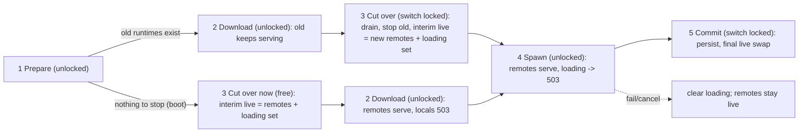

# Unlock Inference During Switches

Self-contained. Repository: `c:\Users\Vinnie\cursor\promptforge`, branch `master`, HEAD `5c8faa72`. Rulebooks: [vibe-rulebook.md](c:\Users\Vinnie\cursor\tools-public\rulebooks\vibe-rulebook.md), [rust-rulebook.md](c:\Users\Vinnie\cursor\tools-public\rulebooks\rust-rulebook.md). Rules manifest: `cabinet/_scratch/gateway-sidecar/rules-manifest.md` (reuse). Binding AGENTS.md: root, `crates/gateway/AGENTS.md`, `crates/gateway-local/AGENTS.md` if the artifact/spawn split touches it, `crates/shared-progress/AGENTS.md` if a leaf is added; `crates/gateway-config-ui/ui` has none.

## Execution (vibe-rulebook, lightest schedule - same shape as the previous run)

Full path, six commits. Per step: Coder (async) -> `git add -A` -> Message and Review-and-Fix dispatched in parallel on the staged diff -> commit once (re-message only if a fix changed code beyond tests) -> mark the frontmatter todo -> ledger line. Verify only at step 3 (the risky component: `cargo test -p gateway` plus config-ui suite) and step 6 (final: full workspace suite, both UI suites). Steps 1 and 2 are user-visible fixes with disjoint files: dispatch both Coders at once, stage each by explicit path, commit 1 then 2 (each with its own Message + Review pass); their package suites are the evidence. Ledger and review file in `cabinet/_scratch/unlock-inference/`. Rust rules block from the previous plan applies verbatim: fmt + clippy `-D warnings` per commit, `cargo check -p gateway --no-default-features`, tests in the same commit, `Result` not `unwrap`, no guard across an await it does not need, exhaustive matches, `#[expect]` over `#[allow]`, no new deps.

Decision made by the owner (2026-09-04): while a local model is downloading or spawning after the old runtimes are stopped, a request for that model gets **503 immediately** ("model is loading"), not a wait. Remote-upstream requests flow throughout.

## Background (lock inventory, verified read-only)

- `AppState.switch: Arc<tokio::sync::Mutex<()>>` ([lib.rs](c:\Users\Vinnie\cursor\promptforge\crates\gateway\src\lib.rs) ~L237). Held by: `begin_inference` (~L353, fast - registers an `InFlightGuard` then drops), `run_switch_with_config` (~L1271, for the ENTIRE switch), `unload_model` (commands.rs ~L841, medium).
- `run_switch_with_config` phases, all under the lock today: cancel check + `loading-profile` leaf; load catalog; `prepare_switch_target` (remote `Routing`); `drain_inference` (30 s + 1 s cancel grace, ~L1308); `replace_runtimes` (~L1320: stop old local/STT, then download weights and spawn new, ~L1467-1604); merge routing (~L1340); `commit_profile_state` (~L1349); `live.write` swap (~L1352-1373).
- `begin_inference` is called by `chat_completions`, `embeddings`, `rerank`, `audio_transcriptions` - remote upstreams are not exempt. `list_models` and `web_search` do not take it.
- Routing lives in `LiveState.routing: Arc<Routing>` behind `Arc<RwLock<LiveState>>`; `resolve_routed_model` (~L571) does `live.read()` then `routing.model(name)`.
- Tests that pin the current contract: `switch_waits_for_an_in_flight_request` and `request_registration_waits_behind_the_switch_lock` (tests/it/profiles.rs ~L184, ~L215), `drain.rs` bounded-drain tests, `quit_during_an_active_command_cancels_it_and_exits_promptly` (tests/it/boot.rs ~L263), apply tests parking on `in_flight.register()` (config_apply.rs ~L715+), `a_token_fired_during_the_start_stops_the_persist_and_the_swap` (lib.rs ~L2122).
- `Gateway::serve` ([runner.rs](c:\Users\Vinnie\cursor\promptforge\crates\gateway\src\runner.rs) ~L446): `commands_after.shutdown(); worker.await` - the command-queue worker join has no bound (HTTP drain is bounded at 5 s, runtime teardown at 5 s; this is the last unbounded wait on quit).

## Step 1 - restart banner always visible (`restart-banner`)

Reported: the config UI shows "Restart the gateway to apply these changes." at all times, even with nothing dirty and no Save/Revert/Apply controls, and after a gateway restart.

Root cause (verified read-only): [main.ts](c:\Users\Vinnie\cursor\promptforge\crates\gateway-config-ui\ui\src\main.ts) ~L217-220 creates `.banner-restart` with that text in the DOM at mount, `hidden = true`, and toggles it with the `hidden` attribute (shown at ~L262 after an apply with `restart_required`, cleared at ~L238 when `/admin/status` `config_generation` changes). But `.banner { display: flex }` in `layout.css` ~L109-117 has no `.banner[hidden] { display: none }` rule, and an explicit `display` beats the UA stylesheet's `[hidden]`, so the banner renders regardless. The same crate already carries the pattern for `.status-bar-queue[hidden]` and `.dropdown-menu[hidden]`; workshop `window-chrome.css` ~L7-8 documents it. The gateway's `restart_required` computation (`config_apply.rs` ~L212-219: shadow census of `server`/`workshop` sections or an env shadow) is not involved and needs no change; `trust_loopback`'s serde default does not feed it.

Fix: add `.banner[hidden] { display: none; }` to `layout.css` beside the existing `[hidden]` rules. Test: extend the restart-banner test in `settings-sections.test.mjs` ~L483-499 to assert the computed `display` is `none` while hidden and not `none` after a `restart_required` apply reply, not just the `hidden` property (the current test passes with the bug). Package checks: `npm run typecheck && npm run build && npm test` in `crates/gateway-config-ui/ui`, `cargo test -p gateway --lib` (SPA is embedded).

Review focus: grep the CSS for any other element toggled via `hidden` whose class sets an explicit `display` without a `[hidden]` counterpart; fix any found in the same commit and pin one.

## Step 2 - old icon out, new icon in (`icon-swap`)

Which is which (verified by viewing the images, not dates): the NEW set is the orange P on a dark shield in [crates/workshop/icons/](c:\Users\Vinnie\cursor\promptforge\crates\workshop\icons) - `32x32.png`, `64x64.png`, `128x128.png`, `128x128@2x.png`, `icon.png` (512), `icon.ico`, `icon.icns`, installer header/sidebar, DMG background, plus `Square*`/`StoreLogo`/`android/`/`ios/` from a `tauri icon` run. Tauri, NSIS, and the gateway tray blobs (`crates/gateway/assets/tray-icon*.rgba`, rendered today from `icons/32x32.png` per the comments in `tray/windows.rs` ~L49-51 and `tray/macos.rs` ~L63-66) already use it. The OLD icon is the stone medallion `promptforge-icon-1.png` (128x128, 30,552 B), present in two places and shown in the reported screenshots (config UI header and About):
- `crates/gateway-config-ui/ui/icons/promptforge-icon-1.png`
- `crates/workshop-server/ui/icons/promptforge-icon-1.png`
(`ui/dist/` copies are build output, untracked.)

Do:
- Copy `crates/workshop/icons/128x128.png` to `crates/gateway-config-ui/ui/icons/promptforge-icon.png` and `crates/workshop-server/ui/icons/promptforge-icon.png`, and `128x128@2x.png` to `promptforge-icon@2x.png` in both, for `srcset` on the header/titlebar images so they stay crisp on high-DPI. Add a one-line note in `crates/workshop/icons/AGENTS.md` that these two UI copies are derived from this set and must be refreshed together.
- Replace every `promptforge-icon-1.png` reference with `promptforge-icon.png` (and add `srcset` with the `@2x` where an `` is built): `crates/gateway-config-ui/ui/src/views/settings-view.ts` ~L1680 (About), `components/tab-bar.ts` ~L71 (header), `components/key-prompt.ts` ~L26, `index.html` ~L10 (favicon), `build.mjs` ~L30, `src/main.test.mjs` ~L31; `crates/gateway-config-ui/src/routes.rs` ~L19, 41, 104, 109 (route path and asset tests - serve both files, or serve the icon directory prefix; keep the loopback wall); `crates/build-ui/src/lib.rs` ~L20, 24 (`CONFIG_UI_STATIC_FILES`); `crates/gateway-config-ui/README.md` ~L9; `crates/workshop-server/ui/index.html` ~L12 (titlebar), `ui/build.mjs` ~L31, `ui/test/titlebar-browser-mode.mjs` ~L37, `src/routes/assets.rs` ~L19, 52, 115; `guide/src/gateway/09-config-ui.md` ~L7 then `cargo run -p build-user-guide`.
- Remove the two old PNGs: copy each to `cabinet/_trash/` first (workspace deletion rule), then `git rm`.
- **Gateway exe icon (owner decision 2026-09-04: yes).** `promptforge-gateway.exe` embeds no Windows icon today (no `winres`/`.rc` in `crates/gateway`), so Explorer, Task Manager, and the taskbar show the generic glyph. Add a `build.rs` to `crates/gateway` that, under `cfg(target_os = "windows")` only, compiles a resource pointing at `../workshop/icons/icon.ico` (path relative to the crate; emit `cargo::rerun-if-changed` for it). Use one Windows-only `[target.'cfg(windows)'.build-dependencies]` entry - `winresource` (the maintained fork of `winres`) or `embed-resource`; verify the crate name and current version on crates.io/docs.rs before adding (rust-rulebook section 9), and prefer whichever the workshop or Tauri already pulls into `Cargo.lock` so the tree does not grow. The build script must be a no-op on non-Windows and must not run any external tool that is absent on a plain `cargo build` (rc.exe comes with the MSVC toolchain the project already requires; if a GNU toolchain must also build, `embed-resource` handles `windres` too). This is the one sanctioned exception to "no new dependencies" in this plan. The `../workshop/icons/icon.ico` path lies outside the gateway crate, which is fine for `cargo build` but would break `cargo package`; the gateway is not published, so accept it and say so in the build.rs comment. Test: `cargo build -p gateway` on Windows produces an exe whose icon resource is present - assert with a small `#[cfg(windows)]` integration test that reads the built binary's resource table via the `windows-sys` `LoadImageW`/`ExtractIconExW` path already available (`windows-sys` is a dependency), or, if that is awkward, a PowerShell check in the ledger (`[System.Drawing.Icon]::ExtractAssociatedIcon`) recorded as the evidence; the Coder picks and reports which.
- Do not touch `crates/workshop/icons/**` beyond the AGENTS.md note; the `Square*`, `StoreLogo`, `android/`, `ios/` files are unreferenced leftovers of the generator but they are the new art, and pruning them is not asked for.

Tests: the existing asset-route tests in `routes.rs` and `assets.rs` re-pinned to the new paths (and the `@2x` path); `main.test.mjs` header `src` assertion updated; `titlebar-browser-mode.mjs` updated; a UI test that the header image's `srcset` names the `@2x` file. A grep for `promptforge-icon-1` across the repo (excluding `dist/`, `target/`, `node_modules/`) returns nothing - make that a review check. Package checks: both UI suites (`crates/gateway-config-ui/ui`, `crates/workshop-server` UI), `cargo test -p gateway-config-ui -p workshop-server -p build-ui -p gateway --lib`, fmt, clippy on those crates.

Review focus: no reference to the old filename remains anywhere tracked; both served icon routes still sit behind the loopback wall and carry no bearer auth (unchanged posture); the embedded asset list in `build-ui` and the esbuild `STATIC_FILES` lists agree with the routes; the About and header render the orange-P image (open the built `dist/index.html` in jsdom and check `src`).

## Step 3 - narrow the switch lock (`unlock-switch`)

Restructure `run_switch_with_config` into five phases; the `switch` mutex is held only in phases 3 (cut-over) and 5 (commit).

**Ordering rule:** cut over as soon as there is nothing old to stop. If the set of old local/STT runtimes to stop is empty (cold boot, or the previous profile was remote-only), phase 3 runs immediately after phase 1 - it costs nothing (no drain, no stop) and it publishes the remote models before the download begins, so remote inference works during a cold-boot download. If there are old runtimes, phase 2 runs first so they keep serving through the download, and phase 3 follows. The invariant is the same in both orders: old runtimes are stopped only right before new ones spawn, never before a download.

1. **Prepare (unlocked):** cancel check, `loading-profile` leaf, load catalog, `prepare_switch_target`. Output: the remote `Routing`, the list of local models to start, the set of old runtimes to stop.
2. **Download (unlocked):** ensure every artifact the new local models need is present. This requires splitting the local runtime start into an artifact step and a spawn step if `LocalRuntime::start_*` does both today (look in `gateway-local` for the existing ensure/provision entry point the `ProvisionModel` command already uses - reuse it; do not write a second downloader). Progress registers under a new leaf `downloading-models`. Cancellation at chunk boundaries as today. A failure here leaves the live state untouched (old runtimes still serving, or the interim remote routing already published in the nothing-to-stop order) - strictly better than today.
3. **Cut over (locked, bounded):** take `switch`; `drain_inference` (unchanged 30 s + grace); stop old local/STT runtimes under a `stopping-models` leaf (do not register that leaf when the stop set is empty); write an interim `LiveState`: `routing` = the new profile's remote models, `runtimes` = whatever survives the stop (as today), plus a new `LiveState.loading: BTreeSet<String>` naming the local models about to spawn. Release `switch`.
4. **Spawn (unlocked):** start the new runtimes and wait for health (`starting-models` leaf), token honored. Requests arriving now: remote models serve; a model in `loading` gets the new `GatewayError::ModelLoading { model }` -> 503 with `Retry-After: 5` and body code `model_loading` (add the check in `resolve_routed_model` after the routing miss and before `NotFound`). `GET /admin/status` gains `loading_models: [..]` next to `queue`. `/v1/models` keeps listing only routable models.
5. **Commit (locked, brief):** take `switch`; `commit_profile_state` (unchanged - it takes the apply lock itself for `Promote`); final `live.write` swap: full routing, runtimes, profile, `loading` cleared. Release.

Failure or cancellation in phase 4: clear `loading` (so requests fall through to 404, not a permanent 503), keep the interim remote routing live, stop any children that did start, return the existing `PartialStart` / cancelled outcomes. Document this in the function's doc comment: after a failed switch the gateway serves remote models and no local ones until the next switch.

`begin_inference` is unchanged in code; its lock is now only contended during phases 3 and 5. `unload_model`'s lock use is unchanged.

Progress labels: `downloading-models` joins the three known stage labels in `apply-overlay.ts` (`observe()` maps it like the others; stage rows show four entries) and in the overlay test. `config_apply.rs`'s own `event.label == "loading-profile"` check is unaffected.

Tests (each must fail if its behavior breaks):
- A remote-model chat request completes while the boot `LoadProfile` is parked inside the download phase (nothing-to-stop order: cut-over already published the remote model; rendezvous pattern from tests/it/boot.rs; the boot test's fake upstream is the remote model; the local model's download is parked by the same fixture the `ProvisionModel` tests use, or a rendezvous inside the artifact step). This is the headline regression.
- A remote-model request that exists in BOTH the old and new profile completes while a profile switch (old profile has a local runtime) is parked inside the download phase - the old routing is still live.
- A remote-model request completes while the switch is parked inside the spawn phase (after cut-over).
- A request for a model in `loading` returns 503 `model_loading` with `Retry-After`; after the commit it returns 200; after a failed spawn it returns 404.
- `request_registration_waits_behind_the_switch_lock` is re-pinned to park inside phase 3 (cut-over) and still proves registration waits there; `switch_waits_for_an_in_flight_request` stays green unchanged.
- A cancellation during download leaves the old runtimes serving (live state identical before and after).
- `/admin/status` shows `loading_models` during spawn and empty after.
- Overlay: `observe()` lights `downloading-models`.
- Every existing switch/apply/boot test stays green; `a_token_fired_during_the_start_stops_the_persist_and_the_swap` may need its park point moved to phase 4 - keep its claim.

Package checks: `cargo test -p gateway`, `cargo clippy -p gateway --all-targets --all-features -- -D warnings`, `cargo fmt --all --check`, `cargo check -p gateway --no-default-features`, `npm run typecheck && npm run build && npm test` in `crates/gateway-config-ui/ui`. **Scheduled Verify** after commit: those same commands by the Verify subagent.

Review focus: no `switch` guard is held across `.await` on a download or spawn anywhere after the change; the nothing-to-stop order is taken whenever the stop set is empty (a cold boot must publish remote models before the download starts - check the boot path specifically); the interim swap and the final swap are each a single `live.write` (no window where routing is empty AND `loading` is empty); `ModelLoading` is 503 not 404 and never persists after a failed switch; the drain still precedes the stop; every `match` on the new error variant and any new `StatePersistence`/phase enum is exhaustive; no second downloader was written.

Constraints: stop-old-before-spawn-new ordering is kept (VRAM cannot hold two model sets; decided alone, falsifier: a profile switch that keeps the same local model would be faster with spawn-before-stop - a later optimisation). `state.apply` semantics from the previous run are untouched. No new dependencies.

## Step 4 - bounded waits and a usable default log (`bounded-waits`)

Three small operability fixes, one theme: nothing should be able to sit in an unbounded wait that Cancel or Quit cannot interrupt, and the gateway should say what it is doing.

1. **Worker join.** In `Gateway::serve` (runner.rs ~L446) wrap `worker.await` in `tokio::time::timeout(WORKER_JOIN_TIMEOUT, ..)` (5 s, matching the other two bounds); on expiry `tracing::warn!` naming the active command label and return `Ok(())`. Test: a unit test in runner.rs that parks the worker on a command body that ignores its token (a `#[cfg(test)]`-only parking hook on the queue, or the existing rendezvous pattern) and asserts `serve` returns within 2x the bound and not before it - same shape as `serve_abandons_a_stalled_request_after_the_drain_bound`.
2. **Download idle timeout.** The artifact download loop (`crates/gateway-local/src/artifacts/download.rs` ~L319, blocking `response.read`) has only a 2 h whole-request ceiling (`artifacts.rs` ~L78); a stalled transfer blocks the token check until the read returns, so Cancel and Quit wait indefinitely. Add an idle read timeout of 30 s on the blocking client (`reqwest::blocking::ClientBuilder::read_timeout` if the locked reqwest version has it; otherwise `timeout` per chunk request or a `TcpStream`-level read timeout - check the locked version on docs.rs, do not guess) so a stall surfaces as a retryable error at the chunk boundary where the token is already checked; the `.part` file stays resumable. Test: a fixture server that sends headers and then goes silent; the download returns the timeout error within 2x the bound and the `.part` file is intact.
3. **Default log filter.** `main.rs` ~L50-55 falls back to `EnvFilter::new("whisper_cpp=warn")` when `RUST_LOG` is unset, which drops every gateway `info!` line - the user's terminal showed nothing during a 2.89 GiB download. Change the fallback to `info,whisper_cpp=warn` (gateway crates at info, noisy dependencies such as `hyper`, `h2`, `reqwest`, `tower` at warn - list them explicitly). `RUST_LOG` still overrides. Test: a unit test on the fallback directive string (or the constructed `EnvFilter`) that gateway `info` is enabled and `whisper_cpp` `info` is not.
4. **A log file.** There is none today, so a tray gateway started at login (or launched from a terminal that was closed) has no record at all - the owner asked "where are the logs" and the answer was nowhere. Write the same filtered stream to `<state dir>/logs/gateway.log` in addition to stdout, where `<state dir>` is the directory that already holds `gateway.toml`, `run/`, and `models/` (`~/.promptforge` on this machine; reuse the existing discovery, do not add a second path resolver). At startup, if `gateway.log` exists rename it to `gateway.log.1` (overwriting any older `.1`), then create fresh - one previous run kept, bounded disk. No new dependency: `tracing_subscriber::fmt::Layer::with_writer` accepts a `std::fs::File` (wrap in `Mutex` or use `with_writer(move || file.try_clone())`); stdout keeps its layer. If the directory cannot be created or the file cannot be opened, warn on stdout and continue - logging must never stop the gateway. Log the log path itself at info on startup so a user launching from a terminal sees where it is. Add a `--log <path>` override only if it is trivial; otherwise skip. Tests: a unit test on the rotation helper (existing file becomes `.1`, fresh file created, a second rotation overwrites `.1`); an integration test that a headless `serve` writes at least the startup line to the file under a temp state dir.

Package checks: `cargo test -p gateway -p gateway-local`, clippy on both, fmt, `cargo check -p gateway --no-default-features`. No scheduled Verify.

Follow-up suggestion (not in this plan): a tray menu item "Open logs" that opens the state dir's `logs/` folder.

Review focus: the worker-join timeout arm cannot drop a command mid-commit in a way that half-promotes - confirm `commit_profile_state`'s apply-lock section is short enough that abandoning the worker after 5 s can only abandon a download or a spawn, never the `promote_captures` write (state that in a doc comment if true; if false, hold the timeout until the commit section finishes). The idle timeout must not fire during a healthy slow transfer (1 MB/s is healthy; 0 bytes for 30 s is not). The log default must not enable `debug` anywhere.

## Step 5 - the overlay shows download progress (`overlay-download-progress`)

Observed 2026-09-04: an Apply that added a 2.89 GiB GGUF sat at a spinning "Starting models" for the whole download and read as hung. The stream already carries the data: during a download the hub emits `Begun` for `starting-models/<model>` and `starting-models/<model>/download`, then `Updated { fraction }` frames on the `download` leaf (coalesced by step/time in `shared-progress/src/tree.rs` ~L208-227), then `verify` and `ready` leaves. [apply-overlay.ts](c:\Users\Vinnie\cursor\promptforge\crates\gateway-config-ui\ui\src\components\apply-overlay.ts) `observe()` (~L187-196) drops everything except stage `Begun` frames.

Do, in `apply-overlay.ts` (after step 3 has added the `downloading-models` stage):
- Track the active leaf: on a `Begun` whose `path` ends in `/download`, record the model name (the path segment before `download`) and show a detail row under the active stage: a `shared-ui` progress bar (reuse the status bar's primitive, do not style a new one) with the label "Downloading <model>" and percent. On `Updated { fraction }` for that path, set the bar. On `Finished` for that path, show "Verifying <model>" until the `ready` leaf begins, then "Starting <model>". Clear the detail row when the stage finishes.
- Multiple models: show the row for the most recent leaf only; the stage checkmark still tracks the stage.
- Keep `observe()` tolerant: unknown shapes are ignored as today.
- `main.ts` needs no change (it already forwards every frame while `applying`).

Tests (`apply-overlay.test.mjs`): a `download` `Begun` frame for `starting-models/glm-4-9b/download` shows the row with the model name; `Updated { fraction: 0.42 }` sets the bar to 42%; `Finished` flips to the verifying label; a `ready` `Begun` flips to the starting label; frames for an unrelated path change nothing; the existing stage-mapping tests stay green. Package checks: `npm run typecheck && npm run build && npm test` in `crates/gateway-config-ui/ui`, `cargo test -p gateway --lib`. No scheduled Verify.

Review focus: the fraction is clamped to 0..1 and rendered as an integer percent; the label text uses a plain dash if any; the progress primitive is the shared-ui one; a frame flood (coalesced but still many) does not re-create DOM nodes - update in place.

## Step 6 - test gaps and UI hygiene (`ui-hygiene`) - final

All under `crates/gateway-config-ui/ui/src`:
- Hoist the four private `isRecord` copies (`services/config-store.ts`, `services/gateway-api.ts`, `services/hf-api.ts`, `components/apply-overlay.ts`) into one `services/json.ts` (or the existing util module if one exists - grep first) and import it.
- Thread `error.code` into `GatewayHttpError` for every refusal, not only `applyConfig` (the `refusalDetail` helper already returns it); test one other route.
- Tests the reviews recorded as missing: the overlay's `onCancel` rejection path toasts "The cancel failed" and leaves the overlay running (the coder said this exists - confirm; add if not); a Revert All that lands while the Settings view is unmounted still clears its state on next mount.
- Mark the stale `pending` todos in [async_boot_and_progress_0249ca12.plan.md](c:\Users\Vinnie\.cursor\plans\async_boot_and_progress_0249ca12.plan.md) steps 2-6 `completed` (their commits are `5ac720eb`, `86e036ff`, `c746e1ff`, `b0d2cdda`, `6cf3c09f`; the `process::exit` hack is confirmed gone). Plan-file edit only, no commit.

Package checks: `npm run typecheck && npm run build && npm test` in `crates/gateway-config-ui/ui`, `cargo test -p gateway --lib`. **Final Verify:** `cargo test --workspace`, `cargo clippy --workspace --all-targets --all-features -- -D warnings`, `cargo check -p gateway --no-default-features`, `cargo fmt --all --check`, both UI suites (`crates/gateway-config-ui/ui`, `crates/workshop-server` UI).

## Explicitly not in this plan

- `PartialStart` pass-through arm test (needs a local model fixture that fails to start; no such fixture exists - would be its own small fixture step).
- `RUNTIME_SHUTDOWN_TIMEOUT` expiry test (needs a blocking-pool task that ignores cancellation; low value).
- `gateway-config/README.md` `[server]` example (rejected by review: the field defaults true; gateway README is the reference).

## Data flow

Steps 1 and 2 are independent fixes with no downstream consumers and disjoint files (step 1: `layout.css` and `settings-sections.test.mjs`; step 2: everything else listed there). **Run their Coders in parallel**, each told the other's file set is off limits, then stage by explicit path and commit step 1 first, step 2 second - the same pattern as the two bug fixes on 2026-09-04. Step 3 produces `LiveState.loading`, `GatewayError::ModelLoading`, the `downloading-models` label, and `loading_models` in status; step 5 (overlay download progress) builds on the overlay's stage list after step 3 and on the progress paths the hub already emits (which step 3 may re-parent under `downloading-models` - step 5's Coder reads the labels from the code as landed, not from this file). Step 4 is logically independent of 3 but edits the same `runner.rs` region and the same shutdown/cancel path, so it runs after 3. Steps 5 and 6 both edit `apply-overlay.ts`; 6 runs last and carries the final Verify.

---

## Recovered rationale

Recovered from the producing chat session and the run's vibe-ledger by the plan ledger on 2026-09-04. Everything below this heading is derived annotation, not part of the original plan.

# Enrichment: Unlock inference during switches

## Origin and why

The plan was born from the tail of the gateway-sidecar chat on 2026-09-04. After the apply/loopback run finished, the owner asked for a mop-up: "create a new plan from whatever is needed and didn't get done". The big leftover was structural: `run_switch_with_config` held the switch lock across the entire model download and spawn, so every inference request - remote upstreams included - stalled for the duration of a multi-GiB download. The owner had hit this firsthand earlier that day ("it got stuck when I applied a model download", 12:59 PM), which had already forced the previous run's Apply-as-a-command rework.

Two live UI bugs were then folded in verbatim from screenshots: "it always says \"Restart the gateway to apply these changes\" even though nothing is dirty and there's no Save/Revert button" and "The old icons need to be removed (dont remove the new ones) and use the new ones in their place". On the icon the owner pinned identity and scope: "there's already a full set of new icons @promptforge/crates/workshop/icons I want the old ones, which are in a different dir I think? gone?" and "so to be clear, gateway and workshop are both getting the same icon".

## The decisive design decision: 503, not a wait

The one judgment call the planner refused to make alone: once old runtimes are stopped and the new local model is still downloading or spawning, what does a request for that model get? The planner surfaced an AskQuestion and recommended the opposite of what shipped - a bounded wait (park until routable or ~120 s timeout, then 503), because it preserves the day's blocking semantics for local models. The owner chose fail-fast: 503 immediately with `Retry-After`, remote-upstream requests flowing throughout. The plan records this as "Decision made by the owner (2026-09-04)". Everything in step 3's shape - the interim live state, the `loading` set, the overlay stage - follows from that choice.

## Discarded alternatives (design)

- **Bounded wait for loading local models** - the planner's own recommendation, rejected by the owner in favor of immediate 503.
- **`Endpoint::Loading` routing variant** - rejected as more invasive than a `LiveState.loading` membership set checked at model resolution (paraphrase of the planner's weighing).
- **Listing loading models in `/v1/models`** - rejected to keep the endpoint OpenAI-compatible; `loading_models` went on `/admin/status` instead.
- **Spawn-before-stop ordering** - rejected because VRAM cannot hold two model sets; kept stop-old-before-spawn-new, with a recorded falsifier (a same-model switch would be faster the other way - a later optimization).
- **`--log <path>` override** - planned only "if trivial"; judged not trivial and skipped during execution.
- **A second downloader** - explicitly forbidden; the artifact/spawn split reuses the existing provisioner.

## Plan-review corrections before "run"

The owner's "review the plan" pass caught a real defect: the headline regression test was unsatisfiable as first drafted, because at cold boot routing is empty until cut-over and cut-over came after the download - remote requests would have 404'd through the whole boot download, the exact case that matters. The fix is the two-order rule now in the plan's diagram: cut over immediately when there is nothing old to stop, otherwise download first. Same review corrected the interim state (STT may survive the stop), dropped the phantom `stopping-models` leaf on boot, and parallelized steps 1 and 2 after confirming their file sets are disjoint.

## Mid-run scope growth: steps 4 and 5 were born during execution

The plan that went green at "run" (4:55 PM) had no download-progress step and a thinner step 4. Mid-run the owner applied a 2.89 GiB GGUF to watch it, reported "got stuck here" (5:32 PM) and then "where are the logs and I dont care about that model" (5:39 PM). Diagnosis: not a hang - a legitimate download at ~1.3 MB/s (~40 min) with an overlay that renders only `Begun` frames, and a gateway whose default log filter (`whisper_cpp=warn` only) printed nothing. Three items were added to the plan live: the overlay progress bar (step 5), the `info` default filter plus the `gateway.log` file with one-run rotation (step 4), and the 30 s idle read timeout so Cancel/Quit work during a stalled transfer. The owner also had the just-added model deleted from config and profiles rather than waited on.

## Execution deviations and decisions (vibe-ledger)

Step 1 (banner): the review-focus sweep found two more `hidden`-ignoring elements (`.section-body`, `.chat-template-custom`), fixed and pinned in the same commit. Tests resolve display from the built `dist/app.css` via a new `bundledDisplay` harness helper because jsdom's `getComputedStyle` cannot reproduce the bug.

Step 2 (icons): `embed-resource` 3.0.11 was already locked transitively via `tauri-winres`, so the exe icon cost one lockfile edge and no new package. Old medallion PNGs went to `_trash` before `git rm`.

Step 3 (unlock-switch) - four coder decisions accepted:
- Always-drain in cut-over, forced by the pre-existing `switch_waits_for_an_in_flight_request` test.
- `stopping-models` leaf omitted when the stop set is empty (no phantom stage on boot).
- Phase-2 per-model download failures are non-fatal, preserving `PartialStart` semantics.
- A `#[cfg(test)]` PhasePark rendezvous driving the real queue worker and real routes.

Two Minor findings rejected with reasons: rewording the drain-cancel message, and failing the download leaf on a non-fatal per-model error. The has-old-runtimes download-first order stayed untested - it needs a local-runtime fixture the plan already excluded as not writable cheaply.

Step 4 (bounded waits): the plan said to use reqwest's blocking `read_timeout` if the locked version has it and "do not guess". The locked reqwest 0.12.28 does not have it, so the coder built an `IdleReader` - a reader thread plus `sync_channel(1)` - with the recorded falsifier "reqwest gains read_timeout". Review caught that `init_logging` ran before `parse_args`, so `--version`/`--help` rotated the serving gateway's log; moved after parsing. State dir was derived as the parent of `shared_sidecar::default_run_dir()` (falsifier: a deployment with `gateway.toml` outside the profile dir).

Step 5 (overlay): review closed one Minor - `splitLeafPath` truncated slash-containing model names (`org/model`); it now joins middle segments, pinned by test.

Step 6 (hygiene): the `onCancel`-rejection test the plan said to confirm turned out to already exist; `isRecord` hoisted behavior-identically; `error.code` threaded through all 10 refusal sites and `refusalMessage` deleted. The stale async-boot plan todos were flipped in the plan file only, uncommitted by design.

Rule-7 fix (`f80bfeeb`): final Verify round 1 failed at `cargo test --workspace` - a boot test spawned an exe that crashed with 0xC0000139 because workspace feature unification turns on `muda/common-controls-v6` and `TaskDialogIndirect` is unbound without a v6 manifest. Package-scoped builds never saw it because they rebuild the exe without the unified feature. Fix embeds the manifest in `build.rs`. Recorded lesson: the final Verify's workspace build is the only check that catches feature-unification load failures.

Run complete 2026-09-04 19:09: seven commits `b020d2a2..f80bfeeb` on master, unpushed, 0 open findings (1 Important and 8 Minor closed, 3 Minor rejected).
