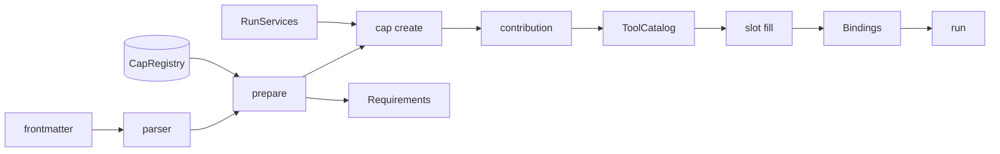

# Capabilities and Global Naming

**How to Execute This Plan (read first if you are a fresh context):**

- **Where the code is**: the repository is `promptforge/` in the workspace root (`c:\Users\Vinnie\cursor\promptforge`), a Rust workspace with crates under `crates/`. All `crates/...` paths in this plan are relative to that repo. Related paths, also relative to the workspace root: `promptforge-design/research/` (the evidence documents), `vibe/` (prior plans), `wg21-paperflow/crates/papergate` (the first out-of-repo consumer), and the prompt guide at `promptforge/guide/src/`.
- **Read order**: Product Requirements (what and why) -> Technical Design including the live declarations (the shapes to build) -> Execution Instructions (the components and their ordered steps) -> Testing Plan. Read the Project Survey first if you are new to the codebase - it defines every term (H1/H2, the picker, slots/bindings, the VFS, fanout) and lists the verified current-state facts with file and line references. Consult the Decision Record only when a choice seems arbitrary; every decision records its user quote.
- **Status**: surveyed and decomposed, execution not started. The Project Survey carries `- Status: complete` (build/test/lint/fmt/docs commands discovered 2026-09-13). The Execution Instructions are 18 committable steps in 7 dependency-ordered components, each wrapped in a `<step-N>` tag pair; the frontmatter todos mirror the components with their step ranges - mark each `complete` as its steps land, and the run appends ` [completed]` to each `### Step N:` heading. The plan passes the vibe-coder contract check (seven H2 sections in order, six balanced contract tag pairs, balanced step tags) and is ready to seed into `vibe/` when a run starts. Reviewed for internal consistency 2026-09-13 (deferrals of the open toolset, the `prompt` reflection global, and the prompt-pack capability are fully propagated).
- **Working agreements** (from the plan's constraints): behavior changes ship with their tests in the same change; the interface consolidation (step 4) is the parity gate (no behavior change, full suite green); do not build anything listed under Deferred - the live shapes leave room for it, that is all.

<product-contract>

## Product Requirements

PromptForge is a prompt-programming system: a prompt is a Markdown file whose YAML frontmatter declares its contract and whose sections contain Lua code that drives models explicitly; the Rust executor runs it, and Workshop (the desktop app) is one host among several the design anticipates (CLI, automation, cloud). Today a prompt that needs tools must describe them in English prose, which a semantic picker (a local embedding model) fuzzy-matches against the installed catalog - so a prompt that needs exactly the shell can fail to bind it, or bind the wrong thing. Meanwhile a survey of Everruns (a production agent platform) showed its harness features - tools, shells, AGENTS.md injection - live in a composable capability layer below the UI, never in it; promptforge has no such layer, and Workshop currently runs every prompt with an empty tool catalog. This plan builds that layer: capabilities (code units that run at setup and make services available), named globally, declared and bound in frontmatter, with model selection inverted from prompt-seeks-model to prompt-declares-roles and host-satisfies. It also rebuilds the executor's interface: a shareable deployment Environment, a per-run RunContext, a prepare step with a requirements report, and an infallible RunResult. The design accumulated across two days of conversation (2026-09-12/13) and draws on a four-way naming survey and the Everruns feature survey.

- Background: three evidence documents inform this plan and are worth reading first if any decision seems arbitrary: the naming survey (why reverse-DNS namespaces, why the model only ever sees local aliases and never global tool paths, why prefix schemes fail), the Everruns feature survey (what a production agentic harness consists of), and the Everruns integration-path analysis (which of those features need executor integration versus composing as tools and prompts - most compose).
- Problem and users: prompts cannot say what they need (tools, models, services) except through fuzzy prose binding; hosts cannot preflight a prompt; harness features have no activation unit. Users are prompt authors, hosts (Workshop today; CLI and automation later), and capability authors (first-party now, DLL packs later).
- Goals:
  - Three distinct units: a pack/plugin is the delivery container (crate, later DLL); a capability is the activation unit (code that runs at run setup and makes services available; v1 contributes tools - mounts, prompt fragments like AGENTS.md injection, and Lua surface are designed and deferred, see Deferred); a tool is an implementation detail a capability surfaces, learned from the capability's documentation.
  - Frontmatter installs and binds; H2 sections scope. The frontmatter does two things: it names required capabilities (with optional per-capability config), and it declares tool slots - each slot maps an alias to either an exact global tool path or a fuzzy `want` description (the open host-offered posture is deferred - see Deferred). There is no `tools.bind` in Lua: prepare fills every slot before the run and journals the result. Inside the Lua, `tools.add` scopes aliases per section as today, and `tools.always` is H1-only and prompt-wide. H1's only remaining privilege is `argv` repair: `argv` is writable in H1 and frozen when H1 completes. `tools.add`/`add_local` also work in H1, as ordinary section behavior rather than as a privilege.
  - Global names encode kind by arity: capabilities are `namespace/pack`, tools are `namespace/pack/name` (reverse-DNS namespace, MCP-registry convention); a capability's tools live under its full id; the semantic picker leaves the binding path except as the journaled fill function behind fuzzy slots.
  - Models are declared requirements, host-satisfied: frontmatter declares roles under prompt-local labels with keywords, descriptions, and a context minimum, and parse exposes them as slots. A fill function maps each slot to a concrete model at prepare; v1's fill is deliberately trivial - every slot gets the host's current model - and the result is journaled as `ModelBindings` (roles label->id, models id->descriptor). The model rides per-run (in Workshop, the dropdown's current selection); the Environment is model-free and never rebuilt. Hard keywords and the context minimum are checked per slot against the filled descriptor and reported, not shopped for. Soft keywords are documentation of author intent. Multi-model satisfaction is deferred as a smarter fill function, not a structural change (see Deferred); the prompt-side schema already supports it.
  - The caller's burden collapses to exceptions: `prepare` auto-satisfies and returns a `Requirements` report listing only what needs human attention.
  - The interface never fails to produce a result: `run` returns `RunResult`, with domain outcomes as values.
- Non-goals: `calls:` frontmatter and recursive preflight (the user has other ideas for `call`); the DLL addon ABI itself (the `addon_dll_abi` plan owns it); capability interfaces / dependency injection; multi-major coexistence; `multimodal`/`visual` model keywords; the durable platform tier (event-sourced replay, workers, control plane).
- Success criteria: a prompt declares capabilities, model roles, and tool slots in frontmatter and runs end to end in Workshop: capability activated, slots filled, tool called from a section; a missing required capability and an unmet model requirement are reported by `prepare` before any model call; two concurrent runs share host-file conflict detection but never conflict on their stores; the full existing test suite stays green through the interface consolidation.
- Constraints:
  - Runtime vs capability dividing line: the criterion is not "is it language surface" but "does it reach outside the run." The store is always present (pure interiority: the run's own scratchpad, defined by the run's determinism contracts; same for `var`, `log`, the models namespace, cancellation). A Lua `fs` table reaches through the VFS to host files, so it is a capability. Never package an interior primitive as a capability; never assume an exterior one.
  - Behavior changes ship with tests in the same change; existing alias/scope behavior tests are preserved.
  - No new structural enforcement: frontmatter keys extend the existing parser; no new parsers or allowlists. The capability co-activation conflict check is behavior validation at prepare, not a source parser.
  - Dependency rules: `shared-promptforge-api` stays free of product crates (it gains a dependency on `shared-vfs`, std-only, shared-* tier); `CapabilityRegistry` lives in `promptforge-api`; workshop consumes through the one interface only.
  - `RunServices` leaves room for the DLL addon plan: DLL packs register capabilities into the same registry via host-side adapters later.
  - User-facing strings are model-facing strings: error and status messages are written assuming model consumption - concise, factual, self-contained - because any string the system produces may be read by a model (tool errors, failure notices, sub-run output). Recorded as a root `AGENTS.md` Principles rule by this plan.
- Open questions:
  - Whether the section execution graph can be guaranteed directed and acyclic (user exploring, 2026-09-13 - NOT decided: "I am thinking it would make PromptForge very powerful if we could guarantee that the execution graph was directed and acyclic with respect to sections. I dont know if it is possible. And I'm not sure it would be too limiting").
    - The leading candidate rule (user, 2026-09-13): `jump` may target only a CHILD or a FORWARD SIBLING of the current section. Every permitted edge strictly advances document position, so document order is itself a topological sort, and acyclicity falls out of a local per-jump positional check at parse time - no graph algorithm needed. In the user's words: "control never starts anything above where you are on the page."
    - What the rule preserves: today's two legitimate control-flow modes - transferring to a sibling section, and descending into a child section with the parent resuming afterward (a resumption, not a fresh execution).
    - What the rule kills: backward jumps, jumps to uncles or ancestors, and mutual cycles.
    - What a DAG buys: structural termination of the walk; a journal that is a path through a DAG (analyzable, diffable, replayable); topological readability.
    - What it forbids, and where those needs go instead: section-level retry loops (covered by the `clear_context()` idea - reset the section's model context to its entry baseline while the store and `var`s persist, journaled so replay truncates identically) and section-graph state machines (assigned to `models.loop` within a section, or to the out-of-scope durable tier).
    - Sub-questions to resolve before adopting: (1) `call` must carry the same restriction or the guarantee leaks through mutual calls; (2) off-walk sections (today reachable only by jump) must sit as child or forward sibling of every jumper - where they live today is an evidence question; (3) double execution without cycles (call a forward sibling, then fall through to it later) - allowed (still acyclic) or forbidden (one fresh execution per section)?; (4) whether jump targets can be computed at run time today or are always literals (the static check needs literals); (5) whether any shipped prompt or test relies on cycles or re-entry; (6) whether fanout arms are sections or inline code.

## Functional Specification

A prompt's contract is fully static: frontmatter declares capabilities, typed args, model roles, and tool slots; prepare fills every slot and journals the bindings; H2 sections scope aliases. The host builds one Environment per deployment (never rebuilt), creates a RunContext per run carrying the per-run inputs (the current model, observer, cancel), prepares it, adjusts only what the Requirements report flags (including seeding declared inputs through `ctx.vfs`), and calls run. Every run produces a journaled RunResult: success text, cancellation, or a failure notice whose kind tells the host whose move it is.

- Actors and workflows:
  - Prompt author: declares `capabilities:`, `tools:`, `args:`, and `models:` in frontmatter; creates local tools and repairs `argv` in H1; scopes and advertises in H2; weaves natural-language guidance into instructions; interprets hard gates once at the top of the run via the decision-tool idiom.
  - Host (Workshop, CLI, automation): builds the Environment once (registry, client, base VFS - never rebuilt); per run, creates the RunContext carrying the per-run inputs (the current model, observer, cancel), calls `prepare`, reads the `Requirements` report, adjusts the RunContext, calls `run`. The zero-burden path is one call: `env.run(&prompt, args, ctx)`. Hosts seed declared inputs through `ctx.vfs` before the run and read declared outputs through a `VfsRef` cloned beforehand (Arc-backed, cheap), since `run` consumes the context. In Workshop the current model is the dropdown selection, set on each run's context - a selection change simply takes effect on the next run; a CLI takes it from a flag or env var.
  - Capability author: implements `Capability`; v1 contributes tools (mounts, prompt fragments, and Lua surface are deferred - see Deferred).
- Inputs and outputs:
  - The YAML is the whole contract (user, 2026-09-13): `capabilities:` install, `tools:` bind, `models:` declare, `args:` type - one static declaration a host can read programmatically before any run. This reverses the earlier "YAML never names tools" rule, which existed to keep binding in the Lua; with `tools.bind` gone entirely, the objection went with it. Frontmatter remains about what must exist and what the prompt wants; the Lua remains about what gets done with it.
  - Frontmatter schema (all keys optional; `deny_unknown_fields` stays):

```yaml
capabilities:
  - promptforge/web                      # required, plain string
  - ref: io.github.corp/mcp              # optional, with config
    optional: true
    config: { }                          # prompt-side config only;
                                         # user config comes from the host
tools:
  search: promptforge/web/search         # exact: alias -> global path
  fetch: promptforge/web/fetch
  wiki:                                  # fuzzy: the picker fills at
    want: "searches private wikis"       # prepare; the fill is journaled
    optional: true                       # unfillable -> skip-and-log
                                         # (the reserved `open` key for
                                         # host-offered tools is deferred)
args:
  use_mcp:
    type: boolean
    default: true
    description: "Search MCP-connected private sources"
models:
  analyst:
    keywords: [frontier, thinking]     # closed vocabulary; hard keywords and
    min_context: 200000                # the minimum are CHECKED against the
    description: "deep reasoning"      # filled model; soft keywords document
  triage:                              # intent
    keywords: [fast, small]
    description: "quick triage of search results"
```

  - Lua surface:

```lua
-- tools arrive bound: the YAML slots were filled at prepare.
-- The model sees aliases only; advertising is the Lua's job.
tools.always("search")               -- H1: prompt-wide
-- in a section: tools.add("fetch")  -- H2: scoped

-- conditional availability is advertise-time, not bind-time:
-- the wiki slot is filled iff the optional MCP capability activated
if argv and argv.use_mcp then
  tools.always("wiki")   -- arg-gated; probing whether the slot actually
                         -- filled awaits the deferred `prompt` global
end

-- models: labels only, satisfied by the host at prepare time
-- (the labels declared in the frontmatter above: analyst, triage)
models.use("triage")      -- never a concrete model id or keyword
models.default("analyst") -- fallback role
-- handles are inspectable: the FULL truth about satisfaction
-- (handles already expose name, model_id, description, context,
-- thinking, temperature, max_tokens today - new: label, capabilities)
local m = models.get("analyst")   -- frozen handle
assert(m.context >= 200000)       -- actual window of the resolved model
-- m.thinking, m.model_id, m.label, m.capabilities (actual full keyword
-- set, possibly exceeding the request)

-- self-reflection on the prompt's own frozen frontmatter
-- (prompt.name, prompt.models, prompt.args, prompt.capabilities,
-- prompt.tools) is DEFERRED - see Deferred: the `prompt` global
```

  - The run's args (user, 2026-09-13): two plain globals, no container, no magic. `args` is the exact passed string, ALWAYS - unchanged from today, so legacy prompts and `{{ args }}` are untouched by definition. `argv` is the parsed JSON on success, nil otherwise - so `if argv then` is the idiomatic malformed check, and the repair pattern (H1 inference plus a local capture tool, the decision-tool idiom) works from `args`. Valid JSON scalars make `argv` a number or boolean; JSON `null` reads as nil. The executor never hard-errors on shape: enforcement belongs to the prompt's H1 - strict prompts access declared fields and error on absence, tolerant prompts repair. `argv` is writable in H1 ONLY and frozen when H1 completes (user, 2026-09-13: "being able to look at a prompt, and know that argv can only change in H1, has value") - so the repair pattern lives in H1: read the broken input from `args`, infer the correction, capture it via the local tool, assign `argv = repaired`, and every downstream section sees the repaired value; a section assigning `argv` mid-walk is an error. The frontmatter `args:` declaration advertises, documents, and derives the tool schema; it does not enforce.
  - Every prompt has an args declaration (user, 2026-09-13: "there must be no freeform prompts"): a prompt with no `args:` key gets the default - one optional string field named `prose` (description: "Freeform input for this prompt"). Optional means a tool call may omit the field entirely, and absent is not the empty string: `{}` and `{ "prose": "" }` are distinguishable in Lua (nil vs ""). Because every prompt's advertised tool schema is its real declaration, every prompt is tool-exportable by construction and nothing is synthetic (tool export itself arrives with the deferred prompt-pack - see Deferred). The channels converge with ONE spelling (user, 2026-09-13): prose at the interface of a default-declared prompt is wrapped into the default shape - `argv = { prose = "<text>" }` - so the input is `argv.prose` on both channels, and `args` always holds the exact passed string. The wrap is conformance to the declared schema, not a fiction: the default declaration IS the prose contract. Structured declarations never wrap - for them non-JSON input is `argv == nil`, which crisply means "a structured prompt got non-JSON." (Vocabulary note: `prose` is also the Lua global for a section's pending Markdown buffer; the overlap is harmonious - both mean "the text" - and the guide says so in one line.)
  - Args in prose substitution (user, 2026-09-13): no new syntax. `{{ args }}` renders the raw string, unmodified. `argv` joins the substitution namespaces: `{{ argv }}` renders the parsed value (compact JSON for tables, the existing whole-value rule) and `{{ argv.query }}` indexes a table `argv` with the existing dotted-path rule; dotted indexing into a scalar stays a catchable substitution error, never a silent empty string.
  - The run's result: `RunResult` (see Technical Design).
- States and validation:
  - Parse time: capability id shape (2 segments), tool slot shape (alias grammar on keys; an exact value parses as a 3-segment ToolId; a fuzzy slot has a `want` string; the reserved `open` key is deferred, so `deny_unknown_fields` rejects it in v1), arg name/type sanity, model label grammar (same as aliases), keyword membership (unknown keywords are parse errors - typo safety), config is plain JSON-ish data; errors carry line/column (see `SourceLocation`). (v1 is unversioned: a `@` in a capability id is a parse error; version pins are deferred.)
  - Prepare time: required capabilities resolve against the registry or land in `Requirements.missing_required` (an exact tool slot's prefix names its capability, so a slot whose capability is inactive lands there too); absent optionals are skipped and logged; capability co-activation conflicts (bashkit vs terminal) fail preparation naming both; the fill function binds every model slot (v1: all to the current model) with hard keywords and the context minimum checked against the filled descriptor into `Requirements.unmet_requirements`; fuzzy tool slots fill via the picker and the fills are journaled.
  - Run time: only filled slots are visible to `tools.add`/`always` and `tools.call`; advertising, not binding, is the Lua's gate - an unadvertised alias is invisible to the model.
- Errors and recovery:
  - The interface is infallible: `run` returns `RunResult` - `Ok(String)`, `Cancelled`, or `Failure(RunError)`. Domain outcomes (including "the prompt declined") are values, never thrown errors; the variant is for code, the payload for humans and models.
  - A failed H1 assertion ends the run before the walk as `RunResult::Failure` with the new `RunErrorKind::RequirementsUnmet` - the failure notice as content ("the prompt failed, and here's why," no different in kind than an inference-produced result), with the kind machine-readable for hosts, supervisors, and evals. Authors choose `assert` (fatal) vs conditional (adaptive) per check.
  - The zero-burden `env.run` refuses a prompt whose declared model requirements the one model cannot meet: `RunResult::Failure` with `RequirementsUnmet` and a model-readable notice (user, 2026-09-13: "a suitable string that a model can read" - when the deferred prompt-pack lands, it arrives as tool output when the prompt runs as a sub-run tool). The multi-step path lets a host read the report and proceed deliberately anyway.
  - Domain failure vs infrastructure fault is a property of the `RunErrorKind`: `RequirementsUnmet`/`Lua`/`ContextExhausted` are domain (operator's or author's move); `Completion`/`Internal` are infrastructure (platform's move).
  - Host cancellation maps to the top-level `RunResult::Cancelled` variant, never to `Failure(Cancelled)`; the `Cancelled` kind remains for mid-run classification.
- Security and privacy behavior:
  - User-specific capability configuration (which MCP servers, credentials) is host-supplied via `RunServices`, never named in the prompt; the prompt declares the optional capability, the host activates and configures it from user settings.
  - Capability co-activation rules (bashkit vs terminal exclusivity) and high-risk gating attach at the capability level; the subagent spawn is the policy/approval checkpoint for sandbox-escaping work.
  - Prompt fragments carry `OutputTrust`; AGENTS.md content arrives `Untrusted` and flows through the existing guard-wrap machinery.
- Acceptance criteria:
  - A prompt with `capabilities:`, `tools:`, and `models:` frontmatter runs in Workshop end to end: capability activated, tool slots filled, model slots filled, tool called from a section.
  - `prepare` reports a missing required capability and an unmet model requirement, each naming the frontmatter key, and logs skipped optionals.
  - A prompt with no `capabilities:`/`tools:`/`models:` keys behaves exactly as today.
  - The claims isolation matrix passes: two concurrent runs writing the same store path proceed without conflict; two concurrent runs writing the same host file through the shared base hit a determinism violation.

</product-contract>
<implementation-contract>

## Technical Design

The architecture has three units (pack delivers, capability activates, tool serves) and the contract is one static YAML declaration (capabilities install, tools bind, models declare, args type) filled at prepare. The executor's interface splits by rebuild-ability: an Environment holding what is never rebuilt (registry, client, base VFS, max_depth) and a RunContext holding what can change per run - including the current model - created by the host, enriched by prepare, owned by the executor during run. Naming encodes kind by arity: capabilities are `namespace/pack`, tools are `namespace/pack/name`. The semantic picker becomes the journaled fill function behind fuzzy tool slots, and later powers the discovery capability when that lands. The per-run VFS is a fresh router mounting the shared base plus a fresh store backend - never an overlay - because claims are shared per storage, not per namespace.



- Architecture:
  - Capability activation: `Environment::prepare` resolves frontmatter capabilities against the registry, calls `create(&RunServices)` per present capability in declaration order, and assembles the contributed tools into the run's `ToolCatalog`. (v1 contributions are tools-only; mounts/fragments/Lua surface are deferred - see Deferred. When mounts land, the mechanics will be: a capability sees the base router during `create` and requests mounts; those mounts are then overlaid onto the run's router afterward. An overlay shares the run's claims table, which is correct here because capability storage is run-scoped - same run, same storage. Only the per-run store needed a fresh claims table, because two concurrent runs' stores are different storage.)
  - Bridge capabilities (deferred from v1; recorded here because they shape `RunServices`): capabilities that create things (fs, bashkit) are self-contained; capabilities that bridge to host services (user-input, later MCP-with-user-servers) consume a `RunServices` field the host fills. Both declare identically in frontmatter; the difference is invisible to the prompt author. When `user-input` converts: it contributes the model-visible input tool plus the `user_input()` Lua global, both wired to `RunServices.input`; no broker installed degrades to today's unavailable-fallback and is reported as a service gap (a `Requirements` field to add then).
  - Model satisfaction (user, 2026-09-13: slots plus a trivial fill): the parsed prompt exposes declared roles as a Vec of slots; prepare's fill function maps each slot to a concrete model, and v1's fill is deliberately stupid - every slot gets the RunContext's current model. The result is journaled as `ModelBindings` (roles label->ModelId, models ModelId->ModelDescriptor; handles resolve label->id->descriptor). The boundary is exactly `run()` and above: from the prompt's perspective the full infrastructure exists - it declares roles as if a catalog will shop for them, and the Lua `models` namespace and inspectable handles speak that abstraction (`prompt.models` reflection is deferred); the trivial fill is the one-model host satisfying the full contract, and the prompt cannot tell the difference. Hard keywords (`thinking`, `no-thinking`) and the context minimum are CHECKED per slot against the filled descriptor - `min_context: 200000` against a 32k model lands in `Requirements.unmet_requirements` naming the role - they do not filter anything, there being nothing to filter in v1. Soft keywords (`frontier`, `fast`, `small`, `creative`, `chat`) are documentation of author intent. Multi-model satisfaction arrives later as a smarter fill function, not a structural change - see Deferred.
  - Tool slot filling: exact slots fill by identity against the assembled catalog (an exact path's first two segments name its capability, so a slot whose capability is inactive lands in `missing_required`); fuzzy slots fill via the picker over the catalog, and every fill is journaled so hosts and evals see what the fuzz resolved to. The result is `ToolBindings` (alias->ToolId, ToolId->tool), journaled at run start. Binding and advertising are separate facts. Binding is decided entirely at prepare: everything a binding decision could depend on (the frontmatter, the args, which capabilities activated) is known by then - binding was already H1-only even before this plan, so no information appears later that could change it. What remains for run time is advertising: the Lua decides per section which already-bound aliases the model gets to see, and conditional availability (arg-gated via `argv`) is expressed there.
  - Per-run VFS: `prepare` builds a fresh router per run mounting `env.base_vfs` at `/` (shared storage; the base's claims table catches cross-run host-file conflicts under the caller's identity) plus a fresh memory backend at the store mount (per-run storage, per-run claims). Never an overlay: overlay shares the claims table, which is only correct for two views of the SAME storage; concurrent runs' stores are different storage and must not share claims. The Environment's base is built with host roots only - it must not carry the store mount (`promptforge_vfs::empty()` installs one; do not reuse it as the base). Policy composes in two layers: the run's ModePolicy installs on the per-run router, and ops routed to the base also consult the base's policy; both must allow, so the base can tighten but never loosen.
  - Verified against the implementation (2026-09-13 review of `shared-vfs`): `VfsRefBuilder::build()` gives a fresh claims table (`handle.rs` ~287-300); `impl Vfs for VfsRef` forwards the caller's identity into the base's claims (`handle.rs` ~674-693); the nested-claims case is covered by `a_mounted_handle_applies_its_own_claims_under_the_callers_identity` (`router.rs` ~641-667) and overlay sharing by `an_overlay_shares_the_bases_claims_table` (~792-808); release chains are clean across runs (`router.rs` ~315-327); the op sink fires once with the caller's origin (`handle.rs` ~260-265, ~599-609).
  - DLL constraint: exporting the Lua API through the ABI is rejected - the DLL never touches the VM. The addon ABI has exactly one verb (`call`); everything a DLL offers is declared as data and materialized host-side (tools via adapters, VFS via the HostVfs facade). Lua surface contributions are accepted only from in-process capability crates; DLL packs contribute tools (and, when they land, mounts and fragments) only. The escape hatch (designed, not built): a declarative Lua-surface schema with a generic host bridge routing each call through the addon `call` ABI - a translation of the deferred `LuaNamespace` design, not a redesign.
- Modules and interfaces: see the declarations below. `shared-promptforge-api` gains modules `names` and `capabilities` and a dependency on `shared-vfs`; `promptforge-api` gains `Environment`, `RunContext`, `Requirements`, `CapabilityRegistry`, `ModelBindings`, `ToolBindings`, and the new interface; `promptforge-parser` gains the frontmatter keys; `promptforge-lua` loses `tools.bind` and gains the descriptor surface on model handles (the `prompt` reflection global - which does not exist today - is deferred; see Deferred: the `prompt` global).

### Live declarations

In `shared-promptforge-api`:

```rust
// ---- names (new module) ----

/// The one global naming grammar. Kind is encoded by arity:
/// capabilities are namespace/pack (2 segments), tools are
/// namespace/pack/name (3 segments). Namespace is reverse-DNS
/// (org.rustalliance) or the reserved first-party prefix
/// `promptforge`.
pub struct GlobalName { /* private: segments (2 or 3) */ }

impl GlobalName {
    pub fn parse(s: &str) -> Result<GlobalName, GlobalNameError>;
    pub fn namespace(&self) -> &str;
    pub fn pack(&self) -> &str;
}

pub struct GlobalNameError { /* kind: SegmentCount | Empty | Control */ }
// (NormalizationCollision deferred - it matters at registry scale, not
// day one; see Deferred.)

// tools::ToolId becomes a newtype over GlobalName (was 2-part
// server/name, e.g. promptforge/web_fetch), now requiring exactly
// 3 segments: namespace/pack/name. Dropping the last segment of any
// tool id always yields the id of the capability that contributed it
// (promptforge/web/fetch comes from promptforge/web, no exceptions).
// This holds by construction: tools exist only after a capability's
// create() returns them, so prepare checks each contributed tool's
// prefix against that capability's id when assembling the catalog.
// Built-ins migrate: promptforge/web_fetch -> promptforge/web/fetch.
pub struct ToolId(GlobalName);

impl ToolId {
    pub fn name(&self) -> &str;
    pub fn capability(&self) -> CapabilityId;  // the prefix, as its own id
}

// ---- capabilities (new module) ----

// 2 segments (namespace/pack).
pub struct CapabilityId(GlobalName);

/// The activation unit. Code that runs at run setup and makes services
/// available. Delivered in packs (crates now, DLLs via adapters later).
/// v1 is unversioned: a name resolves to the only installed capability
/// (versioning is deferred; see Deferred).
pub trait Capability: Send + Sync {
    fn id(&self) -> &CapabilityId;
    fn description(&self) -> &str;
    fn create(&self, services: &RunServices) -> Result<Contribution, CapabilityError>;
}

/// What a capability is given at activation. Non-exhaustive, so new
/// fields can be added later without breaking existing capability
/// implementations. Host-supplied per-capability config (the user's
/// MCP servers, credentials) arrives here, never via the prompt.
#[non_exhaustive]
pub struct RunServices {
    pub vfs: VfsRef,          // shared-vfs: the run's filesystem
    pub cancel: CancelToken,  // the existing cancellation token type
    // input broker, observer, model client: added when a bridge
    // capability needs them (see Deferred: bridge capabilities)
}

/// What a capability contributes. v1 is tools-only (2026-09-13 scope
/// review): mounts, prompt fragments, and Lua surface are deferred
/// until the fs / agents-md / MCP capabilities that need them land.
/// The struct is Default and grows without redesign.
#[derive(Default)]
pub struct Contribution {
    pub tools: Vec<Arc<dyn Tool>>,          // ids under the capability's own full id + "/"
}

// kind plus a message written to be read by a model, mirroring ToolError
pub struct CapabilityError { /* ... */ }
```

In `promptforge-api`:

```rust
// promptforge-api::execute

/// What exists in this deployment and its standing policy.
/// Safe to share across concurrent run() calls (Sync); built once per
/// host and NEVER rebuilt (user, 2026-09-13): everything that can
/// change per run rides the RunContext. Model-free: the gateway's
/// model list is a host-UI concern (the Workshop dropdown) and never
/// crosses this interface.
#[non_exhaustive]
pub struct Environment {
    registry: Option<CapabilityRegistry>,
    // no picker: it is executor-internal machinery, never caller-provided

    // shared services
    client: Option<GatewayClient>,
    base_vfs: VfsRef,              // host roots; the store mount is added per run

    // composition guard: maximum MODEL-ORCHESTRATED prompt-tool
    // nesting (Lua tools.call recursion does not accrue - it is
    // operator-written deterministic code). Deliberately low
    // (default 3; user suggested 3 or 5). Copied into every RunContext.
    // Live from day one (user, 2026-09-13: "keep the depth/max_depth");
    // its only consumer, the prompt-pack sub-run adapter, is deferred.
    max_depth: u32,
}

impl Environment {
    pub fn new() -> Environment;
    pub fn registry(self, registry: CapabilityRegistry) -> Environment;
    pub fn base_vfs(self, vfs: VfsRef) -> Environment;

    /// Enriches the caller-created RunContext against the prompt's
    /// declarations: activates the declared capabilities, assembles
    /// the catalog, fills every slot - model slots via the fill
    /// function (v1: every role to the context's current model),
    /// tool slots exact/fuzzy - and checks requirements.
    /// The report lists only what needs human attention.
    pub fn prepare(&self, prompt: &Prompt, ctx: RunContext) -> (RunContext, Requirements);

    /// The zero-burden path: prepares implicitly and fails on
    /// unsatisfiable requirements - missing required capabilities AND
    /// unmet model requirements (user, 2026-09-13). The failure notice
    /// is a model-readable string: when the deferred prompt-pack
    /// lands, it may arrive as tool output when the prompt runs as a
    /// sub-run tool. (The convenience lives on
    /// Environment: the free `run` receives an already-prepared
    /// RunContext and has nothing to prepare from.)
    pub fn run(&self, prompt: &Prompt, args: &str, ctx: RunContext) -> RunResult;
}

/// One run. Created by the host from the Environment carrying the
/// per-run inputs, enriched by prepare, owned by the executor during
/// run(). Never shared between runs.
#[non_exhaustive]
pub struct RunContext {
    // identity
    name: String,                  // run identity, carried on every report/event
    start_time: SystemTime,
    depth: u32,                    // model-orchestrated prompt-tool nesting:
                                   // 0 for a root run, parent.depth + 1 per
                                   // hop the MODEL's dispatch initiated (Lua
                                   // tools.call recursion never increments);
                                   // the adapter refuses the call when the
                                   // next hop would exceed max_depth.
                                   // Not resettable from Lua. Always 0 in
                                   // v1 - the adapter that increments it
                                   // defers with the prompt-pack.

    // host-supplied per-run inputs (set before prepare; the
    // create-then-enrich ordering: prepare's checks read these)
    model: ModelDescriptor,        // the current selection (in Workshop, the
                                   // dropdown). Input to the fill function.
                                   // Grows into a catalog or policy in the
                                   // deferred multi-model future - a field
                                   // change, never a signature change.
    // (the host-push `offering: Vec<CapabilityId>` field is deferred -
    // see Deferred: the open toolset)

    // prepared artifacts (written by prepare)
    model_bindings: ModelBindings, // model satisfaction, journaled
    tools: ToolCatalog,            // assembled from activated capabilities
    tool_bindings: ToolBindings,   // alias -> ToolId -> tool, journaled
    vfs: VfsRef,                   // fresh router per run: mounts env.base_vfs
                                   // (shared storage, base claims catch cross-run
                                   // host-file conflicts) + fresh memory backend at
                                   // the store mount (per-run storage, per-run claims).
                                   // NOT an overlay: overlay shares the claims table,
                                   // which is only correct for two views of the SAME
                                   // storage; concurrent runs' stores are different
                                   // storage and must not share claims.

    // run services and options (current RunConfig set)
    observer: Arc<dyn Observer>,
    cancel: Option<CancelHandle>,
    client: Option<GatewayClient>,   // overrides Environment.client; for
                                     // per-run fault injection and tests
    input: Option<Arc<dyn InputBroker>>,
    ui: Option<Arc<dyn Fn() -> serde_json::Value + Send + Sync>>,
    limits: RunLimits,
    debug: Option<Arc<dyn DebugCapture>>,
    on_delta: Option<Arc<dyn Fn(StreamDelta) + Send + Sync>>,
}

impl RunContext {
    pub fn name(self, name: impl Into<String>) -> RunContext;
    // current RunConfig builder methods renamed on (observer, cancel,
    // limits, input_broker, ui, on_delta, debug), plus the per-run
    // inputs above (model)
}

/// The run's model satisfaction: which concrete model each declared
/// role is bound to, and the descriptors of every model this run may
/// use. Written by the fill function at prepare; v1's fill binds every
/// role to the current model ("a little stupid convenience function,"
/// user 2026-09-13). Handles resolve label -> id -> descriptor.
pub struct ModelBindings {
    roles: /* label -> ModelId */,            // the decision, journaled
    models: /* ModelId -> ModelDescriptor */, // what this run may use
}

/// The run's tool bindings. Exact slots fill by identity against the
/// assembled catalog; fuzzy slots fill via the picker (the fill is
/// journaled).
pub struct ToolBindings { /* alias -> ToolId; ToolId -> Arc<dyn Tool> */ }

/// The preflight report: what the caller must still satisfy.
/// Skipped optional capabilities are a log line at prepare, not a
/// report field.
pub struct Requirements {
    pub unmet_requirements: Vec<UnmetRequirement>, // role, which check, required
                                                   // vs actual (min_context 200k
                                                   // vs 32k; thinking vs Never)
    pub missing_required: Vec<CapabilityId>,    // run fails until satisfied
}

// What prepare can actually check is exactly two things: the context
// minimum and the hard keywords. There is one minimum, not a family of
// minimums - which is why the report field is named unmet_requirements
// rather than "minimums."
pub struct UnmetRequirement { /* role label, which check, required vs actual */ }

/// Explicit host-built registry of installed capabilities.
/// Linking alone registers nothing. v1 is unversioned: one capability
/// per id.
pub struct CapabilityRegistry { /* private */ }

impl CapabilityRegistry {
    pub fn new() -> CapabilityRegistry;
    pub fn register(&mut self, cap: Arc<dyn Capability>) -> Result<(), RegistryError>;
    pub fn get(&self, id: &CapabilityId) -> Option<&Arc<dyn Capability>>;
    // registration-time near-duplicate lint over capability descriptions
    // via the picker; the tool prefix-containment check runs at
    // assembly, not registration: tools exist only after create().
}

pub struct RegistryError { /* kind: DuplicateId */ }
```

The interface and its result:

```rust
/// What the run produced. Domain outcomes (including "the prompt
/// declined") are values, not thrown errors. The variant is for code;
/// the payload is for humans and models.
pub enum RunResult {
    Ok(String),            // mirrors Result vocabulary; note: patterns
                           // need RunResult::Ok qualification wherever
                           // Result is also in scope
    Cancelled,
    Failure(RunError),     // the existing RunError: kinds, Display,
                           // and source chains already mapped
}

pub async fn run(
    prompt: &Prompt,
    args: &str,
    ctx: RunContext,
) -> RunResult;
```

`RunError` exists today (`promptforge-api/src/execute/error.rs` ~54-58) as a `#[non_exhaustive]` newtype over the internal `Error`, with a stable `kind()` classifier plus `is_cancelled`/`is_retryable` predicates and the cause preserved through `std::error::Error::source`. This plan adds one kind and one accessor:

```rust
// promptforge-api::execute - EXISTS today; one kind and location() added

pub enum RunErrorKind {          // non_exhaustive, Copy
    Parse,                       // prompt parse / invalid compiled Lua region
    Version,                     // unsupported promptforge: major
    Binding,                     // capability absent, unbindable, or clashing
    Completion,                  // transport / backend / decode
    Tool,                        // dispatched tool failed, unknown, no convergence
    Store,                       // run-scoped store operation failed
    Determinism,                 // claims violation: fatal, not Lua-catchable
    Lua,                         // section Lua phase failed: the prompt has a bug
    Quota,                       // log/instruction quota exhausted
    ContextExhausted,            // compactor exhausted the context window
    Input,                       // input broker failed a user_input request
    Substitution,                // {{ }} prose substitution failed
    Cancelled,                   // host cancelled (mid-run classification only;
                                 // the interface reports RunResult::Cancelled)
    Internal,                    // invariant failure: the machinery broke
    RequirementsUnmet,           // NEW: H1 assertion / unmet model
                                 // requirement - the environment cannot
                                 // satisfy this prompt
}

/// Where a failure lives: a prompt source position or a Rust code
/// position. One generic shape - the RunErrorKind says which world the
/// fault is in, and the path's extension says it again.
/// Note (2026-09-13 verification): Prompt::parse is (input, execution,
/// observer) - the parser learns the prompt's name from the frontmatter,
/// not a parameter, so a frontmatter YAML failure predates the name.
/// path is the frontmatter name when parse got that far, the host's
/// label for the source otherwise.
pub struct SourceLocation {
    pub path: String,            // prompt name (from its frontmatter) or
                                 // host label, or Rust file (from file!())
    pub line: Option<u32>,       // 1-based
    pub column: Option<u32>,     // 1-based
    pub span: Option<Range<usize>>,  // byte span, as today
}

impl RunError {
    pub fn kind(&self) -> RunErrorKind;
    pub fn is_cancelled(&self) -> bool;
    pub fn is_retryable(&self) -> bool;
    /// Where the failure lives, when it has a location. Structured,
    /// never embedded in the message: kinds are for code, messages for
    /// reading, locations for navigation. (2026-09-13 verification:
    /// the serde_yaml_ng error is retained as #[source] today - the
    /// work is surfacing its location() into SourceLocation, not
    /// capturing anything dropped.)
    pub fn location(&self) -> Option<SourceLocation>;  // NEW
    // Display + std::error::Error::source: the notice and the cause chain
}
```

- File and public API changes:
  - `shared-promptforge-api`: new `names` and `capabilities` modules; `tools::ToolId` re-based on `GlobalName`; new dependency on `shared-vfs`.
  - `promptforge-api`: `ResolutionContext` and `RunConfig` removed, replaced by `Environment`/`RunContext`; `run` signature changes; `PickerResolver` leaves the bind path (models and tools); the picker's own 2-part `ToolId` migrates onto the grammar; `RunErrorKind::RequirementsUnmet` and `RunError::location()` added.
  - `promptforge-parser`: `capabilities`, `tools`, `args`, `models` frontmatter keys; parse errors carry line/column (capture the `serde_yaml_ng` location, dropped today). The parsed `Prompt` exposes the FULL declaration to hosts - every model role with its label, keywords, context minimum, and description, and every tool slot with its alias and posture - regardless of how the host will satisfy it (user, 2026-09-13: "I still want parse() on a prompt to return all the frontmatter model stuff"). The parser is a pure function of the source text with no host policy in it: returning only what today's host needs would bake the one-model assumption into the prompt side of the `run()` boundary, sawing off the branch the deferred multi-model work sits on. The full declaration is what `prepare` consumes for requirement checks and what a host UI (the deferred Run Prompt window) renders; the Lua `prompt` reflection global that would expose it to sections is deferred with it.
  - `promptforge-lua`: `tools.bind` removed entirely (binding is frontmatter); `models.bind` removed (frontmatter labels auto-bound); `models.default` takes a label; model handles inspectable; `tools.add`/`add_local` in H1 for decision tools; `tools.add`/`always` remain the advertising gate.
  - `promptforge-webfetch` / `promptforge-web-search`: combined into the single `promptforge/web` capability (their tools become `promptforge/web/fetch` and `promptforge/web/search`).
  - `workshop-sessions`: builds one shared `Environment` at startup (model-free), creates a per-session RunContext carrying the dropdown's current model; `chat.md` gains `capabilities:`, `tools:`, and `models:` frontmatter.
  - The prompt-pack capability (DEFERRED 2026-09-13 - "can we defer the prompt-pack?"; the full design stays recorded here and under Deferred: the prompt-pack capability): a capability whose contribution is a directory of prompts, one tool per prompt. A prompt already shares the tool contract - `name` and `description` frontmatter, and the `args:` declaration (or the default) derives the tool's JSON Schema, so args serve human invokers and model-facing advertisement at once. Invocation runs the prompt as a sub-run prepared against the parent run's Environment with a derived RunContext (same registry and base VFS; the parent's model carries over); the sub-prompt's own frontmatter bounds what it activates. Over-exposure policy belongs to the pack author (what goes in the directory, what each prompt declares), not to machinery. The adapter does not validate args: the call's JSON passes straight to the sub-run, whose H1 controls the response (strict field access, or the repair pattern); a sub-prompt hard error maps to a tool error result for the parent, never a parent run failure. The sub-run's `RunResult` text becomes the tool output (Untrusted, guard-wrapped like any model-generated content), so a failed sub-prompt arrives as a readable failure notice the calling model can reason about. The tool is an ordinary bound tool: the model fills schema-constrained JSON, and Lua calls it through `tools.call` with precisely named fields validated by the same schema - one tool, two callers, one schema. (Dispatch does no schema validation today - `tool_loop.rs` ~294-367 passes arguments straight through; generic dispatch-time validation for all tools is not this plan.)
- Data, persistence, failure, security, and privacy constraints:
  - Global name rules: kind is encoded by arity - capabilities are exactly two `/`-separated segments (`namespace/pack`), tools exactly three (`namespace/pack/name`), and a tool's first two segments name its contributing capability (containment is total; enforced at assembly since tools exist only after `create`). Namespace is reverse-DNS (`io.github.corp`) or the reserved first-party prefix `promptforge`; segments are lowercase ASCII alphanumeric plus `-`, `_`, `.`; case-sensitive comparison. v1 is unversioned: a `@` in a capability id is a parse error (version pins are deferred; see Deferred). Normalization-collision rejection is deferred to registry scale (see Deferred).
  - Alias grammar unchanged: `[A-Za-z][A-Za-z0-9_-]{0,63}` (`promptforge-lua/src/live.rs` ~324); aliases are the only names the model sees - advertising already works this way (`promptforge-api/src/execute/scope.rs` ~94).
  - Model keywords are a closed vocabulary - live: `thinking`, `no-thinking`, `frontier`, `fast`, `small`, `creative`, `chat`; unknown keywords are parse errors; hard keywords and the context minimum are checked against the filled model's descriptor, soft keywords document author intent; adding a keyword is a language change requiring a descriptor property to check against or a documented documentary meaning.
  - The `ModelBindings`, the `ToolBindings` (including fuzzy fills), and every capability activation are journaled at run start; decision-tool results are journaled like any tool call, so replay consumes recorded verdicts rather than re-rolling them.
  - Natural-language guidance is first-class input: soft guidance flows as prose and the author weaves it into instructions; hard gates are interpreted once at the top of the run and the result drives advertising (which bound aliases the model gets to see); typed `args` serve invokers that already hold structured values; both feed the same gate. LLMs translate intent into args; prompts consume args; the model never interprets prose to decide its own tool set inside the deterministic boundary.
  - Decision-tool idiom: interpret guidance into flags via a local decision tool (`tools.add_local` with an enum parameter; three no-arg tools as the weak-model fallback), never by string-parsing prose model output; the "unspecified" choice must exist explicitly; the no-call exit is handled in code.

</implementation-contract>
<verification-contract>

## Testing Plan

Parity first: the interface consolidation (step 4) is behavior-preserving and must keep the entire existing suite green. Around it, each step lands with its behavior tests in the same commit, per repository policy. The claims isolation matrix (step 9) is the determinism gate for concurrent runs.

- Unit:
  - GlobalName parse/validation matrix (segment count, charset, normalization-collision rejection, Display round trip); picker `ToolId` migrated onto the grammar.
  - Frontmatter: valid matrix, unknown key still rejected, bad capability id, `@` in a capability id rejected (v1 is unversioned), optional flag, args round trip, models round trip, tool slots round trip (exact and fuzzy; the reserved `open` key is deferred, so `deny_unknown_fields` rejects it; a malformed exact path is a parse error), unknown keyword rejected, error locations present and accurate.
  - Registry: duplicate id rejection, exact lookup, capability-description near-duplicate lint fires.
  - `SourceLocation`: prompt-source positions carry name/line/column; internal faults carry the Rust file/line.
- Integration and end-to-end:
  - `prepare` with a fixture capability; missing-required reported; missing-optional skipped and logged; host config reaching `create`; co-activation conflict rejected naming both; every declared role resolves to the current model; unmet requirement reported (e.g. min_context 200k against the model's 32k); `env.run` fails on it with a model-readable notice; implicit prepare via `env.run`.
  - Slot filling end to end: an exact slot fills against the assembled catalog; an exact slot whose capability is inactive lands in `missing_required` (the path's prefix names it); a fuzzy slot fills via the picker and the fill is journaled; a fuzzy slot with no match is skip-and-logged when optional; advertise-time gating (arg-gated via `argv`; capability-absent gating awaits the deferred `prompt` global) keeps the tool from the model; alias advertised to model (existing scope tests carry over).
  - Workshop session activates a capability, fills its tool slots, calls one end to end; `chat.md` runs on its declared frontmatter.
  - Claims isolation matrix: two concurrent runs writing the same store path proceed without conflict; two concurrent runs writing the same host file through the shared base hit a determinism violation.
  - Failed H1 assertion produces `RunResult::Failure` with `RequirementsUnmet` and the failure notice; host cancellation produces `RunResult::Cancelled`.
  - Args surface: `args` is the exact passed string always and `{{ args }}` renders it, unmodified; `argv` is the parsed JSON or nil (`if argv then` is the malformed test); structured access is `argv.query`; the executor never hard-errors on shape; a declared prompt's H1 strict path errors on missing fields, and the repair path (inference plus a local capture tool) recovers broken JSON from `args`; `argv` assigned in H1 is visible to every downstream section, and assigning `argv` in an H2 section is an error; a default-declared prompt wraps interface prose into `argv.prose` with `args` holding the exact passed string. (The tool-channel cases - a call omitting the optional field arriving as absent (nil), distinguishable from an empty string - defer with the prompt-pack, v1's only tool channel.)
  - Prompt-pack (DEFERRED - its tests land with it): a directory fixture installs its prompts as tools with derived schemas; the model calls one end to end; Lua calls one with named fields through `tools.call` (schema-validated); a self-calling prompt is refused at `max_depth` with a clear tool error; a sub-prompt failure arrives as an Untrusted failure notice in the parent's tool result; a malformed model call (missing field, wrong type) is delivered to the sub-prompt's H1 (no adapter rejection): its strict path maps the failure to a tool error result for the parent, its repair path recovers, and the parent run continues either way; a default-declared sub-prompt advertises the default schema (one optional string field named `prose`), a tool call omitting the field arrives as absent (nil), distinguishable from an empty string, and prose at the interface arrives wrapped as `argv.prose` - one spelling on both channels, with `args` holding the exact passed string.
- Regression, security, and performance:
  - The full existing suite stays green through the interface consolidation; existing alias/scope behavior tests are preserved.
  - Migration: shipped prompts, fixtures, guide examples, and every test using prose resolvers move to frontmatter tool slots and model labels.
  - The picker crate's own suite stays green after its `ToolId` migration.
- Exit criteria:
  - All acceptance criteria in the Functional Specification pass; the full workspace suite, clippy, fmt, and doc builds are green; the guide covers every user-facing change (the four frontmatter keys, args/argv, substitution, model roles, tool slots and advertising, the prepare flow, the bind removals with migration examples, and the deferred-feature notes) per the docs step (step 18).

</verification-contract>
<decision-record>

## Decision Record

- Decisions:
  - Capabilities, not packs, are the frontmatter INSTALLATION unit - a capability is code that runs and makes services available (tools, mounts, prompt fragments, clients); you cannot tell from the name what tools you get, that is what the capability's documentation is for; a plugin can install multiple capabilities and the prompt names the ones it wants. (Tools ARE named in frontmatter since the 2026-09-13 binding move - as slots with aliases under `tools:`, which is binding, not installation; see the frontmatter-binds decision.) User: "the front matter shouldn't be naming tools or tool packs. Instead, it should be naming capabilities."
  - Frontmatter installs AND binds, H2 scopes - the YAML is the whole contract: `capabilities:` install, `tools:` bind, `models:` declare, `args:` type. There is no `tools.bind` in Lua. Binding and advertising are separate facts. Binding needs no run-time inputs: everything a binding decision could depend on (the frontmatter, the args, which capabilities activated) is known by prepare time - binding was already H1-only even before this plan, so no information appears later that could change it. What remains for run time is advertising: conditional availability is expressed in the Lua at advertise-time (`tools.add`/`always`), arg-gated via `argv` (capability-gated advertising awaits the deferred `prompt` global). H1 keeps local tool creation (`add`/`add_local`), model use, and the `argv` repair pattern. User: "the reason I said the YAML never goes to the level of individual tools is because I wanted it in the Lua. But if we are getting rid of tools.bind and moving it to the YAML then that is acceptable to me" and "my intuition tells me to normalize the contract through the YAML and treat everything the same. a user should be able to know progammatically what tools a prompt wants."
  - Global names encode kind by arity - capabilities are `namespace/pack` (2 segments), tools are `namespace/pack/name` (3 segments), and a tool's first two segments name its contributing capability (containment is total). The problem this solves: the earlier uniform 3-part grammar let `promptforge/core/web` (a capability) and `promptforge/core/web_search` (a tool) sit as same-shaped siblings differing only by suffix, and names travel to journals, errors, and discovery results where the YAML-key context that disambiguates them is absent; counting segments now tells any reader the kind, and the old stutter (`core/web` next to `core/web_search`) is gone. Reverse-DNS namespaces, MCP-registry convention, never URL-shaped so names are not mistaken for locators. Fine-grained capabilities over a shared `core` pack. User: "reverse-dns is fine I guess"; "how about: capability: namespace/pack, tool: namespace/pack/name"; "promptforge/web obviously."
  - Web search and fetch ship as one bundled capability - `promptforge/web` contributing `promptforge/web/search` and `promptforge/web/fetch` - because research prompts want them together or not at all. (Dashes are legal in name segments: the charset is lowercase alphanumeric plus `-`, `_`, `.`.) User: "A new capability promptforge/web-tools (can we use a dash?) which includes web_search and web_fetch, and make chat.md have it as a capability, bind both tools, and make them available to the chat" - renamed per the arity grammar.
  - The picker leaves the run-time binding path - exact slots replace invisible semantic matching because a prompt that needs bashkit needs bashkit, not a fuzzy match; the picker survives as the journaled prepare-time fill function behind fuzzy slots, and later powers the discovery capability when that lands. User: "if someone needs bash kit, they need bash kit. They don't want to do a fuzzy string match."
  - The picker is machinery, not a seam - one picker, built internally, never caller-configurable, absent from the Environment. User: "there's not going to be multiple tool pickers. There's going to be one tool picker... this is not something that you should be able to configure."
  - Tool slots have two live postures - exact (alias -> global path) and fuzzy (alias -> `want` description, filled by the picker at prepare, journaled); the third posture, open (the prompt accepts host-offered tools), is deferred (user, 2026-09-13: "lets defer the open toolset" - see Deferred: the open toolset). Exact and fuzzy coexist because they serve different needs: exact for the prompt that knows, fuzzy for the prompt that does not. The wins that justified reversing "no tools: key ever": tool availability is preflighted by prepare before any model call instead of discovered as a Binding failure mid-run, and the contract becomes one uniform pattern - capabilities, models, tools all declared in the YAML, exposed by parse, filled at prepare, journaled. User: "we need to have a way to do both things: 1. specify an exact tool by its precise path 2. specify a tool by fuzzy capability."
  - Host-push offerings (DEFERRED 2026-09-13 - "lets defer the open toolset"; the design is recorded under Deferred: the open toolset) - an agent prompt declares the open posture and the host arms the run: the offering (which installed capabilities to give it) is host policy, carried per-run on the RunContext, journaled; offered tools derive aliases from name segments; the prompt adapts via reflection (`prompt.tools`, `open_tools`) - offered nothing, it runs chat-only. The trust story: host-push is the operator arming their own agent, and the capability-level gating (high-risk capabilities, the subagent checkpoint) applies to offered capabilities exactly as to declared ones. User: "what if I am implementing an agent, and I want the host to be able to give it more tools, or less tools, and the agent makes do with what it is offered."
  - `open_tools` is the Lua and substitution surface of the offering (DEFERRED with the open toolset) - a table of id/alias/description per offered tool, iterable for code-side filtering and renderable via `{{ open_tools }}` for prompt-mediated selection (the decision-tool idiom's dynamic variant: the choice returns as a tool id string through a local tool, empty string is the explicit no-match, an id outside the batch is treated as no-match; journaled like any tool call). The batch is plain data and passes to sub-prompts through args as JSON. User: "the Lua should have a way to access the batch, and each element of the batch, and then do inference on it" with the subagent choose_tool example.
  - Progressive discovery is an advertising problem, not a binding problem - binding stays static; what progresses is what the model knows. The discovery capability (deferred) contributes a search tool over the run's catalog; dispatch should reject unadvertised aliases (enforced hiding, so injected content cannot talk the model into a Lua-only tool), and a search result marks its matches advertised for the rest of the run; the growth is journaled through the search call. The motivation is context economy: capabilities like bashkit carry 142 commands, and advertising every schema drowns frontier models - advertise the workflow backbone, let the model search the long tail. Evidence question for implementation: whether model dispatch today validates against the advertised set or the bound set.
  - Models are declared requirements, host-satisfied - frontmatter declares roles under prompt-local labels with descriptions and a context minimum; the caller satisfies them. User: "the tool will advertise the models that it wants, and then it's up to the caller to satisfy it... a perfectly valid solution is for the caller to just use one model for all three."
  - The host side is ONE model - no catalog, no role mappings, no selection machinery at the executor interface; every role resolves to it, and hard keywords and the context minimum are checked against its descriptor and reported rather than shopped for. The simplification lives entirely at `run()` and above: from the prompt's perspective the infrastructure is fully built out - it declares roles as if a catalog shopped for them, and the one-model host is the trivial satisfaction of that full contract. The gateway's model list stays in the host UI layer (the Workshop dropdown menu) and never crosses the interface. This supersedes the proposed preference-ordering selector and dissolves the "how does the host choose" problem: the executor never chooses - the human chose, at the dropdown, outside the executor. User: "I want the frontmatter model schema, but on the host side of it I just want a single model. No model catalog or any of that, just one model" and "from the prompts perspective it thinks all the infrastructure is built out. it thinks there's a model catalog, etc. its just that at the executor's run() call and above, there is only one model descriptor. And it gets used for all the roles."
  - Two objects by rebuild-ability - the Environment holds what is never rebuilt (registry, client, base VFS, max_depth); the RunContext holds what can change per run, including the current model. The model is neither an Environment field nor a `run` parameter; it rides the per-run object, where the deferred multi-model future grows it from one descriptor into a catalog or policy - a field change, never a signature change. A dropdown switch simply takes effect on the next run's context. The insight that forced this: the model's lifetime is neither deployment-constant nor prepared-per-run - it is SELECTION state, chosen at invocation exactly like `args`, and nobody would file `args` in the Environment. User: "I dont like this 'rebuild the environment.' I want to have this: 1. Some object which holds the things that are never rebuilt 2. Another object which holds the things that can change per-run" tempered by "I dont want &model to be a parameter to run. That bakes the single-model design too deeply."
  - Model satisfaction is a fill function over slots - the parsed prompt exposes declared roles as a Vec of slots; prepare's fill function maps each slot to a concrete model; v1's fill is deliberately trivial (every slot gets the current model) and the result is journaled as `ModelBindings` (roles label->ModelId, models ModelId->ModelDescriptor; handles resolve label->id->descriptor). The seam is the point: the structure is general from day one - a table of models and a map of roles - and only the content is trivial, so multi-model satisfaction arrives as a smarter fill function, a policy change rather than a structural one. User: "we're just going to put a little function in there, a little stupid convenience function that just fills in all three choices with the same model. So the infrastructure is kind of there" and "ModelBindings."
  - The catalog is a menu, not a preference - the gateway holds every model the operator wants reachable (four providers, ten-plus frontier models, all in the Workshop dropdown); membership says nothing about which model a prompt gets, and the menu never reaches the executor. User: "I want them all available, because in the Workshop IDE I want to be able to switch back and forth between different models."
  - `env.run` fails on unmet model requirements with a model-readable notice - the zero-burden path refuses a prompt whose declared requirements the one model cannot meet, and the failure string is content a calling model can reason about (it arrives as tool output when the prompt runs as a sub-run tool); the multi-step path lets a host read the report and proceed deliberately. The report vocabulary is `unmet_requirements`, not "minimums" - the checkable surface is exactly the context minimum plus the hard keywords, and the names say so. User: "if there is no model that meets the minimum then env.run should fail with a suitable string that a model can read" and "the only 'minimum' here that I can see is context size. so why do you talk about minimums in the plural?"
  - Model keywords are a closed vocabulary (`thinking`, `no-thinking`, `frontier`, `fast`, `small`, `creative`, `chat` live; `multimodal`, `visual` deferred) - hard keywords are checked against the host's one descriptor, soft keywords document author intent. User: "there should be a set of keywords that frontmatter can attach" and "we dont need the multimodal for now just mark it in the design and defer it. You will need chat role."
  - `models.bind` is removed - frontmatter labels are auto-bound and directly usable. User: "models.bind has to go."
  - Model handles are inspectable and report the full actual capability set - a model asked for `fast` may also have vision, and a section may use what it discovers. User: "the model might have additional capabilities, and the Lua should be able to reflect its own metadata."
  - Lua reflects on the prompt's own metadata via a read-only `prompt` global (DEFERRED 2026-09-13 - "defer `prompt` keep argv"; the design is recorded under Deferred: the `prompt` global) - the prompt adapts to its own contract without duplicating constants between YAML and Lua. Same user statement.
  - Optional capabilities - absent optional capabilities skip-and-log; user-specific config is host-supplied, never named in the prompt; Lua adaptation to an absent optional awaits the deferred `prompt.capabilities` reflection global (the dedicated probe is likewise deferred) - in v1 an absent optional's slots are simply unfilled, and advertising an unfilled alias is an error, so v1 gating is arg-based (`argv`) only. User: the Stalker (the operator's research prompt; see Project Survey terminology) "can be run with or without MCP."
  - Natural-language guidance is first-class input - soft guidance flows as prose; hard gates are interpreted once at the top of the run and the result drives advertising (binding is frontmatter now, so the verdict gates `tools.always`/`tools.add`, not slot filling). User: "the user has to be able to use natural language to guide the behavior of the prompt."
  - Args and argv - `args` is the exact passed string, always (unchanged from today; legacy prompts and `{{ args }}` are untouched by definition), and `argv` is the parsed JSON on success, nil otherwise (`if argv then` is the malformed check; the repair pattern works from `args`). No container, no alias, no metatable magic, and full backward compatibility because `args` never changes. The executor never hard-errors on shape; H1 chooses strict (access declared fields; missing fields error) or tolerant (inference repair with a local capture tool from `args`). The declaration, never the invocation channel, determines the shape: the tool channel conforms by construction (the tool schema derives from the declaration), and prose at the interface of a default-declared prompt is wrapped into the default shape (`{ prose = "<text>" }`), so the spelling is `argv.prose` on both channels - named `prose`, not `args`, because `args.args` names args twice. User: "args = the raw string always; argv = the json on success, nil otherwise"; "I dont want { args = \"<text>\" } because then args is named twice. How about { prose = \"<text>\" }?"; "it can't be a hard error. we want to allow a prompt to receive broken JSON and then let the H1 handle it... it's under the prompt's control"; "Models never do tool calls with naked strings" (correct - tool parameters are always JSON objects, which is why every prompt exported as a tool carries an object schema); "I don't like how there are now two kinds of args depending on the harness."
  - Every prompt has an args declaration - no freeform prompts; an omitted `args:` key gets the default (one optional string field named `prose`), the advertised tool schema is always the real declaration, and absent is not the empty string. User: "there must be no freeform prompts. if a prompt leaves out args in the frontmatter, we default it to [one optional string field]" and "I think the field should be optional, that is the tool can be called completely absent args. This is different from an empty string." (Their draft wrote `default: true` on the string field; the recorded semantics are optional-with-no-default, per their answer. The field is named `prose`, not `args` - "args is named twice" otherwise.)
  - Args substitution needs no new syntax - `{{ args }}` renders the raw string (unchanged from today), `argv` joins the substitution namespaces, dotted paths index `argv` (the parsed value), dotted-into-scalar stays a catchable error. User: "we have to determine the syntax. what does {{ args }} do in prose? what about args.text? args.val?"
  - Decision-tool idiom - interpretation happens through a local tool call (enum parameter; three no-arg tools as the weak-model fallback), never string-parsing. User: "we would offer a local tool using tools.add_local, and the model would call the tool with the right parameter. or maybe offer 3 different tools, taking no args, corresponding to the choice."
  - H1 allows adding tools, as ordinary section behavior - `tools.add` and `tools.add_local` work in H1 exactly as in any section, so decision tools run in H1 and the run's shape is fixed before the walk; the H2-only restriction was an artifact of the recording-phase model. A decision tool created in H1 is H1-local: spent during H1's own model loop, its verdict captured into `argv` or a `var`, dead by the walk. 2026-09-13 verification: `models.loop` is confirmed ABSENT in H1 (section-only shim today) and `add_local` is absent rather than stubbed - so step 13 includes installing a loop shim and `add_local` in H1, not just checking. User: "H1 should allow adding tools" and "tools.add and tools.add_local should work like normal in H1."
  - H1's only privilege is `argv` writability - tool binding moved to the YAML (2026-09-13), and `tools.add`/`add_local` are universal section behavior that simply work in H1 too (a decision tool created in H1 is H1-local: called during H1's own model loop, its verdict captured into `argv` or a `var`, dead by the walk). `tools.always` and `models.default` are static prompt-wide facts parked in H1 by convention, not privilege. The implementation says the same thing: ONE install path for every section - `SectionVm::for_section(shared, section_index)` with H1 as section 0, the `argv` writability gate as the only special case; the H1 control stubs delete (`call`/`fanout`/`jump` work in H1 as in any section) and the live H1 binding machinery (the live.rs accumulator, the stubs, the fresh live models table) is removed entirely, since bindings arrive pre-filled from prepare (user, 2026-09-13: "can you perhaps use the same function to set up H1 as you do the other sections, but just pass the section number so it can special-case the argv?" and "I rather reduce code"). The reader-value rule stands and strengthens: a reader looks at the frontmatter and knows every capability, tool, and model the prompt wants. Any future H1 specialness needs a reader-value justification ("a reader needs to know this happens only here"). User: "I am trying to move H1 towards not being special" tempered by "I do like H1 being a little special though. Being able to look at a prompt, and know that argv can only change in H1 has value" and "tools.add and tools.add_local should work like normal in H1."
  - Prompts can masquerade as tools (DEFERRED 2026-09-13 - "can we defer the prompt-pack?"; see Deferred: the prompt-pack capability) - a prompt-pack capability makes a directory of prompts available as tools (and publishable via MCP), the `args:` block derives the tool schema, sub-runs inherit the parent run's Environment, and Lua invokes them through `tools.call` with precisely named fields. User: "it should be possible to make the prompt masquerade as a tool... a capability is a directory full of prompts that are made available to other prompts as tools" and "it also has to be available to the Lua... they need to be able to name the fields."
  - Prompt-tool nesting is depth-guarded, and depth accrues only on model-orchestrated hops - `Environment.max_depth` (default 3, deliberately low) copied into every `RunContext`; the sub-run adapter increments `depth` only when the MODEL's tool dispatch made the call, never when Lua recurses through `tools.call`, because Lua recursion is deterministic operator-written code (a bug there is an ordinary programming bug, visible in source and journaled), while model-driven delegation is the runaway-autonomy risk `max_depth` exists to bound. Read `depth` as "layers of model-decided delegation." Not resettable from Lua. The FIELDS are live from the interface consolidation (user, 2026-09-13: "keep the depth/max_depth"); the enforcement arrives with the deferred prompt-pack's sub-run adapter, so `depth` is always 0 in v1. Implementation consequence recorded for the deferred work: the adapter must learn the call's origin (model dispatch vs Lua `tools.call`), and dispatch passes arguments straight through today, so an origin flag on the call path is new machinery. Known gap, accepted: Lua recursion can still burn money because each sub-run gets fresh quotas; if a backstop is ever wanted, a total-sub-run-count budget per root run covers both origins - a separate knob, not `depth`. User: "there needs to be a max depth, and I think that number should default to like 3 or 5. It's low... a feature of the environment... copied into the run context" and "depth should only accrue when the model orchestrates it. when Lua recurses, we should not even count it. Because it is completely under control of the operator."
  - The interface consolidates then splits by lifetime - `Environment` (deployment-level, `Sync`, shareable across concurrent runs) and `RunContext` (per-run, owned by the executor, carrying name, start_time, the run's VFS). User: "Environment: an object which is safe to share between multiple concurrent calls to run(). A run-specific object RunContext which is owned by the executor and has run-specific variables (like start_time)."
  - Multi-step construction - create the RunContext from the Environment with the per-run inputs -> `prepare` -> adjust only flagged items -> `run`; the zero-burden path is `env.run(&prompt, args, ctx)`. User: "a multi-step construction and launch of the executor... do you see a way to relieve the caller of burden?"
  - The run's identity field is `name: String` - shorter, and stops overloading "execution." User: "rename it to name: String."
  - The interface is infallible and returns `RunResult` - domain outcomes are values; `RunError` is reused with one new kind (`RequirementsUnmet`); cancellation is a top-level variant. User: "instead of delivering it as a Rust error, what if we deliver it as a 'the prompt failed, and here's why' no different than if it produced that result via inference" and the `RunResult { Ok, Cancelled, Failure(RunError) }` shape.
  - The success variant is `Ok(String)` - mirrors Result vocabulary; the pattern-qualification tax (`RunResult::Ok` vs `Result::Ok`) is accepted. User: "change Success(String) to Ok(String)."
  - Error locations are structured and generic - `SourceLocation { path, line, column, span }`, where path is a prompt name or a Rust file; the kind and the extension say which world the fault is in. User: "all you had to do was just change the name of the field so it is generic. e.g. path instead of prompt. we dont need Prompt and Rust."
  - The store is always present - it is how data moves between sections and how fanout coordinates; interior primitives are never capabilities. User: "Store is always present, its a core feature of the PromptForge language because its the way to move data between sections and handle fanout."
  - Lua `fs` surface is a capability - language surface that reaches outside the run is opt-in. User: "filesystem is a good example, the fs table in the Lua. It is not assumed, you have to ask for it."
  - Lua surface is in-process only in v1 - exporting the Lua API through the ABI is rejected; the addon ABI has exactly one verb (`call`). User: "I dont think for example fs can be in a DLL, as this would mean exporting the entire C Lua API through abi_stable?" and "agree with ': Lua surface is in-process only.'"
  - Per-run VFS is a fresh router, never an overlay - claims are shared per storage, not per namespace; concurrent runs' stores are different storage. User: "if the store mount is overlaid but the Vfs has one Claims table for all VfsRef how will different store in different runs work properly?"
  - Error and status messages are designed assuming model consumption - any string the system produces may be read by a model (a sub-run's failure notice arrives as tool output the calling model reasons about), so messages are concise, factual, and self-contained; the rule lands in the root `AGENTS.md` Principles section. User: "the plan should add a line to an AGENTS.md with the rule that error messages or status messages should be designed with model consumption assumed."
  - v1 scope is tools-only contributions, unversioned names, and a slim Requirements report - every cut is recorded under Deferred rather than removed, and each is a field or variant added later for free. User: "I take all your recommendations but I do not want anything removed from the plan. Put it in Deferred or Out of scope."
- Rejected alternatives:
  - An `Environment::from_gateway` constructor - closed as dissolved 2026-09-13 (user: "drop the question"): the model-free Environment left it nothing to construct beyond the client, which is thin sugar over `GatewayClient::new`, and the catalog fetch is a host-UI concern (the dropdown menu) that hosts already perform. User's rationale: "sugar can always be added." Revisit if a host ever needs descriptor and client provably from one credential pair.
  - The model as a `run`/`prepare` parameter - rejected because it bakes the single-model design into the interface signature; the per-run object carries the model so the deferred multi-model future is a field change, never a signature change. Revisit never (the signature is the contract that survives).
  - Rebuilding the Environment on model-selection change - superseded same-day by the two-object rule; the model rides the per-run object and a selection change takes effect on the next run. Revisit never.
  - H1-only tool binding (the original "frontmatter installs, H1 binds" split, with its "no tools: key ever" corollary) - superseded 2026-09-13 when binding moved to the YAML; the rule existed to keep binding in the Lua, and the user accepted the move once `tools.bind` was going away entirely. Revisit only if frontmatter binding proves lossy in practice.
  - The picker as a caller-provided seam in the interface - rejected because there will only ever be one picker; revisit if a genuinely different resolution engine ever exists.
  - Prose model binding - rejected because model roles are declared and host-satisfied; revisit never for binding, though the picker survives as internal lint and a deferred discovery capability.
  - The Boundary LLM as a system component - not implemented, not deferred (user, 2026-09-13: "we are not implementing a 'Boundary LLM'"). External LLMs may translate intent into args upstream of the interface, but no boundary component exists in this design; the deterministic run boundary has exactly one kind of model consumer, the sections. Revisit never.
  - `Result<RunOutcome, RunError>` with separate `FailureKind`/`RunFault` types - rejected because it duplicates the existing `RunError`; revisit if hosts demonstrably need the domain/infra split above the kind level.
  - A `SourceLocation` enum with `Prompt`/`Rust` variants - rejected as taxonomy for its own sake; revisit if a location kind ever needs fields the generic shape cannot carry.
  - `overlay()` for the per-run store mount - rejected because overlay shares the claims table, which is only correct for two views of the same storage; revisit never (semantics, not preference).
  - Exporting the Lua C API through `abi_stable` - rejected because it would not create a boundary between host and DLL; it would fuse them (the DLL reaching into the host's VM is a merger of the two, with none of the isolation a boundary provides). The declarative bridge is the recorded escape hatch.
  - Capability interfaces (dependency injection for multi-provider services) - deferred, not rejected; revisit when a third provider of one service appears.
  - Domain-first (URL-order) naming - not chosen because pack names are identities, not locators; revisit only if a future registry serves packs by that exact name as a URL.
  - The args framings explored and abandoned en route - three-kinds (freeform/valid/broken), the string-like userdata with `.val`/`.valid`, the prose wrapper visible in Lua, the envelope (`args = jv["args"]` - breaks the natural case: `{"query": "x"}` would yield nil), the `sys.args_json`/`sys.args_raw` metadata, the two-field container (`args.json`/`args.raw`), the `args:raw()` accessor (a method cannot be called on nil), and the executor strict gate (rejected: "it can't be a hard error... under the prompt's control"). Revisit never individually; the final model (args/argv) is their synthesis.
- Assumptions, risks, and notes:
  - `ModelDescriptor` carries `context` and `thinking` today; a modalities field may not exist - verify before assuming `multimodal`/`visual` can filter.
  - Removing prose binding breaks shipped prompts, fixtures, guide examples, and every test using prose resolvers; the migration is its own step (step 15), not an afterthought.
  - The picker's own 2-part `ToolId` (`promptforge-tool-picker/src/catalog.rs`) must migrate onto the grammar so lint/discovery speak the same names.
  - `promptforge_vfs::empty()` installs a store mount; the Environment's base must be built without it (host roots only), or the base's store mount is dead weight shadowed by every run.
  - Capability activation order is frontmatter declaration order; a capability cannot see another capability's mounts during `create`.
  - The `RunResult::Ok` variant shadows `Result::Ok` in patterns; qualification is required wherever both are in scope.
  - `Environment` must be `Sync` and shareable across concurrent runs.
  - The software is pre-release with first-party hosts only (user, 2026-09-13): there are no external consumers to defend against, so design choices that trade simplicity for protection against imagined third-party misuse are premature; optimize for the builders.

### Deferred and Out of Scope

- Deferred: the `HostVfs` sabi facade for DLL addons (the `addon_dll_abi` plan; the live `RunServices.vfs` is what the host-side adapter wraps); revisit when the addon plan executes.
- Deferred: the declarative Lua-surface bridge (data schema plus generic host bridge over the addon `call` ABI); revisit if a DLL ever needs Lua surface.
- Deferred: addon ABI types (`AddonModule`, `ToolDescriptor`, `Completion`, `AddonToolOutput`, `AddonToolError`, `ABI_VERSION`) - owned by the `addon_dll_abi` plan's `promptforge-addon-api` crate, unchanged by this plan.
- Deferred: capability interfaces (a `search-provider` interface satisfied by multiple capabilities); revisit when a third provider of one service appears.
- Deferred: the discovery capability (`promptforge/discovery`, the picker as an ordinary optional capability) and progressive tool discovery: it contributes a search tool over the run's catalog; progressive discovery is an advertising problem, not a binding problem - dispatch rejects unadvertised aliases and a search result marks its matches advertised for the rest of the run, journaled through the search call; the tool resolves the catalog lazily at call time (capability `create` order precedes catalog assembly). Revisit when exploratory sessions need prompt-facing discovery.
- Deferred: version-qualified coexistence (two majors of one capability active in one run, WIT-style). Revisit when a consumer needs two majors at once; note the `@major` pin itself is deferred with versioning (below), so coexistence work starts from there.
- Deferred: `multimodal`/`visual` model keywords and the `ModelDescriptor` modalities field they would filter on; revisit when a prompt needs modality-based satisfaction (user, 2026-09-13: explicit deferral).
- Deferred (2026-09-13 scope review; user: "I take all your recommendations but I do not want anything removed from the plan"):
  - Non-tool contribution parts: `MountRequest`, `PromptFragment`, `LuaNamespace`/`LuaFunction`/`LuaHandler`, and the VM-construction seam that installs capability-provided Lua globals. v1 `Contribution` is tools-only. Revisit when the fs, agents-md, or MCP capabilities land - they are the consumers.
  - Bridge capabilities and the `user-input` conversion: `RunServices.input`, the `ServiceGap` report field, and the `promptforge/user-input` capability. `user_input` works today as a built-in; revisit when MCP (the real bridge consumer) lands.
  - Versioning: `PackId`, `Capability::version`, `@major` pins in frontmatter, latest-minor satisfaction, and `Registry` major-aware lookup. v1 names are unversioned; a `@` in a capability id is a parse error. Revisit when the first second version of anything exists - adding an optional pin later is backward-compatible.
  - The normalization-collision rejection in `GlobalName` and `RegistryError`. Revisit at registry scale (multiple third-party packs).
  - The `skipped_optional` report field - skipped optionals are a log line at prepare. Revisit if a host needs them programmatically.
- Deferred: multi-model satisfaction - a smarter fill function writing `ModelBindings` with more than one descriptor (per-label role mappings and preference ordering over filtered survivors live behind that seam). Superseded by the trivial fill (2026-09-13); the prompt-side `models:` schema already supports it, and the `RunContext.model` field grows into a catalog or policy - a field change, never a signature change. Revisit when a host needs different roles routed to different models.
- Deferred: the Run Prompt window (user proposed 2026-09-13 with "maybe," deferred same day): a dedicated Workshop window rendering the selected prompt's frontmatter as a form - the current model checked against each role's requirements, args fields, input/output file pickers, a Run button gated on a clean `Requirements` report. It consumes the contract rather than shaping it, so nothing in this plan gates on it. Revisit when Workshop needs a first-class run UI beyond the Agent window.
- Deferred: the dedicated optional-capability probe (`caps.available` / `tools.try_bind`) - deferred alongside the `prompt` reflection global; when `prompt` lands, `prompt.capabilities` reports what activated and a probe would be redundant surface. Revisit the two together if reflection proves insufficient in practice (user, 2026-09-13: explicit deferral).
- Deferred: the `prompt` reflection global (user, 2026-09-13: "defer `prompt` keep argv") - a read-only Lua global exposing the prompt's own frozen frontmatter: `prompt.name`, `prompt.models`, `prompt.args`, `prompt.capabilities`, and `prompt.tools` (the slots and what filled them). It does not exist today and this plan does not add it. Consequence for v1: sections have no fill-state or activation-state reflection, so conditional availability is gated on `argv` alone and advertising an unfilled optional slot's alias is an error the author must avoid by declaration discipline. The parser still exposes the FULL declaration on the parsed `Prompt` (hosts and `prepare` consume it; only the Lua surface defers). Revisit when a prompt needs to adapt to its own contract at run time - the Stalker's with/without-MCP adaptation is the motivating case.
- Deferred: the open toolset (user, 2026-09-13: "lets defer the open toolset") - the open posture (`tools: { open: true }` reserved key), the host-push `offering: Vec<CapabilityId>` RunContext field, the offering merge into the catalog at prepare with aliases derived from tool name segments (collision first-wins, logged), the `open_tools` Lua global and `{{ open_tools }}` substitution, and the dynamic choose_tool idiom (the choice returns as a tool id string through a local tool, empty string is the explicit no-match, out-of-batch is no-match). The full design and its rationale stay recorded in the Decision Record (host-push offerings, `open_tools`), annotated deferred. In v1 `deny_unknown_fields` rejects the `open` key, so a prompt cannot silently half-declare the posture. Revisit when a host implements an agent prompt that must make do with whatever tools the operator arms it with.
- Deferred: the prompt-pack capability (user, 2026-09-13: "can we defer the prompt-pack?" - yes; it is a leaf, nothing else in v1 consumes it) - the directory-of-prompts capability (one tool per prompt, schemas derived from the `args:` declarations), the sub-run adapter (prepare against the inherited Environment, `CancelHandle::child()`, no adapter-side args validation, sub-run `RunResult` text as Untrusted guard-wrapped tool output, a sub-prompt hard error as a tool error result for the parent), typed Lua invocation through `tools.call`, and MCP publishing. The depth fields stay live (user, 2026-09-13: "keep the depth/max_depth"): `Environment.max_depth` and `RunContext.depth` exist from the interface consolidation, and `depth` is always 0 in v1 because the adapter that increments it defers with the pack. When the pack lands, `depth` accrues only on model-orchestrated hops (user, 2026-09-13: "depth should only accrue when the model orchestrates it... when Lua recurses, we should not even count it"), which requires an origin flag on the tool-call path (model dispatch vs Lua `tools.call`) - new machinery, since dispatch passes arguments straight through today. The full design stays recorded in the Decision Record (prompts masquerading as tools, depth guarding) and the feasibility verification stays in the Project Survey (nested `run()` is deadlock-free; the pack depth counter is required because `MAX_CALL_DEPTH` counts section chains only). Consequence for v1: prompts are not tool-exportable in practice (the schema derivation has no consumer), so the tool-channel args tests defer with it. Revisit when a host wants to publish prompts as tools - MCP exposure of a prompt directory is the motivating case.
- Out of scope: `calls:` frontmatter and recursive preflight over called prompts - the user has other ideas for `call`.
- Out of scope: the durable platform tier (event-sourced replay, workers, control plane, multi-tenancy) - a future host concern, not this plan.

Every deferred declaration, collected (none of this is built by this plan; the live shapes leave room for all of it):

```rust
// ---- Deferred declarations ----

// -- Versioning (revisit: the first second version of anything) --

/// Pack identity: namespace/pack plus an immutable semver.
pub struct PackId { /* GlobalName prefix + semver::Version */ }

pub trait Capability {
    // ... live methods ...
    fn version(&self) -> &semver::Version;      // joins the live trait
}

impl CapabilityRegistry {
    /// Latest registered minor within the pinned major.
    pub fn get(&self, id: &CapabilityId, major: u32) -> Option<&Arc<dyn Capability>>;
}

// GlobalNameError and RegistryError each gain NormalizationCollision
// (revisit: registry scale - multiple third-party packs).

// -- Non-tool contribution parts (revisit: fs / agents-md / MCP land) --

pub struct Contribution {
    pub tools: Vec<Arc<dyn Tool>>,           // live in v1
    pub mounts: Vec<MountRequest>,           // deferred
    pub fragments: Vec<PromptFragment>,      // deferred
    pub lua: Vec<LuaNamespace>,              // deferred
}

pub struct MountRequest {
    pub prefix: String,              // e.g. "/workspace"
    pub backend: Box<dyn Vfs>,       // shared-vfs backend
    pub read_only: bool,
}

pub struct PromptFragment {
    pub name: String,
    pub text: String,
    pub trust: OutputTrust,          // AGENTS.md content arrives Untrusted
}

/// Lua surface is data plus native JSON handlers. promptforge-lua
/// materializes each function into a real Lua global at VM creation.
/// Handlers are synchronous leaf functions; anything needing the
/// coroutine yield protocol is exposed as a Tool instead.
/// DLLs cannot supply handlers (closures cannot cross the ABI),
/// which makes the in-process-only rule structural, not policy.
pub struct LuaNamespace {
    pub name: String,                // e.g. "fs"
    pub functions: Vec<LuaFunction>,
}

pub struct LuaFunction {
    pub name: String,                // e.g. "read"
    pub description: String,
    pub schema: serde_json::Value,   // JSON Schema for args
    pub handler: Arc<dyn LuaHandler>,
}

pub trait LuaHandler: Send + Sync {
    fn call(&self, args: serde_json::Value) -> Result<serde_json::Value, CapabilityError>;
}

// -- Bridge capabilities (revisit: MCP, the real bridge consumer) --

pub struct RunServices {
    // ... live fields (vfs, cancel) ...
    pub input: Option<Arc<dyn InputBroker>>,  // deferred: bridge
                                              // capabilities wire to this
}

pub struct Requirements {
    // ... live fields (unmet_requirements, missing_required) ...
    pub skipped_optional: Vec<CapabilityId>,  // deferred: a log line in v1
    pub service_gaps: Vec<ServiceGap>,        // deferred
}

/// A capability activated without its host service installed
/// (e.g. user-input with no broker): degrades, warned.
pub struct ServiceGap { /* capability id, which service, what the degradation is */ }

// -- The open toolset (revisit: a host arms an agent prompt per run) --

pub struct RunContext {
    // ... live fields ...
    offering: Vec<CapabilityId>,   // deferred: host-push arming, consumed
                                   // when the prompt declares the open
                                   // posture (`tools: { open: true }`)
}

// -- DLL addon facade (owned by the addon_dll_abi plan) --

/// FFI-safe VFS handle minted per run for DLL addons: a vtable over
/// Access verbs, RArc-backed, dead-flagged on abandonment. The live
/// RunServices.vfs is what the host-side adapter wraps.
#[sabi_trait]
pub trait HostVfs {
    fn read(&self, path: RString) -> RResult<RVec<u8>, RString>;
    fn write(&self, path: RString, contents: RVec<u8>) -> RResult<(), RString>;
    // append, remove, exists, glob, list, stat, grep, mkdir, ...
}

// -- Declarative Lua-surface bridge (revisit: a DLL needs Lua surface) --

/// The DLL-facing version of LuaNamespace: pure data, materialized by a
/// generic host bridge that routes each call through the addon `call`
/// ABI. A translation of the deferred LuaNamespace design, not a redesign.
pub struct LuaNamespaceDecl {
    pub name: RString,
    pub functions: RVec<LuaFunctionDecl>,  // name, description, schema_json
}

pub struct LuaFunctionDecl {
    pub name: RString,
    pub description: RString,
    pub schema_json: RString,
}

// -- Model modalities (revisit: a prompt needs modality satisfaction) --

impl ModelDescriptor {
    /// Enables the deferred multimodal/visual keywords.
    pub fn modalities(&self) -> &[Modality];
}
```

</decision-record>
<project-survey>

## Project Survey

- Status: complete
- Build command: `cargo build --locked` (default member is `crates/gateway` only, so a plain build compiles on a fresh clone with no CUDA toolkit or Tauri system packages); desktop app: `cargo build --locked -p workshop`
- Focused test command pattern: `cargo nextest run --locked -p <crate> <name-filter>`; a single integration test: `cargo test --locked -p <crate> --test it <name>`
- Component test command pattern: `cargo nextest run --locked -p <crate>` (workshop-server also runs a `--features headless` pass)
- Full-suite test command: `cargo nextest run --locked --workspace --exclude workshop --exclude workshop-server --all-features`, then doctests via `cargo test --workspace --exclude workshop --exclude workshop-server --all-features --doc`; workshop crates separately: `cargo nextest run --locked -p workshop -p workshop-server`
- Linter command: `cargo clippy --workspace --exclude workshop --exclude workshop-server --all-targets --all-features -- -D warnings` (workshop: `cargo clippy -p workshop -p workshop-server --all-targets -- -D warnings`); supply chain: `cargo deny check` and `cargo audit`
- Formatter check command: `cargo fmt --all --check`
- Docs command: `cargo doc --workspace --no-deps --all-features --exclude workshop --exclude workshop-server` with `RUSTDOCFLAGS="-D warnings"`; user guide: `mdbook build guide`
- Test placement and naming conventions: unit tests live in `#[cfg(test)]` modules, with larger suites in a `src/tests.rs` module (promptforge-lua, promptforge-parser, promptforge-store); integration tests are one `it` target per crate rooted at `tests/it/main.rs` with a module tree beside it (a few crates use flat named files directly under `tests/`); executor prompt fixtures are Markdown files under `crates/promptforge-api/tests/prompts/{valid,invalid,execution}/`; benches use criterion under `crates/*/benches/`; test names are long descriptive snake_case sentences (e.g. `a_process_lifetime_lease_recovers_after_its_owner_is_terminated`); UI tests run via `npm test` in `crates/workshop-server/ui` and `crates/gateway-config-ui/ui`; the structural and boundary harness is `cargo test -p build-xtask`
- Directory map: `crates/` holds every Rust crate (workspace members are `crates/*`; `shared-ui` is excluded as TypeScript-only), named by family prefix; `guide/` is the mdbook user guide (`mdbook build guide`); `prompts/` holds shipped prompt Markdown; `tools/` holds Node `.mjs` repo scripts with `.test.mjs` tests beside them; `vibe/` holds design docs, dated plans, and `archdoc.md`; `images/` holds README assets; `local/` holds local configuration; `.github/workflows/` holds CI; `.githooks/`, `.cargo/`, `.config/` hold repo configuration; `target/` and `target-msrv/` are build outputs
- Component boundaries: three products - PromptForge runtime (`promptforge-*`), Gateway (`gateway-*`), Workshop (`workshop-*`) - plus shared crates (`shared-*`, which depend on no product crates) and build crates (`build-*`); workshop crates must not depend on gateway crates; gateway crates must not depend on promptforge or workshop crates; promptforge crates must not depend on gateway or workshop crates; PromptForge is one door: crates outside the promptforge family may depend only on `promptforge-api`, never on internal promptforge substrate crates; the executor depends on the gateway, store, Lua VM boundary, and shared substrate; the gateway owns model routing, provider access, and local inference lifecycle; CLI and Workshop are hosts embedding the executor
- Conventions summary: Rust edition 2024, resolver 3, workspace version 0.3.0, license BSL-1.0; workspace lints forbid unsafe code and deny clippy `all`, `unwrap_used`, and `expect_used`; no file exceeds 500 lines; every workshop crate's lib.rs opens with a `## Invariants` doc listing what it may and may not depend on; dependencies flow shell -> features -> services -> vocabulary; behavior changes ship with tests in the same change; comments explain non-obvious constraints and cite upstream issue URLs for workarounds; SPA CSS lives beside its TypeScript and uses `--ws-*` design tokens

### Terminology

Terminology for readers new to the codebase:

- **H1 / H2**: a prompt is one Markdown document. The H1 (title) section holds live Lua that runs first - today it binds tools and models; under this plan binding moves to the frontmatter and H1 keeps `argv` repair and local tool creation. Each H2 heading opens a section with its own fresh Lua VM. "The walk" is the executor's traversal of those sections.
- **The picker** (`promptforge-tool-picker`): a local sentence-embedding model that maps English prose ("read a file from disk") to a tool. Until this plan it was the ONLY binding path; under this plan it becomes the journaled fill function behind fuzzy tool slots, and later powers the discovery capability when that lands.
- **Slots / bindings**: the pattern this plan applies to models and tools alike. The parsed prompt exposes slots (what the prompt wants: model roles, tool slots); a fill function at prepare maps each slot to a concrete thing; the journaled result is the bindings (`ModelBindings`, `ToolBindings`).
- **The offering / open posture** (deferred 2026-09-13): host-push tool arming. A prompt declaring the open posture (`tools: { open: true }`) accepts whatever capabilities the host arms the run with; the offering is host policy carried per-run, and the prompt adapts via reflection (`prompt.tools`, `open_tools`).
- **The VFS** (`shared-vfs`): one virtual filesystem per run. The store (mounted at `/_promptforge/store`) is the run's scratchpad - how sections and fanout arms pass data. Every file operation carries a claim (read or write intent keyed by canonical path); two live identities conflicting on one path is a fatal determinism violation, which is what makes runs replayable.
- **`models.loop`**: the Rust-backed model-and-tool loop Lua calls to run a turn: it sends messages, dispatches the model's tool calls, appends results, repeats until the model finishes.
- **The interface**: the executor's public entry point, `run(...)`, plus the context objects beside it.
- **A host**: whatever embeds the executor - Workshop today; a CLI or automation tomorrow.
- **Fanout**: a prompt primitive that runs several arms concurrently and joins their results; arms coordinate through the store.
- **Bashkit vs terminal**: bashkit is an in-process sandboxed shell whose 142 commands all read through the VFS; a terminal capability would run real host processes, which see the host disk, not the VFS. A context gets one or the other, never both - a context with two filesystem realities ("split-brain") writes files one reality can't see. Real terminal work happens in a dedicated sub-prompt that binds only the terminal.
- **Guard-wrap / trust**: tool output carries a trust flag; untrusted content (web pages, AGENTS.md files, sub-prompt output) is wrapped in a nonce-marked envelope before the model sees it, so fetched content can't forge its way out of its data block.
- **The Stalker**: the operator's research/report prompt - it does heavy web research and is the motivating example for optional capabilities (it should run with or without the user's MCP-connected private sources).
- **Freeform prompt / freeform prompt tool**: there are none (user, 2026-09-13: "there must be no freeform prompts"). A prompt with no `args:` declaration gets the DEFAULT declaration: one optional string field named `prose` (description: "Freeform input for this prompt"). Optional means a tool call may omit the field entirely, and absent is not the empty string. Every prompt's advertised tool schema is its real declaration - nothing is synthetic and the adapter strips nothing. Prose at the interface wraps into the default shape, so the input is `argv.prose` on every channel.

### Current-State Facts

Current-state facts established by two codebase maps and a targeted VFS review (2026-09-12/13):

- Frontmatter is `deny_unknown_fields` with keys `name`, `description`, `promptforge`, `max_tool_iterations`, `input`, `output` (`crates/promptforge-parser/src/build.rs` ~55-76); parse errors use `Error::ParseFrontmatter`; frontmatter YAML failures currently carry no span in `ParseError`, though the `serde_yaml_ng` error is retained as `#[source]` with its location intact (see the 2026-09-13 parser verification below).
- `ToolId` is 2-part `(server, name)` with `/` forbidden (`crates/shared-promptforge-api/src/tools/ids.rs` ~145-167); the picker has its own 2-part `ToolId` (`crates/promptforge-tool-picker/src/catalog.rs`).
- `tools.bind(alias, prose)` resolves through the picker (`crates/promptforge-lua/src/live.rs` ~144-273; `crates/promptforge-api/src/resolve.rs`); `tools.add`/`add_local` are H2-only; the alias grammar is `[A-Za-z][A-Za-z0-9_-]{0,63}` (`live.rs` ~324); advertising already uses the alias as the schema name (`crates/promptforge-api/src/execute/scope.rs` ~94).
- The interface today is `run(prompt, args, resolution: ResolutionContext, config: RunConfig) -> Result<String, RunError>` (`crates/promptforge-api/src/execute.rs` ~180-185); `ResolutionContext` is borrowed and carries picker/models/tools (`execute/gateway.rs` ~17-26); `RunConfig` is an owned builder carrying execution, observer, debug, client, cancel, limits, input, ui, on_delta, vfs (`execute/config.rs` ~187-198).
- `RunError` is a `#[non_exhaustive]` newtype over the internal `Error` with `kind()`, `is_cancelled`, `is_retryable`, and `source` (`execute/error.rs` ~54-58); `RunErrorKind` has Parse, Version, Binding, Completion, Tool, Store, Determinism, Lua, Quota, ContextExhausted, Input, Substitution, Cancelled, Internal.
- Workshop ships an empty `ToolCatalog` and no picker (`crates/workshop-sessions/src/agents/supervisor/effects.rs` ~141-152); the only production tools are `promptforge/web_fetch` (`crates/promptforge-webfetch`) and `promptforge/web_search` (`crates/promptforge-web-search`); the user-input tool lives host-side in `workshop-sessions`.
- The VFS (`crates/shared-vfs`): `VfsRef::builder()` builds a router with a fresh claims table; `overlay()` shares the claims table; a mounted handle applies its own claims under the caller's identity; longest-prefix routing with lazy per-mount acquire; the op sink fires once with the caller's origin; `Access` Drop releases claims. `promptforge-vfs` carries `STORE_MOUNT` (`/_promptforge/store`), `empty()`, and `ModePolicy` (Ask/Plan/Agent) (`crates/promptforge-vfs/src/lib.rs`).
- `ModelCatalog` and `ModelDescriptor` live in `crates/shared-promptforge-api/src/models.rs` ~250-259. 2026-09-13 verification: `ModelDescriptor` fields are exactly `id`, `description`, `context`, `thinking` - no modalities field. `ModelCatalog` has NO default-model concept (`new`/`empty`/`get`/`contains` only). Model handles already expose `name`, `model_id`, `description`, `context`, `thinking`, `temperature`, `max_tokens` (`promptforge-lua/src/models/userdata.rs` ~105-114); identity is `.model_id`, not `.id`.
- 2026-09-13 verification, interface migration cost: 26 literal `run` invocations across 11 files (1 production in workshop-sessions, the rest tests/benches/doc examples; 3 test wrappers absorb most suites).
- 2026-09-13 verification, H1 surface: `models.loop` is section-only today (`coro.rs` ~120-137 installs it on section VMs only); the live H1 tools table installs `bind`/`always`/`add` only - `add_local` is absent in H1 (a nil-call), not stubbed.
- 2026-09-13 verification, parser: `Prompt::parse(input, execution, observer)` - the second argument is an observation execution id, NOT the prompt name; the name arrives via frontmatter deserialize. The `serde_yaml_ng` error is retained as `#[source]` with its `location()` intact (never copied into `ParseError.span()`).
- 2026-09-13 verification, alias grammar: the `[A-Za-z][A-Za-z0-9_-]{0,63}` rule is DUPLICATED in `promptforge-lua/src/live.rs` ~324 and `promptforge-lua/src/models/decode.rs` ~208 - consolidate to one helper when touching them (same approach as the earlier VFS glob-rule consolidation: move one copy into the shared helper, delete the other).
- 2026-09-13 verification, prompt-pack feasibility: nested `execute::run` from `Tool::call` does not violate the single-driver model and does not deadlock (nested run = fresh Scheduler); cancel is task-local so sub-runs need `CancelHandle::child()`; `MAX_CALL_DEPTH` (8) counts per-run section chains only, so the pack depth counter is required; untrusted tool output is nonce-wrapped at dispatch (`promptforge-lua/src/dispatch.rs` ~71-73).
- 2026-09-13 verification, migration scale: 4 shipped prompts use prose binds (1 tools.bind, 4 models.bind/default), `chat.md` needs no bind migration, 3 fenced guide examples, and ~60-80 prose bind call sites in tests concentrated in `promptforge-lua/src/tests.rs` and promptforge-api execute/model test modules.
- 2026-09-13 verification, external consumer: papergate (`wg21-paperflow/crates/papergate`) is the first out-of-repo host - a CLI consuming the `promptforge_core` facade via `execute::run(&parsed, args, resolution, &store, config)` (five arguments; an explicit store rides alongside ResolutionContext/RunConfig, a slightly different shape than the interface recorded above). It builds a picker over an empty catalog as pure ceremony and manages its own temp-dir store - both eliminated by the new interface. Its migration is the external validation of the prepare -> adjust -> run flow.
- The one-interface plan (`vibe/2026-09-12-5-one-door-promptforge-api.md`) explicitly deferred "host-installed tool groups / global tool namespace" - this plan is that work.
- Background research (permanent locations): the naming survey `promptforge-design/research/naming-survey-tool-packs.md` (2026-09-13; four sub-surveys behind it) and the Everruns feature survey plus integration-path analysis (`promptforge-design/research/feature-survey-everruns.md` and `promptforge-design/research/integration-path-everruns-capabilities.md`, 2026-09-12).

</project-survey>
<execution-plan>

## Execution Instructions

Components in dependency order (each is independently useful and shippable; every component's steps are contiguous):

1. **global-names** - the arity grammar every other component speaks; nothing can name capabilities or tools without it. Independent of interface and frontmatter.
2. **interface** - the Environment/RunContext/RunResult consolidation; a pure refactor and the parity gate, so it lands before any new behavior rides the interface. Independent of global-names and frontmatter; sequenced early so later steps build on the final shapes.
3. **frontmatter** - the static contract (`capabilities`, `tools`, `args`, `models` keys); independent of the first two, placed here because prepare consumes its output.
4. **capabilities** - the Capability trait, registry, and prepare; depends on global-names (`CapabilityId`), interface (`Environment`), and frontmatter (the declaration prepare resolves).
5. **binding** - assembly, slot filling, and the Lua surface; depends on capabilities (registry, prepare, catalog) and frontmatter (slots).
6. **first-party** - the `promptforge/web` capability and Workshop wiring; depends on binding (slots, prepare) and interface (the shared Environment).
7. **docs** - guide and AGENTS.md updates; last, once every user-facing surface is final.

(The prompt-pack component - the directory-of-prompts capability and its sub-run adapter - is deferred; see Deferred: the prompt-pack capability. Its design remains in the Decision Record and its steps were removed from this plan 2026-09-13.)

Pieces within each component are built sequentially in step order: each step's tests need the previous step's artifacts (the grammar before the ids it re-bases, the registry before the prepare that queries it, the assembled catalog before the slots filled against it). Steps 1-3, 4, and 5-6 are mutually independent and may be built in parallel; everything else is sequential.

<step-1>

### Step 1: GlobalName grammar [completed]

- Component: global-names

New `names` module in `shared-promptforge-api`: `GlobalName` (private segments, 2 or 3; kind encoded by arity), `GlobalName::parse`, `namespace()`, `pack()`, Display round trip, and `GlobalNameError` (kinds `SegmentCount | Empty | Control`). Segment charset is lowercase ASCII alphanumeric plus `-`, `_`, `.`; case-sensitive comparison; `@` is a parse error (v1 unversioned; normalization-collision rejection deferred). Tests: the GlobalName parse/validation matrix from the Testing Plan.

</step-1>

<step-2>

### Step 2: ToolId re-base and built-in id migration [completed]

- Component: global-names

`tools::ToolId` becomes a newtype over `GlobalName` requiring exactly 3 segments, with `name()` and `capability()` (the 2-segment prefix as its own id - dropping the last segment always yields the contributing capability). Migrate the built-in ids `promptforge/web_fetch` -> `promptforge/web/fetch` and `promptforge/web_search` -> `promptforge/web/search` in `promptforge-webfetch` and `promptforge-web-search`. Sequential after step 1 (it re-bases on the grammar). Tests: ToolId parse, containment, and accessor cases plus migrated-id tests in both tool crates.

</step-2>

<step-3>

### Step 3: Picker ToolId migration [completed]

- Component: global-names

Migrate the picker's own 2-part `ToolId` (`promptforge-tool-picker/src/catalog.rs`) onto the `GlobalName` grammar so lint and discovery speak the same names. Sequential after step 2 (one id type, one grammar). Tests: the picker crate's existing suite stays green, plus id-migration cases.

</step-3>

<step-4>

### Step 4: Interface consolidation (parity gate) [completed]

- Component: interface

Pure refactor, no behavior change: merge `ResolutionContext` and `RunConfig` into `Environment`/`RunContext` in `promptforge-api::execute` per the live declarations (Environment: registry slot, client, base_vfs, max_depth; RunContext: name, start_time, depth, observer, cancel, client, input, ui, limits, debug, on_delta, vfs; the RunConfig builder methods renamed on). `run(prompt, args, ctx) -> RunResult` with the `Ok(String) | Cancelled | Failure(RunError)` enum; add the `RunErrorKind::RequirementsUnmet` variant (its behavior lands in later steps); `env.run(&prompt, args, ctx)` convenience. Intermediate state, stated explicitly so this step does not jump to the end state: the consolidated Environment absorbs ResolutionContext's contents (picker, ModelCatalog, tools) as internal fields and prose binding still works; the picker leaves the bind path and the model moves onto the RunContext only in the binding component. Migrate all 26 call sites across 11 files (the workshop-sessions production call, tests, benches, doc examples). Tests: the entire existing suite stays green - this step is the parity gate.

</step-4>

<step-5>

### Step 5: Frontmatter contract keys [completed]

- Component: frontmatter

`promptforge-parser` gains the `capabilities`, `tools`, `args`, `models` keys under the existing `deny_unknown_fields` schema: capability id shape (2 segments; `@` rejected), the optional flag and prompt-side config, tool slots (alias grammar on keys; an exact value parses as a 3-segment ToolId; a fuzzy slot has a `want` string; the reserved `open` key is rejected), args declarations (name/type sanity; an omitted `args:` key yields the default declaration of one optional string field named `prose`), and model roles (label grammar, the closed keyword vocabulary with unknown keywords as parse errors, `min_context`, description). Parse exposes the FULL declaration on the parsed `Prompt` - every model slot and tool slot - regardless of how the host will satisfy it. Tests: the frontmatter matrix from the Testing Plan (valid matrix, unknown key still rejected, bad capability id, `@` rejected, optional flag, args/models/tool-slot round trips, unknown keyword rejected).

</step-5>

<step-6>

### Step 6: Structured parse error locations [completed]

- Component: frontmatter

Surface the retained `serde_yaml_ng` location into parse errors and add `SourceLocation { path, line, column, span }` plus `RunError::location()` in `promptforge-api` per the live declarations (path is the frontmatter name when parse got that far, the host's label otherwise; internal faults carry the Rust file/line). Sequential after step 5 (locations ride the new keys' error paths). Tests: prompt-source positions carry name/line/column; internal faults carry the Rust file/line.

</step-6>

<step-7>

### Step 7: Capability trait and activation types [completed]

- Component: capabilities

New `capabilities` module in `shared-promptforge-api` (the crate gains its `shared-vfs` dependency): `CapabilityId` (2-segment GlobalName), the `Capability` trait (`id`, `description`, `create(&RunServices) -> Result<Contribution, CapabilityError>`), `#[non_exhaustive] RunServices { vfs, cancel }`, `#[derive(Default)] Contribution { tools }` (v1 tools-only), and `CapabilityError` (kind plus a model-readable message, mirroring ToolError). Depends on steps 1 and 4 (GlobalName; RunServices sits beside the new interface). Tests: trait object safety, default Contribution, error display.

</step-7>

<step-8>

### Step 8: CapabilityRegistry [completed]

- Component: capabilities

`CapabilityRegistry` in `promptforge-api`: an explicit host-built registry (`new`, `register`, `get`) - linking alone registers nothing, and v1 is one capability per id. `RegistryError` with `DuplicateId`, plus the registration-time near-duplicate lint over capability descriptions via the picker. Sequential after step 7. Tests: duplicate id rejection, exact lookup, the lint fires.

</step-8>

<step-9>

### Step 9: prepare, Requirements, and the per-run VFS [completed]

- Component: capabilities

`Environment::prepare(&self, prompt, ctx) -> (RunContext, Requirements)`: resolve declared capabilities against the registry in declaration order (missing required land in `Requirements.missing_required`; absent optionals are skipped and logged), call `create(&RunServices)` per present capability, and build the per-run VFS as a fresh router mounting `env.base_vfs` at `/` plus a fresh memory backend at the store mount - never an overlay (claims are shared per storage, not per namespace; the Environment's base carries host roots only, no store mount). `Requirements { unmet_requirements, missing_required }` per the live declarations. Depends on steps 5 and 8 (the parsed declaration; the registry). Tests: fixture-capability integration tests (missing required reported, optional skipped and logged, host config reaching `create`) and the claims isolation matrix - two concurrent runs writing the same store path proceed without conflict; two concurrent runs writing the same host file through the shared base hit a determinism violation.

</step-9>

<step-10>

### Step 10: ModelBindings and the trivial fill [completed]

- Component: binding

`ModelBindings` (roles label->ModelId, models ModelId->ModelDescriptor) in `promptforge-api`; prepare's fill function binds every declared role to the RunContext's current model (v1's deliberately trivial fill); hard keywords (`thinking`, `no-thinking`) and `min_context` are checked per slot against the filled descriptor into `Requirements.unmet_requirements` (required vs actual, naming the role); `env.run` refuses an unsatisfiable prompt with `RunResult::Failure` carrying `RequirementsUnmet` and a model-readable notice. Handles resolve label->id->descriptor. Depends on step 9 (prepare). Tests: every declared role resolves to the current model; `min_context: 200000` against a 32k model is reported; `env.run` fails on it with the notice; implicit prepare via `env.run`.

</step-10>

<step-11>

### Step 11: Catalog assembly and conflict checks [completed]

- Component: binding

Prepare assembles contributed tools into the run's `ToolCatalog` in declaration order, enforces tool prefix-containment at assembly (each contributed tool's id sits under its capability's full id), and rejects capability co-activation conflicts (bashkit vs terminal) naming both. Sequential after step 10 within prepare; split from slot filling because the conflict and containment tests need no slots. Tests: a co-activation conflict fails preparation naming both capabilities; a containment violation is rejected at assembly.

</step-11>

<step-12>

### Step 12: ToolBindings and slot filling [completed]

- Component: binding

`ToolBindings` (alias->ToolId, ToolId->Arc<dyn Tool>) in `promptforge-api`: exact slots fill by identity against the assembled catalog (an exact path's first two segments name its capability, so a slot whose capability is inactive lands in `missing_required`); fuzzy slots fill via the picker; unfillable optional fuzzy slots skip-and-log. The `ModelBindings`, the `ToolBindings` (including fuzzy fills), and every capability activation are journaled at run start. Depends on step 11 (filling is against the assembled catalog). Tests: an exact slot fills; an exact slot whose capability is inactive is reported; a fuzzy slot fills via the picker and the fill is journaled; an optional fuzzy slot with no match is skip-and-logged.

</step-12>

<step-13>

### Step 13: Lua surface consolidation [completed] [completed]

- Component: binding

In `promptforge-lua`: `tools.bind` removed entirely (binding is frontmatter), `models.bind` removed (frontmatter labels auto-bound), `models.default` takes a label, model handles gain `label` and `capabilities` (the full actual keyword set), and `tools.add`/`add_local` work in H1 (install a loop shim and `add_local` in H1 - both absent today, per the 2026-09-13 verification). One `SectionVm::for_section(shared, section_index)` install path with H1 as section 0 and the `argv` writability gate as the only special case; the H1 control stubs and the live H1 binding machinery delete. Only filled slots are visible to `tools.add`/`always` and `tools.call`; advertising an unfilled alias is an error. A failed H1 assertion ends the run before the walk as `RunResult::Failure` with `RunErrorKind::RequirementsUnmet` and the failure notice. Consolidate the duplicated alias-grammar helper (`live.rs` and `models/decode.rs`) into one. Depends on steps 10-12 (bindings arrive pre-filled from prepare). Tests: the bind removals, label-based `models.use`/`default`, handle inspection, the H1 decision-tool idiom, the failed-H1-assertion result, host cancellation as `RunResult::Cancelled`, and the preserved alias/scope behavior tests.

</step-13>

<step-14>

### Step 14: args/argv surface and substitution [completed]

- Component: binding

`args` is the exact passed string, always (unchanged); `argv` is the parsed JSON on success, nil otherwise (`if argv then` as the malformed check); `argv` is writable in H1 only and frozen when H1 completes (an H2 assignment is an error). A default-declared prompt wraps interface prose into `argv = { prose = "<text>" }` (the tool channel that shares this spelling defers with the prompt-pack); structured declarations never wrap; absent is not the empty string. `{{ args }}` renders the raw string unchanged; `{{ argv }}` and `{{ argv.query }}` join the substitution namespaces with dotted-into-scalar a catchable error. Depends on step 13 (the H1 freeze gate is installed there). Tests: the full args-surface matrix from the Testing Plan (exact-string args, parsed-or-nil argv, strict and repair H1 paths, downstream visibility of H1 repair, H2 assignment error, absent vs empty string, substitution cases).

</step-14>

<step-15>

### Step 15: Prose binding migration [completed]

- Component: binding

Migrate the 4 shipped prompts, the executor fixtures, the 3 fenced guide examples, and the ~60-80 prose bind call sites in tests (concentrated in `promptforge-lua/src/tests.rs` and the promptforge-api execute/model test modules) to frontmatter tool slots and model labels; existing alias/scope behavior tests are preserved. Sequential last in the component - it consumes every prior binding surface. Tests: the migrated suites stay green.

</step-15>

<step-16>

### Step 16: The promptforge/web capability [completed]

- Component: first-party

Combine `promptforge-webfetch` and `promptforge-web-search` into the single `promptforge/web` capability contributing `promptforge/web/search` and `promptforge/web/fetch` (a research prompt wants both or neither; one capability, one frontmatter line). Depends on steps 2, 7, and 8 (the migrated ids, the trait, the registry). Tests: activating the capability contributes both tools under its full id.

</step-16>

<step-17>

### Step 17: Workshop wiring [completed]

- Component: first-party

`workshop-sessions` builds one shared model-free `Environment` at startup and creates a per-session RunContext carrying the dropdown's current model (a selection change takes effect on the next run); the gateway's model list feeds the dropdown UI only, via `fetch_model_catalog`, and never crosses the executor interface. `chat.md` gains `capabilities: [promptforge/web]`, `tools:` slots for both tools, and `tools.always` advertising. Depends on steps 4, 9-12, and 16. Tests: a Workshop session activates the capability, fills its tool slots, and calls one end to end; `chat.md` runs on its declared frontmatter.

</step-17>

<step-18>

### Step 18: Guide and AGENTS.md

- Component: docs

Land every user-facing change in the guide, mapped to its chapter: `guide/src/language/01-frontmatter-and-structure.md` (the four contract keys), `04-lua-globals-and-store.md` (args/argv, the H1 repair pattern, absent vs empty string), `05-prose-substitution.md` (`{{ args }}` unchanged, `{{ argv }}` and `{{ argv.query }}` new), `06-models.md` (roles, labels, the closed keyword vocabulary, inspectable handles, the v1 trivial fill), `07-tools.md` (capabilities as the installation unit, global tool paths, slots bound at prepare, advertising vs binding, the decision-tool recipe, the picker's new role), and `02-the-run.md` (the prepare -> Requirements -> run flow and the RunResult shape). Migration notes with before/after examples wherever `tools.bind`/`models.bind` were documented; one short "designed, not yet built" note each for the deferred open posture, the `prompt` reflection global, and the prompt-pack capability. The root `AGENTS.md` gains a Principles rule: error and status messages are designed assuming model consumption. Last, once every user-facing surface is final. Tests: `mdbook build guide` and the doc build stay green.

</step-18>

- Verification: every step is one commit containing its code and tests; step 4 is the parity gate (no behavior change, full suite green); the claims isolation matrix in step 9 is the determinism gate. Data flow: the parser (steps 5-6) produces the full declaration consumed by prepare (step 9), which needs the registry (step 8) and the consolidated interface (step 4); the run consumes the bindings (steps 10-12) produced by prepare; Workshop supplies the registry and the per-run model and migrates the built-ins the naming work renamed (steps 16-17). Exit criteria: all acceptance criteria in the Functional Specification pass; the full workspace suite, clippy, fmt, and doc builds are green.

</execution-plan>