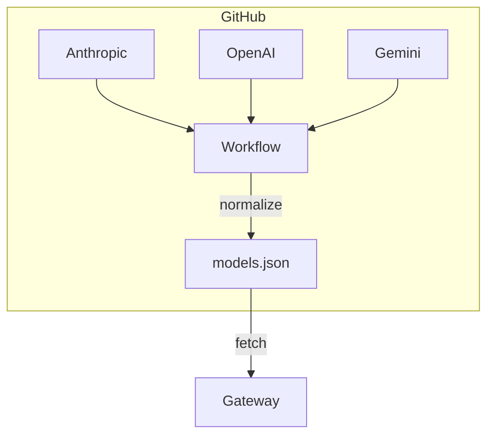
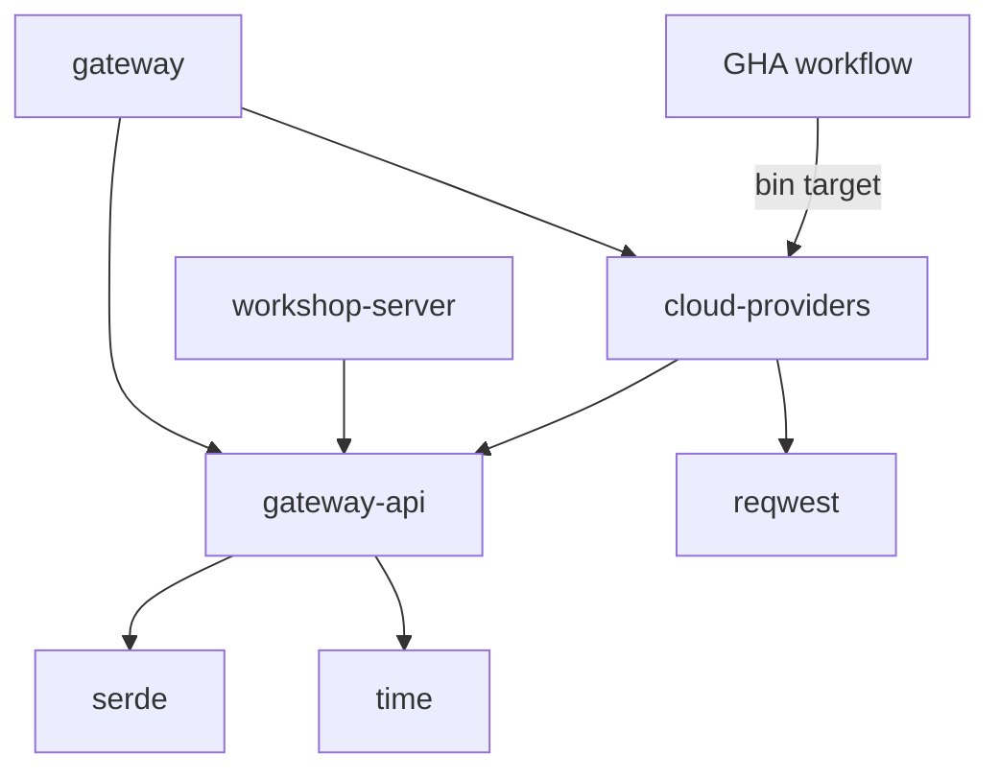

# Provider Model Sheets

<product-contract>

## Product Requirements

The Gateway today knows a remote model only through hand-written `[[model]]` entries in `gateway.toml` (`crates/gateway-config/src/config.rs`, `ModelConfig`). Closed-weight providers change their lineups constantly, and each provider's model-list endpoint speaks its own dialect of auth, pagination, and response shape. This plan adds a single aggregation point: a scheduled GitHub workflow builds a machine-readable models sheet from every vendor's model-list endpoint and publishes it as a release artifact, and a provider-descriptor crate linked into the Gateway lets the Gateway understand each provider's offerings and normalize them into model choices for the config UI.

- Problem and users: model metadata for closed-weight providers is hand-maintained in configuration and goes stale; each provider's model-list API differs in auth, pagination, and response shape. Users are Gateway operators picking models in the config UI, and downstream hosts - Workshop, the PromptForge Agent Harness (not yet written), and the PromptForge CLI (not yet written) - which consume models through the Gateway's normal catalog.
- Goals:
  - A types-only crate `shared-gateway-api` holding the normalized sheet schema structs, consumed by the provider crate, the Gateway, and Workshop server (UI elements such as the model dropdown).
  - A crate `shared-cloud-providers` with one Rust file per provider (`anthropic.rs`, `openai.rs`, `gemini.rs`, `moonshot.rs`, and so on), each defining a public `Provider` descriptor, plus the fetch/normalize logic and the sheet-building binary.
  - A GitHub workflow, triggerable manually and on a schedule, that calls every provider's model-list endpoint with keys held in GitHub secrets and builds the models sheet.
  - The sheet published as a release artifact in a separate aggregation repo, so any Gateway downloads it for free with no provider key of its own.
  - (Phase 2) The Gateway consumes the sheet and normalizes provider models into choices for the config UI; hosts consume the normalized models through the Gateway as usual.
- Non-goals: the Agent Harness and CLI themselves; local (GGUF) model metadata; changes to the Gateway's routing or `[[model]]` resolution semantics. Phase 1 is infrastructure only: no UI changes and no Gateway sheet-consumption - the user's words: "I don't want anything changed in the UI yet. First I want to get the infrastructure in place and reliable to build the table." The type hoist IS in phase 1 scope: the user's words: "I still want to relocate the gateway types to shared-gateway-api."
- Success criteria: the workflow produces a current, schema-valid sheet on demand and on schedule; a failed provider fetch propagates last-known-good data; adding a new provider is one new Rust file plus one GitHub secret. (Phase 2 criterion, not phase 1: a Gateway with no provider keys boots against the release artifact and presents normalized provider models in the config UI.)
- Constraints: provider API keys live only in GitHub secrets and never ship in the artifact or the crate; the artifact is safe to fetch unauthenticated; the crate follows workspace conventions (edition 2024, workspace lints, no file over 500 lines).
- Settled questions (2026-09-14):
  - Raw payload embedding: no. Model entries carry normalized fields only; the artifact stays small, schema-stable, and free of provider-specific shapes leaking into consumers.
  - First-iteration scope: the Prime tier only - Anthropic, OpenAI, Google Gemini, xAI, DeepSeek, Alibaba Qwen, Moonshot AI, Meta, ElevenLabs, Deepgram. Subprime providers, Niche static lists, and Aggregators follow once the Prime pipeline is proven. The schema and `build_sheet` keep `static` slice support, but no Niche provider files ship in v1.
  - Schedule cadence: weekly, plus manual dispatch.

### Provider Landscape

Verified against official documentation on 2026-09-14. Response richness matters because it decides how much of the normalized schema each provider file can fill from the list endpoint alone. Starter-list dedupes: Grok is xAI, Gemini is Google DeepMind, Kimi is Moonshot AI.

American closed-weight:

- Anthropic - `https://api.anthropic.com`, `GET /v1/models`, `x-api-key` header + required `anthropic-version` header. Rich: capabilities object, token limits, display name. Cursor pagination. Docs: docs.anthropic.com/en/api/models-list
- OpenAI - `https://api.openai.com/v1`, `GET /v1/models`, Bearer. IDs only (`id`, `created`, `owned_by`); no pagination, no limits or capabilities. Docs: developers.openai.com/api/reference
- Google Gemini - `https://generativelanguage.googleapis.com`, `GET /v1beta/models`, `?key=` query param or `x-goog-api-key` header. Verified 2026-09-14: 403 without a key. Richest: `inputTokenLimit`, `outputTokenLimit`, `supportedGenerationMethods`, thinking flag. `pageToken` pagination. Docs: ai.google.dev/api/models
- xAI - `https://api.x.ai`, `GET /v1/models`, Bearer. OpenAI-shaped but extended: `aliases`, `context_length`, per-token pricing. No pagination. Docs: docs.x.ai
- Amazon Nova (Bedrock) - `https://bedrock.{region}.amazonaws.com`, `GET /foundation-models`, AWS SigV4 (no bearer). Modalities and lifecycle, no context window. Valid `{region}` values (35, control-plane endpoints table, docs.aws.amazon.com/general/latest/gr/bedrock.html): us-east-1, us-east-2, us-west-1, us-west-2, af-south-1, ap-east-2, ap-northeast-1, ap-northeast-2, ap-northeast-3, ap-south-1, ap-south-2, ap-southeast-1 through ap-southeast-7, ca-central-1, ca-west-1, eu-central-1, eu-central-2, eu-north-1, eu-south-1, eu-south-2, eu-west-1, eu-west-2, eu-west-3, il-central-1, me-central-1, me-south-1, mx-central-1, sa-east-1, us-gov-east-1, us-gov-west-1. The Provider descriptor needs a region field (or a pinned default region) for this one. Docs: docs.aws.amazon.com/bedrock
- Microsoft (Azure AI Foundry) - per-resource URL, no global endpoint; `GET {endpoint}/openai/v1/models`, `api-key` header or Bearer. Basic info only. Docs: learn.microsoft.com/rest/api/aifoundry
- Meta - first-party Meta Model API exists: `https://api.meta.ai/v1`, `GET /v1/models`, Bearer, OpenAI-compatible. Response schema not fully enumerated. Docs: ai.developer.meta.com/docs

Chinese providers:

- Moonshot AI (Kimi) - both weights. `https://api.moonshot.ai/v1` global, `https://api.moonshot.cn/v1` China (keys not interchangeable). `GET /v1/models`, Bearer. Enriched: `context_length`, image/video input and reasoning flags. No pagination.
- DeepSeek - open-weight. `https://api.deepseek.com`, `GET /models`, Bearer. IDs only.
- Alibaba Qwen (DashScope / Model Studio) - both weights. `https://dashscope.aliyuncs.com/compatible-mode/v1`, `GET .../models`, Bearer. Plain OpenAI shape on the compatible endpoint; the native `/api/v1/models` adds pagination, pricing, and context length.
- Zhipu AI (GLM) - both weights. `https://open.bigmodel.cn/api/paas/v4`, Bearer. Flag: no officially documented model-list endpoint; catalog lives on a docs page.
- MiniMax - both weights. `https://api.minimax.io/v1` global, `https://api.minimaxi.com/v1` China. `GET /v1/models`, Bearer. Plain OpenAI shape.
- ByteDance Doubao (Volcano Ark) - closed. `https://ark.cn-beijing.volces.com/api/v3`, Bearer. Flag: no API-key-callable model list; the catalog endpoint needs control-plane AK/SK signing.
- Baidu (ERNIE / Qianfan) - both weights. `https://qianfan.baidubce.com/v2`, `GET /v2/models`, Bearer. Richest of the set: `context_length`, `max_tokens`, modality, pricing.
- StepFun - both weights. `https://api.stepfun.com/v1` (CN) / `.ai` (intl). `GET /v1/models`, Bearer. Plain OpenAI shape.
- iFlytek Spark - closed. Flag: no documented model-list endpoint; IDs enumerated only on doc pages.
- 01.AI Yi - pivoted away from foundation models in 2025; platform longevity uncertain. Exclude from v1.

European and other:

- Mistral AI - France, both weights. `https://api.mistral.ai`, `GET /v1/models`, Bearer (401 without, verified 2026-09-14). Rich: capabilities (chat/fim/function_calling/vision), `max_context_length`, `aliases`, `deprecation`. No pagination.
- Cohere - Canada, both weights. `https://api.cohere.com`, `GET /v1/models`, Bearer (401 without, verified 2026-09-14). `context_length`, `endpoints`, `features`; token pagination.
- AI21 Labs - Israel, both weights. Flag: no documented model-list endpoint; IDs documented statically.
- Perplexity (Sonar) - US, closed. `https://api.perplexity.ai`, `GET /v1/models`. Verified 2026-09-14: listing requires auth (401 without a key); response shape not officially documented. Canonical chat is `POST /v1/sonar`; `/chat/completions` is an alias.
- NVIDIA (build.nvidia.com) - US, both weights. `https://integrate.api.nvidia.com/v1`, `GET /v1/models`. Verified live 2026-09-14: no auth required for listing, full model list returned. IDs only, namespaced (`meta/llama-3.1-8b-instruct`); `created` is a constant placeholder on every entry. Rerank/retrieval use separate base `ai.api.nvidia.com/v1`.

Media providers (verified 2026-09-14):

Image generation:

- Midjourney - excluded: no official public API exists (enterprise API is application-stage only; every "Midjourney API" on the market is a ToS-violating wrapper).
- Kling AI (Kuaishou; the "Kang.ai" the user mentioned) - `https://api.klingai.com`, JWT (HS256) from an AccessKey/SecretKey pair, static model IDs (Kolors family, `kling-v1` through `kling-v3`).
- Real model-list endpoints: Google (`GET /v1beta/models`), OpenAI (`GET /v1/models`), Leonardo (`GET /platformModels`). Partial: Stability (`GET /v1/engines/list`, legacy v1 only); Ideogram and Adobe list custom models only.
- Static IDs only: Black Forest Labs (`x-key` header), Recraft, Kling, ByteDance Seedream (Ark), Alibaba Wan (DashScope), xAI image (unverified), Runway (Bearer + version header), Luma.
- Deprecation landmines: Google Imagen 4 shut down 2026-08-17 (succeeded by Gemini 3.1 Flash Image); OpenAI gpt-image-1.x sunsets 2026-12-01 (use gpt-image-2); DALL-E already gone.

Speech to text:

- Real model-list endpoints: Deepgram (`GET /v1/models`, rich: languages, version, batch/streaming flags; `Authorization: Token` prefix), Groq (`GET /openai/v1/models`), Soniox (`GET /v1/models` with per-model languages), Azure Speech (`GET /speechtotext/v3.2/models/base`).
- Static IDs: AssemblyAI, ElevenLabs Scribe, Gladia, Rev.ai, AWS Transcribe, Cartesia. Google STT exposes capability discovery via its Locations API instead; Speechmatics has `GET /v1/discovery/features`.

Text to speech:

- PlayHT - excluded: acquired by Meta, API offline since 2025-07, platform sunset 2025-12-31.
- Real model-list endpoints: ElevenLabs (`GET /v1/models`, rich: languages, capabilities, rates; `xi-api-key` header), Deepgram (`GET /v1/models`, TTS array with languages and tags).
- Static IDs: Cartesia (also requires a `Cartesia-Version` date header), Murf, OpenAI, Google, Azure, Amazon Polly, MiniMax, Hume, Resemble. Voice-list endpoints are near-universal even where model lists are absent.

Aggregators (not providers, but relevant):

- OpenRouter - `GET https://openrouter.ai/api/v1/models`, no auth for listing. Verified live 2026-09-14: 718 KB payload; each model has `id`, `canonical_slug`, `name`, `created`, `description`, `context_length`, `architecture` (modality, input/output modalities, tokenizer), `pricing` (prompt/completion USD per token, cache read), `top_provider` (`max_completion_tokens`, `is_moderated`), `supported_parameters`, plus server-side filtering and pagination. A viable complement or fallback source.
- SiliconFlow - the major Chinese aggregator; one OpenAI-compatible endpoint across most Chinese providers.

Design consequences: auth variance is confirmed across a dozen shapes (`x-api-key`, Bearer, `?key=` query param, `api-key` header, SigV4, `Token` prefix, `xi-api-key`, `x-gladia-key`, `Ocp-Apim-Subscription-Key`, JWT-from-AK/SK, OAuth2, Basic), which validates the private-variance encapsulation. Media providers are mostly Niche by the functional definition: outside Deepgram, ElevenLabs, Groq, Soniox, Azure Speech, Google, and OpenAI, media catalogs are static ID lists, and TTS voice discovery is near-universal even where model discovery is absent. (The richness split and field-availability constraints live with the schema in Technical Design.)

### Provider Signup

The signup checklist, one table per tier. Endpoint facts are verified from the 2026-09-14 survey; console URLs are from knowledge, not re-verified. Tier assignment is functional: Prime and Subprime have a working key-callable model-list endpoint, Niche do not (their sheet slices are static lists compiled into the binary, so no key is needed for aggregation), Aggregators list many providers' models through one endpoint.

Prime:

| Name | URL | Notes |
| --- | --- | --- |
| Anthropic | https://console.anthropic.com/ | Keys under Settings; usage credits need a card, listing is free |
| OpenAI | https://platform.openai.com/api-keys | Billing setup required before keys work |
| Google Gemini | https://aistudio.google.com/apikey | Free tier, no card needed |
| xAI | https://console.x.ai/ | Paid credits |
| DeepSeek | https://platform.deepseek.com/ | Prepaid balance, inexpensive |
| Alibaba Qwen | https://modelstudio.console.alibabacloud.com/ | Use the international console; the China console may require real-name verification |
| Moonshot AI | https://platform.moonshot.ai/ | Global variant; .ai and .cn keys are not interchangeable |
| Meta | https://ai.developer.meta.com/ | Newer first-party program |

Subprime:

| Name | URL | Notes |
| --- | --- | --- |
| Mistral AI | https://console.mistral.ai/ | Free experiment tier |
| Cohere | https://dashboard.cohere.com/ | Trial keys free, rate-limited |
| Baidu (Qianfan) | https://qianfan.cloud.baidu.com/ | Chinese console; real-name verification likely |
| MiniMax | https://platform.minimax.io/ | Global variant (.io, not .com) |
| StepFun | https://platform.stepfun.ai/ | International variant |
| Amazon Nova (Bedrock) | https://console.aws.amazon.com/bedrock/ | Heaviest setup: AWS account, IAM credentials, SigV4, pick a region |
| Microsoft Foundry | https://ai.azure.com/ | Azure subscription plus a deployed resource; no global endpoint |
| NVIDIA | https://build.nvidia.com/ | No key needed for model listing (verified); key only for inference |

Niche (no key needed for the sheet; static lists ship in the binary):

| Name | URL | Notes |
| --- | --- | --- |
| Zhipu AI (GLM) | https://open.bigmodel.cn/ | No officially documented model-list endpoint |
| ByteDance Doubao | https://www.volcengine.com/ | Model catalog needs control-plane AK/SK signing |
| iFlytek Spark | https://www.xfyun.cn/ | No documented model-list endpoint |
| AI21 Labs | https://studio.ai21.com/ | No documented model-list endpoint |
| Perplexity | https://www.perplexity.ai/settings/api | List endpoint exists but requires auth (401 verified); shape undocumented |

Aggregator:

| Name | URL | Notes |
| --- | --- | --- |
| OpenRouter | https://openrouter.ai/keys | No key needed for model listing; key only for inference |
| SiliconFlow | https://cloud.siliconflow.cn/ | Chinese aggregator; one endpoint across most Chinese providers |

Suggested signup order:

1. Free and instant: Google Gemini, NVIDIA, Mistral, Cohere (no card, keys in minutes). OpenRouter needs nothing for listing.
2. Card-required majors: Anthropic, OpenAI, xAI, DeepSeek, Meta.
3. Heavy setup: Amazon Bedrock (AWS account, IAM, SigV4, region choice), Microsoft Foundry (Azure subscription plus a deployed resource).
4. Chinese consoles last: Alibaba Model Studio international, Moonshot global, MiniMax global, StepFun international, Baidu Qianfan (real-name verification overhead).
5. Niche providers: skip entirely - their sheet slices are static lists compiled into the binary.

### Media Signup

Image, speech-to-text, and text-to-speech providers. Same caveats as above: endpoint facts verified 2026-09-14, console URLs from knowledge. Providers already covered by a chat-provider signup row (OpenAI, Google, Azure, MiniMax, xAI, Alibaba) are omitted - their media models ride the same key.

Image generation:

| Name | URL | Notes |
| --- | --- | --- |
| Leonardo | https://leonardo.ai/ | Subprime; real list endpoint (`GET /platformModels`) |
| Kling AI | https://klingai.com/ | Niche; static list; JWT from an AccessKey/SecretKey pair |
| Black Forest Labs | https://bfl.ai/ | Niche; static list; `x-key` header |
| Recraft | https://www.recraft.ai/ | Niche; static list |
| Ideogram | https://ideogram.ai/ | Niche; lists custom models only |
| Adobe Firefly | https://developer.adobe.com/firefly-services/ | Niche; OAuth client credentials; custom models only |
| Runway | https://runwayml.com/ | Niche; Bearer plus a version header |
| Luma | https://lumalabs.ai/ | Niche; static list |
| Stability AI | https://platform.stability.ai/ | Niche; list endpoint is legacy v1 only |

Speech to text:

| Name | URL | Notes |
| --- | --- | --- |
| ElevenLabs (Scribe) | https://elevenlabs.io/ | Prime; one key covers TTS and STT |
| Deepgram | https://console.deepgram.com/ | Prime; rich list endpoint; `Authorization: Token` prefix |
| Groq | https://console.groq.com/ | Subprime; OpenAI-compatible list endpoint; doubles as a fast chat provider |
| Soniox | https://console.soniox.com/ | Subprime; list endpoint with per-model languages |
| AssemblyAI | https://www.assemblyai.com/dashboard | Niche; static list |
| Speechmatics | https://www.speechmatics.com/ | Niche; capability-discovery endpoint, no model list |
| Gladia | https://www.gladia.io/ | Niche; static list; `x-gladia-key` header |
| Rev.ai | https://www.rev.ai/ | Niche; static list |
| AWS Transcribe | https://console.aws.amazon.com/ | Niche; covered by the Bedrock/AWS signup |
| Cartesia | https://play.cartesia.ai/ | Niche; static list; one key covers TTS too |

Text to speech:

| Name | URL | Notes |
| --- | --- | --- |
| ElevenLabs | (see STT table) | Prime; the TTS category leader; rich list endpoint |
| Deepgram | (see STT table) | Prime; TTS array in the same list endpoint |
| Cartesia | (see STT table) | Niche; also requires a `Cartesia-Version` date header |
| Murf | https://murf.ai/ | Niche; static list; `api-key` header |
| Hume | https://www.hume.ai/ | Niche; static list; `X-Hume-Api-Key` header |
| Resemble | https://app.resemble.ai/ | Niche; model auto-selected from `voice_uuid` |
| Amazon Polly | https://console.aws.amazon.com/ | Niche; covered by the Bedrock/AWS signup |
| Inworld | https://inworld.ai/ | Niche; list endpoint referenced in docs but unverified |

## Functional Specification

Two pipelines share one vocabulary. The build pipeline (workflow) turns provider list-endpoint responses into the sheet; the consumption pipeline (Gateway) turns the sheet into catalog choices. `shared-gateway-api` is the shared vocabulary between them.

- Actors and workflows:
  - The workflow (phase 1): on manual dispatch or schedule, compile the crate's binary and run it with provider keys injected from secrets as environment variables; the binary downloads the previous release's sheet (if any), calls each provider's model-list endpoint, normalizes the responses, propagates previous slices for failed fetches, and writes the merged sheet; the workflow publishes it as the new release artifact.
  - The Gateway (phase 2, deferred): fetch the sheet from the release artifact, cache it, and re-serve the normalized catalog on its own route, so hosts consume it from the Gateway rather than fetching from GitHub themselves; the config UI's model choices derive from it.
  - Hosts (Workshop now; Agent Harness and CLI later): consume models through the Gateway's existing catalog surface (`crates/gateway/src/model_info.rs`, `CatalogModelsResponse`). (Phase 2, deferred: Workshop server additionally links `shared-gateway-api` directly for UI elements such as the model dropdown.)
- Inputs and outputs: provider list-endpoint JSON in; one `models.json` sheet out, wrapped in an envelope with `schema_version`, `generated_at` (RFC 3339), and a `providers` map keyed by provider name. (Phase 2: Gateway config-UI model choices derived from the sheet.)
- States and validation: each provider entry has a `status` of `ok` (fetched fresh this run), `stale` (fetch failed; the previous sheet's slice was propagated verbatim with its original `fetched_at`), `unavailable` (fetch failed and no previous sheet existed; `models` is empty), or `static` (Niche provider with no list endpoint; a hand-maintained model list compiled into the binary, no fetch attempted).
- Errors and recovery: a failed provider fetch never fails the workflow run and never drops data: the previous sheet's slice for that provider is propagated with `status: "stale"`, preserving its original `fetched_at` so consumers can see the age of the data. A first-ever run with a failed fetch records `unavailable` with an empty model list.
- Security and privacy behavior: keys exist only as GitHub secrets injected into the workflow environment; the sheet and the crate contain no secrets.
- Acceptance criteria (phase 1): `cargo run -p shared-cloud-providers` locally with keys in the environment produces a schema-valid `models.json`; a provider with a missing key or failed fetch appears as `stale` (with its previous slice) or `unavailable`, never as a build failure; a Niche provider emits its static list with `status: "static"`; the hoisted types compile at their old paths via re-export with no downstream call-site changes. (The workflow dispatch and release-publication criteria move with the workflow to the separate aggregation repo.)

</product-contract>
<implementation-contract>

## Technical Design

The central design fact is the separation between the public descriptor and the private variance. Each provider file exposes a uniform `Provider` struct; everything provider-specific stays inside the file.



Dependency map:



`shared-gateway-api` is pure vocabulary (serde, time; no workspace dependencies, per the `shared-*` substrate rule). `shared-cloud-providers` adds reqwest behind the injected-client seam. The Gateway links both; Workshop server links only the schema crate; the workflow consumes only the `bin` target.

- Architecture:
  - Two new workspace crates. `shared-gateway-api`: types-only - the sheet envelope, per-provider entry, and per-model entry structs; no product-crate dependencies, mirroring the `shared-promptforge-api` precedent. `shared-cloud-providers`: the `Provider` descriptors, the provider registry, and the per-provider fetch and normalization logic, doing double duty as a `lib` and a thin `bin` (read keys from the environment, fetch the previous sheet, run every provider, write `models.json`) that the GitHub workflow compiles and runs - and that anyone can compile and run locally for testing and sheet building. The user's rationale: "it can also be compiled and run locally for testing and building."
  - Consumers: `shared-cloud-providers` depends on `shared-gateway-api`; the Gateway links both (schema for sheet parsing, provider registry for provider metadata); Workshop server links `shared-gateway-api` for UI elements such as the model dropdown. The workspace dependency rules force the schema into `shared-*`: `workshop-*` crates may never depend on `gateway-*` crates.
  - One Rust file per provider in `shared-cloud-providers`: `anthropic.rs`, `openai.rs`, `gemini.rs`, `moonshot.rs`, etc.
  - Each file defines a public `Provider` descriptor: provider name, tier, the environment-variable name of its API key (matching the GitHub secret name), and the default base URL. Tier is a curated product opinion, not a vendor fact: `prime`, `subprime`, `niche`, `aggregator`. Bedrock additionally needs a region (35 valid values, listed in the Provider Landscape) or a pinned default.
  - The variances - auth header shape (`x-api-key` vs `Authorization: Bearer` vs query param), pagination, response field names, capability mapping - are private to each provider file.
  - HTTP is needed on both ends (provider endpoints in the binary, sheet download in the Gateway), so `shared-cloud-providers` takes an injected `reqwest::Client` rather than owning one. The Gateway has no shared client to hand it - each upstream privately builds three role-specific clients via `gateway-protocol/src/http_util.rs` (`bounded_client`, `streaming_client`, `audio_streaming_client`; see `gateway-protocol/src/upstream.rs` lines 197-243) - so the Gateway constructs one purpose-built bounded client for sheet downloads from the same factory.
  - Because the fetch and normalization logic lives in the `lib`, it is unit-testable offline against recorded fixture JSON; live endpoints are exercised only by manual or scheduled runs of the binary.
- Modules and interfaces: `shared-gateway-api` is the canonical home of the hoisted model-metadata types - `Capabilities`, `ModelInfo`, `ModelKind`, `ThinkingMode`, moved out of `gateway-config` and `gateway-protocol`, which re-import them - plus the sheet schema types (envelope, per-provider entry, per-model entry). `shared-cloud-providers` exports the `Provider` descriptor type and the registry of known providers, so the workflow binary, the Gateway, and Workshop server share one definition. The hoisted inventory is the "what a model can do" half of the existing config structs, a split the `Capabilities` doc comment (`crates/gateway-config/src/config.rs` lines 569-575) already states explicitly: `kind`, `description`, `context`, `thinking`, and the `Capabilities` fields (`max_output`, `default_temperature`, `images`, `parallel_tool_calls`, `effort_levels`, `default_effort`, `adaptive_thinking`, `voices`); the "how the gateway reaches it" half (`upstream`, `endpoints`, `source`, `sha256`, `dominion`, and the local-model tuning fields) stays put.
- Sheet schema: a single `models.json`. Field names mirror the Gateway's existing `Capabilities` vocabulary (`crates/gateway-config/src/config.rs`: `max_output`, `images`, `effort_levels`, `default_effort`) wherever concepts overlap, so normalizing a sheet entry into a `ModelConfig` is mechanical. The schema below is the union of what the surveyed list endpoints actually report (see Provider Landscape and the 2026-09-14 response-shape extractions):

```json
{
  "schema_version": 1,
  "generated_at": "2026-09-14T13:00:00Z",
  "providers": {
    "anthropic": {
      "display_name": "Anthropic",
      "tier": "prime",
      "status": "ok",
      "fetched_at": "2026-09-14T13:00:00Z",
      "models": [
        {
          "id": "claude-opus-5",
          "display_name": "Claude Opus 5",
          "released_at": "2026-07-24",
          "context_window": 1000000,
          "max_output": 128000,
          "images": true,
          "pdf_input": true,
          "video_input": false,
          "audio_input": false,
          "batch": true,
          "citations": true,
          "code_execution": true,
          "structured_outputs": true,
          "tool_calling": true,
          "thinking": { "supported": true, "enabled": false, "adaptive": true },
          "effort_levels": ["low", "medium", "high", "xhigh", "max"],
          "default_effort": "high",
          "pricing": { "currency": "USD", "prompt_per_mtok": 5.0, "completion_per_mtok": 25.0 },
          "deprecation": null
        }
      ]
    }
  }
}
```

  - Envelope: `schema_version` (integer, bumped on breaking change), `generated_at` (RFC 3339, always this run's time), `providers` map keyed by provider name.
  - Provider entry: `status` (`ok` / `stale` / `unavailable` / `static`), `fetched_at` (RFC 3339; preserved from the original fetch when `stale`; omitted when `static`), `models` array.
  - Model entry: `id` (the upstream slug), `display_name`, `released_at` (optional - not every provider reports it), `context_window` (optional - the IDs-only providers omit it), `max_output` (optional), modality booleans (`images`, `pdf_input`, `video_input`, `audio_input`), capability booleans (`batch`, `citations`, `code_execution`, `structured_outputs`, `tool_calling`), a `thinking` object (`supported` = any reasoning, `enabled` = manual budget mode, `adaptive` = model-chosen), `effort_levels`, `default_effort` (optional), `pricing` (optional), `deprecation` (optional or null).
- Normalization principle: normalize the knob, never the settings. `effort_levels` is a list of the provider's own level names as strings - the observed union across all surveyed providers is exactly `none`, `minimal`, `low`, `medium`, `high`, `xhigh`, `max` - and no cross-provider ordinal scale is ever invented. Kimi's `["low","high","max"]` and Anthropic's five levels both fit without mapping. The same principle applies to `thinking`: Anthropic's thinking types collapse into the `enabled`/`adaptive` booleans; every other provider's reasoning flag collapses into `supported`.
- Field availability constraint (verified 2026-09-14 against official docs): only Anthropic and the OpenRouter aggregate expose effort levels in the list response; Kimi's `low`/`high`/`max` live in its chat-request docs, not its list endpoint. Effort data for other providers is statically curated in the provider file or omitted. Pricing appears natively in xAI, DashScope-native, Baidu, Perplexity's router, and OpenRouter responses - normalized to per-million-token units with an explicit `currency` field, because Baidu reports CNY per 1k tokens and xAI reports USD cents per 100M. Deprecation appears only in Bedrock (`modelLifecycle`), Mistral (`deprecation` + replacement), Cohere (`is_deprecated`), and OpenRouter (`expiration_date`).
- Workflow propagation algorithm: download the previous release's `models.json` before building; per provider, a successful fetch writes a fresh slice (`ok`, `fetched_at` = now) and a failed fetch copies the previous slice verbatim with `status` rewritten to `stale`; a provider with no previous slice and a failed fetch records `unavailable` with an empty `models` array.
- Public Rust declarations. `shared-gateway-api` (types-only; the hoisted `Capabilities`, `ModelInfo`, `ModelKind`, and `ThinkingMode` join these at the same canonical home):

```rust
use std::collections::BTreeMap;
use serde::{Deserialize, Serialize};
use time::{Date, OffsetDateTime};

/// The sheet envelope: one atomic snapshot of every provider's models.
#[derive(Debug, Clone, Serialize, Deserialize)]
pub struct Sheet {
    pub schema_version: u32,
    /// RFC 3339; always this run's time.
    pub generated_at: OffsetDateTime,
    /// Keyed by provider name, e.g. "anthropic".
    pub providers: BTreeMap<String, ProviderSlice>,
}

/// One provider's slice of the sheet. Self-describing: the descriptor's
/// public fields are copied in at build time so consumers can render a
/// provider dropdown from the sheet alone.
#[derive(Debug, Clone, Serialize, Deserialize)]
pub struct ProviderSlice {
    pub display_name: String,
    pub tier: Tier,
    pub status: SliceStatus,
    /// Last fresh fetch; absent for `static` slices.
    pub fetched_at: Option<OffsetDateTime>,
    pub models: Vec<ModelEntry>,
}

/// Curated product opinion, not a vendor fact.
#[derive(Debug, Clone, Copy, PartialEq, Eq, Serialize, Deserialize)]
#[serde(rename_all = "lowercase")]
pub enum Tier {
    Prime,
    Subprime,
    Niche,
    Aggregator,
}

#[derive(Debug, Clone, Copy, PartialEq, Eq, Serialize, Deserialize)]
#[serde(rename_all = "lowercase")]
pub enum SliceStatus {
    Ok,
    Stale,
    Unavailable,
    Static,
}

/// One normalized model entry.
#[derive(Debug, Clone, Serialize, Deserialize)]
pub struct ModelEntry {
    pub id: String,
    pub display_name: String,
    /// The workload: chat, embedding, classifier, speech (TTS),
    /// transcription (STT), image, video.
    pub kind: ModelKind,
    pub released_at: Option<Date>,
    pub context_window: Option<u32>,
    pub max_output: Option<u32>,
    // Modalities.
    pub images: bool,
    pub pdf_input: bool,
    pub video_input: bool,
    pub audio_input: bool,
    // Capabilities.
    pub batch: bool,
    pub citations: bool,
    pub code_execution: bool,
    pub structured_outputs: bool,
    pub tool_calling: bool,
    pub thinking: Thinking,
    /// The provider's own level names, e.g. ["low", "high", "max"];
    /// never mapped to a cross-provider scale.
    pub effort_levels: Vec<String>,
    pub default_effort: Option<String>,
    pub pricing: Option<Pricing>,
    pub deprecation: Option<Deprecation>,
}

#[derive(Debug, Clone, Copy, Default, Serialize, Deserialize)]
pub struct Thinking {
    /// Any reasoning capability at all.
    pub supported: bool,
    /// Manual budget mode (Anthropic "enabled").
    pub enabled: bool,
    /// Model-chosen thinking depth.
    pub adaptive: bool,
}

#[derive(Debug, Clone, Serialize, Deserialize)]
pub struct Pricing {
    /// ISO 4217, e.g. "USD", "CNY".
    pub currency: String,
    pub prompt_per_mtok: f64,
    pub completion_per_mtok: f64,
}

#[derive(Debug, Clone, Serialize, Deserialize)]
pub struct Deprecation {
    pub status: String,
    pub date: Option<Date>,
    pub replacement: Option<String>,
}
```

  `shared-cloud-providers` (descriptors, registry, fetch seam; the `bin` target is a thin `main` over these):

```rust
/// The public descriptor for one provider. Everything else about the
/// provider - auth header shape, pagination, response mapping - is
/// private to its file.
pub struct Provider {
    /// Registry key, e.g. "anthropic".
    pub name: &'static str,
    /// UI-facing name, e.g. "Anthropic".
    pub display_name: &'static str,
    pub tier: shared_gateway_api::Tier,
    /// Environment variable the API key arrives under; matches the
    /// GitHub secret name.
    pub key_env: &'static str,
    /// Default base URL for the model-list endpoint.
    pub base_url: &'static str,
}

/// Every known provider.
pub fn providers() -> &'static [Provider];

/// Fetch and normalize one provider's model list; the per-provider
/// variance lives behind this seam. The client is injected by the
/// caller (the Gateway's bounded client, or the binary's own).
pub async fn fetch_models(
    client: &reqwest::Client,
    provider: &Provider,
    key: &str,
) -> Result<Vec<shared_gateway_api::ModelEntry>, FetchError>;

/// Build the complete sheet: fetch every provider, propagate
/// last-known-good slices from `previous` for failed fetches, emit
/// static slices for Niche providers, assemble the envelope. This is
/// the function the binary's `main` calls.
pub async fn build_sheet(
    client: &reqwest::Client,
    previous: Option<shared_gateway_api::Sheet>,
    keys: &dyn Fn(&Provider) -> Option<String>,
) -> shared_gateway_api::Sheet;

/// Download and parse the current sheet from the release artifact.
/// This is the function the Gateway calls.
pub async fn fetch_sheet(
    client: &reqwest::Client,
    release_url: &str,
) -> Result<shared_gateway_api::Sheet, FetchError>;
```
- File and public API changes (phase 1): two new crates (`shared-gateway-api`, `shared-cloud-providers`); the hoist moves `Capabilities`, `ModelInfo`, `ModelKind`, and `ThinkingMode` from `gateway-config`/`gateway-protocol` into `shared-gateway-api`, with re-exports at the old paths so downstream call sites compile unchanged. Nothing else in the existing crates is modified; the workflow file lives in a separate aggregation repo and is not this plan's execution scope. (Phase 2, deferred: the Gateway's sheet-consumption path and the config-UI integration; `ModelConfig`/`Routing`/catalog-wire questions get settled then.)
- Data, persistence, failure, security, and privacy constraints: the sheet is a versioned JSON artifact on a GitHub release in a separate aggregation repo; `BTreeMap` key ordering makes the emitted file byte-deterministic for clean diffs between runs. (Phase 2, unsettled: the Gateway's fetch-and-cache behavior - startup fetch, TTL, offline fallback to a vendored copy.)

</implementation-contract>
<verification-contract>

## Testing Plan

The fetch and normalization logic lives in the `shared-cloud-providers` lib precisely so it is testable offline; live endpoints are exercised only by manual or scheduled binary runs.

- Unit: each provider file's normalization is tested against recorded fixture JSON (the three live payloads captured 2026-09-14 - Anthropic, OpenRouter, NVIDIA - seed the fixture set; documented example responses from official docs cover the rest); sheet schema round-trip tests (serialize, parse, compare); propagation tests (failed fetch with a previous sheet yields `stale` with preserved `fetched_at`; failed fetch without one yields `unavailable`; Niche providers yield `static`); the hoist is proven by the workspace compiling with re-exports and no call-site changes.
- Integration and end-to-end: a local run of the binary against recorded fixtures produces a schema-valid `models.json`. (A manual workflow dispatch producing and publishing the real artifact is verified in the separate aggregation repo.)
- Regression, security, and performance: no keys in the artifact or the crate (CI check: the sheet contains no secret material); existing gateway and workshop suites stay green through the hoist.
- Exit criteria: workspace nextest, doctests, clippy `-D warnings`, and `cargo fmt --all --check` green; a locally built `models.json` parses as a valid `Sheet`. (The published-artifact criterion moves with the workflow to the separate repo.)

</verification-contract>
<decision-record>

## Decision Record

- Decisions:
  - One Rust file per provider: the user's words - "I want each provider in its own rust file. anthropic.rs gemini.rs openai.rs moonshot.rs and so on."
  - The provider file defines a public descriptor struct named `Provider` with fields for the API-key environment-variable name and the default URL: the user's words - "the provider file defines the name of the API key, the default URL, basically there is a descriptor lets call it struct Provider."
  - The descriptor is public while the variances are private: the user's words - "the descriptor is public, while the variances are private - the variances are the little bullshit things that differ between providers."
  - The crate links into the Gateway and exists so the Gateway understands provider offerings and normalizes them into config-UI choices: the user's words - "the rust crate is to link into the gateway so the gateway can understand what each provider offers, and normalize its models into a set of chocies for the config ui."
  - Downstream consumers are Workshop, the PromptForge Agent Harness (not yet written), and the PromptForge CLI (not yet written), consuming models through the Gateway normally.
  - Aggregation runs in a GitHub workflow with provider keys in GitHub secrets, manually triggerable and scheduled, publishing the sheet as a release artifact: the user's original framing. The workflow and the release artifact live in a separate aggregation repo, not the promptforge repo: the operator's words - "leave the github part of step 10 out, we are going to use a separate repo" (2026-09-14). This supersedes the earlier decision to place both in the promptforge repo. This plan still delivers the binary the workflow compiles and runs, and the `key_env` contract its secrets must match.
  - The sheet is a single `models.json` holding everything, wrapped in an envelope with `schema_version`, `generated_at` (RFC 3339), and a `providers` map: the payload is tiny (~8 KB for Anthropic's 11 models; well under 1 MB at full provider coverage), every consumer wants the whole catalog, and one file gives one atomic snapshot with no version skew between provider slices.
  - A failed provider fetch propagates the previous sheet's data for that provider rather than degrading to a marker alone: the user's words - "what happens on a failed fetch? it should propagate the previous file's data." The propagated slice is marked `stale` and keeps its original `fetched_at`.
  - The sheet schema's field names mirror the Gateway's existing `Capabilities` vocabulary where concepts overlap, so sheet-to-`ModelConfig` normalization is mechanical rather than a second mapping layer.
  - The crate does double duty - `lib` linked into the Gateway, `bin` run by the workflow and locally: the user's words - "it should be both what is compiled in to the gateway, and also what is compiled and runs on GHA. Rationale: it can also be compiled and run locally for testing and building." One normalization codebase, no curl/jq divergence, and offline-testable fetch logic.
  - The provider crate is named `shared-cloud-providers`: the user's words - "lets call this new crate shared-cloud-providers."
  - The normalized model definition structs live in their own types-only crate, consumed by `shared-cloud-providers`, the Gateway, and Workshop server: the user's words - "there should be a shared crate with the normalized model definition structs, shared-cloud-providers should consume that and gateway should consume that. and probably workshop-server would consume it because it corresponds to UI elements such as the model dropdown." The workspace dependency rules force this: `workshop-*` may never depend on `gateway-*`, so any type the Workshop UI needs must live in `shared-*`.
  - That crate is named `shared-gateway-api`: the user's words - "it would be shared-gateway-api." The name follows the existing `shared-promptforge-api` precedent.
  - HTTP client injection: `shared-cloud-providers` takes an injected `reqwest::Client`; the Gateway constructs a purpose-built bounded client for sheet downloads via the existing `gateway-protocol/src/http_util.rs` factory, because no shared client exists (each upstream builds three role-specific clients privately; the only injection seam today is `#[cfg(test)]`).
  - Providers are tiered `prime` / `subprime` / `niche` / `aggregator`, a curated field on the `Provider` descriptor: the user's words - "the providers should be tiered: Prime, Underdog, Niche, Aggregator", with the second tier renamed per "rename underdog to Subprime." The definition is functional: Prime, Subprime, and Aggregator all have a working key-callable model-list endpoint that normalizes cleanly; Niche providers are listed but have no usable list endpoint.
  - Niche providers ship hand-maintained static model lists compiled into the binary, emitted with `status: "static"` and no fetch attempted: a curated static list is the extreme case of private variance, and the tier label tells the UI how fresh to expect the data to be.
  - Tier assignments (user-approved): Prime - Anthropic, OpenAI, Google Gemini, xAI, DeepSeek, Alibaba Qwen, Moonshot AI, Meta, ElevenLabs (TTS+STT), Deepgram (STT+TTS). Subprime - Mistral, Cohere, Baidu, MiniMax, StepFun, Amazon Nova (Bedrock), Microsoft Foundry, NVIDIA, Groq, Soniox, Azure Speech, Leonardo. Niche - Zhipu, ByteDance Doubao, iFlytek, AI21, Perplexity, plus the static-list media providers (Kling, Black Forest Labs, Recraft, Ideogram, Adobe Firefly, Runway, Luma, Stability, AssemblyAI, Speechmatics, Gladia, Rev.ai, AWS Transcribe, Cartesia, Murf, Hume, Resemble, Inworld). Aggregator - OpenRouter, SiliconFlow. The ElevenLabs and Deepgram Prime promotions are the user's call: "maybe 1 or 2 are Prime."
  - Normalize the knob, never the settings: `effort_levels` holds the provider's own level names as strings (observed union: `none`, `minimal`, `low`, `medium`, `high`, `xhigh`, `max`); no cross-provider ordinal scale is invented. This matches the existing `Capabilities.effort_levels: Vec<String>` in `crates/gateway-config/src/config.rs`.
  - The sheet includes optional `pricing` and `deprecation` fields, filled where the provider's list endpoint reports them (pricing: xAI, DashScope-native, Baidu, Perplexity router, OpenRouter; deprecation: Bedrock, Mistral, Cohere, OpenRouter). Pricing normalizes to per-million-token units with an explicit currency field.
  - Schema design does not require API keys: every provider's list-response shape was extracted from official documentation on 2026-09-14, and three live payloads (Anthropic, OpenRouter, NVIDIA) were verified directly. Keys are for ongoing freshness at workflow time, not for designing the normalizer.
  - Phase 1 is infrastructure only - crates, binary, workflow, artifact - with no UI changes and no Gateway consumption: the user's words - "I don't want anything changed in the UI yet. First I want to get the infrastructure in place and reliable to build the table."
  - The sheet covers media models, not just chat: image generation, speech-to-text, and text-to-speech providers are in scope per the user's directive. `ModelEntry` gains a `kind` field, and the hoisted `ModelKind` extends beyond its current chat/embedding/classifier/speech set with `transcription`, `image`, and `video` variants (the gateway's wire already knows `transcription` for STT catalog entries).
  - Midjourney and PlayHT are excluded: Midjourney has no official public API, and PlayHT is defunct (Meta acquisition, sunset 2025-12-31).
  - Hoist, not mirror: `Capabilities`, `ModelInfo`, `ModelKind`, and `ThinkingMode` move into `shared-gateway-api` as their canonical home, with `gateway-config` and `gateway-protocol` re-importing: the user's words - "hoist for sure." A mirrored parallel definition is exactly the parallel-truth debt the repo's debt-collector passes keep cleaning up.
  - `Provider` is a new concept, distinct from `EndpointConfig`: a case-insensitive grep for "provider" across `gateway-config`, `gateway-protocol`, and `gateway-routing` returns zero matches; what the TOML reflects is `EndpointConfig` (`crates/gateway-config/src/config.rs` lines 468-483), an operator-configured endpoint instance holding a live `Secret` and an optional dominion binding, covering any OpenAI-compatible backend. `Provider` is a static vendor descriptor in code - no secrets, no operator choices, just name, default base URL, and API-key env-var name. A future `[[endpoint]]` may reference a provider for its defaults, but that is unification potential, not identity.
  - `generated_at` is RFC 3339 with a literal `Z`: every consumer stack parses it natively; the workspace's existing `time` 0.3 dependency (`Cargo.toml`) needs only its `parsing` feature enabled.
  - Raw payload embedding: rejected (user decision 2026-09-14). Model entries carry normalized fields only; the artifact stays small and schema-stable, and provider-specific response shapes never leak into consumers.
  - First-iteration scope is the Prime tier only (user decision 2026-09-14): Anthropic, OpenAI, Google Gemini, xAI, DeepSeek, Alibaba Qwen, Moonshot AI, Meta, ElevenLabs, Deepgram. Subprime providers, Niche static lists, and Aggregators follow once the Prime pipeline is proven. The schema and `build_sheet` keep `static` slice support, but no Niche provider files ship in v1.
  - Schedule cadence: weekly cron plus manual dispatch (user decision 2026-09-14).
- Rejected alternatives:
  - The crate as CI-only tooling (a build binary run by the workflow): superseded by the user's correction that the crate links into the Gateway. The workflow running the crate's `bin` target was later settled by the double-duty decision.
  - Replacing the gateway's runtime types with the sheet types outright: rejected because the nullability regimes differ - the sheet is best-effort (`context_window: Option<u32>` because IDs-only providers omit it) while the runtime enforces validated configuration (`ModelConfig.context` is a required `u32`); `ModelInfo` is also a stable wire contract that Workshop's dropdown already parses. `ModelKind` is the exception: it is shared outright, and the sheet's `kind` field uses it. The user approved this reasoning: "this makes sense."
  - LLM inference over provider docs pages inside the publish workflow: rejected because the sheet is consumed as authoritative and LLM extraction introduces silent nondeterminism; a hallucinated context window is worse than an absent one. The fields it would fill are covered by static curation in the provider file.
  - Removing the `gateway` crate's lib target as extraneous (no downstream crate links it): rejected because the lib is the integration-test seam - the 30-file suite under `crates/gateway/tests/it/` imports the crate through its lib target, and the crate dev-depends on itself with the `test-fixtures` feature for exactly that reason. Revisit never.
  - Mirroring the model-metadata types in `shared-gateway-api` while leaving the originals in place: rejected in favor of hoisting; parallel definitions of `Capabilities` would drift. Revisit never.
- Assumptions, risks, and notes:
  - GitHub Actions runners have unrestricted outbound HTTPS; vendor endpoints are reachable from workflows with curl or any HTTP client.
  - The Anthropic `GET /v1/models` response shape (verified live 2026-09-14) contains `id`, `display_name`, `created_at`, `max_input_tokens`, `max_tokens`, and a `capabilities` object; it has no pricing and no deprecation status.
  - Anthropic's docs publish a keyless markdown mirror of the models overview page; other providers may lack an equivalent, which is part of the case for key-backed aggregation.
  - UI consumption evidence (2026-09-14 survey): the Workshop model dropdown uses only `id` and `description` (`crates/workshop-server/ui/src/services/protocol.ts` lines 25-34, `ui/src/ui/chrome/model-picker-trigger.ts` lines 69-99); the config UI's models view consumes `kind`, `description`, `context`, `thinking`, and the flattened capability keys (`crates/gateway-config-ui/ui/src/views/models-view.ts`, `ui/src/components/settings-registry.ts` lines 89-196). The hoisted field set covers both consumers.

### Deferred and Out of Scope

- Deferred: the aggregation workflow and release publication. They live in a separate aggregation repo, not the promptforge repo: the operator's words - "leave the github part of step 10 out, we are going to use a separate repo" (2026-09-14). This plan delivers everything the workflow needs: the `shared-cloud-providers` binary it compiles and runs, the `key_env` environment-variable contract its secrets must match, and the `models.json` output shape it publishes. Revisit when the separate repo is created.
- Deferred: the Gateway's sheet-consumption path (`fetch_sheet`, cache, config-UI model choices) and all UI integration. The user's words: "I don't want anything changed in the UI yet. First I want to get the infrastructure in place and reliable to build the table." Revisit when the workflow has produced reliable sheets. Phase 2 should name a gateway route that re-serves the normalized catalog, so hosts consume it from the Gateway rather than fetching from GitHub themselves.
- Deferred: an LLM-assisted curation bot that reads provider docs and opens PRs proposing updates to the static lists - LLM leverage with a human gate, keeping the published artifact deterministic. Revisit when the static lists need their first refresh.
- Deferred: Workshop server linking `shared-gateway-api` directly for the model dropdown. The dropdown already works through the Gateway's catalog; the direct link only matters when the UI wants richer per-provider data than the catalog carries. Revisit when the dropdown needs tier or per-provider metadata.
- Deferred: consolidating the gateway's per-upstream trio of role-specific `reqwest::Client`s into a shared client (reqwest's per-request `timeout()` makes it possible; the gain is marginal because connection pooling is per-host, and the SSE timeout behavior carries regression risk). Revisit when upstream client construction is otherwise touched.
- Deferred: a max-staleness eviction policy for `stale` provider slices, which keep advertising a model if a provider retires it while its fetches keep failing. Revisit when a provider retirement collides with a fetch outage.
- Out of scope: changes to the gateway's upstream client construction beyond the one bounded client built for sheet downloads.

</decision-record>
<project-survey>

## Project Survey

- Status: complete
- Build command: `cargo build` (builds only the gateway, the default member, on a fresh clone); the desktop app is explicit: `cargo build -p workshop`
- Focused test command pattern: `cargo nextest run -p <crate> <test-name-filter>`
- Component test command pattern: `cargo nextest run -p <crate>`
- Full-suite test command: `cargo nextest run --locked --workspace --exclude workshop --exclude workshop-server --all-features`, then doctests via `cargo test --workspace --exclude workshop --exclude workshop-server --all-features --doc`; workshop crates separately: `cargo nextest run --locked -p workshop -p workshop-server`
- Linter command: `cargo clippy --workspace --exclude workshop --exclude workshop-server --all-targets --all-features -- -D warnings` (workshop: `cargo clippy -p workshop -p workshop-server --all-targets -- -D warnings`)
- Formatter check command: `cargo fmt --all --check`
- Docs command: `cargo doc --workspace --no-deps --all-features --exclude workshop --exclude workshop-server` with `RUSTDOCFLAGS="-D warnings"`; user guide: `mdbook build guide`
- Test placement and naming conventions: unit tests live in `#[cfg(test)]` modules beside the source; integration tests live in `crates/<crate>/tests/` (present in gateway, promptforge-api, workshop-server, and about a dozen other crates); JavaScript tools in `tools/` carry sibling `*.test.mjs` files; nextest profiles and a `heavy` test group for tensor/FFI suites are configured in `.config/nextest.toml`; the boundary and structural harness runs as `cargo test -p build-xtask`
- Directory map: `crates/` holds all workspace members (Rust crates plus the excluded TypeScript package `shared-ui`); `guide/` is the mdBook user guide; `prompts/` holds example PromptForge prompt files; `tools/` holds standalone JS tools and docs; `vibe/` holds design and plan documents including `archdoc.md`; `.github/workflows/` holds CI; `.config/` holds nextest config; `.githooks/`, `.cargo/`, `images/`, `local/`, `target/`, and `target-msrv/` are support and build output
- Component boundaries: three products with strict naming and dependency rules: `promptforge-*` (executor, parser, Lua boundary, store, VFS policy, web tools; may not depend on gateway or workshop crates), `gateway-*` (inference gateway: routing, protocol, config, STT, sidecar; may not depend on promptforge or workshop crates), `workshop-*` (Tauri desktop shell and in-process server; may not depend on gateway crates); `shared-*` crates carry the cross-product API surface and depend on no product crates; `build-*` crates build specific outputs; the one-door rule: crates outside the promptforge-* family may depend only on `promptforge-api`, never on internal promptforge-* substrate crates; dependency direction is shell -> features -> services -> vocabulary, enforced by `build-xtask`
- Conventions summary: edition 2024, workspace-inherited lints forbid unsafe code and deny clippy `all`, `unwrap_used`, and `expect_used`; behavior changes ship with tests in the same change; reuse of existing facilities is preferred over new machinery; error messages are written for model consumption (concise, factual, self-contained); no file exceeds 500 lines; every workshop-* crate's lib.rs opens with a `## Invariants` doc marker; SPA CSS lives beside its TypeScript with `--ws-*` design tokens, never raw values; long-running work reports through `shared-progress`; Cargo features gate real constraints, not product shape

</project-survey>
<execution-plan>

## Execution Instructions

Decomposition (Path: FULL), two components in dependency order:

1. `shared-gateway-api` first: `shared-cloud-providers` depends on its schema types, and the hoist must land before `shared-cloud-providers` can reference the canonical `ModelKind`.
2. `shared-cloud-providers` second: it delivers the binary the aggregation workflow compiles and runs. The workflow itself lives in a separate aggregation repo (operator decision 2026-09-14) and is not execution scope here; the original third component (`aggregation-workflow`) was removed from this plan.

Pieces build sequentially within each component: the schema precedes the hoist so each commit compiles on its own (the schema is purely additive; the hoist touches existing crates); the fetch seam precedes the provider files that plug into it; `build_sheet` follows the provider files it aggregates; the binary follows the lib it wraps.

<step-1>

### Step 1: shared-gateway-api sheet schema [completed]

- Component: shared-gateway-api
- Create `crates/shared-gateway-api/` (Cargo.toml, `src/lib.rs`), edition 2024, workspace lints, depending only on `serde` and `time` (with its `parsing` feature), mirroring the `shared-promptforge-api` precedent.
- Declare the sheet schema types exactly as specified in the implementation contract: `Sheet`, `ProviderSlice`, `Tier`, `SliceStatus`, `ModelEntry`, `Thinking`, `Pricing`, `Deprecation`.
- Tests: schema round-trip (serialize, parse, compare); `BTreeMap` provider ordering is byte-deterministic; `generated_at` serializes as RFC 3339 with a literal `Z`; the contract's example JSON parses into the schema.

</step-1>

<step-2>

### Step 2: hoist model-metadata types into shared-gateway-api [completed]

- Component: shared-gateway-api
- Move `Capabilities`, `ModelInfo`, `ModelKind`, and `ThinkingMode` from `crates/gateway-config/src/config.rs` and `crates/gateway-protocol` into `shared-gateway-api` as their canonical home; extend `ModelKind` with the `transcription`, `image`, and `video` variants.
- Re-export all four types at their old paths in `gateway-config` and `gateway-protocol` so downstream call sites compile unchanged; add the `shared-gateway-api` dependency to both crates.
- Tests: the workspace compiles with no call-site edits; existing gateway and workshop suites stay green, proving the hoist.

</step-2>

<step-3>

### Step 3: shared-cloud-providers scaffold and fetch seam [completed]

- Component: shared-cloud-providers
- Create `crates/shared-cloud-providers/` (Cargo.toml with `lib` and `bin` targets, `src/lib.rs`), depending on `shared-gateway-api` and `reqwest`.
- Declare the public `Provider` descriptor (`name`, `display_name`, `tier`, `key_env`, `base_url`), the `providers()` registry, `FetchError`, and the `fetch_models(client, provider, key)` signature with the injected `reqwest::Client` seam, exactly as specified in the implementation contract.
- Tests: registry entries have unique names and unique `key_env` values; every Prime-tier descriptor carries the tier, key-env, and base URL settled in the decision record.

</step-3>

<step-4>

### Step 4: anthropic provider file [completed]

- Component: shared-cloud-providers
- Add `src/providers/anthropic.rs`: public `Provider` descriptor plus private variance - `x-api-key` and required `anthropic-version` headers, cursor pagination, and normalization of the verified response shape (`id`, `display_name`, `created_at`, `max_input_tokens`, `max_tokens`, `capabilities`) into `ModelEntry`.
- Register the provider in `providers()`.
- Tests: normalization against the recorded 2026-09-14 live Anthropic payload as a fixture; pagination across a two-page fixture; capability and thinking-flag mapping.

</step-4>

<step-5>

### Step 5: OpenAI-dialect provider files

- Component: shared-cloud-providers
- Add `openai.rs`, `xai.rs`, `deepseek.rs`, `qwen.rs`, `moonshot.rs`, and `meta.rs`, sharing one private helper for the OpenAI response shape; per-file variance covers xAI's `aliases`/`context_length`/pricing (normalized from USD cents per 100M to per-million-token), Moonshot's `context_length` and image/video/reasoning flags, and DashScope's compatible-mode endpoint.
- Register all six in `providers()`.
- Tests: per-provider normalization against documented example responses as fixtures; pricing unit normalization for xAI; IDs-only providers emit `None` for `context_window` and `max_output`.

</step-5>

<step-6>

### Step 6: gemini provider file

- Component: shared-cloud-providers
- Add `src/providers/gemini.rs`: public descriptor plus private variance - `?key=` query param or `x-goog-api-key` header, `pageToken` pagination on `GET /v1beta/models`, and normalization of `inputTokenLimit`, `outputTokenLimit`, `supportedGenerationMethods`, and the thinking flag.
- Register the provider in `providers()`.
- Tests: normalization against documented example responses as fixtures; `pageToken` traversal; generation-method to capability-boolean mapping.

</step-6>

<step-7>

### Step 7: media provider files (elevenlabs, deepgram)

- Component: shared-cloud-providers
- Add `elevenlabs.rs` and `deepgram.rs`: ElevenLabs uses the `xi-api-key` header and its rich list response (languages, capabilities, rates); Deepgram uses the `Authorization: Token` prefix and splits its STT models and TTS array into separate `ModelEntry` values.
- Both files set `ModelEntry.kind` to `transcription` or `speech` (and `image` where applicable), exercising the extended `ModelKind`.
- Register both in `providers()`.
- Tests: per-provider normalization against documented example responses as fixtures; STT and TTS entries from one Deepgram payload carry distinct kinds; a registry completeness test asserting all ten Prime providers from the decision record are registered with `Tier::Prime` (deferred from step 3, where the registry is intentionally empty).

</step-7>

<step-8>

### Step 8: build_sheet, fetch_sheet, and propagation

- Component: shared-cloud-providers
- Implement `build_sheet(client, previous, keys)`: per provider, a successful fetch writes a fresh `ok` slice with `fetched_at` = now; a failed fetch copies the previous slice verbatim with `status` rewritten to `stale` and its original `fetched_at` preserved; a failed fetch with no previous slice records `unavailable` with an empty `models` array; `static` slice support is present for Niche providers though no Niche provider files ship in v1. Assemble the envelope (`schema_version` 1, `generated_at` = now).
- Implement `fetch_sheet(client, release_url)` for downloading and parsing the release artifact.
- Tests: the full propagation matrix (`ok`, `stale` with preserved `fetched_at`, `unavailable`, `static` via a test-only static provider); a failed fetch never fails the build and never drops data.

</step-8>

<step-9>

### Step 9: sheet-building binary

- Component: shared-cloud-providers
- Add `src/main.rs`, a thin `main` over the lib: read provider keys from environment variables (names from each descriptor's `key_env`), download the previous release's `models.json` when it exists (tolerate its absence on first run), call `build_sheet`, and write the merged `models.json`.
- Tests: an integration test under `crates/shared-cloud-providers/tests/` runs the binary against recorded fixtures and validates the output parses as a schema-valid `Sheet`.

</step-9>

The aggregation workflow (originally Step 10) is removed from this plan's scope: it lives in a separate aggregation repo per the operator's decision of 2026-09-14. This plan's final step is Step 9; the binary it delivers is what the separate repo's workflow compiles and runs.

Phase 2 (the Gateway's sheet-consumption path and config-UI integration) is deferred and is not execution scope for this plan.

</execution-plan>
