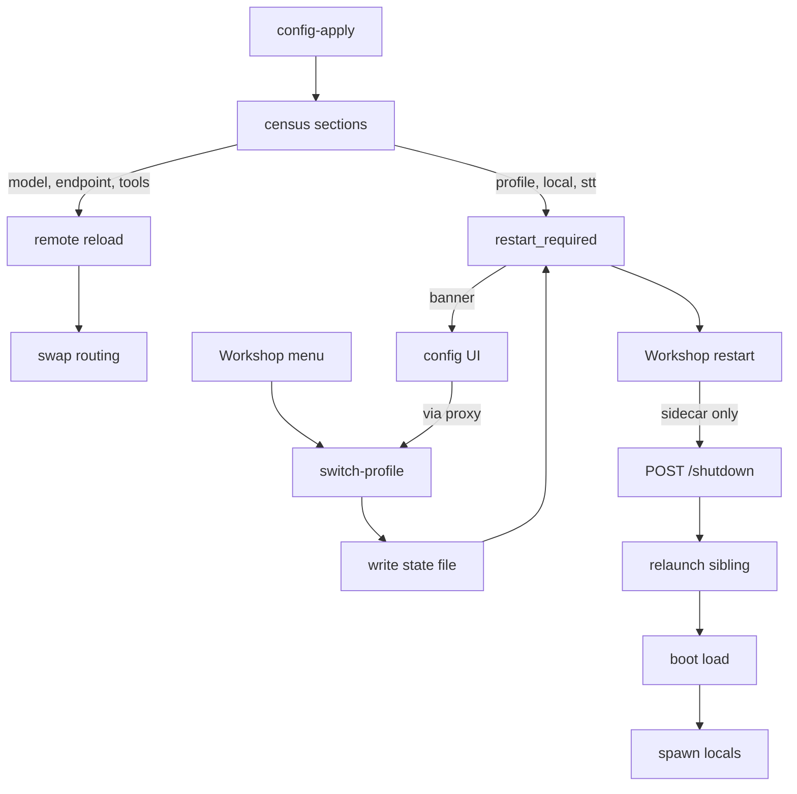

# Profiles Gate Only Local Models

<product-contract>

## Product Requirements

Profiles become checklists of local machine resources. Every `[[model]]` (remote) is always routed and always listed; a profile decides only which `[[local_model]]` and `[[stt_model]]` entries the gateway loads at boot. The live profile switch (SSE stages, 30 s drain, stop-and-spawn of `llama-server` children) is removed: the local set is fixed for the process lifetime, and changing it - by switching profile, editing a profile's members, or editing `[[local_model]]`, `[[stt_model]]`, or `[stt]` - persists and reports `restart_required: true`. Remote changes (`[[model]]`, `[[endpoint]]`, tools, web search) still take effect live through config-apply without a restart. Profile selection collapses to one route that both the Workshop and the config UI call, the profile-state shadow disappears, the Workshop proxy stops hand-mirroring the gateway's admin routes, and `config-version` resets to 0 to mark the format pre-release.

- Problem and users: Workshop and config UI users who add a cloud model and never see it in `GET /v1/models` because the active profile's `models` list does not name it (the config UI's `mergeCloudModel` in `crates/gateway-config-ui/ui/src/services/cloud-merge.ts` appends only `[[endpoint]]` and `[[model]]`, while `Config::select_profile` narrows the catalog to the profile's list); operators who maintain 1,758 lines of switch transaction, drain, and rollback machinery to hot-swap processes that could simply be restarted.
- Goals:
  - A remote model is served and listed the moment its `[[model]]` and `[[endpoint]]` apply, under any profile or none.
  - A profile's `models` list may name only `[[local_model]]` and `[[stt_model]]` entries; a remote name is a validation error naming the profile and the model.
  - "No profile" is a first-class, selectable state: with none, no local or STT model loads and every remote model serves. It is reachable at boot (no state file), by `POST /admin/switch-profile` with `{"name": null}`, and from both clients' profile pickers. A `--profile` or `PROMPTFORGE_PROFILE` value naming an undefined profile still fails boot (an explicit operator instruction that is wrong); a `gateway.state.toml` naming a profile the config no longer defines degrades instead: the gateway logs a warning naming the stale value and the defined profiles, boots with no profile, and reports the stale selection so the UI can show it.
  - `POST /admin/switch-profile` is the only way to select a profile at runtime. It persists the selection to `gateway.state.toml` and answers JSON `{"profile", "restart_required"}`; nothing stops, drains, or spawns. Both the Workshop menu and the config UI call it; the profile-state shadow (`gateway.state.toml.next`), the `active_profile` key in `PUT /admin/config`, and the config UI's staged selection are removed. The Workshop, which owns and supervises its sidecar, restarts the gateway itself.
  - `POST /admin/config-apply` reloads remote routing, tools, and web search live; it reports `restart_required: true` when any of `profile`, `local_model`, `stt_model`, `stt`, `server`, `workshop`, or the env file changed.
  - The Workshop proxy stops mirroring the gateway's admin router by hand: it forwards every `/admin/*` request except `GET /admin/progress`, plus `GET /v1/cache` and `DELETE /v1/cache/<64 hex>`, and refuses everything else. A new admin route no longer needs a proxy edit.
  - `config-version` becomes `0`, marking the configuration format as pre-release with no compatibility promise: the loader requires exactly `0`, the first-run default writes `0`, and every fixture, README, and guide example reads `0`. A file at `2` fails with the existing hard-break message naming `0`.
  - The gateway's boot sequence keeps architecture invariant A1 (`vibe/archdoc.md`: the Gateway binds its HTTP listener and reports readiness before it starts model downloads or model processes): the listener is up and remote models serve before local children download and spawn.
- Non-goals: any change to the cloud sheet `schema_version` (stays 1); any Workshop protocol frame change other than the `switch_profile` inbound frame's `name` accepting `null`; a compatibility path for configs written at `config-version = 2` (they fail with a message naming the new value); per-field profile overrides; a "restart now" admin route on the gateway; publisher-side versioning of the cloud provider sheet; changes to `[[profile]]` TOML shape.
- Success criteria: every proving check in the Testing Plan passes; existing suites for `gateway`, `gateway-config`, `gateway-local`, `gateway-stt`, `workshop-gateway`, `workshop-sessions`, `workshop-menu`, `workshop-server`, `workshop-protocol`, and both UIs stay green; the e2e cloud merge test asserts the merged model in `GET /v1/models` under an empty profile; `drain.rs`, the switch transaction, and the profile-state shadow are gone; no `config-version = 2` literal remains under `crates/`, `guide/`, or any README; no new admin route is added.
- Constraints:
  - Repository `promptforge` at `c:\Users\Vinnie\cursor\promptforge`, branch `master` on fork `vinniefalco/promptforge` (upstream `cppalliance/promptforge`), base commit `815e5b9e`. Clean worktree. All line numbers in this plan are as of that commit.
  - `shared-*` crates depend on no product crate. Edition 2024, clippy `-D warnings`, `cargo fmt --all --check`. No em dashes.
  - File ceiling: `cargo test -p build-xtask` (`crates/build-xtask/src/tidy.rs` 20-26, 136-157, 206-249) fails any `.rs` file over 500 raw lines, but only inside crates whose `src/lib.rs` or `src/main.rs` contains `//! ## Invariants`: today `build-xtask` and the nine `workshop-*` crates, so it binds every `workshop-gateway` and `workshop-sessions` file this plan touches. `crates/gateway` and `crates/gateway-config` are not scanned (which is why `lib.rs` at 4,994 lines and `profile_switch.rs` at 1,758 lines pass); there the 500-line ceiling is a workspace convention, and this plan honors it for every new or split gateway file while leaving existing oversized files to shrink rather than grow.
  - The Workshop server calls the gateway directly; only the embedded config panel goes through the Workshop proxy, so the proxy's rule governs which admin routes the panel can reach.
  - `POST /shutdown` (`crates/gateway/src/shutdown.rs`, bearer-authed, not under `/admin`) is the existing deliberate stop the Workshop quit path uses; the Workshop supervisor (`crates/workshop/src/gateway/supervisor.rs`) relaunches a missing sibling sidecar with backoff 250 ms to 30 s. LAN-configured gateways have no sidecar identity and are never launched or stopped by the Workshop.
  - Wire changes are confined to in-repo consumers and are listed in full under Technical Design: the `switch-profile` response, the `PUT /admin/config` body and reply, `config-dirty`, `config-pending`, and the progress stage names change; `GET /admin/status` keeps every existing key (`model_allowlist` now carries the profile's local and STT members).
- Open questions: None. Operator decisions on 2026-09-15: persist-and-report for the switch route; reject remote names in profile lists; profile optional at boot; one selection path (the switch route) for both clients; breaking existing configs is acceptable; `config-version` resets to 0; "no profile" is selectable; a stale state file degrades to no profile instead of failing boot.

### Current State (as of 815e5b9e)

- `crates/gateway-config`: `ProfileConfig { name, models }` (`config.rs` 250-274); `validate_profiles` (`validate.rs` 489-563) admits remote, local, and STT names; `activate_profile` (`validate.rs` 591-628) narrows `models`, `local_models`, `stt_models` and fails with `active profile {} is not defined (defined profiles: {})` (597-601) for any undefined selection regardless of its source; `Config::load` (`imp.rs` 40-63) fails with "no active profile selected" when nothing selects one; `resolve_selection` (`profile.rs` 201-216) orders `--profile`, `PROMPTFORGE_PROFILE`, sibling state and returns `Option<ProfileName>` without recording which source won; `ProfileState` (`profile.rs` 94-99) is `{ active_profile: String }` with `deny_unknown_fields`, so the state file cannot express "none" other than by being absent.
- `crates/gateway`: `LiveState` (`lib.rs` 186-210) holds `routing`, `config`, `local`, `web_search`, `profile_name`, `model_allowlist`, `loading`; `AppState` (`lib.rs` 257-280) holds `switch` mutex, `in_flight` drain, `apply` mutex, `commands` queue, `hub`. `admin_switch_profile` (`lib.rs` 1710-1737) enqueues `Command::LoadProfile { persist: true }` and streams `switch_sse_response`. `run_switch_with_config` (`lib.rs` 1794-1803) delegates to `profile_switch::run` (1,758 lines: prepare, download, cutover with `INFERENCE_DRAIN_TIMEOUT`, spawn, commit, rollback, `StatePersistence::{None, Write, Promote}`). `config_apply.rs` `capture_apply` (202-251) sets `restart_required` for `server`/`workshop`/env and requires an active profile; `apply_config` (305-350) runs the full switch. `commands.rs` `Command::{LoadProfile{name, persist, boot, token}, ApplyConfig, ProvisionModel}`; `ApplyConfig` supersedes a pending or active `LoadProfile`. `runner.rs` 271-325 assembles routing from the narrowed `models()`. `drain.rs` and `begin_inference` register in-flight inference (about 50 call sites, mostly `lib.rs`).
- `crates/workshop-gateway`: `switch_profile` (`gateway.rs` 314-346) expects `text/event-stream`; `SwitchEvent`/`switch_events` (`gateway/events.rs` 115-209). `GatewaySnapshot` (`gateway_binding.rs` 21-80) holds a private `identity: Option<shared_sidecar::ValidatedConnection>` that is `Some` only for a supervised sidecar and exposes only `client()`, `base_url()`, `api_key()`, `generation()`; `GatewayUpdater::request_shutdown()` (`gateway_binding/shutdown.rs` 16-23) posts the authenticated `POST /shutdown` through `shared_sidecar::request_shutdown(identity)` and returns `Ok(false)` when no identity exists. `GatewayClient` has no shutdown method. `workshop-sessions` depends on `workshop-gateway` (`crates/workshop-sessions/Cargo.toml` 28).
- `crates/workshop/src/gateway/supervisor.rs` 466-611: `run_supervision` maps a missing or unreadable discovery file to `SupervisionProbe::Missing` and relaunches the sibling with backoff 250 ms to 30 s, retrying indefinitely; the only suppressor is the supervisor's own `CancellationToken`, set by `GatewaySupervisor::stop_and_join` and `Drop`. The quit path (`crates/workshop/src/menu.rs` 89-108) calls `GatewayUpdater::request_shutdown()` then `app.exit(0)` and never touches the supervisor, so a deliberate mid-session `POST /shutdown` is indistinguishable from a crash and is relaunched.
- The Workshop proxy allowlist (`crates/workshop-server/src/routes/gateway_config.rs` 53-92 `forward_allowed`) admits exactly: GET `/admin/config`, `/admin/chat-templates`, `/admin/cloud-models`, `/admin/config-dirty`, `/admin/config-pending`, `/admin/env`, `/admin/model-info`, `/admin/orphans`, `/admin/status`, `/admin/system`, `/v1/cache`, and `/admin/hf/*`; PUT `/admin/config`, `/admin/env`; POST `/admin/config-apply`, `/admin/config-revert`, `/admin/cloud-models/refresh`, `/admin/reveal`, `/admin/queue/cancel`, `/admin/queue/cancel-pending`; DELETE `/v1/cache/<64 hex>`. It refuses `POST /admin/switch-profile`, and `gateway_config/tests.rs` 14-61 pins the exact admitted and refused lists. The list has drifted from the gateway's admin router twice (`f6f36259` on 2026-09-04 and `30ed96cb`), each time shipping a new admin route that the panel could not reach until repaired.
- The gateway's routes (`crates/gateway/src/lib.rs` 512-601): under `/admin/` are `profiles`, `status`, `progress`, `switch-profile`, `queue/cancel`, `queue/cancel-pending`, `system`, `config`, `config-pending`, `config-dirty`, `config-apply`, `config-revert`, `env`, `chat-templates`, `cloud-models`, `cloud-models/refresh`, `reveal`, `hf/search`, `hf/model/{owner}/{name}`, `orphans`, `model-info`. Not under `/admin/`: `/v1/chat/completions`, `/v1/embeddings`, `/v1/rerank`, `/v1/audio/*`, `/v1/models`, `/v1/tools/web_search`, `/v1/cache` (GET, POST) and `/v1/cache/{sha256}` (DELETE), `/health`, `/shutdown`, `/config`, `/auth`.
- `crates/build-user-guide/src/main.rs`: `cargo run -p build-user-guide` regenerates `guide/src/SUMMARY.md`, each part's `index.md`, and the concatenated exports `guide/promptforge-gateway-guide.md` and `guide/promptforge-workshop-guide.md`; the exports are tracked in git and no CI step or xtask detects drift from `guide/src`.
- `crates/workshop-sessions/src/session/menu.rs` 49-205: `start_switch` captures `state.gateway_snapshot().client().clone()` and spawns `run_switch`; `drive_switch` maps SSE stages to a three-step progress ladder and calls `finish_switch`. `workshop-menu` `begin_switch`/`finish_switch` own `switching` and `chat_ready`. `SessionsState::gateway_snapshot()` (`crates/workshop-sessions/src/state.rs` 58-64) returns `Option<Arc<GatewaySnapshot>>` from `ArcSwap::load_full()` on every call.
- `crates/workshop-gateway/src/gateway_binding.rs` 129-219 and `gateway_binding/publication.rs` 43-103: every published snapshot carries a strictly larger `generation()` (initial snapshot 0, counter from 1), and `replace_sidecar`/`replace_sidecar_cancellable` build the new snapshot's `client()` from the relaunched gateway's `http://127.0.0.1:{port}` and bearer key, then `ArcSwap::store` and `watch::send_replace(generation)`. The heartbeat (`crates/workshop-gateway/src/heartbeat.rs` 220-350) wakes on that watch, resets its refresh state, probes the new client, and re-runs `refresh_profiles` and `refresh_catalog`.
- `crates/gateway-config-ui/ui/src`: `profile-switcher.ts` and `profiles-view.ts` stage `active_profile` through `config-store.ts` `stageActiveProfile` (536-541) and never call `switch-profile` (`gateway-api.ts` has no such call; `components/profile-switcher.test.mjs` 34-37 asserts the route is not called; `panel-mode.test.mjs` 128-165 asserts `/admin/config`, `/admin/chat-templates`, and `/admin/status` ride the Workshop bridge and `/admin/progress` never does); `profiles-view.ts` `unfilteredEntriesFor` (111-120) offers all three catalogs; `config-store.ts` `hasPendingSttChange` (164-180) drives a client-side STT restart toast in `main.ts` 301-306 because the server does not flag STT changes; `apply-overlay.ts` (38-43) knows `stopping-models`.
- Profile-state shadow (`gateway.state.toml.next`) footprint. `crates/gateway-config/src/shadow.rs`: `PendingShadows.state` (36-41); `shadow_path` (78-85); `persist_profile_state` writes the real state file, never the shadow (252-259); `save_config_shadow` removes `active_profile` from the PUT body, validates it, writes the config shadow then the state shadow with rollback (284-346); `pending_selected_name` prefers the state shadow (421-455) for `load_pending_config` (391-419); `pending_report` lists the state path in `shadowed_files` and adds `"active_profile"` to `changed_sections` when the shadow differs from the real file (472-507). `crates/gateway/src/config_write.rs`: `admin_put_config` converts the JSON body to TOML (80-91), calls `save_config_shadow`, and replies `{"shadow", "state_shadow"}` (28-53). `crates/gateway/src/config_pending.rs`: `admin_config_pending` answers `{"profile": {"active_profile": ...}, "boot": null}` (30-57); `load_pending_for_running` uses an empty selection when the state shadow exists (61-74); `shadow_census` copies `pending_report` (115-127); `dirty_reply` emits `changed_sections` (137-151). `crates/gateway-config-ui/ui/src/services/config-store.ts`: `stageActiveProfile` sets `payload["active_profile"]` then `savePayload` (537-541); `pendingActiveProfile` reads `pending["active_profile"]` falling back to the running profile (425-428); `profilePointer` (115-118, used 175-176); `stageDiscoveredModel` adds the discovered model to `pendingActiveProfile()` (678); readers in `views/profiles-view.ts` 104, 178, 200, 284, 325-334 and `components/profile-switcher.ts` 72, 139.
- `config-version` sites: `crates/gateway-config/src/config/validate.rs` 59-63 (`"config-version must be 2, got {}"`) and `config/imp.rs` 336-349 (`"set config-version = 2 and use the single-file profile layout"`, `"add config-version = 2 before the first table"`). The literal `config-version = 2` appears 295 times under `crates/` (dominated by `accessors.rs` doc examples, 71, and `config/tests/validation.rs`, 46), 4 times under `guide/` (2 in `guide/src`, 2 in the generated gateway export), and in `crates/gateway/README.md` and `crates/gateway-config/README.md`.
- `crates/gateway/tests/it/cloud_models.rs`: `assert_catalog_empty` pins the merged model's absence from `/v1/models` under an empty profile, with a comment recording profile membership as a deferred gap; `wait_for_catalog` is the helper it replaced.
- `crates/gateway/src/routing.rs`: `Routing::from_config` (100-160) builds the remote table from `config.models()`; `Routing::merge` (163+) folds a `LocalRuntime`'s models into a table, which `runner.rs` 325-329 does at assembly. `LiveState::model_status` (`lib.rs` 216-231) sums `vram_gb` from `live.config.local_models()` and `stt_models()` for `GET /admin/status` and the tray.
- Guide: `guide/src/gateway/07-profiles.md` documents the live switch. `vibe/archdoc.md` invariant A1 reads "The Gateway binds its HTTP listener and reports readiness before it starts model downloads or model processes; slow provisioning runs afterward through the Gateway command queue"; invariant A5 reads "During a Gateway profile switch, the previous routing table serves until a bounded in-flight drain completes; after cutover, a selected model that is not ready returns an explicit loading error."

## Functional Specification

Observable behavior changes at five surfaces: config validation, gateway boot, the admin routes that change configuration, the config UI's profile controls, and the Workshop's profile menu. Remote models serve and list under every profile, local and STT models serve only after a boot that selected them, and every change to the local set answers with a restart requirement instead of a live swap. Profile selection has one path, `POST /admin/switch-profile`, used by both clients; the config UI keeps stage-then-apply for everything else and its existing restart banner.

- Actors and workflows:
  - Operator edits `gateway.toml`: a profile listing a `[[model]]` name fails load with `profile "work" lists remote model "gpt-5"; a profile selects only [[local_model]] and [[stt_model]] entries, remote models are always served`. A profile listing an unknown name fails as today.
  - Gateway boots: remote routing is assembled from every `[[model]]` and published with the listener before any local work (invariant A1). If a profile is selected, the boot command downloads and spawns its local members and loads its STT members, publishing them as they become ready; a request for a member still loading earns `ModelLoading` (503, `Retry-After`) as today. If no profile is selected, boot logs `no profile selected; serving remote models only` and loads nothing local. If `gateway.state.toml` names a profile the config does not define, boot logs `state file selects profile "x", which is not defined (defined profiles: a, b); booting with no profile`, proceeds with no profile, and keeps the state file so the UI can show the stale selection. A `--profile` or `PROMPTFORGE_PROFILE` value naming an undefined profile still refuses to boot.
  - Operator or client selects no profile: `POST /admin/switch-profile` with `{"name": null}` deletes `gateway.state.toml` and answers `{"profile": null, "restart_required": true}` when a profile is running, `false` when none is. The Workshop Model menu and the config UI switcher and Profiles view each offer a "No profile" entry that sends this.
  - Workshop user picks a profile from the Model menu: the menu marks `switching`, the server calls `POST /admin/switch-profile`, receives `{"profile": "travel", "restart_required": true}`, and, because the gateway is a supervised sidecar, calls `POST /shutdown`; the supervisor relaunches the sibling at a fresh port and publishes a new gateway snapshot; the server waits for that new snapshot and for its `/admin/status` to report `profile == "travel"`, refreshes the catalog through it, and the menu settles `Completed`. Progress ladder: `Selecting profile` (1/3), `Restarting gateway` (2/3), `Loading models` (3/3). If the gateway is LAN-configured (no sidecar identity), the selection is persisted and the menu settles with a notice `profile "travel" selected; restart the gateway to load it`, leaving `active` at the running profile. If the relaunch does not converge within 90 s, the menu settles `Failed` with `gateway did not return after restart`.
  - Config UI user picks a profile in the tab-bar switcher or presses Set Active in the Profiles view: the UI calls `POST /admin/switch-profile` at once (through the Workshop proxy when embedded), the selection persists, and when `restart_required` is true the existing restart banner shows and polls `config_generation`. Nothing is staged and Apply is not involved. The Profiles view shows Active for the running profile and Selected for the persisted one when they differ, and refuses to delete either. Discovering a local or STT model adds it to the selected profile; with no profile selected it joins the catalog only and the view says so.
  - Config UI user edits a profile's members or a local or STT model, then applies: the apply promotes the files, reloads remote routing live, and answers `restart_required: true`; the restart banner shows. The client-side STT diff toast is removed because the server now reports it.
  - Config UI user adds a cloud model from the Cloud tab and applies: `restart_required: false`, `reloaded: true`, and the model appears in `GET /v1/models` at once, under any profile.
  - Config UI Profiles view: the Available list offers only `[[local_model]]` and `[[stt_model]]` entries (Cpu and Mic pills); the Cloud pill no longer appears there.
- Inputs and outputs: `POST /admin/switch-profile` takes `{"name": string | null}` and answers 200 JSON `{"profile": name | null, "restart_required": bool}` where `restart_required` is `name != running profile` (with `null` comparing against "no running profile"); `null` deletes `gateway.state.toml`, a string writes it; a malformed name keeps the existing `GatewayError::switch_failed("parse-name", ...)` classification, and an undefined name answers the existing switch-failure classification with a message naming the defined profiles. `POST /admin/config-apply` keeps `{"applied", "reloaded", "restart_required"}`. `PUT /admin/config` rejects a body carrying `active_profile` with a config-write error naming `POST /admin/switch-profile`, and its reply becomes `{"shadow"}` (the `state_shadow` key is gone). `GET /admin/config-dirty` never lists `active_profile` in `changed_sections` or the state file in `pending_files`. `GET /admin/config-pending` keeps its `{"profile": {"active_profile"}, "boot": null}` envelope, now reporting the persisted selection from `gateway.state.toml` (`null` when the file is absent, and the stale name when the file names an undefined profile, so the UI can flag it). `GET /admin/status` keeps `profile`, `models`, `model_allowlist`, `loading_models`, `queue`, `config_generation`, `vram_gb`, `endpoints`, `local_children`; `vram_gb` and `local_children` describe the running local runtime and the boot-time STT selection and do not move on an apply. `GET /admin/progress` streams boot stages `loading-profile`, `downloading-models`, `starting-models`, `loading-speech`, and one apply stage `applying-config`; `stopping-models` is retired.
- States and validation: live state has a fixed local runtime for the process lifetime; `loading` is non-empty only during boot. A switch never changes live state. An apply changes `routing` (remote entries rebuilt, existing local entries preserved), `config`, and `web_search` only. A switch writes `gateway.state.toml` directly; no state shadow exists any longer, so a pending config shadow and the persisted selection are independent. At boot `--profile` and `PROMPTFORGE_PROFILE` still outrank the state file.
- Errors and recovery: a failed apply promotes nothing and leaves shadows staged, as today. A switch whose state write fails answers the existing config-write error and changes nothing. A Workshop restart that never converges reports failure while the persisted selection stands; the next boot honors it. Boot with a stale state naming a deleted profile degrades to no profile with a warning; boot with an undefined `--profile` or `PROMPTFORGE_PROFILE` fails as today. Deleting the last profile in the config UI and applying therefore never leaves a gateway that cannot start.
- Security and privacy behavior: no new gateway route; `/shutdown` and the admin routes keep their bearer and loopback walls; the Workshop's `POST /shutdown` call is the same authenticated call its quit path makes. The Workshop proxy's rule becomes "every `/admin/*` except `GET /admin/progress`, plus the two `/v1/cache` read and delete verbs". Newly reachable from the panel: `GET /admin/profiles` and `POST /admin/switch-profile` (the latter writes a one-key state file), and any admin route added later. Still refused by construction: `/shutdown`, `/health`, every `/v1/*` inference and tool route, `POST /v1/cache`, `/config`, `/auth`, the bare `/admin`, and any path with a `.`, `..`, or backslash segment. The bearer key never leaves the proxy, as before.
- Acceptance criteria: a cloud model merged by the UI's two appends appears in `GET /v1/models` under an empty profile; a profile listing a remote name fails load with the remote-model error; a config with no selected profile boots and serves every remote model; a stale state file boots with no profile and a warning while an undefined `--profile` still fails; `POST /admin/switch-profile` writes the state file for a name and deletes it for `null`, answers JSON, and leaves live state untouched; both clients offer "No profile"; an apply touching only `[[model]]` or `[[endpoint]]` answers `restart_required: false` and routes the change at once; an apply touching `profile`, `local_model`, `stt_model`, or `stt` answers `restart_required: true`; the config UI's switcher and Set Active call `POST /admin/switch-profile` and never place `active_profile` in a PUT body; `PUT /admin/config` with `active_profile` is refused; a Workshop profile pick on a sidecar ends with the gateway relaunched on the new profile; the string `stopping-models` no longer appears in the gateway.

</product-contract>
<implementation-contract>

## Technical Design

The gateway's local runtime becomes boot-only, remote routing becomes the full `[[model]]` catalog and the only thing config-apply swaps live, and profile selection becomes a persisted preference read at boot. The switch transaction, its drain, and its rollback are deleted rather than adapted, as is the profile-state shadow. The Workshop performs restarts for its supervised sidecar through the existing shutdown route and relaunch loop; standalone operators restart by hand after the `restart_required` signal. The Workshop proxy forwards the whole `/admin/` surface by rule instead of by list.

- Architecture:
  - Boot: `runner.rs` assembles `Routing` from every `[[model]]` and an empty `LocalRuntime`, binds the listener, and enqueues one boot command when a profile is selected. The boot command downloads and spawns the profile's local members, publishing them into the live routing table as they become ready, then performs the process's one STT load. Nothing after boot changes the local runtime.
  - Runtime configuration change: `POST /admin/config-apply` classifies the changed sections. Remote-facing sections reload live by rebuilding the remote routing table and merging the existing local entries under one write. Local-facing sections and the profile selection promote to disk and report `restart_required: true`.
  - Profile selection: `POST /admin/switch-profile` is the single path. It writes `gateway.state.toml` and reports whether a restart is needed. The Workshop menu calls it directly, then, for a supervised sidecar, posts the existing `/shutdown` and lets its supervisor relaunch the sibling, converging through its heartbeat; LAN gateways are never stopped. The config UI calls it from the switcher and Set Active (through the Workshop proxy when embedded) and shows the restart banner. The profile-state shadow and every code path that wrote, read, reported, captured, or promoted it are removed; `gateway.toml.next` remains the only shadow.
  - Command queue: the boot load and config-apply remain queue commands so a reload never races the boot publication; apply queues behind the boot load instead of superseding it.
- Modules and interfaces:
  - `gateway-config` (`crates/gateway-config/src/config/validate.rs`, `imp.rs`, `accessors.rs`): `validate_profiles` requires each member to exist in `catalog_local_models` or `catalog_stt_models`; a name found in `catalog_models` produces the remote-model error, an unknown name keeps the existing error; duplicate names, duplicate members, STT role rules, and per-profile VRAM budgets are unchanged. `activate_profile` filters `local_models` and `stt_models` only and never narrows `models`; the duplicate `catalog_models` slot goes if it becomes identical to `models`, while `catalog_local_models()` and `catalog_stt_models()` stay for the UI and boot. `Config::load` and `select_profile` accept a `None` selection and return `Ok` with `active_profile: None` and empty local and STT sets; the "no active profile selected" error is deleted. `resolve_selection` reports which source won (command line, environment, or state file). When the winning source is the state file and the name is not defined, `Config::load` returns `Ok` with no profile and records the stale name behind a new accessor `stale_state_selection() -> Option<&str>`; when the winning source is the command line or environment and the name is not defined, the existing `active profile {} is not defined` error stands. A malformed name from any source still fails. `--profile` and `PROMPTFORGE_PROFILE` stay ephemeral. A new `clear_profile_state(config_path)` deletes `gateway.state.toml` (absent is success), the inverse of `persist_profile_state`. `ProfileConfig`, `ProfileState`, `profile_state_path`, and `persist_profile_state` are unchanged. In `crates/gateway-config/src/shadow.rs`: `PendingShadows` loses `state`; `save_config_shadow` no longer splits `active_profile` out of the body and instead fails validation when the key is present (`"active_profile is not a configuration key; select a profile with POST /admin/switch-profile"`), writing only the config shadow; `pending_selected_name` and its state-shadow preference are deleted, and `load_pending_config(config_path, selection)` resolves the profile exactly as `Config::load` does; `pending_report` lists only the config shadow and never emits `"active_profile"`. The `config-version` hard-break check (`crates/gateway-config/src/config/imp.rs` 336-350) requires `0` and its two messages name `0`; the first-run default and every fixture, README, and guide example move from `2` to `0`.
  - `gateway` boot (`crates/gateway/src/runner.rs`, `commands.rs`): `runner.rs` builds `Routing::from_config` over the full `models()` with an empty `LocalRuntime`, logs the stale-selection warning when `stale_state_selection()` is `Some`, and enqueues one boot command when a profile is selected. `Command::LoadProfile` loses `persist` and `boot` and is the boot load only; `ApplyConfig` no longer supersedes or cancels it, commands run FIFO, and a second `ApplyConfig` still attaches to the first. The boot load lives in a new module under 500 lines (for example `crates/gateway/src/boot_load.rs`) replacing `profile_switch.rs`: prepare (`loading-profile` leaf, the selected profile's local and STT members), download (`downloading-models`, artifact store, cancellable), publish `loading`, spawn (`starting-models`, one deadline, `PartialStart` preserved), commit (merge ready local models into the current `live.routing` under one `live.write`, set `live.local`, clear `loading`), then the one guarded STT load (`loading-speech`). Deleted: the drain, cutover, prior-runtime restoration, routing rollback, `StatePersistence`, prepared-file persistence temporaries, `INFERENCE_DRAIN_TIMEOUT`, rollback paths, and the `stopping-models` stage. `crates/gateway/src/drain.rs`, `AppState.in_flight`, `AppState.switch`, and `begin_inference` are deleted; inference handlers read `live` directly. `LiveState.loading` and `GatewayError::ModelLoading` stay for boot.
  - `gateway` switch route (`crates/gateway/src/lib.rs` `admin_switch_profile`): the body is `{"name": Option<String>}`. For a string, parse `ProfileName`, then under `state.apply` check it against `live.config.profiles()` (error lists defined profiles), compute `restart_required = Some(name) != live.profile_name`, and `persist_profile_state(config_path, &name)`. For `null`, under `state.apply` compute `restart_required = live.profile_name.is_some()` and `clear_profile_state(config_path)`. Answer `Json({"profile": Option<String>, "restart_required"})`. `switch_sse_response`, the SSE shaping, and the route's progress subscription are deleted.
  - `gateway` config routes (`crates/gateway/src/config_write.rs`, `config_pending.rs`): `admin_put_config` replies `{"shadow"}` and surfaces the `active_profile` validation error as the existing config-write error; `admin_config_pending` keeps its `{"profile": {"active_profile"}, "boot": null}` envelope but reads `active_profile` from the real `gateway.state.toml` (`null` when absent, the raw name when present even if the config no longer defines it), so the UI can show a persisted selection that differs from the running profile or is stale; `load_pending_for_running` and `shadow_census` lose their state-shadow branches; `config-dirty` reports only the config shadow.
  - `gateway` apply (`crates/gateway/src/config_apply.rs`): `capture_apply` sets `restart_required` when `census.sections` contains any of `server`, `workshop`, `profile`, `local_model`, `stt_model`, `stt`, or an env shadow exists; `needs_reload` is true only for a config shadow; `ApplySnapshot` drops `profile` and the parse uses `ProfileSelection::default()`; the state-shadow capture and promotion paths are deleted. `apply_config` becomes one `applying-config` leaf: `Routing::from_config(&config)` merged with `live.local`'s current models, one `live.write` swapping `routing`, `config`, and `web_search`, then `promote_captures` under `state.apply` after re-checking the token. Reply, cancellation, and failure semantics are unchanged.
  - `gateway` errors and status (`crates/gateway/src/error.rs`, `lib.rs`): variants only the switch used are removed (the drain-cancellation error; `ActiveProfileUnavailable` if unreferenced); `SwitchFailed`, `PartialStart`, `ModelLoading`, `ApplyReloadFailed`, and `ApplyCancelled` stay. `LiveState::model_status` derives `vram_gb` from the running `LocalRuntime` and the STT selection captured at boot instead of from `live.config`, because an apply now swaps `live.config` for a document parsed with no selection while the children keep running. `GET /admin/status` keeps its shape; `model_allowlist` is documented as the profile's local and STT members.
  - `workshop-gateway` (`crates/workshop-gateway/src/gateway.rs`, `gateway/events.rs`, `gateway_binding.rs`, `gateway_binding/shutdown.rs`): `switch_profile(name: Option<&str>)` sends `{"name": name}` and returns `SwitchOutcome { profile: Option<String>, restart_required: bool }` parsed from JSON; `SwitchEvent`, `switch_events`, and `SwitchResponse::Switching` are deleted. `GatewaySnapshot` gains two accessors: `is_sidecar()` returning `identity.is_some()`, and `request_shutdown()` posting the authenticated `POST /shutdown` through the same `shared_sidecar::request_shutdown(identity)` call `GatewayUpdater::request_shutdown()` already makes, returning `false` when no identity exists. The quit path in `crates/workshop/src/menu.rs` is unchanged.
  - `workshop-sessions` (`crates/workshop-sessions/src/session/menu.rs`): `start_switch` passes the `Arc<GatewaySnapshot>` (not only its `client()`) plus a handle to `state.gateway_snapshot()` to the switch task. `run_switch` calls `switch_profile` on the captured snapshot; on `restart_required && snapshot.is_sidecar()` it records `snapshot.generation()`, pushes `Restarting gateway`, calls `snapshot.request_shutdown()`, then polls `state.gateway_snapshot()` until a snapshot with a larger `generation()` appears (the supervisor published the relaunched sidecar at its new port and key) and that snapshot's `profile_status()` reports `profile == name`, all under a 90 s bound; it then pushes `Loading models`, refreshes the catalog through the new snapshot's client, and settles `Completed`. The captured pre-restart client is never used after the shutdown call because the relaunched sidecar binds a fresh port. On `!is_sidecar()` it settles with the notice; on `!restart_required` it settles `Completed` at once. Convergence for a `null` selection waits for the replacement's `profile_status()` to report `profile: null`. The Workshop supervisor needs no change: it already relaunches a missing sibling regardless of why it exited. `workshop-protocol`: the inbound `switch_profile` frame's `name` becomes `Option<String>` (`null` selects no profile); the outbound `workbench` frame is unchanged (`active` is already optional). `workshop-menu`: `begin_switch` takes `Option<ProfileName>`. Workshop UI: the Model menu's profiles section lists "No profile" as its first entry whenever at least one profile is defined, checked when `active` is `null`; progress labels change as above.
  - `gateway-config-ui` (`crates/gateway-config-ui/ui/src`): `services/gateway-api.ts` gains `switchProfile(name)` posting `/admin/switch-profile` and returning `{profile, restart_required}`, and `putConfig` stops reading `state_shadow`. `services/config-store.ts` replaces `stageActiveProfile`, `pendingActiveProfile`, and `profilePointer` with `selectProfile(name: string | null)` (calls `switchProfile`, refreshes status and the pending envelope) and `selectedProfile()` (the persisted selection from the `config-pending` envelope, `null` when absent, falling back to the running profile only when the envelope is unavailable) plus `selectionIsStale()` (the persisted name is not among `profiles()`); `stageDiscoveredModel` adds the discovered model to `selectedProfile()` and, when that is `null`, to the catalog alone with a toast saying no profile is selected; the Profiles view's delete guard covers both the running and the selected profile; `saveProfile` orders over the local and STT catalogs; `hasPendingSttChange`/`pendingSttChange` are deleted with the `STT_RESTART_MESSAGE` branch in `main.ts`. `components/profile-switcher.ts` lists "No profile" first and every defined profile after it, and `views/profiles-view.ts` gains a "No profile" row with its own Set Active; both call `selectProfile` and raise the restart banner on `restart_required`. The Profiles view's pills become Active (running) and Selected (persisted, when different); when `selectionIsStale()` the view shows a Stale pill with the missing name and offers Set Active on any row to clear it. `unfilteredEntriesFor` filters `store.models()` to `local` and `stt`. `components/apply-overlay.ts` replaces `stopping-models` with `applying-config`. `services/cloud-merge.ts` is unchanged and now sufficient.
  - `workshop-server` (`crates/workshop-server/src/routes/gateway_config.rs` `forward_allowed`): the per-route `matches!` arms are replaced by a rule: keep the existing dot-segment and backslash refusal; refuse `GET /admin/progress`; forward any method whose path starts with `/admin/`; forward `GET /v1/cache` and `DELETE /v1/cache/<64 hex>`; refuse everything else. The doc comment states the rule and the two named exceptions and drops the mention of a streaming profile switch. `gateway_config/tests.rs` rewrites its two lists: admitted covers every current `/admin/` route including `switch-profile` and `profiles` plus the two cache verbs; refused covers `/admin/progress`, the bare `/admin`, dot and backslash segments, `/v1/models`, `/v1/chat/completions`, `POST /v1/cache`, a malformed cache digest, `/health`, `/shutdown`, and `/config/`. The old refused entries for never-existing paths (`/admin/boot-config`, `/admin/include/*`, `/admin/profiles/beta`) are dropped: under the rule they forward and the gateway answers 404 or 405.
- File and public API changes:
  - Wire: `POST /admin/switch-profile` answers JSON `{"profile", "restart_required"}` instead of `text/event-stream`; `PUT /admin/config` refuses `active_profile` and replies `{"shadow"}`; `GET /admin/config-dirty` never reports `active_profile` or the state file; `GET /admin/config-pending` keeps its envelope with `active_profile` sourced from the state file; `POST /admin/config-apply` and `GET /admin/status` unchanged in shape; `GET /admin/progress` loses `stopping-models` and gains `applying-config`. The Workshop proxy forwards every `/admin/*` except `GET /admin/progress`. Consumers are all in-repo.
  - Rust public API: `gateway_config::Config::load`, `select_profile`, and `load_pending_config` accept an absent selection; `Config` gains `stale_state_selection()`; `gateway_config` gains `clear_profile_state`; `PendingShadows` loses `state`; `workshop_protocol`'s `switch_profile` frame `name` becomes `Option<String>`; `workshop_menu::begin_switch` takes `Option<ProfileName>`; the remote-model and `active_profile` validation errors are new text on `ConfigError::Validation`; `workshop_gateway::GatewaySnapshot` gains `is_sidecar()` and `request_shutdown()`, `GatewayClient::switch_profile` returns `SwitchOutcome`, and `SwitchEvent` and `switch_events` are removed.
  - Files: `crates/gateway-config/src/{shadow.rs,lib.rs,config/validate.rs,config/imp.rs,config/accessors.rs,config/config.rs}`; `crates/gateway/src/{lib.rs,runner.rs,commands.rs,config_write.rs,config_apply.rs,config_pending.rs,error.rs,boot.rs}`, new `crates/gateway/src/boot_load.rs`, deleted `crates/gateway/src/profile_switch.rs` and `crates/gateway/src/drain.rs`; `crates/gateway/tests/it/{profiles.rs,boot.rs,cloud_models.rs,support.rs}` and every fixture carrying `config-version`; `crates/workshop-gateway/src/{gateway.rs,gateway/events.rs,gateway_binding.rs,gateway_binding/shutdown.rs}`; `crates/gateway-config/src/profile.rs`; `crates/workshop-sessions/src/session/menu.rs` and `session.rs`; `crates/workshop-protocol/src/lib.rs`; `crates/workshop-menu/src/menu.rs`; `crates/workshop-server/ui/src` (Model menu "No profile" entry) and `crates/workshop-server/src/routes/gateway_config.rs` and `gateway_config/tests.rs`; `crates/gateway-config-ui/ui/src/{views/profiles-view.ts,components/profile-switcher.ts,services/config-store.ts,services/gateway-api.ts,components/apply-overlay.ts,main.ts}` and their tests.
  - Documentation: `guide/src/gateway/07-profiles.md` rewritten (checklist of local and STT models, state file, precedence, "no profile" as a selectable state, stale state degrades with a warning, switch persists and reports restart); `guide/src/gateway/09-editing-configuration.md` (the `restart_required` section set, live remote reload, no stop and spawn stages, the "Profiles and shadows" section and every mention of `gateway.state.toml.next` removed); touch-ups to `guide/src/gateway/{04-local-models.md,10-config-ui.md,11-serving-and-observing.md}` and `guide/src/workshop/{01-application.md,03-menus.md,05-models.md}`; `crates/gateway/README.md`, `crates/gateway-config/README.md`, `crates/workshop-server/README.md`; `vibe/archdoc.md` invariant A5 becomes "The Gateway's local model set is fixed for the process lifetime; profile and local-model changes persist and report `restart_required`, and remote routing changes replace the routing table atomically without draining." After editing chapters, `cargo run -p build-user-guide` regenerates `guide/src/SUMMARY.md`, the part `index.md` files, and the tracked exports `guide/promptforge-gateway-guide.md` and `guide/promptforge-workshop-guide.md`; those regenerated files are committed with the chapter edits because nothing else detects drift.
- Coding standards: every code change follows the rulebook named for its language in the Project Survey's "Coding standards for this plan" entry (Rust, TypeScript, HTML and CSS), with workspace conventions taking precedence on conflict and no reformatting of untouched code.
- Data, persistence, failure, security, and privacy constraints: the `gateway.toml` and `gateway.state.toml` shapes are unchanged except that `config-version` reads `0`; the cloud sheet `schema_version` stays 1. A switch writes or deletes the real state file directly; there is no longer a state shadow to leave in place, and an absent state file is the persisted form of "no profile". A failed apply promotes nothing. Local children are torn down only at process shutdown through the existing path. The bearer key, session cookie, and loopback walls are unchanged, and no route is added.

</implementation-contract>
<verification-contract>

## Testing Plan

Each behavior change has a proving check that fails at the base commit and passes after the change, with the existing suites of every touched crate and both UIs as regression. The Workshop restart flow is proven against a mock gateway that can go unreachable and return on a new profile. Exit is gated on the removed machinery being absent from the source tree.

- Unit:
  - A profile naming a `[[model]]` fails validation with the remote-model message naming profile and model; naming an unknown model keeps the existing error.
  - `activate_profile` leaves `models()` equal to the full catalog and narrows `local_models()` and `stt_models()` (rewrite `selected_profile_filters_each_catalog_kind` in `config/tests/validation.rs`).
  - `Config::load` with no selection and no state file returns `Ok` with `active_profile() == None`, empty local and STT sets, and the full remote set (replace the "absent selection message" test in `config/tests/schema.rs`). A state file naming an undefined profile returns `Ok` with no profile and `stale_state_selection() == Some("x")`; `--profile x` or `PROMPTFORGE_PROFILE=x` for the same undefined `x` still fails with the defined-profiles error. `clear_profile_state` deletes the file and succeeds when it is already absent.
  - `config-version`: a document at `2` fails with the message naming `0`; the first-run default parses; the schema tests' fixtures read `0`.
  - `save_config_shadow` with `active_profile` in the body fails with the named error and writes no shadow; `pending_report` after a config save lists only `gateway.toml.next` and no `active_profile` section; `load_pending_config` honors a supplied selection and accepts `None`.
  - `admin_switch_profile` answers JSON with `restart_required: true` for a different defined profile, `false` for the running one, and a defined-profiles error for an undefined one; it writes `gateway.state.toml` and leaves `live.routing`, `live.local`, and `live.profile_name` unchanged. With `{"name": null}` it deletes the state file and answers `{"profile": null, "restart_required": true}` when a profile is running and `false` when none is; `GET /admin/config-pending` then reports the persisted name in its `profile.active_profile` envelope while `GET /admin/status` still reports the running one.
  - `admin_put_config` refuses a body with `active_profile` and replies `{"shadow"}` on success; `config-dirty` after a save never contains `active_profile`.
  - `capture_apply` sets `restart_required` for each of `profile`, `local_model`, `stt_model`, `stt` (table-driven), and not for `model`/`endpoint`/tools.
  - `apply_config` with a new `[[model]]` swaps `live.routing` to include it, preserves the live local entries, and promotes captures; the reply is `reloaded: true, restart_required: false`.
  - Command queue: an `ApplyConfig` enqueued during a boot `LoadProfile` runs after it and does not cancel it.
  - Boot load: with a selected profile, local members publish as `loading` then as routed; with no profile selected, the runner enqueues no boot command, `live.local` stays empty, and `GET /admin/status` reports `profile: null`.
  - `LiveState::model_status`: after an apply that swaps `live.config`, `vram_gb` still equals the running children's declared VRAM plus the boot STT selection.
  - Error classify table updated for removed variants.
  - `workshop-gateway`: `switch_profile(Some(name))` sends the name and `switch_profile(None)` sends `null`; both decode `{profile, restart_required}` with `profile` optional; `GatewaySnapshot::is_sidecar()` is true only with a validated identity; `GatewaySnapshot::request_shutdown()` posts the authenticated `POST /shutdown` when an identity exists and returns `false` without one.
  - `workshop-server` `gateway_config/tests.rs`: `forward_allowed` admits every `/admin/` route the gateway mounts today (enumerated in the test, including `POST /admin/switch-profile` and `GET /admin/profiles`) plus `GET /v1/cache` and a well-formed `DELETE /v1/cache/<digest>`; it refuses `GET /admin/progress`, `/admin`, dot and backslash segments, `/v1/models`, `/v1/chat/completions`, `POST /v1/cache`, a short digest, `/health`, `/shutdown`, and `/config/`.
  - Config UI (`npm test` in `crates/gateway-config-ui/ui`): `profile-switcher.test.mjs` flips its assertion: selecting a profile calls `/admin/switch-profile`, places no `active_profile` in any PUT body, and shows the restart banner when the reply says `restart_required: true`; `profiles-view.test.mjs` Set Active does the same, the "No profile" row sends `null`, the Available list excludes remote models, Active/Selected pills follow status versus the pending envelope, and a persisted name absent from `profiles()` shows the Stale pill; the switcher test lists "No profile" first and checks it when the envelope reports `null`; `config-store.test.mjs` drops `stageActiveProfile` and `pendingSttChange` cases and asserts `stageDiscoveredModel` targets `selectedProfile()`; `apply-revert.test.mjs` drops the STT toast case and asserts the banner on `restart_required`; `apply-overlay.test.mjs` drops `stopping-models`; `panel-mode.test.mjs` asserts a profile pick rides the Workshop bridge.
- Integration and end-to-end:
  - `crates/gateway/tests/it/profiles.rs`: rewritten for persist-and-report; a gateway started with `--profile` and no state file, switched over HTTP, restarted without `--profile`, boots the switched profile.
  - `crates/gateway/tests/it/boot.rs`: boot with no `[[profile]]` and no state serves remote models and 404s local ones; boot with a state file naming an undefined profile serves remote models, reports `profile: null` on `/admin/status`, and logs the stale-selection warning; boot with `--profile` naming an undefined profile still exits with the defined-profiles error.
  - `crates/gateway/tests/it/cloud_models.rs`: `the_sheet_downloads_and_merged_models_apply_end_to_end` restores `wait_for_catalog`: the UI's two-append merge alone makes the model appear in `GET /v1/models` under the fixture's empty profile; the deferral comment is removed.
  - `crates/workshop-server/tests/it/session/menu.rs`: the ladder `Selecting profile`, `Restarting gateway`, `Loading models` and `Completed` when the mock gateway answers `restart_required: true`, goes unreachable, and a replacement snapshot with a higher generation is published at a different port whose `/admin/status` reports the new profile; the test asserts the catalog refresh hits the replacement port, not the original; `Completed` without restart steps when `restart_required: false`; the LAN notice when no sidecar identity; `Failed` when no replacement is published within the test-scaled bound; a `switch_profile` frame with `name: null` reaches the gateway as `{"name": null}` and converges on `profile: null`. `chat_gate/lifecycle.rs` and `status.rs` updated to the JSON switch mock; `workshop-protocol/tests/it/frames.rs` accepts `null` in the inbound frame; the Workshop UI `window-menu.mjs` test lists "No profile" first when profiles exist.
- Regression, security, and performance: `cargo nextest run --workspace --exclude workshop --exclude workshop-server` and `cargo nextest run -p workshop -p workshop-server`; `cargo clippy --workspace --exclude workshop --exclude workshop-server --all-targets --all-features -- -D warnings`; `cargo fmt --all --check`; `cargo doc` with `RUSTDOCFLAGS="-D warnings"`; `mdbook build guide`; `cargo test -p build-xtask`; `npm run build && npm run typecheck && npm test` in `crates/gateway-config-ui/ui` and `crates/workshop-server/ui`; `cargo run -p build-user-guide` followed by `git diff --exit-code -- guide/` to prove the tracked guide exports match the edited chapters. The loopback-wall sweep still covers `switch-profile` and `config-apply`; no timing regression is expected since the only removed latency is the drain.
- Exit criteria: all above pass; `stopping-models`, `INFERENCE_DRAIN_TIMEOUT`, `begin_inference`, `stageActiveProfile`, and `gateway.state.toml.next` do not appear under `crates/` or `guide/`; no `config-version = 2` literal remains under `crates/`, `guide/`, or any README; the `schema_version: 1` literal is unchanged.

</verification-contract>
<decision-record>

## Decision Record

- Decisions:
  - Profiles gate `[[local_model]]` and `[[stt_model]]` only; `[[model]]` is always served. Operator: "profile should only apply to local models ... all remote models will all be available regardless of the profile."
  - The live switch is removed and local-set changes require a restart. Operator: "we can do away with hot swapping. Changes to the local model set require a gateway restart." Remote changes still apply live. Operator: "Changes to remote models does not require a gateway restart."
  - `POST /admin/switch-profile` persists and reports `restart_required` rather than self-restarting or being removed (operator choice, 2026-09-15): smallest blast radius, reuses the `restart_required` contract the config UI already renders, and keeps a standalone tray gateway alive.
  - A remote name in a profile list is rejected at validation, not ignored (operator choice): the schema keeps one meaning, and a boot failure is the honest signal that semantics changed.
  - A selected profile is optional at boot (operator choice): a pure-remote config boots freely, and the integration fixture in `crates/gateway/tests/it/cloud_models.rs` no longer needs a profile to boot.
  - "No profile" is first-class and selectable (operator choice, 2026-09-15, asked "should we support the None profile ... It just means no local models"): once a profile is a checklist of local processes, running none is a legitimate choice, and without a way to select it the state would exist but be unreachable after first run writes `default`. `null` on the switch route, a "No profile" entry in both clients, and an absent state file as the persisted form.
  - A stale state file degrades to no profile with a warning instead of refusing boot (operator choice): deleting the last profile in the config UI and applying must not leave a gateway that cannot start; the stale name is kept in the file and shown by the UI so the degrade is visible. An undefined `--profile` or `PROMPTFORGE_PROFILE` still fails, because an explicit operator instruction that is wrong should not be silently ignored.
  - The Workshop restarts its sidecar with the existing `POST /shutdown` plus reactive supervisor relaunch rather than a new restart route: no new gateway surface, and LAN gateways are correctly left alone.
  - One selection path: `POST /admin/switch-profile` serves both the Workshop menu and the config UI, and the profile-state shadow is removed. Operator: "lets collapse it now." The collapse runs this direction, not onto stage-then-apply, because `config-apply` promotes every pending shadow, so a Workshop profile pick would silently apply unrelated edits a user had staged in the config UI. This made the config panel need `POST /admin/switch-profile`, which the proxy refused.
  - The Workshop proxy's exact-match allowlist becomes a rule: forward `/admin/*` except `GET /admin/progress`, plus `GET /v1/cache` and the digest-checked `DELETE`. Operator: "I would prefer a denylist over /admin/* with explicit method rules for the two /v1/cache verbs if the result is less code and less churn after." Both conditions hold: the function drops from about 40 lines of arms to about 15, and a new admin route no longer needs a proxy edit, which is the failure that shipped twice. The exposure added is `GET /admin/profiles`, `POST /admin/switch-profile`, and future admin routes; every non-settings surface lives outside `/admin/` and stays refused.
  - Config-apply stays a queue command (not an inline swap) so it serializes behind the boot load; its debounce no longer cancels the boot load because apply can no longer load local models itself.
  - `config-version` resets to 0 and nothing else changes version: the profile list's meaning and validation change while its TOML shape does not, and 0 states plainly that the format is pre-release. The operator first said "I dont want any version numbers to be bumped", then, told that keeping 2 while the meaning changed was uncomfortable, said "make it version 0, no one is using this yet"; the later, specific instruction governs, and it is a reset rather than a bump. The cloud sheet `schema_version` stays 1 because the instruction answered a point about the configuration file alone; no Workshop protocol constant exists.
  - Breaking existing configuration files is acceptable: a `[[profile]]` naming a remote model, or a file at `config-version = 2`, fails to load with a message naming the fix, and no migration is written. Operator: "breaking configs is ok, no one is using it."
  - `vibe/archdoc.md` A5 is rewritten in this plan because the invariant it states becomes false; leaving it would misdirect every later plan.
- Rejected alternatives:
  - Self-restart from the gateway on switch: kills a standalone gateway with no supervisor; revisit if a tray "Restart" item is wanted.
  - Keeping the drain for remote-only reloads: in-flight requests hold their upstream `Arc`, so a routing swap needs no drain; the drain existed to protect `llama-server` teardown.
  - Ignoring remote names in profile lists: leaves dead entries and two readings of one schema; revisit only if upgrade breakage proves widespread, in which case a one-shot strip on first load is the fallback.
  - Requiring a profile only when local models are declared: adds a conditional boot rule for little benefit over optional; revisit if operators report accidentally booting a local-model config with nothing loaded.
  - Leaving "no profile" boot-only (reachable only by deleting the state file by hand): a state no client can represent or reach; rejected on the operator's choice.
  - Failing boot on a stale state file, as today: fail-fast is defensible, but the most likely cause is deleting a profile in the UI, and refusing to start for that is unfriendly; revisit if the degrade hides a real misconfiguration in practice.
  - Encoding "no profile" as a state file with an empty or sentinel value instead of an absent file: would change `ProfileState`'s shape (`deny_unknown_fields`, `String`); absence already means none at boot and needs no format change.
  - Collapsing onto stage-then-apply (removing `POST /admin/switch-profile`): a Workshop profile pick would run `config-apply` and promote every unrelated pending edit; revisit never.
  - Keeping both selection paths: the two paths ended at the same state file through different code and were the seam most likely to drift; rejected on the operator's instruction to collapse now.
  - Adding a single `POST /admin/switch-profile` entry to the exact-match allowlist: smallest diff, but it leaves the mirror that drifted twice in place; superseded by the operator's preference for the rule.
- Assumptions, risks, notes:
  - Established: the Workshop supervisor relaunches the sibling after a deliberate mid-session `POST /shutdown` (`crates/workshop/src/gateway/supervisor.rs` 466-611 treats a missing discovery file as `SupervisionProbe::Missing` and recovers with backoff; only its own `CancellationToken` suppresses relaunch). Residual risk: the gateway removes or invalidates its discovery file on shutdown through `shared_sidecar`, which was not inspected; either outcome maps to `Missing`, so the plan does not depend on which.
  - The 90 s convergence bound is a design constant chosen above the supervisor's 30 s maximum backoff plus a cold boot's listener bind; it is test-scaled like the other Workshop timeouts. Falsifier: a healthy sidecar relaunch that takes longer than 90 s on a supported machine.
  - `crates/gateway/src/lib.rs` (4,994 lines) shrinks with the drain and SSE removal; `profile_switch.rs`'s replacement is a new sub-500-line file by convention. In `workshop-gateway` and `workshop-sessions` the ceiling is enforced, so `session/menu.rs` (205 lines today) and `gateway_binding.rs` must stay under 500 after the restart flow and accessors land; split a sibling module if either approaches it.
  - The first-run default (`crates/gateway/src/boot.rs` 517-545) lists only STT names in its `default` profile and is rewritten to `config-version = 0`; a fresh install is unaffected by the stricter validation.
  - For any manual check in the Workshop panel: close the Workshop before `cargo build --release -p gateway`, because its running gateway sidecar locks `target/release/promptforge-gateway.exe`; then `cargo build --release -p workshop` refreshes the Tauri sidecar in `crates/workshop/binaries/` (`crates/workshop/build.rs`); then launch.

### Deferred and Out of Scope

- Deferred: a tray or config UI "Restart gateway" action for standalone operators. Operator: "fine for now." Revisit if operators find the banner insufficient.
- Deferred: publisher-side versioned asset names or pinned builds for the cloud provider sheet in `cppalliance/promptforge-cloud-providers`. Revisit when the next sheet-shape change is planned.
- Out of scope: per-field profile overrides; any version change other than `config-version` to 0.

</decision-record>
<project-survey>

## Project Survey

- Status: complete
- Build command: `cargo build --locked -p gateway` (workspace `default-members` is the gateway alone; desktop app is `cargo build --locked -p workshop`; headless gateway check is `cargo check -p gateway --no-default-features`). Web UIs: `npm ci` then `npm run build` in `crates/workshop-server/ui` and `crates/gateway-config-ui/ui` (esbuild via `build.mjs`; the crates' build scripts drive the same bundle into `OUT_DIR`, so `npm ci` must precede cargo builds of those crates).
- Focused test command pattern: `cargo test --locked -p <crate> <test_name_substring>`; integration tests in the `it` harness: `cargo test --locked -p <crate> --test it <test_name>` (gateway ITs that need fixtures: `cargo test --locked -p gateway --no-default-features --features test-fixtures --test it <test_name>`). Nextest filter form: `cargo nextest run --locked -p <crate> -E 'test(<name>)'`. UI: `node --test src/<path>/<file>.test.mjs` from the ui directory.
- Component test command pattern: `cargo nextest run --locked -p <crate>` plus `cargo test --doc -p <crate>` (nextest skips doctests); workshop-server headless variant: `cargo nextest run --locked -p workshop-server --features headless`. UI component: `npm test` in `crates/workshop-server/ui` or `crates/gateway-config-ui/ui` (node:test runner), with `npm run typecheck` (`tsc --noEmit`) alongside.
- Full-suite test command: `cargo nextest run --locked --workspace --exclude workshop --exclude workshop-server --all-features`, then `cargo test --workspace --exclude workshop --exclude workshop-server --all-features --doc`; workshop crates separately: `cargo nextest run --locked -p workshop -p workshop-server` and `cargo test --doc -p workshop -p workshop-server`. Nextest config in `.config/nextest.toml` (60 s slow-timeout, `heavy` test group of 2 threads for tool-picker and STT crates).
- Linter command: `cargo clippy --workspace --exclude workshop --exclude workshop-server --all-targets --all-features -- -D warnings`; workshop: `cargo clippy -p workshop -p workshop-server --all-targets -- -D warnings`. Workspace lints: clippy `all` deny, `pedantic` warn, `unwrap_used`/`expect_used` deny (allowed in tests via `clippy.toml`), `unsafe_code` forbid at workspace level, `missing_docs` and `unreachable_pub` warn. Supply chain: `cargo deny check` (`deny.toml`) and `cargo audit`. Structural harness: `cargo test -p build-xtask`. Pre-push hook (`.githooks/pre-push`) runs headless check, clippy, and cargo-deny.
- Formatter check command: `cargo fmt --all --check` (`rustfmt.toml` sets `style_edition = "2024"`; pre-commit hook runs it).
- Docs command: `RUSTDOCFLAGS="-D warnings" cargo doc --workspace --no-deps --all-features --exclude workshop --exclude workshop-server`; user guide: `mdbook build guide` (`guide/book.toml`, sources in `guide/src/{agent,gateway,language,workshop}`, exports regenerated by `build-user-guide`).
- Test placement and naming conventions: Rust unit tests inline under `#[cfg(test)]` (304 files) or split into sibling `tests.rs` / `tests/` module directories inside `src/` (e.g. `crates/gateway-config/src/config/tests/{schema,serialize,validation}.rs`, `crates/gateway-config/src/shadow/tests.rs`). Integration tests use a single `it` harness per crate: `crates/<crate>/tests/it/main.rs` with one topic module per file (`crates/gateway/tests/it/{boot,profiles,cloud_models,queue,...}.rs`); workshop-server adds `tests/common/` for shared helpers; promptforge-api uses `tests/suite/` and `tests/prompts/` fixtures. Test fn names are long descriptive snake_case sentences (e.g. `a_direct_launch_recovers_the_lease_from_a_terminated_owner`). Test-only features are named `test-fixtures`. UI tests are `*.test.mjs` beside the module they cover under `src/` (plus `test/**/*.mjs` in workshop-server ui), run by node's built-in test runner. Behavior changes ship with tests in the same change; structural tests require explicit user approval.
- Directory map: `Cargo.toml` (workspace, resolver 3, edition 2024, version 0.3.0, shared lints and dependency table); `crates/` holds every Rust crate plus the non-Rust `crates/shared-ui` TypeScript+CSS package; `crates/workshop-server/ui` and `crates/gateway-config-ui/ui` are npm packages (esbuild, tsc, node:test); `guide/` is the mdBook user guide (`src/`, built `book/`, `scratch/`, plus four exported `promptforge-*-guide.md` files and `CONTRIBUTING.md`); `prompts/` holds PromptForge prompt files; `tools/` holds Node scripts (`stage-gateway-sidecar.mjs` with `.test.mjs`, `gateway-tts-live.mjs`) and `document.md`; `vibe/` holds `archdoc.md` and dated plan folders; `.github/workflows/ci.yml` is the gate (fmt, clippy, test, docs, check-workshop on Windows, check-workshop-linux, ui, supply-chain, `ci-green` aggregator); `.githooks/` pre-commit and pre-push; `.cargo/config.toml` aliases `cargo workshop` and `cargo xtask` and sets static CRT on Windows MSVC; `.config/nextest.toml`; `local/` is developer-local state (profiles, prompts, stores, STT fixtures); `gateway.local.example.toml` is the sample gateway config; `target/` and `target-msrv/` are build output.
- Component boundaries: three products with enforced one-way dependencies (checked by `cargo test -p build-xtask` and `cargo test -p gateway-stt --test it architecture`). `gateway-*` crates (gateway binary `promptforge-gateway`, gateway-config, gateway-config-ui, gateway-local, gateway-logging, gateway-protocol, gateway-routing, gateway-stt, gateway-stt-engine, gateway-stt-backend-whisper, gateway-whisper-ffi, gateway-web-search) must not depend on promptforge or workshop crates. `promptforge-*` crates (api, lua, model-client, parser, store, tool-picker, vfs, web, web-search, webfetch) must not depend on gateway or workshop crates; only `promptforge-api` is importable from outside the family (one-door rule). `workshop-*` crates (workshop Tauri shell, workshop-server, workshop-gateway, workshop-menu, workshop-protocol, workshop-registry, workshop-sessions, workshop-status, workshop-support, workshop-workspace) must not depend on gateway crates and reach the gateway only over its HTTP/WebSocket protocol. `shared-*` crates (shared-cloud-providers, shared-gateway-api, shared-loopback, shared-progress, shared-promptforge-api, shared-sidecar, shared-vfs, shared-ui) depend on no product crate. `build-*` crates (build-llama-cuda, build-ui, build-user-guide, build-workshop, build-xtask) produce outputs. Within workshop: tiers flow shell -> features -> services -> vocabulary; every workshop-* `lib.rs` opens with a `//!` doc carrying `## Invariants`. Archdoc components: executor, gateway, CLI, workshop UI, store, VFS layer, Lua VM boundary, shared substrate; invariants A1-A9 in `vibe/archdoc.md` (A5 governs profile switch drain and is the one this plan rewrites).
- Conventions summary: Rust 2024 edition on stable toolchain; `--locked` on every cargo invocation in CI and hooks; gateway features `default = ["local", "web-search", "config-ui", "stt"]` with `local` gating `gateway-local` and `test-fixtures` for IT fixtures; Cargo features gate real constraints (toolchain, heavy native build), never product shape; runtime and serve paths never compile native deps or install process-global state and return failures rather than exiting; long-running work reports through `shared-progress`; unsafe code confined to explicitly owned crates (gateway-whisper-ffi) with a safety comment before each block, workspace-level `unsafe_code = "forbid"`; comments explain non-obvious constraints and cite upstream issue URLs for workarounds; error and status messages are concise, factual, self-contained, and state required versus actual for model consumption; no file exceeds 500 lines in workshop crates (split before editing); no build step may write into the repository (CI checks a clean tree); doc_markdown clippy lint allowed for product names; pinned versions with rationale comments in `Cargo.toml`; SPA CSS lives beside its TypeScript with `--ws-*` tokens only, lazy panels never import the boot shell; per-crate `AGENTS.md` and `README.md` files carry crate-local rules; prefer reuse of an existing facility, then smallest improvement, then new machinery.
- Coding standards for this plan (operator instruction, 2026-09-15): before writing, fixing, or reviewing code, load the matching rulebook's non-negotiable rules, closing restatement, and the sections relevant to the change - `c:\Users\Vinnie\cursor\tools-public\rulebooks\rust-rulebook.md` for every Rust crate touched (`gateway`, `gateway-config`, `workshop-gateway`, `workshop-sessions`, `workshop-menu`, `workshop-protocol`, `workshop-server`); `c:\Users\Vinnie\cursor\tools-public\rulebooks\typescript-rulebook.md` for TypeScript under `crates/gateway-config-ui/ui/src` and `crates/workshop-server/ui/src`; `c:\Users\Vinnie\cursor\tools-public\rulebooks\html-css-rulebook.md` for any markup or stylesheet those UIs gain or change (the "No profile" rows, pills, and menu entries). Where a rulebook rule conflicts with a convention recorded in this survey, in `AGENTS.md`, or in the workspace lint tables, the workspace convention wins; a rulebook rule that would require reformatting untouched code is not applied. A review finding may cite a rulebook rule as its evidence.

</project-survey>
<execution-plan>

## Execution Instructions

Objective: profiles select only local and STT models, every remote model serves under any profile or none, the live switch becomes persist-and-report plus a client-side restart, selection has one route, the profile-state shadow is gone, the Workshop proxy forwards `/admin/*` by rule, and `config-version` reads 0.

Components in dependency order, each occupying one contiguous run of steps:

1. `gateway-config` (Steps 1-2): the library every gateway module builds on; the widened `models()`, the optional selection, the stale-state degrade, and the version reset must exist before boot, switch, and apply change.
2. `gateway` (Steps 3-5): configuration routes and apply first (they consume the shadow removal and share `config_apply.rs`), then the switch route (its JSON shape is what both clients consume), then the boot-only runtime (deleting `profile_switch.rs` is safe only after apply and switch no longer call it).
3. `workshop` (Step 6): consumes the JSON switch reply from Step 4; the `Option` name and `SwitchOutcome` changes flow through five crates in one compile, so they land as one step that also carries the proxy rule the panel needs.
4. `gateway-config-ui` (Step 7): consumes the switch route, the state-file-backed pending envelope, the apply census, and the proxy rule.
5. `docs` (Step 8): describes everything above, then runs the full gate.

Verification policy (operator, 2026-09-15): each step names a focused check; run it only after a fix round. No every-third-step or component-end verification. The FULL regression list runs once, on Step 8. Each step is one commit containing its code and its tests, on `master` from base `815e5b9e`.

Exclusions: no change to the cloud sheet `schema_version` (stays 1) or to `[[profile]]` TOML shape; the only Workshop protocol frame change is `switch_profile.name` accepting `null`; `config-version` changes only to `0`; no new gateway route.

<step-1>

### Step 1: config-version resets to 0 [completed]

- Component: gateway-config
- Piece: format version. Sequential and first: every later step edits fixtures, and landing the sweep first means no later step reopens it.
- Change: the two check sites in `crates/gateway-config/src/config/validate.rs` (59-63, `"config-version must be 0, got {}"`) and `crates/gateway-config/src/config/imp.rs` (336-349, both hard-break messages name `0`) require exactly `0`. The first-run default in `crates/gateway/src/boot.rs` (517-545) writes `config-version = 0`. Every `config-version = 2` literal moves to `0`: `crates/gateway-config/src/config/accessors.rs` doc examples (71), `crates/gateway-config/src/config/tests/validation.rs` (46), every other fixture and test under `crates/` (about 300 sites in total), the two sites under `guide/src`, `crates/gateway/README.md`, and `crates/gateway-config/README.md`. Also the repository-root `gateway.local.example.toml` if it declares the version, because the loader would otherwise reject the sample. Run `cargo run -p build-user-guide` so the tracked exports pick up the guide edits.
- Tests: `crates/gateway-config/src/config/tests/schema.rs`: a document at `2` fails with the message naming `0`; the first-run default parses; fixtures read `0`.
- Focused check: `cargo nextest run --locked -p gateway-config`; `rg "config-version = 2" crates guide` returns nothing.
- Commit: `config-version resets to 0`.

</step-1>

<step-2>

### Step 2: Profiles select local and STT only; selection is optional; stale state degrades [completed]

- Component: gateway-config
- Piece: profile semantics. Sequential after Step 1 (its fixtures already read 0) and before every gateway step.
- Change: `crates/gateway-config/src/config/validate.rs` `validate_profiles` (489-563) requires each member to exist in `catalog_local_models` or `catalog_stt_models`; a name found in `catalog_models` fails with `profile "{profile}" lists remote model "{model}"; a profile selects only [[local_model]] and [[stt_model]] entries, remote models are always served`; an unknown name keeps the existing error; duplicates, STT role rules, and VRAM budgets unchanged. `activate_profile` (591-628) filters `local_models` and `stt_models` only and never narrows `models`; the duplicate `catalog_models` slot is removed when it becomes identical to `models`, with `catalog_local_models()` and `catalog_stt_models()` kept and `accessors.rs` docs updated. `crates/gateway-config/src/config/imp.rs` `Config::load` (40-63) and `select_profile` accept a `None` selection and return `Ok` with `active_profile: None` and empty local and STT sets; the "no active profile selected" error is deleted. `crates/gateway-config/src/profile.rs` `resolve_selection` (201-216) returns the winning source with the name (for example `enum SelectionSource { CommandLine, Environment, StateFile }`); when the state file wins and names an undefined profile, `Config::load` returns `Ok` with no profile and records the name behind `Config::stale_state_selection() -> Option<&str>`; when the command line or environment wins and names an undefined profile, the existing `active profile {} is not defined (defined profiles: {})` error stands; a malformed name from any source still fails. New `clear_profile_state(config_path) -> Result<(), ConfigError>` deletes `gateway.state.toml` (absent is success), exported from `crates/gateway-config/src/lib.rs` beside `persist_profile_state`. `ProfileConfig`, `ProfileState`, `profile_state_path`, `persist_profile_state` unchanged. Keep the workspace compiling: if `Config::load` or `select_profile` change signature, adjust the call sites in `crates/gateway/src/runner.rs` and `config_apply.rs` mechanically (behavior there changes in Steps 3-5); any fixture under `crates/gateway/tests/it` whose profile lists a remote name loses that entry.
- Tests: `config/tests/validation.rs`: remote-name error names profile and model; unknown name keeps the existing error; rewrite `selected_profile_filters_each_catalog_kind` so `models()` equals the full catalog while `local_models()` and `stt_models()` narrow. `config/tests/schema.rs`: replace the absent-selection message test with `Ok`, `active_profile() == None`, empty local and STT sets, full remote set; a state file naming undefined `x` returns `Ok` with `stale_state_selection() == Some("x")`; `--profile x` and `PROMPTFORGE_PROFILE=x` fail with the defined-profiles error; `clear_profile_state` deletes the file and succeeds when already absent.
- Focused check: `cargo nextest run --locked -p gateway-config`; `cargo check -p gateway`.
- Commit: `gateway-config: profiles gate local and STT models; selection optional; stale state degrades`.

</step-2>

<step-3>

### Step 3: Remove the profile-state shadow; apply reloads remote routing live [completed]

- Component: gateway
- Piece: configuration routes. Sequential: `PendingShadows` and `load_pending_config` change shape, and their three gateway consumers must change in the same commit; the apply rewrite shares `config_apply.rs` with the state-capture removal.
- Change: `crates/gateway-config/src/shadow.rs`: `PendingShadows` loses `state` (36-41) and `shadow_path` loses its state variant (78-85); `save_config_shadow` (284-346) no longer splits `active_profile` out of the body and fails validation when the key is present with `active_profile is not a configuration key; select a profile with POST /admin/switch-profile`, writing only the config shadow; `pending_selected_name` (421-455) is deleted; `load_pending_config(config_path, selection)` resolves the profile exactly as `Config::load` does; `pending_report` (472-507) lists only the config shadow and never emits `"active_profile"`. `crates/gateway/src/config_write.rs` `admin_put_config` (28-53) replies `{"shadow"}` and surfaces the new validation error as the existing config-write error. `crates/gateway/src/config_pending.rs`: `admin_config_pending` (30-57) keeps the `{"profile": {"active_profile"}, "boot": null}` envelope but reads `active_profile` from the real `gateway.state.toml` (`null` when absent, the raw name when present even if undefined); `load_pending_for_running` (61-74) and `shadow_census` (115-127) lose their state-shadow branches; `dirty_reply` (137-151) never lists `active_profile` or the state file. `crates/gateway/src/config_apply.rs`: `capture_apply` (202-251) sets `restart_required` when `census.sections` contains any of `server`, `workshop`, `profile`, `local_model`, `stt_model`, `stt`, or an env shadow exists, sets `needs_reload` only for a config shadow, drops the active-profile requirement; `ApplySnapshot` drops `profile` and parses with `ProfileSelection::default()`; state-shadow capture and promotion paths deleted; `apply_config` (305-350) becomes one `applying-config` progress leaf that builds `Routing::from_config(&config)`, merges `live.local`'s current models, performs one `live.write` swapping `routing`, `config`, and `web_search`, then `promote_captures` under `state.apply` after re-checking the token; reply, cancellation, and failure semantics unchanged; `apply_config` no longer calls `profile_switch::run` (queue supersession is Step 5). `crates/gateway/src/lib.rs` `LiveState::model_status` (216-231) derives `vram_gb` from the running `LocalRuntime` and an STT selection captured into `LiveState` at boot rather than from `live.config`.
- Tests: `crates/gateway-config/src/shadow/tests.rs`: `active_profile` in the body fails with the named error and writes no shadow; `pending_report` after a config save lists only `gateway.toml.next` and no `active_profile` section; `load_pending_config` honors a supplied selection and accepts `None`. Gateway unit tests: `admin_put_config` refuses `active_profile` and replies `{"shadow"}`; `config-dirty` after a save never contains `active_profile`; `config-pending` reports the state file's name or `null`; `capture_apply` table-driven over `profile`, `local_model`, `stt_model`, `stt` (true) and `model`, `endpoint`, tools (false); `apply_config` with a new `[[model]]` swaps `live.routing` to include it, preserves live local entries, promotes captures, replies `reloaded: true, restart_required: false`; `model_status` after an apply that swaps `live.config` still reports the running children's VRAM plus the boot STT selection.
- Focused check: `cargo nextest run --locked -p gateway-config`; `cargo nextest run --locked -p gateway --lib`.
- Commit: `gateway: drop the profile-state shadow; config-apply reloads remote routing live`.

</step-3>

<step-4>

### Step 4: Switch route persists the selection and reports restart_required [completed]

- Component: gateway
- Piece: profile selection. Sequential after Step 3 (uses `state.apply` and the state-file-backed pending envelope) and before Steps 6-7, which consume the JSON reply.
- Change: `crates/gateway/src/lib.rs` `admin_switch_profile` (1710-1737) takes `{"name": Option<String>}`. For a string: parse `ProfileName` (malformed keeps `GatewayError::switch_failed("parse-name", ...)`), then under `state.apply` check it against `live.config.profiles()` (undefined answers the existing switch-failure classification with a message naming the defined profiles), compute `restart_required = Some(&name) != live.profile_name.as_ref()`, and call `persist_profile_state(config_path, &name)`. For `null`: under `state.apply` compute `restart_required = live.profile_name.is_some()` and call `clear_profile_state(config_path)`. Answer `Json({"profile": Option<String>, "restart_required": bool})`; a failed state write answers the existing config-write error and changes nothing. Delete `switch_sse_response`, the SSE shaping, and the route's progress subscription; the route no longer enqueues `Command::LoadProfile { persist: true }` (the field itself goes in Step 5). Bearer and loopback walls unchanged.
- Tests: unit tests for the four answers: a different defined profile gives `restart_required: true`, the running one `false`, an undefined one the defined-profiles error, and `{"name": null}` deletes the state file and answers `{"profile": null, "restart_required": true}` with a profile running and `false` with none; each writes or deletes `gateway.state.toml` and leaves `live.routing`, `live.local`, and `live.profile_name` unchanged; afterward `GET /admin/config-pending` reports the persisted name while `GET /admin/status` reports the running one. `crates/gateway/tests/it/profiles.rs` rewritten for persist-and-report: a gateway started with `--profile` and no state file, switched over HTTP, restarted without `--profile`, boots the switched profile; `crates/gateway/tests/it/support.rs` updated if `--profile` handling changes. The loopback-wall sweep entry for `switch-profile` still passes.
- Focused check: `cargo test --locked -p gateway --no-default-features --features test-fixtures --test it profiles`; `cargo nextest run --locked -p gateway --lib -E 'test(switch)'`.
- Commit: `gateway: switch-profile persists the selection and reports restart_required`.

</step-4>

<step-5>

### Step 5: Boot-only local runtime replaces the live switch [completed]

- Component: gateway
- Piece: boot load and drain removal. Sequential after Steps 3-4, which removed the last non-boot callers of `profile_switch::run`, so the transaction can be deleted rather than adapted.
- Change: new `crates/gateway/src/boot_load.rs` (under 500 lines) replaces `crates/gateway/src/profile_switch.rs`: prepare (`loading-profile` leaf; the selected profile's local and STT members), download (`downloading-models`; artifact store; cancellable), publish `loading`, spawn (`starting-models`; one deadline; `PartialStart` preserved), commit (merge ready local models into the current `live.routing` under one `live.write`, set `live.local`, clear `loading`), then the one guarded STT load (`loading-speech`). Deleted: `profile_switch.rs`, `crates/gateway/src/drain.rs`, `AppState.in_flight`, `AppState.switch`, `begin_inference` and its call sites in `lib.rs` (inference handlers read `live` directly), `run_switch_with_config` (1794-1803), `INFERENCE_DRAIN_TIMEOUT`, `StatePersistence`, prepared-file persistence temporaries, drain, cutover, prior-runtime restoration, routing rollback, and the `stopping-models` stage. `crates/gateway/src/commands.rs`: `Command::LoadProfile { name, token }` is boot-only (no `persist`, no `boot`); `ApplyConfig` no longer supersedes or cancels it; commands run FIFO; a second `ApplyConfig` still attaches to the first. `crates/gateway/src/runner.rs` (271-325) builds `Routing::from_config` over the full `models()` with an empty `LocalRuntime`, binds and publishes before any local work (invariant A1), logs `no profile selected; serving remote models only` when nothing is selected or `state file selects profile "x", which is not defined (defined profiles: a, b); booting with no profile` when `stale_state_selection()` is `Some`, and enqueues one boot load only when a profile is selected. `crates/gateway/src/error.rs`: remove the drain-cancellation variant and `ActiveProfileUnavailable` if unreferenced; keep `SwitchFailed`, `PartialStart`, `ModelLoading`, `ApplyReloadFailed`, `ApplyCancelled`; update the classify table. `GET /admin/progress` boot stages are `loading-profile`, `downloading-models`, `starting-models`, `loading-speech`; `GET /admin/status` keeps its shape and its docs describe `model_allowlist` as the profile's local and STT members. `lib.rs` shrinks; no new gateway file exceeds 500 lines.
- Tests: unit tests: boot load with a selected profile publishes members as `loading` then as routed; with no profile the runner enqueues no boot command, `live.local` stays empty, and `GET /admin/status` reports `profile: null`; an `ApplyConfig` enqueued during a boot `LoadProfile` runs after it and does not cancel it; error classify table updated for removed variants. `crates/gateway/tests/it/boot.rs`: boot with no `[[profile]]` and no state serves remote models and 404s local ones; boot with a state file naming an undefined profile serves remote models, reports `profile: null`, and logs the stale-selection warning; boot with `--profile` naming an undefined profile exits with the defined-profiles error. `crates/gateway/tests/it/cloud_models.rs`: `the_sheet_downloads_and_merged_models_apply_end_to_end` restores `wait_for_catalog` in place of `assert_catalog_empty` and drops the deferral comment.
- Focused check: `cargo test --locked -p gateway --no-default-features --features test-fixtures --test it`; `cargo nextest run --locked -p gateway --lib`; `rg "stopping-models|INFERENCE_DRAIN_TIMEOUT|begin_inference" crates/gateway/src` returns nothing (the workspace-wide sweep belongs to Step 8's exit criteria, because Steps 6-8 own the remaining Workshop, config UI, and README sites).
- Commit: `gateway: boot-only local runtime; delete the profile switch transaction and drain`.

</step-5>

<step-6>

### Step 6: Workshop proxy rule, "No profile", and the sidecar restart ladder [completed]

- Component: workshop
- Piece: one piece, built jointly: `workshop-protocol`'s `Option` name, `workshop-menu`'s `begin_switch`, `workshop-gateway`'s `SwitchOutcome`, and `workshop-sessions`' switch task compile as one dependency chain, and the `workshop-server` proxy rule and IT mocks live in the crate whose tests prove the ladder. Sequential after Step 4.
- Change: `crates/workshop-server/src/routes/gateway_config.rs` `forward_allowed` (53-92) becomes a rule: keep the dot-segment and backslash refusal; refuse `GET /admin/progress`; forward any method whose path starts with `/admin/`; forward `GET /v1/cache` and `DELETE /v1/cache/<64 hex>`; refuse everything else; the doc comment states the rule and the two exceptions and drops the streaming-switch mention. `crates/workshop-protocol/src/lib.rs`: the inbound `switch_profile` frame's `name` becomes `Option<String>`; the outbound `workbench` frame is unchanged. `crates/workshop-menu/src/menu.rs`: `begin_switch(Option<ProfileName>)`. `crates/workshop-gateway/src/gateway.rs`: `switch_profile(name: Option<&str>)` posts `{"name": name}` and returns `SwitchOutcome { profile: Option<String>, restart_required: bool }` parsed from JSON; `crates/workshop-gateway/src/gateway/events.rs` loses `SwitchEvent`, `switch_events`, and `SwitchResponse::Switching`. `crates/workshop-gateway/src/gateway_binding.rs` `GatewaySnapshot` gains `is_sidecar()` (`identity.is_some()`) and `request_shutdown()` (the same `shared_sidecar::request_shutdown(identity)` call `GatewayUpdater::request_shutdown()` in `gateway_binding/shutdown.rs` makes, `false` without identity); split a sibling module if the file approaches 500 lines. `crates/workshop-sessions/src/session/menu.rs`: `start_switch` hands the `Arc<GatewaySnapshot>` and a handle to `state.gateway_snapshot()` to the switch task; `run_switch` pushes `Selecting profile` (1/3), calls `switch_profile`; on `restart_required && is_sidecar()` records `generation()`, pushes `Restarting gateway` (2/3), calls `request_shutdown()`, polls `state.gateway_snapshot()` for a snapshot with a larger `generation()` whose `profile_status()` reports the target (`null` for a `None` selection) under a 90 s test-scaled bound, pushes `Loading models` (3/3), refreshes the catalog through the replacement client only, settles `Completed`; on `!is_sidecar()` settles with `profile "{name}" selected; restart the gateway to load it`, leaving `active` unchanged; on `!restart_required` settles `Completed` at once; on timeout settles `Failed` with `gateway did not return after restart`; `session.rs` adjusted to match; the file stays under 500 lines (split a sibling module if needed). `crates/workshop-server/ui/src` Model menu: "No profile" is the first profiles entry whenever a profile is defined, checked when `active` is `null`, and sends `name: null`; progress labels as above. The Workshop supervisor and the quit path in `crates/workshop/src/menu.rs` are unchanged.
- Tests: `crates/workshop-server/src/routes/gateway_config/tests.rs`: admitted list covers every current `/admin/` route including `POST /admin/switch-profile` and `GET /admin/profiles` plus `GET /v1/cache` and a well-formed `DELETE /v1/cache/<digest>`; refused list covers `GET /admin/progress`, bare `/admin`, dot and backslash segments, `/v1/models`, `/v1/chat/completions`, `POST /v1/cache`, a short digest, `/health`, `/shutdown`, `/config/`; the never-existing refused paths are dropped. `workshop-gateway` unit tests: `switch_profile(Some(name))` sends the name and `switch_profile(None)` sends `null`; both decode `{profile, restart_required}` with `profile` optional; `is_sidecar()` true only with a validated identity; `request_shutdown()` posts the authenticated `POST /shutdown` with identity and returns `false` without. `crates/workshop-protocol/tests/it/frames.rs` accepts `null`. `crates/workshop-server/tests/it/session/menu.rs`: the three-step ladder and `Completed` when the mock answers `restart_required: true`, goes unreachable, and a higher-generation replacement snapshot at a different port reports the new profile, asserting the catalog refresh hits the replacement port; `Completed` without restart steps on `restart_required: false`; the LAN notice without sidecar identity; `Failed` when no replacement appears within the test-scaled bound; a `name: null` frame reaches the gateway as `{"name": null}` and converges on `profile: null`. `chat_gate/lifecycle.rs` and `status.rs` move to the JSON switch mock. `workshop-menu` tests for `begin_switch(None)`. Workshop UI `window-menu.mjs` test lists "No profile" first when profiles exist.
- Focused check: `cargo nextest run --locked -p workshop-protocol -p workshop-menu -p workshop-gateway -p workshop-sessions -p workshop-server`; `npm test` in `crates/workshop-server/ui`; `cargo test -p build-xtask` for the 500-line ceiling.
- Commit: `workshop: proxy forwards /admin/* by rule; No profile; sidecar restart ladder`.

</step-6>

<step-7>

### Step 7: Config UI selects through the switch route [completed]

- Component: gateway-config-ui
- Piece: one piece, built jointly inside the one npm package (API, store, views, tests). Sequential after Steps 3, 4, and 6.
- Change: `crates/gateway-config-ui/ui/src/services/gateway-api.ts` gains `switchProfile(name: string | null)` posting `/admin/switch-profile` and returning `{profile, restart_required}`; `putConfig` stops reading `state_shadow`. `services/config-store.ts`: delete `stageActiveProfile` (536-541), `pendingActiveProfile` (425-428), `profilePointer` (115-118), `hasPendingSttChange` and `pendingSttChange` (164-180); add `selectProfile(name)` (calls `switchProfile`, refreshes status and the pending envelope, returns `restart_required`), `selectedProfile()` (the persisted selection from the `config-pending` envelope, `null` when absent, falling back to the running profile only when the envelope is unavailable), and `selectionIsStale()` (persisted name not among `profiles()`); `stageDiscoveredModel` (678) adds the discovered model to `selectedProfile()` or, when `null`, to the catalog alone with a toast saying no profile is selected; `saveProfile` orders over the local and STT catalogs; the delete guard covers both the running and the selected profile. `components/profile-switcher.ts` (72, 139) lists "No profile" first and every defined profile after it, calls `selectProfile`, and raises the restart banner on `restart_required`. `views/profiles-view.ts` (104, 111-120, 178, 200, 284, 325-334): a "No profile" row with its own Set Active; Set Active calls `selectProfile`; pills become Active (running) and Selected (persisted, when different), plus a Stale pill with the missing name when `selectionIsStale()`, with Set Active on any row clearing it; `unfilteredEntriesFor` filters `store.models()` to `local` and `stt`. `main.ts` (301-306) drops the client-side STT toast and the `STT_RESTART_MESSAGE` branch. `components/apply-overlay.ts` (38-43) replaces `stopping-models` with `applying-config`. `services/cloud-merge.ts` unchanged. The restart banner keeps polling `config_generation`.
- Tests (`npm test` in `crates/gateway-config-ui/ui`): `components/profile-switcher.test.mjs` flips its assertion: selecting calls `/admin/switch-profile`, places no `active_profile` in any PUT body, shows the banner on `restart_required: true`, lists "No profile" first and checks it when the envelope reports `null`; `views/profiles-view.test.mjs`: Set Active does the same, the "No profile" row sends `null`, the Available list excludes remote models, Active/Selected pills follow status versus the pending envelope, a persisted name absent from `profiles()` shows the Stale pill; `services/config-store.test.mjs` drops `stageActiveProfile` and `pendingSttChange` cases and asserts `stageDiscoveredModel` targets `selectedProfile()`; `apply-revert.test.mjs` drops the STT toast case and asserts the banner on `restart_required`; `components/apply-overlay.test.mjs` drops `stopping-models`; `panel-mode.test.mjs` asserts a profile pick rides the Workshop bridge.
- Focused check: `npm run build && npm run typecheck && npm test` in `crates/gateway-config-ui/ui`; `rg "stageActiveProfile|state_shadow|stopping-models" crates/gateway-config-ui` returns nothing (the `state_shadow` test helpers in `crates/gateway-config/src/shadow/tests.rs` name the artifact those tests assert is never written and are out of this step's scope).
- Commit: `config UI: select profiles through POST /admin/switch-profile; No profile; local and STT Available list`.

</step-7>

<step-8>

### Step 8: Documentation, archdoc A5, and the full gate [completed]

- Component: docs
- Piece: one piece. Sequential and last: it describes behavior that exists only after Steps 1-7.
- Change: rewrite `guide/src/gateway/07-profiles.md` (checklist of local and STT models, state file and precedence, "no profile" as a selectable state, stale state degrades with a warning, switch persists and reports restart); `guide/src/gateway/09-editing-configuration.md` (the `restart_required` section set, live remote reload, no stop-and-spawn stages, remove the "Profiles and shadows" section and every `gateway.state.toml.next` mention); touch-ups to `guide/src/gateway/04-local-models.md`, `10-config-ui.md`, `11-serving-and-observing.md` and `guide/src/workshop/01-application.md`, `03-menus.md`, `05-models.md`; `crates/gateway/README.md`, `crates/gateway-config/README.md`, `crates/workshop-server/README.md`; `vibe/archdoc.md` invariant A5 becomes "The Gateway's local model set is fixed for the process lifetime; profile and local-model changes persist and report `restart_required`, and remote routing changes replace the routing table atomically without draining." Then `cargo run -p build-user-guide` and commit the regenerated `guide/src/SUMMARY.md`, part `index.md` files, `guide/promptforge-gateway-guide.md`, and `guide/promptforge-workshop-guide.md`. No version constant changes.
- Tests and exit criteria: `mdbook build guide`; `git diff --exit-code -- guide/` after regeneration; `rg "stopping-models|INFERENCE_DRAIN_TIMEOUT|begin_inference|stageActiveProfile|gateway\.state\.toml\.next" crates guide` and `rg "config-version = 2" crates guide crates/*/README.md` return nothing; `schema_version: 1` unchanged.
- FULL verification (once, here): `cargo nextest run --locked --workspace --exclude workshop --exclude workshop-server --all-features`; `cargo test --workspace --exclude workshop --exclude workshop-server --all-features --doc`; `cargo nextest run --locked -p workshop -p workshop-server` and `cargo test --doc -p workshop -p workshop-server`; `cargo clippy --workspace --exclude workshop --exclude workshop-server --all-targets --all-features -- -D warnings` and `cargo clippy -p workshop -p workshop-server --all-targets -- -D warnings`; `cargo fmt --all --check`; `RUSTDOCFLAGS="-D warnings" cargo doc --workspace --no-deps --all-features --exclude workshop --exclude workshop-server`; `cargo test -p build-xtask`; `npm run build && npm run typecheck && npm test` in `crates/gateway-config-ui/ui` and `crates/workshop-server/ui`.
- Commit: `docs: profiles gate local models; archdoc A5; regenerate guide exports`.

</step-8>

</execution-plan>