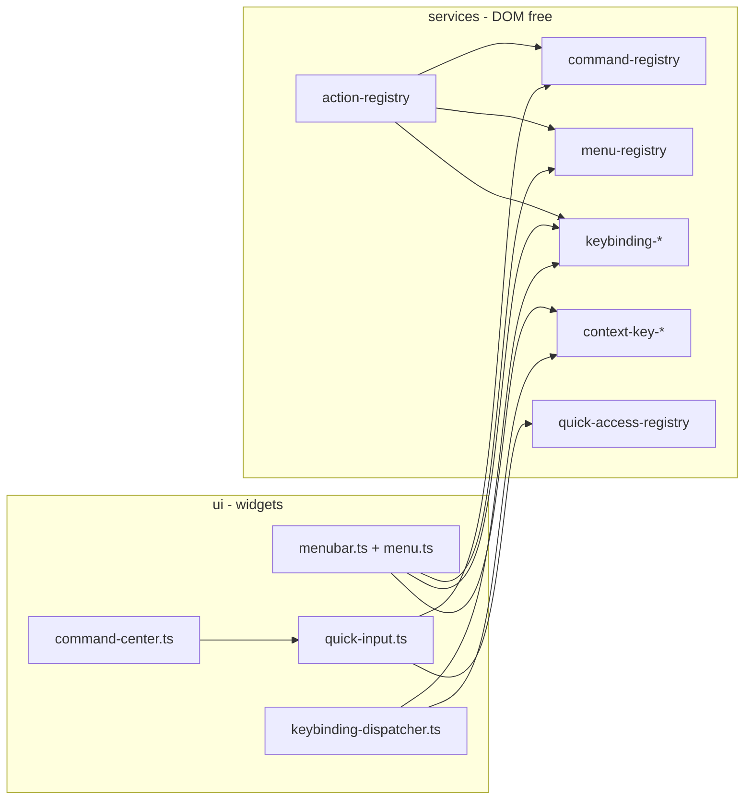

# Workshop Menu Overhaul - Cursor Parity

<product-contract>

## Product Requirements

The PromptForge workshop is an IDE shell for writing and running PromptForge prompts, with the agent panel as the product. Its title bar today has five sparse menus (File, Edit, Model, Window, Help) hard-coded in markup; this plan replaces them with Cursor's eight menus and their flyouts, rebuilt on the command/menu/keybinding/context-key/quick-access primitives the VS Code family converges on, plus Cursor's centered title-bar command center. Every capability the workshop already has becomes a named command that works from the menu, the keyboard, and the palette; everything not yet backed renders as a disabled row with its final name and shortcut, so the menus tell the truth about what works.

- Problem and users: the workshop UI (the SPA in `promptforge/crates/workshop-server/ui/`, served by the Rust `workshop-server` crate into a Tauri/WebView2 desktop shell or a plain browser) exposes only a handful of its capabilities, and those through one hand-written menu file. The user is the product owner building toward a robust IDE whose shell behaves like VS Code; end users are PromptForge prompt authors, with the in-app agent as a first-class operator of the same commands.
- Goals:
  - Eight top-level menus (File, Edit, Selection, View, Go, Run, Terminal, Help) whose rows, order, separators, shortcuts, and flyouts match Cursor's, per the spec below.
  - Flyout submenus, two-stroke chord keybindings (Ctrl+M prefix), and a quick-open / command-palette control with a centered title-bar pill, all as first-class mechanisms.
  - Every backed capability wired as a command carrying a VS Code command id, listed in the palette, with its shortcut label derived from the keybinding table rather than typed into the row.
  - Unbacked rows present but disabled, registered under their VS Code ids, so implementing one later changes no menu, test, or keybinding.
  - Undo, redo, and select-all that work equally in CodeMirror editors, the agent's ProseMirror prompt, and future edit boxes (the Run panel).
- Non-goals: no `workshop-server` or protocol changes (the desktop shell crate gains only the macOS window config and a `quit` command that reuses the existing menu handler); no browser panel (designed, deferred); no debugger, terminal, search-across-files, source control, or language-server features (their rows are stubs); no multi-window support; no Model menu (the agent toolbar's model picker covers model selection); no recursive file index behind Ctrl+P.
- Success criteria: the eight menus render the spec's rows with correct enabled/disabled state; every wired row performs its action from menu, shortcut, and palette; flyouts and chords behave as specified; the pill opens the modes list; the full test suite, typecheck, and bundle build pass with the lazy chunk split intact.
- Constraints:
  - This plan is self-contained and needs no conversation history. Paths are relative to the workspace root `c:\Users\Vinnie\cursor`, which holds the `promptforge` repository (the code under test), `promptforge-design` (research), and `cabinet` (staging; superseded files go to `cabinet/_trash/`). The frontmatter todos mirror the work items in Execution Instructions; mark each `in_progress` then `completed` as it lands.
  - The existing stack is fixed: plain-DOM TypeScript bundled by esbuild, CodeMirror 6 editors, dockview panels, Tauri 2 shell; layering rule `base/ -> services/ -> ui/` with `main.ts` as composition root (`promptforge/crates/workshop-server/ui/AGENTS.md`).
  - Shared state lives in services with change emitters; no mutable module globals (`promptforge/crates/workshop-server/ui/AGENTS.md`).
  - The server owns workbench state; the UI renders and dispatches.
  - Superseded files are moved to `cabinet/_trash/`, never deleted.
  - Each change leaves the test suite, typecheck, and bundle build green.
- Open questions: None

## Functional Specification

The observable surface is eight menus, fourteen flyouts, the keybindings, and the quick-access control. Roughly sixty commands are wired; every wired row is a VS Code command id (one exception, marked: `workbench.action.newAgentsWindow`) with `f1: true`, so the palette lists exactly what the workshop can do. Stub rows keep their VS Code ids with `precondition: "false"`. Group names are VS Code's menubar groups, so separators fall where Cursor's do.

- Actors and workflows: the human drives everything through the menubar, keybindings, the command-center pill, and quick open. The agent is a future actor over the same command ids: an agent tool that executes `executeCommand(id, ...args)` inherits the same preconditions and UI state changes, which is why every wired row carries a VS Code id.
- Inputs and outputs: the menu spec, flyout contents, and command catalog below are the complete input surface. Outputs are the actions' effects (panels opened, editors mutated, settings flipped) plus the status bar's transient messages (chord pending, unrecognized chord, local failures).
- States and validation: menu row state derives from context keys (table below): `when` hides a row, `precondition` disables it, `toggled` checks it. Stub rows are `precondition: "false"`. Open Recent is dynamic: roots and recent files at open time, empty submenu dropped when both are empty. Editor toggles (word wrap, whitespace, control characters, column selection) persist through a settings service and reflect as check marks.
- Errors and recovery: a menu placement whose command is missing renders disabled with the id as its label (existing behavior in `promptforge/crates/workshop-server/ui/src/ui/menu/menu-renderer.ts`). Malformed `when`/`precondition`/keybinding strings fail at registration with a returned error, never at render. An unrecognized second chord shows `The key combination (Ctrl+M, X) is not a command.` for three seconds; pending chords clear on a five-second timeout or window blur. File pickers treat cancel as a no-op. Revert and close on a dirty editor prompt through the existing editor dialog (`promptforge/crates/workshop-server/ui/src/ui/editor/editor-dialog.ts`). Async command failures surface on the status bar.
- Security and privacy behavior: no new network surface and no CSP change (`promptforge/crates/workshop-server/src/csp.rs` is untouched). `document.execCommand` stays scoped to the tracked editable target, as today. Recent files, editor settings, and command history persist only in `localStorage`. Desktop-only actions (quit, full screen, native pickers, close window) are disabled in a plain browser via `!isWeb`.
- Acceptance criteria:
  - Opening each of the eight menus shows exactly the spec's rows in order, with separators where the spec has them, shortcuts from the keybinding table, and disabled stubs greyed.
  - Each wired row in the catalog performs its backing action from the menu, from its keybinding, and from the palette.
  - Submenus open on hover and ArrowRight, close on ArrowLeft, and nest two levels (Preferences > Themes; Appearance > Panel Position et al.).
  - Ctrl+M enters chord state with the status message; each spec chord dispatches; timeout, blur, and unknown second keys recover as specified.
  - The pill shows the workspace name (first granted root's folder, else `PromptForge`), opens the modes list on click and the help list on its chevron; Ctrl+P opens file mode, Ctrl+Shift+P the palette.
  - Undo/redo/select-all operate in a CodeMirror editor, in the agent prompt, and in a native input, each through its own history.

### Menu spec (source: Cursor's menus, captured from screenshots)

#### File
- New Text File - Ctrl+N - **wire** (`workbench.action.files.newUntitledFile`: an untitled editor buffer; Save on it runs Save As)
- New Window - Ctrl+Shift+N - stub
- New Agents Window - Ctrl+Alt+N - **wired** (existing `openNewAgent` in `promptforge/crates/workshop-server/ui/src/main.ts`)
- New Window with Profile > - submenu, stub
- --
- Open File... - Ctrl+O - **wire** (`workbench.action.files.openFile`: `plugin-dialog` `open()`, `grantPath`, open an editor; browser mode uses the tree's typed-path dialog in `promptforge/crates/workshop-server/ui/src/ui/layout/workshop-panel.ts`)
- Open Folder... - Ctrl+M Ctrl+O - **wire, chord** (`workbench.action.files.openFolder`: the tree's existing Add Folder flow)
- Open Workspace from File... - stub
- Open Recent > - submenu, **wired** (dynamic; flyout contents below)
- --
- Add Folder to Workspace... - **wire** (`workbench.action.addRootFolder`: same flow as Open Folder; the workshop is multi-root, so the two rows share one implementation)
- Save Workspace As... - stub
- Duplicate Workspace - stub
- --
- Save - Ctrl+S - **wired** (`workbench.action.files.save`)
- Save As... - Ctrl+Shift+S - **wire** (`workbench.action.files.saveAs`: `plugin-dialog` `save()`, grant the parent if needed, `writeFile`, retarget the editor; `precondition: "!isWeb && activeEditor"`)
- Save All - Ctrl+M S - **wire, chord** (`workbench.action.files.saveAll`: save every dirty editor panel)
- --
- Share > - submenu, stub
- Auto Save - stub (toggle)
- Preferences > - submenu (Settings wired; contents below)
- --
- Revert File - **wire** (`workbench.action.files.revert`: reload the active editor from disk, prompting on unsaved changes)
- Close Editor - Ctrl+F4 - **wired** (`workbench.action.closeActiveEditor`, rebound from Ctrl+W)
- Close Folder - Ctrl+M F - stub, chord (multi-root has no single folder to close)
- Close Window - Alt+F4 - **wired** (`workbench.action.closeWindow`)
- --
- Exit - **wire** (`workbench.action.quit`: the shell's quit command, sharing the native menu's gateway-shutdown-then-exit path; `precondition: "!isWeb"`)

#### Edit
- Undo - Ctrl+Z - **wired** (`undo`: the focused text control's adapter - CodeMirror editors, the agent's ProseMirror prompt, future Run-panel boxes - else `execCommand`)
- Redo - Ctrl+Y - **wired** (`redo`: same routing)
- --
- Cut - Ctrl+X - **wired** (`editor.action.clipboardCutAction`, `execCommand`; CodeMirror and ProseMirror serve it through the clipboard events)
- Copy - Ctrl+C - **wired** (`editor.action.clipboardCopyAction`)
- Paste - Ctrl+V - **wired** (`editor.action.clipboardPasteAction`)
- --
- Find - Ctrl+F - **wire** (`actions.find`: CodeMirror `openSearchPanel`)
- Replace - Ctrl+H - **wire** (`editor.action.startFindReplaceAction`: `openSearchPanel` then focus the replace field)
- --
- Find in Files - Ctrl+Shift+F - stub
- Replace in Files - Ctrl+Shift+H - stub
- --
- Toggle Line Comment - Ctrl+/ - **wire** (`editor.action.commentLine`: CodeMirror `toggleLineComment`)
- Toggle Block Comment - Shift+Alt+A - **wire** (`editor.action.blockComment`: CodeMirror `toggleBlockComment`)
- Emmet: Expand Abbreviation - Tab - stub

#### Selection
- Select All - Ctrl+A - **wired** (`editor.action.selectAll`: the focused text control's adapter, else `execCommand`)
- Expand Selection - Shift+Alt+RightArrow - **wire** (`editor.action.smartSelect.expand`: CodeMirror `selectParentSyntax`)
- Shrink Selection - Shift+Alt+LeftArrow - **wire** (`editor.action.smartSelect.shrink`: pops the selection stack `smartSelect.expand` pushes; empty stack is a no-op)
- --
- Copy Line Up - Shift+Alt+UpArrow - **wire** (`editor.action.copyLinesUpAction`: CodeMirror `copyLineUp`)
- Copy Line Down - Shift+Alt+DownArrow - **wire** (`editor.action.copyLinesDownAction`: `copyLineDown`)
- Move Line Up - Alt+UpArrow - **wire** (`editor.action.moveLinesUpAction`: `moveLineUp`)
- Move Line Down - Alt+DownArrow - **wire** (`editor.action.moveLinesDownAction`: `moveLineDown`)
- Duplicate Selection - **wire** (`editor.action.duplicateSelection`: empty selection -> `copyLineDown`; otherwise insert the selected text after each range - a short custom `StateCommand`)
- --
- Add Cursor Above - Ctrl+Alt+UpArrow - **wire** (`editor.action.insertCursorAbove`: custom `StateCommand` adding a range one line up at the same column for each head)
- Add Cursor Below - Ctrl+Alt+DownArrow - **wire** (`editor.action.insertCursorBelow`: same, one line down)
- Add Cursors to Line Ends - Shift+Alt+I - **wire** (`editor.action.insertCursorAtEndOfEachLineSelected`: one cursor at the end of every line the selection touches)
- Add Next Occurrence - Ctrl+D - **wire** (`editor.action.addSelectionToNextFindMatch`: CodeMirror `selectNextOccurrence`)
- Add Previous Occurrence - **wire** (`editor.action.addSelectionToPreviousFindMatch`: `SearchCursor` from the first range backwards, wrapping)
- Select All Occurrences - **wire** (`editor.action.selectHighlights`: CodeMirror `selectSelectionMatches`; no keybinding, matching Cursor's row)
- --
- Switch to Ctrl+Click for Multi-Cursor - stub (a setting with no consumer yet)
- Column Selection Mode - **wire** (`editor.action.toggleColumnSelection`: a `Compartment` swapping in `rectangularSelection({ eventFilter: () => true })`; `toggled: "config.editor.columnSelection"`)

The custom `StateCommand`s (duplicate selection, insert cursor above/below/at line ends, previous occurrence) are each under 20 lines over `EditorSelection` and `SearchCursor`; they live beside the existing save/close/cycle commands in `promptforge/crates/workshop-server/ui/src/ui/editor/editor-commands.ts`.

#### View
- Command Palette... - Ctrl+Shift+P - **wired** (`workbench.action.showCommands`)
- Open View... - stub
- --
- Appearance > - submenu (contents below)
- Editor Layout > - submenu (contents below)
- --
- Explorer - Ctrl+Shift+E - **wired** (`workbench.view.explorer`: shows and focuses the tree; absorbs the old `workshop.focusTree`, whose Ctrl+Shift+F is released to Search)
- Search - Ctrl+Shift+F - stub
- Source Control - Ctrl+Shift+G - stub
- Run - Ctrl+Shift+D - stub
- Extensions - Ctrl+Shift+X - stub
- --
- Problems - Ctrl+Shift+M - stub
- Output - Ctrl+Shift+U - stub
- Debug Console - Ctrl+Shift+Alt+Y - stub
- Terminal - Ctrl+` - stub
- --
- Word Wrap - Alt+Z - **wire** (`editor.action.toggleWordWrap`: `EditorView.lineWrapping` behind a `Compartment` in every editor, driven by the editor settings service; `toggled: "config.editor.wordWrap"`)

Zoom lives in Appearance (where Cursor has it). Gateway Config lives at File > Preferences > Settings (Ctrl+,).

#### Go
- Back - Alt+LeftArrow - stub
- Forward - Alt+RightArrow - stub
- Last Edit Location - Ctrl+M Ctrl+Q - stub, chord
- --
- Switch Editor > - submenu (Next/Previous wired; contents below)
- Switch Group > - submenu, stub
- --
- Go to File... - Ctrl+P - **wired** (`workbench.action.quickOpen`)
- Go to Symbol in Workspace... - Ctrl+T - stub
- --
- Go to Symbol in Editor... - Ctrl+Shift+O - stub
- Go to Definition - F12 - stub
- Go to Declaration - stub
- Go to Type Definition - stub
- Go to Implementations - Ctrl+F12 - stub
- Add Symbol to Current Chat - Ctrl+L - stub
- Go to References - Shift+F12 - stub
- Add Symbol to New Chat - Ctrl+Shift+L - stub
- --
- Go to Line/Column... - Ctrl+G - **wired** (`workbench.action.gotoLine`, opens quick input with `:`)
- Go to Bracket - Ctrl+Shift+\ - **wire** (`editor.action.jumpToBracket`: CodeMirror `cursorMatchingBracket`)
- --
- Next Problem - F8 - **wire** (`editor.action.marker.nextInFiles`: CodeMirror `nextDiagnostic` from `@codemirror/lint`, already installed; a no-op until an editor has diagnostics)
- Previous Problem - Shift+F8 - **wire** (`editor.action.marker.prevInFiles`: `previousDiagnostic`)
- --
- Next Change - Alt+F3 - stub
- Previous Change - Shift+Alt+F3 - stub

#### Run
- Start Debugging - F5 - stub
- Run Without Debugging - Ctrl+F5 - stub
- Stop Debugging - Shift+F5 - stub
- Restart Debugging - Ctrl+Shift+F5 - stub
- --
- Open Configurations - stub
- Add Configuration... - stub
- --
- Step Over - F10 - stub
- Step Into - F11 - stub
- Step Out - Shift+F11 - stub
- Continue - F5 - stub
- --
- Toggle Breakpoint - F9 - stub
- New Breakpoint > - submenu, stub
- --
- Enable All Breakpoints - stub
- Disable All Breakpoints - stub
- Remove All Breakpoints - stub
- --
- Install Additional Debuggers... - stub

#### Terminal
- New Terminal - Ctrl+Shift+` - stub
- Split Terminal - Ctrl+Shift+5 - stub
- --
- Run Task... - stub
- Run Build Task... - Ctrl+Shift+B - stub
- Run Active File - stub
- Run Selected Text - stub
- --
- Show Running Tasks... - stub
- Restart Running Task... - stub
- Terminate Task... - stub
- --
- Configure Tasks... - stub
- Configure Default Build Task... - stub

#### Help
- Show All Commands - Ctrl+Shift+P - **wired** (`workbench.action.showCommands`, second placement)
- Show Release Notes - stub
- --
- Report Issue - Ctrl+M Ctrl+G - stub, chord
- Give Feedback... - stub
- --
- View License - stub
- --
- Toggle Developer Tools - stub (the `workshop` crate exposes no devtools command today; wiring needs a Tauri command behind the `devtools` feature)
- Open Process Explorer - stub
- --
- About - **wired** (existing `showAboutDialog` in `promptforge/crates/workshop-server/ui/src/ui/chrome/about-dialog.ts`)

### Flyout contents

Five flyouts and one nested flyout come from Cursor screenshots. The rest are VS Code's defaults, unverified against Cursor; correcting a screenshot changes rows, nothing else.

#### File > New Window with Profile (VS Code default, unverified)
- Dynamic: one row per profile (radio, current checked) - stub
- --
- New Profile... - stub

#### File > Open Recent (Cursor) - dynamic provider
- Reopen Closed Editor - Ctrl+Shift+T - **wire** (the editor directory keeps a closed-editor stack)
- --
- Dynamic: workspace roots (the granted roots) - **wire** (re-focus the tree on that root)
- --
- Dynamic: recent files, most recent first - **wire** (the same store quick open's `""` provider reads; accept opens an editor)
- --
- More... - Ctrl+R - **wire** (`workbench.action.quickOpen` with the recent list)
- --
- Clear Recently Opened... - **wire** (clears the store)

#### File > Share (VS Code default, unverified)
- Export Profile... - stub
- Import Profile... - stub

#### File > Preferences (Cursor)
- Profiles - stub
- Settings - Ctrl+, - **wired** (opens the Gateway Config panel; Cursor shows "Cursor Settings" + "VS Code Settings", the workshop has one settings surface)
- Extensions - Ctrl+Shift+X - stub
- Keyboard Shortcuts - Ctrl+M Ctrl+S - stub, chord
- Configure Snippets - stub
- Tasks - stub
- Themes > - submenu (below)
- --
- Online Services Settings - stub

#### File > Preferences > Themes (VS Code default, unverified)
- Color Theme - Ctrl+M Ctrl+T - stub, chord
- File Icon Theme - stub
- Product Icon Theme - stub

#### View > Appearance (Cursor)
- Full Screen - F11 - **wire** (`workbench.action.toggleFullScreen`: `getCurrentWindow().setFullscreen(!await isFullscreen())` from `@tauri-apps/api/window`, already imported by `promptforge/crates/workshop-server/ui/src/ui/chrome/window-chrome.ts`; `precondition: "!isWeb"`, `toggled: "isFullscreen"`)
- Zen Mode - Ctrl+M Z - stub, chord
- Centered Layout - stub
- Open Browser - stub (see Deferred and Out of Scope)
- --
- Menu Bar - stub (toggled, checked)
- Primary Side Bar - Ctrl+B - **wired** (`workbench.action.toggleSidebarVisibility`, renamed from `workshop.togglePanel`; `toggled: "sideBarVisible"`)
- Secondary Side Bar - Ctrl+Alt+B - **wire** (`workbench.action.toggleAuxiliaryBar`: toggle the agent zone; `toggled: "auxiliaryBarVisible"`)
- Status Bar - **wire** (`workbench.action.toggleStatusbarVisibility`; `toggled: "statusBarVisible"`)
- Panel - Ctrl+J - stub (toggled, checked in Cursor; the workshop has no bottom panel)
- --
- Move Primary Side Bar Right - stub
- Panel Position > - submenu, stub (Top / Left / Right / Bottom, radio)
- Align Panel > - submenu, stub (Center / Justify / Left / Right, radio)
- Tab Bar > - submenu, stub (Multiple Tabs / Single Tab / Hidden, radio)
- Editor Actions Position > - submenu, stub (Tab Bar / Title Bar / Hidden, radio)
- --
- Minimap - stub (toggled)
- Toggle Breadcrumbs - stub
- Sticky Scroll - stub (toggled)
- Render Whitespace - **wire** (`editor.action.toggleRenderWhitespace`: `highlightWhitespace()` behind a `Compartment`; `toggled: "config.editor.renderWhitespace"`)
- Render Control Characters - **wire** (`editor.action.toggleRenderControlCharacter`: `highlightSpecialChars()` behind a `Compartment`, on by default as in Cursor; `toggled: "config.editor.renderControlCharacters"`)
- --
- Zoom In - Ctrl+= - **wired** (`workbench.action.zoomIn`)
- Zoom Out - Ctrl+- - **wired** (`workbench.action.zoomOut`)
- Reset Zoom - Ctrl+NumPad0 - **wired** (`workbench.action.zoomReset`; second rule `ctrl+0`; the label shows the first)

#### View > Editor Layout (Cursor)
- Split Up - Ctrl+M Ctrl+\ - **wire** (`workbench.action.splitEditorUp`: dockview `addGroup` in direction, move the active panel; chord)
- Split Down - **wire** (`workbench.action.splitEditorDown`)
- Split Left - **wire** (`workbench.action.splitEditorLeft`)
- Split Right - **wire** (`workbench.action.splitEditorRight`)
- --
- Move Editor into New Window - stub
- Copy Editor into New Window - Ctrl+M O - stub, chord
- --
- Single - stub
- Two Columns - stub
- Three Columns - stub
- Two Rows - stub
- Three Rows - stub
- Grid (2x2) - stub
- Two Rows Right - stub
- Two Columns Bottom - stub
- --
- Flip Layout - Shift+Alt+0 - stub

#### Go > Switch Editor (VS Code default, unverified)
- Next Editor - Ctrl+PageDown - **wired** (`workbench.action.nextEditor`: existing `cycleEditor(1)`; Ctrl+Tab stays as a second rule)
- Previous Editor - Ctrl+PageUp - **wired** (`workbench.action.previousEditor`: `cycleEditor(-1)`; Ctrl+Shift+Tab stays)
- --
- Next Used Editor - stub
- Previous Used Editor - stub
- --
- Next Editor in Group - Ctrl+M Ctrl+PageDown - stub, chord
- Previous Editor in Group - Ctrl+M Ctrl+PageUp - stub, chord
- --
- Next Used Editor in Group - stub
- Previous Used Editor in Group - stub

#### Go > Switch Group (VS Code default, unverified)
- Group 1 - Ctrl+1 - stub
- Group 2 - Ctrl+2 - stub
- Group 3 - Ctrl+3 - stub
- Group 4 - stub
- Group 5 - stub
- --
- Next Group - stub
- Previous Group - stub
- --
- Group Left - Ctrl+M Ctrl+LeftArrow - stub, chord
- Group Right - Ctrl+M Ctrl+RightArrow - stub, chord
- Group Above - Ctrl+M Ctrl+UpArrow - stub, chord
- Group Below - Ctrl+M Ctrl+DownArrow - stub, chord

#### Run > New Breakpoint (Cursor)
- Conditional Breakpoint... - stub
- Edit Breakpoint - stub
- Inline Breakpoint - Shift+F9 - stub
- Function Breakpoint... - stub
- Logpoint... - stub
- Triggered Breakpoint... - stub

Flyout count: 9 declared on the menubar menus plus 5 nested (Themes, Panel Position, Align Panel, Tab Bar, Editor Actions Position) = 14 submenus, two levels deep at most. Radio rows (Panel Position and the like) use the checkable-row rendering via `toggled`.

### Context keys

Names are VS Code's where VS Code has one; settings-backed toggles use VS Code's `config.<setting>` convention. Each key is bound by the feature that owns its source.

| Key | Set by | Used by |
|---|---|---|
| `editorTextFocus` | the text-control service when the active adapter is `codemirror` | keybinding `when` on every `editor.action.*` so Alt+Up in the agent prompt never moves a line |
| `textInputFocus` | the text-control service when any adapter or native editable has focus (VS Code's key) | `precondition` on undo, redo, cut, copy, paste, selectAll |
| `inputFocus` | the text-control service's focus tracker (VS Code's key for a focused native input or textarea) | distinguishes the `execCommand` fallback path |
| `editorLangId` | the editor surface from its language compartment (`promptforge`, `lua`, `markdown`, ...) | nothing in this plan; the seam for prompt-only rows later (`when: editorLangId == 'promptforge'` on Go to Definition, Run, breakpoints) |
| `activeEditor` | the editor directory on dock active-panel change (the panel id, or unset) | menu `precondition` on every `editor.action.*` and `workbench.action.files.*` row |
| `isWeb` | window-chrome on boot (true in a plain browser) | `!isWeb` on closeWindow, quit, toggleFullScreen, files.openFile/saveAs |
| `isMac`, `isLinux`, `isWindows` | window-chrome on boot from the platform (VS Code's keys) | per-OS keybinding overrides; future platform-gated rows |
| `isFullscreen` | window-chrome from the Tauri window | Appearance > Full Screen `toggled` |
| `sideBarVisible` | layout on tree toggle | Appearance > Primary Side Bar `toggled` |
| `auxiliaryBarVisible` | layout on agent-zone toggle | Appearance > Secondary Side Bar `toggled` |
| `statusBarVisible` | the status bar toggle | Appearance > Status Bar `toggled` |
| `config.editor.wordWrap`, `config.editor.renderWhitespace`, `config.editor.renderControlCharacters`, `config.editor.columnSelection` | the editor settings service on change | the four editor toggles' `toggled` |
| `chordPending` | the keybinding dispatcher | status bar |

### Command catalog (wired)

Every row has `f1: true` and appears in the palette. Keybinding `when` is `editorTextFocus` for every `editor.action.*` row and for the editor-owned `workbench.action.*` rows; menu `precondition` is `activeEditor` for those rows unless the column says otherwise. Owner is the contribution file that registers the action.

| Command id | Title | Menu / group | Keybinding | precondition / when / toggled | Owner | Backing |
|---|---|---|---|---|---|---|
| `workbench.action.files.newUntitledFile` | New Text File | File `1_new` | `ctrl+n` | - | editor | untitled `EditorPanel`; save runs Save As |
| `workbench.action.newAgentsWindow` (ours; Cursor's id is not public) | New Agents Window | File `1_new` | `ctrl+alt+n` | - | agent | existing `openNewAgent` |
| `workbench.action.files.openFile` | Open File... | File `2_open` | `ctrl+o` | `!isWeb` | files | `plugin-dialog` `open()`, `grantPath`, open editor |
| `workbench.action.files.openFolder` | Open Folder... | File `2_open` | `ctrl+m ctrl+o` | - | files | tree's `addFolder` flow (picker or typed path) |
| `workbench.action.addRootFolder` | Add Folder to Workspace... | File `3_workspace` | - | - | files | same flow |
| `workbench.action.files.save` | Save | File `4_save` | `ctrl+s` | `activeEditor` | editor | `EditorPanel.save` |
| `workbench.action.files.saveAs` | Save As... | File `4_save` | `ctrl+shift+s` | `!isWeb && activeEditor` | files | `plugin-dialog` `save()`, `grantPath` parent, `writeFile`, retarget panel |
| `workbench.action.files.saveAll` | Save All | File `4_save` | `ctrl+m s` | - | files | every dirty `EditorPanel`, saved sequentially with `for...of` (never `Promise.all` or async `forEach`): the save path is race-pinned by `editor-save-race.mjs` |
| `workbench.action.openSettings` | Settings | Preferences `1_settings` | `ctrl+,` | - | gateway | Gateway Config panel |
| `workbench.action.files.revert` | Revert File | File `6_close` | - | `activeEditor` | files | panel `load`, dirty prompt via `editor-dialog` |
| `workbench.action.closeActiveEditor` | Close Editor | File `6_close` | `ctrl+f4` | `activeEditor` | editor | `requestClose` |
| `workbench.action.closeWindow` | Close Window | File `6_close` | `alt+f4`; `mac: "meta+shift+w"` | `!isWeb` | chrome | window-chrome `closeWindow` |
| `workbench.action.quit` | Exit | File `z_Exit` | - | `!isWeb` | chrome | invokes the shell's `quit` Tauri command - the same gateway-shutdown-then-exit path the native menu's quit item runs (`promptforge/crates/workshop/src/menu.rs`), never `plugin-process` `exit(0)`, which would strand the sidecar gateway |
| `workbench.action.reopenClosedEditor` | Reopen Closed Editor | Open Recent `1_editor` | `ctrl+shift+t` | - | editor | closed-editor stack |
| `vscode.open` | (one row per recent file) | Open Recent `3_files` (provider) | - | args: `[path]`; narrows `args[0]` to string | workspace | open editor at `path`; also what the `""` quick-access provider's accept calls |
| `workbench.action.openRecent` | More... | Open Recent `y_more` | `ctrl+r` | - | workspace | `quickAccess.show("")` |
| `workbench.action.clearRecentFiles` | Clear Recently Opened... | Open Recent `z_clear` | - | - | workspace | `RecentFilesStore.clear` |
| `undo` | Undo | Edit `1_do` | `ctrl+z` | `textInputFocus` | edit | `textControls.active?.undo()` (CodeMirror, ProseMirror, future Run-panel adapters), else `execCommand` |
| `redo` | Redo | Edit `1_do` | `ctrl+y` | `textInputFocus` | edit | same routing |
| `editor.action.clipboardCutAction` | Cut | Edit `2_ccp` | `ctrl+x` | `textInputFocus` | edit | `execCommand("cut")` |
| `editor.action.clipboardCopyAction` | Copy | Edit `2_ccp` | `ctrl+c` | `textInputFocus` | edit | `execCommand("copy")` |
| `editor.action.clipboardPasteAction` | Paste | Edit `2_ccp` | `ctrl+v` | `textInputFocus` | edit | `execCommand("paste")` |
| `actions.find` | Find | Edit `3_find` | `ctrl+f` | | editor | `openSearchPanel` |
| `editor.action.startFindReplaceAction` | Replace | Edit `3_find` | `ctrl+h` | | editor | `openSearchPanel` + focus replace field |
| `editor.action.commentLine` | Toggle Line Comment | Edit `5_insert` | `ctrl+/` | | editor | `toggleLineComment` |
| `editor.action.blockComment` | Toggle Block Comment | Edit `5_insert` | `shift+alt+a` | | editor | `toggleBlockComment` |
| `editor.action.selectAll` | Select All | Selection `1_basic` | `ctrl+a` | `textInputFocus` | edit | `textControls.active?.selectAll()`, else `execCommand` |
| `editor.action.smartSelect.expand` | Expand Selection | Selection `1_basic` | `shift+alt+right` | | editor | `selectParentSyntax`, pushes selection stack |
| `editor.action.smartSelect.shrink` | Shrink Selection | Selection `1_basic` | `shift+alt+left` | | editor | pops selection stack |
| `editor.action.copyLinesUpAction` | Copy Line Up | Selection `2_line` | `shift+alt+up` | | editor | `copyLineUp` |
| `editor.action.copyLinesDownAction` | Copy Line Down | Selection `2_line` | `shift+alt+down` | | editor | `copyLineDown` |
| `editor.action.moveLinesUpAction` | Move Line Up | Selection `2_line` | `alt+up` | | editor | `moveLineUp` |
| `editor.action.moveLinesDownAction` | Move Line Down | Selection `2_line` | `alt+down` | | editor | `moveLineDown` |
| `editor.action.duplicateSelection` | Duplicate Selection | Selection `2_line` | - | | editor | custom: empty -> `copyLineDown`, else insert after each range |
| `editor.action.insertCursorAbove` | Add Cursor Above | Selection `3_multi` | `ctrl+alt+up` | | editor | custom over `EditorSelection` |
| `editor.action.insertCursorBelow` | Add Cursor Below | Selection `3_multi` | `ctrl+alt+down` | | editor | custom |
| `editor.action.insertCursorAtEndOfEachLineSelected` | Add Cursors to Line Ends | Selection `3_multi` | `shift+alt+i` | | editor | custom |
| `editor.action.addSelectionToNextFindMatch` | Add Next Occurrence | Selection `3_multi` | `ctrl+d` | | editor | `selectNextOccurrence` |
| `editor.action.addSelectionToPreviousFindMatch` | Add Previous Occurrence | Selection `3_multi` | - | | editor | custom over `SearchCursor`, backwards, wrapping |
| `editor.action.selectHighlights` | Select All Occurrences | Selection `3_multi` | - | | editor | `selectSelectionMatches` |
| `editor.action.toggleColumnSelection` | Column Selection Mode | Selection `4_config` | - | toggled `config.editor.columnSelection` | editor | `rectangularSelection` compartment |
| `workbench.action.showCommands` | Command Palette... / Show All Commands | View `1_open`; Help `1_welcome` | `ctrl+shift+p`, `f1` | - | menu | `quickAccess.show(">")` |
| `workbench.view.explorer` | Explorer | View `3_views` | `ctrl+shift+e` | - | layout | show and focus the tree |
| `editor.action.toggleWordWrap` | Word Wrap | View `5_editor` | `alt+z` | toggled `config.editor.wordWrap`; no precondition | editor | settings service + `lineWrapping` compartment |
| `workbench.action.toggleFullScreen` | Full Screen | Appearance `1_toggle_view` | `f11`; `mac: "ctrl+meta+f"` | `!isWeb`; toggled `isFullscreen` | chrome | `getCurrentWindow().setFullscreen` |
| `workbench.action.toggleSidebarVisibility` | Primary Side Bar | Appearance `2_workbench_layout` | `ctrl+b` | toggled `sideBarVisible` | layout | existing tree toggle |
| `workbench.action.toggleAuxiliaryBar` | Secondary Side Bar | Appearance `2_workbench_layout` | `ctrl+alt+b` | toggled `auxiliaryBarVisible` | layout | agent group `api.setVisible` |
| `workbench.action.toggleStatusbarVisibility` | Status Bar | Appearance `2_workbench_layout` | - | toggled `statusBarVisible` | status | status bar element |
| `editor.action.toggleRenderWhitespace` | Render Whitespace | Appearance `4_editor` | - | toggled `config.editor.renderWhitespace`; no precondition | editor | `highlightWhitespace` compartment |
| `editor.action.toggleRenderControlCharacter` | Render Control Characters | Appearance `4_editor` | - | toggled `config.editor.renderControlCharacters`; no precondition | editor | `highlightSpecialChars` compartment |
| `workbench.action.zoomIn` | Zoom In | Appearance `5_zoom` | `ctrl+=` | - | chrome | existing |
| `workbench.action.zoomOut` | Zoom Out | Appearance `5_zoom` | `ctrl+-` | - | chrome | existing |
| `workbench.action.zoomReset` | Reset Zoom | Appearance `5_zoom` | `ctrl+numpad0`, `ctrl+0` | - | chrome | existing |
| `workbench.action.splitEditorUp` | Split Up | Editor Layout `1_split` | `ctrl+m ctrl+\` | `activeEditor` | editor | dockview `addGroup` + `moveTo` |
| `workbench.action.splitEditorDown` | Split Down | Editor Layout `1_split` | - | `activeEditor` | editor | same |
| `workbench.action.splitEditorLeft` | Split Left | Editor Layout `1_split` | - | `activeEditor` | editor | same |
| `workbench.action.splitEditorRight` | Split Right | Editor Layout `1_split` | - | `activeEditor` | editor | same |
| `workbench.action.nextEditor` | Next Editor | Switch Editor `1_sideBySide` | `ctrl+pagedown`, `ctrl+tab` | - | editor | `cycleEditor(1)` |
| `workbench.action.previousEditor` | Previous Editor | Switch Editor `1_sideBySide` | `ctrl+pageup`, `ctrl+shift+tab` | - | editor | `cycleEditor(-1)` |
| `workbench.action.quickOpen` | Go to File... | Go `3_global_nav` | `ctrl+p` | - | menu | `quickAccess.show("")` |
| `workbench.action.gotoLine` | Go to Line/Column... | Go `5_infile_nav` | `ctrl+g` | `activeEditor` | editor | `quickAccess.show(":")` |
| `editor.action.jumpToBracket` | Go to Bracket | Go `5_infile_nav` | `ctrl+shift+\` | | editor | `cursorMatchingBracket` |
| `editor.action.marker.nextInFiles` | Next Problem | Go `6_problem_nav` | `f8` | | editor | `nextDiagnostic` |
| `editor.action.marker.prevInFiles` | Previous Problem | Go `6_problem_nav` | `shift+f8` | | editor | `previousDiagnostic` |
| `workbench.action.showAboutDialog` | About | Help `z_about` | - | - | chrome | existing |
| `workbench.action.quickOpenWithModes` | (command-center pill) | `MenuId.CommandCenter` | - | - | quickinput | `quickAccess.show("", { includeHelp: true })` |
| `workbench.action.quickOpenHelp` | (pill chevron) | - | - | - | quickinput | `quickAccess.show("?")` |

Blank precondition cells on `editor.action.*` rows mean the default: keybinding `when: editorTextFocus`, menu `precondition: activeEditor`.

Stub ids are also VS Code's (`workbench.action.openWorkspace`, `workbench.action.saveWorkspaceAs`, `workbench.action.toggleAutoSave`, `workbench.action.closeFolder`, `workbench.action.newWindow`, `workbench.action.findInFiles`, `workbench.action.replaceInFiles`, `editor.emmet.action.expandAbbreviation`, `workbench.action.navigateBack`, `workbench.action.navigateForward`, `workbench.action.navigateToLastEditLocation`, `workbench.action.showAllSymbols`, `workbench.action.gotoSymbol`, `editor.action.revealDefinition`, `editor.action.revealDeclaration`, `editor.action.goToTypeDefinition`, `editor.action.goToImplementation`, `editor.action.goToReferences`, `workbench.action.editor.nextChange`, `workbench.action.editor.previousChange`, `workbench.action.quickOpenView`, `workbench.view.search`, `workbench.view.scm`, `workbench.view.debug`, `workbench.view.extensions`, `workbench.actions.view.problems`, `workbench.action.output.toggleOutput`, `workbench.debug.action.toggleRepl`, `workbench.action.terminal.toggleTerminal`, `workbench.action.toggleZenMode`, `workbench.action.toggleCenteredLayout`, `workbench.action.toggleMenuBar`, `workbench.action.togglePanel`, `workbench.action.toggleSidebarPosition`, `editor.action.toggleMinimap`, `breadcrumbs.toggle`, `editor.action.toggleStickyScroll`, `workbench.action.moveEditorToNewWindow`, `workbench.action.copyEditorToNewWindow`, `workbench.action.editorLayoutSingle` / `TwoColumns` / `ThreeColumns` / `TwoRows` / `ThreeRows` / `TwoByTwoGrid` / `TwoRowsRight` / `TwoColumnsBottom`, `workbench.action.toggleEditorGroupLayout`, `workbench.action.debug.*`, `editor.debug.action.toggleBreakpoint`, `workbench.action.terminal.new` / `split`, `workbench.action.tasks.runTask` / `build` / ..., `update.showCurrentReleaseNotes`, `workbench.action.openIssueReporter`, `workbench.action.openLicenseUrl`, `workbench.action.toggleDevTools`, `workbench.action.openProcessExplorer`, `workbench.action.openGlobalKeybindings`, `workbench.action.selectTheme`, and the rest per VS Code's default keybindings reference). The stub table is typed `satisfies readonly StubRow[]` so an id or group typo fails to compile. Cursor-only rows with no public id (`Add Symbol to Current Chat`, `New Agents Window`, `Open Browser`) use ids under the `workbench.action.*` namespace.

Keybinding changes versus today: `editor.close` moves from Ctrl+W to Ctrl+F4 (Cursor's binding); Ctrl+B keeps toggling the tree but under Appearance > Primary Side Bar; tree focus moves from Ctrl+Shift+F to Ctrl+Shift+E as View > Explorer, releasing Ctrl+Shift+F to the Search stub; editor cycling gains Ctrl+PageDown/PageUp beside Ctrl+Tab/Ctrl+Shift+Tab; Reset Zoom's primary label becomes Ctrl+NumPad0 with Ctrl+0 still bound. The Alt-based editor chords (Alt+Up, Shift+Alt+Right, Ctrl+Alt+Down) are new and all carry `when: "editorTextFocus"`, so they are inert in the agent prompt and the tree; the capture-phase dispatcher handles them before CodeMirror's own keymap sees the event, so the two never both fire.

</product-contract>
<implementation-contract>

## Technical Design

The mechanics are the VS Code family's: a command registry carrying action metadata, a menu registry keyed by `MenuId` where a submenu is a menu item whose payload is another menu id and the menubar is the root menu's children, a keybinding registry with a pure chord resolver, a context-key service with a `when` expression language, and a prefix-keyed quick-access registry. A field study of seven codebases at pinned commits (microsoft/vscode, eclipse-theia/theia, opensumi/core, voideditor/void, posit-dev/positron, gitpod-io/openvscode-server, coder/code-server) found the two from-scratch reimplementations converged on these names and shapes; the evidence and per-reference citations are at `promptforge-design/research/workshop-steal-vscode-menu-architecture.md`. Registries are DOM-free and live in `services/`; widgets live in `ui/`; the existing layering rule `base/ -> services/ -> ui/` is unchanged.

- Architecture:
  - Registries versus services. `CommandRegistry`, `MenuRegistry`, `KeybindingsRegistry`, and `QuickAccessRegistry` are module-level singletons, as `Commands` and `Menus` are today in `promptforge/crates/workshop-server/ui/src/ui/menu/`: contribution files write to them at module scope, before any service exists. `ContextKeyService`, `QuickInputService`, `EditorSettingsService`, `TextControlService`, and `RecentFilesStore` are services with tokens in `promptforge/crates/workshop-server/ui/src/services/service-registry.ts`, resolved with `getService`, because they hold state whose lifetime the composition root owns. Context keys are bound (`createKey`) in a feature's `register()` or in `main.ts`, never at contribution-module scope; `run` bodies resolve services at call time. This mirrors the panel registry holding metadata eagerly and the service registry holding instances lazily (`promptforge/crates/workshop-server/ui/src/services/panel-registry.ts`).
  - Eager contributions, lazy implementations. Feature `register()` functions run when the feature's chunk loads, and the editor chunk loads on the first opened file, so actions registered there would render as disabled raw ids at boot. Each feature gets an eager `ui/<feature>/<feature>.contribution.ts` holding its `registerAction` calls; `run` is `() => import("./editor-commands").then((m) => m.saveActiveEditor())` for anything that pulls CodeMirror or dockview, and a direct call for light features (chrome, status, layout). `ui/workbench.contributions.ts` is a flat list of side-effect imports of every contribution file (no re-exports); `main.ts` imports it once. `index.ts` keeps `register()` for what belongs to the chunk: the panel factory, chunk-bound quick-access providers, and chunk-sourced context keys (`activeEditor` from the dock's active panel). The bundle guards (`promptforge/crates/workshop-server/ui/test/lazy-css-entry-bundle.mjs`, `lazy-panel-sizing.mjs`) prove contribution files import nothing from CodeMirror or dockview at module scope.
  - One resolver owns every key. The dispatcher listens on `document` in the capture phase, because CodeMirror's keymap runs on its content element and a bubbling listener would fire after it (Alt+Up would move the line twice). On a handled result it calls `preventDefault` and `stopPropagation`; a chord claimed by any rule is swallowed even when its `when` fails, so Ctrl+F with no editor focused never reaches CodeMirror's panel and Ctrl+S never reaches the webview default. Unbound keys fall through untouched. CodeMirror's `defaultKeymap` and `searchKeymap` stay installed for unregistered bindings.
  - Undo is adapter-routed, not kind-branched. A `TextControlService` holds one adapter per text-hosting DOM root and tracks which contains focus; `undo`/`redo`/`selectAll` call the active adapter and fall back to `document.execCommand` for native inputs and textareas. CodeMirror surfaces and the agent's tiptap prompt each register an adapter; the future Run panel registers one, or nothing if its boxes are native.
  - `WorkshopPart` (`promptforge/crates/workshop-server/ui/src/base/workshop-part.ts`) is untouched; future debug views are new `WorkshopPart` subclasses declared through `registerPanelType`.
  - Platform behavior. The SPA is platform-neutral: WKWebView on macOS, WebKitGTK on Linux, WebView2 on Windows, or a plain browser; the registries, menubar, flyouts, quick input, pill, and dispatcher are DOM code and behave identically. The in-window menubar renders on every platform, including macOS: a native macOS system menu bar carrying the full tree is a separate feature, not this plan, and the in-window bar is what keeps the menus testable in a plain browser. Platform differences concentrate in keybindings (the `ctrlcmd` token and `mac`/`linux` overrides above), in the title bar (below), and in OS-level chords the shell owns: Cmd+Q and Cmd+H on macOS are handled by the shell's native menu (`promptforge/crates/workshop/src/menu.rs` already installs the stock macOS menu bar with a quit-everything Cmd+Q item), not the dispatcher. `execCommand` cut/copy/paste/undo in WKWebView and WebKitGTK is expected to work and is verified manually on both platforms before the closing sweep.
  - macOS traffic-light chrome. Today the shell removes window decorations only on Windows (`promptforge/crates/workshop/src/main.rs`, `set_decorations(false)` under `cfg(target_os = "windows")`), so macOS and Linux show the native title bar above the custom one. This plan gives macOS VS Code's treatment: the macOS window config gains `titleBarStyle: "Overlay"` and `hiddenTitle: true` (in `promptforge/crates/workshop/tauri.macos.conf.json` or the window builder), so the native traffic lights float over the webview's top-left with no native title bar. In the SPA, `window-chrome.ts` detects macOS through the shared synchronous `detectPlatform()` from `services/keybinding-parser.ts` (navigator-based; the desktop webview reports `MacIntel` on macOS, and in a plain browser nothing changes because browser mode already hides the cluster) and hides the custom `__right` Windows-style control cluster - the native lights cover close/minimize/zoom and the green light drives native fullscreen, which `isFullscreen` already tracks - while `window-chrome.css` adds a left inset (roughly 78px, VS Code's `hiddenInset` spacing) to `__left` so the icon and menubar clear the lights. Linux keeps the native title bar as today; dropping it for the custom bar is a separate shell decision. The two macOS menu surfaces (the native stock menu and the in-window menubar) coexist for now; growing `menu.rs` into the full tree and hiding the in-window bar on macOS is the follow-up.
- Modules and interfaces:
  - `services/command-registry.ts` (moved from `ui/menu/`): `interface CommandAction { run: (...args: readonly unknown[]) => void | Promise<void>; title?: string; category?: string; precondition?: string; toggled?: string }`; `register(id, action): IDisposable` (upsert), `lookup(id)`, `execute(id, ...args): Promise<boolean>` (false when unregistered). Commands narrow their own args (`typeof args[0] === "string"`), never cast. Non-awaiting callers write `void executeCommand(id, ...args).catch(reportError)` with `reportError` posting to the status bar. The old descriptor's `label`, `shortcut`, and `enabled` fields are gone.
  - `services/menu-registry.ts` (moved from `ui/menu/`): `MenuId` as an `as const` object (`MenubarMainMenu: "menubar"`, `MenubarFileMenu: "menubar/file"`, and the other six, `CommandPalette: "commandPalette"`) with `type MenuId = string` so features add their own; `interface MenuItem { command: string; args?: readonly unknown[]; title?: string; when?: string; group?: string; order?: number }`; `interface SubmenuItem { submenu: MenuId; title: string; when?: string; group?: string; order?: number }`; `appendMenuItem(menuId, item): IDisposable`; `setProvider(menuId, provider: () => readonly MenuItem[]): IDisposable` for dynamic rows read at open; `getMenuItems(menuId)` returning static and provider rows sorted together (group `navigation` first, then groups lexically, then `order`, then title). Separators are group boundaries; there is no separator item kind. `registerMenu` is deleted - a top-level menu is a `SubmenuItem` on `MenubarMainMenu`. Upsert-by-id stays. Open Recent's provider returns its dynamic rows with their own groups so they sort with the static Reopen/More/Clear rows.
  - `services/context-key-service.ts` + `context-key-expr.ts`: `ContextKeyService` with `createKey<T>(name, default): ContextKey<T>` (`set`, `get`, `reset`), `getValue(name)`, `contextMatchesRules(expr)`, `onDidChangeContext: Event<{ affectsSome(keys: ReadonlySet<string>): boolean }>`. `ContextKeyExpr.deserialize(when): Result<ContextKeyExpression, ParseError>` parses `key`, `!key`, `key == 'value'`, `key != 'value'`, `&&`, `||`, parentheses, `true`, `false`; `expr.keys()` returns referenced names so menus and the dispatcher re-evaluate only on relevant changes. One global service, not per-DOM-subtree scoped services; the seam to add `createScoped(element)` later is the service, not its callers.
  - `services/keybinding-parser.ts` + `keybinding-resolver.ts` + `keybinding-registry.ts`: `KeybindingsRegistry.registerKeybindingRule({ id, keybinding, mac?, linux?, when?, weight? })` with the keybinding as a whitespace-separated chord string (`"ctrl+m ctrl+o"`); `mac` and `linux` are optional per-OS overrides, the shape of VS Code's `IKeybindingRule`. `parseKeybinding(text): Result<readonly Chord[], ParseError>`, `Chord = { ctrl, shift, alt, meta, key }`. Modifier tokens: `ctrl`, `shift`, `alt`, `meta` (alias `cmd`), and `ctrlcmd`, which resolves to `meta` on macOS and `ctrl` everywhere else - VS Code's `CtrlCmd`. Every catalog row whose keybinding column shows a `ctrl`-based chord binds `ctrlcmd` in code, so macOS gets Cmd+S, Cmd+P, Cmd+Shift+P, Cmd+comma, and so on without a second table; the spec's columns show the Windows/Linux form. Key vocabulary: letters, digits, `f1`-`f12`, `enter`, `escape`, `tab`, `space`, `backspace`, `delete`, `insert`, `home`, `end`, `pageup`, `pagedown`, `up`/`down`/`left`/`right`, `numpad0`-`numpad9`, punctuation by unshifted glyph (`=`, `-`, `[`, `]`, `\`, `;`, `'`, `,`, `.`, `/`, `` ` ``). A `KeyboardEvent` maps through `event.code`, never `event.key`, so `Ctrl+Shift+=` and `Ctrl+=` both read as `=` and `Numpad0` is distinct from `Digit0`. `getLabel()` renders per platform: `Cmd` on macOS, `Ctrl` elsewhere. `KeybindingResolver.resolve(ctx, pressedChords)` returns `{kind: "NoMatchingKb"} | {kind: "MoreChordsNeeded"} | {kind: "KbFound", commandId}`: index by first chord, prefix-filter, `when`-filter, last registered wins at equal weight. `hasRuleForChord(chord)` answers whether any rule starts with the chord regardless of `when`. `KeybindingWeight` is an `as const` object with VS Code's tiers (`EditorCore: 0`, `EditorContrib: 100`, `WorkbenchContrib: 200`, `BuiltinExtension: 300`, `ExternalExtension: 400`); editor actions register at `EditorContrib`, workbench actions at `WorkbenchContrib`. `lookupKeybinding(commandId)` returns `{ getLabel(): string } | undefined` formatting `Ctrl+M Ctrl+O`; with several rules for one command, the first registered is the label (Reset Zoom shows `Ctrl+NumPad0`; Next Editor shows `Ctrl+PageDown`).
  - `services/action-registry.ts`: `registerAction({ id, title, category?, f1?, precondition?, toggled?, keybinding?: { keybinding, when?, weight? }, menu?: { id: MenuId; group?; order?; when?; args? }[], run }): IDisposable` - writes the command with its metadata, one menu item per `menu` entry plus a `CommandPalette` item when `f1`, and the keybinding rule with `precondition` ANDed into its `when`; returns one `DisposableStore`. `when`/`precondition`/`toggled`/keybinding strings are parsed once at registration and a parse failure is returned, never thrown at render. A second keybinding for one command (Ctrl+0 beside Ctrl+NumPad0) is a separate `registerKeybindingRule` call.
  - `services/quick-access-registry.ts`: `QuickAccessRegistry.registerQuickAccessProvider({ prefix, placeholder, helpEntries: [{ description, prefix }], factory })`; `getQuickAccessProvider(value)` picks the longest matching prefix; `getQuickAccessProviders()` feeds the `?` help list.
  - `services/recent-files-store.ts`: `RecentFilesStore`, localStorage-backed, read through a hand-written shape check; feeds File > Open Recent and the `""` provider.
  - `services/text-control-service.ts`: `interface TextControl { readonly kind: string; undo(): void; redo(): void; selectAll(): void; canUndo?(): boolean; canRedo?(): boolean }`; `register(root: HTMLElement, control: TextControl): IDisposable`; `active: TextControl | null` (the registered control whose root contains `document.activeElement`). Owns the document `focusin` tracker that today lives in `promptforge/crates/workshop-server/ui/src/ui/menu/window-menu.ts` and binds `inputFocus`, `editorTextFocus` (active adapter's `kind` is `codemirror`), and `textInputFocus` (either). `main.ts` resolves the `TEXT_CONTROL_SERVICE` token at boot so the keys exist from first paint. Adapters: `EditorSurface` registers `{ kind: "codemirror", undo: () => undo(view), ... }`; the agent's `prompt-input.ts` registers `{ kind: "prosemirror", undo: () => editor.commands.undo(), ... }` over tiptap, verifying the history plugin is present (if not, no adapter and the `execCommand` fallback stays) and reporting `canUndo`/`canRedo` from the history depth so the command falls back rather than no-ops on an empty stack.
  - `ui/menu/menubar.ts` + `ui/menu/menu.ts` (replacing `menu-renderer.ts`): `menubar.ts` owns the bar (buttons generated from `MenubarMainMenu`'s submenu items in sort order, `data-menu` = the id's last segment so existing test selectors keep working; open-menu state, rollover, ArrowLeft/Right between menus). `menu.ts` is self-sufficient: it owns its own dismissal (Escape, outside pointer, window blur) and takes only a `MenuId`, an anchor, and an optional context value passed as the first `run` argument to every row - so a later context menu (an editor tab's `EditorTitleContext`, a tree row's context) is `Menu` opened at a pointer position with the target as context, with no change to the widget. The menubar composes `Menu`; it does not own dismissal. `menu.ts` owns one popover (rows rebuilt at every open from `getMenuItems`; command rows versus submenu rows; the single child-submenu slot opened on hover/ArrowRight and closed on ArrowLeft; recursive for nested flyouts; group boundaries render separators; empty submenus dropped). Per row: label `item.title ?? command.title`; shortcut `lookupKeybinding(command)?.getLabel()`; hidden when the item's `when` fails; `aria-disabled` when the command's `precondition` fails; `role="menuitemcheckbox"` + `aria-checked` when `toggled` is set; rebuild while open only when `affectsSome(referenced keys)`, restoring focus by row key.
  - `ui/layout/keybinding-dispatcher.ts` (replacing `shortcuts.ts`): the capture-phase listener; `MoreChordsNeeded` -> swallow, set `chordPending`, status `(Ctrl+M) was pressed. Waiting for second key of chord...`, five-second timer; `KbFound` -> swallow, clear, `void executeCommand(commandId).catch(reportError)`; `NoMatchingKb` with pending chords -> clear, status `The key combination (Ctrl+M, X) is not a command.` for three seconds, swallow; `NoMatchingKb` with none pending -> swallow when `hasRuleForChord`, else fall through. Window blur clears pending.
  - `ui/quickinput/quick-input.ts` + `quick-input.css`: `QuickInputService` with `quickAccess.show(value, options)`; a floating panel under the title bar (viewport top in a plain browser) with the WAI-ARIA combobox pattern (`input role="combobox"` with `aria-autocomplete="list"`, `aria-expanded`, `aria-controls`, `aria-activedescendant`, and a visually-hidden `<label>`; `ul role="listbox"` of `li role="option"`). ArrowUp/Down, Enter, Escape; re-route in place on prefix change. Items carry `label`, `description`, optional keybinding label, and `accept()`. Providers: `""` files from the tree state service's fetched listings plus recent files (registered by the workspace contribution; covers only what is already there - no server route, no index); `>` the palette (`CommandPalette` items whose command's `precondition` holds, label `Category: Title`, keybinding label, recently used first via a small localStorage `CommandsHistory`); `:` go to line on the active editor (registered by the editor contribution); `?` help (one row per provider's `helpEntries`); `@`, `%`, `debug `, `task ` registered with `helpEntries` and a "not available" placeholder so the modes list matches Cursor's. `show(value, { includeHelp: true })` with an empty input renders every provider's `helpEntries` above the provider's own items - Cursor's opening list: Go to File, Show and Run Commands, Search for Text, Go to Symbol in Editor, Start Debugging, Run Task, More, then recently opened.
  - `ui/chrome/command-center.ts`: the title bar becomes `__left` (icon + generated menubar nav), `__center` (drag region, hosts the command center as `no-drag`), `__right` (window controls) in `promptforge/crates/workshop-server/ui/index.html`. The command center is a small toolbar over `MenuId.CommandCenter` whose built-in item is the pill: search icon, window title, `?` chevron, width clamped to 38vw with a 600px max, `aria-label="Search files, commands, and more"`. Click runs `workbench.action.quickOpenWithModes`; the chevron runs `workbench.action.quickOpenHelp`. A `WindowTitle` helper shows the first granted root's folder name, else `PromptForge`, re-renders on workspace-grant changes, and sets `document.title`. Quick input anchors to the pill (title-bar bottom edge, centered, same max width).
  - `ui/menu/menubar.contribution.ts`: the eight `SubmenuItem`s on `MenubarMainMenu` and the 14 nested submenu declarations (`menubar/file/newWindowWithProfile`, `.../recent`, `.../share`, `.../preferences`, `.../preferences/themes`, `menubar/view/appearance`, `.../appearance/panelPosition`, `.../appearance/alignPanel`, `.../appearance/tabBar`, `.../appearance/editorActionsPosition`, `menubar/view/editorLayout`, `menubar/go/switchEditor`, `.../switchGroup`, `menubar/run/newBreakpoint`), typed with `satisfies`.
  - `ui/menu/stubs.contribution.ts`: a table of `{ id, title, menu, group, order, keybinding?, toggled? }` rows, `satisfies readonly StubRow[]`, registered in a loop with `precondition: "false"` and `run: () => {}` for every stub row in the menus and flyouts. Rows Cursor shows checked that cannot be backed (Menu Bar, Panel) carry a constant-true `toggled`. Implementing a stub means deleting its row and adding a `registerAction` in the owning feature.
  - `ui/menu/edit.contribution.ts`: `undo`, `redo`, `editor.action.clipboardCutAction`/`CopyAction`/`PasteAction`, `editor.action.selectAll`, all `precondition: "textInputFocus"`, routing through `TextControlService` with the `execCommand` fallback.
  - Editor feature (`ui/editor/`): `runInActiveEditor(command: Command | StateCommand)` resolves the active `EditorView` through the dock and calls the CodeMirror command; `withActiveEditor(fn)` for file-level actions. `EditorSettingsService` (localStorage, `onDidChange`) holds `wordWrap`, `renderWhitespace`, `renderControlCharacters`, `columnSelection`; `EditorSurface` gets one `Compartment` per setting beside its existing `language` and `readOnly` compartments (`promptforge/crates/workshop-server/ui/src/ui/editor/editor-surface.ts`) and sets the four `config.editor.*` keys. Untitled buffers: `EditorPanel` accepts `{ untitled: true }` params, titles itself `Untitled-N`, and its `save()` runs Save As when it has no path. Binds `activeEditor` and `editorLangId`. Registers the `:` provider. Records every opened path into `RecentFilesStore`.
  - Files (`ui/workspace/`): the pickers and file actions per the catalog; the tree's `addFolder` flow lifts from `WorkshopTreePanel` into a function the tree and the actions share; `MenuRegistry.setProvider(MenuId.MenubarRecentMenu, ...)` for the dynamic rows; registers the `""` provider.
  - chrome / layout / status / agent / gateway contributions per the catalog; layout's `toggleAuxiliaryBar` hides and shows the agent zone's dockview group through `group.api.setVisible(...)` so the panel's session socket survives - the panel is never removed.
- File and public API changes:
  - Moved: `ui/menu/command-registry.ts` and `ui/menu/menu-registry.ts` to `services/` (same names). The legacy implementations remain at the old paths as the compatibility layer - re-export shims are infeasible because the shapes changed while `menu-renderer.ts`, `window-menu.ts`, and two feature `index.ts` files still consume the old API; the closing sweep deletes the legacy files once no consumer remains.
  - New under `services/`: `context-key-service.ts`, `context-key-expr.ts`, `keybinding-parser.ts`, `keybinding-resolver.ts`, `keybinding-registry.ts`, `action-registry.ts`, `quick-access-registry.ts`, `recent-files-store.ts`, `text-control-service.ts`.
  - New under `ui/`: `menu/menubar.ts`, `menu/menu.ts`, `menu/menubar.contribution.ts`, `menu/stubs.contribution.ts`, `menu/edit.contribution.ts`, `layout/keybinding-dispatcher.ts`, `quickinput/quick-input.ts`, `quickinput/quick-input.css`, `chrome/command-center.ts`, `workbench.contributions.ts`, and one `<feature>.contribution.ts` per feature (editor, workspace, chrome, layout, status, agent, gateway).
  - Deleted (moved to `cabinet/_trash/`): `ui/menu/menu-renderer.ts`, `ui/menu/window-menu.ts`, `ui/layout/shortcuts.ts`. `setupWindowMenus` survives as a thin bootstrap in `ui/menu/index.ts` that imports `workbench.contributions.ts` and starts the menubar, so tests keep one entry point.
  - Modified: `index.html` (title-bar regions, empty menubar nav); `promptforge/crates/workshop/tauri.macos.conf.json` or the window builder in `promptforge/crates/workshop/src/main.rs` (macOS overlay title-bar style and hidden title - config, not Rust logic); `main.ts` (drops `modelMenu`, `profileMenu`, `ModelMenuService`, `ProfileMenuService`, and the `onModels` menu wiring; imports `workbench.contributions.ts`; resolves `TEXT_CONTROL_SERVICE` at boot; `WorkbenchService` and `ModelService` stay for the agent toolbar); `window-menu.css` (chevron, child-popover offset, title-bar regions, `:focus-visible`, reduced-motion wrap); `tsconfig.json` (`noUncheckedIndexedAccess`, closing sweep); `ui/AGENTS.md` and the `PanelFeatureModule` doc comment in `panel-registry.ts` (the new division of labor: `register()` installs the panel factory, chunk-bound providers, and chunk-sourced keys; actions live in contribution files).
  - The `export * from` lines in every touched feature `index.ts` (editor, chrome, layout, status, workspace, agent, gateway, menu) are removed and importers point at source files; `index.ts` keeps only `register()`.
- Data, persistence, failure, security, and privacy constraints:
  - `localStorage` holds recent files, editor settings, and command history; every read passes a hand-written shape check, arrives as `unknown`, and is never cast.
  - `ContextKeyExpr.deserialize` and `parseKeybinding` return `{ ok: true, value } | { ok: false, error }`; registration reports malformed strings once, at registration.
  - All registrations upsert by id and return disposables that unregister only their own registration, matching the existing registries' semantics.
  - No `enum` (const objects with derived unions), no `any`, explicit return types on exports, `import type` throughout, one concept per file at roughly 300 lines, booleans read `is`/`has`/`can`, files are kebab-case.
  - Markup: controls are `<button type="button">`; the menubar is `<nav aria-label="Application menus">` with `role="menubar"`; rows are `menuitem`, toggled rows `menuitemcheckbox`, submenu rows carry `aria-haspopup="menu"` and `aria-expanded`; `:focus-visible` everywhere with no `outline: none`; the menu fade-in and submenu slide are wrapped in `@media (prefers-reduced-motion: reduce)`; new CSS uses `gap`, logical properties (except JS-set popover coordinates), bare `var(--token)` without fallbacks, and native nesting capped at three levels; no styled IDs, no `!important`; every color, size, and spacing value comes from the `--ws-*` tokens in `promptforge/crates/workshop-server/ui/src/tokens/`, never a raw value (the UI's existing convention).
  - No `workshop-server` changes; `promptforge/crates/workshop-server/src/csp.rs` is untouched; `workshop-socket.ts` and the agent socket are untouched. The desktop shell crate (`promptforge/crates/workshop/`) changes in exactly two places: the macOS window config (overlay title-bar style, hidden title) and a `quit` Tauri command that runs the same logic as `menu.rs`'s quit handler so File > Exit and Cmd+Q cannot diverge.
  - The shell changes follow the workspace's Rust rules (the survey's conventions summary): the shutdown-then-exit logic lifts out of `menu.rs`'s `handle_event` into one function both the menu handler and the `#[tauri::command]` call (a kebab `quit.rs` sibling if the extraction outgrows `menu.rs`; no file past 500 lines); no `unsafe` (forbidden workspace-wide), no `unwrap`/`expect` (denied; the existing `unwrap_or_else(PoisonError::into_inner)` lock pattern carries over); a doc comment on the command; a refusal or undeliverable shutdown is logged and quit proceeds anyway, preserving the existing "quit always works" semantics; the shutdown-request half gets a unit test with a stubbed gateway updater in the same change; `cargo fmt --all --check` and `cargo clippy -p workshop --all-targets -- -D warnings` gate it.

</implementation-contract>
<verification-contract>

## Testing Plan

Registries and resolvers get jsdom-free unit tests; widgets and contributions get jsdom tests; every work item lands with its tests so the suite stays green throughout. The gates are the existing scripts in `promptforge/crates/workshop-server/ui/package.json`: `npm run typecheck` (tsc --noEmit), `npm test` (node --test over `test/**/*.mjs` and `src/**/*.test.mjs`), and `npm run build` (esbuild), all run from `promptforge/crates/workshop-server/ui/`.

- Unit:
  - `menus.mjs`: sort order, group boundaries as separators, submenu items, upsert, provider rows merged with static rows.
  - `keybindings.mjs`: chord-string parsing (including `=` vs `+` and `numpad0` vs `0` through `event.code`), `ctrlcmd` resolving to `meta` under a macOS platform stub and `ctrl` elsewhere, `mac`/`linux` overrides winning over the primary, resolver results including `MoreChordsNeeded`, `when` filtering, weight tiers, per-platform label formatting, first-registered rule as label.
  - `context-keys.mjs`: the expression subset, `keys()`, `affectsSome`, parse errors as values.
  - `actions.mjs`: `registerAction` fan-out into the three registries, `f1` palette placement, `precondition` ANDed into the keybinding `when`, one disposable unwinds everything, parse failure reported at registration.
  - `quick-access.mjs`: longest-prefix routing, provider listing for `?`.
  - `recent-files-store.mjs` and `text-control-service.mjs`: shape-checked persistence; adapter registration, active tracking, fallback path.
- Integration and end-to-end:
  - Rewritten: `window-menu.mjs` and `menu-registries.mjs` against the registries and the generated nav; `titlebar-style.mjs` expects eight buttons; `zoom.mjs` opens Appearance and its key assertions move to the dispatcher; `gateway-config-menu.mjs` opens Preferences > Settings; `disposable-adoption.mjs` and `titlebar-browser-mode.mjs` keep working through `data-menu="file"`.
  - New: `menubar-submenu.mjs` (flyout open/close, ArrowLeft/Right, nested flyout, empty submenu dropped, disabled and checked rendering); `titlebar-macos.mjs` (with the platform stubbed to macOS: the custom control cluster is hidden, the left inset class is present, the menubar and pill still render; stubbed to Windows or Linux: unchanged behavior); `keybinding-dispatcher.mjs` (chord status, five-second exit, blur exit, claimed-chord swallow, capture-phase ordering: a bound key never reaches a bubbling listener on a child element); `quick-input.mjs` (prefix re-route, palette rows carry keybinding labels, disabled commands absent, Enter runs the command, `includeHelp` renders the modes list before recent files); `command-center.mjs` (pill title from the first granted root with the `PromptForge` fallback, click opens modes, chevron opens `?`, pill is `no-drag` inside the drag region, `document.title` tracks the window title); `editor-commands.mjs` (each CodeMirror-backed command against a real `EditorState`); `editor-settings.mjs` (compartments reconfigure, context keys follow); `files-actions.mjs` (dialogs mocked, cancel is a no-op, save-as retargets the panel).
  - A table-driven test over the menu spec: every spec row exists in its menu and group, every wired row is `f1`, every stub renders disabled.
  - `model-select-socket-down.mjs` and `models-push-refresh.mjs` lose their Model-menu subject: re-point at the agent toolbar's model picker where the same behavior still exists, otherwise move to `cabinet/_trash/`.
- Regression, security, and performance:
  - The lazy chunk split must hold: `lazy-css-entry-bundle.mjs` and `lazy-panel-sizing.mjs` are the guards; the registries in `services/` must not pull CodeMirror, dockview, or tiptap into the initial bundle, and contribution files must not import them at module scope.
  - `editor-save-race.mjs` and `editor-idioms.mjs` pin the save and conflict paths the untitled-buffer work touches; they must pass unmodified or be updated with the reason recorded.
  - No CSP relaxation; the existing CSP test in `promptforge/crates/workshop-server/src/csp.rs` passes unchanged.
- Exit criteria: full suite, `npm run typecheck`, and `npm run build` green; manual verification in the desktop shell (the `workshop` crate, `promptforge/crates/workshop/`) on macOS and Linux of cut/copy/paste/undo in an editor, the agent prompt, and a native input, plus one chord and one flyout; on macOS, the traffic lights overlay the title bar's left inset with no native title bar and no duplicate controls; `noUncheckedIndexedAccess` enabled in `promptforge/crates/workshop-server/ui/tsconfig.json` with fallout fixed; the legacy `ui/menu` registry files and `shortcuts.ts` removed; `ui/AGENTS.md` updated (registries in `services/`, VS Code command ids and context-key names, `registerAction`, the stub table, no `export *` in `index.ts`); the spec's acceptance criteria demonstrated.

</verification-contract>
<decision-record>

## Decision Record

- Decisions:
  - Replace the five menus with Cursor's eight, rows taken from Cursor screenshots. Rationale: the stated goal is a shell that behaves like VS Code. User's words: "I want to fill in the menus", followed by the File and Edit lists and screenshots of Selection, View, Go, Run, Terminal, Help, and the flyouts.
  - Drop the Model menu entirely; its items are not relocated. Rationale: the agent toolbar already has a model picker and profile switching is rare. User's words: "I dont think we need the models menu at all. The Agent window already has a model dropdown, and switching profiles is not such a frequent event that we need to dedicate a whole top-level menu item for it."
  - Absorb the Window menu into View (zoom into Appearance, Gateway Config to Preferences > Settings). Rationale: Cursor's layout, confirmed by its screenshots. User's words: "whatever Cursor does. I will give you more screenshots."
  - Unimplemented rows render disabled rather than hidden or clickable-with-message. Rationale: the menus should show the target shape and tell the truth about what works. User's choice in a structured question: "Render disabled (greyed out, no click)".
  - Implement flyout submenu support and the two-stroke chord dispatcher now rather than placeholder rows and hint-only shortcuts. User's choices in a structured question: "Implement flyout submenu support in the renderer" and "Implement the two-stroke chord dispatcher".
  - Add the centered title-bar command center (the pill) wired to quick open. User's words: "can we add this control at the top center, in the title bar?"
  - Wire every command CodeMirror or the installed Tauri plugins already back, under VS Code command ids, all `f1` so the palette and pill list them. User's words: "if CodeMirror has the commands then wire them. And can you wire the available commands into the pill? Make commands for the things we support? ... I want it compatible with vscode how it does things, names of things, approach to implementation, you know what I mean?"
  - Undo/redo/select-all route through a `TextControlService` with per-widget adapters (CodeMirror, the agent's ProseMirror prompt, future Run-panel boxes) instead of branching on editor kind. User's words: "The Agent window needs just as good undo as the editors, plus there will be the Run window (a new panel) that has edit boxes which need undo."
  - Ctrl+P uses only data that already exists (fetched tree listings, recent files); no server route, no index, no follow-up. User's words: "the files/context stuff is totally absent, do not put any effort into Ctrl+P. Only use what is there. If nothing is there, then that's also ok. do not invent shit."
  - Naming follows VS Code without the `I` prefix (`MenuItem`, `SubmenuItem`, `CommandAction`, `ContextKey`), with command ids, context-key names, `MenuId` values, group names, and method names verbatim. Rationale: the no-prefix convention is the codebase's standard and Theia's precedent; convergence evidence across seven references is at `promptforge-design/research/workshop-steal-vscode-menu-architecture.md`.
  - Eager `*.contribution.ts` files register action data at boot while `run` lazily imports the implementation. Rationale: feature `register()` runs on chunk load, so actions registered there would render as disabled raw ids at boot; the panel registry already holds metadata eager and code lazy (`promptforge/crates/workshop-server/ui/src/services/panel-registry.ts`).
  - The keybinding dispatcher listens in the capture phase and swallows claimed chords. Rationale: a bubbling listener runs after CodeMirror's keymap on the content element, so shared chords would fire twice, and a claimed key must never reach the webview's defaults.
  - Commands take arguments and may be async (`executeCommand(id, ...args): Promise<boolean>`). Rationale: Open Recent rows each carry a path and the file pickers are asynchronous.
  - Keybinding rebinds: Close Editor Ctrl+W -> Ctrl+F4; tree focus Ctrl+Shift+F -> Ctrl+Shift+E (Explorer); Ctrl+B stays on the tree toggle as Primary Side Bar; Reset Zoom's label becomes Ctrl+NumPad0 with Ctrl+0 kept. Rationale: Cursor's bindings.
  - One global `ContextKeyService`, not per-DOM-subtree scoped services. Rationale: correct while one editor is active at a time; `createScoped` is a later seam on the service.
  - Cross-platform keybindings use VS Code's model: a `ctrlcmd` token (Cmd on macOS, Ctrl elsewhere) for every Ctrl-based row, `mac`/`linux` per-OS overrides on the rule for the rows that differ (Full Screen is Ctrl+Cmd+F on macOS, Close Window is Cmd+Shift+W), and per-platform label rendering. Rationale: the spec's chords are Windows-form, and hard-coding Ctrl would leave macOS without the primary editing shortcuts.
  - The in-window menubar renders on macOS too, alongside the shell's existing native stock menu; no native menu tree in this plan. Rationale: carrying the full tree in Rust's `menu.rs` and dispatching it over IPC is a feature of its own, and the in-window bar keeps the menus identical and testable across desktop and plain-browser modes. Revisit when the native menu should become the macOS menu surface.
  - macOS gets native traffic-light chrome in this plan (`titleBarStyle: "Overlay"` + `hiddenTitle`, hidden custom controls, left inset on the title bar). Rationale: the user asked for it directly - "why is traffic-light chrome a follow-up? I want it in" - and the shell already keeps decorations on macOS, so the change is window config plus an inset, not new machinery.
- Rejected alternatives:
  - Fork Code-OSS to inherit language-level parity. Reason: the Tauri/Rust/CodeMirror stack and the agent panel are the product's advantage; prompt-only language parity is tractable on this stack. Revisit if PromptForge language features prove infeasible without the VS Code editor core.
  - Relocate the Model menu's items into another menu. Reason: superseded by the decision to drop the menu; the toolbar picker covers it. Revisit if model switching from the keyboard becomes a demand.
  - Disabled placeholder rows for submenus and hint-only chord labels. Reason: the user chose real implementations. Revisit never; both are built here.
  - An iframe-only docked browser. Reason: superseded by the real-browser design, then the whole panel was deferred. Revisit with the deferred item.
  - A recursive file-index server route behind Ctrl+P. Reason: rejected by the user ("do not invent shit"). Revisit only if quick open proves useless in practice.
  - Prompt undo surviving an agent session reset. Reason: per-editor ProseMirror history matches VS Code's chat input; drafts are a different feature. User's words: "that's fine."
  - Hand-typed shortcut strings on command descriptors. Reason: labels derive from the keybinding registry, so a rebind can never desync from the menu. Revisit never.
- Assumptions, risks, and notes:
  - dockview's `group.api.setVisible` exists in the installed version (`promptforge/crates/workshop-server/ui/node_modules/dockview-core/dist/cjs/api/panelApi.d.ts`); that hiding the agent group preserves its live session socket is assumed, not verified - verify before relying on it, and fall back to leaving the zone mounted if not.
  - Enabling `noUncheckedIndexedAccess` in the closing sweep produces an unknown amount of fallout in files this plan does not touch; it lands as its own change.
  - Untitled buffers touch the save and conflict-dialog paths that `promptforge/crates/workshop-server/ui/test/editor-save-race.mjs` pins.
  - The agent prompt's tiptap history plugin must be present for its undo adapter; the adapter registers only when it is.
  - Four flyouts (New Window with Profile, Share, Switch Editor, Switch Group) and the Themes flyout use VS Code's defaults, unverified against Cursor; a correcting screenshot changes rows only.
  - `document.execCommand` is deprecated but is the only API that preserves a native editable's undo stack in WebView2; the existing jsdom guard stays. Its behavior in WKWebView (macOS) and WebKitGTK (Linux) is expected but unverified; both platforms get a manual cut/copy/paste/undo check before the closing sweep.
  - macOS's OS-level chords are already the shell's: `menu.rs` installs the stock macOS menu bar with Cmd+Q quitting the window, server, and sidecar gateway together. The stock Edit submenu's items carry the standard Cmd+Z/X/C/V/A key equivalents, and native menu accelerators can intercept those keys before WKWebView delivers the keydown - which would bypass the dispatcher and the ProseMirror adapter. Verify on macOS; if interception happens, the stock items lose their key equivalents (the SPA owns those chords) while keeping the items for discoverability.
  - The macOS overlay title-bar style interacts with the existing Windows-only `set_decorations(false)` path; the exact config key names (`titleBarStyle`, `hiddenTitle`) are verified against the pinned Tauri version at implementation time.
  - The Tauri `unstable` multiwebview API may change between minor versions; that risk belongs to the deferred browser panel, not this plan.

### Deferred and Out of Scope

- Deferred: the docked browser panel (Ctrl+Shift+B, Appearance > Open Browser). Design on record: a `ui/browser/` feature directory whose panel talks to a `BrowserEngine` interface (`navigate`, `back`, `forward`, `reload`, `setBounds(rect, zoom)`, `show`, `hide`, `focus`, `onDidChangeState {url, title, canGoBack, canGoForward, loading}`) with two implementations - `TauriWebviewEngine` (a Tauri 2 child webview via the `unstable` feature and `window.add_child`, geometry synced from a `ResizeObserver` and dockview events in logical units, hidden while its tab is inactive, during panel drags, and while an `overlayOpen` context key set by the menubar, quick input, and dialogs is true; back/forward/title/history via `with_webview` and the already-linked `webview2-com` on Windows, `WKWebView` on macOS) and `IframeEngine` (plain-browser and Linux fallback: sandboxed iframe, a `/browser/probe` HEAD route reporting `X-Frame-Options`/`frame-ancestors` for a refusal overlay, and a `frame-src` addition to `csp.rs`). Actions: `workbench.action.openBrowser` (Ctrl+Shift+B, taken from the Run Build Task stub), scoped `browser.back/forward/reload` (Alt+Left/Right, F5, `when: "browserFocus"`), `browser.focusAddressBar` (Ctrl+L), `browser.openExternal` (`tauri-plugin-opener`, `window.open` fallback). Revisit when the menu shell has landed and a docked browser is wanted; Cursor binds the chord to both Open Browser and Run Build Task, so the stub yields it.
- Deferred: PromptForge language parity - Run executes a prompt, breakpoints live in prompt files, stepping walks the Lua, and the agent drives the debugger through the same commands as the human. Shape: a `debug.contribution.ts` turns the Run stubs into real actions with VS Code's debug context keys (`inDebugMode`, `debugState == 'stopped'`, `debuggersAvailable`); a server-owned Debug Adapter Protocol session over the workshop socket keeps the runtime language-agnostic and lets the SPA and the agent be two clients of one session; Variables/Call Stack/Breakpoints are `WorkshopPart`s; the breakpoint gutter and current-line decoration are one more `Compartment`; `promptforge-parser` diagnostics feed `@codemirror/lint`, making Problems and F8 real for prompt files; prompt-only rows gate on `editorLangId == 'promptforge'`; the agent's hooks are the command registry itself. Revisit as the next plan after this one.
- Deferred: the messaging convergence from the field study (one socket, named channels, request-id correlation, Proxy-based typed service interfaces) applied to `workshop-socket.ts` and the Rust `/ws` handler. Revisit as the prerequisite of the debugger plan.
- Deferred: the Terminal menu's meaning without a shell. Revisit when Run exists and the menu can become a PromptForge console or output surface.
- Deferred: context menus (the editor tab's right-click menu - Close Others, Close to the Right, Close Saved, Close All, Copy Path, Copy Relative Path, Open Preview, Reveal in File Explorer, Reveal in Explorer View, Keep Open, Pin, the Split rows, Move/Copy into New Window, Find File References - and the tree's). Shape: an `EditorTitleContext` menu id populated by `appendMenuItem` from the editor feature, opened by `Menu` at the pointer with the clicked tab as the run context, `when` clauses evaluated against an overlay of target-specific keys (`resourceExtname`, `groupHasMultipleEditors`) on the context-key service - the `createScoped`/`createOverlay` seam already named. The agent tab's existing hand-built SPA context menu becomes a `Menu` over a registry id at the same time. Revisit after the menubar has landed; nothing in this plan changes.
- Out of scope: Rust server changes of any kind; the WebSocket protocols; the agent panel's internals beyond its text-control adapter and its New Agents Window action; multi-window support; the browser panel's implementation; a full file index.

</decision-record>
<project-survey>

## Project Survey

- Status: complete
- Build: `cargo build` (default-members build only `crates/gateway`; the desktop app is explicit: `cargo build -p workshop`). The workshop-server UI (this plan's main work area, `crates/workshop-server/ui/`, an npm package) builds with `npm run build` (esbuild into `dist/`) from that directory.
- Focused test: `cargo nextest run --locked -p <crate> <test-name-substring>` (nextest positional filter). UI: `node --test test/<name>.mjs` from `crates/workshop-server/ui/` (one file per focused run; the files are plain-node jsdom or DOM-free suites).
- Component test: `cargo nextest run --locked -p <crate>` (workshop crates: `cargo nextest run --locked -p workshop -p workshop-server`). UI: `npm test` from `crates/workshop-server/ui/` (node --test over `test/**/*.mjs` and `src/**/*.test.mjs`).
- Full suite: `cargo nextest run --locked --workspace --exclude workshop --exclude workshop-server --all-features`, then doctests via `cargo test --workspace --exclude workshop --exclude workshop-server --all-features --doc`; workshop crates separately: `cargo nextest run --locked -p workshop -p workshop-server`. UI: `npm test` plus `npm run typecheck` (tsc --noEmit) from `crates/workshop-server/ui/`.
- Linter: `cargo clippy --workspace --exclude workshop --exclude workshop-server --all-targets --all-features -- -D warnings` (workshop: `cargo clippy -p workshop -p workshop-server --all-targets -- -D warnings`). UI: no linter; `npm run typecheck` is the static gate.
- Formatter check: `cargo fmt --all --check`. UI: None.
- Docs: `cargo doc --workspace --no-deps --all-features --exclude workshop --exclude workshop-server` with `RUSTDOCFLAGS="-D warnings"`; user guide: `mdbook build guide`. UI: None.
- Test placement and naming: unit tests live in kebab sibling files wired with path attributes (`#[cfg(test)] #[path = "foo-tests.rs"] mod tests;` inside `foo.rs`); larger suites use `tests/` submodules under `src/` (e.g. `src/execute/tests/*.rs` with `mod.rs`) or Cargo integration suites under top-level `tests/` (e.g. `promptforge-api/tests/suite/main.rs`); benches under `benches/`; boundary/structural harness: `cargo test -p build-xtask`. UI: plain-node `.mjs` suites under `crates/workshop-server/ui/test/` (jsdom for widget tests, DOM-free for services), one file per subject (`window-menu.mjs`, `keybindings.mjs`).
- Directory map: `crates/` holds all workspace crates (`crates/*` glob; `crates/shared-ui` is an excluded TypeScript+CSS package consumed by the esbuild-built UIs); `guide/` is the mdbook user guide; `prompts/` holds example PromptForge pipeline files; `tools/` holds Node `.mjs` utility scripts and their `.test.mjs` tests; `vibe/` holds planning docs, `archdoc.md`, and dated plan files; `local/` holds local run configuration and fixtures; `images/` holds image assets; `.config/nextest.toml` configures nextest profiles; `.cargo/`, `.githooks/`, `.github/workflows/`, and `dist-ci` hold build, hook, and CI configuration; `target/` and `target-msrv/` are build outputs
- Component boundaries: three products - PromptForge (executor: parses and runs Markdown prompt pipelines and Lua agent programs), Gateway (independent server owning model routing, provider access, and local inference lifecycle), Workshop (Tauri desktop shell plus in-process server). Supporting layers: store (run-scoped facade over the VFS layer), VFS layer (`shared-vfs` backends plus `promptforge-vfs` policy gate), Lua VM boundary (sandbox/coroutine bridge), shared substrate (progress, loopback discovery, protocol, sidecar). Dependency rules: `workshop-*` crates must not depend on gateway crates; `gateway-*` must not depend on promptforge or workshop crates; `promptforge-*` must not depend on gateway or workshop crates; crates outside the promptforge-* family may depend only on `promptforge-api` (one door), never on internal promptforge-* substrate crates; `shared-*` crates hold the cross-product public API and depend on no product crates; `build-*` crates build specific outputs; dependency rules bind normal, dev, build, and target-specific dependencies
- Conventions summary: Rust 2024 edition workspace (`resolver = "3"`), version 0.3.0, BSL-1.0; `unsafe_code` forbidden workspace-wide with clippy `all` denied and `unwrap_used`/`expect_used` denied; dependencies flow shell -> features -> services -> vocabulary; no file exceeds 500 lines (enforced by `build-xtask`); source directories flat by default - one or two files become `foo-bar.rs` kebab siblings wired with `#[path]`, three or more rehydrate into a `foo/` subdirectory; every `workshop-*` crate's lib.rs opens with a `//!` doc carrying a `## Invariants` marker listing allowed/forbidden dependencies; SPA CSS lives beside its TypeScript in self-contained feature directories using `--ws-*` tokens from `tokens/` (no raw color/size/spacing values); behavior changes ship with tests in the same change; error and status messages are written for model consumption (concise, factual, self-contained)

</project-survey>
<execution-plan>

## Execution Instructions

Steps are in dependency order; each lands as one commit with its code and tests, and `npm run typecheck`, `npm test`, and `npm run build` pass after each. All paths are under `promptforge/crates/workshop-server/ui/` unless noted.

<step-1>

### Step 1: Context-key service and expression parser [completed]

- Component: services
- Artifacts: `src/services/context-key-service.ts` (`ContextKeyService`, `createKey`, `getValue`, `contextMatchesRules`, `onDidChangeContext`) and `src/services/context-key-expr.ts` (`ContextKeyExpr.deserialize` returning `Result`, `keys()`).
- Tests: `test/context-keys.mjs` (expression subset, `keys()`, `affectsSome`, parse errors as values).
- Placement reason: foundation component first; every later `when`/`precondition`/`toggled` evaluation consumes it.

</step-1>

<step-2>

### Step 2: Keybinding parser, resolver, and registry [completed]

- Component: services
- Artifacts: `src/services/keybinding-parser.ts` (`parseKeybinding`, `Chord`, `ctrlcmd` token, `event.code` mapping), `src/services/keybinding-resolver.ts` (`KeybindingResolver.resolve`, `hasRuleForChord`), `src/services/keybinding-registry.ts` (`KeybindingsRegistry.registerKeybindingRule`, `KeybindingWeight`, `lookupKeybinding` with per-platform `getLabel()`).
- Tests: `test/keybindings.mjs` (chord parsing, `ctrlcmd` platform resolution, `mac`/`linux` overrides, `MoreChordsNeeded`, `when` filtering, weights, labels).
- Placement reason: depends only on step 1's context keys; the dispatcher and all action registrations consume it.

</step-2>

<step-3>

### Step 3: Command and menu registries move to services [completed]

- Component: services
- Artifacts: `ui/menu/command-registry.ts` and `ui/menu/menu-registry.ts` moved to `src/services/` with the new shapes (`CommandAction` without `label`/`shortcut`/`enabled`; `MenuId` const object; `MenuItem`/`SubmenuItem`; `appendMenuItem`; `setProvider`; `getMenuItems` sort; `registerMenu` deleted); one-line re-export shims at the old paths.
- Tests: `test/menus.mjs` (sort order, group separators, submenu items, upsert, provider rows merged with static rows).
- Placement reason: existing registries must land in `services/` before the action registry fans out into them.

</step-3>

<step-4>

### Step 4: Action registry [completed]

- Component: services
- Artifacts: `src/services/action-registry.ts` (`registerAction` writing the command, one menu item per `menu` entry plus a `CommandPalette` item when `f1`, and the keybinding rule with `precondition` ANDed into `when`; one `DisposableStore`; parse failures returned at registration).
- Tests: `test/actions.mjs` (fan-out into the three registries, palette placement, ANDed `when`, disposable unwinds everything, parse failure reporting).
- Placement reason: sits on top of steps 1-3; every contribution file registers through it.

</step-4>

<step-5>

### Step 5: Quick-access registry [completed]

- Component: services
- Artifacts: `src/services/quick-access-registry.ts` (`registerQuickAccessProvider`, longest-prefix `getQuickAccessProvider`, `getQuickAccessProviders` for the `?` list).
- Tests: `test/quick-access.mjs` (longest-prefix routing, provider listing).
- Placement reason: independent DOM-free registry; only the quick input widget consumes it.

</step-5>

<step-6>

### Step 6: Recent-files store and text-control service [completed]

- Component: services
- Artifacts: `src/services/recent-files-store.ts` (`RecentFilesStore`, localStorage with hand-written shape check) and `src/services/text-control-service.ts` (`TextControl` interface, `register`, `active`, the document `focusin` tracker lifted from `window-menu.ts`, binding `inputFocus`/`editorTextFocus`/`textInputFocus`).
- Tests: `test/recent-files-store.mjs` and `test/text-control-service.mjs` (shape-checked persistence; adapter registration, active tracking, fallback path).
- Placement reason: completes the services component; both are leaf services with no registry dependencies.

</step-6>

<step-7>

### Step 7: Menu popover widget [completed]

- Component: menubar
- Artifacts: `src/ui/menu/menu.ts` replacing `menu-renderer.ts` (one popover rebuilt at open from `getMenuItems`, command versus submenu rows, recursive nested flyouts, group-boundary separators, empty submenus dropped, `when`/`precondition`/`toggled` rendering, registry-derived shortcut labels, self-owned dismissal, anchor plus context-value signature).
- Tests: `test/menubar-submenu.mjs` (flyout open/close, ArrowLeft/Right, nested flyout, empty submenu dropped, disabled and checked rendering).
- Placement reason: the widget half of the menubar component; depends only on the services component.

</step-7>

<step-8>

### Step 8: Menubar and title-bar restructure [completed]

- Component: menubar
- Artifacts: `src/ui/menu/menubar.ts` (buttons generated from `MenubarMainMenu` in sort order, `data-menu` last-segment selectors, rollover, ArrowLeft/Right), `index.html` title-bar restructure into `__left`/`__center`/`__right` with an empty menubar nav, `window-menu.css` additions (chevron, child-popover offset, title-bar regions, `:focus-visible`, reduced-motion wrap).
- Tests: `test/titlebar-style.mjs` (eight buttons), rewritten `test/window-menu.mjs` and `test/menu-registries.mjs`; `disposable-adoption.mjs` and `titlebar-browser-mode.mjs` keep passing through `data-menu="file"`.
- Placement reason: composes the step 7 widget; the title-bar regions must exist before the command center mounts.

</step-8>

<step-9>

### Step 9: Keybinding dispatcher [completed]

- Component: dispatcher
- Artifacts: `src/ui/layout/keybinding-dispatcher.ts` replacing `shortcuts.ts` (capture-phase listener on `document`, `MoreChordsNeeded` chord state with `chordPending` key and status message, five-second timer and blur exit, unrecognized-chord message, claimed-chord swallow, fall-through for unbound keys).
- Tests: `test/keybinding-dispatcher.mjs` (chord status, timeout and blur exits, claimed-chord swallow, capture-phase ordering); `test/zoom.mjs` key assertions move to the dispatcher.
- Placement reason: depends only on the services component; editor and files contributions rely on its dispatch.

</step-9>

<step-10>

### Step 10: Quick input widget [completed]

- Component: quickinput
- Artifacts: `src/ui/quickinput/quick-input.ts` and `quick-input.css` (`QuickInputService` with `quickAccess.show(value, options)`, floating panel under the title bar, WAI-ARIA combobox pattern, ArrowUp/Down/Enter/Escape, in-place prefix re-route).
- Tests: `test/quick-input.mjs` widget half (prefix re-route with stub providers, Enter runs the command).
- Placement reason: depends only on the services component; providers land next.

</step-10>

<step-11>

### Step 11: Palette, help, and placeholder providers [completed]

- Component: quickinput
- Artifacts: the `>` palette provider (`CommandPalette` items whose `precondition` holds, `Category: Title` labels, keybinding labels, localStorage `CommandsHistory` recency), the `?` help provider, placeholder providers for `@`, `%`, `debug `, `task `, and the four quick-access actions (`showCommands`, `quickOpen`, `quickOpenWithModes`, `quickOpenHelp`) with the `includeHelp` modes list.
- Tests: `test/quick-input.mjs` provider half (palette rows carry keybinding labels, disabled commands absent, `includeHelp` renders the modes list before recent files).
- Placement reason: registers no providers in feature directories; the `""` and `:` providers belong to the files and editor components.

</step-11>

<step-12>

### Step 12: Command center pill [completed]

- Component: command-center
- Artifacts: `src/ui/chrome/command-center.ts` (toolbar over `MenuId.CommandCenter`, the pill with search icon, window title, `?` chevron, 38vw/600px clamp, `aria-label`, `no-drag` inside the drag region) and the `WindowTitle` helper (first granted root's folder else `PromptForge`, re-renders on grant changes, sets `document.title`); quick input anchors to the pill.
- Tests: `test/command-center.mjs` (pill title and fallback, click opens modes, chevron opens `?`, `no-drag` placement, `document.title` tracking).
- Placement reason: depends on the quick input and menubar components.

</step-12>

<step-13>

### Step 13: Editor commands catalog [completed]

- Component: editor
- Artifacts: `src/ui/editor/editor.contribution.ts` plus `editor-commands.ts` additions: `runInActiveEditor`, `withActiveEditor`, every CodeMirror-backed catalog row (find, replace, comment toggles, smart select with its selection stack, line copy/move, duplicate selection, cursor add rows, occurrence rows, bracket jump, diagnostic navigation), and the custom `StateCommand`s.
- Tests: `test/editor-commands.mjs` (each command against a real `EditorState`).
- Placement reason: first editor piece; depends on the menubar and dispatcher components.

</step-13>

<step-14>

### Step 14: Editor settings service and compartments [completed]

- Component: editor
- Artifacts: `EditorSettingsService` (localStorage, `onDidChange`, `wordWrap`/`renderWhitespace`/`renderControlCharacters`/`columnSelection`), one `Compartment` per setting in `EditorSurface`, the four `config.editor.*` context keys, and the four toggle actions with `toggled` metadata.
- Tests: `test/editor-settings.mjs` (compartments reconfigure, context keys follow).
- Placement reason: sequential after step 13 because both touch `editor.contribution.ts` and `EditorSurface`.

</step-14>

<step-15>

### Step 15: Editor lifecycle integration [completed]

- Component: editor
- Artifacts: untitled buffers (`EditorPanel` `{ untitled: true }`, `Untitled-N` titles, save-runs-Save-As), the closed-editor stack with `reopenClosedEditor`, the CodeMirror text-control adapter, the `:` go-to-line provider, recent-files recording on open, and the `activeEditor`/`editorLangId` context keys.
- Tests: `test/editor-save-race.mjs` and `test/editor-idioms.mjs` pass unmodified (or updated with the reason recorded); lifecycle coverage added to `test/editor-commands.mjs`.
- Placement reason: last editor piece; it exercises the save paths the race test pins, so it lands after the command surface is stable.

</step-15>

<step-16>

### Step 16: File pickers and file actions [completed]

- Component: files
- Artifacts: `src/ui/workspace/files.contribution.ts` (`openFile`, `openFolder`, `addRootFolder`, `saveAs`, `saveAll` with sequential `for...of`, `revert` with the dirty prompt), the tree's `addFolder` flow lifted into a shared function, browser-mode typed-path fallback.
- Tests: `test/files-actions.mjs` (dialogs mocked, cancel is a no-op, save-as retargets the panel).
- Placement reason: depends on the menubar and dispatcher components; disjoint from the editor component's directories.

</step-16>

<step-17>

### Step 17: Open Recent and quick-open file providers [completed]

- Component: files
- Artifacts: `MenuRegistry.setProvider(MenuId.MenubarRecentMenu, ...)` dynamic rows (roots, recent files, empty-submenu drop), the `""` quick-access provider over fetched tree listings plus recent files, `vscode.open` with string-narrowed args, `openRecent`, `clearRecentFiles`.
- Tests: provider rows merged with static rows in `test/menus.mjs`; accept-opens-editor coverage in `test/files-actions.mjs`.
- Placement reason: sequential after step 16 because both touch the workspace contribution.

</step-17>

<step-18>

### Step 18: Edit contribution over TextControlService [completed]

- Component: shell
- Artifacts: `src/ui/menu/edit.contribution.ts` (`undo`, `redo`, cut/copy/paste, `selectAll`, all `precondition: "textInputFocus"`, routing through `TextControlService` with the `execCommand` fallback); the agent prompt's ProseMirror adapter registration with history-depth `canUndo`/`canRedo`.
- Tests: adapter and fallback coverage in `test/text-control-service.mjs`.
- Placement reason: shell component starts once the editor and files components supply every row's action.

</step-18>

<step-19>

### Step 19: Chrome, layout, status, agent, and gateway contributions [completed]

- Component: shell
- Artifacts: one `<feature>.contribution.ts` each for chrome (full screen, close window, zoom triple, about), layout (explorer, sidebar toggles including `toggleAuxiliaryBar` via `group.api.setVisible`), status (status bar toggle), agent (new agents window), gateway (settings).
- Tests: `test/gateway-config-menu.mjs` opens Preferences > Settings; zoom assertions via the dispatcher.
- Placement reason: joint with step 18 (disjoint files, same registries) but sequenced after it so the Edit menu rows resolve.

</step-19>

<step-20>

### Step 20: Menubar and stub tables [completed]

- Component: shell
- Artifacts: `src/ui/menu/menubar.contribution.ts` (eight `SubmenuItem`s on `MenubarMainMenu`, fourteen nested submenu declarations, `satisfies`-typed) and `src/ui/menu/stubs.contribution.ts` (`satisfies readonly StubRow[]`, loop-registered with `precondition: "false"`, constant-true `toggled` for unbackable checked rows).
- Tests: the table-driven menu-spec test (every spec row in its menu and group, every wired row `f1`, every stub disabled).
- Placement reason: the full menu tree assembles only after every wired action exists.

</step-20>

<step-21>

### Step 21: Composition root and main.ts cleanup [completed]

- Component: shell
- Artifacts: `src/ui/workbench.contributions.ts` (flat side-effect imports), `window-menu.ts` moved to `cabinet/_trash/` with `setupWindowMenus` surviving as a thin bootstrap in `ui/menu/index.ts`, `main.ts` cleanup (drop `modelMenu`/`profileMenu`/`ModelMenuService`/`ProfileMenuService` and the `onModels` wiring; import `workbench.contributions.ts`; resolve `TEXT_CONTROL_SERVICE` and `EDITOR_SETTINGS_SERVICE` at boot so the `inputFocus`/`editorTextFocus`/`textInputFocus` and `config.editor.*` keys exist from first paint - the settings module must stay CodeMirror-free so the lazy chunk split holds, and the bundle guards prove it), the `export *` strip in every touched feature `index.ts`.
- Tests: `models-push-refresh.mjs` re-pointed at the agent toolbar's model picker; `model-select-socket-down.mjs` moved to `cabinet/_trash/` (its pinned status-bar surfacing behavior no longer exists) and `profile-switch-in-flight.mjs` likewise; the focused suites are the rewritten `models-push-refresh.mjs`, `window-menu.mjs`, `zoom.mjs`, `disposable-adoption.mjs`, and `titlebar-browser-mode.mjs`; full suite green.
- Placement reason: removes the old entry point, so every row's action must already exist (steps 13-20).

</step-21>

<step-22>

### Step 22: macOS traffic-light chrome and quit command [completed]

- Component: shell
- Artifacts: `promptforge/crates/workshop/tauri.macos.conf.json` (or the window builder) gaining `titleBarStyle: "Overlay"` and `hiddenTitle`; `window-chrome.ts` macOS detection hiding the custom control cluster; `window-chrome.css` left inset on `__left`; the shell's `quit` Tauri command in `promptforge/crates/workshop/` sharing the shutdown-then-exit logic lifted out of `menu.rs` (kebab `quit.rs` sibling if the extraction outgrows `menu.rs`), wired to File > Exit.
- Tests: `test/titlebar-macos.mjs` (stubbed macOS versus Windows/Linux); a Rust unit test for the shutdown-request half with a stubbed gateway updater; `cargo fmt --all --check` and `cargo clippy -p workshop --all-targets -- -D warnings`.
- Placement reason: last shell piece; it is the only step touching the Rust shell and lands once the SPA surface is final.

</step-22>

<step-23>

### Step 23: Shim removal and noUncheckedIndexedAccess [completed]

- Component: sweep
- Artifacts: the legacy `ui/menu/command-registry.ts` and `ui/menu/menu-registry.ts` files and `shortcuts.ts` removed (to `cabinet/_trash/`), `noUncheckedIndexedAccess` enabled in `tsconfig.json`, fallout fixed.
- Tests: full suite, `npm run typecheck`, `npm run build` green; bundle guards `lazy-css-entry-bundle.mjs` and `lazy-panel-sizing.mjs` prove the chunk split.
- Placement reason: sweep component; depends on all components so no consumer of the legacy registries remains.

</step-23>

<step-24>

### Step 24: Documentation and final gates [completed]

- Component: sweep
- Artifacts: `ui/AGENTS.md` updated (registries in `services/`, VS Code command ids and context-key names, `registerAction`, the stub table, no `export *` in `index.ts`) and the `PanelFeatureModule` doc comment in `panel-registry.ts` updated.
- Tests: every gate in Testing Plan (full suite, typecheck, build, CSP test unchanged) plus the manual verification checklist: cut/copy/paste/undo in an editor, the agent prompt, and a native input on macOS and Linux; one chord and one flyout; macOS traffic lights over the left inset with no duplicate controls.
- Placement reason: final step; documents the landed architecture and runs the exit criteria.

</step-24>

</execution-plan>
