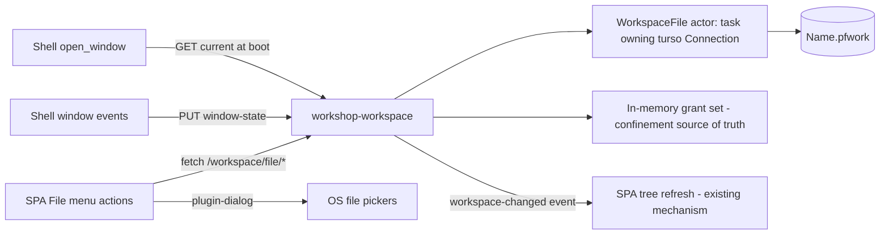

# Turso Workspace Files

<product-contract>

## Product Requirements

The Workshop's workspace becomes a single user-visible Turso database file (`.pfwork`), managed from the SPA File menu. Today the workspace evaporates on quit: granted folders live in memory only, and window geometry lives in a plugin-owned file the user never sees. Three of the four File menu workspace items already exist as disabled stubs; "Add Folder to Workspace..." is already wired. This plan wires the stubs, persists grants and window state into the file, and reopens the last-used workspace at launch.

- Problem and users:
  - Workshop users who arrange granted folders and window layout lose all of it on quit. Grants are in-memory only (`crates/workshop-workspace/src/workspace.rs`: "Grants live in memory for the running process only"), and window state is saved by tauri-plugin-window-state to a plugin-owned location, not to anything the user can open, copy, or share.
- Goals:
  - The shell's dependency on the server is narrowed to a new `workshop-server-api` crate (re-exports only), enforced at build time, landed before any feature work so no drift accumulates.
  - Four working File menu items: Open Workspace from File..., Add Folder to Workspace... (already wired; gains persistence), Save Workspace As..., Duplicate Workspace... (the stub row's ellipsis-less `Duplicate Workspace` label is corrected when the real action replaces it: the item opens a save picker, so it carries the ellipsis).
  - Grants and window state persist in one Turso database file the user can see, copy, and delete.
  - Launch reopens the last-used workspace; before the first Save As the workspace is ephemeral and in-memory only.
- Non-goals:
  - No agent databases, run databases, shadow filesystem, RAG index, or plugins: settled designs, separate projects (see Decision Record).
  - No import or migration of existing state: `workshop-state.json` and the session JSONL logs stay exactly as they are.
  - No changes to the promptforge executor, the VFS, `WorkshopObserver`, or the native Tauri menu.
  - No remote sync: embedded local database only.
- Success criteria:
  - Save As creates exactly one `.pfwork` file at the chosen path; quit and relaunch restores grants and window geometry.
  - Open replaces the current grants with the file's contents and applies its window state.
  - Duplicate produces an independent copy and switches to it.
  - All CI gates pass: fmt, clippy -D warnings, nextest, cargo deny, UI suite, check-workshop.
- Constraints:
  - `turso` crate pinned `=0.7.2` (MIT, pre-1.0); trivial SQL surface only.
  - Stable Rust toolchain; the workspace carries no MSRV pin.
  - Feature-tier discipline: workspace-file code lives in the `workshop-workspace` crate; routes register through `workshop_registry::Registry`; `workshop-sessions` stays uninvolved.
  - Zone-two failure posture (the workshop crates' term for degrade-and-log, never panic, never wedge the process): persistence failures degrade to logged warnings, never panic, never block boot.
- Open questions:
  - Whether `WINDOW_PERMISSIONS` needs `dialog:allow-save` for the SPA Save As picker (`crates/workshop/src/main.rs` grants `dialog:allow-open` only); verify at implementation time.
  - Two `.pfwork` files in one folder would share future sibling directories (`agents/`, `runs/`); the convention is one workspace per folder, and the plain sibling names make the relationship self-evident. Accepted, not enforced.

## Functional Specification

The user drives everything from the SPA File menu; the shell's only role is window geometry. Every workflow below except geometry already has its UI pattern in the tree: dialogs via `@tauri-apps/plugin-dialog`, same-origin fetch to the server, and tree refresh through the existing `promptforge:workspace-changed` invalidation.

- Actors and workflows:
  - Boot: the server reads the `state_dir/last-workspace` pointer and reopens that workspace before serving; the shell fetches window state and applies it before showing the window.
  - Open Workspace from File...: OS file picker, then `POST /workspace/file/open`; grants are replaced wholesale and the tree refreshes. Geometry is native, so the SPA cannot apply it: on a successful open or duplicate the SPA emits a `promptforge:workspace-opened` Tauri event, and the shell (listening via its event API) fetches the new window state from `GET /workspace/file/current` and applies it to the live window.
  - Save Workspace As...: save picker, then `POST /workspace/file/save_as`; creates exactly the file (no directory ceremony), writes current grants and window state, switches to it, updates the pointer. Sibling directories (`agents/`, `runs/`) do not travel: they stay beside the original file, and the new workspace grows its own lazily. Save As means "my preferences under a new name".
  - Duplicate Workspace...: save picker, then `POST /workspace/file/duplicate`; the actor drains pending writes, a WAL checkpoint folds the `-wal` sidecar into the main file so the copy is complete, then the file plus existing sibling directories (minus the derived `index.db`) are copied, the copy opens, the workspace switches, the pointer updates. Duplicate means "the whole world comes along". In v1 no siblings exist, so the two items are the same file operation; the distinction lands with the agent/run projects.
  - Add Folder to Workspace... (existing) and drag-and-drop grants (existing): the grant persists into the open file when file-backed.
  - Geometry: the shell saves window size/position/maximized debounced on `Resized`/`Moved` and once on close.
- Inputs and outputs:
  - Inputs: a `.pfwork` path (open), a target path (save as, duplicate), window geometry (PUT body).
  - Outputs: workspace contents JSON `{ path, name, grants, window_state }`, with `path` null while ephemeral.
- States and validation:
  - There is no unsaved state: a file-backed workspace persists every mutation as it happens (debounced for high-frequency ephemera like geometry and scroll), so Open, Save As, and Duplicate never carry - or lose - a dirty buffer. The file is a live mirror, not a snapshot.
  - Two states: ephemeral (no backing file, nothing persists, window-state PUT is a no-op) and file-backed (every grant mutation persists).
  - Open validation: the file must open as a database and carry `meta.format = 'promptforge-workspace'` at a supported version; anything else is refused with a clear error and is never wiped or partially loaded.
- Errors and recovery:
  - Missing or corrupt pointer, or a vanished or corrupt target at boot: log and start ephemeral; boot never blocks.
  - A persist failure on grant/revoke is logged degradation; the in-memory grant still lands (zone two).
  - The close-path geometry save is best-effort with a short timeout; the server may already be draining.
- Security and privacy behavior:
  - Opening a workspace file grants its stored directories to the confined file API. This is the same trust gesture as dropping a folder: deliberate user action, restored grants logged and visible in the tree.
  - The confinement jail itself is unchanged; all file access remains prefix-checked against the in-memory grants.
- Acceptance criteria:
  - The three stub rows are replaced by real actions per the stub-table contract: delete the stub row, add a `registerAction` in the owning feature; no menu, test, or keybinding changes beyond that.
  - `tursodb` inspection of a saved `.pfwork` shows the `meta`, `grants`, and `kv` tables with the expected rows.
  - Opened and saved workspaces appear under Open Recent via the existing recents store.


</product-contract>

<implementation-contract>

## Technical Design

`workshop-workspace` owns the workspace file because it already owns grants and the `/workspace/*` routes. Turso's async API is hidden behind a single-writer actor so the existing synchronous confinement code keeps its shape. The SPA drives the endpoints directly; the shell only restores and saves geometry.

- Architecture:
  - All database I/O is async (turso's API is async-native) behind a single-writer actor: one tokio task owns the `Connection`; the `WorkspaceFile` handle is a clone-cheap `mpsc::Sender<Command>` where each command carries a `oneshot` reply. Handlers are already async: they update the in-memory state synchronously, then send and await the persist; a persist failure is logged zone-two degradation while the in-memory state stands.
  - Channel order is disk order: every write funnels through the one task, so grant order in the file matches grant order in memory with no locks, and `position` stays meaningful.
  - The channel is bounded (grants are user-gesture rate, geometry saves debounced); a send failure degrades to a logged warning - in-memory state never depends on the channel. Shutdown drops the senders, the actor drains, and the connection closes cleanly.

```rust
enum Command {
    AddGrant { row: GrantRow, reply: oneshot::Sender<Result<(), WorkspaceFileError>> },
    RemoveGrant { path: PathBuf, reply: oneshot::Sender<Result<(), WorkspaceFileError>> },
    PutWindowState { state: WindowState, reply: oneshot::Sender<Result<(), WorkspaceFileError>> },
    // ...
}

/// The actor loop: one task, one connection, channel order is disk order.
async fn run(mut rx: mpsc::Receiver<Command>, conn: turso::Connection) {
    while let Some(command) = rx.recv().await {
        match command {
            Command::AddGrant { row, reply } => {
                let result = conn.execute(
                    "INSERT OR REPLACE INTO grants (path, position, added_at) \
                     VALUES (?1, ?2, ?3)",
                    (row.path.to_string_lossy().into_owned(), row.position, row.added_at),
                ).await.map_err(/* ... */);
                let _ = reply.send(result);
            }
            // ...
        }
    }
}
```

- The in-memory `BTreeSet` of canonical grants stays the confinement source of truth; the file mirrors it on every mutation.
- Single writer per database file; no cross-process coordination.




- Modules and interfaces:
  - New module `crates/workshop-workspace/src/workspace_file.rs`: `WorkspaceFile` actor with `create(path, contents)`, `open(path)`, `add_grant`, `remove_grant`, `put_window_state`, `duplicate_to(path)` (WAL checkpoint then file copy; we own the only connection, avoiding reliance on `VACUUM INTO` in turso's compat surface). `create` and `duplicate_to` produce exactly the file at the chosen path.
  - `WorkspaceContents { name, grants: Vec<GrantRow>, window_state: Option<WindowState> }` (declared in full under Data, persistence below).
  - `Workspace` gains an optional backing `WorkspaceFile` handle plus the file path; `replace_all(grants)` clears the set and inserts the file's grants (restored grants logged; a grant whose path vanished from disk still loads and lists as `exists: false`).
- File and public API changes:
  - New crate `crates/workshop-server-api` (lands first): the shell's entire view of the server, re-exports only. Shipping surface: `pub use workshop_server::{AgentsConfig, Config, GatewayConfig, ServerConfig, spawn, ServerHandle, SpawnError, Termination, GatewayUpdater, GatewayPublicationError};` plus `#[cfg(feature = "test-fixtures")] pub use workshop_server::fixtures;` with the feature forwarding to `workshop-server/test-fixtures`. The shell's normal and dev dependencies retarget from `workshop-server` to `workshop-server-api`; from then on, server internals do not resolve in the shell at all.
  - Build-time enforcement: the build-xtask product-boundary matrix gains the rule that `workshop` depends on `workshop-server-api` and never on `workshop-server`, so even re-adding the dependency fails CI (the user explicitly approved this structural rule).
  - Rename `shared-sidecar` to `shared-gateway-discovery`: the crate is the `gateway.json` discovery seam (write, liveness validation, launch-or-attach election, shutdown handshake) and "sidecar" names the retired architecture. Five manifests (`gateway`, `workshop-server`, `workshop-gateway`, `workshop`, root) plus imports; mechanical and compiler-checked.
  - New handlers in `crates/workshop-workspace/src/handlers.rs`, registered in `handles.rs`: `GET /workspace/file/current`, `POST /workspace/file/open`, `POST /workspace/file/save_as`, `POST /workspace/file/duplicate`, `PUT /workspace/file/window-state`.
  - `state_dir/last-workspace` plain-text pointer file, written with `workshop_support::write_atomic`, read during boot composition in `crates/workshop-server/src/app.rs`.
  - SPA: new `workspace-files.contribution.ts` beside the existing file contributions under `crates/workshop-server/ui/src/ui/`; removes the three rows from `stubs.contribution.ts`; records workspaces in the existing `recent-files-store`.
  - Shell (`crates/workshop`): remove tauri-plugin-window-state from `main.rs` and `Cargo.toml`; restore geometry in `open_window` from `GET /workspace/file/current` before `show()`; save debounced on window events and once on close; add a minimal `reqwest` helper.
- Data, persistence, failure, security, and privacy constraints:
  - Schema v1, exactly as applied at create time (`user_version` is the migration counter):

```sql
PRAGMA user_version = 1;

CREATE TABLE meta (
    key   TEXT PRIMARY KEY,
    value TEXT NOT NULL
);

CREATE TABLE grants (
    path     TEXT PRIMARY KEY,  -- canonical, verbatim-prefix-free, same form as the in-memory set
    position INTEGER NOT NULL,  -- stable tree order
    added_at TEXT NOT NULL      -- RFC 3339
);

CREATE TABLE kv (
    key   TEXT PRIMARY KEY,
    value TEXT NOT NULL         -- JSON text
);
```

- The corresponding Rust declarations in `crates/workshop-workspace/src/workspace_file.rs`:

```rust
/// Everything a workspace file carries between sessions.
#[derive(Debug, Clone)]
pub(crate) struct WorkspaceContents {
    /// Display name (meta 'name'); defaults to the file stem.
    pub(crate) name: String,
    /// Granted roots in tree order (grants table, ordered by position).
    pub(crate) grants: Vec<GrantRow>,
    /// Saved window geometry (kv 'window'), absent when never saved.
    pub(crate) window_state: Option<WindowState>,
}

/// One row of the grants table.
#[derive(Debug, Clone, PartialEq, Eq)]
pub(crate) struct GrantRow {
    /// Canonical granted root, verbatim-prefix-free.
    pub(crate) path: PathBuf,
    /// Stable tree order.
    pub(crate) position: u32,
    /// RFC 3339 grant time.
    pub(crate) added_at: String,
}

/// The kv 'window' value: the shell's saved geometry.
#[derive(Debug, Clone, Copy, Serialize, Deserialize)]
pub(crate) struct WindowState {
    /// Logical width.
    pub(crate) width: u32,
    /// Logical height.
    pub(crate) height: u32,
    /// Logical x position.
    pub(crate) x: i32,
    /// Logical y position.
    pub(crate) y: i32,
    /// Whether the window is maximized.
    pub(crate) maximized: bool,
}

/// Meta keys this build writes and validates.
const META_FORMAT: &str = "format"; // always "promptforge-workspace"
const META_VERSION: &str = "version"; // schema version, "1"
const META_NAME: &str = "name";
const META_CREATED_AT: &str = "created_at";

/// The one kv key v1 defines.
const KV_WINDOW: &str = "window";
```

- And the owning type, evolved from the existing `Workspace` in `crates/workshop-workspace/src/workspace.rs` - the backing is switchable at runtime (open/save-as/duplicate swap it while the server runs), so it sits behind its own lock, separate from the read-hot grants lock:

```rust
/// The workspace: the granted roots and the optional backing file.
///
/// Clone-cheap and shared by every handler; the grants set is the
/// confinement source of truth, the backing file its persistent mirror.
#[derive(Debug, Clone, Default)]
pub(crate) struct Workspace {
    /// The granted roots, in canonical form. Read-hot: its own lock.
    grants: Arc<RwLock<BTreeSet<PathBuf>>>,
    /// The backing workspace file; `None` while the workspace is
    /// ephemeral. Swapped by open/save-as/duplicate at runtime.
    backing: Arc<RwLock<Option<Backing>>>,
}

/// The open file behind a file-backed workspace.
#[derive(Debug)]
struct Backing {
    /// The workspace-file actor (single writer, channel-fed).
    file: WorkspaceFile,
    /// Where the file lives on disk.
    path: PathBuf,
}
```

- `Workspace::default()` is the ephemeral state; `open`/`save_as`/`duplicate` build a new `Backing` and swap it in; `grant`/`revoke` persist through the current backing when present. The tree, the file API, and confinement never touch the backing.
- Reserved table names for follow-on projects, unused in v1: `agent_windows`, `run_presets`, `runs`, `run_events`, `agents`, `documents`.
- `sweep_orphaned_temps` (`crates/workshop-support`) matches only `.pf-tmp` and the legacy temp name; it cannot touch Turso's `-wal`/`-shm` sidecars.
- Future siblings (`agents/`, `runs/`, `terminals/`, `plugins/`, `index.db`) are plain-named directories beside the file, created lazily by their own projects; Duplicate copies whatever siblings exist minus `index.db` (in v1, just the file).


</implementation-contract>

<verification-contract>

## Testing Plan

The module, the routes, and the SPA actions each carry their own tests, and the dependency spike proves the build before any rework begins. Existing workspace confinement tests must pass unchanged - the jail is untouched.

- Unit:
  - `workspace_file`: create/open round-trip, grant ordering stability, window-state round-trip, alien and corrupt file refusal, duplicate produces an independent file, all over tempdir databases.
  - `Workspace`: grant/revoke persist when file-backed, stay memory-only when ephemeral, `replace_all` swaps the set on open.
- Integration and end-to-end:
  - Route tests for all five endpoints, including an alien database refusal and a missing path.
  - Boot test: a written pointer reopens the workspace; a corrupt pointer starts ephemeral.
  - SPA tests in the existing `crates/workshop-server/ui/test/*.mjs` style for the three new actions.
- Regression, security, and performance:
  - The existing workspace confinement test suite (traversal, symlink, ADS, conflict tokens) passes unchanged.
  - The spike runs `cargo deny check` and a Windows build before any other work.
- Exit criteria:
  - The repository's verification gates, exactly as `AGENTS.md` defines them (the workshop partition gains `workshop-server-api` in Step 1, since the re-export crate compiles `workshop-server` transitively): `cargo nextest run --locked --workspace --exclude workshop --exclude workshop-server --exclude workshop-server-api --all-features` plus doctests (`cargo test --workspace --exclude workshop --exclude workshop-server --exclude workshop-server-api --all-features --doc`); `cargo nextest run --locked -p workshop -p workshop-server -p workshop-server-api`; `cargo clippy --workspace --exclude workshop --exclude workshop-server --exclude workshop-server-api --all-targets --all-features -- -D warnings` and `cargo clippy -p workshop -p workshop-server -p workshop-server-api --all-targets -- -D warnings`; `cargo fmt --all --check`; `cargo doc --workspace --no-deps --all-features --exclude workshop --exclude workshop-server --exclude workshop-server-api` with `RUSTDOCFLAGS="-D warnings"`; `cargo test -p build-xtask` (the boundary harness, which must include the new `workshop-server-api` rule); `cargo deny check`; the SPA UI suite; `mdbook build guide`.
  - Manual smoke: add folders, Save As, quit, relaunch (grants and geometry restored), Open a different workspace, Duplicate, inspect the result with `tursodb`.


</verification-contract>

<decision-record>

## Decision Record

- Decisions:
  - The workspace is a single `.pfwork` file; siblings are created lazily beside it. The user: "its annoying when programs create a directory to hold the file. Save As should just create the file. no directory ceremony. The user will figure out pretty quickly that we will crate agents/ and runs/ and terminals/ etc".
  - Turso, embedded and local-only, as the database. The user: "lets plan to use [https://github.com/tursodatabase/turso](https://github.com/tursodatabase/turso) in promptforge", then chose "Embedded local only".
  - Scope is the workspace file only; the executor and observer stay untouched. The user: "I dont want to touch promptforge executor or the observer. I just want something very focused: Workshop uses Turso database as its workspace file type."
  - Lifecycle: reopen the last-used workspace at launch; ephemeral until the first Save As. The user chose "Reopen last-used".
  - The shell reaches the in-process server over HTTP for workspace-file state, never direct Rust calls, and the boundary is compiler-enforced: the shell depends only on the new `workshop-server-api` re-export crate (never `workshop-server`), with the build-xtask product-boundary matrix rejecting a direct dependency at build time. The user: "workshop only depends on workshop-server-api (new name). enforce this at build time. make this happen first."
  - `shared-sidecar` is renamed `shared-gateway-discovery`. The user asked for an evaluation: the crate is the `gateway.json` discovery seam (its own doc header leads with "discovery seam"), while "sidecar" names the retired gateway-as-Tauri-sidecar architecture; five dependent manifests make the rename mechanical and compiler-checked. The user: "also rename shared-sidecar to shared-gateway-discovery (evaluate this change)".
  - Duplicate copies and switches. The user chose "Copy and switch".
  - Save As and Duplicate differ by what travels: Save As moves only the workspace file (siblings stay beside the original), while Duplicate copies the file plus existing sibling directories minus the derived `index.db`; both switch. Raised by review feedback - "What is the difference between save as and duplicate?" and "What happens to the subdirs" - resolved as preferences-travel vs world-comes-along, and confirmed by the user: "item 3 is fine as written".
  - No import of pre-existing state. The user chose "Start fresh".
  - Window state moves from tauri-plugin-window-state into the workspace database. The user: "We put the saved window state, the grant directories in the workspace tree view, and so on in there."
  - The workspace database holds only preference-shaped data; heavy content lives in sibling files. The user: "the workspace is more of a 'bag of preferences' plus saved window state".
- Rejected alternatives:
  - Directory-per-workspace (`Name/` containing `Name.pfwork`): rejected by the user as directory ceremony; revisit if sibling sharing in multi-workspace folders confuses users.
  - Native Tauri menu items: obsolete since the menu overhaul - the SPA menubar already carries the stubs; no revisit condition.
  - Importing old JSONL/state files into the database: rejected as start-fresh; revisit only if users ask for history migration.
  - App-level agent databases: superseded by workspace-sibling `agents/` in the settled future design; revisit when the agent-database project starts.
- Assumptions, risks, and notes:
  - Turso is pre-1.0; usage is trivial SQL (three tables, point reads and writes), pinned `=0.7.2`, upgrades deliberate.
  - Ephemeral workspaces persist nothing, including window geometry - a visible regression from the plugin until the first Save As, accepted as a direct consequence of the chosen lifecycle.
  - Grant restore on open is a trust gesture equivalent to drag-and-drop; called out so it stays a conscious decision.
  - The shell's one-crate shape is expected to change (its harness exemption is time-bounded "until the headless agent mode plan"). Exposure is asymmetric by design: the feature lives server-side in `workshop-workspace` behind HTTP endpoints any client can use, and the shell-side footprint (plugin removal, geometry restore/save) is one module that moves mechanically with whichever crate owns the window.
  - The dependency spike gates all other work; a deny or build failure stops the plan and reports options.
  - `grants.position` semantics (added during decomposition, flagged for confirmation): on insert, `position` is one past the file's current maximum (insertion order) and removal never renumbers; in v1 the tree still lists grants in canonical path order from the in-memory `BTreeSet`, so `position` is stored for future ordering and does not change display. Recorded because the schema comment says "stable tree order" while the in-memory set is path-sorted, and the column's meaning is persisted in user files.

### Deferred and Out of Scope

- Deferred: agent databases (`agents/` sibling, one DB per agent-window instance, prompt source snapshotted at spawn, close never deletes, shadow filesystem with explicit one-way materialization to disk). Revisit when the agent-database project starts.
- Deferred: run databases (`runs/` sibling, run dialog generated from the frontmatter contract, run panel UI built before model-facing tools, then `runs.list`/`runs.read`/`runs.read_document`, a read-only VFS mount at `/runs/<id>/`, completion notifications, all run content marked `untrusted` in agent context). Revisit after the workspace file ships.
- Deferred: RAG index sidecar `index.db` (per-workspace scope, excluded from Duplicate). Ingest never opens unchanged sources: the indexer records each source DB's watermark plus observed mtime and size, stats files on workspace open (watching the `-wal` sidecar's mtime too, since live writes land there between checkpoints), and opens only changed files for the watermark query; mtime is a hint backed by periodic spot verification, and deletions are the reverse diff against the indexed set. Ingest runs at idle, newest-active first; query cost is independent of source count. Deletion is tombstoned: a `sources` table carries a `live` flag, queries filter through it, and physical reclaim (chunk delete, then vacuum or `incremental_vacuum`) runs at idle when the tombstone ratio crosses a threshold - with an explicit immediate reap reserved for any future sensitive-content delete gesture. `meta` records the embedding model id; a model swap triggers rebuild. Revisit after agent and run databases exist.
- Deferred: run presets keyed by canonical prompt path with `(grant_root, relative_path)` storage, structural contract matching for prefill, and sha256 move detection (unique match re-links, multiple ask, none opens empty). Revisit with the run window.
- Deferred: capability-based powers (shell, plugins) with per-workspace consent rows in the workspace DB, human-in-the-loop confirmation via the existing input broker, hash-pinned DLL plugins in a `plugins/` sibling loaded with a versioned C ABI following the `gateway-whisper-ffi` discipline. Revisit with the plugin project.
- Deferred: the settings and state model, two axes rather than a uniform ladder. Kind: preferences cascade, ephemera do not. Scope: account (follows the user) vs workspace (travels with the document). The gateway is a separate program with its own rules and profiles - nothing gateway-side enters this model; any future account concept is the Workshop's own.
  - Preferences cascade sparsely: defaults (in code, every key always defined) -> account preferences (defined only when changed) -> workspace overrides (defined only when this workspace differs); the highest layer defining a key wins. Account preferences live in the Workshop's machine-written config TOML (the user: "config TOML is always machine-written"); workspace overrides live in the `.pfwork` `kv` table.
  - Ephemera have no defaults and no overrides - just storage at their scope. The account homes already exist: preferences in the machine-written `workshop.toml`, ephemera in `workshop-state.json` (or a sibling state file, one per writing component) - so the no-new-localStorage rule binds from day one with no interim gap. Today's five localStorage stores sort as: commands history and recent files (account ephemera), editor toggles and zoom factor (account preferences, workspace-overridable), and the layout placement memory (workspace ephemera by this model, though it sits in localStorage today). Workspace ephemera live in the `.pfwork`: window geometry, open agent windows at exit (the `agent_windows` restore list), open editor tabs, the closed-editor stack, tree expansion (expanded paths stored relative to their grant roots, replacing the session-only `tree-state-service` cache), scroll positions (keyed per panel or per editor file), the panel's live arrangement (open, size, active view, position). High-frequency ephemera (scroll, toggle, geometry) ride debounced saves, never a write per event. Never persisted: the tree listing cache and live editor buffers - derived or transient, re-fetched and re-edited on demand.
  - Every UI element splits current state from chosen behavior: its current state is ephemera at the scope of what it shows; its configured behavior (for example "panel on the right") is a preference that cascades.
  - Ephemera answer "what was on screen," never "what exists": closing an agent window updates the restore list and never touches the agent's database.
  - Placement tests: "should this travel if the workspace is duplicated and handed to a colleague?" (scope) and "should this come back when I reopen this workspace?" (workspace ephemera vs account ephemera). Revisit when settings UI work starts.
- Deferred: run retention gestures, live-tailing of in-progress runs, cross-machine portability of absolute grant paths. Open questions for their respective projects.
- Out of scope: the promptforge executor, the VFS, `WorkshopObserver`, session JSONL logs, `workshop-state.json`, the native Tauri menu, remote sync.


</decision-record>

<project-survey>

## Project Survey

- Status: complete
- Build command: `cargo build --locked -p workshop-server` for the server crate under change (workshop crates are not default members; plain `cargo build` builds only `gateway`). The desktop shell is `cargo build --locked -p workshop`, which needs the Gateway sidecar staged first via `cargo build --locked -p gateway --no-default-features` then `node tools/stage-gateway-sidecar.mjs stage --target x86_64-pc-windows-msvc --source target/debug/promptforge-gateway.exe`. The SPA bundles through the crate build script (esbuild into `OUT_DIR`) after `npm ci --prefix crates/workshop-server/ui`; standalone: `npm run build` in `crates/workshop-server/ui`.
- Focused test command pattern: `cargo nextest run --locked -p <crate> <test_name_filter>` (for example `cargo nextest run --locked -p workshop-workspace grant`); doctests via `cargo test --doc -p <crate>`. SPA: `node --test test/<file>.mjs` from `crates/workshop-server/ui`.
- Component test command pattern: `cargo nextest run --locked -p <crate>` (for example `cargo nextest run --locked -p workshop-workspace`); workshop-server headless integration tests: `cargo nextest run --locked -p workshop-server --features headless`. SPA: `npm test` in `crates/workshop-server/ui` (runs `node --test "test/**/*.mjs" "src/**/*.test.mjs"`), preceded by `npm run typecheck`.
- Full-suite test command: `cargo nextest run --locked --workspace --exclude workshop --exclude workshop-server --exclude workshop-server-api --all-features`, then `cargo test --workspace --exclude workshop --exclude workshop-server --exclude workshop-server-api --all-features --doc`, then `cargo nextest run --locked -p workshop -p workshop-server -p workshop-server-api`, `cargo nextest run --locked -p workshop-server --features headless`, and `cargo test --doc -p workshop -p workshop-server -p workshop-server-api` (the `workshop-server-api` entries land in Step 1). Boundary harness: `cargo test -p build-xtask`. Nextest profile in `.config/nextest.toml` (60s slow timeout, terminate after 3 periods, 250ms leak timeout).
- Linter command: `cargo clippy --workspace --exclude workshop --exclude workshop-server --exclude workshop-server-api --all-targets --all-features -- -D warnings`; workshop crates: `cargo clippy -p workshop -p workshop-server -p workshop-server-api --all-targets -- -D warnings`. Workspace lints in `Cargo.toml`: `unsafe_code = "forbid"`, `missing_docs`/`unreachable_pub`/`missing_debug_implementations` warn, clippy `all` deny, `pedantic` warn, `unwrap_used`/`expect_used` deny, rustdoc broken and private intra-doc links deny. Supply chain: `cargo deny check` and `cargo audit` (`deny.toml` allows BSL-1.0, MIT, MIT-0, Apache-2.0, BSD-2/3, ISC, Zlib, MPL-2.0, Unicode, CDLA-Permissive-2.0, CC0, Unlicense, 0BSD; crates.io is the only allowed registry, git sources denied).
- Formatter check command: `cargo fmt --all --check` (also the `.githooks/pre-commit` hook; `.githooks/pre-push` runs `cargo check -p gateway --no-default-features`, the workspace clippy line, and `cargo deny check`). SPA: none seen (no prettier/eslint config in `crates/workshop-server/ui`).
- Docs command: `cargo doc --workspace --no-deps --all-features --exclude workshop --exclude workshop-server --exclude workshop-server-api` with `RUSTDOCFLAGS="-D warnings"`; user guide: `mdbook build guide`.
- Test placement and naming conventions: unit tests live in a kebab sibling file next to the module, wired as `#[cfg(test)] #[path = "foo-tests.rs"] mod tests;` (seen: `crates/workshop-workspace/src/workspace-tests.rs`, `handlers-tests.rs`, `error-tests.rs`; `crates/workshop-server/src/app-tests.rs`, `serve-tests.rs`, `app-fixtures.rs`, `fixtures.rs`). Integration tests live in `tests/it/main.rs` per crate (workshop-workspace, workshop-server, workshop-registry, workshop-sessions, workshop-support, workshop-protocol, gateway, shared-sidecar), with shared helpers in `tests/common/` and `tests/fixtures/` where present. Test-only APIs sit behind a `test-fixtures` Cargo feature that a crate enables on itself in `[dev-dependencies]`. Test names are long descriptive snake_case sentences (for example `a_direct_launch_recovers_the_lease_from_a_terminated_owner`). SPA tests are `.mjs` files under `crates/workshop-server/ui/test/` (with `test/helpers/`) run by `node --test` with jsdom; `src/**/*.test.mjs` is also globbed but currently empty.
- Directory map: `Cargo.toml` is the workspace root (`members = ["crates/*"]`, `exclude = ["crates/shared-ui"]`, `default-members = ["crates/gateway"]`, edition 2024, resolver 3, version 0.3.0, BSL-1.0). `crates/` holds all Rust crates in five families: `gateway-*` (inference gateway, config, local models, routing, STT, web search, whisper FFI), `promptforge-*` (api, parser, lua, store, vfs, web, webfetch, web-search, model-client, tool-picker), `shared-*` (cloud-providers, gateway-api, promptforge-api, loopback, progress, sidecar, vfs, plus the non-Rust `shared-ui` TypeScript/CSS package), `workshop-*` (workshop Tauri shell, workshop-server, gateway, menu, protocol, registry, sessions, status, support, workspace), and `build-*` (llama-cuda, ui, user-guide, workshop, xtask). `crates/workshop-server/ui/` is the SPA (`src/base`, `src/services`, `src/tokens`, `src/ui/<feature>`, `main.ts`, `test/`, `build.mjs`, `package.json`, `tsconfig.json`). `crates/gateway-config-ui/ui/` is the second esbuild UI. `.config/nextest.toml`, `.cargo/config.toml` (aliases `cargo workshop` and `cargo xtask`; static CRT on Windows MSVC), `rust-toolchain.toml` (stable channel, no version pin), `rustfmt.toml`, `clippy.toml`, `deny.toml`, `dist-workspace.toml`. `.github/workflows/ci.yml` (jobs: fmt, clippy, test, docs, check-workshop on windows-latest, check-workshop-linux, ui, supply-chain, ci-green gate) plus release and nightly workflows. `.githooks/` pre-commit and pre-push. `guide/` is the mdbook user guide. `tools/` holds Node scripts (`stage-gateway-sidecar.mjs`, `gateway-tts-live.mjs`, each with a `.test.mjs`). `vibe/archdoc.md` is the architecture document. `prompts/`, `images/`, `local/`, `target/`, `target-msrv/` are content and build artifacts.
- Component boundaries: per `AGENTS.md`, `workshop-*` must not depend on `gateway-*`; `gateway-*` must not depend on `promptforge-*` or `workshop-*`; `promptforge-*` must not depend on `gateway-*` or `workshop-*`; crates outside the promptforge family reach it only through `promptforge-api` (the one-door rule); `shared-*` depend on no product crates; the rules bind normal, dev, build, and target-specific dependencies and `cargo test -p build-xtask` enforces them. Within Workshop, tiers flow shell -> features -> services -> vocabulary: `workshop` (Tauri shell) -> `workshop-server` (composition root, `src/app.rs`, depends on every other workshop crate plus shared-loopback, shared-progress, shared-sidecar) -> feature crates such as `workshop-workspace`, `workshop-sessions`, `workshop-menu`, `workshop-status`, `workshop-gateway` (each `lib.rs` opens with a `//!` doc carrying a `## Invariants` marker naming allowed dependencies; `workshop-workspace` is tier feature and may depend on `workshop-protocol`, `workshop-registry`, `workshop-support`, and the service crates) -> `workshop-registry` and `workshop-support` -> `workshop-protocol`. Features register through `workshop_registry::Registry`. `workshop-workspace` keeps grants in memory only (`Workspace` over `Arc<RwLock<BTreeSet<PathBuf>>>`) and maps `WorkspaceError` to the wire envelope at its route boundary; its own invariant states profile persistence is a separate future consent decision. Per `vibe/archdoc.md`, the store facade is `vfs.store(&access)` over `shared-vfs` plus the `promptforge-vfs` policy gate. SPA imports flow `ui` -> `services` -> `base`, never in reverse; `main.ts` is the composition root; lazy-loaded panels never import the boot shell. No sqlite, libsql, turso, rusqlite, or sqlx crate appears in `Cargo.lock`.
- Conventions summary: Rust edition 2024 on stable, `--locked` on every cargo invocation in CI, `unsafe_code` forbidden at workspace level, `unwrap`/`expect` denied, `missing_docs` warned so every public item carries a doc comment, every `workshop-*` Rust file stays under 500 lines (split before editing past it), source directories are flat by default (a subdirectory needs at least three files; one or two files live as `parent-label.rs` siblings wired with `#[path]`), Cargo features gate real constraints only (a toolchain or heavy native build, never product shape), runtime and serve paths never compile native code or install process-global state and return failures rather than exiting, long-running work reports through `shared-progress`, error messages are concise and self-contained with required-versus-actual phrasing for model consumption, behavior changes ship with tests in the same change, no build step may write into the repository (CI fails on a dirty tree), comments explain non-obvious constraints and cite upstream issue URLs for workarounds. Dependencies are declared once in `[workspace.dependencies]` and inherited with `.workspace = true`; in-tree path crates carry an explicit `version`. SPA: TypeScript bundled by esbuild (Node >= 22, `"type": "module"`), CSS beside its TypeScript with `--ws-*` tokens only (primitives in `tokens/base.css`, aliases in `tokens/semantic.css`, overrides in `tokens/component.css`), each feature has an eager `ui/<feature>/<feature>.contribution.ts` with `registerAction` calls at module scope and `run` bodies that lazy-import heavy chunks, `index.ts` keeps only `register()` and never `export *`, unimplemented menu rows live in `ui/menu/stubs.contribution.ts` with `precondition: "false"`, command ids and context keys reuse VS Code's names verbatim, shared state lives in services with change emitters constructed at the composition root (no mutable module globals), Tauri capabilities are granted per named window and exact bound origin.

</project-survey>

<execution-plan>

## Execution Instructions

Objective: the Workshop's workspace becomes one user-visible `.pfwork` Turso file that persists grants and window geometry, is driven from the SPA File menu, and reopens at launch, with the shell's view of the server narrowed to a compiler-enforced re-export crate before any feature work lands.

Component order (each component is independently useful and lands as a contiguous run of steps):

1. `shell-boundary` (Steps 1-3): first because the user required it first and it is pure structure with no feature dependency; landing it before feature work means no server internals drift into the shell that the new build rule would later reject.
2. `workspace-file` (Steps 4-9): the server-side persistence in `workshop-workspace` plus boot reopen in `workshop-server`; second because the turso spike inside it gates every feature step, and the finished HTTP API is useful to any client on its own.
3. `spa-workspace-actions` (Steps 10-11): needs the routes (Step 8) and the pointer (Step 9) for a working open-and-relaunch flow; placed before the shell so the user-facing feature is exercisable end to end from the SPA before geometry moves.
4. `shell-window-state` (Step 12): needs `GET /workspace/file/current` and `PUT /workspace/file/window-state` (Step 8), boot reopen (Step 9) so restore has data, and the SPA's `promptforge:workspace-opened` emitter (Step 10) so the shell listener has a sender.
5. `docs-and-verification` (Step 13): last; documents shipped behavior and runs the full gate list plus the manual smoke.

Piece construction: every piece below is sequential because each consumes the artifacts of the one before (crate before rule, schema before mutations, module before integration, integration before routes, routes before pointer, open before save-as). The one joint-capable piece is the `shared-sidecar` rename (Step 3), which shares only the root manifest with Steps 1-2; it is sequenced third for a clean history rather than for a dependency.

Conventions binding every step: `--locked` on cargo, `unwrap`/`expect` denied, every public item documented, every `workshop-*` Rust file under 500 lines (split into a `parent-label.rs` sibling wired with `#[path]` before crossing it), tests in the kebab sibling file, no build step writes into the repository, failures in persistence paths log and continue (zone two).

<step-1>

### Step 1: Create `workshop-server-api` and retarget the shell [completed]

- Component: `shell-boundary`
- Piece: api-crate (sequential with Step 2: the boundary rule can only pass once the shell no longer depends on `workshop-server`)
- Depends on: nothing
- Artifacts:
  - `crates/workshop-server-api/Cargo.toml`: package with explicit `version`, `workshop-server` dependency inherited from the workspace, `[features] test-fixtures = ["workshop-server/test-fixtures"]`.
  - `crates/workshop-server-api/src/lib.rs`: `//!` doc with a `## Invariants` marker stating the crate is re-exports only and the shell's sole view of the server; `pub use workshop_server::{AgentsConfig, Config, GatewayConfig, ServerConfig, spawn, ServerHandle, SpawnError, Termination, GatewayUpdater, GatewayPublicationError};` and `#[cfg(feature = "test-fixtures")] pub use workshop_server::fixtures;`.
  - Root `Cargo.toml` `[workspace.dependencies]`: `workshop-server-api` path entry with `version`.
  - Invocation lists: `--exclude workshop-server-api` beside the existing `--exclude workshop --exclude workshop-server` in the workspace-wide clippy, nextest, doctest, and docs lines (`.github/workflows/ci.yml`, `.githooks/pre-push`, `AGENTS.md`), and `-p workshop-server-api` beside `-p workshop -p workshop-server` in the `check-workshop` clippy, nextest, and doctest lines; the crate compiles `workshop-server` transitively, so it belongs in the workshop partition.
  - `crates/workshop/Cargo.toml`: `[dependencies]` and `[dev-dependencies]` retargeted from `workshop-server` to `workshop-server-api` (dev with `features = ["test-fixtures"]`); every `use workshop_server::` in `crates/workshop/src/` becomes `use workshop_server_api::`.
- Tests: `crates/workshop-server-api/src/lib-tests.rs` with a compile-level test that names each of the ten re-exports; `cargo nextest run --locked -p workshop -p workshop-server -p workshop-server-api` and `cargo test --doc -p workshop -p workshop-server -p workshop-server-api` pass; `cargo clippy -p workshop -p workshop-server -p workshop-server-api --all-targets -- -D warnings`.
- Commit: the crate, the retarget, and the compile test.

</step-1>

<step-2>

### Step 2: Enforce the shell boundary in build-xtask

- Component: `shell-boundary`
- Piece: api-crate
- Depends on: Step 1
- Artifacts:
  - The product-boundary matrix module in `crates/build-xtask` gains the rule: package `workshop` may depend on `workshop-server-api` and never on `workshop-server`, binding normal, dev, build, and target-specific dependencies like the existing family rules.
  - `AGENTS.md` Component boundaries section gains one sentence stating the rule.
- Tests: in the build-xtask test file, `workshop_depends_on_workshop_server_api_only` (positive, against the live manifests) and a negative fixture test proving a manifest that re-adds `workshop-server` to `workshop` is rejected; `cargo test -p build-xtask`.
- Commit: the rule, the tests, the AGENTS.md sentence.

</step-2>

<step-3>

### Step 3: Rename `shared-sidecar` to `shared-gateway-discovery`

- Component: `shell-boundary`
- Piece: rename (joint-capable with api-crate; sequenced after it)
- Depends on: Step 2 (so the boundary harness is already asserting the final shape)
- Artifacts:
  - `git mv crates/shared-sidecar crates/shared-gateway-discovery`; `package.name`, the `//!` doc header, and `tests/it/main.rs` imports updated.
  - Root `Cargo.toml` `[workspace.dependencies]` entry renamed; manifests of `gateway`, `workshop-server`, `workshop-gateway`, `workshop` retargeted; every `use shared_sidecar::` becomes `use shared_gateway_discovery::`.
  - `vibe/archdoc.md` shared substrate line: "sidecar facilities" becomes "gateway discovery facilities"; `AGENTS.md`, `.github/workflows/*.yml`, `.githooks/*`, `dist-workspace.toml` references updated where present.
  - Not renamed: `tools/stage-gateway-sidecar.mjs` and its test (it stages the gateway binary; unrelated to the crate).
- Tests: `cargo nextest run --locked -p shared-gateway-discovery` (the moved `tests/it`); `cargo test -p build-xtask`; `cargo clippy --workspace --exclude workshop --exclude workshop-server --exclude workshop-server-api --all-targets --all-features -- -D warnings`; `rg -n "shared[-_]sidecar"` returns zero hits outside git history.
- Commit: the mechanical rename.

</step-3>

<step-4>

### Step 4: Turso dependency spike

- Component: `workspace-file`
- Piece: spike (gates Steps 5-13; on any failure stop and report options: alternative pin, `deny.toml` license entry, alternative crate)
- Depends on: Step 3
- Artifacts:
  - Root `Cargo.toml` `[workspace.dependencies]`: `turso = "=0.7.2"`; `crates/workshop-workspace/Cargo.toml`: `turso.workspace = true`, `tempfile` dev-dependency if absent; `Cargo.lock` updated.
  - `crates/workshop-workspace/src/workspace_file.rs` skeleton: `//!` doc naming the module's role and `pub(crate) async fn open_database(path: &Path) -> Result<turso::Connection, WorkspaceFileError>` with a minimal `WorkspaceFileError { Io, Database }` in the same file; `mod workspace_file;` in `lib.rs`.
  - `deny.toml` untouched; any transitive license or advisory failure is reported, not silently allowed.
- Tests: `crates/workshop-workspace/src/workspace-file-tests.rs` `turso_opens_a_tempdir_database_and_round_trips_user_version`; gates: `cargo build --locked -p workshop-workspace`, `cargo deny check`, `cargo build --locked -p workshop-server` on Windows, `cargo nextest run --locked -p workshop-workspace`.
- Commit: the dependency, the skeleton, the smoke test.

</step-4>

<step-5>

### Step 5: `workspace_file` schema, create, open, validate

- Component: `workspace-file`
- Piece: module (sequential: Step 6 mutates what this step creates)
- Depends on: Step 4
- Artifacts:
  - `crates/workshop-workspace/src/workspace_file.rs`: `WorkspaceFile` (clone-cheap wrapper over `mpsc::Sender<Command>`), `WorkspaceContents`, `GrantRow`, `WindowState`, `WorkspaceFileError { Io, Database, NotAWorkspace { path }, UnsupportedVersion { found, supported }, Closed }`, `WorkspaceFile::create(path, &WorkspaceContents)`, `WorkspaceFile::open(path)`, `WorkspaceFile::contents()`; the `META_FORMAT`, `META_VERSION`, `META_NAME`, `META_CREATED_AT`, `KV_WINDOW` constants; a doc comment listing the reserved v1-unused table names.
  - `crates/workshop-workspace/src/workspace_file-actor.rs` (sibling, `#[path]`-wired): `enum Command { Contents, Shutdown, ... }`, `async fn run(rx, conn)`, `const SCHEMA_V1: &str` (`PRAGMA user_version = 1` plus the `meta`, `grants`, `kv` tables exactly as in Technical Design), `COMMAND_QUEUE_DEPTH` bound.
  - Open validates `user_version`, `meta.format == "promptforge-workspace"`, `meta.version == "1"` before any read of grants or kv; refusal performs no write. Create writes exactly one file at the chosen path.
- Tests (`workspace-file-tests.rs`): create then open round-trips name, grants, and window state; name defaults to the file stem when `meta.name` is absent; a database with no `meta` table is refused as `NotAWorkspace` and left byte-identical; a random-bytes file is refused; `meta.version = "2"` is refused as `UnsupportedVersion`; after create, the tempdir contains only the file (no directory ceremony).
- Commit: the module, the actor, the tests.

</step-5>

<step-6>

### Step 6: `workspace_file` mutations and duplicate

- Component: `workspace-file`
- Piece: module
- Depends on: Step 5
- Artifacts:
  - `Command::{AddGrant, RemoveGrant, PutWindowState, Checkpoint}` in `workspace_file-actor.rs`; `WorkspaceFile::add_grant(GrantRow)`, `remove_grant(&Path)`, `put_window_state(WindowState)`, `duplicate_to(&Path) -> Result<WorkspaceFile, WorkspaceFileError>` in `workspace_file.rs`.
  - `add_grant` uses `INSERT OR REPLACE`; `position` is one past the file's current maximum (see the decision-record note added by this decomposition); `remove_grant` never renumbers.
  - `duplicate_to`: await `Checkpoint` (`PRAGMA wal_checkpoint(TRUNCATE)`), `std::fs::copy` the main file, `copy_siblings(src_dir, dst_dir)` copying sibling directories except `index.db` (the skip list is coded even though v1 has no siblings), then `WorkspaceFile::open(dst)`.
  - Dropping every sender ends the loop: the actor drains the queue and closes the connection; later sends return `Closed`. `sweep_orphaned_temps` in `workshop-support` is confirmed untouched (it matches `.pf-tmp` only, never `-wal`/`-shm`).
- Tests (`workspace-file-tests.rs`): three grants reopen in insertion order by `position`; removing the middle grant leaves the others' positions unchanged; window state round-trips and overwrites; duplicate then mutate the original leaves the copy unchanged and vice versa; a duplicate taken with un-checkpointed writes contains them and opens with no `-wal` sidecar present; dropping all handles closes the actor and a further `add_grant` returns `Closed`.
- Commit: the mutations, duplicate, the tests.

</step-6>

<step-7>

### Step 7: `Workspace` backing integration

- Component: `workspace-file`
- Piece: integration
- Depends on: Step 6
- Artifacts:
  - `crates/workshop-workspace/src/workspace.rs`: `struct Backing { file: WorkspaceFile, path: PathBuf }`; `Workspace { grants: Arc<RwLock<BTreeSet<PathBuf>>>, backing: Arc<RwLock<Option<Backing>>> }` with `Default` as the ephemeral state; `open_file(&Path)` (open, `replace_all`, swap backing), `save_as(&Path)` (create from current grants plus the previous backing's window state or `None` when ephemeral, then swap), `duplicate(&Path)`, `replace_all(Vec<GrantRow>)`, `put_window_state(WindowState) -> Result<bool>` (`Ok(false)` when ephemeral), `current() -> WorkspaceSummary { path: Option<PathBuf>, name: String, grants: Vec<GrantEntry { path, exists }>, window_state: Option<WindowState> }`.
  - `grant`/`revoke` update memory first, then persist through the backing when present; a persist failure logs at warn and returns success (zone two). Restored grants log at info; a grant whose path vanished loads and lists `exists: false`.
  - `error.rs`: `WorkspaceError` gains file-backed variants wrapping `WorkspaceFileError` with required-versus-actual messages. `added_at` uses the RFC 3339 formatter already in the workspace dependency set.
  - `lib.rs` `//!` invariants: the "grants live in memory for the running process only" statement becomes "the in-memory set is the confinement source of truth; an optional workspace file mirrors it".
- Tests (`workspace-tests.rs`): grant then revoke on a file-backed workspace persist and reopen reflects both; grants on an ephemeral workspace leave no file; `replace_all` on open drops every prior grant; a vanished path lists `exists: false`; a persist failure (actor closed through a test-only hook behind `test-fixtures`) keeps the in-memory grant and returns success; every existing confinement test (traversal, symlink, ADS, conflict tokens) passes unchanged.
- Commit: the integration, error variants, the tests.

</step-7>

<step-8>

### Step 8: `/workspace/file/*` routes

- Component: `workspace-file`
- Piece: routes
- Depends on: Step 7
- Artifacts:
  - `crates/workshop-workspace/src/handlers-file.rs` (sibling, `#[path]`-wired from `handlers.rs`): `current_file`, `open_file`, `save_as_file`, `duplicate_file`, `put_window_state`; wire types `WorkspaceFileResponse { path: Option<String>, name, grants: Vec<GrantEntry>, window_state: Option<WindowState> }` and `FilePathRequest { path }`.
  - `handles.rs` registers through `workshop_registry::Registry`: `GET /workspace/file/current`, `POST /workspace/file/open`, `POST /workspace/file/save_as`, `POST /workspace/file/duplicate`, `PUT /workspace/file/window-state`.
  - Error mapping at the route boundary: alien or corrupt file and unsupported version map to a client error envelope carrying the required-versus-actual message with grants unchanged; a missing path maps to the existing not-found envelope; `PUT` while ephemeral returns success with no write.
- Tests (`handlers-file-tests.rs`): happy path for all five endpoints over tempdir files; open of an alien database is refused and `GET current` still shows the prior grants; open of a missing path; `PUT window-state` while ephemeral is a no-op; `save_as` then `current` shows the new path and name; `duplicate` switches `current().path` to the copy.
- Commit: the handlers, registration, the tests.

</step-8>

<step-9>

### Step 9: Last-workspace pointer and boot reopen

- Component: `workspace-file`
- Piece: pointer
- Depends on: Step 8
- Artifacts:
  - `crates/workshop-workspace/src/workspace-pointer.rs` (sibling): `LastWorkspacePointer::new(state_dir)` over `state_dir/last-workspace`; `write(&Path)` via `workshop_support::write_atomic`; `read() -> Option<PathBuf>` (missing or non-UTF-8 content yields `None` with a warn log).
  - `workspace.rs`: `Workspace::with_state_dir(state_dir)` so `open_file`, `save_as`, and `duplicate` update the pointer after a successful switch; `Workspace::reopen_last()` reads the pointer and calls `open_file`, treating a missing or corrupt pointer, a vanished target, or a refused file as warn-and-stay-ephemeral, always returning `Ok(())`.
  - `crates/workshop-server/src/app.rs`: boot composition builds `Workspace::with_state_dir` and awaits `reopen_last()` before the listener serves.
- Tests: `workspace-tests.rs`: pointer written on `save_as`, `open_file`, `duplicate`; `app-tests.rs`: a written pointer reopens the workspace (`GET /workspace/file/current` shows its path and grants), corrupt pointer bytes start ephemeral, a pointer to a vanished file starts ephemeral, a pointer to an alien database starts ephemeral, and boot never returns an error in any of these.
- Commit: the pointer, boot wiring, the tests.

</step-9>

<step-10>

### Step 10: SPA Open Workspace from File action

- Component: `spa-workspace-actions`
- Piece: actions (sequential: Step 11 reuses this step's client, contribution, and test harness)
- Depends on: Step 9
- Artifacts:
  - `crates/workshop-server/ui/src/services/workspace-file-client.ts`: typed same-origin fetch wrappers `currentWorkspaceFile`, `openWorkspaceFile(path)`, `saveWorkspaceFileAs(path)`, `duplicateWorkspaceFile(path)`, `putWindowState(state)` and the `WorkspaceFileResponse` type mirroring Step 8's wire shape.
  - `crates/workshop-server/ui/src/ui/workspace-files/workspace-files.contribution.ts`: `registerAction` at module scope for the Open command id and label exactly as the stub row carries them; `run` lazy-imports `@tauri-apps/plugin-dialog`, calls `open({ filters: [{ name: "PromptForge Workspace", extensions: ["pfwork"] }] })`, calls `openWorkspaceFile`, fires the existing `promptforge:workspace-changed` invalidation, emits the Tauri event `promptforge:workspace-opened` with `{ path }`, and records the path in `recent-files-store`; errors surface through the existing notification pattern.
  - `workspace-files/index.ts` exporting only `register()`; `main.ts` composition root registers it; `ui/menu/stubs.contribution.ts` loses the Open Workspace from File... row.
- Tests: `crates/workshop-server/ui/test/workspace-files.mjs` (jsdom, mocked dialog, fetch, and event emitter): picker cancel performs no fetch; success posts the path, fires the invalidation, emits `workspace-opened`, records the recent; a server refusal shows the error and emits nothing and records nothing. `npm run typecheck` and `npm test`.
- Commit: the client, the Open action, the stub removal, the tests.

</step-10>

<step-11>

### Step 11: SPA Save As and Duplicate actions

- Component: `spa-workspace-actions`
- Piece: actions
- Depends on: Step 10
- Artifacts:
  - `workspace-files.contribution.ts`: `registerAction` for `Save Workspace As...` and `Duplicate Workspace...` (the label gains its ellipsis here, per the stub-table contract); both `run` bodies call `save({ defaultPath: "<current name>.pfwork", filters })`, append `.pfwork` when the picker returns a bare name, post to `save_as` or `duplicate`, fire `promptforge:workspace-changed`, emit `promptforge:workspace-opened`, and record the recent.
  - `ui/menu/stubs.contribution.ts` loses the remaining two workspace rows.
  - `crates/workshop/src/main.rs` `WINDOW_PERMISSIONS` gains `dialog:allow-save` beside `dialog:allow-open` (this closes the plan's open question: the save picker needs it).
- Tests: `test/workspace-files.mjs` extended: save-as cancel, success, and refusal; duplicate success emits and records the new path; the extension is appended once and never doubled; any existing stub-table test now expects the three rows gone. `cargo nextest run --locked -p workshop` for the capability list; `npm run typecheck` and `npm test`.
- Commit: the two actions, the stub removals, the capability, the tests.

</step-11>

<step-12>

### Step 12: Shell window state through the server

- Component: `shell-window-state`
- Piece: geometry (one piece, one step: restore, save, and the reopen listener share one client and one test set)
- Depends on: Step 11
- Artifacts:
  - `crates/workshop/Cargo.toml`: remove `tauri-plugin-window-state`; add `reqwest` (workspace-inherited, feature set matching the gateway's existing `reqwest` usage so `cargo deny` and the static-CRT Windows build stay green) and `serde`; root `Cargo.toml` drops the plugin from `[workspace.dependencies]` if the shell was its only user.
  - `crates/workshop/src/main.rs`: the plugin's `.plugin(...)` builder line removed; `open_window` calls `window_state::restore` after the server reports ready and before `show()`, then `window_state::spawn_saver`.
  - `crates/workshop/src/window_state.rs`: `WindowState` mirror struct (serde), `ServerClient { base_url, http }` with `current()` and `put_window_state()`, `restore(window, &client)` applying logical size, position, and maximized, `spawn_saver(window, client)` debouncing `WindowEvent::Resized` and `Moved` behind `SAVE_DEBOUNCE`, a once-only best-effort save on `CloseRequested` bounded by `CLOSE_SAVE_TIMEOUT`, and an `app.listen("promptforge:workspace-opened")` handler that refetches `current()` and reapplies. Every failure logs and continues.
- Tests: `crates/workshop/src/window_state-tests.rs`: physical-to-logical geometry mapping under a scale factor and the maximized flag; debounce coalescing against a mock sink; request and response JSON match a fixture copied from Step 8's wire shape. `cargo nextest run --locked -p workshop`; `cargo test -p build-xtask` (no `workshop-server` dependency reintroduced); `cargo clippy -p workshop --all-targets -- -D warnings`.
- Commit: plugin removal, the module, the tests.

</step-12>

<step-13>

### Step 13: Docs, full gates, manual smoke

- Component: `docs-and-verification`
- Piece: docs (one piece, one step)
- Depends on: Step 12
- Artifacts:
  - `crates/workshop-workspace/README.md`: workspace-file section (schema v1, the five endpoints, the pointer, zone-two behavior, the one-workspace-per-folder convention); module `//!` docs reviewed for accuracy.
  - `guide/src/workshop/workspace-files.md` plus its `guide/src/SUMMARY.md` entry: Open, Save As, Duplicate, what persists, `.pfwork`, future siblings, ephemeral-until-saved.
  - `crates/workshop/README.md`: window-state note (plugin removed; geometry lives in the workspace file; ephemeral workspaces do not persist geometry).
  - `AGENTS.md` SPA rule: no new `localStorage` stores; UI state goes to the machine-written TOML config (account preferences), the JSON state file (account ephemera), or the workspace file (workspace scope); the five existing stores (`editor-settings-service`, `commands-history`, `recent-files-store`, `layout-persistence`, `zoom`) are legacy, maintainable but not joinable, and migrate in the settings project.
- Tests and verification: `mdbook build guide`; `RUSTDOCFLAGS="-D warnings" cargo doc --workspace --no-deps --all-features --exclude workshop --exclude workshop-server --exclude workshop-server-api`; then the full exit-criteria gate list from the Testing Plan (nextest workspace and workshop crates, doctests, headless workshop-server tests, both clippy lines, `cargo fmt --all --check`, `cargo test -p build-xtask`, `cargo deny check`, `npm run typecheck && npm test`); then the manual smoke: add folders, Save As, quit, relaunch (grants and geometry restored), Open a different workspace, Duplicate, `tursodb` shows `meta`, `grants`, `kv` rows, Open Recent lists the workspaces.
- Commit: the docs; the gate run and smoke are the verification of the branch.

</step-13>

</execution-plan>

